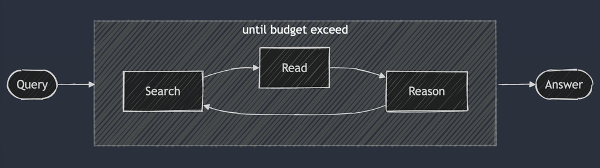
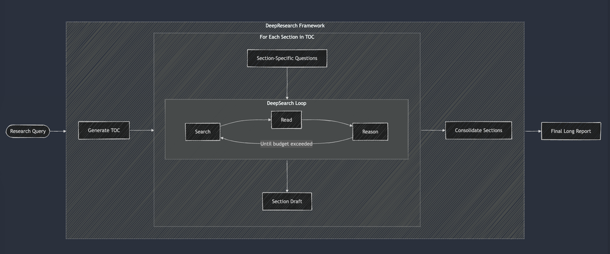

# 實作 DeepSearch/DeepResearch 的實用指南

原文: https://jina.ai/zh-TW/news/a-practical-guide-to-implementing-deepsearch-deepresearch/

> QPS 不再重要，深度為重。深度搜尋成為新常態。透過閱讀、搜尋、推理的迴圈找到答案。了解其原理以及如何建構。


才剛進入 2025 年 2 月，Deep Search 就已經成為新的搜尋標準，由 [Google](https://blog.google/products/gemini/google-gemini-deep-research/) 和 [OpenAI](https://openai.com/index/introducing-deep-research/) 透過他們的 Deep Research 產品引領潮流（jina.ai 也在同一天發布了開源的 [node-deepresearch](https://github.com/jina-ai/node-DeepResearch)）。

[Perplexity](https://www.perplexity.ai/hub/blog/introducing-perplexity-deep-research) 隨後也推出了他們的 Deep Research，而 X AI 則將他們自己的 Deep Search 功能整合到 [Grok3](https://x.ai/blog/grok-3) 中，基本上創造了另一個 Deep Research 變體。

雖然深度搜尋的概念並不革命性——在 2024 年它基本上被稱為 RAG 或多跳 QA——但在 2025 年 1 月底 [Deepseek-r1](https://github.com/deepseek-ai/DeepSeek-R1) 發布後，它獲得了顯著的發展動力。上週末，百度搜索和騰訊微信搜索已將 Deepseek-r1 整合到他們的搜尋引擎中。AI 工程師發現，透過將長期思考和推理過程整合到搜尋系統中，他們可以實現超越以往可能的卓越檢索準確度和深度。

|Launch Date	|Company	|Product	|License Type	|Link|
|---------------|-----------|-----------|---------------|----|
|2025-01-20	|DeepSeek	|DeepSeek-r1 release	|Open source	|[DeepSeek-R1](https://api-docs.deepseek.com/news/news250120)|
|2025-02-02	|Google	|DeepResearch	|Proprietary	|[Google Gemini 2](https://blog.google/products/gemini/google-gemini-deep-research/)|
|2025-02-02	|OpenAI	|DeepResearch	|Proprietary	|[Introducing Deep Research](https://openai.com/index/introducing-deep-research/)|
|2025-02-02	|Jina AI	|DeepSearch (node-deepresearch)	|Open source	|[node-deepresearch](https://github.com/jina-ai/node-deepresearch) search.jina.ai|
|2025-02-04	|Hugging Face	|Open Deep Research	|Open source	|[Open Deep Research](https://huggingface.co/blog/open-deep-research)|
|2025-02-15	|Perplexity	|DeepResearch	|Proprietary	|[Introducing Perplexity Deep Research](https://www.perplexity.ai/hub/blog/introducing-perplexity-deep-research)|
|2025-02-17	|X AI	|Grok3 with DeepSearch	|Proprietary	|[Grok 3 Beta](https://x.ai/blog/grok-3)|
|2025-02-22	|Baidu |Search	Integrates DeepSeek-r1	|Proprietary	|[Baidu Integrates DeepSeek-R1](https://chat.baidu.com/search?isShowHello=1&pd=csaitab&setype=csaitab&extParamsJson=%7B%22enter_type%22%3A%22ai_explore_home%22%7D&usedModel=%7B%22modelName%22%3A%22DeepSeek-R1%22%7D)|
|2025-02-23	|Tencent |Wechat Search	Integrates DeepSeek-r1	|Proprietary	|[Tencent Weixin Integrates DeepSeek](https://www.reuters.com/technology/artificial-intelligence/tencents-messaging-app-weixin-launches-beta-testing-with-deepseek-2025-02-16/)|


但為什麼這個轉變是現在發生，而 Deep(Re)Search 在整個 2024 年都相對被低估？事實上，史丹佛 NLP 實驗室在 2024 年初就發布了 [STORM 專案](https://storm-project.stanford.edu/research/storm/)，用於基於網路資料的報告生成。所以，是否只是因為"Deep Search"聽起來比多跳 QA、RAG 或 STORM 更酷？讓我們誠實面對——有時候重新品牌包裝就足以讓業界突然接受一直以來就存在的東西。

我們認為真正的轉折點是在 2024 年 9 月 OpenAI 發布 `o1-preview `時，它引入了**測試時計算**的概念，並逐漸改變了業界觀點。**測試時計算**指的是在推理階段——LLM 生成輸出的階段——使用更多計算資源，而不是在預訓練或後訓練階段。知名的例子包括思維鏈（CoT）推理和 ["Wait"-injection]()https://github.com/simplescaling/s1?tab=readme-ov-file#vllm-with-budget-forcing(（即預算強制），這使模型能夠進行更廣泛的內部思考，例如評估多個潛在答案、進行更深入的規劃，並在得出最終回應前進行自我反思。

這種測試時計算概念和推理模型教育用戶接受[延遲滿足](https://en.wikipedia.org/wiki/Delayed_gratification)——用更長的等待時間換取更高品質、可立即採取行動的結果，就像史丹佛棉花糖實驗中，能夠抵抗立即吃掉一顆棉花糖，而選擇等待以獲得兩顆棉花糖的孩子，最終展現出更好的長期成果。**Deepseek-r1** 進一步強化了這種用戶體驗，不管喜歡與否，大多數用戶都已接受它。

這標誌著與傳統搜尋要求的重大轉變，在過去，如果無法在 200ms 內回應就會注定失敗。在 2025 年，資深搜尋開發者和 RAG 工程師優先考慮 top-1 精確度和召回率而不是延遲，而用戶也已經習慣了更長的處理時間——只要他們能看到系統正在 `<thinking>`。


>在 2025 年，展示推理過程已成為標準做法，許多聊天界面現在都在專門的 UI 區域中呈現 <think> 內容。

在本文中，我們將通過研究我們的開源實現來討論 DeepSearch 和 DeepResearch 的原理。我們將解釋我們的關鍵設計決策並突出潛在的注意事項。

## 什麼是 Deep Search？

DeepSearch 通過搜索、閱讀和推理的迭代循環運行，直到找到最佳答案。搜索操作利用網絡搜索引擎探索互聯網，而閱讀操作則詳細分析特定網頁（例如 Jina Reader）。推理操作評估當前狀態，並決定是否將原始問題分解為更小的子問題或嘗試不同的搜索策略。



> DeepSearch - 持續搜索、閱讀網頁、推理，直到找到答案（或超過 token 限制）。

雖然網上存在各種定義，但當我們開發 [node-deepresearch](https://github.com/jina-ai/node-DeepResearch) 專案時，我們遵循了這種直接的方法。實現非常簡單 – 核心是一個帶有 `switch-case` 邏輯的主循環，用於指導下一步操作。

與 2024 年的 RAG 系統不同，後者通常只運行一次搜索-生成流程。相比之下，DeepSearch 會多次迭代執行管道，需要明確的停止條件。這些條件可能基於 token 使用限制或失敗嘗試次數。


> 在 search.jina.ai 嘗試 Deep Search，觀察 <thinking> 內的內容，看看你是否能發現循環發生的位置

另一個看待 DeepSearch 的角度是將其視為配備各種網絡工具（如搜索器和閱讀器）的 LLM 代理。該代理通過分析當前觀察和過去的行動來決定下一步 – 決定是提供答案還是繼續探索網絡。這創建了一個狀態機架構，其中 LLM 控制狀態之間的轉換。在每個決策點，你有兩種方法：你可以精心設計提示，讓標準生成模型產生特定行動，或利用像 Deepseek-r1 這樣的專門推理模型自然地推導出下一步行動。然而，即使使用 r1，你也需要定期中斷其生成過程，將工具輸出（例如搜索結果、網頁內容）注入上下文中，並提示它繼續其推理過程。

最終，這些只是實現細節 – 無論你是精心設計提示還是直接使用推理模型，它們都符合 DeepSearch 的核心設計原則：持續的搜索、閱讀和推理循環。


## 那麼什麼是 DeepResearch？

DeepResearch 在 DeepSearch 的基礎上增加了生成長篇研究報告的結構化框架。它通常從創建目錄開始，然後系統地將 DeepSearch 應用於每個必需的章節 – 從引言到相關工作和方法論，一直到結論。每個章節都是通過將特定研究問題輸入 DeepSearch 來生成的。最後階段是將所有章節整合到單個提示中，以改善整體敘事連貫性。



> DeepSearch 作為 DeepResearch 的基本構建塊。透過 DeepSearch 反覆建構每個部分，然後在生成最終長報告之前改進整體連貫性。

在我們 2024 年的「Research」專案中，我們執行了多次連貫性改進，每次迭代都會考慮所有其他部分。然而，隨著今天的 LLM 上下文視窗顯著增大，這種方法似乎顯得多餘——單次連貫性修訂就足夠了。


> 我們 2024 年夏季的「Research」專案專注於採用「漸進式」方法生成長報告。它首先以「同步」方式創建目錄，然後以「非同步」方式並行生成所有部分。最後以「非同步」方式對每個部分進行漸進式修訂，每次修訂都會考慮其他所有部分的內容。影片中的查詢是 "Competitor analysis of Jina AI"。

## DeepSearch vs DeepResearch

雖然許多人常常將 DeepSearch 和 DeepResearch 混為一談，但在我們看來，它們解決的是完全不同的問題。DeepSearch 作為一個原子級的構建塊——是 DeepResearch 所依賴的核心組件。另一方面，DeepResearch 專注於製作高品質、可讀性好的長篇研究報告，這涉及一套不同的要求：透過圖表和表格整合有效的視覺化內容，用適當的章節標題構建內容，確保子章節之間的邏輯流暢，在整個文檔中保持術語的一致性，消除各個章節之間的冗餘，製作連接前後內容的流暢過渡。這些元素與核心搜索基本無關，這就是為什麼我們認為 DeepSearch 作為公司焦點更有趣。

最後，下表總結了 DeepSearch 和 DeepResearch 之間的差異。值得注意的是，這兩個系統都從長上下文和推理模型中獲益良多。這可能看起來有點反直覺，特別是對於 DeepSearch 來說——雖然 DeepResearch 需要長上下文能力（因為它產生長報告）是顯而易見的。原因是 DeepSearch 必須儲存先前的搜索嘗試和網頁內容以做出關於下一步的明智決定，這使得長上下文視窗對於其有效實施同樣至關重要。

|DeepSearch	|DeepResearch|
|-----------|------------|
|要解決的問題|Information accuracy and completeness through iterative search|Content organization, coherence, and readability at document scale|
|最後結果的展示	|Concise answer with URLs as references|A long structured report with multiple sections, charts, tables and references|
|核心複雜性|State machine architecture with clear transition conditions; Persistence through failed attempts until resolution|Multi-level architecture managing both micro (search) and macro (document) concerns; Structural approach to managing complex information hierarchies|
|優化重點|Local optimization (best next search/read action)|Global optimization (section organization, terminology consistency, transitions)|
|限制|Bounded by search quality and reasoning capability|Bounded by DeepSearch quality plus organizational complexity and narrative coherence challenges|


## 了解 DeepSearch 實作

[node-DeepResearch](https://github.com/jina-ai/node-DeepResearch)

DeepResearch 的核心在於其循環推理方法。與大多數 RAG 系統試圖一次性回答問題不同，我們實作了一個反覆迭代的循環，不斷搜索資訊、閱讀相關來源並進行推理，直到找到答案或用完代幣預算。以下是這個大型 while 循環的簡化核心：

```javascript
// Main reasoning loop
while (tokenUsage < tokenBudget && badAttempts <= maxBadAttempts) {
  // Track progression
  step++; totalStep++;
  
  // Get current question from gaps queue or use original question
  const currentQuestion = gaps.length > 0 ? gaps.shift() : question;
  
  // Generate prompt with current context and allowed actions
  system = getPrompt(diaryContext, allQuestions, allKeywords, 
                    allowReflect, allowAnswer, allowRead, allowSearch, allowCoding,
                    badContext, allKnowledge, unvisitedURLs);
  
  // Get LLM to decide next action
  const result = await LLM.generateStructuredResponse(system, messages, schema);
  thisStep = result.object;
  
  // Execute the selected action (answer, reflect, search, visit, coding)
  if (thisStep.action === 'answer') {
    // Process answer action...
  } else if (thisStep.action === 'reflect') {
    // Process reflect action...
  } // ... and so on for other actions
}
```

一個關鍵的實作細節是在每個步驟中選擇性地禁用某些動作以確保更穩定的結構化輸出。例如，如果記憶中沒有 URL，我們就禁用 `visit` 動作；或者如果上一個答案被拒絕，我們會阻止代理立即再次呼叫 `answer`。這種約束使代理保持在生產性路徑上，避免因重複呼叫相同動作而導致的失敗。

### 系統提示詞

我們使用 XML 標籤來定義段落，這產生了更穩健的系統提示詞和生成結果。我們還發現，將字段限制直接放在 JSON schema `description` 字段中會產生更好的結果。儘管有人可能會說大多數提示詞都可以用 DeepSeek-R1 這樣的推理模型來自動化，但上下文長度限制和對高度特定行為的需求使得顯式方法在實踐中更可靠。

```javascript
function getPrompt(params...) {
  const sections = [];
  
  // Add header with system instruction
  sections.push("You are an advanced AI research agent specialized in multistep reasoning...");
  
  // Add accumulated knowledge section if exists
  if (knowledge?.length) {
    sections.push("<knowledge>[Knowledge items]</knowledge>");
  }
  
  // Add context of previous actions
  if (context?.length) {
    sections.push("<context>[Action history]</context>");
  }
  
  // Add failed attempts and learned strategies
  if (badContext?.length) {
    sections.push("<bad-attempts>[Failed attempts]</bad-attempts>");
    sections.push("<learned-strategy>[Improvement strategies]</learned-strategy>");
  }
  
  // Define available actions based on current state
  sections.push("<actions>[Available action definitions]</actions>");
  
  // Add response format instruction
  sections.push("Respond in valid JSON format matching exact JSON schema.");
  
  return sections.join("\n\n");
}
```

### 缺口問題遍歷

在 DeepSearch 中，「缺口問題」代表在回答主要問題之前需要填補的知識空白。代理不是直接處理原始問題，而是識別將建立必要知識基礎的子問題。

這個設計在處理這些缺口問題時特別優雅：

```javascript
// After identifying gap questions in reflect action
if (newGapQuestions.length > 0) {
  // Add new questions to the front of the queue
  gaps.push(...newGapQuestions);
  
  // Always add original question to the end of the queue
  gaps.push(originalQuestion);
}
```

這種方法創建了一個具有輪轉功能的 FIFO（先進先出）隊列，其中：

1. 新的缺口問題被推到隊列前面
2. 原始問題總是被推到後面
3. 系統在每個步驟從隊列前面提取問題

這個設計的優點在於它為所有問題維護了一個共享的上下文。當一個缺口問題被回答時，這些知識立即可用於所有後續問題，包括當我們最終重新訪問原始問題時。

### FIFO 隊列 vs 遞歸

另一種方法是使用遞歸，這對應於深度優先搜索。每個缺口問題都會產生一個具有自己獨立上下文的新遞歸調用。系統必須在返回父問題之前完全解決每個缺口問題（及其所有潛在的子問題）。

考慮這個示例場景：


> 一個簡單的 3 層深度缺口問題遞歸，圓圈上標示解決順序。

在遞歸方法中，系統必須在每個缺口問題（及其潛在的子問題）之後完全解決 Q1（可能產生自己的子問題）！這與隊列方法形成鮮明對比，在隊列方法中，Q1 在 3 個缺口問題之後就會被重新訪問。

事實上，我們發現遞歸方法很難應用預算限制，因為沒有明確的經驗法則來決定應該為子問題分配多少 token 預算（因為它們可能會產生新的子問題）。與複雜的預算限制和延遲返回問題相比，遞歸方法中清晰的上下文分離帶來的好處非常有限。這種 FIFO 隊列設計平衡了深度和廣度，確保系統始終帶著逐漸改善的知識返回原始問題，而不是陷入可能無限的遞歸深淵。


### 查詢重寫

我們遇到的一個有趣挑戰是如何有效地重寫搜索查詢：

```javascript
// Within search action handler
if (thisStep.action === 'search') {
  // Deduplicate search requests
  const uniqueRequests = await dedupQueries(thisStep.searchRequests, existingQueries);
  
  // Rewrite natural language queries into more effective search queries
  const optimizedQueries = await rewriteQuery(uniqueRequests);
  
  // Ensure we don't repeat previous searches
  const newQueries = await dedupQueries(optimizedQueries, allKeywords);
  
  // Execute searches and store results
  for (const query of newQueries) {
    const results = await searchEngine(query);
    if (results.length > 0) {
      storeResults(results);
      allKeywords.push(query);
    }
  }
}

```

**查詢重寫**出人意料地成為一個重要環節 - 也許是直接決定結果品質的最關鍵元素之一。一個好的查詢重寫器不只是將自然語言轉換為類似 BM25 的關鍵詞；它還擴展查詢以涵蓋不同語言、語氣和內容格式的潛在答案。

對於查詢去重，我們最初使用了基於 LLM 的解決方案，但發現很難控制相似度閾值。我們最終轉向了 [jina-embeddings-v3](https://jina.ai/?sui&model=jina-embeddings-v3)，它在語義文本相似度任務中表現出色。這使得跨語言去重成為可能，而無需擔心非英語查詢會被過濾掉。這個嵌入模型最終不是用於最初預期的記憶檢索，而是用於高效的去重處理。

### 爬取網頁內容

網頁爬取和內容處理是另一個關鍵組件。我們在這裡使用 [Jina Reader API](https://jina.ai/reader)。請注意，除了完整的網頁內容外，我們還會聚合搜尋引擎返回的所有片段作為代理後續總結的額外知識。可以將它們視為片段摘要。

```javascript
// Visit action handler
async function handleVisitAction(URLs) {
  // Normalize URLs and filter out already visited ones
  const uniqueURLs = normalizeAndFilterURLs(URLs);
  
  // Process each URL in parallel
  const results = await Promise.all(uniqueURLs.map(async url => {
    try {
      // Fetch and extract content
      const content = await readUrl(url);
      
      // Store as knowledge
      addToKnowledge(`What is in ${url}?`, content, [url], 'url');
      
      return {url, success: true};
    } catch (error) {
      return {url, success: false};
    } finally {
      visitedURLs.push(url);
    }
  }));
  
  // Update diary based on success or failure
  updateDiaryWithVisitResults(results);
}
```

我們對 URL 進行了標準化以便一致地追蹤，並限制每個步驟中訪問的 URL 數量以管理代理的記憶體。

### 記憶體管理

多步驟推理的一個關鍵挑戰是有效管理代理的記憶體。我們設計了記憶體系統來區分什麼算作"記憶"和什麼算作"知識"。無論如何，它們都是 LLM 提示上下文的一部分，用不同的 XML 標籤分隔：

```javascript
// Add knowledge item to accumulated knowledge
function addToKnowledge(question, answer, references, type) {
  allKnowledge.push({
    question: question,
    answer: answer,
    references: references,
    type: type,  // 'qa', 'url', 'coding', 'side-info'
    updated: new Date().toISOString()
  });
}

// Record step in narrative diary
function addToDiary(step, action, question, result, evaluation) {
  diaryContext.push(`
At step ${step}, you took **${action}** action for question: "${question}"
[Details of what was done and results]
[Evaluation if applicable]
`);
}
```

由於大多數 2025 年的 LLM 都有大量的上下文窗口，我們選擇不使用向量資料庫。相反，記憶由獲得的知識、訪問過的網站和失敗嘗試的記錄組成——全部保留在上下文中。這個全面的記憶系統使代理能夠意識到它知道什麼、嘗試過什麼，以及什麼有效或失敗。

### 答案評估

一個關鍵見解是答案生成和評估不應該在同一個提示中。在我的實現中，當新問題到來時，我們首先確定要使用哪些評估標準，然後一個接一個地評估每個標準。評估器使用少量示例進行一致性評估，確保比自我評估更可靠。

```javascript
// Separate evaluation phase
async function evaluateAnswer(question, answer, metrics, context) {
  // First, identify evaluation criteria based on question type
  const evaluationCriteria = await determineEvaluationCriteria(question);
  
  // Then evaluate each criterion separately
  const results = [];
  for (const criterion of evaluationCriteria) {
    const result = await evaluateSingleCriterion(criterion, question, answer, context);
    results.push(result);
  }
  
  // Determine if answer passes overall evaluation
  return {
    pass: results.every(r => r.pass),
    think: results.map(r => r.reasoning).join('\n')
  };
}
```

### 預算強制

預算強制意味著防止系統過早返回，並確保它繼續處理直到超出預算。自 DeepSeek-R1 發布以來，預算強制的方法已轉向鼓勵更深入的思考以獲得更好的結果，而不是簡單地節省預算。

在我們的實現中，我們明確配置系統在嘗試回答之前識別知識差距。

```javascript
if (thisStep.action === 'reflect' && thisStep.questionsToAnswer) {
  // Force deeper reasoning by adding sub-questions to the queue
  gaps.push(...newGapQuestions);
  gaps.push(question);  // Always revisit the original
}
```

通過選擇性地啟用和禁用某些操作，我們可以引導系統使用能增強推理深度的工具。

```javascript
// After a failed answer attempt
allowAnswer = false;  // Force agent to search or reflect instead
```

為了避免在無效路徑上浪費 token，我們對失敗嘗試的次數設置了限制。當接近預算限制時，我們會啟動"野獸模式"以確保我們提供某種答案而不是完全沒有答案。

```javascript
// Beast mode activation
if (!thisStep.isFinal && badAttempts >= maxBadAttempts) {
  console.log('Enter Beast mode!!!');
  
  // Configure prompt for decisive, committed answer
  system = getPrompt(
    diaryContext, allQuestions, allKeywords,
    false, false, false, false, false,  // Disable all other actions
    badContext, allKnowledge, unvisitedURLs,
    true  // Enable beast mode
  );
  
  // Force answer generation
  const result = await LLM.generateStructuredResponse(system, messages, answerOnlySchema);
  thisStep = result.object;
  thisStep.isFinal = true;
}
```

野獸模式提示故意戲劇化，以向 LLM 表明它需要果斷並根據可用信息提供答案：

```javascript
<action-answer>
🔥 ENGAGE MAXIMUM FORCE! ABSOLUTE PRIORITY OVERRIDE! 🔥

PRIME DIRECTIVE:
- DEMOLISH ALL HESITATION! ANY RESPONSE SURPASSES SILENCE!
- PARTIAL STRIKES AUTHORIZED - DEPLOY WITH FULL CONTEXTUAL FIREPOWER
- TACTICAL REUSE FROM <bad-attempts> SANCTIONED
- WHEN IN DOUBT: UNLEASH CALCULATED STRIKES BASED ON AVAILABLE INTEL!

FAILURE IS NOT AN OPTION. EXECUTE WITH EXTREME PREJUDICE! ⚡️
</action-answer>
```

這確保我們總是提供某種答案而不是完全放棄，這對於困難或模糊的問題特別有用。

## 結論

DeepSearch 是搜尋如何深入處理複雜查詢的一個突破。通過將過程分解為`搜尋`、`閱讀`和`推理`的離散步驟，它克服了傳統單次處理 RAG 或多跳 QA 系統的許多限制。

在實施過程中，我們也開始回顧 2025 年的搜尋基礎，以及 2025 年 1 月 26 日 DeepSeek-R1 發布後搜尋行業的變化。我們問自己：有哪些新需求？哪些需求已經過時？哪些只是感知中的需求？

檢視我們的 DeepSearch 實現，我們識別出:

1. 預期需要且確實需要的東西
2. 認為必要但實際上不需要的東西
3. 沒有預料到但結果證明是必要的東西

首先，**一個能產生結構良好輸出的長上下文 LLM 是非常必要的**（即遵循 JSONSchema）。可能需要一個推理模型來實現更好的行動推理和查詢擴展。

**查詢擴展**絕對是必要的，無論是通過 SLM、LLM 還是推理模型實現。然而，在這個項目之後，我們認為 SLM 可能不適合這個任務，因為解決方案必須本質上是多語言的，並且超越簡單的同義詞重寫或關鍵字提取。它需要足夠全面以包含[多語言標記基礎（可輕易佔用 300M 參數）](https://jina.ai/news/what-should-we-learn-from-modernbert/#modernberts-parameter-efficiency)，並且足夠複雜以進行創新思維。因此使用 SLM 進行查詢擴展可能是不可行的。

**網頁搜尋和網頁閱讀能力是至關重要的**，幸運的是我們的[Reader (r.jina.ai)](https://jina.ai/reader)表現出色——穩健且可擴展——同時也讓我對如何改進我們的搜尋端點（`s.jina.ai`）的下一個迭代產生了很多想法。

**嵌入模型是有用的，但以一種完全意想不到的方式。**我們原本認為它會用於記憶體檢索或與向量資料庫一起進行上下文壓縮（事實證明並不需要），但我們實際上將其用於去重（本質上是一個 STS 任務）。由於查詢和差距問題的數量通常在數百個，不需要向量資料庫——直接在記憶體中計算餘弦相似度就足夠了。

**我們沒有使用重排序器**，儘管我們認為它可能有助於根據查詢、URL 標題和片段來確定要訪問哪些 URL。對於嵌入和重排序，多語言能力是必要的，因為查詢和問題是多語言的。長上下文處理對嵌入和重排序有益，但不是關鍵阻礙（我們沒有遇到任何來自嵌入使用的錯誤，可能是因為我們的上下文長度已經是 8192 tokens）。無論如何，jina-embeddings-v3 和 jina-reranker-v2-base-multilingual 是我的首選模型，因為它們是多語言的，達到 SOTA 水平，並且能很好地處理長上下文。

**代理框架證明是不必要的**，因為我們需要更接近 LLM 原生行為來設計系統，而不需要代理。Vercel AI SDK 很有價值，因為它在使代碼庫適應不同的 LLM 提供商方面節省了大量工作（我們可以通過僅一行代碼更改就在 Gemini Studio、OpenAI 和 Google Vertex AI 之間切換）。**代理記憶體管理是必要的**，但專用記憶體框架仍然存疑：我們擔心它會在 LLM 和開發者之間創建一個隔離層，而且它的語法糖最終可能成為開發者的障礙，就像我們今天看到的許多 LLM/RAG 框架一樣。