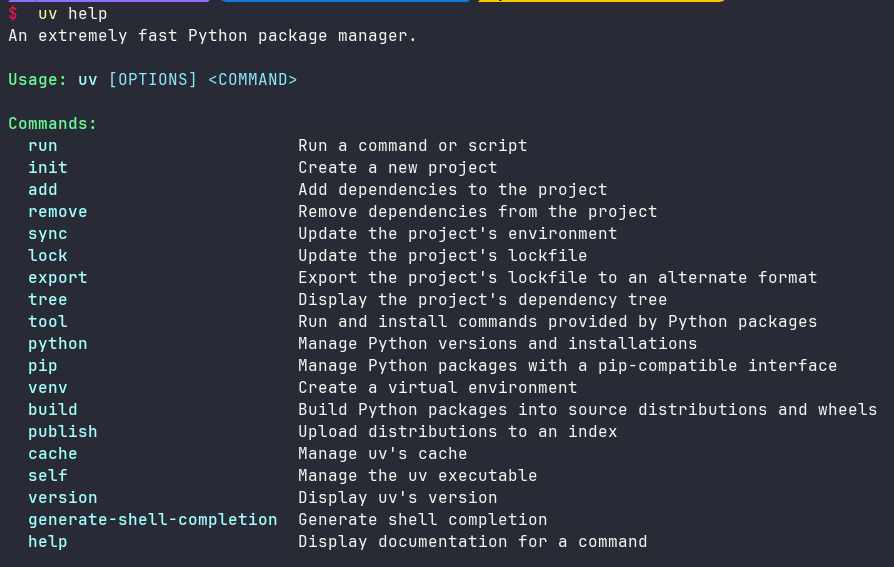

# uv 工具快速上手

Python 套件管理生態存在多種工具，如 `pip` `pip-tools` `poetry` `conda` 等，各自具備一定功能。

而今天介紹的 `uv` 是 Astral 公司推出的一款基於 Rust 編寫的 Python 套件管理工具，旨在成為 Python 的 Cargo。

它提供了快速、可靠且易用的套件管理體驗，在效能、相容性和功能上都有出色表現，為 Python 專案的開發和管理帶來了新的選擇。

## 為什麼用 uv

與其他 Python 中的套件管理工具相比，`uv` 更像是全能選手，它的優勢在於:

- 速度快：得益於 Rust，`uv` 工具的速度讓人驚艷，例如安裝依賴，速度比其他工具快很多
- 功能全面：`uv` 是「一站式服務」的工具，從安裝 Python、管理虛擬環境，到安裝和管理包，再到管理專案依賴，它統統都能處理得很好
- 前景光明：背後有創投公司 Astral 支持，並採用了 MIT 許可，即使未來出現問題，社區也有應對的辦法

使用 `uv`，也可以像 NodeJS 或 Rust 專案那樣方便的管理依賴。

## 如何安裝

使用 curl 下載腳本並執行 sh：

```bash
curl -LsSf https://astral.sh/uv/install.sh | sh
```

如果您的系統沒有curl，您可以使用 wget：

```bash
wget -qO- https://astral.sh/uv/install.sh | sh
```

透過在 URL 中包含特定版本來請求該版本：

```bash
curl -LsSf https://astral.sh/uv/0.6.9/install.sh | sh
```

安裝之後，可以透過 `uv help` 指令檢查是否安裝成功：



## 如何使用

下面示範如何使用 uv 來管理 Python 專案。

使用 uv 之前，創建一個 Python 專案對我來說就是創建一個資料夾而已。

使用 uv 之後，終於有了一些項目的感覺，對於 uv，我使用時間也不長，疏漏或錯誤的地方歡迎指正！

接下來，從建立一個專案開始，示範我使用 uv 時常用的一些功能。

首先，介紹 uv 工具主要使用的兩個檔案：

- `pyproject.toml`：定義專案的主要依賴，包括專案名稱、版本、描述、支援的 Python 版本等信息
- `uv.lock`：記錄項目的所有依賴，包括依賴的依賴，且跨平台，確保在不同環境下安裝的一致性。這個文件由 uv 自動管理，不要手動編輯

### 建立專案

接下來，建立一個專案，使用 `uv init <project dir>` 命令。

```bash
$  uv init myproject
Initialized project `myproject` at `/home/dxlab/ws/test/myproject`

$ cd myproject/

$ ls
main.py  pyproject.toml  README.md

$ tree
.
├── main.py
├── pyproject.toml
└── README.md

1 directory, 3 files
```

透過 init 創建專案之後，uv 工具貼心地幫助我們產生了一些預設檔。

其中 `main.py` 只是一段示範用的程式碼，

隨後我們可以根據實際的項目需要刪除這個程式碼文件，換成自己的實際程式碼。

```python title="main.py"
def main():
    print("Hello from myproject!")


if __name__ == "__main__":
    main()
```

```toml title="pyproject.toml"
[project]
name = "myproject"
version = "0.1.0"
description = "Add your description here"
readme = "README.md"
requires-python = ">=3.13"
dependencies = []
```

!!! info
    注意，`uv init` 建立專案之後，會自動使用專案 Git 來管理。

### 操作環境

創建專案之後，我們進入專案根資料夾的第一件事就是同步專案依賴。

```bash
$ uv sync
Using CPython 3.13.2
Creating virtual environment at: .venv
Resolved 1 package in 13ms
Audited in 0.21ms
```

同步之後，會自動尋找或下載適當的 Python 版本，建立並設定專案的虛擬環境，建立完整的依賴清單並寫入 `uv.lock` 文件，最後將依賴同步到虛擬環境。

我們這個是新創建的專案，沒有什麼依賴，所以 `uv.lock` 文件中的內容也比較簡單。

``` title="uv.lock"
version = 1
revision = 1
requires-python = ">=3.13"

[[package]]
name = "myproject"
version = "0.1.0"
source = { virtual = "." }
```

uv sync 同步之後，就可以運行專案的程式碼了。

既然使用 uv 管理專案的話，我們就使用的 uv 命令來運行程式碼，不要像以前那樣使用 python xxx.py 來運行。

我們可以試著運行專案創建時自動產生的程式碼。

```bash
$ uv run main.py 
Hello from myproject!
```

### 管理依賴

管理依賴是我使用 uv 工具的主要目的，使用 uv 添加依賴非常簡單，和 npm 和 cargo 差不多。

```bash
$ uv add pandas
Resolved 7 packages in 731ms
Prepared 6 packages in 2.36s
Installed 6 packages in 20ms
 + numpy==2.2.4
 + pandas==2.2.3
 + python-dateutil==2.9.0.post0
 + pytz==2025.1
 + six==1.17.0
 + tzdata==2025.1
```

嘗試安裝了一個 `pandas` 依賴（pandas 依賴的包也自動安裝了），從上面日誌可以看出速度非常快。

這時再看看 `uv.lock` 文件的變化。

``` title="uv.lock"
version = 1
revision = 1
requires-python = ">=3.13"

[[package]]
name = "myproject"
version = "0.1.0"
source = { virtual = "." }
dependencies = [
    { name = "pandas" },
]

[package.metadata]
requires-dist = [{ name = "pandas", specifier = ">=2.2.3" }]

[[package]]
name = "numpy"
version = "2.2.4"
source = { registry = "https://pypi.org/simple" }
sdist = { url = "https://files.pythonhosted.org/packages/e1/78/31103410a57bc2c2b93a3597340a8119588571f6a4539067546cb9a0bfac/numpy-2.2.4.tar.gz", hash = "sha256:9ba03692a45d3eef66559efe1d1096c4b9b75c0986b5dff5530c378fb8331d4f", size = 20270701 }
wheels = [
    { url = "https://files.pythonhosted.org/packages/2a/d0/bd5ad792e78017f5decfb2ecc947422a3669a34f775679a76317af671ffc/numpy-2.2.4-cp313-cp313-macosx_10_13_x86_64.whl", hash = "sha256:1cf4e5c6a278d620dee9ddeb487dc6a860f9b199eadeecc567f777daace1e9e7", size = 20933623 },
    { url = "https://files.pythonhosted.org/packages/c3/bc/2b3545766337b95409868f8e62053135bdc7fa2ce630aba983a2aa60b559/numpy-2.2.4-cp313-cp313-macosx_11_0_arm64.whl", hash = "sha256:1974afec0b479e50438fc3648974268f972e2d908ddb6d7fb634598cdb8260a0", size = 14148681 },
    { url = "https://files.pythonhosted.org/packages/6a/70/67b24d68a56551d43a6ec9fe8c5f91b526d4c1a46a6387b956bf2d64744e/numpy-2.2.4-cp313-cp313-macosx_14_0_arm64.whl", hash = "sha256:79bd5f0a02aa16808fcbc79a9a376a147cc1045f7dfe44c6e7d53fa8b8a79392", size = 5148759 },
    { url = "https://files.pythonhosted.org/packages/1c/8b/e2fc8a75fcb7be12d90b31477c9356c0cbb44abce7ffb36be39a0017afad/numpy-2.2.4-cp313-cp313-macosx_14_0_x86_64.whl", hash = "sha256:3387dd7232804b341165cedcb90694565a6015433ee076c6754775e85d86f1fc", size = 6683092 },
    { url = "https://files.pythonhosted.org/packages/13/73/41b7b27f169ecf368b52533edb72e56a133f9e86256e809e169362553b49/numpy-2.2.4-cp313-cp313-manylinux_2_17_aarch64.manylinux2014_aarch64.whl", hash = "sha256:6f527d8fdb0286fd2fd97a2a96c6be17ba4232da346931d967a0630050dfd298", size = 14081422 },
    { url = "https://files.pythonhosted.org/packages/4b/04/e208ff3ae3ddfbafc05910f89546382f15a3f10186b1f56bd99f159689c2/numpy-2.2.4-cp313-cp313-manylinux_2_17_x86_64.manylinux2014_x86_64.whl", hash = "sha256:bce43e386c16898b91e162e5baaad90c4b06f9dcbe36282490032cec98dc8ae7", size = 16132202 },
    { url = "https://files.pythonhosted.org/packages/fe/bc/2218160574d862d5e55f803d88ddcad88beff94791f9c5f86d67bd8fbf1c/numpy-2.2.4-cp313-cp313-musllinux_1_2_aarch64.whl", hash = "sha256:31504f970f563d99f71a3512d0c01a645b692b12a63630d6aafa0939e52361e6", size = 15573131 },
    { url = "https://files.pythonhosted.org/packages/a5/78/97c775bc4f05abc8a8426436b7cb1be806a02a2994b195945600855e3a25/numpy-2.2.4-cp313-cp313-musllinux_1_2_x86_64.whl", hash = "sha256:81413336ef121a6ba746892fad881a83351ee3e1e4011f52e97fba79233611fd", size = 17894270 },
    { url = "https://files.pythonhosted.org/packages/b9/eb/38c06217a5f6de27dcb41524ca95a44e395e6a1decdc0c99fec0832ce6ae/numpy-2.2.4-cp313-cp313-win32.whl", hash = "sha256:f486038e44caa08dbd97275a9a35a283a8f1d2f0ee60ac260a1790e76660833c", size = 6308141 },
    { url = "https://files.pythonhosted.org/packages/52/17/d0dd10ab6d125c6d11ffb6dfa3423c3571befab8358d4f85cd4471964fcd/numpy-2.2.4-cp313-cp313-win_amd64.whl", hash = "sha256:207a2b8441cc8b6a2a78c9ddc64d00d20c303d79fba08c577752f080c4007ee3", size = 12636885 },
    { url = "https://files.pythonhosted.org/packages/fa/e2/793288ede17a0fdc921172916efb40f3cbc2aa97e76c5c84aba6dc7e8747/numpy-2.2.4-cp313-cp313t-macosx_10_13_x86_64.whl", hash = "sha256:8120575cb4882318c791f839a4fd66161a6fa46f3f0a5e613071aae35b5dd8f8", size = 20961829 },
    { url = "https://files.pythonhosted.org/packages/3a/75/bb4573f6c462afd1ea5cbedcc362fe3e9bdbcc57aefd37c681be1155fbaa/numpy-2.2.4-cp313-cp313t-macosx_11_0_arm64.whl", hash = "sha256:a761ba0fa886a7bb33c6c8f6f20213735cb19642c580a931c625ee377ee8bd39", size = 14161419 },
    { url = "https://files.pythonhosted.org/packages/03/68/07b4cd01090ca46c7a336958b413cdbe75002286295f2addea767b7f16c9/numpy-2.2.4-cp313-cp313t-macosx_14_0_arm64.whl", hash = "sha256:ac0280f1ba4a4bfff363a99a6aceed4f8e123f8a9b234c89140f5e894e452ecd", size = 5196414 },
    { url = "https://files.pythonhosted.org/packages/a5/fd/d4a29478d622fedff5c4b4b4cedfc37a00691079623c0575978d2446db9e/numpy-2.2.4-cp313-cp313t-macosx_14_0_x86_64.whl", hash = "sha256:879cf3a9a2b53a4672a168c21375166171bc3932b7e21f622201811c43cdd3b0", size = 6709379 },
    { url = "https://files.pythonhosted.org/packages/41/78/96dddb75bb9be730b87c72f30ffdd62611aba234e4e460576a068c98eff6/numpy-2.2.4-cp313-cp313t-manylinux_2_17_aarch64.manylinux2014_aarch64.whl", hash = "sha256:f05d4198c1bacc9124018109c5fba2f3201dbe7ab6e92ff100494f236209c960", size = 14051725 },
    { url = "https://files.pythonhosted.org/packages/00/06/5306b8199bffac2a29d9119c11f457f6c7d41115a335b78d3f86fad4dbe8/numpy-2.2.4-cp313-cp313t-manylinux_2_17_x86_64.manylinux2014_x86_64.whl", hash = "sha256:e2f085ce2e813a50dfd0e01fbfc0c12bbe5d2063d99f8b29da30e544fb6483b8", size = 16101638 },
    { url = "https://files.pythonhosted.org/packages/fa/03/74c5b631ee1ded596945c12027649e6344614144369fd3ec1aaced782882/numpy-2.2.4-cp313-cp313t-musllinux_1_2_aarch64.whl", hash = "sha256:92bda934a791c01d6d9d8e038363c50918ef7c40601552a58ac84c9613a665bc", size = 15571717 },
    { url = "https://files.pythonhosted.org/packages/cb/dc/4fc7c0283abe0981e3b89f9b332a134e237dd476b0c018e1e21083310c31/numpy-2.2.4-cp313-cp313t-musllinux_1_2_x86_64.whl", hash = "sha256:ee4d528022f4c5ff67332469e10efe06a267e32f4067dc76bb7e2cddf3cd25ff", size = 17879998 },
    { url = "https://files.pythonhosted.org/packages/e5/2b/878576190c5cfa29ed896b518cc516aecc7c98a919e20706c12480465f43/numpy-2.2.4-cp313-cp313t-win32.whl", hash = "sha256:05c076d531e9998e7e694c36e8b349969c56eadd2cdcd07242958489d79a7286", size = 6366896 },
    { url = "https://files.pythonhosted.org/packages/3e/05/eb7eec66b95cf697f08c754ef26c3549d03ebd682819f794cb039574a0a6/numpy-2.2.4-cp313-cp313t-win_amd64.whl", hash = "sha256:188dcbca89834cc2e14eb2f106c96d6d46f200fe0200310fc29089657379c58d", size = 12739119 },
]

[[package]]
name = "pandas"
version = "2.2.3"
source = { registry = "https://pypi.org/simple" }
dependencies = [
    { name = "numpy" },
    { name = "python-dateutil" },
    { name = "pytz" },
    { name = "tzdata" },
]
sdist = { url = "https://files.pythonhosted.org/packages/9c/d6/9f8431bacc2e19dca897724cd097b1bb224a6ad5433784a44b587c7c13af/pandas-2.2.3.tar.gz", hash = "sha256:4f18ba62b61d7e192368b84517265a99b4d7ee8912f8708660fb4a366cc82667", size = 4399213 }
wheels = [
    { url = "https://files.pythonhosted.org/packages/64/22/3b8f4e0ed70644e85cfdcd57454686b9057c6c38d2f74fe4b8bc2527214a/pandas-2.2.3-cp313-cp313-macosx_10_13_x86_64.whl", hash = "sha256:f00d1345d84d8c86a63e476bb4955e46458b304b9575dcf71102b5c705320015", size = 12477643 },
    { url = "https://files.pythonhosted.org/packages/e4/93/b3f5d1838500e22c8d793625da672f3eec046b1a99257666c94446969282/pandas-2.2.3-cp313-cp313-macosx_11_0_arm64.whl", hash = "sha256:3508d914817e153ad359d7e069d752cdd736a247c322d932eb89e6bc84217f28", size = 11281573 },
    { url = "https://files.pythonhosted.org/packages/f5/94/6c79b07f0e5aab1dcfa35a75f4817f5c4f677931d4234afcd75f0e6a66ca/pandas-2.2.3-cp313-cp313-manylinux2014_aarch64.manylinux_2_17_aarch64.whl", hash = "sha256:22a9d949bfc9a502d320aa04e5d02feab689d61da4e7764b62c30b991c42c5f0", size = 15196085 },
    { url = "https://files.pythonhosted.org/packages/e8/31/aa8da88ca0eadbabd0a639788a6da13bb2ff6edbbb9f29aa786450a30a91/pandas-2.2.3-cp313-cp313-manylinux_2_17_x86_64.manylinux2014_x86_64.whl", hash = "sha256:f3a255b2c19987fbbe62a9dfd6cff7ff2aa9ccab3fc75218fd4b7530f01efa24", size = 12711809 },
    { url = "https://files.pythonhosted.org/packages/ee/7c/c6dbdb0cb2a4344cacfb8de1c5808ca885b2e4dcfde8008266608f9372af/pandas-2.2.3-cp313-cp313-musllinux_1_2_aarch64.whl", hash = "sha256:800250ecdadb6d9c78eae4990da62743b857b470883fa27f652db8bdde7f6659", size = 16356316 },
    { url = "https://files.pythonhosted.org/packages/57/b7/8b757e7d92023b832869fa8881a992696a0bfe2e26f72c9ae9f255988d42/pandas-2.2.3-cp313-cp313-musllinux_1_2_x86_64.whl", hash = "sha256:6374c452ff3ec675a8f46fd9ab25c4ad0ba590b71cf0656f8b6daa5202bca3fb", size = 14022055 },
    { url = "https://files.pythonhosted.org/packages/3b/bc/4b18e2b8c002572c5a441a64826252ce5da2aa738855747247a971988043/pandas-2.2.3-cp313-cp313-win_amd64.whl", hash = "sha256:61c5ad4043f791b61dd4752191d9f07f0ae412515d59ba8f005832a532f8736d", size = 11481175 },
    { url = "https://files.pythonhosted.org/packages/76/a3/a5d88146815e972d40d19247b2c162e88213ef51c7c25993942c39dbf41d/pandas-2.2.3-cp313-cp313t-macosx_10_13_x86_64.whl", hash = "sha256:3b71f27954685ee685317063bf13c7709a7ba74fc996b84fc6821c59b0f06468", size = 12615650 },
    { url = "https://files.pythonhosted.org/packages/9c/8c/f0fd18f6140ddafc0c24122c8a964e48294acc579d47def376fef12bcb4a/pandas-2.2.3-cp313-cp313t-macosx_11_0_arm64.whl", hash = "sha256:38cf8125c40dae9d5acc10fa66af8ea6fdf760b2714ee482ca691fc66e6fcb18", size = 11290177 },
    { url = "https://files.pythonhosted.org/packages/ed/f9/e995754eab9c0f14c6777401f7eece0943840b7a9fc932221c19d1abee9f/pandas-2.2.3-cp313-cp313t-manylinux2014_aarch64.manylinux_2_17_aarch64.whl", hash = "sha256:ba96630bc17c875161df3818780af30e43be9b166ce51c9a18c1feae342906c2", size = 14651526 },
    { url = "https://files.pythonhosted.org/packages/25/b0/98d6ae2e1abac4f35230aa756005e8654649d305df9a28b16b9ae4353bff/pandas-2.2.3-cp313-cp313t-manylinux_2_17_x86_64.manylinux2014_x86_64.whl", hash = "sha256:1db71525a1538b30142094edb9adc10be3f3e176748cd7acc2240c2f2e5aa3a4", size = 11871013 },
    { url = "https://files.pythonhosted.org/packages/cc/57/0f72a10f9db6a4628744c8e8f0df4e6e21de01212c7c981d31e50ffc8328/pandas-2.2.3-cp313-cp313t-musllinux_1_2_aarch64.whl", hash = "sha256:15c0e1e02e93116177d29ff83e8b1619c93ddc9c49083f237d4312337a61165d", size = 15711620 },
    { url = "https://files.pythonhosted.org/packages/ab/5f/b38085618b950b79d2d9164a711c52b10aefc0ae6833b96f626b7021b2ed/pandas-2.2.3-cp313-cp313t-musllinux_1_2_x86_64.whl", hash = "sha256:ad5b65698ab28ed8d7f18790a0dc58005c7629f227be9ecc1072aa74c0c1d43a", size = 13098436 },
]

[[package]]
name = "python-dateutil"
version = "2.9.0.post0"
source = { registry = "https://pypi.org/simple" }
dependencies = [
    { name = "six" },
]
sdist = { url = "https://files.pythonhosted.org/packages/66/c0/0c8b6ad9f17a802ee498c46e004a0eb49bc148f2fd230864601a86dcf6db/python-dateutil-2.9.0.post0.tar.gz", hash = "sha256:37dd54208da7e1cd875388217d5e00ebd4179249f90fb72437e91a35459a0ad3", size = 342432 }
wheels = [
    { url = "https://files.pythonhosted.org/packages/ec/57/56b9bcc3c9c6a792fcbaf139543cee77261f3651ca9da0c93f5c1221264b/python_dateutil-2.9.0.post0-py2.py3-none-any.whl", hash = "sha256:a8b2bc7bffae282281c8140a97d3aa9c14da0b136dfe83f850eea9a5f7470427", size = 229892 },
]

[[package]]
name = "pytz"
version = "2025.1"
source = { registry = "https://pypi.org/simple" }
sdist = { url = "https://files.pythonhosted.org/packages/5f/57/df1c9157c8d5a05117e455d66fd7cf6dbc46974f832b1058ed4856785d8a/pytz-2025.1.tar.gz", hash = "sha256:c2db42be2a2518b28e65f9207c4d05e6ff547d1efa4086469ef855e4ab70178e", size = 319617 }
wheels = [
    { url = "https://files.pythonhosted.org/packages/eb/38/ac33370d784287baa1c3d538978b5e2ea064d4c1b93ffbd12826c190dd10/pytz-2025.1-py2.py3-none-any.whl", hash = "sha256:89dd22dca55b46eac6eda23b2d72721bf1bdfef212645d81513ef5d03038de57", size = 507930 },
]

[[package]]
name = "six"
version = "1.17.0"
source = { registry = "https://pypi.org/simple" }
sdist = { url = "https://files.pythonhosted.org/packages/94/e7/b2c673351809dca68a0e064b6af791aa332cf192da575fd474ed7d6f16a2/six-1.17.0.tar.gz", hash = "sha256:ff70335d468e7eb6ec65b95b99d3a2836546063f63acc5171de367e834932a81", size = 34031 }
wheels = [
    { url = "https://files.pythonhosted.org/packages/b7/ce/149a00dd41f10bc29e5921b496af8b574d8413afcd5e30dfa0ed46c2cc5e/six-1.17.0-py2.py3-none-any.whl", hash = "sha256:4721f391ed90541fddacab5acf947aa0d3dc7d27b2e1e8eda2be8970586c3274", size = 11050 },
]

[[package]]
name = "tzdata"
version = "2025.1"
source = { registry = "https://pypi.org/simple" }
sdist = { url = "https://files.pythonhosted.org/packages/43/0f/fa4723f22942480be4ca9527bbde8d43f6c3f2fe8412f00e7f5f6746bc8b/tzdata-2025.1.tar.gz", hash = "sha256:24894909e88cdb28bd1636c6887801df64cb485bd593f2fd83ef29075a81d694", size = 194950 }
wheels = [
    { url = "https://files.pythonhosted.org/packages/0f/dd/84f10e23edd882c6f968c21c2434fe67bd4a528967067515feca9e611e5e/tzdata-2025.1-py2.py3-none-any.whl", hash = "sha256:7e127113816800496f027041c570f50bcd464a020098a3b6b199517772303639", size = 346762 },
]
```

上面的日誌中我刪除了很多內容，因為整體內容太多，詳細記錄了每個套件以及它依賴的套件的情況。

`uv.lock` 這個檔案我們不要手動去編輯它，使用 `uv` 工具去管理它。

在引入了 `pandas` 之後，我們看看是否可以在 `main.py` 中使用。

```python title="main.py"
import pandas as pd


def main():
    print("Hello from myproject!")
    df = pd.DataFrame(
        {
            "A": [1, 2, 3],
            "B": [4, 5, 6],
        }
    )
    print(df)


if __name__ == "__main__":
    main()

```

執行:

```bash
$ uv run main.py 
Hello from myproject!
   A  B
0  1  4
1  2  5
2  3  6
```

可以正常使用安裝的包 pandas，下面在試試刪除依賴會怎麼樣。

```bash
$ uv remove pandas
Resolved 1 package in 1ms
Uninstalled 6 packages in 32ms
 - numpy==2.2.4
 - pandas==2.2.3
 - python-dateutil==2.9.0.post0
 - pytz==2025.1
 - six==1.17.0
 - tzdata==2025.1
```

使用 `uv remove` 指令刪除 pandas 包之後，也會自動刪除 pandas 依賴的其他包，

我們看到 `uv.lock` 文件也恢復到最初的內容。

再試試運行 `main.py` 看看。

```bash
$ uv run main.py 
Traceback (most recent call last):
  File "/home/dxlab/ws/test/myproject/main.py", line 1, in <module>
    import pandas as pd
ModuleNotFoundError: No module named 'pandas'
```

果然，無法運行了。


### 區分開發與生產環境

還有一個比較常用的功能是區分開發環境和生產環境的依賴，這個功能在 NodeJS 和 Rust 中很常見。

例如，我們想把 `pandas` 安裝到開發環境中，而把 `requests` 安裝到生產環境。

```bash
$ uv add --group dev pandas
Resolved 7 packages in 320ms
Installed 6 packages in 18ms
 + numpy==2.2.4
 + pandas==2.2.3
 + python-dateutil==2.9.0.post0
 + pytz==2025.1
 + six==1.17.0
 + tzdata==2025.1

$ uv add --group production requests
Resolved 12 packages in 548ms
Prepared 5 packages in 313ms
Installed 5 packages in 2ms
 + certifi==2025.1.31
 + charset-normalizer==3.4.1
 + idna==3.10
 + requests==2.32.3
 + urllib3==2.3.0
```

安裝之後，`uv.lock` 檔案自動添加了各個套件及其依賴，這裡不再贅述。

從專案的 `pyproject.toml` 中可以看出不同環境的包依賴。

```toml title="pyproject.toml"
[project]
name = "myproject"
version = "0.1.0"
description = "Add your description here"
readme = "README.md"
requires-python = ">=3.13"
dependencies = []

[dependency-groups]
dev = [
    "pandas>=2.2.3",
]
production = [
    "requests>=2.32.3",
]
```
