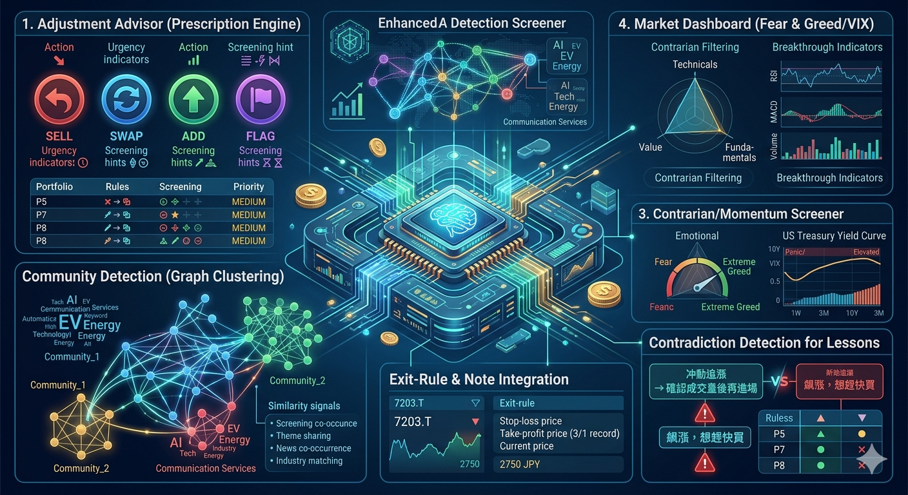

# 用 Claude Code Skills 投資分析進階



原文: [Claude Code Skills × 投資分析 Vol.3 — 処方箋エンジン・逆張り検出・銘柄クラスタリング](https://qiita.com/okikusan-public/items/1765d6afb8c548f019f1)

## 運用階段新增的7個功能

[上篇文章（Vol.2）](https://zenn.dev/okikusan/articles/37dfaec84afec2)中介紹了使用 Claude Code Skills 的投資分析 AI GraphRAG（Neo4j 知識圖譜）建立了「越用越聰明」的機制，開發大致完成——我是這樣結尾的。

實際上開始每天使用後， **新的需求一個一個浮現出來。**

- 「用篩選找到的股票，結果都只是類似的群組嗎？」  
- 「健康檢查發出警告，但具體要做什麼也不清楚」  
- 「想撿便宜被低估的股票，但光看價值指標不夠」  
- 「設定了停損線，但不知不覺就忘了」

實際開始運用後才發現的不方便。我用 Claude Code Skills 逐一解決的結果，總共新增了約60個功能（98次提交）。

本篇文章要從中介紹 **7個新功能 + 重構的思考方式**。只要「用自然語言詢問」，就會顯示投資組合的處方籤、找出股票隱藏的群組、或偵測到逆勢買入的機會。用實際輸出一起看 Claude Code Skills × 投資分析能做什麼。

---

## 1. 調整顧問：投資組合的處方籤引擎

[Vol.1](https://zenn.dev/okikusan/articles/eacc59ca26e566)中介绍的健康檢查是「診斷」。會告訴你「這檔股票很危險」「產業偏重」。但光診斷還不能行動。 **需要處方籤**。

```
「投資組合該怎麼做？」
```

只要一句話，就會用17條規則分析持有股票和整個投資組合，具體建議要採取什麼行動。

### 規則構成

**部位單位（10條規則）**: 偵測個別股票的問題。

- 死亡交叉發生 → SELL
- 價值陷阱（低本益比但獲利減少）→ SWAP（同產業的健康股票替換）
- 小型股敏感度惡化 → FLAG（加強監視）

**投資組合單位（7條規則）**: 偵測整體結構問題。

- 產業集中（HHI高）→ TRIM_CLASS
- 地區偏重 → ADD（加入其他地區的股票）
- 相關性過高 → SWAP

### 行動的5種類

| 行動 | 意義 | 範例 |
| --- | --- | --- |
| **SELL** | 立即撤退 | 死亡交叉 ＋ 基本面惡化 |
| **SWAP** | 一對一替換 | 價值陷阱 → 同產業的健康股票 |
| **ADD** | 新增購入 | 為了地區分散而加入國外股票 |
| **TRIM_CLASS** | 減少類別 | 小型股占比35%以上 → 減少小型股 |
| **FLAG** | 監視 | 還沒危險但要注意 |

每個行動都會附上 **urgency（緊急度）** 和 **screening_hint（尋找方向的提示）**。例如「SWAP: 7203.T → 用同產業的value預設尋找替代」這樣，連下一步都會顯示。

此外，會自動判定 **市場環境（多頭/空頭/區間）**，調整建議的積極度。空頭市場時SELL的門檻會降低，多頭市場時只會給FLAG等等，作成符合市場氛圍的處方籤。

### 實際輸出

「投資組合該怎麼做？」的輸入結果如下（2026年3月22日當時）:

```
## Portfolio Adjustment Plan

Market Regime: NEUTRAL, SMA50 > SMA200, RSI 29.88, DD -6.8%

### ⚠️ MEDIUM Priority

| Action | Target | Reasons                                        | Rules    |
|:-------|:-------|:-----------------------------------------------|:---------|
| SELL   | 7751.T | 變化質「多項惡化」+ CAUTION; 下降趨勢    | P5, P7, P8 |
| SELL   | NVDA   | 變化質「多項惡化」+ CAUTION; 下降趨勢    | P7, P8   |
| FLAG   | NFLX   | 下降趨勢 + CAUTION                         | P8       |
| FLAG   | VGK   | 下降趨勢 + EARLY_WARNING                   | P8       |

Summary: 0 HIGH / 7 MEDIUM / 1 LOW actions. Regime: neutral.
```

Market Regime 被判定為 **NEUTRAL**，SELL的門檻設為中立。每個行動都會附上規則ID（P5=短期導向判定、P7=變化質、P8=下降趨勢），所以能追蹤 **為什麼會這樣提案**。

健康檢查是「診斷書」的話，調整顧問就是「處方籤」。 **不是回答「哪裡不好」，而是回答「應該做什麼」** 是這個功能的重點。

---

## 2. 社群偵測：找出股票「看不見的群組」

Toyota（7203.T）和Honda（7267.T）很相似這點誰都知道。但是， **從知識圖譜累積的資料中浮現的「隱藏群組」**，是人類直覺很難注意到的。

### 機制

從知識圖譜累積的4種訊號，計算股票之間的相似度。

| 訊號 | 權重 | 意義 |
| --- | --- | --- |
| 篩選共現 | 1.0 | 同樣的篩選條件一起出現 |
| 主題共享 | 0.8 | 擁有AI、EV、防衛等相同的主題標籤 |
| 新聞共現 | 0.6 | 在同一則新聞中被提及 |
| 產業一致 | 0.5 | 歸屬於相同的產業 |

用 **加權Jaccard相似度** 數值化，用 **Louvain演算法**（networkx）進行分類。分類會從共同的產業或主題自動命名。

### 能用來做什麼？

**1. 發現相似股票**

```
「7203.T相似的股票是？」
→ 社群: 汽車・EV（5檔）
  7203.T Toyota、7267.T Honda、7269.T Suzuki、...
```

**2. 偵測投資組合集中風險**

健康檢查時會自動檢查「是否有持倉股票集中在同一個社群」。即使產業不同，透過篩選或新聞共現的股票群，實質上可能共享相同的風險。

```
⚠️ 社群集中：「半導體・AI」社群有3檔集中（45%）
→ 考慮分散到不同的群組
```

**3. 自動發現隱藏主題**

當分類還沒命名（稱為 `Community_N` 這種預設名）時， **從新聞關鍵詞的共現模式** 推斷隱藏的主题。用TF-IDF抽出特徵詞，附上信心分數，建議「這個群組可能是XX相關」。

### 實際偵測到的社群

從知識圖譜累積的資料中，自動偵測到了以下社群:

```
Industrials（10檔）: CCORF, EVLV, HEPS, HWARF, MLXEF
ai（10檔）: ALAR, CPSH, EXOD, FRUYF, GOAI
Technology（8檔）: 2502.T, 4689.T, 7259.T, 7269.T, 7751.T
Energy（7檔）: 1605.T, 268A.T, 5801.T, 9101.T, 9104.T
Communication Services（3檔）: 7974.T, NFLX, Z74.SI
Consumer Cyclical（3檔）: 9856.T, AMZN, AUTO.JK
```

有趣的是， **會用不同於產業的切入口形成群組**。「Communication Services」中包含Nintendo（7974.T）、Netflix（NFLX）、Singtel（Z74.SI），是從篩選或新聞的共現模式自動推導的結果。

篩選結果上也會自動顯示偵測到的股票屬於哪個社群:

```
社群（相似股票分類）
- Technology: 7751.T、7269.T（2檔）
- Industrials: 7267.T（1檔）
```

---

## 3. 逆勢・動能篩選：用技術分析偵測「被低估」和「飆漲」

之前的篩選主要是本益比、股價淨值比、ROE���基��面指標。實際運用後感受到的需求是，想找到 **「好股票但被低估」** 的股票。

### 逆勢篩選（contrarian）

```
「找被低估的股票」
「逆勢買入有機會的股票」
```

用3個軸進行滿分100的打分。

**技術逆勢（40分）**

- RSI處於低估水準（30以下最高15分）
- 距200日均線的下方偏離（越大分數越高）
- 突破布林通道下限
- 成交量暴增（賣壓高峰的徵兆）

**價值逆勢（30分）**

- 低本益比、低股價淨值比但獲利健全（價值陷阱的反面）

**基本面偏離（30分）**

- 股價雖然下跌，但FCF、ROE、股利維持穩健
- 偵測「市場過度反應，基本面其實沒崩壞」的股票

用A（70分以上）〜D（30分未滿）的等級評價。 **區分有理由的便宜（價值陷阱）** 和 **不合理的便宜（逆勢買入機會）** 是重點。

### 實際輸出（逆勢）

「找被低估的股票」的結果（2026年3月22日，日本股）:

```
| 排名 | 股票                   | 股價 | PER   | RSI  | SMA200偏離 | 技術 | 價值 | 基本面 | 總分 | 判定 |
|---:|:----------------------|-----:|------:|-----:|---------:|----:|-----:|------:|----:|:----:|
|  1 | 7751.T CANON          | 4305 | 11.72 | 29.8 |   -1.94% |  14 |   12 |    21 |  47 | ⚪C  |
|  2 | 7267.T HONDA          | 1302 | 10.44 | 24.1 |  -15.14% |  27 |    8 |    10 |  45 | ⚪C  |
|  3 | 7269.T SUZUKI         | 1919 |  9.46 | 34.9 |   -7.01% |   6 |   16 |    21 |  43 | ⚪C  |
```

Honda（7267.T）的RSI是24.1，處於低估水準，距SMA200偏離-15%。技術逆勢分數27pt很高。同時基本面偏離只有10pt，「技術上雖然被低估，但基本面支撐不足」能從三軸的平衡讀出來。

此外，從知識圖譜自動顯示 **重複出現的股票**:

```
重複出現的股票（過去也曾出现在篩選中）:
  8309.T: 出現4次
  7267.T: 出現2次
```

### 動能篩選（momentum）

```
「找飆漲的股票」
「正在突破的股票」
```

相反地，偵測 **上漲趨勢正在加速** 的股票。用4個技術指標打分:

- **RSI**: 進入過熱區但還沒到頂
- **MACD**: 訊號線黃金交叉
- **ROC（變化率）**: 股價上漲速度正在加速
- **成交量趨勢**: 成交量支撐上漲

能用子模式（`stable`/`surge`）切換，選擇緩慢加速的股票和急速突破的股票。

### 實際輸出（動能）

「找飆漲的股票」的結果:

```
| 排名 | 股票                   | 股價 | 50MA偏離 | 成交量比 | RSI  | 分數 | 等級     |
|---:|:----------------------|-----:|-------:|-------:|-----:|------:|:--------:|
|  1 | 9104.T 商船三井         | 6976 | 30.25% |   1.35 | 81.1 |    70 | 🔴過熱    |
|  2 | 1605.T INPEX          | 4700 | 28.41% |   1.05 | 77.9 |    65 | 🟡急漲    |
|  3 | 9101.T 日本郵船         | 6140 | 15.75% |   1.11 | 76.5 |    55 | 🟡急漲    |
```

商船三井（9104.T）距50日均線+30%偏離，RSI 81.1處於過熱區。成交量也是平均的1.35倍很熱鬧。「🔴過熱」標籤是獲利了結注意的訊號。

此外從知識圖譜也會自動顯示持有股票的投資筆記和社群所屬（詳細在第6・7節說明）。

這樣15個策略的篩選， **覆蓋了價值系・成長系・技術系** 3個分析軸線。

---

## 4. 市況儀表板：Fear & Greed / VIX / 殖利率曲線量化顯示

```
「市況檢查」
「VIX是多少？」
「Fear & Greed是多少？」
```

到目前為止市況的掌握都依賴Grok API（外部AI）。但有的時候 **想用數字看**。

市況儀表板只用yfinance的資料，以下量化顯示:

### Fear & Greed分數（6指標合成）

| 指標 | 看的內容 |
| --- | --- |
| S&P500 RSI(14) | 技術性的過熱/過冷 |
| 與SMA50偏離 | 短期趨勢的位置 |
| 與SMA200偏離 | 長期趨勢的位置 |
| 與52週高點的距離 | 是否處於高點區 |
| 成交量比率 | 最近買賣的熱絡度 |
| VIX水準 | 恐懼指數（反轉使用） |

將6指標正規化到0〜100的分數，計算合成分數和標籤（Extreme Fear / Fear / Neutral / Greed / Extreme Greed）。和CNN的Fear & Greed Index類似，但 **自己擁有計算邏輯**，不會變成黑箱。

### VIX相位分析

從VIX的現在值和20日均線・標準差，判定市場的波動率相位:

- **Calm（穩定）**: VIX < 15
- **Normal（正常）**: 15-20
- **Elevated（警戒）**: 20-25
- **Panic（恐慌）**: 25超

### 殖利率曲線

顯示美國債的短期（2年）和長期（10年）的利率差。逆殖利率（短期 > 長期）是眾所皆知的衰退訊號。

[Vol.2](https://zenn.dev/okikusan/articles/37dfaec84afec2)中介介紹的Graceful Degradation設計的延伸， **沒有Grok API也能立即掌握市況**。如果有Grok API，會同時執行這個儀表板（量化）和研究（質化），Claude會統合兩者給出市況報告。

### 實際輸出

「市況檢查」的結果（2026年3月22日）:

```
## 市況儀表板 (2026-03-22)

| 指標      |      值 | 日變動 | 週變動 |
|:---------|-------:|-------:|-------:|
| S&P500   | 6,506  |  -1.5% |  -2.9% |
| 日經平均  | 53,373 |  -3.4% |  -0.8% |
| VIX      | 26.78  | +2.72pt| +3.27pt|
| USD/JPY  | 159.2  |  +0.8% |  -0.2% |
| 原油(WTI)| 98.23  |  +2.2% |  +2.1% |

Fear & Greed: 27 / 100 — 😰 Fear
  RSI(14) 25.3 [Fear] / SMA50偏離 -5.1% [Fear] / VIX 26.8 [Fear]

VIX推移: 19.09(2/20) → 18.63(2/26) → 21.15(3/4) → 24.93(3/10) → 26.78(3/20)
  現在: High（恐懼） 趨勢: 上升

殖利率曲線: 10Y-3M利差 +0.773% — 正殖利率（正常）
```

Fear & Greed是 **27（Fear）**，VIX在1個月內從19急上升到27一目了然。看了這個數字再加上Grok API的質化研究，就能整合出「什麼原因導致這個情況」的市況判斷。

---

## 5. 停損・停利線的記錄和自動引用（Exit-Rule）

```
「Toyota的停損線是2500日圓，停利是3500日圓」
```

在投資筆記中新增了 **exit-rule** 這個專用類型。

記錄停損線（停損）和停利線（停利），在該股票的健康檢查時會自動顯示為背景資訊。

```
## 過往脈絡: 7203.T（持有）
- Exit-Rule: 停損 2500日圓 / 停利 3500日圓（3/1記錄）
- 現在股價: 2750日圓
```

為什麼「記錄」很重要呢？人類在浮虧擴大時，會「再等一下」而把停損線一直往下改。在冷靜狀態下事先決定的線記錄在系統中，下次看到該股票時會 **看到自己訂的規則**。

以前是寫在 thesis（論點）或 concern（疑慮）之類的自由文字，作為 exit-rule 獨立出來後，和健康檢查的連動就清楚了。

---

## 6. One-hop 筆記引用：投資組合診斷時投資判斷的脈絡自動顯示

```
「投資組合好嗎？」
```

執行投資組合的健康檢查，會顯示每檔持有股票的狀態。但以前， **個別股票附屬的投資筆記**（論點・疑慮・exit-rule）並沒有包含在健康檢查的脈絡中。

利用Neo4j的Graph結構， **自動取得1跳躍的節點**。

```
Portfolio --[HOLDS]--> Stock --[ABOUT]--> Note
```

執行整體投資組合的健康檢查時，循著持有股票（`HOLDS`），再取得各股票附屬的筆記（`ABOUT`）1-hop。在 GraphDB 中只要循著關係就能取得這個處理。

### 實際輸出

「投資組合好嗎？」自動取得的脈絡:

```
## 投資組合脈絡

## 持有股票的重要筆記
- [7751.T] observation: 【Canon深入評論 3/20】
  技術vs基本面偏離: 變化分數20/100（投資組合最差）
- [7751.T] observation: 【持續持有判斷 3/20】
  取得單價~4,800日圓→現在4,305日圓（-10%）
- [NFLX] observation: 【停止追加購買計劃 3/19】
  計劃50股中30股��止��剩餘20股不再追加購買。
- [NFLX] concern: 【逆勢觀點的疑慮】
  好消息出盡風險
- [NVDA] observation: 【FY2026 Q4 財報】
  營收$39.1B(+73% YoY)
- [AUTO.JK] observation: 【購買執行】
  12,700股 @ IDR2,810 新增購入
```

Canon（7751.T）的健康檢查結果只有「CAUTION」這個標籤。但自動取得 one-hop 的筆記，會顯示「-10%浮虧、變化分數20/100是最差、但已判斷持續持有」的 **自己的判斷脈絡**。

---

## 7. 投資lesson的矛盾偵測：對過去失敗矛盾的判斷發出警告

[Vol.2](https://zenn.dev/okikusan/articles/37dfaec84afec2)中介介紹的「投資lesson的自動引用」更進一步，新增了 **矛盾偵測**。

保存新的投資筆記時，檢查是否和現有的lesson矛盾。

例如，過去曾記錄過這樣的lesson:

```
lesson: 「衝動追漲 → 確認成交量後再進場」
```

然後試圖記錄這樣的論點:

```
thesis: 「XX正在飆漲，想趕快買」
```

系統會用 **CJK對應的文字相似度**（二元文分解 + 關鍵字匹配）偵測矛盾，發出警告:

```
⚠️ 可能和現有的lesson矛盾:
- 「衝動追漲 → 確認成交量後再進場」（2026-02-10）
```

lesson之間的矛盾也會偵測。「早點停損」的lesson和「等著看浮虧」的lesson同時存在的話，哪個該優先自己要重新思考。

日文文本的處理意外地困難，用CJK二元文分解讓部分匹配成為可能。例如「停損」和「停損的門檻」能匹配。

### 實際輸出（lesson的自動引用）

執行篩選或健康檢查時，相關的投資lesson會自動注入到脈絡中:

```
## 投資lesson
- 利率4%+VIX25+原油高的同時發生 → 長期債券→短期債券ETF替換検討、
  等反彈條件(VIX22/RSI40)前保持現金+SHV（2026-03-22）
- 原油因地緣政治因素飆漲20%以上 → 能源上游(INPEX/XOM)或
  海運(9104.T)用小單位對沖買進（2026-03-22）
- 【基本面良好也要停損的門檻規則 — 7751.T Canon的案例】（2026-03-20）
- 【產業固執偏見的教訓】CEG和Utilities的平均PER15x比較
  PER37x判斷為「高估」但實際是...（2026-02-28）
```

這是 **所有技能執行時** 都會自動顯示的。無論是逆勢篩選、市況檢查、投資組合健康檢查。現在VIX是26.78、原油是$98，所以第1個lesson正好符合觸發條件。Claude會把這個脈絡考量進去，判斷「現在的市況如lesson所述，建議防御性部位」。

---

## 為維持快速coding的重構

介紹了7個功能，但也不只是做功能追加。 **根據SOLID原則的重構也花了同樣的比重。**

為什麼？因為在快速coding中， **代碼的可讀性直接影響開發速度**。 Claude Code是把代碼讀進上下文視窗來修正提案的。檔案太大且職責混在一起的話，AI無法確定改變的位置就會發生破壞。分成1檔案1職責的小單位，AI就能精確修正。

**SOLID原則不只是為了人類的可讀性。也是為了AI的理解容易度。**

### 實際做了什麼（3例）

**SRP（單一責任）: 分割巨大的檔案**

把2,000行以上的 `graph_store.py`，按節點類型分割成8個檔案（各140〜380行）。對 `graph_query/`、`grok_client/`、投資組合的子命令群也套用同樣的模式。

```
# Before: 1檔案 2,000行以上
src/data/graph_store.py

# After: 8個檔案，各140〜380行
src/data/graph_store/
  ├── stock.py      （280行）— 股票節點
  ├── research.py   （360行）— 研究・新聞
  ├── portfolio.py  （381行）— 買賣・持有
  ├── note.py       （186行）— 投資筆記
  └── ...
```

委託「修正健康檢查結果的保存」時，給2,000行和給381行精度完全不同。

**OCP（開放封閉）: 安全的篩選策略追加**

策略從13→15增加的過程中，巨大的if-elif鏈成為破壞的溫床。導入了 **ScreenerRegistry**（Strategy/Factory模式），把新策略的追加變成「只要在Registry新增1個entry」。不用碰到本體所以不會壞。

```python
# Before: 15個if-elif分支（違反OCP）
if preset == "value":
    screener = ValueScreener(client)
elif preset == "contrarian":  # ← 每次追加都增加這裡
    ...

# After: 只要註冊到Registry
registry.register(ScreenerSpec(
    preset="contrarian",
    screener_class=ContrarianScreener,
    formatter=format_contrarian,
    display_name="逆勢候選",
))
```

**DIP（依賴反轉）: 可測試的設計**

由於核心邏輯直接導入了 Neo4j，因此無法在不使用 Neo4j 的情況下編寫測試。我們改變了方法，採用基於協定的連接埠定義，並在測試過程中註入模擬物件。結果，測試案例數量從 2279 個增加到 3090 個，執行時間從 80 秒縮短到 18 秒。

```python
# Before: 沒有Neo4j就不能動
from src.data.graph_query import get_recurring_picks

# After: 依賴Protocol（介面）。可注入mock
class ProactiveEngine:
    def __init__(self, graph_reader: GraphReader | None = None):
        self._reader = graph_reader
```

### 為什麼持續做？

只急著做功能追加的話，codebase膨脹，AI的理解精度下降，結果開發速度反而下降。重構和投資一樣，短期內不產生收益但長期回報大。要維持快速coding， **保持AI能讀懂的代碼** 的意識不可或缺。

---

## 摘要：營運促進功能

上次寫「開發大致完成，今後是運用階段」。實際開始運用後，產生了60個新功能。

**實際使用後才會知道的需求**。

- 健康檢查發出警告但不能行動 → **調整顧問** 開出處方籤
- 持有股票實質上在同一個風險群 → **社群偵測** 發現看不見的群組
- 光價值指標找不到「被低估」→ **逆勢篩選** 用技術×基本面的3軸偵測
- 想立即用數字掌握市況 → **市況儀表板** 顯示F&G/VIX/殖利率曲線
- 設定停損線但會忘 → **Exit-Rule** 記錄並在健康檢查時顯示
- 投資組合診斷沒有反映投資筆記 → **1-hop 引用** 循著圖取得筆記
- 重複過去的失敗 → **矛盾偵測** 警告新判斷和過去lesson的矛盾

這些全部都建立在 **Claude Code Skills** 的機制上。只要用自然言語詢問就會跑適當的功能，結果累積在知識圖譜中，下一個分析能活用。Flywheel不變。變的是在flywheel上運作的功能增加了， **使用體驗變好了**。

我覺得 Claude Code Skills 的有趣之處在於， **能把領域知識累積成技能**。不限於投資分析，在自己的專業領域有「我想自動化這個判斷」「希望記住這個脈絡」之類的需求的話，能用同樣的方法。

有興趣的人請看原始碼。，原始碼已在 GitHub 公開:

- [stock_skills](https://github.com/okikusan-public/stock_skills)
- [stock_skills 英文版](https://github.com/erhwenkuo/stock_skills)

> **注意:** 投資是自負盈虧。本系統的輸出不是投資建議。

---

**📘 系列文章**:

- [Vol.1：用 Claude Code Skills 自動化股票篩選](https://qiita.com/okikusan-public/items/61100a5b1aa8d752ae24)
- [Vol.2：用 Claude Code Skills 打造「越用越聰明」的投資分析 AI](https://qiita.com/okikusan-public/items/405949f83e8a39a49566)
- [Vol.3：Claude Code Skills × 投資分析 Vol.3 — 處方箋引擎・逆勢偵測・標的分群](https://qiita.com/okikusan-public/items/1765d6afb8c548f019f1)

