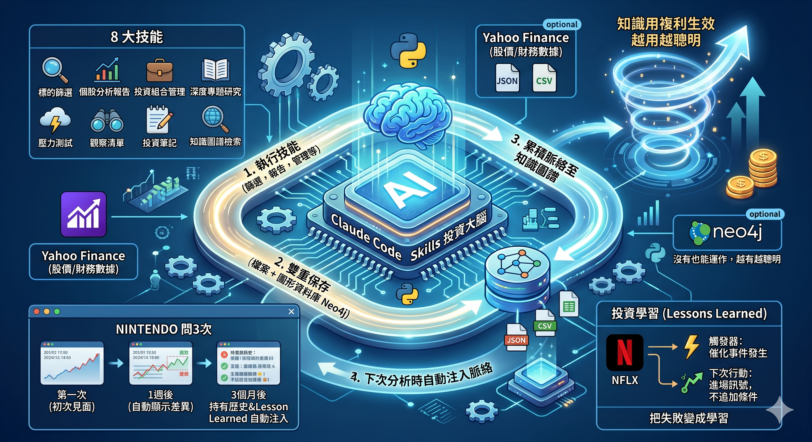
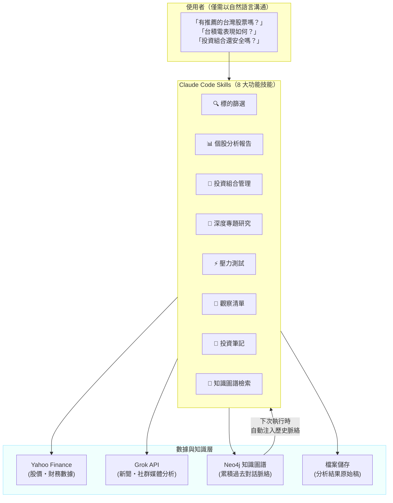
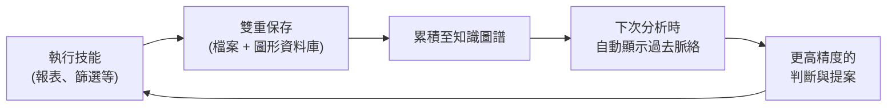

# 用 Claude Code Skills 打造「越用越聰明」的投資分析 AI



原文: [Claude Code Skills で「使うほど賢くなる」投資分析AIを作った話 Vol.2【Neo4j × 個人開発】](https://qiita.com/okikusan-public/items/405949f83e8a39a49566)


> 在上一篇文章（ [Claude Code Skills 讓股票篩選自動化【Python × yfinance × Vibecoding】](https://qiita.com/okikusan-public/items/61100a5b1aa8d752ae24) ）中介紹了 Claude Code Skills による投資分析的自動化。從那之後過了幾個月，系統進化成了「越用越聰明」的機制。本篇文章將說明該機制以及個人開發中獲得的設計決策。

---

## 上一篇文章解決了什麼、沒解決什麼

上次，我們用 Claude Code Skills 解決了 Web 版 AI 的4個課題（回應品質、脈絡消失、再現性、處理量）。將分析邏輯固定在腳本中，使用 Yahoo Finance 的數據進行統一篩選。這樣一來「每次都能用相同標準找股票」的狀態是做出了。

但是，**分析結果的累積與活用** 卻沒能解決。

上週篩選找到的股票、上個月的健檢結果，下個 session 就忘了。「Toyota 怎麼樣？」每次問都要從零開始生成報告。系統不知道你是否持有、也不清楚你是否曾寫過擔憂的備忘錄。

**明明越用數據越累積，但卻沒有運用到下次的判斷。** 本篇文章的重點，就是說明如何解決這個問題。

---

## 系統的全貌

先讓你看見全貌。用戶只需要用自然語言對話。背後有3層的設計在協同運作。



重點是 **最下層的箭頭**。 Neo4j 累積的知識，會在下次的技能執行時自動回饋。這就是「越用越聰明」的真面目，也是本篇文章要詳細解說的部分。

---

## 知識自動累積，活用於下次分析的機制

解決方案的核心是，**只要使用就能讓知識自動循環的迴圈**。



這個迴圈完全不需要手動操作。用戶只要正常使用系統，背後就會累積知識，下次分析時自動反映。

### 雙重保存：有一邊停止也沒關係

每次執行技能時，結果會保存到2個地方。

- **檔案保存（主要）**：將分析結果以 JSON 檔案保存。留在本地端不會消失
- **Neo4j（GraphDB）**：將同樣的資料同步到圖形資料庫。用來查詢股票之間的關聯和過去的經過

重點是因為檔案保存是主要的方式，所以 **即使 Neo4j 停了資料也一定會保留下來**。 Neo4j 只是用來查詢。這種「一邊壞了還能動」的設計稍後會說明。

篩選、報告、買賣、健檢、研究、市況、壓力測試、將來預測——8種保存處理，在所有技能執行後自動執行。

---

## 「Nintendo 怎麼樣？」問3次會發生什麼變化

這個迴圈如何改變體驗。看一下問同樣問題3次時的變化。

### 第一次：初次見面

```text
🆕 沒有資料。執行技能。
```

系統對 7974.T（Nintendo）一無所知。從零開始生成報告。

```text
PER 24.5 / PBR 4.8 / 價值分數 58 / 「合理水準，考慮成長性後再検討」
```

這時背後，分析結果已保存到檔案，Neo4j 也記錄了報告和股票的資訊。用戶什麼都沒做。

[](https://qiita-user-contents.imgix.net/https%3A%2F%2Fstorage.googleapis.com%2Fzenn-user-upload%2F332cddfcce94-20260303.png?ixlib=rb-4.0.0&auto=format&gif-q=60&q=75&s=4fd4ea9915853d0070b328901472cc22)

### 第二次：1週後

```text
⚡ 有最近資料 — 用差異模式輕量更新。

## 過去的經過: 7974.T
- [最近] 3/1 報告: 分數58, 「合理水準，考慮成長性後再検討」
- 備忘錄(投資主題):「Switch 的次世代機擴展遊戲事業」
```

明明是同樣的「 Nintendo 怎麼樣？」，但輸出不同了。上次的報告結果自動顯示，Claude 會做有差異意識的回答。

```text
「前次 PER 24.5 → 本次 19.8，下降。次世代機發表後的期待已反映 → 發售前的調整格局嗎。
  前次主題『Switch 次世代機擴展遊戲事業』持續有效。可考慮逢低買进。」
```

不僅只是並列數字，**前次對比comment** 會自動加入。因為系統內建了「有前次資料就一定顯示差異」的規則。

### 第三次：3個月後（持有中）

```text
🔄 資料過舊 — 完整重新取得。執行技能。

## 過去的經過: 7974.T (持有中)
- 持有: 100股 @ 9200日圓 (2/15買入)
- 主題:「Switch 次世代機擴展遊戲事業」 (92天前 → 建議複審)
- 篩選出現: 3次 (alpha, growth-value)
- 擔憂備忘錄:「次世代機延遲發售風險」

建議: 健檢（主題已過3個月 → 複審時機）

## 投資的學習
- [7974.T] 新產品發表前因期待買入 → 高價被套 → 下次不在 RSI70 超過時買入
```

這3個月之間用戶做的事情——買股票、記錄投資主題、記錄擔憂、從過去失敗中學習——全部自動成為脈絡。

Claude 不是「給出報告」而是「建議先做健檢好嗎？主題已過92天」。如果 RSI（技術指標）過熱，過去的學習會自動警告。

**用戶每次都只是問同樣的「Nintendo 怎麼樣？」**。背後累積的知識，從根本上改變了回答的品質。

---

## AI 自動想起過去經過的機制

這個「變聰明」體驗的核心是，**自動脈絡注入**。

在所有 Claude Code Skills 腳本的開頭，都嵌入了自動取得過去經過的處理。每次執行技能時，從 Neo4j 搜尋過去的報告、買賣、觀察清單、投資備忘錄，交給 Claude。

這個自動取得有以下4個步驟：

1. **特定股票**：「Toyota」→ 轉換成 7203.T 的股票代碼
2. **搜尋過去的經過**：一次取得報告、買賣、觀察清單、備忘錄
3. **判定資料新舊**：分為4階段，判斷是否需要重新取得
4. **建議最佳行動**: 根據與股票的關係推薦下一步行動

### 用資料新舊改變行動

| 標籤 | 條件 | AI 的行動 |
| --- | --- | --- |
| **最新** | 24小時以內 | 用手邊的資料回答。不重新取得 |
| **最近** | 7天以內 | 只輕量更新有變化的部分 |
| **過舊** | 超過7天 | 完整重新取得所有資料 |
| **沒有** | 沒有資料 | 從零開始分析 |

昨天才給出報告的股票，若問「怎麼樣？」，不會重新取得，用昨天的結果回答。光這點就大幅減少了無效處理。

### 用與股票的關係改變行動

| 與你的關係 | AI 推荐的行動 | 理由 |
| --- | --- | --- |
| 己經持有 | 健檢 | 持有的股票診斷優先 |
| 投資主題已過3個月 | 健檢 + 複審 | 定期檢視時機 |
| 放在觀察清單 | 報告 + 與前次差異 | 判斷買點的材料 |
| 篩選出現3次以上 | 報告 + 注目標記 | 重複出現 = 結構上可能便宜 |
| 第一次問的股票 | 一般報告 | 從零調查 |

同樣的「調查一下」，但根據與那檔股票的關係，最佳行動會改變。

[](https://qiita-user-contents.imgix.net/https%3A%2F%2Fstorage.googleapis.com%2Fzenn-user-upload%2F19d155884277-20260303.png?ixlib=rb-4.0.0&auto=format&gif-q=60&q=75&s=088667eeb8d22629513b68531de54f2a)

### 模糊的問題也能對應

即使是「之前查過的半導體相關股票」這種沒有包含股票名的模糊問題，也能用過去分析結果的類似搜尋找到相關的股票。因為所有分析結果都附有摘要文，自然語言的知識搜尋才得以成立。

---

## 把失敗變成「學習」：從 Netflix 學到的方法

Netflix 不把障礙或專案失敗當成「處罰」，而是以 **事後檢討（回顧）** 記錄並轉化為組織整體學習的文化眾所週知。「發生了什麼」「為什麼發生」「下次怎麼做」結構化地留下，這樣就不會重複同樣的失敗。

投資也是一樣。最有價值的知識是「從過去失敗得到的教訓」。但人類的記憶會淡化。3個月前的反省，能運用到現在眼前的機會嗎？

在這個系統中，投資的「學習」可以記錄為 **觸發條件** 和 **下次行動** 的組合。

例如我自己實際記錄的 Netflix (NFLX) 學習：

- **股票**: NFLX（Netflix）
- **觸發**: 分析過多導致機會損失
- **下次行動**: 催化劑發生 = 進場訊號。化解後不再追加新的進場條件
- **詳細**: 從 ATH（最高點）下跌40% 時看出高品質（ROE 42.8%、成長 17.6%），也正確解讀了 Warner 撤退這個催化劑為正面。但同一天寫了擔憂備忘錄（PER 33x 是偏高、等到 PER 25-28x）於是自己踩煞車。結果股價上漲錯過機會

這個學習，下次分析 NFLX 時會自動顯示在脈絡中。

```text
## 投資 lesson
- [NFLX] 分析過多導致機會損失 → 催化劑發生=進場，不新增條件 (2026-02-28)
```

下次有類似情況（高品質企業大跌 + 催化劑發生），Claude 會警告「過去學習：分析過多導致機會損失模式。催化劑發生時不追加條件，建議進場」。

!!! info
    在投資領域中，Catalyst 的中文直譯是「催化劑」，而 Catalyst occurrence 指的是「催化事件的發生」。

    在上述的 Netflix 案例中，這是一個非常關鍵的轉折點。簡單來說，它指的是：「足以引動股價上漲（或下跌）的特定事件或消息正式出現了。」
    具體分析如下：

    1. 什麼是 Catalyst（催化劑）?
        在股市中，催化劑是指能改變投資人對某間公司看法，並在短時間內推動股價向特定方向移動的事件。常見的催化劑包括：
           - 好的財報（獲利優於預期）。
           - 新產品發佈或重大技術突破。
           - 併購消息。
           - 產業結構變化（例如您提到的「Warner 撤退」，這減少了 Netflix 的競爭壓力）。\
  
    2. Catalyst occurrence 在您案例中的意思:
        當您寫下 `Catalyst occurrence = Entry signal` 時，您的邏輯是：
           - 分析階段：您已經確認 Netflix 是一間好公司（ROE、成長性優異），且股價已經跌了 40%。
           - 等待階段：您在等一個「發動訊號」。
           - 發生（Occurrence）：當 Warner 宣布撤退的消息傳出，這個「催化劑」就發生了。
           - 您的動作：這本該是您的進場指令（Entry signal）。
  
    3. 為什麼這個詞對您很重要?
        您提到的學習點在於：當「催化劑發生」時，這代表市場的動能已經轉向。此時如果再回頭去糾結「PER 是 33x 還是 28x」（估值細節），就會因為過度分析而錯失（Opportunity loss）那個由催化劑帶動的噴發波段。

    總結來說：

    「Catalyst occurrence」就是指您等待的那個「起漲訊號彈」正式升空了。


**人類的記憶會淡化，但系統的記憶不會。** 像 Netflix 從障礙中學習一樣，把投資的失敗圖譜脈絡記錄在系統中，就能在相同情況下自動想起。這就是「越用越聰明」的具體樣子之一。

[](https://qiita-user-contents.imgix.net/https%3A%2F%2Fstorage.googleapis.com%2Fzenn-user-upload%2Fc60d757222c9-20260303.png?ixlib=rb-4.0.0&auto=format&gif-q=60&q=75&s=8f1f6b75e8bf35eebe45c99072d19dee)

---

## 外部研究也有效用過去的脈絡

知識累積的效果，不僅在內部分析，**也波及到外部的 AI 研究**。

用 Grok API（xAI 的 AI）調查股票的新聞和市場動向時，從 Neo4j 抽出你作為投資人的脈絡，自動組進研究的指示中。

```text
[你的投資脈絡]
- 目前持有中（20股 @ $97.3、3/3買入）
- 前次報告: 分數23.8，「偏高傾向」
- 購入計畫備忘錄: 有買入50股計畫（3/2時點）
- lesson:「分析過多導致機會損失」「 Recovery 股票進場判斷規則」
→ 請focus 以下述脈絡之後的變化來研究...
```

有沒有這個脈絡，研究的重點完全不一樣。「告訴我 NFLX」和「我持有 NFLX，過去有分析過多導致機會損失的反省。最新情況？」，回來的資訊品質不同。

不使用 Grok API 的話，這個脈絡注入會被跳過，只用數值型基礎的分析運作。

---

## 沒有也能運作，越有越聰明

這個系統可以與4個外部服務協同運作(這些服務都是 optional 的)。

| 服務 | 有的話 | 沒有也能 |
| --- | --- | --- |
| **Neo4j** | 知識累積 + 自動顯示過去經過 | 只有檔案保存。沒有經過也能運作 |
| **向量搜尋** | 也能對應模糊問題 | 只能用股票名搜尋 |
| **Grok API** | 新聞、SN 的定性研究 | 只有數值型定量分析 |
| **Linear** | 管理專案開發項目 | 只有檔案保存 |

最小構成是 **只有 Python 和 Yahoo Finance 的數據**。這個構成就能讓所有技能運作。

設計原則是「沒有也能運作，越有越聰明」。與外部服務的連携處理都設有 timeout，即使服務停止也不會阻礙技能本身的執行。

 Neo4j 是後來才加的話，從那瞬間就開始累積知識。啟用向量搜尋就能對應模糊問題。設定 Grok API 就會加入定性研究。**階段性地變聰明** 的設計。

[](https://qiita-user-contents.imgix.net/https%3A%2F%2Fstorage.googleapis.com%2Fzenn-user-upload%2Fbec8e00e9cf4-20260303.png?ixlib=rb-4.0.0&auto=format&gif-q=60&q=75&s=294cdb2808c7ab127a71999bed721e00)

---

## 總結：知識用複利生效的世界

實現「越用越聰明」的機制有3個。

1. **自動記錄**：無需手動操作，所有技能執行結果會累積到檔案和GraphDB
2. **自動注入**：下次執行技能時，過去的知識會自動交給 AI。外部研究也會注入投資人的脈絡
3. **自動學習**：把失敗圖譜脈絡記錄成「學習」的話，在相同情況下會自動警告

知識是用 **複利** 生效的。第1次問「Nintendo 怎麼樣？」和第100次問，的回答深度完全不同。持有歷史、買賣根據、過去的失敗、篩選出現頻率——全部作為脈絡累積起來，提升判斷的精確度。

如果 Web 版的 AI 工具是「每次都重置的聰明陌生人」，這個系統就是「記住你的投資判斷的專屬分析師」。

### 接下來要進入運用 phase

本篇文章介紹的知識累積迴圈的實現，意味著 **開發大致完成了**。8個 Claude Code Skills、15種篩選策略、對應60地區、知識圖譜、Grok 連携、向量搜尋——必要的零件都湊齊了。

接下來要進入 **運用 phase**。實際每天使用，培養知識圖譜，讓系統越來越聰明。越使用脈絡越厚，建議的精確度也會上升。我認為那個成長過程，正是這個架構的真正價值。

### 作為個人工具老實說

說實話，我也有想過要不要把做到這個程度的東西做成收費服務。但是，提供投資判斷相關輸出的服務可能構成 **投資建議的行業**，需要金融商品交易法上的登錄。因為會超出個人開發的範圍，所以決定只是 **作為個人用的工具** 使用。

因為代碼是開源的，想用同樣方式做 Claude Code Skills 投資分析環境的人可以自由參考。

有興趣的朋友歡迎試試看，原始碼已在 GitHub 公開:

- [stock_skills](https://github.com/okikusan-public/stock_skills)
- [stock_skills 英文版](https://github.com/erhwenkuo/stock_skills)

> **注意：** 投資為個人責任。本系統的輸出並非投資建議。此外，雖然在 GitHub 公開了原始碼，但不接受任何關於投資成果的諮詢或支援，請僅作為 Skills 的技術參考。

**📘 系列文章**:

- [Vol.1：用 Claude Code Skills 自動化股票篩選](https://qiita.com/okikusan-public/items/61100a5b1aa8d752ae24)
- [Vol.2：用 Claude Code Skills 打造「越用越聰明」的投資分析 AI](https://qiita.com/okikusan-public/items/405949f83e8a39a49566)
- [Vol.3：Claude Code Skills × 投資分析 Vol.3 — 處方箋引擎・逆勢偵測・標的分群](https://qiita.com/okikusan-public/items/1765d6afb8c548f019f1)
