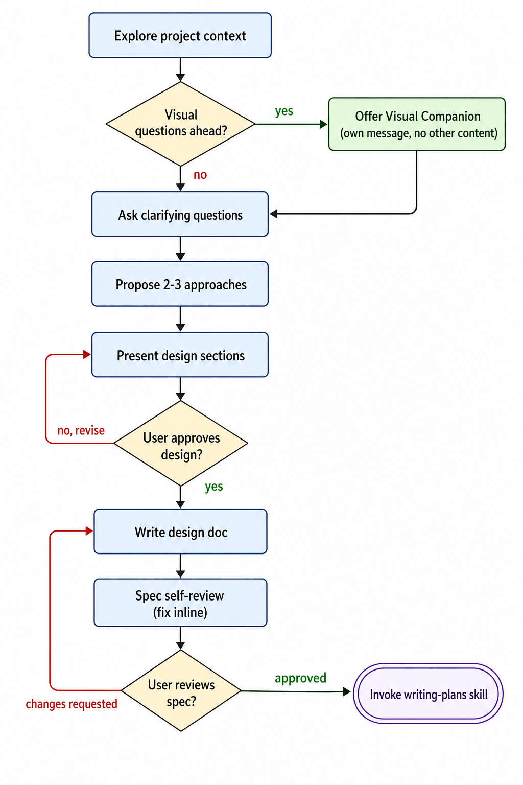
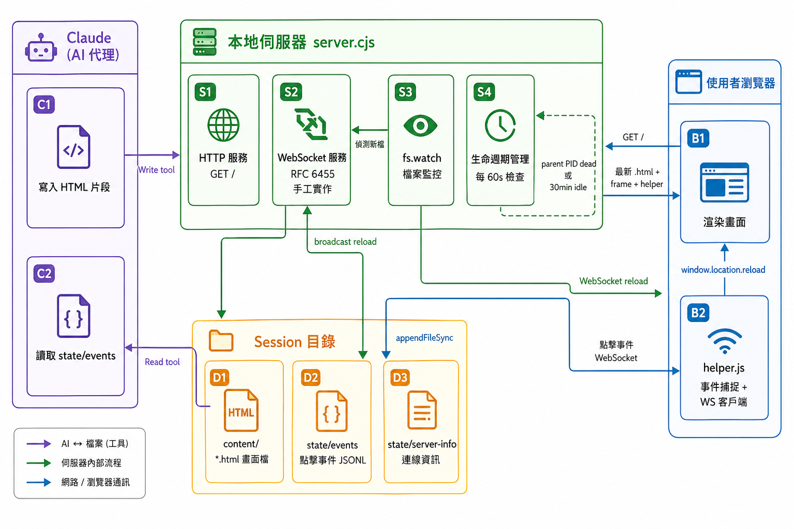
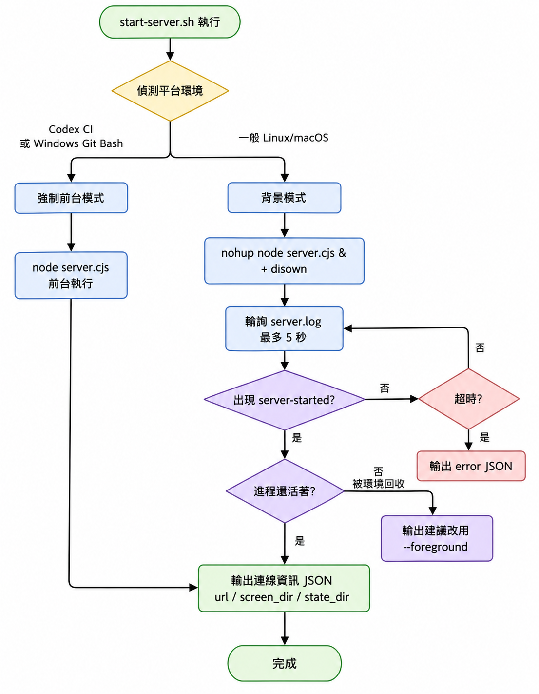
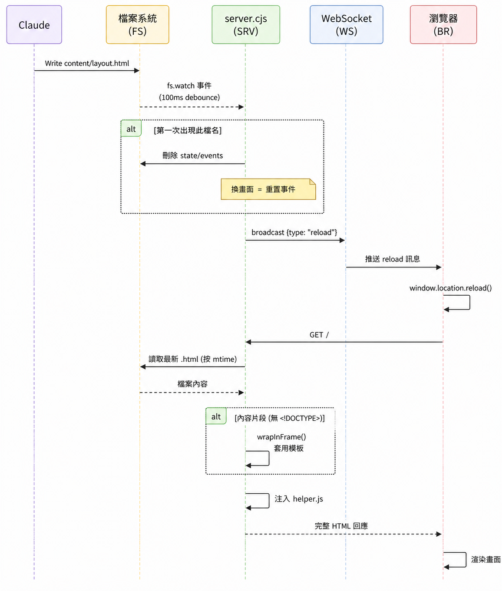

# `skills/brainstorming/` 結構與用法

## 目錄結構

```
skills/brainstorming/
├── SKILL.md                        # 核心技能定義
├── visual-companion.md             # 視覺夥伴詳細指南
├── spec-document-reviewer-prompt.md # 規格文件審查模板
└── scripts/
    ├── start-server.sh             # 啟動本地 HTTP 伺服器
    ├── stop-server.sh              # 停止伺服器
    ├── server.cjs                  # Node.js 伺服器實作
    ├── frame-template.html         # 頁面框架 CSS/HTML 模板
    └── helper.js                   # 瀏覽器端互動腳本
```

## 核心用途

這個 skill 是「實作前的強制設計門控」。`SKILL.md` 有一個 `<HARD-GATE>`：在設計被使用者核准之前，不得寫任何程式碼。

## 執行流程（9 個強制步驟）

|步驟	|內容|
|------|----|
|1	|探索專案現況（檔案、文件、commits）|
|2	|如有視覺問題，單獨詢問是否開啟 Visual Companion|
|3	|一次問一個釐清問題|
|4	|提出 2–3 種做法並附上 trade-off 與推薦|
|5	|分段呈現設計，每段都取得使用者確認|
|6	|將設計寫入 `docs/superpowers/specs/YYYY-MM-DD-<topic>-design.md` 並 `commit`|
|7	|自我審查規格文件（掃描 TBD、矛盾、歧義）|
|8	|請使用者審閱規格文件|
|9	|呼叫 `writing-plans` skill 建立實作計畫|

最後一步只能呼叫 `writing-plans`，不得直接進入其他實作 skill。



## Visual Companion（視覺夥伴）

當問題涉及 UI 版型、架構圖、排版比較等視覺性內容時，可啟動本地伺服器：

`scripts/start-server.sh --project-dir /path/to/project`

運作原理：

- Claude 將 HTML 片段寫入 screen_dir
- 伺服器自動提供最新檔案給瀏覽器
- 使用者在瀏覽器點選選項後，互動記錄寫入 state_dir/events（JSON lines）
- Claude 下一輪讀取 events 以解析使用者選擇

HTML 片段只需寫內容，不需要 `<html>` 或 CSS，伺服器會自動套用 `frame-template.html` 框架。

## Spec Document Reviewer（規格審查）

`spec-document-reviewer-prompt.md` 是一個 subagent prompt 模板，規格文件寫完後可派遣此 reviewer 檢查：

- 完整性（有無 TBD、未完成段落）
- 一致性（內部矛盾）
- 清晰度（是否存在雙重解讀）
- 範疇（是否過大需要拆分）
- YAGNI（有無未被要求的功能）

輸出格式為 Approved 或 Issues Found，只有嚴重問題才會阻擋進度。

## `scripts` 的架構

這是一個本地 HTTP + WebSocket 即時預覽系統，讓 Claude 能在瀏覽器中向使用者展示視覺化選項，並收集使用者的點擊回饋。



### 各文件職責



#### `start-server.sh` — 啟動腳本

- 解析參數：`--project-dir`（持久化目錄）、`--host`（綁定位址）、`--foreground` 等
- 平台偵測：自動判斷環境（Codex CI、 Windows Git Bash）是否需要前台模式——這些環境會主動回收背景進程
- 建立 Session 目錄：`<PID>-<timestamp>` 生成唯一 ID，避免多個 session 衝突
- 持久化：`<project>/.superpowers/brainstorm/<session-id>/`
  - 暫時性：`/tmp/brainstorm-<session-id>/`
  - 啟動 Node 伺服器：用 `nohup + disown` 讓伺服器在 shell 退出後繼續存活
- 等待就緒：輪詢 log 文件最多 5 秒，確認 `server-started` 訊息出現後才回傳連線資訊

#### `stop-server.sh` — 停止腳本

- 讀取 PID 文件，發送 SIGTERM，等待最多 2 秒
- 若仍存活，升級為 SIGKILL
- 選擇性清理：只刪除 `/tmp/` 下的暫時目錄；`--project-dir` 建立的目錄保留（保存模型供日後參考）

#### `server.cjs` — 核心 Node.js 伺服器

四個主要機制：

1. HTTP 服務（handleRequest）

   - `GET /` → 找到 `content/` 目錄中修改時間最新的 `.html` 文件，判斷是完整文件還是片段，片段則套用 `frame-template.html` 包裝，再注入 `helper.js`
   - `GET /files/<name>` → 提供靜態資源（圖片等）
  
2. WebSocket 協議（手工實作 RFC 6455）

   - 用於伺服器 → 瀏覽器的 `reload` 推送（無需 `socket.io`，零依賴）
   - 用於瀏覽器 → 伺服器的使用者點擊事件接收

3. 文件監控（`fs.watch`）

   - 監聽 `content/` 目錄的 `.html` 文件變化
   - 100ms debounce 避免重複觸發
   - 偵測到新文件時：自動清除舊的 `events` 文件（換畫面即重置事件）
   - 任何新增或修改都向所有 WebSocket 客戶端廣播 `{ type: 'reload' }`

4. 生命週期管理

   - 每 60 秒檢查：父進程（呼叫端 Claude harness）是否還活著，若已退出則自動關閉
   - 30 分鐘無活動則自動超時關閉
   - 用 `server-info` 和 `server-stopped` 文件作為狀態旗標，讓 Claude 在下一輪能判斷伺服器是否還活著

#### `helper.js` — 客戶端腳本（自動注入）

每個頁面都會被注入此腳本，負責：

1. **WebSocket 連線**：自動連線並在斷線後每秒重試
2. **事件排隊**：若 WebSocket 尚未連線，點擊事件先排隊，連線後再一次送出
3. **點擊捕捉**：事件委派監聽所有 `[data-choice]` 元素的點擊，傳送 `{ type, choice, text, timestamp }` 給伺服器
4. **選擇狀態**：`toggleSelect()` 管理單選/多選（`data-multiselect`），更新底部指示欄文字
5. **reload 接收**：收到伺服器的 `reload` 訊息時，呼叫 `window.location.reload()`

#### `frame-template.html` — 頁面框架

為所有內容片段提供統一的 UI 框架：

- **固定標題列**：顯示「Superpowers Brainstorming」和綠點連線狀態
- **可捲動內容區**：`<!-- CONTENT -->` 佔位符，由 `server.cjs` 替換為實際 HTML
- **底部指示欄**：提示使用者已選擇的選項，引導回到終端機繼續
- **CSS 主題**：支援深/淺色模式（`prefers-color-scheme`），提供 `.options`、 `.cards`、 `.mockup`、 `.split`、 `.pros-cons` 等預建元件樣式

### 資料流總結

使用者互動與事件回傳:

