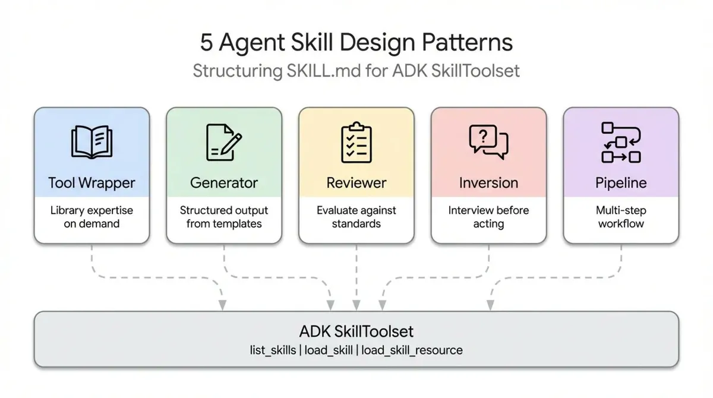

# `skills/brainstorming/` 五大 Skill 模式分析



## 模式對應總覽

|模式	|採用程度	|說明|
|------|----------|----|
|Tool Wrapper	|★★☆☆☆	|僅限 Visual Companion 子功能|
|Generator	|★★★☆☆	|規格文件輸出，但非模板填空|
|Reviewer	|★★★★☆	|雙層審查（自審 + subagent）|
|Inversion	|★★★★★	|前半段核心，以 HARD-GATE 強化|
|Pipeline	|★★★★★	|整體架構骨幹|

## 1. `Tool Wrapper`（工具包裝）—— 局部採用

Visual Companion 是最典型的 **Tool Wrapper** 體現：將本地 HTTP 伺服器（`scripts/start-server.sh`、`server.cjs`）包裝成 skill 的一部分，Agent 不需要理解 Node.js 伺服器實作，只需要知道「寫 HTML 片段到 `screen_dir`，讀 `state_dir/events`」這個介面。

`Agent → 寫 HTML 片段 → 伺服器自動套框架 → 瀏覽器顯示`
`                                          ← events JSON ←`

**限制**： 這只涵蓋視覺輔助部分，brainstorming 的主體設計流程並不屬於 Tool Wrapper。

## 2. `Generator`（生成器）—— 中度採用

步驟 6 的「Write design doc」是 **Generator** 模式的直接體現——輸出格式、路徑規範（`docs/superpowers/specs/YYYY-MM-DD-<topic>-design.md`）、 `commit` 動作都是固定的。

但與純粹的 Generator 不同，brainstorming 的文件不是從模板填空產生，而是由前面的對話協作內容濃縮而來，生成品質更高但也更依賴前置流程。

## 3. `Reviewer`（審查者）—— 明確採用，兩層實作

這是 brainstorming 中最清晰對應 **Reviewer** 模式的部分，且有兩層：

|層級	|機制	|位置|
|------|------|----|
|自我審查|Agent 自行掃描 TBD、矛盾、歧義、範疇	|SKILL.md 步驟 7|
|Subagent 審查|派遣獨立 reviewer agent，有嚴重性分級|`spec-document-reviewer-prompt.md`|

Reviewer 模式的「嚴重性校準」也明確寫入 prompt：「只標記會導致真正問題的 issue，次要措辭改善不構成阻擋理由」——這正是文章說的 severity-based prioritization。

## 4. `Inversion`（反轉）—— 核心骨架，最強對應

整個 brainstorming 的前半段幾乎就是 **Inversion** 模式的完整實作：

- 先探索專案脈絡，再問問題（不假設）
- 一次只問一個問題（降低認知負擔）
- 偏好多選題（降低回答門檻）
- 優先理解「purpose / constraints / success criteria」

`<HARD-GATE>` 是 Inversion 模式最強烈的強制手段：在使用者確認設計之前，完全禁止任何實作動作，這超越了一般 Inversion 模式只是「先問再做」的建議性質，升格為架構性約束。

## 5. `Pipeline`（管道）—— 主要架構模式

整個 skill 的骨架就是一條有強制檢查點的 **Pipeline**：

```
[探索] → [視覺詢問?] → [釐清] → [提案] → [設計呈現]
                                                    ↓
                                            [使用者核准?] ──否→ 循環
                                                    ↓
                                            [寫規格文件]
                                                    ↓
                                            [自我審查] → [使用者審閱?]
                                                    ↓
                                            [writing-plans] ← 唯一出口
```

SKILL.md 明確標示 `<HARD-GATE>` 與兩個 User Review Gate，對應文章說的「mandatory checkpoints」；視覺伴侶的啟用是「optional pause point」。

**重要設計決策**： Pipeline 的最後一步強制指定「只能呼叫 `writing-plans`，不得呼叫其他任何 skill」——這防止 Agent 在管道完成前自行短路跳至實作。

## 結論

`brainstorming` skill 本質上是以 **Pipeline** 為外殼、**Inversion** 為核心，在關鍵節點嵌入 **Reviewer**，最終產出使用 **Generator** 邏輯。

這種組合模式（Pattern Composition）本身就是一個比任何單一模式更高層次的設計選擇。