# 用 Superpowers 打造靠譜的 AI 開發工作流

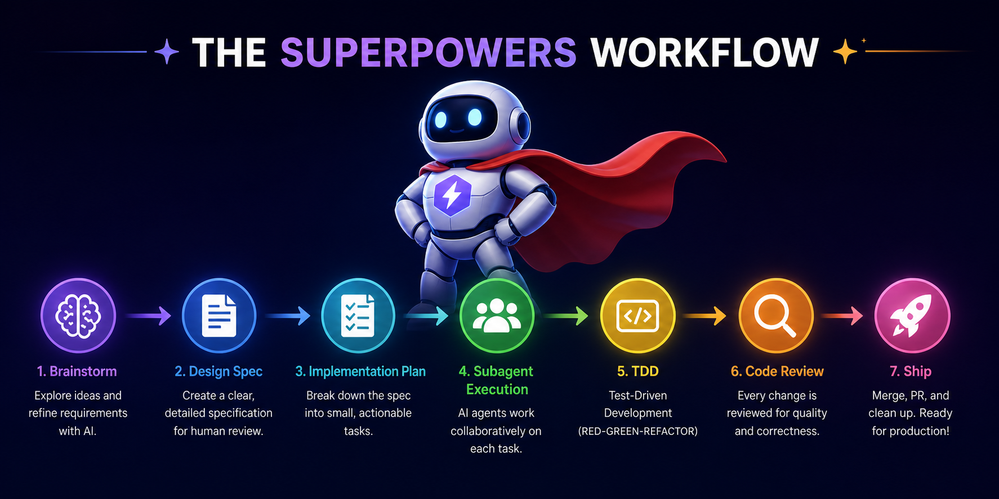

原文: [Claude Code进阶：用Superpowers打造靠谱的AI开发工作流]("https://juejin.cn/post/7625943321220005903")

## 一, 日常開發的痛點

相信很多人現在用 AI 寫程式碼已經很日常了。Cursor, Claude Code, Copilot，工具換了又換，模型也越來越強——Claude4.6, GPT-5.4，寫程式碼的能力確實沒得說。隨便扔個需求過去，它能給你吐出一整段甚至整個專案的程式碼，看起來挺厲害。

可能這裡面也有我們使用的模型的原因，最新的模型確實聰明，能理解複雜的上下文，也能寫出品質不錯的程式碼。甚至在某些場景下，比我們自己寫得還要規範, 還要快。

但是不可否認的是，大多數人用 AI 編程的方式，其實跟幾年前沒啥區別——就是{==「提需求，等結果」==}。

比如我們說一句「幫我加個登入功能」，AI 給我們一段程式碼。我們看看覺得還行，複製貼上進去。跑一下，報錯了。再讓 AI 改。改完又報錯，或者功能跟我們要的不一樣。來回折騰好幾輪，最後發現 AI 根本沒理解我們真正想要什麼。

甚至更慘的是，AI 寫完的程式碼看似能跑，但沒寫測試, 沒考慮邊界情況, 沒留文件。等我們過段時間再回頭看，根本不知道當時寫了啥, 為啥這麼寫。後面接手的人更是一頭霧水。

其實問題不在 AI 不夠強，而是我們跟 AI 的合作方式從一開始就有問題。我們把它當成一個幹活的人，扔個需求就等結果。但軟體開發不是這麼簡單的事——需求要理清楚, 方案要設計, 測試要先寫, 寫完還要驗證。這些環節我們以前靠自己自覺去做，現在指望 AI，但 AI 並不會主動幫我們走完這些流程。

於是就變成了：AI 寫程式碼很快，但返工更頻繁。我們看似效率提升了，實際產出品質並沒有真正提高。


---

## 二, Skills 和 MCP 能帶來什麼

那有沒有辦法讓 AI 不只是「寫程式碼」，而是按照一套靠譜的流程來幫我們做事？

這就要提到目前很火的 Skills 和 MCP 了。

簡單來說，Skills 就是一套預設好的「工作流程範本」，MCP 則是讓 AI 能連上更多外部工具和資料來源。這兩樣東西配合起來，AI 就不只是「寫程式碼的機器」，而是能按照我們設定的流程一步步做事——先理解需求, 再寫計劃, 再實現, 再驗證。

我們前面提到的那些問題——需求理解偏差, 沒寫測試, 邊界情況沒考慮, 文件缺失, 返工成本高——這些其實都是「流程缺失」導致的。有了 Skills，這些環節就不是忘了的問題了，而是 AI 會主動提醒我們, 甚至強制走完這些步驟。

比如有的 Skill 會在我們說「寫個功能」的時候，先停下來問清楚需求細節；有的 Skill 會強制我們先寫測試再寫實現；有的 Skill 會在我們聲稱完成了之後，強制跑一遍檢查，確保真的完成了。
2
所以 Skills 和 MCP 的價值，本質上不是讓 AI 變聰明，而是讓 AI 變靠譜。聰明是模型的事，靠譜是流程的事。模型再聰明，流程不對，結果也是一團糟。流程對了，模型哪怕沒那麼強，產出也更穩定, 更可控。

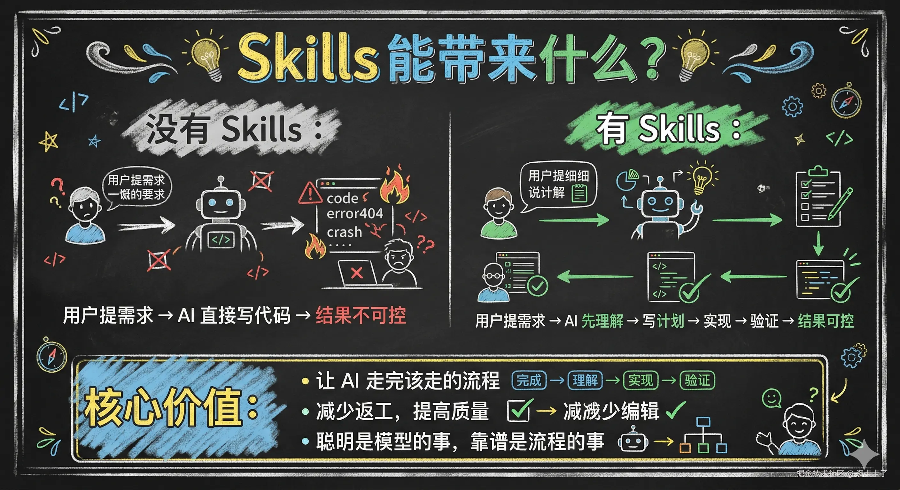

---

## 三, Superpowers 技能介紹

既然 Skills 能幫我們把開發流程變得更靠譜，那具體要裝哪個？有沒有一套現成的框架，把常用的 Skill 都整合好，裝完就能用？

那這裡我就要提到 Superpowers 了。

Superpowers 是目前社群裡最火的 Skills 框架之一，專門用來強化 AI 的開發流程。它內建了好幾個 Skill，覆蓋了從需求理解到程式碼驗證的整個開發週期。我們前面說的那些問題——需求沒理清楚, 測試沒寫, 寫完不驗證——Superpowers 都有對應的 Skill 來解決。

相信很多人在寫程式碼提效方面都聽過或者安裝過 Superpowers。但具體要怎麼用，可能還是不太清楚。

但是很多人裝完之後，每天寫程式碼還是原來的對話模式——「幫我寫個功能」, 「幫我改下這段程式碼」。Skills 放在那兒，什麼時候該用哪個, 怎麼觸發, 觸發後是什麼樣子，一頭霧水。甚至很多人以為這些 Skill 是自動生效的，裝完就不用管了，結果發現寫程式碼的方式一點都沒變。

今天這篇文章，我們就來聊聊 Superpowers 的每個 Skill：什麼時候用, 怎麼觸發, 觸發後是什麼樣子, 能解決什麼問題。

---

## 四, Superpowers 詳細介紹

那 Superpowers 具體是怎麼工作的？我們先來建立一個整體認知。

其實 Superpowers 的核心理念很簡單，就是四個步驟： **設計 → 計劃 → 測試 → 品質。**

簡單來說就是程式碼之前，我們先想清楚要做什麼（設計）；想清楚了之後，我們把任務拆成一步步的計劃（計劃）；動手寫程式碼的時候，先寫測試再寫實現（測試）；最後說「完成」之前，必須跑驗證確認沒問題（品質）。

這套流程不是可選的，而是強制執行的。AI 每走完一個階段都會停下來，等我們確認了才繼續下一步，不會自己偷偷跳過去。這樣我們始終能把控關鍵節點，而不是讓 AI 一路跑到底再回頭看。

我們來對比一下，沒有 Superpowers 和有了 Superpowers 之後，我們寫程式碼的方式有什麼區別：

| 維度 | 沒有 Superpowers | 有 Superpowers |
| --- | --- | --- |
| 需求處理 | 直接寫程式碼，理解偏差高 | 先 `brainstorming` 問清楚需求 |
| 實施方式 | 想到哪寫到哪 | 按 `writing-plans` 寫好的步驟走 |
| 測試策略 | 寫完補測試，覆蓋率低 | `TDD` 先寫測試再實現 |
| Bug 處理 | 看到報錯就改，改了再說 | `systematic-debugging` 先定位再修復 |
| 完成驗證 | AI 說完成就算完成 | `verification-before-completion` 強制驗證 |
| 程式碼審查 | 憑自己判斷 | `requesting-code-review` 有審查流程 |
| 工作隔離 | 同一個分支混著改 | `using-git-worktrees` 隔離環境 |
| 多任務處理 | 一個一個串行做 | `dispatching-parallel-agents` 並行處理 |

GitHub 地址放在這兒，有興趣可以自己去看看原始碼：

- [superpowers](https://github.com/obra/superpowers)

Superpowers 內建的 Skill 可以分成兩類：自動觸發和手動觸發。

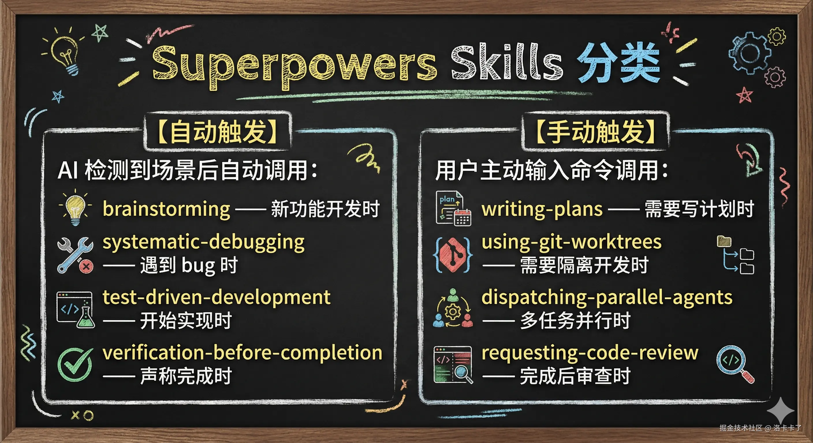

自動觸發，是指 AI 檢測到特定場景後會自己呼叫，不需要我們主動輸入指令。比如：

- `brainstorming`：檢測到我們要做新功能開發，自動停下來問清楚需求
- `systematic-debugging`：檢測到 bug 或測試失敗，自動進入除錯流程
- `test-driven-development`：開始實現功能時，自動要求先寫測試
- `verification-before-completion`：我們說「完成了」，自動跑驗證檢查

而手動觸發，是指需要我們主動輸入指令或者明確告訴 AI 用哪個 Skill。比如：

- `writing-plans`：輸入 `/superpowers:write-plan` 觸發
- `using-git-worktrees`：輸入 `/superpowers:using-git-worktrees` 觸發
- `dispatching-parallel-agents`：輸入 `/superpowers:dispatching-parallel-agents` 觸發
- `requesting-code-review`：輸入 `/superpowers:requesting-code-review` 觸發

整體的執行流程是這樣的：

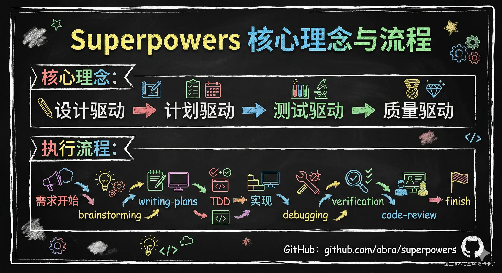

每個階段其實都是一個關卡，AI 走到這兒會停下來等我們確認或決策。我們始終把控著關鍵節點，而不是讓 AI 一路跑到終點再回頭看。

---

## 五, 技能詳解

Superpowers 內建了 13 個 Skill，每個都有特定的用途。但對於初學者來說，我們先掌握核心流程就夠了。

核心流程其實就是我們從需求開始到工作完成的完整主線，一共 6 個技能：

- `brainstorming` —— 需求理解，寫程式碼前先想清楚要做什麼
- `writing-plans` —— 計劃編寫，把任務拆成清晰的步驟
- `subagent-driven-development` —— 用子代理並行執行計劃（推薦方式）
- `executing-plans` —— 一步步順序執行計劃（備選方式）
- `verification-before-completion` —— 完成驗證，說完成之前必須跑檢查
- `finishing-a-development-branch` —— 工作收尾，完成後決定合併還是保留

其中 `subagent-driven-development` 和 `executing-plans` 都是用來執行計劃的，只是方式不同：前者用子代理(sub-agent)並行處理，後者一步步順序執行。我們選一個就行，大多數情況推薦用前者。

學會這 6 個，日常開發就能用 Superpowers 的方式來做事了：先理解需求，再寫計劃，再按計劃執行，執行完驗證，驗證完整合。每一步都有章法，不再是「提需求 → 等程式碼」的原始模式。

Superpowers 還有其他技能，在特定場景下會派上用場。我們用一張表格簡要介紹：

| 技能 | 用途 | 觸發方式 |
| --- | --- | --- |
| `test-driven-development` | 實現過程中先寫測試再寫程式碼 | 自動 |
| `systematic-debugging` | 遇到 bug 或測試失敗時，系統化定位問題 | 自動 |
| `using-git-worktrees` | 需要隔離開發環境，避免互相干擾 | 手動 |
| `dispatching-parallel-agents` | 多個獨立任務並行處理 | 手動 |
| `subagent-driven-development` | 在當前會話中執行有獨立任務的計劃 | 手動 |
| `requesting-code-review` | 完成後請求程式碼審查 | 手動 |
| `receiving-code-review` | 收到程式碼審查回饋時處理 | 手動 |
| `writing-skills` | 建立或編輯新技能時使用 | 手動 |

這些技能我們先了解用途，遇到對應場景就知道該怎麼用了。

下面我們就把核心流程的 6 個 Skill 拆開詳細講講：什麼時候用, 怎麼觸發, 觸發後是什麼樣子, 能解決什麼問題。

---

## 六, 核心技能詳解

### 6.1 `brainstorming` —— 先搞清楚要做什麼

我們每次想做新功能, 新模組, 新元件的時候，先別急著讓 AI 寫程式碼。這時候 `brainstorming` 會自動觸發，幫我們把需求理清楚。

比如我在 Claude Code 終端裡說一句「我想設計一個廣告回傳功能」，AI 不會直接寫程式碼，而是先觸發 `brainstorming` 技能，然後一步步問清楚需求。

這個技能是自動觸發的。當 AI 檢測到我們要做新功能開發時，會自己進入 `brainstorming` 流程。觸發後會看到這樣的提示：

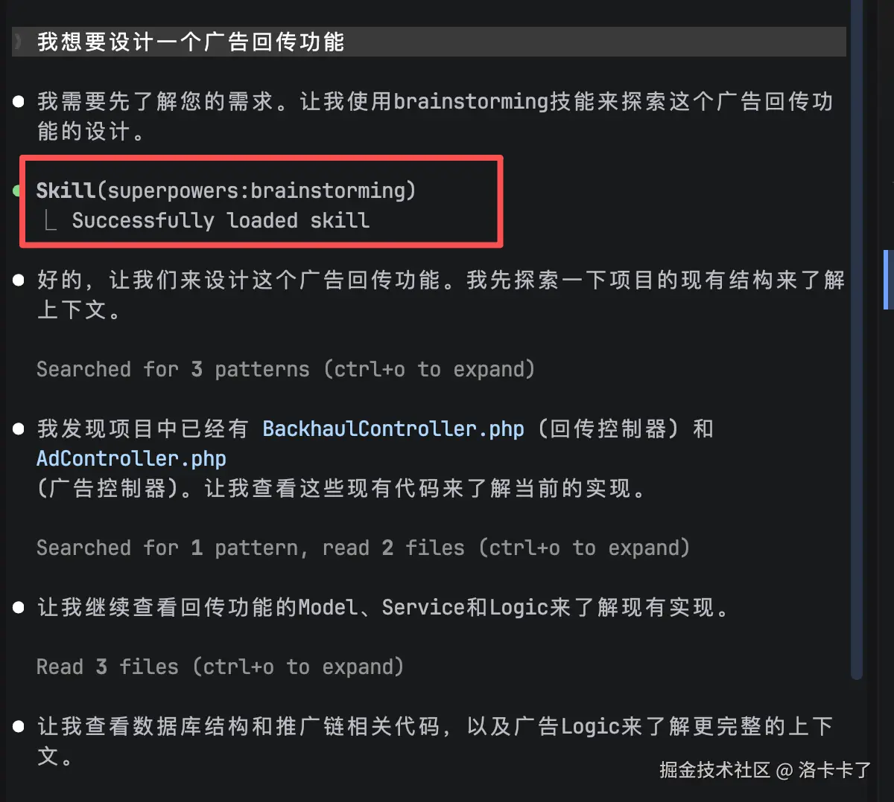

> Skill(superpowers:brainstorming) Successfully loaded skill

這時候 AI 會先搜尋一下專案裡相關的邏輯，了解一下上下文，然後開始提問。

提問的方式是一步步問，不是一次性甩一堆問題過來。比如我要做廣告回傳功能，AI 可能會這樣問：

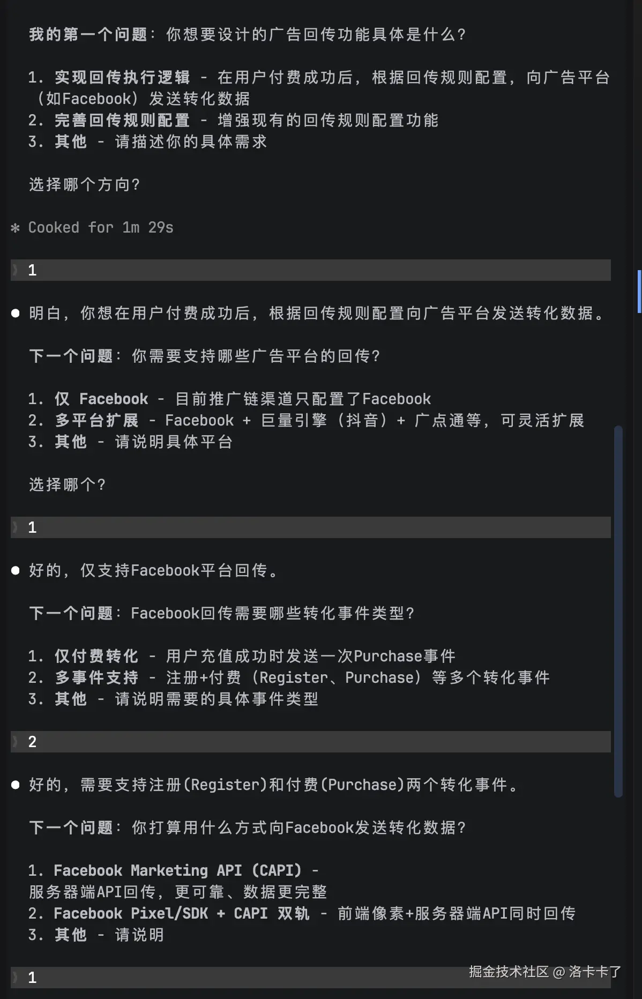

就這樣一步步問，直到把需求細節都搞清楚。問完之後，AI 會說：

> 我已經收集了足夠的資訊，現在讓我提出設計方案。

然後它會給我們一個設計方案，包含架構思路, 關鍵模組, 資料流程等。

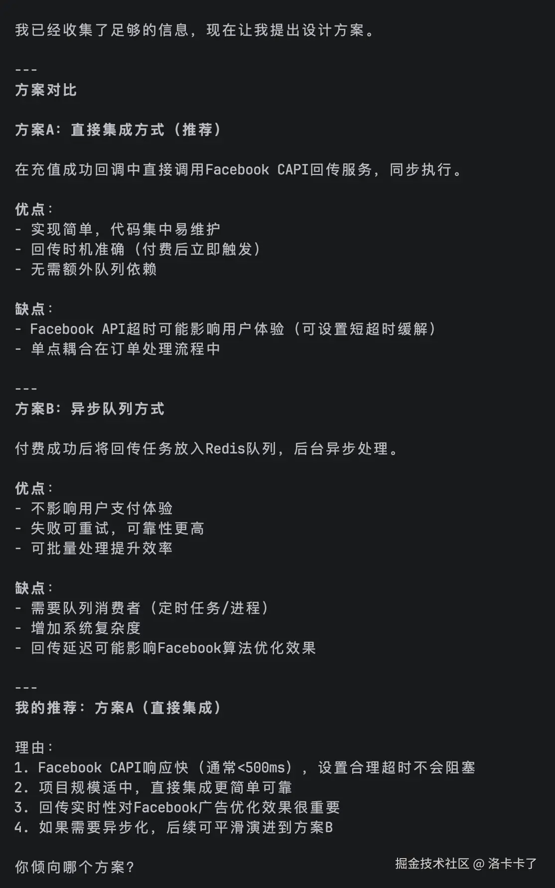

最後 AI 會問：

> 這個設計看起來是否合適？如果沒問題我將寫入設計文件。

我們確認後，AI 就會把設計整理成文件保存下來，整個 `brainstorming` 流程就完成了。

這樣我們使用這個技能就能解決這些問題：

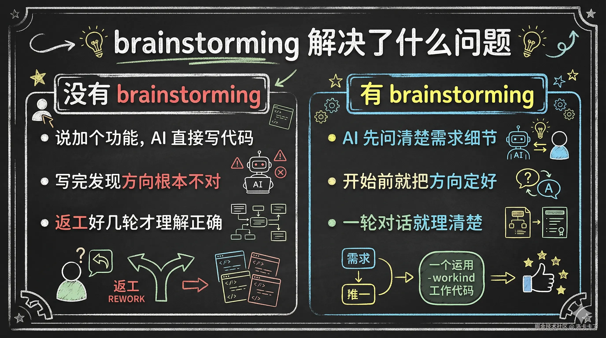

---

### 6.2 `writing-plans` —— 把任務拆成清晰的步驟

`brainstorming` 完成後，需求理清楚了，接下來就要寫實施計劃。這時候我們用 `writing-plans`，把任務拆成一個個小步驟，每一步都寫得清清楚楚。

這個技能需要我們手動觸發。我們可以直接說「幫我寫個實施計劃」，或者輸入指令：

```bash
/superpowers:writing-plans。
```

觸發後，AI 會先在專案目錄下建立兩個資料夾：

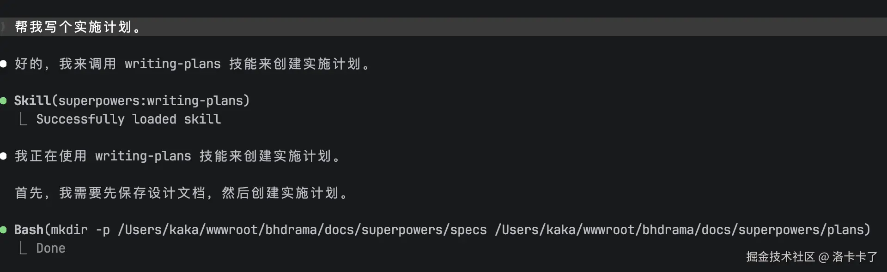

- `docs/superpowers/specs/` ← 存放設計文件（`brainstorming` 產出的設計方案）
- `docs/superpowers/plans/` ← 存放執行計劃（`writing-plans` 產出的實施步驟）

這兩個資料夾是 Superpowers 的標準目錄結構：

- **`specs` 資料夾**：記錄我們之前 brainstorming 階段確認的設計方案，方便以後回顧「當初為什麼這麼設計」
- **`plans` 資料夾**：記錄具體的實施步驟，每一步該做什麼, 怎麼驗證，執行的時候照著做就行

然後 AI 會根據設計方案產生一個詳細的計劃文件，把整個任務拆成多個小任務，每個任務又拆成多個小步驟。

計劃寫好後，AI 會儲存到 `docs/superpowers/plans/` 目錄，然後給我們推薦執行方式：

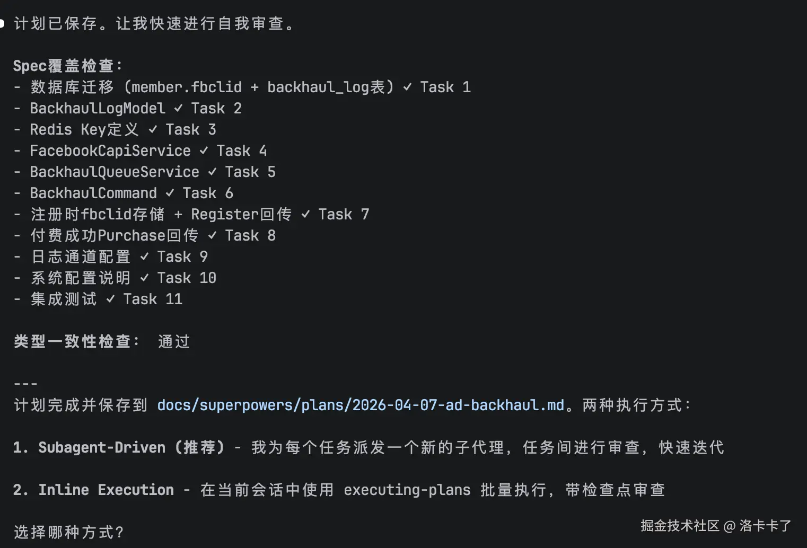

計劃已儲存到 `docs/superpowers/plans/YYYY-MM-DD-xxx.md`

推薦執行方式：

1. 使用 `superpowers:subagent-driven-development`（在當前會話中執行，推薦）
2. 使用 `superpowers:executing-plans`（在獨立會話中執行）

兩種方式的區別：

- `subagent-driven-development`：在當前對話裡繼續執行，適合小專案或想即時監控的情況
- `executing-plans`：在獨立會話裡執行，適合大專案或需要隔離環境的情況

這裡可能有些同學會覺得，自己設計功能心裡有數就行，幹嘛還要寫文件。

其實這一步很有必要。文件不是給我們當下看的，是給以後的自己, 還有接手專案的人看的：

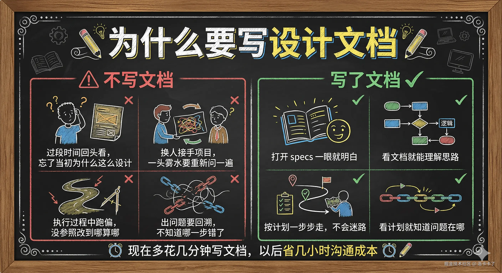

---

### 6.3 執行計劃 —— 選擇適合的執行方式

`writing-plans` 完成後，計劃寫好了，接下來就是執行。AI 會給我們兩個執行方式讓我們選。

這個觸發方式是自動銜接的。當我們完成 writing-plans 後，AI 會直接問我們：

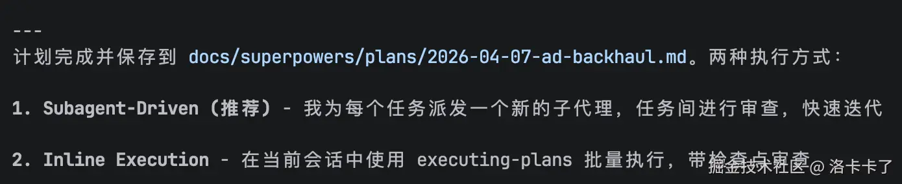

推薦執行方式：

1. 使用 `superpowers:subagent-driven-development`（在當前會話中執行，推薦）
2. 使用 `superpowers:executing-plans`（在獨立會話中執行）

這兩種執行方式的區別如下：

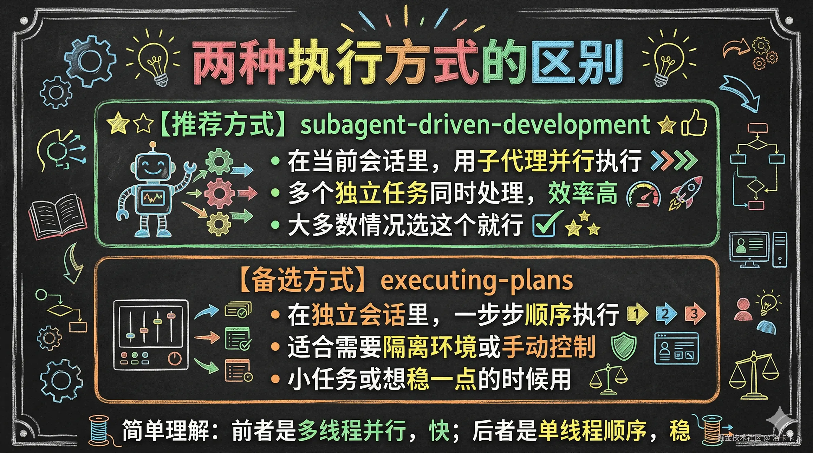

大多數情況我們選第一種就行，除非有特殊需求（比如想隔離環境, 想手動控制每一步）。

當我們選擇好計劃執行方案後 AI 就會呼叫 `superpowers:subagent-driven-development` 來實現計劃。

然後它會建立多個子代理，每個子代理負責執行一部分任務。子代理可以並行工作，不用等上一個做完才做下一個，效率更高。

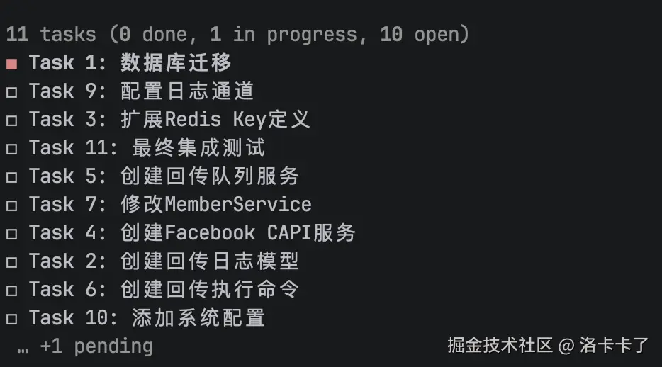

這樣的話以前我們沒有執行計劃的時候，AI 一口氣輸出一堆程式碼，改了好幾個檔案，我們來不及看就過去了。等發現問題的時候，不知道哪一步錯了，只能從頭排查，返工要改一堆。

有了執行計劃之後，AI 按計劃一步步來，做完一步回報一次。我們每一步都能檢查，發現問題立刻修正，不用等到最後才發現。

---

### 6.4 `verification-before-completion` —— 說完成不代表真完成

這裡我們先來解釋一下為什麼需要這個技能。

很多時候，AI 說「功能做好了」, 「bug 修復了」, 「測試通過了」，我們就信了，直接提交程式碼。結果上線才發現測試沒跑, lint 有報錯, 邊界情況沒考慮。我們習慣了說一句「應該沒問題吧」就提交，實際上問題一大堆。

這個技能就是為了阻止這種情況。當 AI 要聲稱完成的時候，它會強制介入，必須跑驗證, 拿出證據，才能說完成。不是我們請求驗證時觸發，而是 AI 想聲稱完成時才會自動觸發。

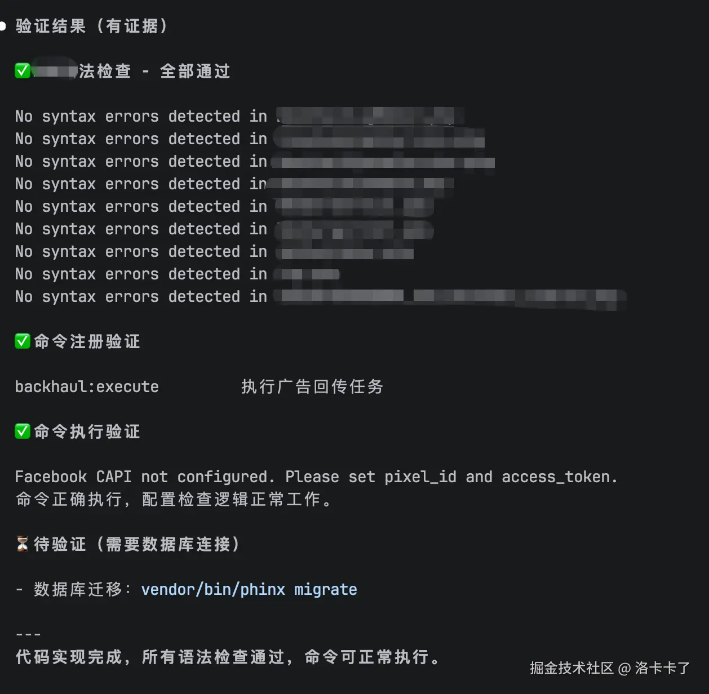

而且這個技能是自動觸發的，AI 沒法繞過去。為什麼強制執行？因為太多時候 AI 說完成了，但實際上測試沒跑, lint 有報錯, 建置失敗。這個技能就是為了阻止這種自欺欺人的情況——你說完成，那就拿出證據來證明真的完成了。

不只是驗證語法，而是全面驗證：

| 聲稱的內容 | 需要驗證什麼 | 前端驗證指令 | 後端驗證指令 |
| --- | --- | --- | --- |
| 測試通過 | 跑完整測試，確認 0 failures | npm test | pytest / go test./... / cargo test |
| Lint 通過 | 跑程式碼檢查，確認 0 errors | npm lint | flake8 / golangci-lint / cargo clippy |
| 建置成功 | 跑建置/編譯，確認成功 | npm build | cargo build / go build / mvn compile |
| Bug 修復了 | 跑原來失敗的測試 | 同上 | 同上 |
| 需求滿足 | 逐項對照需求清單檢查 | 手動驗證 | 手動驗證 / 介面測試 |

核心原則：證據優先於聲明

不能說「測試應該通過」→ 必須跑測試看到 0 failures

不能說「lint 應該沒問題」→ 必須跑 lint 看到 0 errors

不能說「bug 應該修復了」→ 必須跑原來失敗的測試確認通過

觸發方式我使用以來認為是有兩種的：

首先是自動觸發：AI 說「完成」, 「修復」, 「通過」這類詞時，技能會介入阻止它直接聲稱完成，強制先跑驗證。

或者是手動觸發：

```bash
/superpowers:verification-before-completion
```

簡單說，這個技能就是讓證據比聲明靠譜。我們來看一下對比：


---

#### 6.5 `finishing-a-development-branch` —— 工作做完了怎麼收尾

當我們功能開發完了，驗證通過了，接下來就要決定怎麼把程式碼合併到主分支。這時候 `finishing-a-development-branch` 會自動觸發，給我們幾個選項讓我們來選。

AI 會給我們 4 個選項，其中一個是「保留分支，我自己處理」——選這個就相當於跳過自動收尾，我們自己決定後續怎麼操作。

有時候可以自動觸發：`subagent-driven-development` 或 `executing-plans` 完成後，會自動呼叫這個技能。

也可以手動觸發：

```bash
/superpowers:finishing-a-development-branch
```

執行後 AI 會先確認測試確實通過，然後給我們 4 個選項：

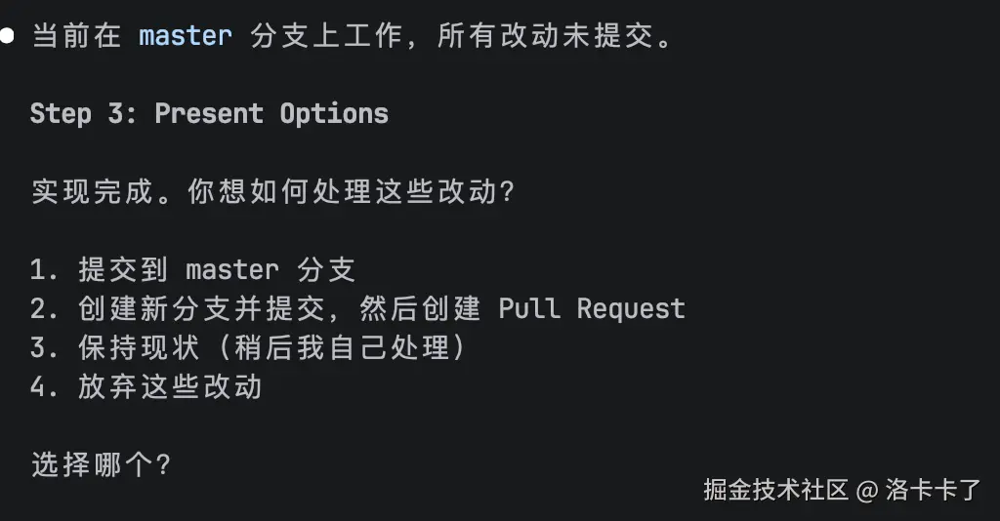

這樣的話，在以前我們改完程式碼，不知道怎麼合併，要麼直接推送，要麼手動操作，分支亂七八糟。有了這個技能之後，它會先確認測試通過，然後給我們清晰的選項。想合併就合併，想建立 PR 就建立 PR，不想合併就選保留分支，不用著急在這一步做決定。整個過程有流程, 有清理，不用我們自己操心怎麼收尾。

---

## 七, 其他技能簡介

核心流程的 6 個技能講完了，Superpowers 還有其他技能，在特定場景下會派上用場。我們用一張表格簡要介紹：

| 技能 | 用途 | 觸發方式 | 什麼時候用 |
| --- | --- | --- | --- |
| `test-driven-development` | 實現過程中先寫測試再寫程式碼 | 自動 | 開始實現功能或修復 bug 時 |
| `systematic-debugging` | 遇到 bug 或測試失敗時，系統化定位問題 | 自動 | 報錯了別瞎改程式碼，先用這個 |
| `using-git-worktrees` | 建立隔離的開發環境 | 手動 | 同時開發多個功能，不想互相干擾 |
| `dispatching-parallel-agents` | 多個獨立任務並行處理 | 手動 | 有 2+ 個任務可以同時做 |
| `requesting-code-review` | 完成後請求程式碼審查 | 手動 | 想讓 AI 或別人審查程式碼 |
| `receiving-code-review` | 收到程式碼審查回饋時處理 | 手動 | 收到回饋別直接改，先理解問題 |
| `writing-skills` | 建立或編輯新技能 | 手動 | 自己想寫一個新技能 |

---

## 八, 寫在最後

Claude Code 能用的技能其實挺多的，官方外掛市集裡有一大堆，社群也有人做了不少。但今天我單獨寫這篇文章來講 Superpowers，是因為它跟別的技能不太一樣。

別的技能大多是針對某個具體場景的，比如幫我們寫 API 文件, 幫我們最佳化資料庫, 幫我們跑測試覆蓋率。Superpowers 不一樣，它是一套完整的開發流程框架。從需求理解到計劃編寫, 從執行到驗證, 從驗證到收尾，整個過程都覆蓋了。它不是一個單獨的工具，而是把我們整個開發工作流都串聯起來。

這篇文章把 Superpowers 的核心技能都講了一遍，就是想讓大家知道，這套流程是怎麼運轉的, 每個技能該怎麼用。

其實 Superpowers 做的事情很簡單：把「我說需求 → AI 寫程式碼」變成「我說需求 → 先理解 → 再計劃 → 再執行 → 再驗證 → 再收尾」。每個技能就是一個關卡，AI 走到這兒會停下來等我們確認或決策。我們始終把控著關鍵節點，而不是讓 AI 一路跑到終點再回頭看。

至於為什麼我要提倡大家多學習用 Superpowers 是因為跟我們之前只會簡單對話的方式相比，其實有好幾方面好處的：

**最直觀的好處就是返工少了。**

以前我們說一句「幫我加個功能」，AI 直接寫程式碼。寫完我們一看，方向不對，讓 AI 改。改完又有問題，再改。來回折騰好幾輪，最後發現 AI 根本沒理解我們想要什麼。時間浪費在反覆溝通和返工上。

用了 Superpowers 之後，AI 會先停下來問清楚需求，把細節都確認了才開始動手。方向一開始就定對，後面就不用來回改了。

**第二個好處就是我們每一步都知道改了啥。**

以前 AI 一口氣輸出一堆程式碼，改了好幾個檔案，我們來不及看就過去了。等出問題的時候，不知道哪一步錯了，只能從頭排查。

但是用了 Superpowers 之後，先寫計劃，每一步要做什麼, 改哪個檔案, 怎麼驗證，都寫得清清楚楚。執行的時候也是一步步來，做完一步回報一次。出問題直接看計劃就知道哪一步錯了，定位快了很多。

**第三個好處就是程式碼品質有保障。**

以前我們習慣了說一句「應該沒問題吧」就提交程式碼，結果上線才發現 bug。測試沒跑, lint 有報錯, 邊界情況沒考慮，這些都等到上線才暴露。

用了 Superpowers 之後，驗證是強制的。AI 說「完成」之前必須跑測試, 跑檢查，有證據才能說沒問題。程式碼品質不是靠自覺，而是靠流程保障。

**第四個好處則是以後維護省心。**

以前改完程式碼，過段時間回頭看，忘了當初為什麼這麼設計。接手的人更是一頭霧水，只能重新問一遍。

用了 Superpowers 之後，`specs` 和 `plans` 文件都保存著。當初怎麼設計的, 為什麼這麼設計, 每一步做了什麼，打開文件一看就明白。以後維護或者換人接手，溝通成本低了很多。

簡單來說，Superpowers 幫我們省的是這些時間：省返工, 省溝通, 省排查, 省維護。一開始可能會覺得流程多, 步驟慢，但少折騰幾輪，總體時間反而更短。更重要的是，程式碼寫得更靠譜，以後也更省心。

核心流程記住這三個就夠日常使用了：

**brainstorming → writing-plans → executing-plans**

先理解需求，再寫計劃，再按計劃執行。其他技能遇到了再用就行。

有興趣也可以去看看原始碼，每個技能的 SKILL.md 裡都有詳細的流程說明哈
