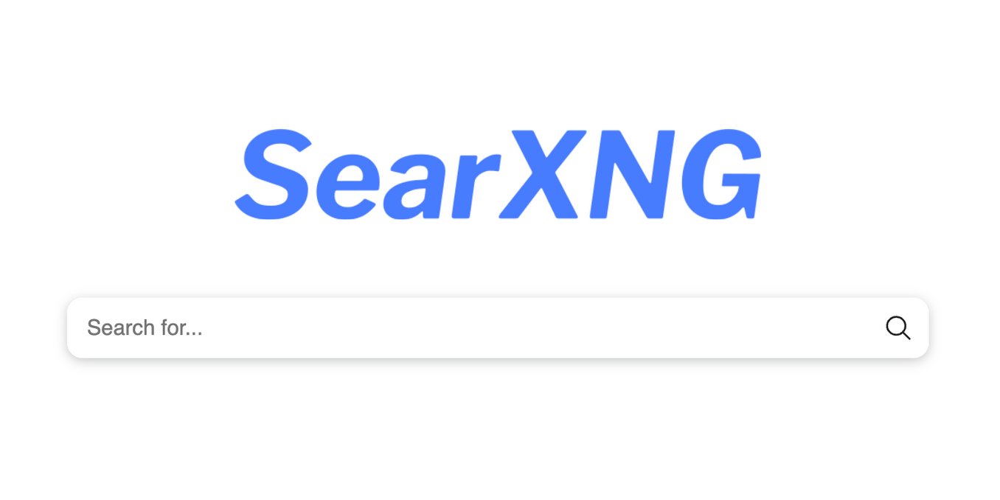

# SearXNG 網路搜尋

> Search without being tracked.

SearXNG 是一個免費的網路元數據搜尋引擎，它聚合了多達 231 個搜尋服務的搜尋結果。用戶既不會被跟踪，也不會被分析。此外，SearXNG 還可以透過 Tor 來實現線上匿名。

## SearXNG 如何保護隱私?

SearXNG 透過多種方式保護使用者的隱私，無論實例類型為何（私有或公用）。從搜尋請求中刪除私人資料有三種形式：

1. 從發送到搜尋服務的請求中刪除私人數據
2. 不透過搜尋服務轉發任何來自第三方服務的內容（例如廣告）
3. 從進入結果頁面的請求中刪除私人數據

刪除私人資料意味著不向外部搜尋引擎發送 cookie 並為每個請求產生隨機瀏覽器設定檔。因此，公有或私有實例處理請求並不重要，因為兩種情況下都是匿名的。使用的 IP 位址將是實例的 IP，但 SearXNG 也可以配置為使用代理或 Tor。

與大多數搜尋服務不同，SearXNG 不提供廣告或追蹤內容。因此，私人資料不會被轉發給可能將其商業化的第三方。除了保護使用者免受搜尋服務的侵害之外，引用頁面和搜尋查詢也會在所造訪的結果頁面中隱藏。

## 使用公共實例會有什麼後果?

如果有人使用公共實例(SearXNG)，他們必須信任該實例的管理員。這意味著公共實例的使用者不知道他們的請求是否被記錄、匯總並發送或出售給第三方。

此外，沒有適當保護的公共執行個體更容易受到搜尋服務的濫用，這可能會導致外部服務強制執行 CAPTCHA 或禁止執行個體的 IP 位址。因此，搜尋請求將返回較少的結果。

## 那麼私有實例呢?

如果使用者運行自己的實例，那麼一切都在他們的控制之中：原始碼、日誌設定和私人資料。未知的實例管理員不必值得信任。

此外，由於其實例的預設設定是可編輯的，因此無需使用 cookie 來根據其需求自訂 SearXNG，且在清除瀏覽器 cookie 時偏好不會重設為預設值。由於設定儲存在使用者的電腦上，只要使用者的電腦沒有受到威脅，其他人就無法存取這些設定。

## 結論

始終使用由您信任的人所構建的 SearXNG 實例。無論使用者使用哪種實例，都可以使用 SearXNG 的隱私功能。

對於那些忙碌或只是想第一次嘗試 SearXNG 的人來說，公共實例是最好的選擇。公共實例也為那些無法或不想運行實例的人提供了尊重隱私的搜尋服務，從而使世界變得更美好。