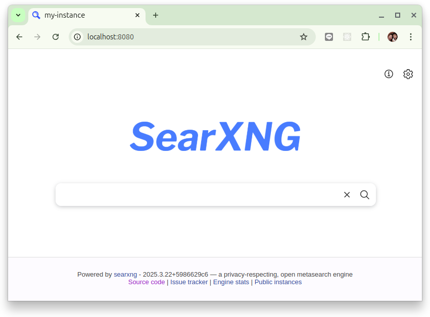
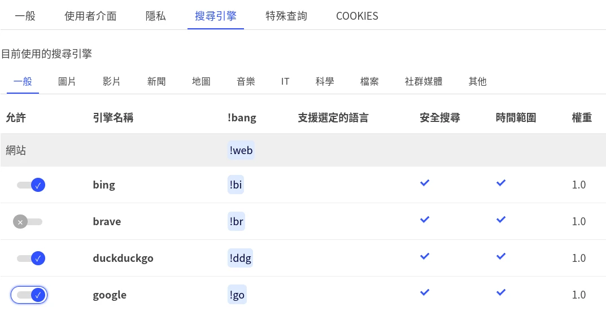

# SearXNG 安裝

SearXNG 的安裝手法有好幾種, 下列的手法主要使用 Docker Compose 來安裝, 有其它客製化的需要的朋友可參考:

- [SearXNG 管理](https://docs.searxng.org/admin/index.html)

## 使用 Docker

Docker 映像是基於 [git://Dockerfile](https://github.com/searxng/searxng/blob/master/Dockerfile) 並可從 [searxng/searxng@dockerhub](https://hub.docker.com/r/searxng/searxng) 取得。使用 docker 映像非常簡單，例如，您可以拉取 [searxng/searxng @dockerhub](https://hub.docker.com/r/searxng/searxng) 映像並使用 `docker run` 部署本機實例：

```bash
$ mkdir my-instance
$ cd my-instance
$ export PORT=8080
$ docker pull searxng/searxng
$ docker run --rm \
             -d -p ${PORT}:8080 \
             -v "${PWD}/searxng:/etc/searxng" \
             -e "BASE_URL=http://localhost:$PORT/" \
             -e "INSTANCE_NAME=my-instance" \
             searxng/searxng
```

設定環境變數 `UWSGI_WORKERS` 和 `UWSGI_THREADS` 會覆寫 `/etc/searxng/uwsgi.ini` 中指定的預設 **UWSGI** 進程數和 **UWSGI** 執行緒數。

打開你的 WEB 瀏覽器並造訪以下 URL：

- `http://localhost:$PORT`



這個 SearXNG 服務的目錄結構如下:

```bash
my-instance/
└── searxng
    ├── settings.yml
    └── uwsgi.ini
```

在裡面 `${PWD}/searxng` ，你會發現 `settings.yml` 和 `uwsgi.ini`。您可以根據需要修改這些檔案並重新啟動 Docker

下列的命令假設你的 SearXng 的 container id 是 `2f998` (請使用 `docker ps` 去查找你的 container id!):

```bash
$ docker container restart 2f998
```

使用指令列出正在運作的容器，新增標誌 `-a` 來列出已退出的容器。正在運作的容器可以被停止。若要刪除容器，請使用：

- `docker container rm ${container_id}

```bash
$ docker container ls
CONTAINER ID   IMAGE             COMMAND                  CREATED         ...
2f998d725993   searxng/searxng   "/sbin/tini -- /usr/…"   7 minutes ago   ...

$ docker container stop 2f998
$ docker container rm 2f998
```

如果您不再使用 docker 並且想要刪除所有容器和映像，請使用以下 `prune` 命令：

```bash
$ docker stop $(docker ps -aq)       # stop all containers
$ docker system prune                # make some housekeeping
$ docker rmi -f $(docker images -q)  # drop all images
```

!!! warn
    這可能會刪除所有 docker 項目，而不僅僅是來自 SearXNG 的項目。

### 啟動 SearXNG Searh API

要讓 AI Agent 能夠使用 SearxNG 來做搜尋外部網站資訊的工具, 必需要設定 SearXNG 來啟動對 `json` 格式的支持。

當安裝 SearxNG 時，預設的輸出格式是 **HTML** 格式。我們需要啟動 `json` 格式才能使用 SearXNG 的搜尋 API。可以透過在 `settings.yml` 文件中添加以下行來實現：

```json title="settings.yml"
search:
    formats:
        - html
        - json
```

讓我們修改 `my-instance/searxng/settings.yml` 并增加 `- json` 在 `search.formats` 的設定, 然後重啟 SearXNG 的 docker 實例。


```bash
my-instance/
└── searxng
    ├── settings.yml
    └── uwsgi.ini
```

!!! info
    你可以透過向 API 端點發出 `curl` 請求來確保 SearXNG 的搜尋 API 是否正常運作：

    ```bash
    curl -kLX GET --data-urlencode q='langchain' -d format=json http://localhost:8080
    ```

### 調整 SearXNG 設定

進入 SearXNG 首頁後，點選右上角設定做些微調。

首先搜尋引擎並非越多越好，會增加回應時間。通常我只會保留 `Google` `Duckduckgo` `Bing` 這幾個較多人用的。



其它的不同類型的資料搜尋引擎設定也可依需要去調整。

### 建構 container 鏡像

可以從 SearXng 的 [github repo](https://github.com/searxng/searxng/blob/master/Dockerfile) 來從頭建置 SearXNG：

```bash
$ git clone https://github.com/searxng/searxng.git
$ cd searxng
$ make docker.build
...
Successfully built 49586c016434
Successfully tagged searxng/searxng:latest
Successfully tagged searxng/searxng:1.0.0-209-9c823800-dirty

$ docker images
REPOSITORY        TAG                        IMAGE ID       CREATED          SIZE
searxng/searxng   1.0.0-209-9c823800-dirty   49586c016434   13 minutes ago   308MB
searxng/searxng   latest                     49586c016434   13 minutes ago   308MB
alpine            3.13                       6dbb9cc54074   3 weeks ago      5.61MB
```

