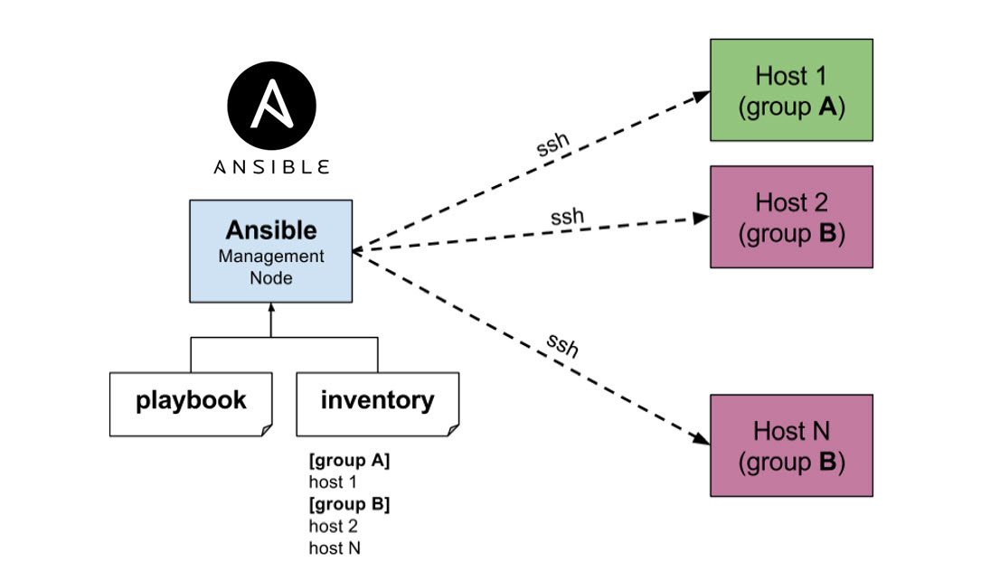
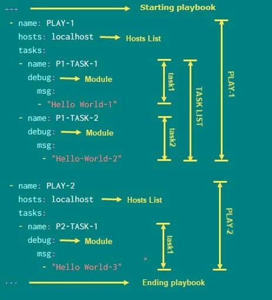
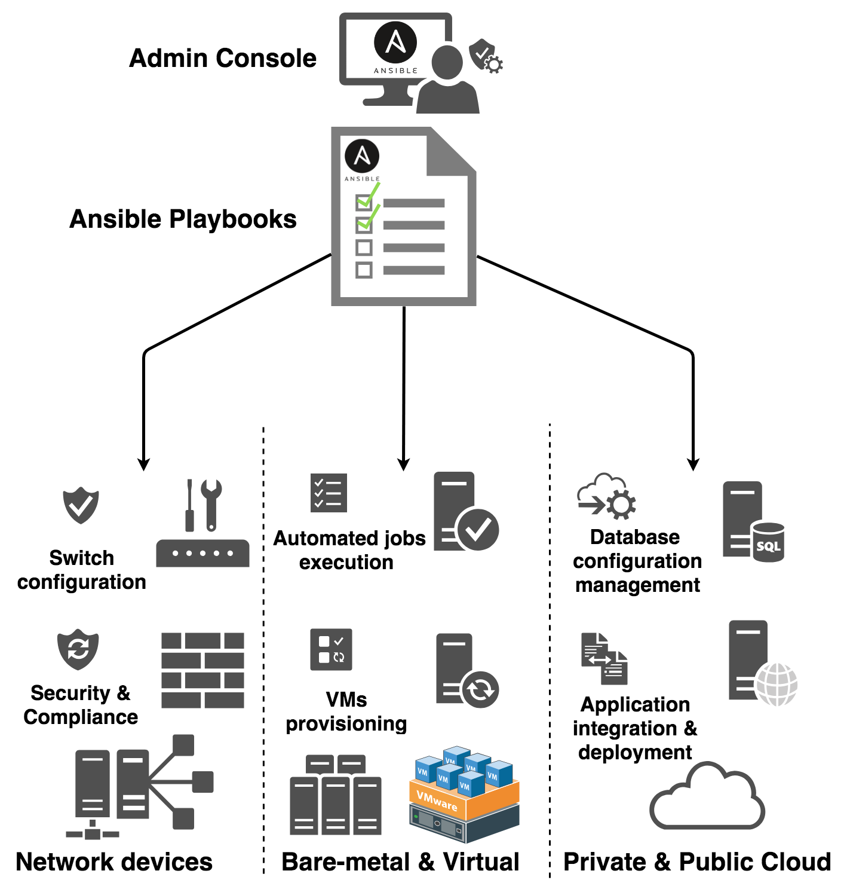
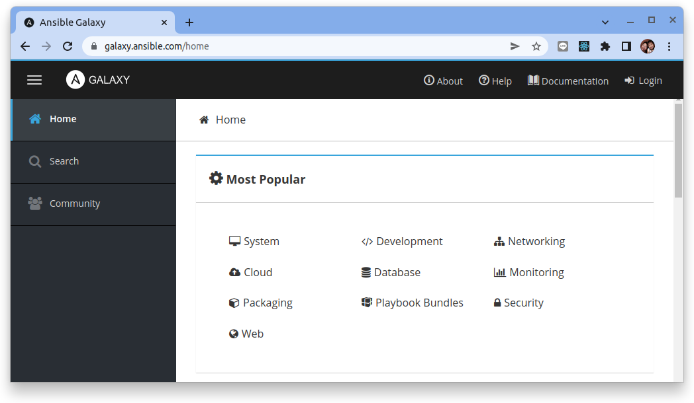
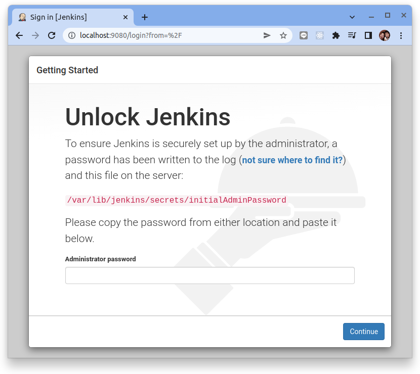
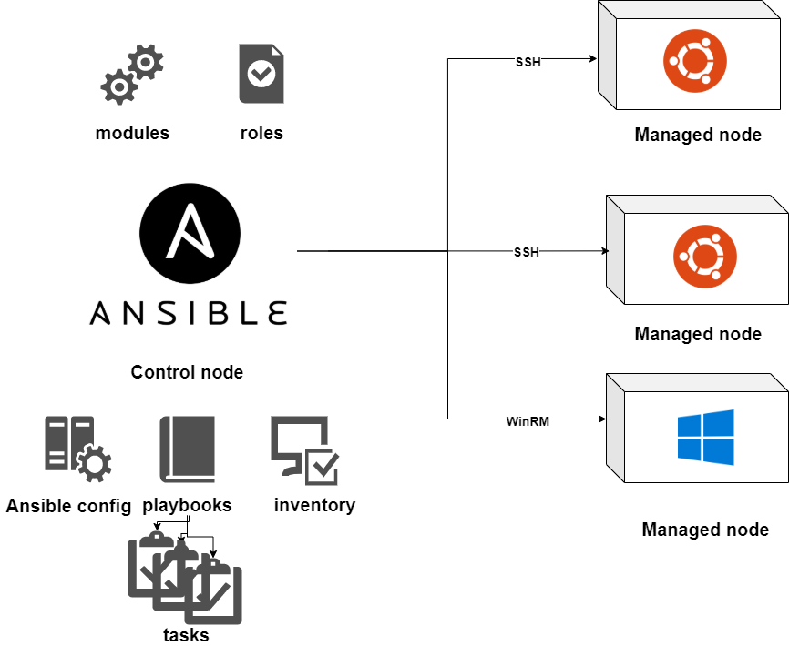

# 使用 Ansible 部署環境


在我們成功利用 Vagrant 模擬出所需的環境後，接下來就可以開始使用 [Ansible](https://www.ansible.com/) 這套自動化工具來進行部署了。

## Ansible 介紹

### Ansible 是什麼？

相信大家應該都有過重灌電腦的經驗。每一次在電腦重新安裝後，我們都需要花大量的時間把平常常用的軟體一一重新裝上，有些軟體可能還要進行個別的微調，而這樣繁瑣的步驟同樣也會發生在軟體部署的伺服器上。

為了運行開發出來的軟體，開發人員們往往需要要花費大量的時間在伺服器上安裝所有所需的套件 (packages) 或是服務依賴 (dependency)，而在安裝的過程中若有疏忽，還很有可能造成部署程式發生無預期的錯誤。因此，自動化就是因為這樣的需求產生的一種概念。

若我們可以將每一次部署的步驟寫成一個自動化的標準作業程序 (Standard Operating Procedures, SOP)，除了可以有效縮短每次的部署時間及降低出錯率外，在未來需要升級部署環境，也會相對容易許多。而 Ansible 就是目前業界最常使用的自動化工具之一。

### 為什麼要選擇 Ansible？

目前業界中主流的自動化部署工具除了 Ansible 之外還有 Chef、Otter、Puppet、SaltStack 等等。每一個陣營都有大量的擁護者以及各自的優缺點，其實在這個問題上並沒有誰絕對優於誰的答案。之所以選擇 Ansible 作為自動化的工具，主要原因是因為 Ansible 真的容易學習許多。在選擇工具的過程中，我相信最重要的考量應該在於我們能不能夠在最短的時間內掌握這個工具並有效地解決我們所遇到的問題。

在這樣的前提下，Ansible 就成為許多開發團隊的首選了。除了容易學習之外，Ansible 本身在 GitHub 上也是一個開源的專案。有了大量開發人員的幫助及回饋，Ansible 這套軟體的成長速度其實是真的相當驚人的。

### Ansible 的需求

由於 Ansible 是使用 Python 開發的一套免費軟體，要透過 Ansible 在遙控節點 (remote node) 上配置環境，唯二的條件只有：

- 安裝 Python
- 透過 SSH 進行連線

在現在大部分的 Linux 主機上，基本上 Python 已經都是基本配備了，所以這樣的要求等於沒有要求。我們只需要在安裝好 Ansible 的主機 (control machine) 上透過 SSH 與遙控節點溝通，就可以輕鬆做到一鍵部署！



## Ansible 安裝

在 Ansible 裡，會把所有機器的角色做以下兩種區分：

- `控制主機 (Control Machine)`：顧名思義，這類主機可以透過運行 Ansible 的劇本 (playbook) 對管理節點進行部署。
- `管理節點 (Managed Node)`：也稱為遙控節點 (Remote Node)。相對於控制主機，這類節點就是我們透過 Ansible 進行部署的對象。

對於這兩種不同的對象，在安裝 / 使用 Ansible 的時候也有不同的需求。

### 安裝 Ansible 在控制主機

由於 Ansible 是一套開源的軟體，所以在目前大部分的主流作業系統上都已經可以透過對應的套件管理 (package manager) 進行安裝了。以下列出幾個我主要比較常用作業系統的安裝方法：

=== "Ubuntu"

    ``` bash
    $ sudo apt update
    $ sudo apt install software-properties-common
    $ sudo add-apt-repository --yes --update ppa:ansible/ansible
    $ sudo apt install ansible
    ```

=== "CentOS/RHEL"

    ``` bash
    $ sudo yum install epel-release
    $ sudo yum install ansible
    ```

安裝好以後，確認 Ansible 已經安裝完成：

```bash
$ ansible --version

ansible [core 2.12.7]
  config file = /etc/ansible/ansible.cfg
  configured module search path = ['/home/dxlab/.ansible/plugins/modules', '/usr/share/ansible/plugins/modules']
  ansible python module location = /usr/lib/python3/dist-packages/ansible
  ansible collection location = /home/dxlab/.ansible/collections:/usr/share/ansible/collections
  executable location = /usr/bin/ansible
  python version = 3.10.4 (main, Jun 29 2022, 12:14:53) [GCC 11.2.0]
  jinja version = 3.0.3
  libyaml = True
```

### 安裝 Ansible 在管理節點

不需要！透過 Ansible 管理的管理節點完全不需要安裝 Ansible。如上個章節所述，我們只需要確保這個管理節點可以透過 SSH 與控制主機溝通，並已安裝 Python 2.6 以上的版本就可以透過控制主機管理了。

### 安裝 Ansible-lint

在編寫程式/腳本的時候，我都會習慣去找對應語言的 linter 來習慣該語言的風格。雖然 Ansbile 並不是一種程式語言，但它也有一個對應的 linter - Ansible-lint。我會建議大家可以安裝這個小工具，它可以幫助你確保寫出來的腳本品質是有一定水準的。

```
sudo pip install ansible-lint
```

檢查：

```
ansible-lint 6.2.1 using ansible 2.12.6
```

## 撰寫第一個 Playbook

當確認 Ansible 已經正確地安裝在控制主機上之後，我們現在就可以準備透過 Ansible 對遙控節點進行部署了。然而，我們要如何告訴 Ansible 我們想要對遙控節點做些什麼呢？在 Ansible 的世界裡，我們是透過編寫`劇本 (playbook)` 來告訴 Ansible 接下來需要做的事項。

由於 Ansible 的劇本是用 YAML (YAML Ain't Markup Language) 這種語言來撰寫，而這個語言最大的特色就是具有高度可讀性，因此無論有沒有程式語言的基礎，理論上任何人在看到一份好的 Ansible playbook 的時候應該都是非常容易理解及著手修改維護的。



### 第一個 playbook

以下先用一個非常簡單的範例來介紹 `playbook` 的運作方式。我們先創建一個 playbook 檔案，將其命名為 `playbook.yml` 並置於工作目錄下 (e.g. vagrant_getting_started/playbook.yml)。接著，開啟檔案並輸入以下內容：

```yaml title="playbook.yml"
---
- hosts: sre001
  tasks:
    # task 1
    - name: test connection
      ansible.builtin.ping:
      register: message

    # task 2
    - name: print debug message
      ansible.builtin.debug:
        msg: "{{ message }}"
```

相信大家就算從來沒有寫過 Ansible 的 playbook，應該還是不難猜出這份 playbook 在做些什麼。簡單來說，我們在這份 playbook 中定義了任務清單 tasks 以及部署對象 hosts: `sre001`。

這也是為什麼在之前的章節中我們提到了最好把每一個虛擬主機都做命名。主機命名後，我們可以直接透過主機的名稱直接進行操作（我們會在接下來的章節中提到若不透過 Vagrant 要如何命名主機）。

除此之外，我們可以透過 name 這個標籤替任務清單中的每個 task 分別命名。在接下來運行 playbook 的過程中若發生錯誤，我們也會比較清楚是在哪一個環節上出了問題。

在這個 playbook 中，我們定義了兩個 task：

**1. test connection**

!!! info
    我們在這個 task 中，呼叫了 Ansible 的內建測試模組 (module) - `ping`。這個模組的目的非常類似在學習每個語言一開始練習的 "Hello World" 程式。其主要是用來測試操控主機是否可以正確地與遙控節點進行溝通，如果連線正常，遙控節點就會回傳一個 "pong" 的訊息給控制主機。接著，我們透過另一個 Ansible 內建模組 - register 把遙控節點回傳的訊息存成變數 (variable) 的形式。

    注意：此處的 ping 並非建立在 ICMP 協定下的 ping 指令，只是純 Ansible 開發的一個簡單測試模組。

模組: [ansible.builtin.ping](https://docs.ansible.com/ansible/latest/collections/ansible/builtin/ping_module.html)

**2. print debug message**

!!! info
    在上一個 task 中，我們已經把 ping 後的結果存在 message 這個變數中了。我們可以利用 `debug` 這個模組把儲存的訊息輸出到我們的終端機上。在 Ansible 中，若要調用儲存變數，我們必須在變數名稱外加上兩個大括弧 - {{ }} 來告訴 Ansible 大括弧內的是一個變數 （如果變數在描述句 (statement) 的開頭，還必須要額外加上一個雙引號 - ""）。

模組: [ansible.builtin.debug](https://docs.ansible.com/ansible/latest/collections/ansible/builtin/debug_module.html)

### 檢查 playbook

利用 Ansible-lint 來檢查 playbook:

```bash
$ ansible-lint playbook.yml
```

如果沒有看到任何輸出就表示你的 playbook 完全沒有問題！不過為了展示 Ansible-lint 的提示效果，我在 playbook 的第五行句尾加上一個空白：

```
    - name: test connection 
                           ~
```

接著，重新輸入剛剛的指令：

```bash
$ ansible-lint playbook.yml

WARNING  Listing 1 violation(s) that are fatal
yaml: trailing spaces (yaml[trailing-spaces])
playbook.yml:5

You can skip specific rules or tags by adding them to your configuration file:
# .config/ansible-lint.yml
warn_list:  # or 'skip_list' to silence them completely
  - yaml  # Violations reported by yamllint.

Finished with 1 failure(s), 0 warning(s) on 1 files.
```

我們可以清楚地看到 Ansible-lint 告訴我們在 playbook.yml:5 第五行的地方有個後綴空白 (trailing whitespace)，為了保持程式碼的簡潔，我們可以將其刪除。

在定義好了我們的第一個 playbook 後，接下來就是如何運行我們寫好的 playbook。

## 運行 playbook

要透過 Ansible 來運行 playbook 相當容易，我們只要使用 ansible-playbook <playbook> 的指令就可以輕易運行我們編寫好的 playbook：

```bash
$ ansible-playbook playbook.yml
```

執行完畢後我們應該可以在終端機上看到以下的輸出：

```
[WARNING]: provided hosts list is empty, only localhost is available. Note that the implicit localhost does not match 'all'
[WARNING]: Could not match supplied host pattern, ignoring: sre001

PLAY [sre001] *****************************************************************************************************************************************************************
skipping: no hosts matched

PLAY RECAP ********************************************************************************************************************************************************************
```

### 什麼是 inventory?

在看到輸出結果後，我相信大部分的讀者可能會納悶為什麼輸出結果沒有任何執行成功或失敗的資訊。從終端機的結果我們可以知道 Ansible 什麼任務都沒有做，這樣的結果也不是我們所預期的。在解決這問題之前，讓我們先回憶一下我們之前撰寫的 `playbook.yml`：

```yaml title="playbook.yml"
---
- hosts: sre001
  tasks:
    # task 1
    - name: test connection
      ansible.builtin.ping:
      register: message

    # task 2
    - name: print debug message
      ansible.builtin.debug:
        msg: "{{ message }}"
```

從這份 playbook 中，我們可以很清楚地看到 Ansible 應該要對 `sre001` 這台主機進行任務清單中定義的任務。在之前 Vagrant 介紹中，我們的確對運行起來的主機進行了命名，然而，我們卻從來沒有告訴 Ansible 過哪一台主機是 `sre001`。

因此，解決這個問題最直接的方法就是定義一個主機列表 `inventory` 並讓 Ansible 參照，這樣 Ansible 才會知道該對誰做什麼事。

為了知道 `sre001` 這台主機的詳細資料，我們可以透過 `vagrant ssh-config` 來列出主機的相關資訊：

```bash
$ vagrant ssh-config

Host sre001
  HostName 127.0.0.1
  User vagrant
  Port 2201
  UserKnownHostsFile /dev/null
  StrictHostKeyChecking no
  PasswordAuthentication no
  IdentityFile /home/dxlab/opt/vagrant_getting_started/.vagrant/machines/sre001/virtualbox/private_key
  IdentitiesOnly yes
  LogLevel FATAL
```

!!! tip
    每一個人的回應可能因個人本機的狀況會有所不同，請特別注意 `Port` 與 `IdentifyFile` 的資訊。

接著讓我們在當下的目錄下新增一個檔案並命名為 `inventory` 

``` hl_lines="2"
.
├── inventory
├── playbook.yml
└── Vagrantfile
```

然後在檔案內寫入以下內容：

```
[sre001]
127.0.0.1 ansible_port=2201 ansible_user=vagrant ansible_ssh_common_args='-o StrictHostKeyChecking=no'
```

根據 vagrant ssh-config 列出來的主機資訊，我們在 inventory 中依序定義了 `sre001` 這台主機的連線 IP、port 入口以及登入使用者的身份。現在，讓我們重新執行運行指令，並將這份主機清單指定給 Ansible 參照：

```bash
$ ansible-playbook -i inventory playbook.yml
```

現在，輸出結果如下：

```
PLAY [sre001] *****************************************************************************************************************************************************************

TASK [Gathering Facts] ********************************************************************************************************************************************************
fatal: [127.0.0.1]: UNREACHABLE! => {"changed": false, "msg": "Failed to connect to the host via ssh: @@@@@@@@@@@@@@@@@@@@@@@@@@@@@@@@@@@@@@@@@@@@@@@@@@@@@@@@@@@\r\n@    WARNING: REMOTE HOST IDENTIFICATION HAS CHANGED!     @\r\n@@@@@@@@@@@@@@@@@@@@@@@@@@@@@@@@@@@@@@@@@@@@@@@@@@@@@@@@@@@\r\nIT IS POSSIBLE THAT SOMEONE IS DOING SOMETHING NASTY!\r\nSomeone could be eavesdropping on you right now (man-in-the-middle attack)!\r\nIt is also possible that a host key has just been changed.\r\nThe fingerprint for the ECDSA key sent by the remote host is\nSHA256:7WcamAcB+cK5FXwfTxMiXBeovKpBFqpv4k4J6JzODYw.\r\nPlease contact your system administrator.\r\nAdd correct host key in /home/dxlab/.ssh/known_hosts to get rid of this message.\r\nOffending ECDSA key in /home/dxlab/.ssh/known_hosts:3\r\n  remove with:\r\n  ssh-keygen -f \"/home/dxlab/.ssh/known_hosts\" -R \"[127.0.0.1]:2201\"\r\nECDSA host key for [127.0.0.1]:2201 has changed and you have requested strict checking.\r\nHost key verification failed.", "unreachable": true}

PLAY RECAP ********************************************************************************************************************************************************************
127.0.0.1                  : ok=0    changed=0    unreachable=1    failed=0    skipped=0    rescued=0    ignored=0  
```

現在 Ansible 知道誰是 `sre001` 了！不過，看起來 Ansible 似乎並沒有辨法將我們 playbook 中定義動作成功地部署到 `sre001` 上。

### 設定 PRIVATE_KEY_FILE

從上面的錯誤訊息 (error message) 中我們可以知道部署失敗的原因發生在 SSH 連線失敗。還記得我們說過使用 Ansible 部署遙控節點必須要透過 SSH 連線嗎？一般來說，我們如果要透過 SSH 存取網站我們會預設將產生出來的公用金鑰 (public key) 存放在 `~/.ssh/` 的路徑下，然後再手動將這組金鑰加到我們想要授權的服務列表上。

不過，因為我們是使用 Vagrant 建立起一台虛擬主機作為練習，Vagrant 其實已經事先幫我們把控制主機與遙控節點做好 SSH 配對了，所以我們並不需要手動設定這個部分。從上面的 vagrant ssh-config 輸出的結果中，我們可以看到一個特殊的參數：

```
IdentityFile /home/dxlab/opt/vagrant_getting_started/.vagrant/machines/sre001/virtualbox/private_key
```

這個參數告訴了我們這台虛擬主機 private key 的存放位置，我們只需要透過以下指令，將這個檔案的路徑指定給 Ansible，我們就可以成功運行我們的 playbook 囉！

```
$ ansible-playbook -i inventory --private-key /home/dxlab/opt/vagrant_getting_started/.vagrant/machines/sre001/virtualbox/private_key playbook.yml
```

運行結果：

```
PLAY [sre001] *****************************************************************************************************************************************************************

TASK [Gathering Facts] ********************************************************************************************************************************************************
ok: [127.0.0.1]

TASK [test connection] ********************************************************************************************************************************************************
ok: [127.0.0.1]

TASK [print debug message] ****************************************************************************************************************************************************
ok: [127.0.0.1] => {
    "msg": {
        "changed": false,
        "failed": false,
        "ping": "pong"
    }
}

PLAY RECAP ********************************************************************************************************************************************************************
127.0.0.1                  : ok=3    changed=0    unreachable=0    failed=0    skipped=0    rescued=0    ignored=0   
```

成功接收到從 `sre001` 回傳回來的 "pong" 了！

## Ansible Role 初登場

現在大家應該了解如何撰寫 `Ansible playbook`，並將我們的工作清單以 task 的方式在 playbook 中表列下來。然而，如果 Ansible 只能做到這樣的程度，充其量我們只能說這是一個比較方便閱讀的 Shell script 罷了。若是今天我們清單中的任務有上百個，這樣我們的 playbook 也可能會變得非常冗長，就算語法再如何易讀，整體而言 playbook 還是會變得十分難以理解。

另外，很多時候其實我們會希望有部分的部署內容是可以被其他不同的 playbook 重新使用。舉例來說，很多服務都可以直接使用 pip 這個套件管理來進行安裝，我們並不會希望在每一個不同的 playbook 中都要重新定義一次 pip 的安裝方法。

因此，為了解決上述的問題，Ansible 提供了我們在撰寫自動化腳本時一個角色 `role` 的概念。我們可以透過撰寫屬於自己的 `role` 來讓所有 playbook 重複使用，藉此提升透過 Ansible 自動化的靈活度。



### 第一個 role

考量到由於安裝 cURL 的這個工作很可能會在未來頻繁地被不同的 playbook 重複使用，因此，我們選擇把安裝 cURL 的方法寫成一個可以重複被利用的 role ，而非 playbook 中的一個 task。

讓我們在工作資料夾下依照以下結構新增檔案 (新增 `roles/curl/main.yml`)：

```
workspace
├── Vagrantfile
├── inventory
├── playbook.yml
└── roles
    └── curl
        └── tasks
            └── main.yml
```

在這個結構下， `curl` 就是我們的第一個 role 的名稱，而這個 role 的工作流程就會被我們定義在下面的 `tasks/main.yml` 之中。現在打開 `curl/tasks/main.yml` 並在其中寫入以下內容：

```yaml title="curl/tasks/main.yml"
---
  - name: install curl
    ansible.builtin.apt:
      name: curl
```

我們在這個 role 的內容中呼叫了 Ansible 內建模組 `apt`，並利用它直接進行 cURL 的安裝。接著，打開我們的 playbook.yml，並修改為以下內容：

```yaml title="playbook.yml"
---
- hosts: ironman
  roles:
    - { role: curl, become: yes }
```

我們刪除了之前用來測試的 ping 劇碼 (play)，並在這個 playbook 中告訴 Ansible 我們想要執行 curl 這個我們剛定義好的 role。其中要特別注意的是，`become` 代表我們要升高當前使用者權限 （等效於 Unix / Linux 中的 sudo 指令）來運行當前工作。

最後，重新運行我們的 playbook

```bash
$ ansible-playbook -i inventory --private-key /home/dxlab/opt/vagrant_getting_started/.vagrant/machines/sre001/virtualbox/private_key playbook.yml
```

得到以下結果：

```
PLAY [sre001] *****************************************************************************************************************************************************************

TASK [Gathering Facts] ********************************************************************************************************************************************************
ok: [127.0.0.1]

TASK [curl : install curl] ****************************************************************************************************************************************************
ok: [127.0.0.1]

PLAY RECAP ********************************************************************************************************************************************************************
127.0.0.1                  : ok=2    changed=0    unreachable=0    failed=0    skipped=0    rescued=0    ignored=0
```

### 配置 ansible.cfg

有些時候我們想要把相關的roles置放的路徑做不同的規劃時，Ansible 就會找不到對應 role 檔案的位置。因此，我們就必須透過設定 Ansible 的配置檔案 - `ansible.cfg` 來設置 role 路徑 (path)。

新增一個檔案 `ansible.cfg` 並加入以下內容：

```ini title="ansible.cfg"
[sre001]
roles_path = ./roles
```

若點進官方配置文件的說明頁面，可以發現除了 `roles_path` 之外還有一大堆參數可以依據使用者的需求進行非常有彈性的配置。其中值得注意的是，在這個示範裡面我是將 ansible.cfg 這個配置檔案置於我們工作資料夾之下，目前具體資料夾結構如下：

```
workspace
├── ansible.cfg
├── inventory
├── playbook.yml
├── roles
│   └── curl
│       └── tasks
│           └── main.yml
└── Vagrantfile
```

但從官方文件中，我們可以發現除了將配置檔案放置於工作目錄底下外，還有其他幾種不同的配置方式：

- 設置環境變量 `ANSIBLE_CONFIG`
- 置於當前目錄下的 `ansible.cfg`（這次範例中使用的方法）
- 置於根目錄下的 `.ansible.cfg`
- 置於 `/etc/ansible/` 下的 ansible.cfg

若我們同時分別有不同的配置文件存在在系統中，Ansible 會依照上述順序逐一查找文件，若找到其中一個，就會依其設定進行配置，並不再繼續查找。

## 建立 Ansible Role 的依賴關係

在完成第一個簡單的 role 之後，讓我們試著安裝一個CI/CD的工具 Jenkins。

### 自動化 Jenkins 安裝

參考: https://www.digitalocean.com/community/tutorials/how-to-install-jenkins-on-ubuntu-20-04

Jenkins 在 Ubuntu 上的安裝方式：

```bash 
$ wget -q -O - https://pkg.jenkins.io/debian-stable/jenkins.io.key | sudo apt-key add -
$ sudo sh -c 'echo deb http://pkg.jenkins.io/debian-stable binary/ > /etc/apt/sources.list.d/jenkins.list'
$ sudo apt update
$ sudo apt install jenkins
```

簡單來說，我們會從 Jenkins 官方釋出的 Debian 套件庫中將密鑰 (key) 加入本地，並新增對應的倉庫 (repository) 入口。最後，再透過 apt 這個套件管理進行 Jenkins 的安裝。現在讓我們把上面的指令翻譯成 Ansible 的腳本：

```yaml
---
  - name: add jenkins key
    ansible.builtin.apt_key:
      url: https://pkg.jenkins.io/debian-stable/jenkins.io.key
      state: present

  - name: add jenkins repository
    ansible.builtin.apt_repository:
      repo: deb http://pkg.jenkins.io/debian-stable binary/
      state: present

  - name: install jenkins
    ansible.builtin.apt:
      name: jenkins
      update_cache: yes
```

!!! tip
    在這次的任務中我們使用了三個Ansible的模組:

    - [ansible.builtin.apt_key 模組](https://docs.ansible.com/ansible/latest/collections/ansible/builtin/apt_key_module.html)
    - [ansible.builtin.apt_repository 模組](https://docs.ansible.com/ansible/latest/collections/ansible/builtin/apt_repository_module.html)
    - [ansible.builtin.apt 模組](https://docs.ansible.com/ansible/latest/collections/ansible/builtin/apt_module.html)


其中  apt_key 及 apt_repository 都是 Ansible 已經內建的兩個模組，我們可以直接利用它們進行密鑰及倉庫的新增，更多細節操作可以在官方的文件上查看。而在 install jenkins 這個 task 之下的 update_cache 其實就是等效於我們在一般 Ubuntu / Debian 系統下使用 apt-get update 的指令，若在操作 Ansible 的 apt 這個模組時使用了 update_cache: yes，這就意味著我們會先將遙控節點上的 apt 套件管理進行升級才做接下來的動作。

解釋完要做的事以後，這次我也要同時將整個安裝 Jenkins 的流程寫成另外一個 role。一樣的，在工作資料夾下依照以下結構新增 jenkins 這個 role，並在 `roles/jenkins/tasks/main.yml` 中輸入以上內容：

```
workspace
├── ansible.cfg
├── inventory
├── playbook.yml
├── roles
│   ├── curl
│   │   └── tasks
│   │       └── main.yml
│   └── jenkins
│       └── tasks
│           └── main.yml
└── Vagrantfile
```

現在我們有兩個 roles 了。回到我們的 playbook.yml 作以下的調整:

```yaml title="playbook.yml"
---
- hosts: sre001
  roles:
    - { role: curl, become: yes }
    - { role: jenkins, become: yes }
```

重新執行 playbook:

```bash
$ ansible-playbook -i inventory --private-key /home/dxlab/opt/vagrant_getting_started/.vagrant/machines/sre001/virtualbox/private_key playbook.yml
```

```
PLAY [sre001] *************************************************************************************************************

TASK [Gathering Facts] ****************************************************************************************************
ok: [127.0.0.1]

TASK [curl : install curl] ************************************************************************************************
ok: [127.0.0.1]

TASK [jenkins : add jenkins key] ******************************************************************************************
changed: [127.0.0.1]

TASK [jenkins : add jenkins repository] ***********************************************************************************
changed: [127.0.0.1]

TASK [jenkins : install jenkins] ******************************************************************************************
fatal: [127.0.0.1]: FAILED! => {"cache_update_time": 1654304408, "cache_updated": true, "changed": false, "msg": "'/usr/bin/apt-get -y -o \"Dpkg::Options::=--force-confdef\" -o \"Dpkg::Options::=--force-confold\"       install 'jenkins'' failed: E: Sub-process /usr/bin/dpkg returned an error code (1)\n", "rc": 100, "stderr": "E: Sub-process /usr/bin/dpkg returned an error code (1)\n", "stderr_lines": ["E: Sub-process /usr/bin/dpkg returned an error code (1)"], "stdout": "Reading package lists...\nBuilding dependency tree...\nReading state information...\nThe following additional packages will be installed:\n  net-tools\nThe following NEW packages will be installed:\n  jenkins net-tools\n0 upgraded, 2 newly installed, 0 to remove and 1 not upgraded.\nNeed to get 91.6 MB of archives.\nAfter this operation, 95.9 MB of additional disk space will be used.\nGet:2 http://archive.ubuntu.com/ubuntu focal/main amd64 net-tools amd64 1.60+git20180626.aebd88e-1ubuntu1 [196 kB]\nGet:1 https://pkg.jenkins.io/debian-stable binary/ jenkins 2.332.3 [91.4 MB]\nFetched 91.6 MB in 12s (7,593 kB/s)\nSelecting previously unselected package net-tools.\r\n(Reading database ... \r(Reading database ... 5%\r(Reading database ... 10%\r(Reading database ... 15%\r(Reading database ... 20%\r(Reading database ... 25%\r(Reading database ... 30%\r(Reading database ... 35%\r(Reading database ... 40%\r(Reading database ... 45%\r(Reading database ... 50%\r(Reading database ... 55%\r(Reading database ... 60%\r(Reading database ... 65%\r(Reading database ... 70%\r(Reading database ... 75%\r(Reading database ... 80%\r(Reading database ... 85%\r(Reading database ... 90%\r(Reading database ... 95%\r(Reading database ... 100%\r(Reading database ... 63489 files and directories currently installed.)\r\nPreparing to unpack .../net-tools_1.60+git20180626.aebd88e-1ubuntu1_amd64.deb ...\r\nUnpacking net-tools (1.60+git20180626.aebd88e-1ubuntu1) ...\r\nSelecting previously unselected package jenkins.\r\nPreparing to unpack .../jenkins_2.332.3_all.deb ...\r\nUnpacking jenkins (2.332.3) ...\r\nSetting up net-tools (1.60+git20180626.aebd88e-1ubuntu1) ...\r\nSetting up jenkins (2.332.3) ...\r\nCreated symlink /etc/systemd/system/multi-user.target.wants/jenkins.service → /lib/systemd/system/jenkins.service.\r\nJob for jenkins.service failed because the control process exited with error code.\r\nSee \"systemctl status jenkins.service\" and \"journalctl -xe\" for details.\r\ninvoke-rc.d: initscript jenkins, action \"start\" failed.\r\n● jenkins.service - Jenkins Continuous Integration Server\r\n     Loaded: loaded (\u001b]8;;file://ubuntu-focal/lib/systemd/system/jenkins.service\u0007/lib/systemd/system/jenkins.service\u001b]8;;\u0007; enabled; vendor preset: enabled)\r\n     Active: activating (auto-restart) (Result: exit-code) since Sat 2022-06-04 01:00:24 UTC; 7ms ago\r\n    Process: 3569 ExecStart=/usr/bin/jenkins \u001b[0;1;31m(code=exited, status=1/FAILURE)\u001b[0m\r\n   Main PID: 3569 (code=exited, status=1/FAILURE)\r\ndpkg: error processing package jenkins (--configure):\r\n installed jenkins package post-installation script subprocess returned error exit status 1\r\nProcessing triggers for man-db (2.9.1-1) ...\r\nProcessing triggers for systemd (245.4-4ubuntu3.17) ...\r\nErrors were encountered while processing:\r\n jenkins\r\n", "stdout_lines": ["Reading package lists...", "Building dependency tree...", "Reading state information...", "The following additional packages will be installed:", "  net-tools", "The following NEW packages will be installed:", "  jenkins net-tools", "0 upgraded, 2 newly installed, 0 to remove and 1 not upgraded.", "Need to get 91.6 MB of archives.", "After this operation, 95.9 MB of additional disk space will be used.", "Get:2 http://archive.ubuntu.com/ubuntu focal/main amd64 net-tools amd64 1.60+git20180626.aebd88e-1ubuntu1 [196 kB]", "Get:1 https://pkg.jenkins.io/debian-stable binary/ jenkins 2.332.3 [91.4 MB]", "Fetched 91.6 MB in 12s (7,593 kB/s)", "Selecting previously unselected package net-tools.", "(Reading database ... ", "(Reading database ... 5%", "(Reading database ... 10%", "(Reading database ... 15%", "(Reading database ... 20%", "(Reading database ... 25%", "(Reading database ... 30%", "(Reading database ... 35%", "(Reading database ... 40%", "(Reading database ... 45%", "(Reading database ... 50%", "(Reading database ... 55%", "(Reading database ... 60%", "(Reading database ... 65%", "(Reading database ... 70%", "(Reading database ... 75%", "(Reading database ... 80%", "(Reading database ... 85%", "(Reading database ... 90%", "(Reading database ... 95%", "(Reading database ... 100%", "(Reading database ... 63489 files and directories currently installed.)", "Preparing to unpack .../net-tools_1.60+git20180626.aebd88e-1ubuntu1_amd64.deb ...", "Unpacking net-tools (1.60+git20180626.aebd88e-1ubuntu1) ...", "Selecting previously unselected package jenkins.", "Preparing to unpack .../jenkins_2.332.3_all.deb ...", "Unpacking jenkins (2.332.3) ...", "Setting up net-tools (1.60+git20180626.aebd88e-1ubuntu1) ...", "Setting up jenkins (2.332.3) ...", "Created symlink /etc/systemd/system/multi-user.target.wants/jenkins.service → /lib/systemd/system/jenkins.service.", "Job for jenkins.service failed because the control process exited with error code.", "See \"systemctl status jenkins.service\" and \"journalctl -xe\" for details.", "invoke-rc.d: initscript jenkins, action \"start\" failed.", "● jenkins.service - Jenkins Continuous Integration Server", "     Loaded: loaded (\u001b]8;;file://ubuntu-focal/lib/systemd/system/jenkins.service\u0007/lib/systemd/system/jenkins.service\u001b]8;;\u0007; enabled; vendor preset: enabled)", "     Active: activating (auto-restart) (Result: exit-code) since Sat 2022-06-04 01:00:24 UTC; 7ms ago", "    Process: 3569 ExecStart=/usr/bin/jenkins \u001b[0;1;31m(code=exited, status=1/FAILURE)\u001b[0m", "   Main PID: 3569 (code=exited, status=1/FAILURE)", "dpkg: error processing package jenkins (--configure):", " installed jenkins package post-installation script subprocess returned error exit status 1", "Processing triggers for man-db (2.9.1-1) ...", "Processing triggers for systemd (245.4-4ubuntu3.17) ...", "Errors were encountered while processing:", " jenkins"]}

PLAY RECAP ****************************************************************************************************************
127.0.0.1                  : ok=4    changed=2    unreachable=0    failed=1    skipped=0    rescued=0    ignored=0 
```

執行的結果在 `install jenkins` 出現失敗。去查詢 Jenkins 官網發現 Jenkins 必需要依賴 Java 才能夠正確運行之前，也就是說除了在 ansible 中設定安裝 Java 之外, 還必需讓 jenkins 是在 java 安裝完之後才能接續安裝。

參考: https://www.digitalocean.com/community/tutorials/how-to-install-java-with-apt-on-ubuntu-20-04#installing-specific-versions-of-openjdk

### Ansible Role 的依賴關係

在 Ansible 的世界中，我們可以透過定義 role 與 role 之間的依賴關係 `role dependencies` 來提升每一個 role 的可讀性與相互的依賴。就以上面的例子而言，我們希望所有部署 Jenkins 的伺服器都預先搭載好 Java，若用 Ansible 的角度思考，這就意味著我們希望 jenkins 這個 role 依賴於 `openjre` 這個 role。我們可以在每一個 role 的資料夾中透過 `meta` 這個子目錄定義這樣的依賴關係，具體步驟如下：

依照以下結構新增檔案：

```
workspace
├── ansible.cfg
├── inventory
├── playbook.yml
├── roles
│   ├── curl
│   │   └── tasks
│   │       └── main.yml
│   ├── jenkins
│   │   ├── meta
│   │   │   └── main.yml
│   │   └── tasks
│   │       └── main.yml
│   └── openjre
│       └── tasks
│           └── main.yml
└── Vagrantfile
```

在 roles 的目錄下建立 `openjre\tasks` 的子目錄並且建立一個新檔案 `main.yml`:

```yaml title="openjre\tasks\main.yml"
---
  - name: install openjre
    ansible.builtin.apt:
      name: default-jre
      update_cache: yes
```

上述的 role 會用來安裝 Java JRE runtime。

```yaml title="jenkins/meta/main.yml"
---
  dependencies:
    - { role: openjre, become: yes }

```

定義 `jenkins` 這個 role 依賴于 `openjre` 的 role。

回到 playbook.yml 中刪除原本呼叫 curl role 的部分，只留下 jenkins：:

```yaml title="playbook.yml"
---
- hosts: sre001
  roles:
    - { role: jenkins, become: yes }
```

重新運行 playbook.yml:

```bash
$ ansible-playbook -i inventory --private-key /home/dxlab/opt/vagrant_getting_started/.vagrant/machines/sre001/virtualbox/private_key playbook.yml
```

結果如下：

```
PLAY [sre001] **********************************************************************************************

TASK [Gathering Facts] *************************************************************************************
ok: [127.0.0.1]

TASK [openjre : install openjre] ***************************************************************************
ok: [127.0.0.1]

TASK [jenkins : add jenkins key] ***************************************************************************
ok: [127.0.0.1]

TASK [jenkins : add jenkins repository] ********************************************************************
ok: [127.0.0.1]

TASK [jenkins : install jenkins] ***************************************************************************
ok: [127.0.0.1]

PLAY RECAP *************************************************************************************************
127.0.0.1                  : ok=5    changed=0    unreachable=0    failed=0    skipped=0    rescued=0    ignored=0   
```

根據 role 的新結構，我們每次只要呼叫 `jenkins` 這個 role，在安裝 Jenkins 之前，Ansible 就會自動先幫我們把所有定義在 `meta` 中的服務依賴安裝好。若未來在 `jenkins` 這個 role 上要新增或移除服務依賴，我們只需要回到 `meta` 中做修改即可。

透過定義 role 之間的依賴關係，我們可以在 playbook 中只單純呼叫需要的 role，而不用回到底層思考運行這個 role 之前我們還需要安裝什麼額外的服務。這樣的設計邏輯不但可以將每一個 role 都視為已經完全可以用的工具，在維護的角度上也使安裝結構更佳清晰易懂。

開發人員過去往往因為繁瑣的安裝流程難免疏忽其中幾個前置服務安裝，進而導致後面部署流程發生的錯誤，透過這樣的設計流程，將可以徹底被解決。

## Role 跨系統的靈活度

我們將新增一個 role 用來介紹如何使用單一個 role 同時支援不同作業系統的主機。

### 安裝 Git

寫另一個獨立的 role 來安裝 Git。依照以下結構新增 git 這個 role：

```bash hl_lines="9 10 11"
workspace
├── ansible.cfg
├── inventory
├── playbook.yml
├── roles
│   ├── curl
│   │   └── tasks
│   │       └── main.yml
│   ├── git
│   │   └── tasks
│   │       └── main.yaml
│   ├── jenkins
│   │   ├── meta
│   │   │   └── main.yml
│   │   └── tasks
│   │       └── main.yml
│   └── openjre
│       └── tasks
│           └── main.yml
└── Vagrantfile
```

並在 `roles/git/tasks/main.yml` 中寫入以下內容：

```yaml title="roles/git/tasks/main.yml"
---
  - name: install git
    ansible.builtin.yum:
      name: git-all
    when: ansible_distribution == 'CentOS'

  - name: install git
    ansible.builtin.apt:
      name: git
    when: ansible_distribution == 'Ubuntu' or ansible_distribution == 'Debian'
```

除了非常類似於之前 `curl` 這個 role 的安裝流程，這次我們在 role 裡面加上了系統判斷條件。由於 `Ubuntu` 跟 `Debian` 這兩種主要的 Linux 作業系統預設都是搭載 `apt` 做為套件管理，所以當我們今天只要運行這個 role，並判斷遙控主機是這兩個作業系統之一的時候，我們就會運行上面定義的任務。

另外，由於 `git` 這個 role 理論上在未來被重複利用到的頻率會非常高，因此我在這裡同時也新增了在 `CentOS` 這套作業系統上使用 `yum` 安裝 Git 的方法（在 `yum` 套件管理系統中，Git 套件的名稱與 `apt` 系統並不相同），以增加這個 role 的使用靈活性。

接著修改 `playbook.yml`:

```yaml title="playbook.yml"
---
- hosts: sre001
  roles:
    - { role: jenkins, become: yes }
    - { role: git, become: yes }
```

重新運行 playbook.yml:

```bash
$ ansible-playbook -i inventory --private-key /home/dxlab/opt/vagrant_getting_started/.vagrant/machines/sre001/virtualbox/private_key playbook.yml
```

結果如下：

``` hl_lines="18 19 21 22"
PLAY [sre001] **********************************************************************************************

TASK [Gathering Facts] *************************************************************************************
ok: [127.0.0.1]

TASK [openjre : install openjre] ***************************************************************************
ok: [127.0.0.1]

TASK [jenkins : add jenkins key] ***************************************************************************
ok: [127.0.0.1]

TASK [jenkins : add jenkins repository] ********************************************************************
ok: [127.0.0.1]

TASK [jenkins : install jenkins] ***************************************************************************
ok: [127.0.0.1]

TASK [git : install git] ***********************************************************************************
skipping: [127.0.0.1]

TASK [git : install git] ***********************************************************************************
ok: [127.0.0.1]

PLAY RECAP *************************************************************************************************
127.0.0.1                  : ok=6    changed=0    unreachable=0    failed=0    skipped=1    rescued=0    ignored=0  
```

我們可以看到 Ansible 會根據對應的作業系統判斷哪些 tasks 可以被略過 (skipping)，這也是為什麼我們不需要特別為不同作業系統保存多份版本的 role，只要專注在同一個 role 中開發當前任務即可。

另外，若仔細閱讀在終端機上顯示的 Ansible 安裝流程，應該會發現已經被安裝過的服務並不會一直重複被安裝。顯示為 changed 表示遙控主機在這次運行 playbook 的過程裡，Ansible 在該項 task 中對系統做了改變；ok 則表示該 task 的完成條件已滿足，所以 Ansible 並不會額外對主機做其他變動。

特別需要解釋的是，若我們使用了 update_cache: yes 這項屬性來透過套件管理工具安裝服務。我們每次安裝服務前都會試圖將套件管理工具的版本都更新到當前最新版本，然後才進行安裝步驟，因此每次 task 的狀態都將會顯示為 changed。

## Ansible Galaxy

[Ansible Galaxy](https://galaxy.ansible.com/) 是一個 Ansible 官方提供的 Ansible Role 共享平台。所有 Ansible 的使用者都可以自由上傳自己的 role 與全世界的開發人員分享。

在接到任務需求前，建議讀者可以花個幾分鐘在上面稍微瀏覽一下，看看是否有適合自己使用的現成 role 的可以立刻拿來使用。不過，為避免讀者混淆，這次就不特別介紹如何使用 ansible-galaxy 來調用其他開發者的 role，有興趣的讀者可以自行參閱官方使用教學。



## 設定 Vagrant forward port

由於 Jenkins 預設是運行在主機的 port 8080，因此我們必須試著把遙控節點的 port 8080 廣播到控制主機上。不過，由於 port 8080 是一個非常容易被其他服務使用的 port，為了避免衝突，我們將利用 forwarded_port 這個參數來將遙控節點上的 port 8080 映射到控制主機上的 port 9080。

在 Vagrantfile 中，直接在 config.vm.define "sre001" 該行下面新增以下設定：

```ruby title="Vagrantfile" hl_lines="4"
Vagrant.configure("2") do |config|
  config.vm.box = "ubuntu/focal64"
  config.vm.define "sre001"
  config.vm.network "forwarded_port", guest: 8080, host: 9080
end
```

這樣表示我們可以直接在控制主機上使用 port 9080 來訪問遙控節點上 port 8080 的服務。現在重新啟動 Vagrant 主機來讓新設定生效：

```bash
$ vagrant reload
```

這樣表示我們可以直接在控制主機上使用 port 9080 來訪問遙控節點上 port 8080 的服務。現在重新啟動 Vagrant 主機來讓新設定生效：


```bash
==> sre001: Attempting graceful shutdown of VM...
==> sre001: Checking if box 'ubuntu/focal64' version '20220530.0.0' is up to date...
==> sre001: Clearing any previously set forwarded ports...
==> sre001: Fixed port collision for 22 => 2222. Now on port 2201.
==> sre001: Clearing any previously set network interfaces...
==> sre001: Preparing network interfaces based on configuration...
    sre001: Adapter 1: nat
==> sre001: Forwarding ports...
    sre001: 8080 (guest) => 9080 (host) (adapter 1)
    sre001: 22 (guest) => 2201 (host) (adapter 1)
==> sre001: Running 'pre-boot' VM customizations...
==> sre001: Booting VM...
==> sre001: Waiting for machine to boot. This may take a few minutes...
    sre001: SSH address: 127.0.0.1:2201
    sre001: SSH username: vagrant
    sre001: SSH auth method: private key
==> sre001: Machine booted and ready!
==> sre001: Checking for guest additions in VM...
==> sre001: Mounting shared folders...
    sre001: /vagrant => /home/dxlab/opt/vagrant_getting_started
==> sre001: Machine already provisioned. Run `vagrant provision` or use the `--provision`
==> sre001: flag to force provisioning. Provisioners marked to run always will still run.
```

我們可以從上面資訊中看到 Vagrant 已經幫我們把VM上的 port 8080 映射到本機的 port 9080 了。現在嘗試透過瀏覽器訪問 `http://localhost:9080` 就應該可以順利進入 Jenkins 的初始化頁面了：



## 結論

從本次的快速入門教程中我們快速地介詔了 Ansible 最重要的基本概念:

- ansible config
- inventory
- playbook
  - tasks
- roles
- modules
- control node / manage node




