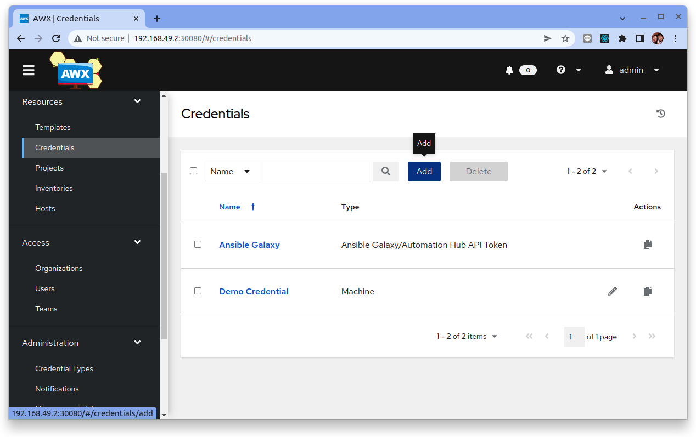
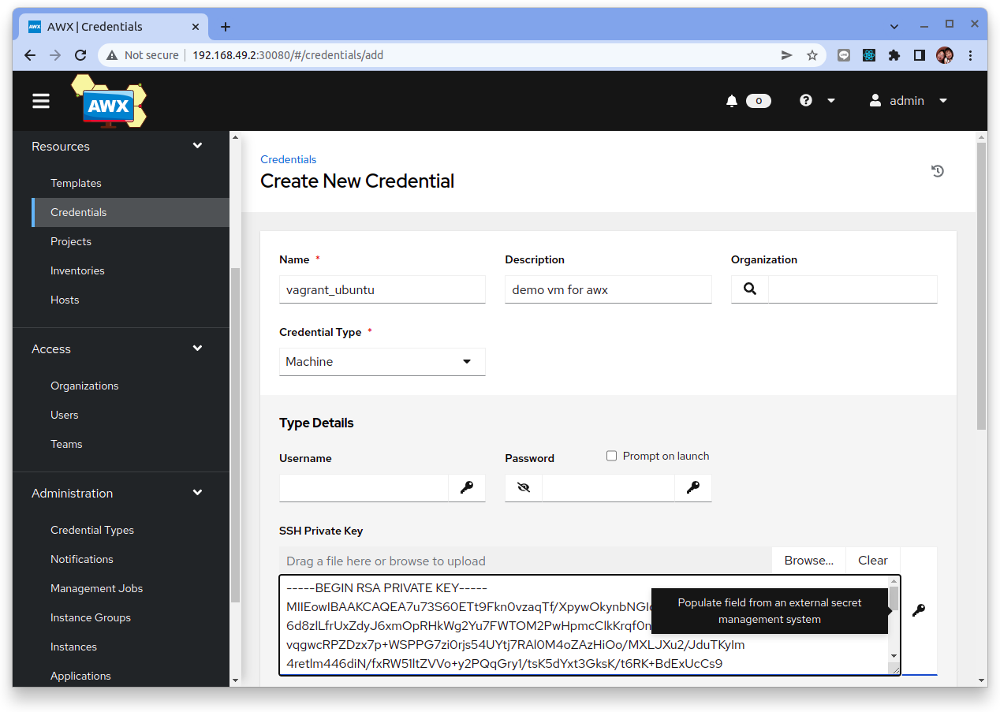
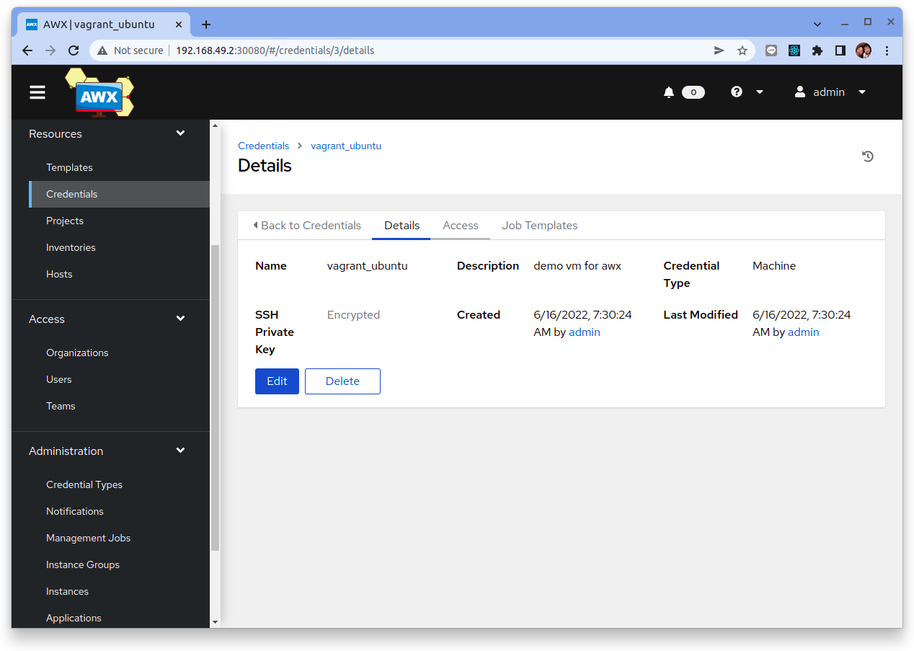
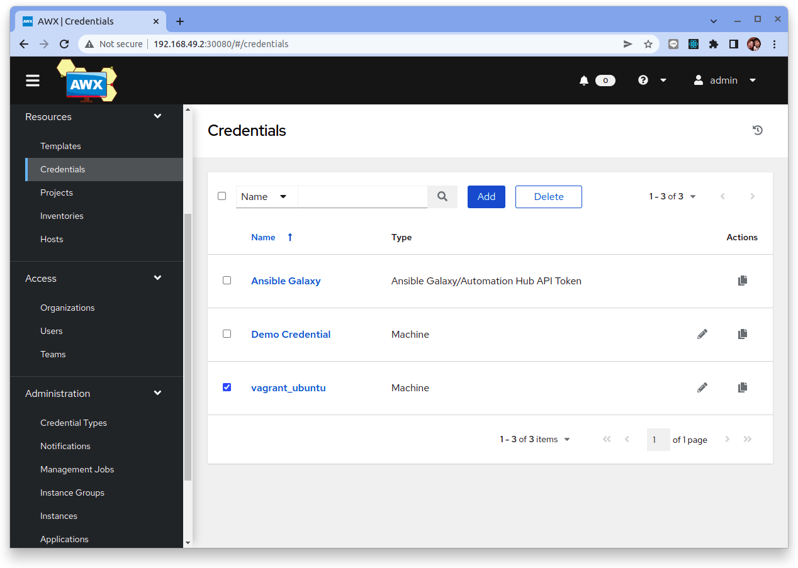
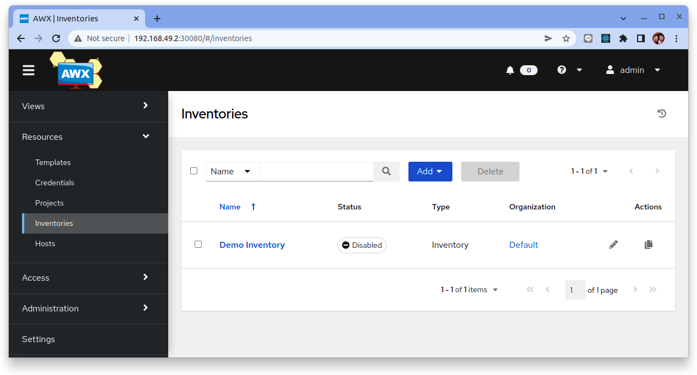
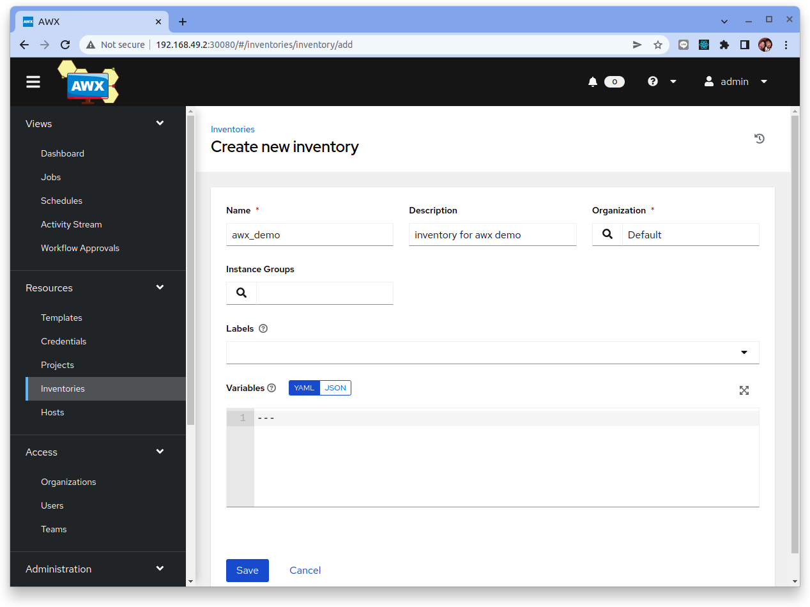
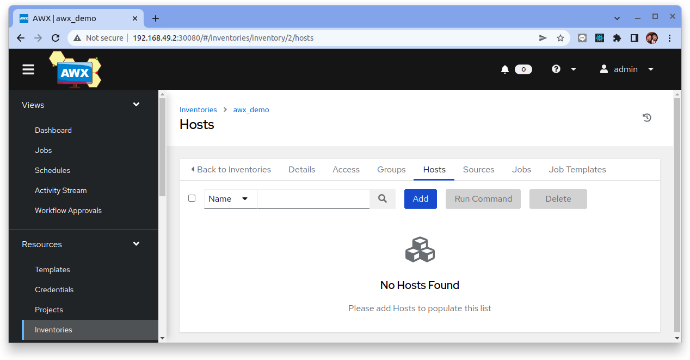
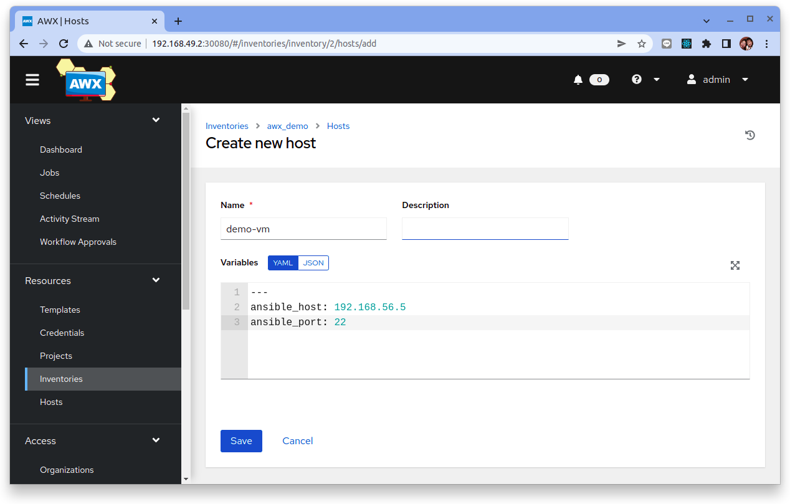
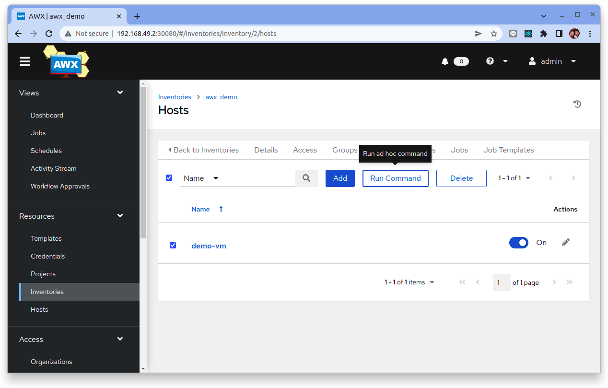
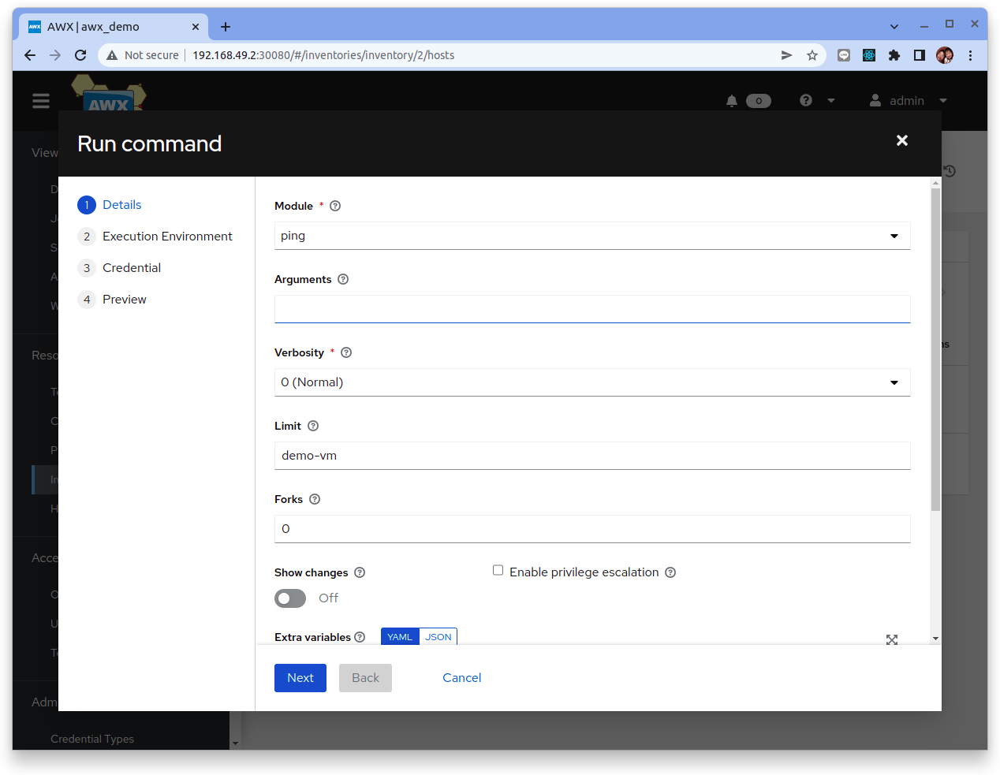

# Ansible AWX 基本使用和配置

AWX 是一個開源 Web 應用程序，它為 Ansible 提供用戶界面、REST API 和任務引擎。它是 Ansible Tower 的開源版本。 AWX 允許您使用 Web 界面管理 Ansible 劇本、清單和安排作業運行。

在本教程中，我們將向您展示 Ansible AWX 的基本用法。因此，您需要一台已經安裝了 Ansible AWX 的服務器。我們介紹了一些您必須了解的 Ansible AWX 基本配置，例如設置憑據、庫存、設置和運行作業模板等。

## 1. Ansible AWX 環境設置和配置

在本教程中，我們將使用 Ansible AWX 儀表板部署和運行 Ansible playbook 以進行基本 LEMP 安裝。

首先請根據[如何在 Ubuntu 20.04 上安裝 Ansible AWX](how-to-install-anixbile-awx.md)的教程來安裝與啟動 Ansible AWX。

```bash
$ minikube service awx-demo-service --url -n awx

http://192.168.49.2:30080
```

默認情況下，管理員用戶是 `admin`，密碼儲放在 <resourcename>-admin-password 密碼中。要檢索管理員密碼，請運行：

```bash
$ kubectl get secret awx-demo-admin-password -o jsonpath="{.data.password}" | base64 --decode

E9ByxRu4Nn1jXzzF7oCKH7Gux9nJjmRA
```


## 2. 創建一台Ansible管理結點的虛擬主機

接下來讓我們使用 Vagrant 來配置一台虛擬主機。

### 創建一個目錄

創建一個新目錄并且切換到新目錄裡。

```
$ mkdir vagrant_ansible_awx
$ cd vagrant_ansible_awx
```

### 初始化專案

Vagrant 有一個用於初始化項目的內置命令 `vagrant init`，它可以將一個預先構建好的 `VM Image Box` 和 `URL` 作為參數。讓我們初始化目錄並指定 `ubuntu/focal64` 的 VM image。

```
$ vagrant init ubuntu/focal64

A `Vagrantfile` has been placed in this directory. You are now
ready to `vagrant up` your first virtual environment! Please read
the comments in the Vagrantfile as well as documentation on
`vagrantup.com` for more information on using Vagrant.
```

Vagrant 初始化之後會在當前目錄中創建一個 `Vagrantfile` 檔案。你可用任何一種文字編輯器打開 `Vagrantfile`，其中包含一些註釋和示例。在以下教程中，我們將修改此文件。

```ruby title="Vagrantfile"
Vagrant.configure("2") do |config|
  config.vm.box = "ubuntu/focal64"
  config.vm.network "private_network", type: "dhcp"
end
```

### 啟動虛擬機 VM

現在你已經初始化了你的專案並配置了一個VM Box供它使用，是時候啟動你的第一個 Vagrant 環境了。

從你的終端運行以下命令：

```
$ vagrant up
```

在幾分鐘內，此命令將完成，你將擁有一個運行 Ubuntu 的虛擬機。

```
Bringing machine 'default' up with 'virtualbox' provider...
==> default: Importing base box 'ubuntu/focal64'...
==> default: Matching MAC address for NAT networking...
==> default: Checking if box 'ubuntu/focal64' version '20220610.0.0' is up to date...
==> default: Setting the name of the VM: vagrant_ansible_awx_default_1655334451195_65866
==> default: Clearing any previously set network interfaces...
==> default: Preparing network interfaces based on configuration...
    default: Adapter 1: nat
    default: Adapter 2: hostonly
==> default: Forwarding ports...
    default: 22 (guest) => 2222 (host) (adapter 1)
==> default: Running 'pre-boot' VM customizations...
==> default: Booting VM...
==> default: Waiting for machine to boot. This may take a few minutes...
    default: SSH address: 127.0.0.1:2222
    default: SSH username: vagrant
    default: SSH auth method: private key
    default: 
    default: Vagrant insecure key detected. Vagrant will automatically replace
    default: this with a newly generated keypair for better security.
    default: 
    default: Inserting generated public key within guest...
    default: Removing insecure key from the guest if it's present...
    default: Key inserted! Disconnecting and reconnecting using new SSH key...
==> default: Machine booted and ready!
==> default: Checking for guest additions in VM...
==> default: Configuring and enabling network interfaces...
==> default: Mounting shared folders...
    default: /vagrant => /home/dxlab/opt/vagrant_ansible_awx
```

### SSH進入虛擬機

Vagrant 會在沒有 UI 的情況下運行虛擬機。為了證明它正在運行，你可以通過 SSH 進入機器：

```hl_lines="14"
$ vagrant ssh

Welcome to Ubuntu 20.04.4 LTS (GNU/Linux 5.4.0-117-generic x86_64)

 * Documentation:  https://help.ubuntu.com
 * Management:     https://landscape.canonical.com
 * Support:        https://ubuntu.com/advantage

  System information as of Wed Jun 15 23:09:53 UTC 2022

  System load:  0.18              Processes:               122
  Usage of /:   3.5% of 38.71GB   Users logged in:         0
  Memory usage: 21%               IPv4 address for enp0s3: 10.0.2.15
  Swap usage:   0%                IPv4 address for enp0s8: 192.168.56.5
```

!!! info
    從登入的console訊息中可得知這個虛擬機從 DHCP 服務中取得的 IP 位址

此命令將使開啟一個 SSH 連線來與 VM 互動。花點時間想一想剛剛發生了什麼：只需在終端中進行一行配置和一個命令，我們就創建了一個功能齊全、可通過 SSH 訪問的虛擬機。

使用 `CTRL+D` 或登出來終止 SSH。

```
vagrant@ubuntu-focal:~$ logout

Connection to 127.0.0.1 closed
```

### 檢查機器狀態

我們可以使用 `vagrant status` 來確認當前 Vagrant 主機的運作狀況：

```
$ vagrant status

Current machine states:

default                   running (virtualbox)

The VM is running. To stop this VM, you can run `vagrant halt` to
shut it down forcefully, or you can run `vagrant suspend` to simply
suspend the virtual machine. In either case, to restart it again,
simply run `vagrant up`.
```

## 3. 在 AWX 中設定 Credentials

首先，我們需要在 Ansible AWX 配置管理節點的憑證。它用於對託管的服務器啟動和運行作業、與庫存源同步和導入項目時進行身份驗證。

默認情況下，Ansible AWX 支持多種憑證，包括通過 SSH 身份驗證的 VM 機器、Amazon Web Services、Google Compute Engine、OpenStack、Vault 密碼、源代碼控制等。

要設置，請單擊左側的 `Credentials` 菜單，然後單擊 `Add` 按鈕。



現在鍵入憑證 “Name” 和 “Description”，然後將 “Credential Type” 指定為 “Machine”。

簡單地說，“Machine”憑證將允許您使用 SSH 身份驗證來管理服務器。它支持密碼和基於密鑰的身份驗證。

對於本指南，我們將使用基於密鑰的身份驗證。因此，輸入用戶名 `vagrant` 並粘貼該用戶的私鑰。



然後點擊 “Save” 按鈕。



最後檢查我們是否已創建一個新的 Ansible AWX 憑證類型“機器”。



## 4. 在 AWX 中設定 Inventory

Inventory 是由 Ansible AWX 管理的主機服務器清單與群組資訊。Inventory 允許您創建一個包含多個主機服務器的群組。並且可以更輕鬆地管理具有不同環境的不同服務器。

為了管理和提供服務器，我們必須創建一個新的 Inventory 群組，然後將服務器主機添加到該群組中。

要添加新庫存，請單擊左側的 “Inventory” 菜單，然後單擊 “Add” 按鈕並選擇“庫存”。



輸入 Inventory 的 “Name” 和 “Description”，然後單擊 “Save” 按鈕。



現在單擊 “Hosts” 選項卡，然後單擊 “Add” 按鈕添加新主機。



鍵入“Name”、“Description” 和 “Variables” 以及目標機器 IP 地址 “ansible_host: 192.168.56.5” 的附加配置。



現在點擊 “Save” 按鈕。

接下來，我們需要通過使用 `ping` 命令檢查主機來確保主機配置。

返回“主機”選項卡，勾選主機的名稱服務器，然後單擊“運行命令”按鈕。



現在選擇名為“`ping`”的“模塊”，然後單擊“Next”按鈕。




