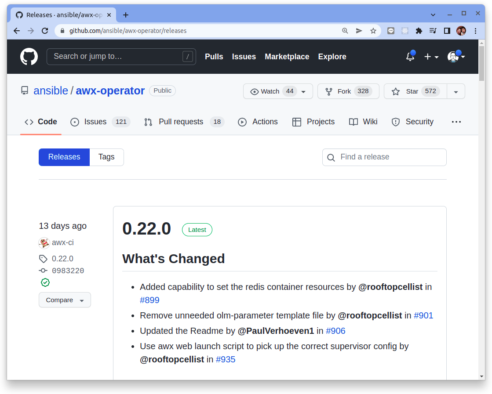
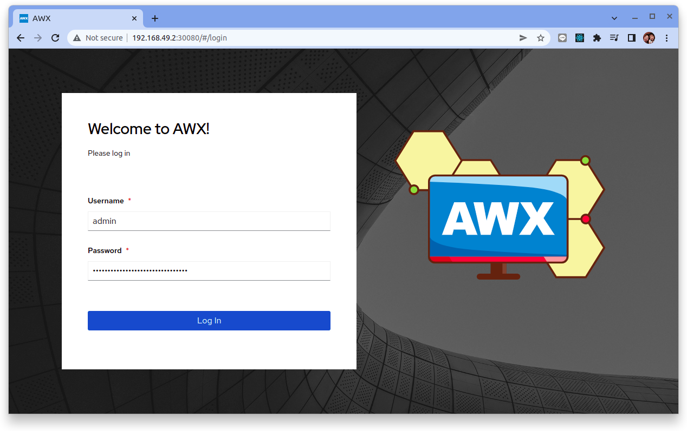

# 如何在 Ubuntu 20.04 上安裝 Ansible AWX

歡迎閱讀今天的指南，了解如何在 Ubuntu 20.04 上使用 Minikube 安裝 Ansible AWX。 Ansible AWX 是一個開源工具，它提供了一個基於 Web 的用戶界面、REST API 和任務引擎，用於輕鬆、協作地管理 Ansible Playbooks 和 Inventories。

AWX 允許您從 Web 界面集中管理 Ansible 劇本、庫存、機密和計劃作業。在 Ubuntu 20.04 Linux 系統上安裝 AWX 很容易。使用下面共享的步驟在 Ubuntu 20.04 服務器上安裝和配置 Ansible AWX。

從 AWX 18.0 版開始，推薦的安裝方法是通過 [AWX Operator](https://github.com/ansible/awx-operator)。由於 operator 安裝方式需要 Kubernetes 集群，我們將使用 [Minikube](https://minikube.sigs.k8s.io/docs/) 在 Ubuntu Linux 上執行單節點 Kubernetes 安裝。

## 設置最低要求

- Ubuntu 20.04 LTS 服務器
- 至少 8GB 的​​ RAM
- 4vcpus
- 10GB 可用磁盤存儲空間
- 使用 sudo 進行 ssh 的 root 或用戶

### 1. 更新 Ubuntu 系統

更新和升級您的系統

```bash
sudo apt update
sudo apt -y upgrade && sudo systemctl reboot
```

### 2. 安裝單節點 Minikube

參考[如何在 Ubuntu 20.04 LTS 上安裝 Minikube](../../kubernetes/01-getting-started/learning-env/minikube/how-to-install-minikube-on-ubuntu.md)來啟動單節點的 Kubernetes。

```bash
$ minikube start --cpus=4 --memory=6g --addons=ingress

😄  minikube v1.25.2 on Ubuntu 21.10
✨  Automatically selected the docker driver. Other choices: virtualbox, ssh
❗  Your cgroup does not allow setting memory.
    ▪ More information: https://docs.docker.com/engine/install/linux-postinstall/#your-kernel-does-not-support-cgroup-swap-limit-capabilities
👍  Starting control plane node minikube in cluster minikube
🚜  Pulling base image ...
🔥  Creating docker container (CPUs=4, Memory=6144MB) ...
🐳  Preparing Kubernetes v1.23.3 on Docker 20.10.12 ...
    ▪ kubelet.housekeeping-interval=5m
    ▪ Generating certificates and keys ...
    ▪ Booting up control plane ...
    ▪ Configuring RBAC rules ...
🔎  Verifying Kubernetes components...
    ▪ Using image k8s.gcr.io/ingress-nginx/kube-webhook-certgen:v1.1.1
    ▪ Using image gcr.io/k8s-minikube/storage-provisioner:v5
    ▪ Using image k8s.gcr.io/ingress-nginx/controller:v1.1.1
    ▪ Using image k8s.gcr.io/ingress-nginx/kube-webhook-certgen:v1.1.1
🔎  Verifying ingress addon...
🌟  Enabled addons: storage-provisioner, default-storageclass, ingress
🏄  Done! kubectl is now configured to use "minikube" cluster and "default" namespace by default
```

部署 Minikube 後，檢查節點和 kube-apiserver 通信是否按預期工作。

```bash
$ kubectl get nodes

NAME       STATUS   ROLES                  AGE    VERSION
minikube   Ready    control-plane,master   115s   v1.23.3

kubectl get pods -A

NAMESPACE       NAME                                       READY   STATUS      RESTARTS   AGE
ingress-nginx   ingress-nginx-admission-create-8c749       0/1     Completed   0          2m40s
ingress-nginx   ingress-nginx-admission-patch-vszkd        0/1     Completed   1          2m40s
ingress-nginx   ingress-nginx-controller-cc8496874-zjw2b   1/1     Running     0          2m40s
kube-system     coredns-64897985d-2n22v                    1/1     Running     0          2m40s
kube-system     etcd-minikube                              1/1     Running     0          2m51s
kube-system     kube-apiserver-minikube                    1/1     Running     0          2m55s
kube-system     kube-controller-manager-minikube           1/1     Running     0          2m54s
kube-system     kube-proxy-vkr58                           1/1     Running     0          2m40s
kube-system     kube-scheduler-minikube                    1/1     Running     0          2m52s
kube-system     storage-provisioner                        1/1     Running     0          2m50s
```

### 3. 基本安裝

擁有一個正在運行的 Kubernetes 集群後，您可以使用 Kustomize 將 AWX Operator 部署到您的集群中。以下腳本檢測您的操作系統並將適當的 kustomize 二進製文件下載到您當前的工作目錄。

```
$ curl -s "https://raw.githubusercontent.com/kubernetes-sigs/kustomize/master/hack/install_kustomize.sh"  | bash
$ sudo mv kustomize /usr/local/bin/
```

首先從 AWX Operator 的 Github 上查找最新釋出的版本: https://github.com/ansible/awx-operator/releases

舉例來說在現在當下2022/06/15查找時看到最新的版本是`0.22.0`。




創建一個名為 `kustomization.yaml` 的文件，其內容如下(請使用查找到的版本來替代`<tag>`的標籤)：

```yaml title="kustomization.yaml"
apiVersion: kustomize.config.k8s.io/v1beta1
kind: Kustomization
resources:
  # Find the latest tag here: https://github.com/ansible/awx-operator/releases
  - github.com/ansible/awx-operator/config/default?ref=<tag>

# Set the image tags to match the git version from above
images:
  - name: quay.io/ansible/awx-operator
    newTag: <tag>

# Specify a custom namespace in which to install AWX
namespace: awx
```

!!! info
    提示：如果您需要更改AWX Operator的任何默認設置（例如 resources.limits），您可以在 kustomization.yaml 文件的底部添加補丁。

通過運行以下命令安裝清單：

```bash
$ kustomize build . | kubectl apply -f -

namespace/awx created
customresourcedefinition.apiextensions.k8s.io/awxbackups.awx.ansible.com created
customresourcedefinition.apiextensions.k8s.io/awxrestores.awx.ansible.com created
customresourcedefinition.apiextensions.k8s.io/awxs.awx.ansible.com created
serviceaccount/awx-operator-controller-manager created
role.rbac.authorization.k8s.io/awx-operator-awx-manager-role created
role.rbac.authorization.k8s.io/awx-operator-leader-election-role created
clusterrole.rbac.authorization.k8s.io/awx-operator-metrics-reader created
clusterrole.rbac.authorization.k8s.io/awx-operator-proxy-role created
rolebinding.rbac.authorization.k8s.io/awx-operator-awx-manager-rolebinding created
rolebinding.rbac.authorization.k8s.io/awx-operator-leader-election-rolebinding created
clusterrolebinding.rbac.authorization.k8s.io/awx-operator-proxy-rolebinding created
configmap/awx-operator-awx-manager-config created
service/awx-operator-controller-manager-metrics-service created
deployment.apps/awx-operator-controller-manager created
```

稍等一下，您應該會看到 awx-operator 運行在 Kubernetes 裡：

```bash
$ kubectl get pods -n awx

NAME                                             READY   STATUS    RESTARTS   AGE
awx-operator-controller-manager-c6554d8f-v9vbn   2/2     Running   0          2m10s
```

為了讓我們不必一直重複鍵入 `-n awx`，讓我們為 kubectl 設置當前預設的命名空間：

```bash
$ kubectl config set-context --current --namespace=awx

Context "minikube" modified.
```

接下來，使用以下建議的內容在同一文件夾中創建一個名為 `awx-demo.yaml` 的文件。其中 metadata.name 設定的將是生成的 AWX 部署的名稱。

!!! info
    注意：如果您將多個 AWX 實例部署到同一個命名空間，請務必使用唯一名稱。


```yaml title="awx-demo.yaml"
---
apiVersion: awx.ansible.com/v1beta1
kind: AWX
metadata:
  name: awx-demo
spec:
  service_type: nodeport
```

確保將此新文件添加到 `kustomization.yaml` 文件中的 “resources” 列表中：

```yaml
...
resources:
  - github.com/ansible/awx-operator/config/default?ref=<tag>
  # Add this extra line:
  - awx-demo.yaml
...
```

最後，再次運行 kustomize 在集群中創建 AWX 實例：

```bash
$ kustomize build . | kubectl apply -f -
```

結果:

```
namespace/awx unchanged
customresourcedefinition.apiextensions.k8s.io/awxbackups.awx.ansible.com unchanged
customresourcedefinition.apiextensions.k8s.io/awxrestores.awx.ansible.com unchanged
customresourcedefinition.apiextensions.k8s.io/awxs.awx.ansible.com unchanged
serviceaccount/awx-operator-controller-manager unchanged
role.rbac.authorization.k8s.io/awx-operator-awx-manager-role configured
role.rbac.authorization.k8s.io/awx-operator-leader-election-role unchanged
clusterrole.rbac.authorization.k8s.io/awx-operator-metrics-reader unchanged
clusterrole.rbac.authorization.k8s.io/awx-operator-proxy-role unchanged
rolebinding.rbac.authorization.k8s.io/awx-operator-awx-manager-rolebinding unchanged
rolebinding.rbac.authorization.k8s.io/awx-operator-leader-election-rolebinding unchanged
clusterrolebinding.rbac.authorization.k8s.io/awx-operator-proxy-rolebinding unchanged
configmap/awx-operator-awx-manager-config unchanged
service/awx-operator-controller-manager-metrics-service unchanged
deployment.apps/awx-operator-controller-manager unchanged
awx.awx.ansible.com/awx-demo created
```

幾分鐘後，在 Kubernetes 中將看到新部署的 AWX 實例。您可以查看 operator pod 日誌以了解安裝過程的位置：

```bash
$ kubectl logs -f deployments/awx-operator-controller-manager -c awx-manager
```

幾秒鐘後，您應該會看到 AWX Operator 開始創建新資源：

```bash
$ kubectl get pods -l "app.kubernetes.io/managed-by=awx-operator"

NAME                      READY   STATUS    RESTARTS   AGE
awx-demo-fb89f8dd-rz42r   4/4     Running   0          3m7s
awx-demo-postgres-0       1/1     Running   0          4m3s

$ kubectl get svc -l "app.kubernetes.io/managed-by=awx-operator"

NAME                TYPE        CLUSTER-IP     EXTERNAL-IP   PORT(S)        AGE
awx-demo-postgres   ClusterIP   None           <none>        5432/TCP       4m42s
awx-demo-service    NodePort    10.99.232.78   <none>        80:30080/TCP   3m48s
```

部署後，可以通過運行以下命令訪問 AWX 實例：

```bash
$ minikube service awx-demo-service --url -n awx

http://192.168.49.2:30080
```

默認情況下，管理員用戶是 `admin`，密碼儲放在 <resourcename>-admin-password 密碼中。要檢索管理員密碼，請運行：

```bash
$ kubectl get secret awx-demo-admin-password -o jsonpath="{.data.password}" | base64 --decode

E9ByxRu4Nn1jXzzF7oCKH7Gux9nJjmRA
```




