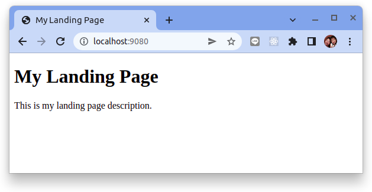

# 如何在 Ansible Playbook 中創建和使用模板

模板允許您使用基於 [Jinja2 模板系統](https://docs.ansible.com/ansible/latest/user_guide/playbooks_templating.html)的預定義模型在節點上創建新文件。 Ansible 模板通常保存為 `.tpl` 文件，並支持使用變量、循環和條件表達式。

模板通常用於基於變量值配置服務，這些變量值可以在劇本本身、包含的變量文件中或通過 [facts](how-to-access-system-information-facts-in-ansible-playbooks.md) 獲得。這使您能夠創建更通用的設置，以根據動態信息調整行為。

要通過實際示例嘗試此功能，請創建一個新目錄以在您的 ansible-practice 目錄中保存非劇本文件：

```bash
$ mkdir ~/ansible-practice/files
```

接下來，為 HTML 登錄頁面創建一個新模板文件。稍後，我們將設置一個劇本，它將配置您的遠程節點以使用 `Nginx` 提供登錄頁面：

```bash
$ nano ~/ansible-practice/files/landing-page.html.j2
```

將以下內容添加到模板文件中：

```html title="landing-page.html.j2"
<!doctype html>
<html lang="en">
<head>
  <meta charset="utf-8">
  <title>{{ page_title }}</title>
  <meta name="description" content="Created with Ansible">
</head>
<body>
    <h1>{{ page_title }}</h1>
    <p>{{ page_description }}</p>
</body>
</html>
```

這個模板使用了兩個變量，當模板應用到 playbook 中時必須提供：`page_title` 和 `page_description`。

以下 playbook 設置所需的變量，安裝 Nginx，然後應用指定的模板來替換位於 `/var/www/html/index.nginx-debian.html` 的現有默認 `Nginx` 登錄頁面。最後一個任務使用 `ufw` 模塊啟用防火牆在端口 80 上開放 `tcp` 訪問。

在你的 ansible-practice 目錄中創建一個名為 playbook-11.yml 的新文件：

```yaml title="playbook-11.yml"
---
- hosts: all
  become: yes
  vars:
    page_title: My Landing Page
    page_description: This is my landing page description.
  tasks:
    - name: Install Nginx
      apt:
        name: nginx
        state: latest

    - name: Apply Page Template
      template:
        src: files/landing-page.html.j2
        dest: /var/www/html/index.nginx-debian.html

    - name: Allow all access to tcp port 80
      ufw:
        rule: allow
        port: '80'
        proto: tcp
```

由於 Nginx 預設是運行在主機的 port `80`。我們將利用 `forwarded_port` 這個參數來將VM上的 port `80` 映射到本機上的 port `9080`。
修改 Vagrantfile:

```ruby title="Vagrantfile"
Vagrant.configure("2") do |config|
  config.vm.box = "ubuntu/focal64"
  config.vm.network "forwarded_port", guest: 80, host: 9080
end
```

重新啟動你的機器:

```bash
$ vagrant reload

==> default: Attempting graceful shutdown of VM...
==> default: Checking if box 'ubuntu/focal64' version '20220530.0.0' is up to date...
==> default: Clearing any previously set forwarded ports...
==> default: Clearing any previously set network interfaces...
==> default: Preparing network interfaces based on configuration...
    default: Adapter 1: nat
==> default: Forwarding ports...
    default: 80 (guest) => 9080 (host) (adapter 1)
    default: 22 (guest) => 2222 (host) (adapter 1)
==> default: Running 'pre-boot' VM customizations...
==> default: Booting VM...
==> default: Waiting for machine to boot. This may take a few minutes...
    default: SSH address: 127.0.0.1:2222
    default: SSH username: vagrant
    default: SSH auth method: private key
==> default: Machine booted and ready!
==> default: Checking for guest additions in VM...
==> default: Mounting shared folders...
    default: /vagrant => /home/dxlab/opt/ws_ansible/ansible-cheatsheet
==> default: Machine already provisioned. Run `vagrant provision` or use the `--provision`
==> default: flag to force provisioning. Provisioners marked to run always will still run.
```

運行此 playbook，請記住提供 -K 選項，因為它需要 sudo 權限：

```bash
ansible-playbook -i inventory playbook-11.yml -u vagrant -K
```

播放結束後，您可以從瀏覽器訪問 Web 服務器的公共 IP 地址。你會看到這樣的頁面：



這意味著您的劇本按預期工作，並且默認的 Nginx 頁面已被您創建的模板替換。


