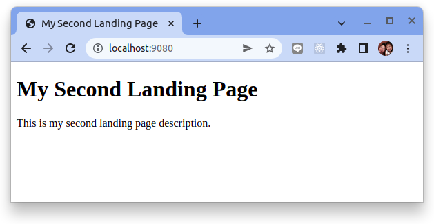

# 如何在 Ansible Playbook 中定義和使用處理程序

簡而言之，處理程序 `handler` 是特殊任務，只有在通過 `notify` 指令觸發時才會執行。處理程序在播放結束時執行，一旦所有任務完成。

在 Ansible 中，處理程序通常用於`啟動`、`重新加載`、`重新啟動`和`停止服務`。如果您的劇本涉及更改配置文件，則很有可能需要重新啟動服務以使更改生效。在這種情況下，您需要為該服務定義一個處理程序，並將 `notify` 指令包含在任何需要該服務處理程序的任務中。

在本系列的[如何創建和使用模板](how-to-create-and-use-templates-in-ansible-playbooks.md)中，您已經了解瞭如何使用模板將默認 Nginx 頁面替換為自定義 HTML 登錄頁面。實際上，在設置 Nginx Web 服務器時，您很可能會在站點可用目錄中包含新的服務器塊文件、創建符號鏈接或更改需要重新加載或重新啟動服務器的設置。

考慮到這種情況，重啟 Nginx 服務的處理程序如下所示：

```yaml
...
  handlers:
    - name: Restart Nginx
      service:
        name: nginx
        state: restarted
```

要觸發此處理程序，您需要在任何需要在 Nginx 服務器上重新啟動的任務中包含一個 notify 指令。

以下 playbook 使用內置的 Ansible 的 `replace` 模塊來替換 Nginx 配置文件中的默認文檔根目錄 (`document root`)。該模塊根據 `regexp` 定義的正則表達式在文件中查找模式，然後將找到的任何匹配項替換為 `replace` 定義的內容。然後，該任務向 Restart Nginx 處理程序發送通知以盡快重新啟動。這意味著，觸發重啟的次數無關緊要，它只會在所有任務已經完成執行並且處理程序開始運行時才會發生。此外，當沒有找到匹配項時，不會對系統進行任何更改，因此不會觸發處理程序。

在你的 ansible-practice 目錄中創建一個名為 playbook-12.yml 的新文件：

```yaml title="playbook-12.yml"
---
- hosts: all
  become: yes
  vars:
    page_title: My Second Landing Page
    page_description: This is my second landing page description.
    doc_root: /var/www/mypage

  tasks:
    - name: Install Nginx
      apt:
        name: nginx
        state: latest

    - name: Make sure new doc root exists
      file:
        path: "{{ doc_root }}"
        state: directory
        mode: '0755'

    - name: Apply Page Template
      template:
        src: files/landing-page.html.j2
        dest: "{{ doc_root }}/index.html"

    - name: Replace document root on default Nginx configuration
      replace:
        path: /etc/nginx/sites-available/default
        regexp: '(\s+)root /var/www/html;(\s+.*)?$'
        replace: \g<1>root {{ doc_root }};\g<2>
      notify: Restart Nginx

    - name: Allow all access to tcp port 80
      ufw:
        rule: allow
        port: '80'
        proto: tcp

  handlers:
    - name: Restart Nginx
      service:
        name: nginx
        state: restarted
```

使用處理程序 `handler` 時要記住的一件重要事情是，它們僅在定義`notify`觸發器的任務導致服務器發生更改時才被觸發。考慮到這個 playbook，它第一次運行 `replace` 任務時會更改 Nginx 配置文件，因此將運行重啟。然而，在隨後的執行中，由於要替換的字符串不再存在於文件中，因此該任務不會導致任何更改，也不會觸發處理程序執行。

如果您運行此 playbook，請記住提供 -K 選項，因為它需要 sudo 權限：

```bash
$ ansible-playbook -i inventory playbook-12.yml -u vagrant -K
```

結果:

```
BECOME password: 

PLAY [all] *****************************************************************************************************************************************************************

TASK [Gathering Facts] *****************************************************************************************************************************************************
ok: [demo-vm]

TASK [Install Nginx] *******************************************************************************************************************************************************
ok: [demo-vm]

TASK [Make sure new doc root exists] ***************************************************************************************************************************************
changed: [demo-vm]

TASK [Apply Page Template] *************************************************************************************************************************************************
changed: [demo-vm]

TASK [Replace document root on default Nginx configuration] ****************************************************************************************************************
changed: [demo-vm]

TASK [Allow all access to tcp port 80] *************************************************************************************************************************************
ok: [demo-vm]

RUNNING HANDLER [Restart Nginx] ********************************************************************************************************************************************
changed: [demo-vm]

PLAY RECAP *****************************************************************************************************************************************************************
demo-vm                    : ok=7    changed=4    unreachable=0    failed=0    skipped=0    rescued=0    ignored=0 
```

如果您查看輸出，您會看到“Restart Nginx”處理程序在播放結束之前正在執行。如果您現在轉到瀏覽器並訪問服務器的 IP 地址，您將看到以下頁面：



在本系列的下一部分和最後一部分中，我們將連接所有的點，並編寫一個自動設置遠程 Nginx 服務器以託管靜態 HTML 網站的劇本。