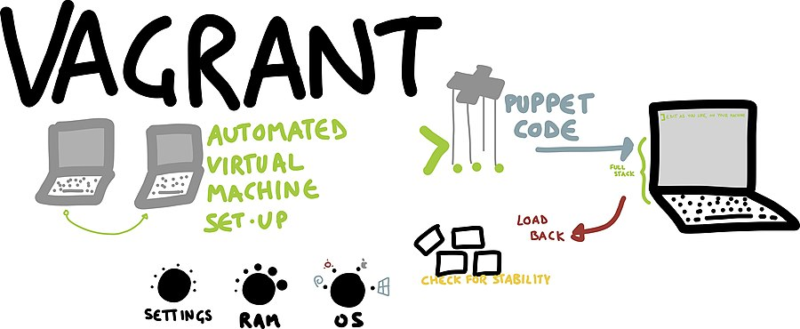

# 使用 Vagrant 模擬環境



由於在 DevOps 的實務操作上我們常常會同時操作多台機器，所以在正式進入接下來的課程前，我想要先花一點篇幅介紹如何使用 [Vagrant](https://www.vagrantup.com/) 來模擬我們的學習環境。

## Vagrant 是什麼？

在部署軟體服務的階段，開發人員常常會利用虛擬主機來模擬及配置開發環境。Vagrant 就是基於這樣的需求產生的一個服務。與傳統使用 VirtualBox 透過圖形使用者介面 (Graphical User Interface, GUI) 操作虛擬主機有一點不同的是，Vagrant 主要是使用命令列介面 (command-line interface, CLI) 來與虛擬主機做溝通。因此，我們在接下來的章節中將會運用大量的命令列來進行操作。

## Vagrant 及相關軟體安裝

### 安裝 Vagrant

=== "Ubuntu/Debian"

    ``` bash
    curl -fsSL https://apt.releases.hashicorp.com/gpg | sudo apt-key add -
    sudo apt-add-repository "deb [arch=amd64] https://apt.releases.hashicorp.com $(lsb_release -cs) main"
    sudo apt-get update && sudo apt-get install vagrant
    ```

=== "CentOS/RHEL"

    ``` bash
    sudo yum install -y yum-utils
    sudo yum-config-manager --add-repo https://rpm.releases.hashicorp.com/RHEL/hashicorp.repo
    sudo yum -y install vagrant
    ```

其它作業系統的安裝手法請參閱: https://www.vagrantup.com/downloads

#### 驗證安裝

安裝 Vagrant 後，通過打開新的命令提示符或控制台來驗證安裝是否正常，並檢查 vagrant 是否可用。

```
$ vagrant
Usage: vagrant [options] <command> [<args>]

    -v, --version                    Print the version and exit.
    -h, --help                       Print this help.

# ...
```

### 安裝 VirtualBox

Vagrant 支持不同的虛擬化產品，例如； VirtualBox、VMware Fusion 或 Hyper-V。在本教程中使用 VirtualBox 來讓學員練習。

請根據 VirtualBox 官網上的指示來進行安裝: https://www.virtualbox.org/wiki/Downloads


## 創建一台虛擬機

### 創建一個目錄

配置任何 Vagrant 專案的第一步是創建一個 `Vagrantfile`。 `Vagrantfile` 允許你：

- 標記 project 的根目錄。 Vagrant 中的許多配置選項都是相對於這個根目錄的。
- 描述運行專案所需的 VM 和資源類型，以及要安裝的軟件以及你希望如何訪問它。

讓我們創建一個新目錄并且切換到新目錄裡。

```
$ mkdir vagrant_getting_started
$ cd vagrant_getting_started
```

### 初始化專案

Vagrant 有一個用於初始化項目的內置命令 `vagrant init`，它可以將一個預先構建好的 `VM Image Box` 和 `URL` 作為參數。讓我們初始化目錄並指定 `hashcorp/bionic64` 的 VM image。

```
$ vagrant init ubuntu/focal64

A `Vagrantfile` has been placed in this directory. You are now
ready to `vagrant up` your first virtual environment! Please read
the comments in the Vagrantfile as well as documentation on
`vagrantup.com` for more information on using Vagrant.
```

Vagrant 初始化之後會在當前目錄中創建一個 `Vagrantfile` 檔案。你可用任何一種文字編輯器打開 `Vagrantfile`，其中包含一些註釋和示例。在以下教程中，我們將修改此文件。

```ruby title="Vagrantfile"
Vagrant.configure("2") do |config|  
  config.vm.box = "ubuntu/focal64"
end
```

### 啟動虛擬機 VM

現在你已經初始化了你的專案並配置了一個VM Box供它使用，是時候啟動你的第一個 Vagrant 環境了。

從你的終端運行以下命令：

```
$ vagrant up
```

在幾分鐘內，此命令將完成，你將擁有一個運行 Ubuntu 的虛擬機。

```
Bringing machine 'default' up with 'virtualbox' provider...
==> default: Importing base box 'ubuntu/focal64'...
==> default: Matching MAC address for NAT networking...
==> default: Checking if box 'ubuntu/focal64' version '20220523.0.0' is up to date...
==> default: A newer version of the box 'ubuntu/focal64' for provider 'virtualbox' is
==> default: available! You currently have version '20220523.0.0'. The latest is version
==> default: '20220530.0.0'. Run `vagrant box update` to update.
==> default: Setting the name of the VM: vagrant_getting_started_default_1654224585969_14799
==> default: Fixed port collision for 22 => 2222. Now on port 2201.
==> default: Clearing any previously set network interfaces...
==> default: Preparing network interfaces based on configuration...
    default: Adapter 1: nat
==> default: Forwarding ports...
    default: 22 (guest) => 2201 (host) (adapter 1)
==> default: Running 'pre-boot' VM customizations...
==> default: Booting VM...
==> default: Waiting for machine to boot. This may take a few minutes...
    default: SSH address: 127.0.0.1:2201
    default: SSH username: vagrant
    default: SSH auth method: private key
    default: 
    default: Vagrant insecure key detected. Vagrant will automatically replace
    default: this with a newly generated keypair for better security.
    default: 
    default: Inserting generated public key within guest...
    default: Removing insecure key from the guest if it's present...
    default: Key inserted! Disconnecting and reconnecting using new SSH key...
==> default: Machine booted and ready!
==> default: Checking for guest additions in VM...
==> default: Mounting shared folders...
    default: /vagrant => /home/dxlab/opt/vagrant_getting_started
```

### SSH進入虛擬機

Vagrant 會在沒有 UI 的情況下運行虛擬機。為了證明它正在運行，你可以通過 SSH 進入機器：

```
$ vagrant ssh

Welcome to Ubuntu 20.04.4 LTS (GNU/Linux 5.4.0-113-generic x86_64)

 * Documentation:  https://help.ubuntu.com
 * Management:     https://landscape.canonical.com
 * Support:        https://ubuntu.com/advantage

  System information as of Fri Jun  3 02:52:55 UTC 2022

  System load:  0.12              Processes:               122
  Usage of /:   3.5% of 38.71GB   Users logged in:         0
  Memory usage: 20%               IPv4 address for enp0s3: 10.0.2.15
  Swap usage:   0%


1 update can be applied immediately.
To see these additional updates run: apt list --upgradable


The list of available updates is more than a week old.
To check for new updates run: sudo apt update
```

此命令將使開啟一個 SSH 連線來與 VM 互動。花點時間想一想剛剛發生了什麼：只需在終端中進行一行配置和一個命令，我們就創建了一個功能齊全、可通過 SSH 訪問的虛擬機。

使用 `CTRL+D` 或登出來終止 SSH。

```
vagrant@ubuntu-focal:~$ logout

Connection to 127.0.0.1 closed
```

### 檢查機器狀態

我們可以使用 `vagrant status` 來確認當前 Vagrant 主機的運作狀況：

```
$ vagrant status

Current machine states:

default                   running (virtualbox)

The VM is running. To stop this VM, you can run `vagrant halt` to
shut it down forcefully, or you can run `vagrant suspend` to simply
suspend the virtual machine. In either case, to restart it again,
simply run `vagrant up`.
```

我們可以清楚發現雖然虛擬機已經成功運行，但主機名稱顯示為 `default`。這種模糊的名稱在管理主機數量多起來後常常會造成開發者的困擾。為了避免混淆，我們可以先用 `vagrant halt` 將目前的虛擬機暫停或是使用 `vagrant destroy` 直接摧毀 (destroy)。接下來，在 `Vagrantfile` 中加入下列設置來替我們的虛擬機命名：

```ruby hl_lines="3" title="Vagrantfile"
Vagrant.configure("2") do |config|
  config.vm.box = "ubuntu/focal64"
  config.vm.define "sre001"
end
```

重新啟動:

```
$ vagrant up

Bringing machine 'sre001' up with 'virtualbox' provider...
==> sre001: Importing base box 'ubuntu/focal64'...
==> sre001: Matching MAC address for NAT networking...
==> sre001: Checking if box 'ubuntu/focal64' version '20220530.0.0' is up to date...
==> sre001: Setting the name of the VM: vagrant_getting_started_sre001_1654228247885_34312
==> sre001: Fixed port collision for 22 => 2222. Now on port 2201.
==> sre001: Clearing any previously set network interfaces...
==> sre001: Preparing network interfaces based on configuration...
    sre001: Adapter 1: nat
==> sre001: Forwarding ports...
    sre001: 22 (guest) => 2201 (host) (adapter 1)
==> sre001: Running 'pre-boot' VM customizations...
==> sre001: Booting VM...
==> sre001: Waiting for machine to boot. This may take a few minutes...
    sre001: SSH address: 127.0.0.1:2201
    sre001: SSH username: vagrant
    sre001: SSH auth method: private key
    sre001: 
    sre001: Vagrant insecure key detected. Vagrant will automatically replace
    sre001: this with a newly generated keypair for better security.
    sre001: 
    sre001: Inserting generated public key within guest...
    sre001: Removing insecure key from the guest if it's present...
    sre001: Key inserted! Disconnecting and reconnecting using new SSH key...
==> sre001: Machine booted and ready!
==> sre001: Checking for guest additions in VM...
==> sre001: Mounting shared folders...
    sre001: /vagrant => /home/dxlab/opt/vagrant_getting_started
```

再檢查一次虛擬機運行狀況：

```
$ vagrant status
Current machine states:

sre001                    running (virtualbox)
```

正如我們預期的，虛擬機有自己的名字啦！

### 取得動態 IP (DHCP)

如果想要讓 Vagrnt 的虛擬機有可被外部連接的獨立 IP，在 Vagrantfile 增加設定:

```ruby hl_lines="4" title="Vagrantfile"
Vagrant.configure("2") do |config|
  config.vm.box = "ubuntu/focal64"
  config.vm.define "sre001"
  config.vm.network "private_network", type: "dhcp"
end
```

### 暫停機器 (Suspend)

暫停虛擬機將停止它並保存其當前運行狀態。現在讓我們暫停機器。

```
$ vagrant suspend
==> default: Saving VM state and suspending execution...
```

當你需要再次開始工作時，請重新啟動虛擬機，它的狀態將從你停止的地方恢復。再次啟動機器。

```
$ vagrant up

Bringing machine 'default' up with 'virtualbox' provider...
==> default: Checking if box 'ubuntu/focal64' version '20220530.0.0' is up to date...
==> default: Resuming suspended VM...
==> default: Booting VM...
==> default: Waiting for machine to boot. This may take a few minutes...
    default: SSH address: 127.0.0.1:2201
    default: SSH username: vagrant
    default: SSH auth method: private key
```

暫停機器旨在快速停止和開始工作。缺點是虛擬機在掛起時仍會使用磁盤空間，並且需要額外的磁盤空間來存儲虛擬機 RAM 的狀態。

### 停止機器 (Halt)

停止虛擬機將正常的流程來關閉來賓操作系統並關閉來賓計算機。立即停止您的機器。

```
$ vagrant halt

==> default: Attempting graceful shutdown of VM...
```

停止您的機器將乾淨地關閉它，保留磁盤的內容並允許你乾淨地再次啟動它。重新啟動你的機器。

```
$ vagrant up

Bringing machine 'default' up with 'virtualbox' provider...
==> default: Checking if box 'ubuntu/focal64' version '20220530.0.0' is up to date...
==> default: Resuming suspended VM...
==> default: Booting VM...
==> default: Waiting for machine to boot. This may take a few minutes...
    default: SSH address: 127.0.0.1:2201
    default: SSH username: vagrant
    default: SSH auth method: private key
```

停止的客戶機將需要更多時間才能從冷啟動開始，並且仍會佔用磁盤空間。

### 銷除機器 VM

回到主機後，停止 Vagrant 管理的機器並刪除在機器創建過程中創建的所有資源。出現提示時，按“是”確認。

```
$ vagrant destroy

    default: Are you sure you want to destroy the 'default' VM? [y/N] y
==> default: Forcing shutdown of VM...
==> default: Destroying VM and associated drives...
```

### 移除 VM box 鏡像

`vagrant destroy` 命令不會刪除下載的 VM box 鏡像。

列出你的 VM box 下載鏡像文件。

```
$ vagrant box list

ubuntu/focal64      (virtualbox, 20220523.0.0)
```

使用 remove 子命令刪除 VM box 鏡像文件，提供 VM box 鏡像的名稱。

```
vagrant box remove ubuntu/focal64 

Removing box 'ubuntu/focal64' (v20220523.0.0) with provider 'virtualbox'...
```

### (補充) 創建新的帳戶與修改 root 密碼

如果不想要使用 Vagrant 預建的 `vagrant` 帳號來登入 VM。接下來讓我們進到 VM 裡頭去修改 `root` 帳號或是新增加使用者帳號。

首先使用 `vagrant ssh` 登入:

```bash
$ vagrant ssh
```

在 Linux 中可使用下列方式切換到 `root` 帳號:

- 使用 `sudo su`: 此方式是假設有一個帳號為 tom，使用 tom 登入後可以切換身分到 root，但仍然還是用 tom 的角色，僅需輸入 tom 密碼。
- 使用 `sudo su -`: 此方式則是將帳號換成 root 的角色，因此同時具備 root 的權限，僅需輸入 tom 密碼。
- 使用 `su root`: 此方式是換成 root 也同時具備 root 的權限，但前提是要輸入 root 密碼。

讓我們使用 `sudo su` 來切換成 `root` 帳號:

```bash
$ sudo su
```

現在你是 `root` 用戶。您可以更新 root 密碼，如下所示：

```bash
$ sudo -i
$ passwd
```

**允許使用 password 來登入**:

現在編輯文件 `/etc/ssh/sshd_config` 中的以下的內容:

```
...
PermitRootLogin yes
...
PasswordAuthentication yes
...
```

**創建自己的用戶帳戶**：

```bash
$ adduser {new_user}
```

等到它要求輸入密碼。

**將使用者加入 `sudo` 群組**:

```bash
$ sudo usermod -aG sudo {user}
```

**把 Vagrant 打的 VM 重新載入**:

回到宿主機的 terminal 並執行下列命令:

```bash
$ vagrant reload
```


## 結論

你已經成功地創建了你的第一個 Vagrant 環境並與之互動！