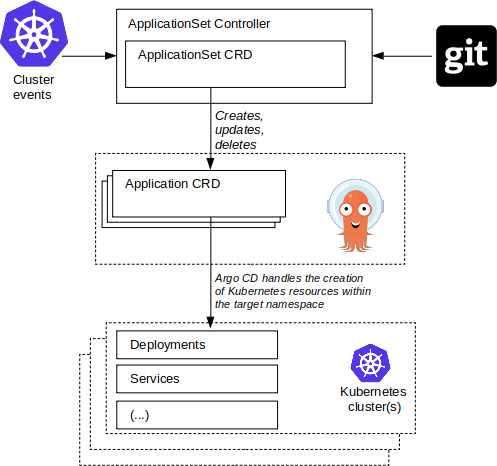

# ApplicationSet 控制器如何與 Argo CD 交互

當您創建、更新或刪除 `ApplicationSet` 資源時，ApplicationSet 控制器會通過創建、更新或刪除一個或多個相應的 Argo CD `Application` 資源來響應。

事實上，ApplicationSet 控制器的唯一職責是在 Argo CD 命名空間內創建、更新和刪除 `Application` 資源。控制器的唯一工作是確保 `Application` 資源與定義的聲明性  `ApplicationSet` 資源保持一致，僅此而已。

因此 ApplicationSet 控制器：

- 不創建/修改/刪除 Kubernetes 資源（`Application` CR 除外）
- 不連接到部署 Argo CD 以外的集群
- 不與部署 Argo CD 以外的命名空間交互

是 Argo CD 本身負責實際部署生成的子 `Application` 資源，例如 Deployments、Services 和 ConfigMaps。

ApplicationSet 控制器因此可以被認為是一個 `Application` “工廠”，將一個 `ApplicationSet` 資源作為輸入，並輸出一個或多個與該集合的參數相對應的 Argo CD 應用程序資源。

在此圖中，定義了一個 `ApplicationSet` 資源，ApplicationSet 控制器負責創建相應的 `Application` 資源。生成的應用程序資源然後由 Argo CD 管理：即 Argo CD 負責實際部署子資源。

Argo CD 根據 `Application` 規範字段中定義的 Git 存儲庫的內容生成應用程序的 Kubernetes 資源，部署例如部署、服務和其他資源。

`ApplicationSet` 的創建、更新或刪除將直接影響 Argo CD 命名空間中的 `Application`。同樣，集群事件（使用集群生成器時添加/刪除 Argo CD 集群機密）或 Git 中的更改（使用 Git 生成器時）將用作 ApplicationSet 控制器的輸入，以構建應用程序資源。

Argo CD 和 ApplicationSet 控制器一起工作，以確保存在一組一致的 `Application` 資源，並跨目標集群部署。

