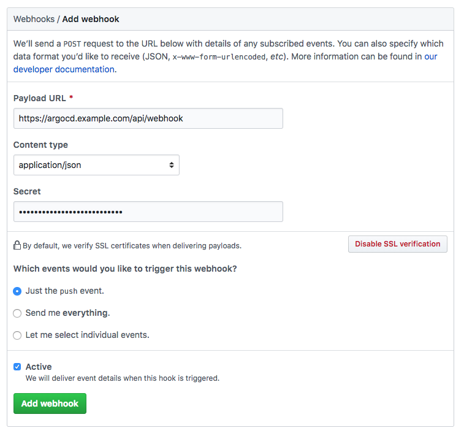

# Git Generator

Git generator 包含兩個子類型：`Git directory generator` 和 `Git file generator`。

## Git Generator: Directories

Git directory generator 是 Git 生成器的兩個子類型之一，它使用指定 Git 存儲庫的目錄結構生成參數。假設您有一個具有以下目錄結構的 Git 存儲庫：

```
├── argo-workflows
│   ├── kustomization.yaml
│   └── namespace-install.yaml
└── prometheus-operator
    ├── Chart.yaml
    ├── README.md
    ├── requirements.yaml
    └── values.yaml
```

此存儲庫包含兩個目錄，一個用於部署的每個工作負載：

- Argo Workflow 控制器自定義 YAML 文件
- Prometheus Operator Helm chart

我們可以使用以下示例部署這兩個工作負載：

```yaml
apiVersion: argoproj.io/v1alpha1
kind: ApplicationSet
metadata:
  name: cluster-addons
spec:
  generators:
  - git:
      repoURL: https://github.com/argoproj/applicationset.git
      revision: HEAD
      directories:
      - path: examples/git-generator-directory/cluster-addons/*
  template:
    metadata:
      name: '{{path[0]}}'
    spec:
      project: default
      source:
        repoURL: https://github.com/argoproj/applicationset.git
        targetRevision: HEAD
        path: '{{path}}'
      destination:
        server: https://kubernetes.default.svc
        namespace: '{{path.basename}}'
```

（完整的例子可以在[這裡](https://github.com/argoproj/applicationset/tree/master/examples/git-generator-directory)找到。）

生成器參數為：

- `{{path}}`： 與路徑通配符匹配的 Git 存儲庫中的目錄路徑。
- `{{path[n]}}`： Git 存儲庫中與路徑通配符匹配的目錄路徑，拆分為數組元素（`n` - 數組索引）
- `{{path.basename}}`： 對於與路徑通配符匹配的 Git 存儲庫中的任何目錄路徑，將提取最右邊的路徑名（例如 `/directory/directory2` 將生成 `directory2`）。
- `{{path.basenameNormalized}}`： 此字段與 `path.basename` 相同，但不支持的字符替換為 -（例如 `/directory/directory_2` 的路徑，而 `directory_2` 的 `path.basename` 將在此處生成 `directory-2`）。

每當將新的 Helm chart/Kustomize YAML/Application/plain 子文件夾添加到 Git 存儲庫時，ApplicationSet 控制器將檢測到此更改並自動將生成的清單部署到新的應用程序資源中。

與其他生成器一樣，集群必須已經在 Argo CD 中定義，以便為它們生成應用程序。

### Exclude 目錄

Git 目錄生成器將自動排除以 `.`（例如 `.git`）。

Git 目錄生成器還支持 `exclude` 選項，以便將存儲庫中的目錄排除在 `ApplicationSet` 控制器的掃描範圍之外：

```yaml
apiVersion: argoproj.io/v1alpha1
kind: ApplicationSet
metadata:
  name: cluster-addons
spec:
  generators:
  - git:
      repoURL: https://github.com/argoproj/applicationset.git
      revision: HEAD
      directories:
      - path: examples/git-generator-directory/excludes/cluster-addons/*
      - path: examples/git-generator-directory/excludes/cluster-addons/exclude-helm-guestbook
        exclude: true
  template:
    metadata:
      name: '{{path.basename}}'
    spec:
      project: default
      source:
        repoURL: https://github.com/argoproj/applicationset.git
        targetRevision: HEAD
        path: '{{path}}'
      destination:
        server: https://kubernetes.default.svc
        namespace: '{{path.basename}}'
```

（完整的例子可以在[這裡](https://github.com/argoproj/applicationset/tree/master/examples/git-generator-directory/excludes)找到。）

此示例從為此 `ApplictionSet` 資源掃描的目錄列表中排除 `exclude-helm-guestbook` 目錄。

!!! info
    如果一個目錄與至少一個 `exclude` 模式匹配，它將被排除。或者，換一種說法，exclude 規則優先於 include 規則。

    作為推論，包含/排除哪些目錄不受目錄字段列表中路徑順序的影響（因為如上所述，排除規則始終優先於包含規則）。

例如，對於這些目錄：

```
.
└── d
    ├── e
    ├── f
    └── g
```

假設您想包含 `/d/e`，但排除 `/d/f` 和 `/d/g`。這將不起作用：

```yaml
- path: /d/e
  exclude: false
- path: /d/*
  exclude: true
```

為什麼？因為 exclude `/d/*` 排除規則將優先於 `/d/e` 包含規則。當 ApplicationSet 控制器處理 Git 存儲庫中的 `/d/e` 路徑時，控制器檢測到至少匹配一個排除規則，因此不應掃描該目錄。


相反，您需要這樣做：

```yaml
- path: /d/*
- path: /d/f
  exclude: true
- path: /d/g
  exclude: true
```

或者，更短的方法（使用 [path.Match](https://golang.org/pkg/path/#Match) 語法）是：

```yaml
- path: /d/*
- path: /d/[f|g]
  exclude: true
```

## Git Generator：Files

Git 文件生成器是 Git 生成器的第二個子類型。 Git 文件生成器使用在指定存儲庫中找到的 JSON/YAML 文件的內容生成參數。

假設您有一個具有以下目錄結構的 Git 存儲庫：

```
├── apps
│   └── guestbook
│       ├── guestbook-ui-deployment.yaml
│       ├── guestbook-ui-svc.yaml
│       └── kustomization.yaml
├── cluster-config
│   └── engineering
│       ├── dev
│       │   └── config.json
│       └── prod
│           └── config.json
└── git-generator-files.yaml
```

文件夾是：

- `guestbook` 包含用於簡單留言簿應用程序的 Kubernetes 資源
- `cluster-config` 包含描述各個 engineering 集群的 JSON/YAML 文件：一個用於開發，一個用於生產。
- `git-generator-files.yaml` 是將留言簿部署到指定集群的示例 `ApplicationSet` 資源。

`config.json` 文件包含描述集群的信息（以及額外的樣本數據）：

```json title="config.json"
{
  "aws_account": "123456",
  "asset_id": "11223344",
  "cluster": {
    "owner": "cluster-admin@company.com",
    "name": "engineering-dev",
    "address": "https://1.2.3.4"
  }
}
```

Git 生成器會自動發現包含對 `config.json` 文件的更改的 Git 提交，這些文件的內容會被解析並轉換為模板參數。以下是為上述 JSON 生成的參數：

```
aws_account: 123456
asset_id: 11223344
cluster.owner: cluster-admin@company.com
cluster.name: engineering-dev
cluster.address: https://1.2.3.4
```

所有發現的 `config.json` 文件的生成參數將被替換為 `ApplicationSet` 模板：

```yaml
apiVersion: argoproj.io/v1alpha1
kind: ApplicationSet
metadata:
  name: guestbook
spec:
  generators:
  - git:
      repoURL: https://github.com/argoproj/applicationset.git
      revision: HEAD
      files:
      - path: "examples/git-generator-files-discovery/cluster-config/**/config.json"
  template:
    metadata:
      name: '{{cluster.name}}-guestbook'
    spec:
      project: default
      source:
        repoURL: https://github.com/argoproj/applicationset.git
        targetRevision: HEAD
        path: "examples/git-generator-files-discovery/apps/guestbook"
      destination:
        server: '{{cluster.address}}'
        namespace: guestbook
```

（完整的例子可以在[這裡](https://github.com/argoproj/applicationset/tree/master/examples/git-generator-files-discovery)找到。）

在 `cluster-config` 目錄下找到的任何 `config.json` 文件都將根據指定的路徑通配符模式進行參數化。在每個文件中，JSON 字段被扁平化為鍵/值對，此 ApplicationSet 示例使用 `cluster.address` 作為模板中的 `cluster.name` 參數。

與其他生成器一樣，集群必須已經在 Argo CD 中定義，以便為它們生成應用程序。

除了配置文件中的扁平化鍵/值對之外，還提供了以下生成器參數：

- `{{path}}`: Git 存儲庫中包含匹配配置文件的文件夾的路徑。示例：`/clusters/clusterA`，如果配置文件是 `/clusters/clusterA/config.json`
- {{path[n]}}: Git 存儲庫中匹配配置文件的路徑，拆分為數組元素（n - 數組索引）。示例：`path[0]: clusters`, `path[1]: clusterA`
- {{path.basename}}: 包含配置文件的文件夾路徑的基本名稱（例如 clusterA，上面的示例。）
- {{path.basenameNormalized}}: 該字段與 `path.basename` 相同，將不支持的字符替換為 `-`（例如 `/directory/directory_2` 的路徑，而 `directory_2` 的 `path.basename` 將在此處生成 `directory-2`）。

## Webhook 配置

使用 Git 生成器時，`ApplicationSet` 每三分鐘輪詢一次 Git 存儲庫以檢測更改。為了消除輪詢的這種延遲，可以將 ApplicationSet webhook 服務器配置為接收 webhook 事件。 ApplicationSet 支持來自 GitHub 和 GitLab 的 Git webhook 通知。以下說明如何為 GitHub 配置 Git webhook，但相同的過程應該適用於其他提供程序。

!!! info
    ApplicationSet 將 webhook 服務器公開為 ClusterIP 類型的服務。需要創建一個 Ingress 資源來將此服務公開給 webhook 源。

### 1. 在 Git 提供者中創建 webhook

在您的 Git 提供程序中，導航到可以配置 webhook 的設置頁面。 Git 提供程序中配置的有效負載 URL 應使用 ApplicationSet 實例的 `/api/webhook` 端點（例如 https://applicationset.example.com/api/webhook）。如果您希望使用共享密鑰，請在密鑰中輸入任意值。在下一步配置 webhook 時將使用此值。



!!! info
    在 GitHub 中創建 webhook 時，“內容類型”需要設置為“application/json”。用於處理鉤子的庫不支持默認值“​​application/x-www-form-urlencoded”

### 2. 使用 webhook secret 配置 ApplicationSet（可選）

配置 webhook 共享密鑰是可選的，因為 ApplicationSet 仍然會刷新 Git 生成器生成的應用程序，即使是未經身份驗證的 webhook 事件。這樣做是安全的，因為 webhook 有效負載的內容被認為是不可信的，並且只會導致應用程序的刷新（這個過程已經以三分鐘的間隔發生）。如果 ApplicationSet 可公開訪問，則建議配置 webhook secret 以防止 DDoS 攻擊。

在 argocd-secret kubernetes secret 中，包含在步驟 1 中配置的 Git 提供程序的 webhook secret。

編輯 Argo CD kubernetes secret：

```bash
kubectl edit secret argocd-secret -n argocd
```

!!! tip
    提示：為了方便輸入秘密，kubernetes 支持在 stringData 字段中輸入秘密，這樣就省去了對值進行 base64 編碼並將其複製到數據字段的麻煩。只需將步驟 1 中創建的共享 webhook 密鑰複製到 stringData 字段下的相應 GitHub/GitLab/BitBucket 鍵：

    ```yaml
    apiVersion: v1
    kind: Secret
    metadata:
      name: argocd-secret
      namespace: argocd
    type: Opaque
    data:
    ...

    stringData:
      # github webhook secret
      webhook.github.secret: shhhh! it's a github secret

      # gitlab webhook secret
      webhook.gitlab.secret: shhhh! it's a gitlab secret
    ```

    保存後，請重啟 ApplicationSet pod 以使更改生效。

