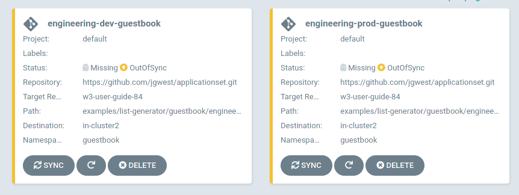

# ApplicationSet 控制器簡介

原文: https://argocd-applicationset.readthedocs.io/en/stable/


ApplicationSet 控制器是一個 [Kubernetes 控制器](https://kubernetes.io/docs/concepts/architecture/controller/)，它增加了對 ApplicationSet [CustomResourceDefinition](https://kubernetes.io/docs/tasks/extend-kubernetes/custom-resources/custom-resource-definitions/) (CRD) 的支持。在跨大量集群和 monorepos 管理 Argo CD 應用程序時，此控制器/CRD 可實現自動化和更大的靈活性，此外，它還可以在多租戶 Kubernetes 集群上使用自助服務。

ApplicationSet 控制器與現有的 [Argo CD 安裝](https://argo-cd.readthedocs.io/en/stable/getting_started/)一起工作。 Argo CD 是一個聲明性的 GitOps 持續交付工具，它允許開發人員在其現有的 Git 工作流中定義和控制 Kubernetes 應用程序資源的部署。

ApplicationSet 控制器與 Argo CD 一起被安裝，它通過添加額外的功能來支持以集群管理員為中心的場景來補充 Argo CD 管理的功能。 ApplicationSet 控制器提供：

- 通過 Argo CD 使用單個 Kubernetes 清單來定位多個 Kubernetes 集群的能力
- 使用單個 Kubernetes 清單通過 Argo CD 從一個或多個 Git 存儲庫部署多個應用程序的能力
- 改進了對 monorepos 的支持：在 Argo CD 的上下文中，monorepo 是在單個 Git 存儲庫中定義的多個 Argo CD 應用程序資源
- 在多租戶集群中，提高單個集群租戶使用 Argo CD 部署應用程序的能力（無需讓特權集群管理員參與啟用目標集群/命名空間）

## ApplicationSet 資源

這個例子定義了一個新的 ApplicationSet 類型的留言簿資源：

```yaml
apiVersion: argoproj.io/v1alpha1
kind: ApplicationSet
metadata:
  name: guestbook
spec:
  generators:
  - list:
      elements:
      - cluster: engineering-dev
        url: https://1.2.3.4
      - cluster: engineering-prod
        url: https://2.4.6.8
      - cluster: finance-preprod
        url: https://9.8.7.6
  template:
    metadata:
      name: '{{cluster}}-guestbook'
    spec:
      source:
        repoURL: https://github.com/infra-team/cluster-deployments.git
        targetRevision: HEAD
        path: guestbook/{{cluster}}
      destination:
        server: '{{url}}'
        namespace: guestbook
```

雖然有多種類型的生成器可用於 ApplicationSet 資源，但此示例使用 **List generator**，它只包含一個固定的、要定位的集群的文字列表。一旦 ApplicationSet 控制器處理了 ApplicationSet 資源，此集群列表將是 Argo CD 部署留言簿應用程序資源的集群。

**生成器**，例如 List 生成器，負責生成參數。參數是在 **模板** 呈現期間替換到模板中的鍵值對：ApplicationSet 資源的部分。

ApplicationSet 控制器當前支持多種生成器：

- **List generator**：根據集群名稱/URL值的固定列表生成參數，如上例所示。
- **Cluster generator**：集群生成器不是集群的文字列表（與列表生成器一樣），而是根據 Argo CD 中定義的集群自動生成集群參數。
- **Git generator**：Git 生成器根據生成器資源中定義的 Git 存儲庫中包含的 {==文件==} 或 {==文件夾==} 生成參數。
    - 包含 JSON 值的文件將被解析並轉換為模板參數。
    - Git 存儲庫中的各個目錄路徑也可以用作參數值。
- **Matrix generator**：矩陣生成器結合了其他兩個生成器的生成參數。

有關單個生成器以及上面未列出的其他生成器的更多信息，請參閱[生成器部分](https://argocd-applicationset.readthedocs.io/en/stable/Generators/)。

## 參數替換到模板中

與使用哪個生成器無關，生成器生成的參數被替換為模板中的 `{{parameter name}}` 值 (針對 ApplicationSet 資源的部分)。在此示例中，**List generator** 定義了 `cluster` 和 `url` 參數，然後分別替換為模板的 `{{cluster}}` 和 `{{url}}` 值。

替換後，此留言簿 ApplicationSet 資源將應用於 Kubernetes 集群：

1. ApplicationSet 控制器處理生成器條目，生成一組 **模板參數**。
2. 這些參數被替換到模板中，每組參數一次。
3. 每個渲染的模板都被轉換為 Argo CD `Application` 資源，然後在 Argo CD 命名空間內創建（或更新）該資源。
4. 最後，Argo CD 控制器被通知這些 `Application` 資源並負責處理它們。

在我們的示例中定義了三個不同的集群: `engineering-dev`、`engineering-prod` 和 `finance-preprod`，這個設定將產生三個新的 Argo CD 應用程序資源：每個集群一個。

以下是經厤過上述 1.2.3.4 步驟後為 `engineering-dev` 集群所創建的 `Application` 資源的示例：

```yaml
apiVersion: argoproj.io/v1alpha1
kind: Application
metadata:
  name: engineering-dev-guestbook
spec:
  source:
    repoURL: https://github.com/infra-team/cluster-deployments.git
    targetRevision: HEAD
    path: guestbook/engineering-dev
  destination:
    server: https://1.2.3.4
    namespace: guestbook
```

我們可以看到生成的值已經被替換到模板的 `server` 和 `path` 字段中，並且模板已經被渲染成一個完整的 Argo CD `Application`。

現在也可以從 Argo CD UI 中看到應用程序：



ApplicationSet 控制器將確保對 `ApplicationSet` 資源所做的任何更改、更新或刪除都會自動應用於相應的 `Application(s)`。

例如，如果一個新的集群/URL 列表條目被添加到列表生成器，一個新的 Argo CD 應用程序資源將相應地為這個新集群創建。對留言簿 `ApplicationSet` 資源所做的任何編輯都會影響由該資源實例化的所有 Argo CD `Application`，包括新的應用程序。

雖然 List 生成器的集群文字列表相當簡單，但 ApplicationSet 控制器中的其他可用生成器支持更複雜的場景。

