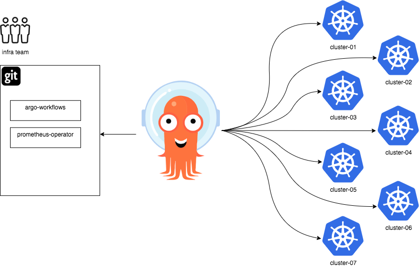
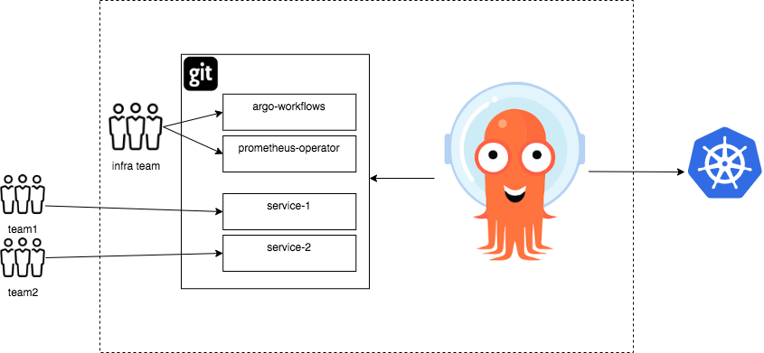

# ApplicationSet 控制器的用例

借助生成器的概念，ApplicationSet 控制器提供了一組強大的工具來自動化 Argo CD 應用程序的模板和修改。生成器從各種來源生成模板參數數據，包括 Argo CD 集群和 Git 存儲庫，支持和啟用新的用例。

雖然這些工具可用於任何所需的目的，但以下是 ApplicationSet 控制器旨在支持的一些特定用例。

## 用例：集群附加組件

ApplicationSet 控制器的初始設計重點是讓基礎架構團隊的 Kubernetes 集群管理員能夠跨大量集群自動創建大量多樣化的 Argo CD 應用程序，並將這些應用程序作為一個單元進行管理。為什麼需要這樣做的一個例子是集群附加用例。

在集群插件用例中，管理員負責為一個或多個 Kubernetes 集群提供集群插件：集群插件是諸如 [Prometheus operator](https://github.com/prometheus-operator/prometheus-operator)之類的運算符，或諸如 [argo-workflows 控制器](https://argoproj.github.io/argo-workflows/)之類的控制器（ [Argo 生態系統](https://argoproj.github.io/）。

通常，開發團隊的應用程序需要這些附加組件（例如，作為多租戶集群的租戶，他們可能希望向 Prometheus 提供指標數據或通過 Argo Workflows 編排工作流）。

由於安裝這些附加組件需要集群級別的權限，而不是由單個開發團隊持有，因此安裝是組織的基礎架構/運營團隊的責任，在大型組織中，該團隊可能負責數十、數百或數千個Kubernetes 集群（定期添加/修改/刪除新集群）。

跨大量集群擴展並自動響應新集群的生命週期的需要，必然要求某種形式的自動化。進一步的要求是允許使用特定標準（例如分期與生產）將附加組件定位到集群子集。



在此示例中，基礎架構團隊維護了一個 Git 存儲庫，其中包含 Argo Workflows 控制器和 Prometheus operator的應用程序清單。

基礎架構團隊希望使用 Argo CD 將這兩個附加組件部署到大量集群，並且同樣希望輕鬆管理新集群的創建/刪除。

在這個用例中，我們可以使用 ApplicationSet 控制器的 List、Cluster 或 Git 生成器來提供所需的行為：

- **List generator**：管理員維護兩個 ApplicationSet 資源，一個用於每個應用程序（Workflows 和 Prometheus），並在每個的列表生成器元素中包含他們希望定位的集群列表。
    - 使用此生成器，添加/刪除集群需要手動更新 ApplicationSet 資源的列表元素。

- **Cluster generator**：管理員維護兩個 ApplicationSet 資源，一個用於每個應用程序（Workflows 和 Prometheus），並確保所有新集群都在 Argo CD 中定義。
    - 由於 Cluster generator 自動檢測並定位在 Argo CD 中定義的集群，因此從 Argo CD [添加/刪除集群](https://argo-cd.readthedocs.io/en/stable/operator-manual/declarative-setup/#clusters)將自動導致 Argo CD 應用程序資源（針對每個應用程序）由 ApplicationSet 控制器創建。
- **Git generator**：Git 生成器是最靈活/最強大的生成器，因此有許多不同的方法來處理這個用例。這裡有一些：
    - 使用 Git generator `files` 字段：集群列表作為 JSON 文件保存在 Git 存儲庫中。通過 Git 提交更新 JSON 文件會導致添加/刪除新集群。
    - 使用 Git generator `directories` 字段：對於每個目標集群，該名稱的對應目錄存在於 Git 存儲庫中。通過 Git 提交添加/修改目錄將觸發具有共享目錄名稱的集群的更新。

有關每個生成器的詳細信息，請參閱生成器部分。

## 用例：monorepos

在 monorepo 用例中，Kubernetes 集群管理員從單個 Git 存儲庫管理單個 Kubernetes 集群的整個狀態。

合併到 Git 存儲庫中的清單更改應自動部署到集群。



在此示例中，基礎架構團隊維護一個 Git 存儲庫，其中包含 Argo Workflows 控制器和 Prometheus 操作員的應用程序清單。獨立開發團隊還添加了他們希望部署到集群的其他服務。

對 Git 存儲庫所做的更改——例如，更新已部署工件的版本——應該會自動導致 Argo CD 將該更新應用於相應的 Kubernetes 集群。

**Git generator** 可用於支持此用例：
- Git generator `directories` 字段可用於指定包含要部署的各個應用程序的特定子目錄（使用通配符）。
- Git generator `files` 字段可以引用包含 JSON 元數據的 Git 存儲庫文件，該元數據描述要部署的各個應用程序。

有關更多詳細信息，請參閱 Git 生成器文檔。

## 用例：多租戶集群上的 Argo CD 應用程序自助服務

自助服務用例旨在讓開發人員（作為多租戶 Kubernetes 集群的最終用戶）具有更大的靈活性：

- 使用 Argo CD 以自動化方式將多個應用程序部署到單個集群
- 使用 Argo CD 以自動化方式部署到多個集群
- 但是，在這兩種情況下，使這些開發人員能夠在不需要集群管理員參與的情況下這樣做（代表他們創建必要的 Argo CD 應用程序/AppProject 資源）

此用例的一個潛在解決方案是開發團隊在 Git 存儲庫（包含他們希望部署的清單）中以應用程序模式定義 Argo CD 應用程序資源，然後集群管理員可以查看/接受更改通過合併請求到此存儲庫。

雖然這聽起來像是一個有效的解決方案，但一個主要缺點是需要高度信任/審查才能接受包含 Argo CD 應用程序規範更改的提交。這是因為應用規範中包含許多敏感字段，包括項目、集群和命名空間。無意的合併可能允許應用程序訪問它們不屬於的名稱空間/集群。

因此，在自助服務用例中，管理員希望只允許應用程序規範的某些字段由開發人員控制（例如 Git 源存儲庫），而不允許其他字段（例如目標命名空間或目標集群，應該受到限制） .

幸運的是，ApplicationSet 控制器為此用例提供了另一種解決方案：集群管理員可以安全地創建一個 ApplicationSet 資源，其中包含一個 Git 生成器，該生成器使用模板字段將應用程序資源的部署限制為固定值，同時允許開發人員自定義“安全”字段，隨意。

```yaml
kind: ApplicationSet
# (...)
spec:
  generators:
  - git:
      repoURL: https://github.com/argoproj/applicationset.git
      files:
      - path: "apps/**/config.json"
  template:
    spec:
      project: dev-team-one # project is restricted
      source:
        # developers may customize app details using JSON files from above repo URL
        repoURL: {{app.source}}
        targetRevision: {{app.revision}}
        path: {{app.path}}
      destination:
        name: production-cluster # cluster is restricted
        namespace: dev-team-one # namespace is restricted
```

有關更多詳細信息，請參閱 Git 生成器。

  