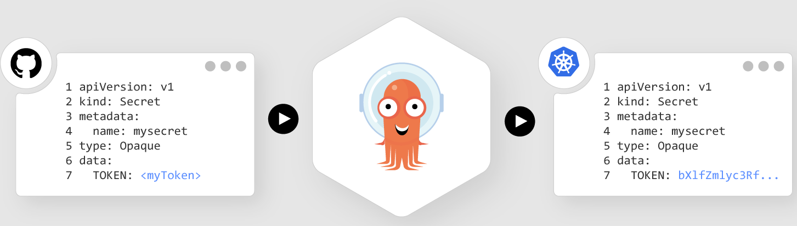
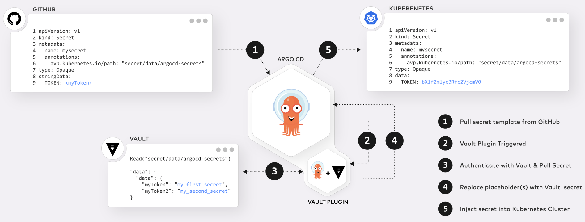
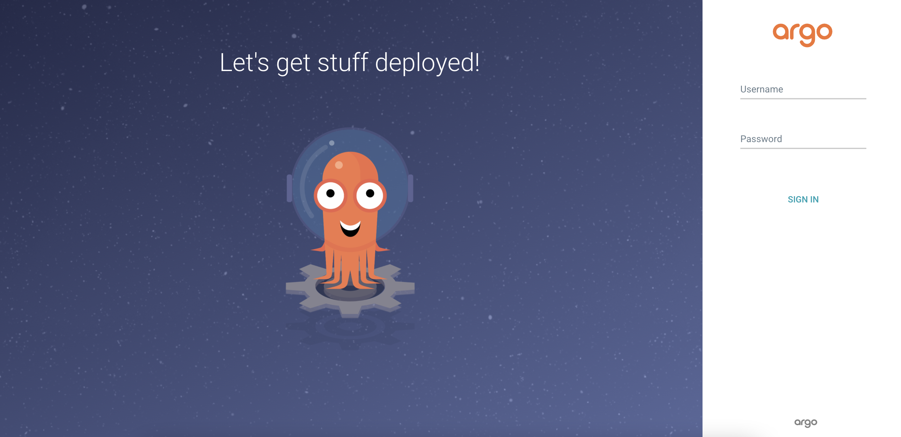

# 使用 GitOps 和 Argo CD Vault 插件進行 Secret 管理

原文: https://colinwilson.uk/2022/03/27/secret-management-with-gitops-and-argo-cd-vault-plugin/



GitOps 很棒！什麼是 GitOps？

!!! info
    GitOps 是一種進行 Kubernetes 集群管理和應用交付的方法。 GitOps 通過使用 Git 作為聲明性基礎設施和應用程序的單一事實來源來工作。


更簡單地說，GitOps 允許您通過 Git 以代碼的形式設置和管理您的基礎設施和應用程序。

但是密碼、api 令牌、數據庫憑證和其他秘密呢？這些也可以存儲在 Git 中嗎？不！！！在 Git 中存儲秘密是一個非常糟糕的主意。這就引出了一個常見的問題，“你如何使用 GitOps 處理秘密？”。

作法有好幾種。一種常見的方法是對機密本身使用機密管理工具（例如 HashiCorp Vault），並使用另一個工具（或多個工具）從管理工具中提取這些機密並將它們“注入”到 Kubernetes 集群中。

本教程涵蓋了使用 [Argo CD Vault Plugin](https://github.com/argoproj-labs/argocd-vault-plugin) 管理機密的特定場景。 Argo CD Vault Plugin（顧名思義）是一個 [Argo CD](https://argo-cd.readthedocs.io/en/stable/#what-is-argo-cd) 配置管理插件，與許多機密管理工具（HashiCorp Vault、IBM Cloud Secrets Manager、AWS Secrets Manager 等）兼容。本教程介紹了它與 [HashiCorp Vault](https://www.vaultproject.io/docs/what-is-vault#what-is-vault) 的集成。

## 先決條件

對於本指南，您將需要以下內容：

- HashiCorp Vault 安裝
- Terraform、Kubernetes、Git/GitHub 和 Traefik 的初學者到中級知識
- Terraform ≥ v0.15

## Argo CD Vault 插件的工作原理

Argo CD Vault 插件允許將佔位符 `placeholder` 存儲在 git 中，而不是實際的 [Kubernetes secret](https://kubernetes.io/docs/concepts/configuration/secret/)。

所以一個典型的 yaml/manifest `secret` 範例如下:

```yaml hl_lines="7"
apiVersion: v1
kind: Secret
metadata:
  name: mysecret
type: Opaque
data:
  TOKEN: bXlfZmlyc3Rfc2VjcmV0
```

Argo CD Vault 插件允許我們將 **TOKEN** 的值替換為佔位符 `placeholder` 然後再存儲在 git 中，例如:

```yaml hl_lines="7"
apiVersion: v1
kind: Secret
metadata:
  name: mysecret
type: Opaque
data:
  TOKEN: <myToken>
```

下圖說明了 Argo CD Vault 插件將機密注入 Kubernetes 集群的過程中的步驟：




1. Argo CD 從 Git Repo 拉取 Secret manifest 模板
2. Vault 插件由模板中存在的佔位符觸發
3. 該插件通過 Vault 進行身份驗證並拉取 secret（根據 `avp.kubernetes.io/path` 註解設置的路徑定位）
4. 檢索到的秘密被注入到模板中，替換佔位符
5. Argo CD 然後將更新的清單應用到 Kubernetes

!!! tip
    Argo CD Vault 插件並非專門用於 secret。它還可以用於 deployment、configMaps 或任何其他 Kubernetes 資源。

## 設置 Kubernetes 集群

在此教程中，我們將部署 argocd 並使其可通過 `ingress` 來訪問。因此，我們必須以某種方式創建 Kubernetes 集群，使內部端口 80（traefik ingress controller 正在監聽的地方）暴露在主機系統上。

```bash
$ k3d cluster create [Cluster Name] -p "8081:80@loadbalancer"
```

!!! info
    `-p "8081:80@loadbalancer"` 意味著：
    
    - “將主機的 8081 端口映射至 `loadbalancer` 容器上的 `80` 端口
Argo CD Vault 插件並非專門用於秘密。它還可以用於部署、configMaps 或任何其他 Kubernetes 資源。

接著讓我們在 Kubernetes 上安裝 ArgoCD。

## ArgoCD 安裝

安裝 ArgoCD 並檢查 `argocd` 命名空間中的每個 pod 是否正常運行：

```bash
$ kubectl create namespace argocd
$ kubectl apply -n argocd -f https://raw.githubusercontent.com/argoproj/argo-cd/stable/manifests/install.yaml
```

!!! info
    安裝 ArgoCD 組件需要幾分鐘時間，您可以使用以下命令查看狀態：
    ```bash
    watch kubectl get pods -n argocd
    ```
    你可以使用 ++ctrl+c++ 來終止 `watch`

成功部署 ArgoCD 將顯示以下 pod：

```bash
NAME                                  READY   STATUS    RESTARTS   AGE
argocd-application-controller-0       1/1     Running   0          2m18s
argocd-dex-server-5dd657bd9-2r24r     1/1     Running   0          2m19s
argocd-redis-759b6bc7f4-bnljg         1/1     Running   0          2m19s
argocd-repo-server-6c495f858f-p5267   1/1     Running   0          2m18s
argocd-server-859b4b5578-cv2qx        1/1     Running   0          2m18s
```

### 曝露 ArgoCD 服務

為了簡化學習，我們使用 `kubectl port-forward` 來將 `argocd` 的服務曝露出來。打開一個新的 `terminal` 並輸入下列的命令：

```bash
$ kubectl port-forward svc/argocd-server -n argocd 8443:443 --address='0.0.0.0'
```

### 使用 ArgoCD Web UI

取得部署 ArgoCD 時生成的隨機密碼:

```bash
$ argoPass=$(kubectl -n argocd get secret argocd-initial-admin-secret -o jsonpath="{.data.password}" | base64 -d)

$ echo $argoPass
```

將 ArgoCD 網絡位址設成環境變數：

``` bash
# base port-forward setting
$ argoURL=0.0.0.0:8443

$ echo $argoURL
```

使用瀏覽器來連接 ArgoCD 控制台。

使用用戶 `admin` 和上一步中提取的密碼訪問 ArgoCD 控制台：



登錄後，您應該會看到以下頁面。


這是 Argo CD Web UI。

## 安裝 ArgoCD-Vault-Plugin