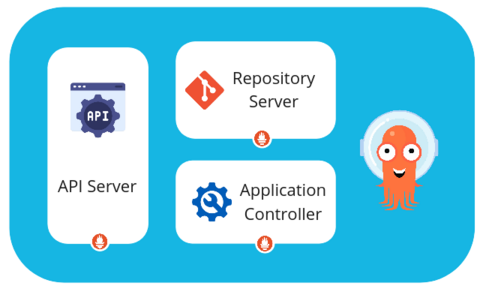
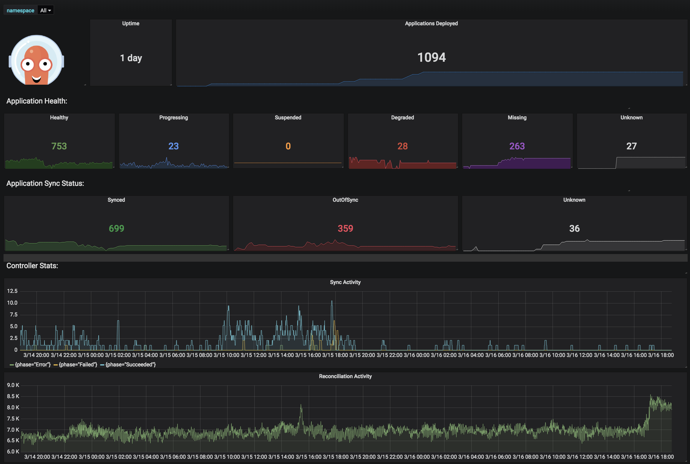

# Metrics 指標

原文: [Metrics](https://argo-cd.readthedocs.io/en/stable/operator-manual/metrics/)

Argo CD 為每個內部組件公開不同的 Prometheus 指標集。



## ArgoCD 元件指標

### API Server 指標

API Server 是一個 gRPC/REST 服務器，它公開 Web UI、CLI 和 CI/CD 系統使用的 API。它具有以下職責：

- 應用程序管理和狀態報告
- 調用應用程序操作（例如同步、回滾、用戶定義的操作）
- 存儲庫和集群憑證管理（存儲為 K8s 秘密）
- 對外部身份提供者的身份驗證和授權委託
- RBAC 執行
- Git webhook 事件的偵聽器/轉發器

有關 API 服務器 API 請求和響應活動的指標（請求總數、響應代碼等）。在 `argocd-server-metrics:8083/metrics` 端點抓取。

|指標	   |型別 |描述        |
|-------|-----|-----------|
|argocd_redis_request_duration	|histogram	|Redis 請求持續時間。|
|argocd_redis_request_total	|counter	|應用程序協調期間執行的 kubernetes 請求數。|
|grpc_server_handled_total	|counter	|服務器上完成的 RPC 總數，無論成功還是失敗。|
|grpc_server_msg_sent_total	|counter	|服務器發送的 gRPC 流消息總數。|

### Repository Server 指標

Repository Server 是一項內部服務，它維護一個包含應用程序清單的 Git 存儲庫的本地緩存。當提供以下輸入時，它負責生成和返回 Kubernetes 清單：

- repository URL
- revision (commit, tag, branch)
- application path
- template specific settings: parameters, helm values.yaml

有關 Repository Server 的指標。在 `argocd-repo-server:8084/metrics` 端點抓取。

|指標	   |型別 |描述        |
|-------|-----|-----------|
|argocd_git_request_duration_seconds	|histogram	|Git 請求 duration 秒數。|
|argocd_git_request_total	|counter	|Repo server 執行的 git 請求數。|
|argocd_redis_request_duration_seconds	|histogram	|Redis 請求 duration 秒數。|
|argocd_redis_request_total	|counter	|應用程序協調期間執行的 kubernetes 請求數。|
|argocd_repo_pending_request_total	|gauge	|需要存儲庫鎖定的待處理請求數|


### Application Controller 指標

Application Controller 是一個 Kubernetes 控制器，{==它持續監控正在運行的應用程序並將當前的實時狀態與所需的目標狀態（如 repo 中指定）進行比較==}。它檢測 **OutOfSync** 應用程序狀態並可選擇採取糾正措施。它負責為生命週期事件（PreSync、Sync、PostSync）調用任何用戶定義的掛鉤。

**功能:**

- 將應用程序自動部署到指定的目標環境
- 支持多種配置管理/模板工具（Kustomize、Helm、Jsonnet、plain-YAML）
- 能夠管理和部署到多個集群
- SSO 集成（OIDC、OAuth2、LDAP、SAML 2.0、GitHub、GitLab、Microsoft、LinkedIn）
- 用於授權的多租戶和 RBAC 策略
- 回滾/隨地滾動到 Git 存儲庫中提交的任何應用程序配置
- 應用資源健康狀況分析
- 自動配置漂移檢測和可視化
- 自動或手動將應用程序同步到所需狀態
- 提供應用程序活動實時視圖的 Web UI
- 用於自動化和 CI 集成的 CLI
- Webhook 集成（GitHub、BitBucket、GitLab）
- 用於自動化的訪問令牌
- PreSync、Sync、PostSync 掛鉤以支持複雜的應用程序佈署（例如藍/綠和金絲雀升級）
- 應用程序事件和 API 調用的審計跟踪
- Prometheus 指標
- 用於在 Git 中覆蓋 helm 參數的參數覆蓋

關於 Application Controller 的指標。在 `argocd-metrics:8082/metrics` 端點抓取。

|指標	   |型別 |描述        |
|-------|-----|-----------|
|argocd_app_info	|gauge	|有關應用程序的信息。它包含諸如 sync_status 和 health_status 之類的標籤，它們反映了 ArgoCD 中的應用程序狀態。|
|argocd_app_k8s_request_total	|counter	|應用程序協調期間執行的 kubernetes 請求數。|
|argocd_app_labels	|gauge	|Argo 應用程序標籤轉換為 Prometheus 標籤。默認情況下禁用。請參閱下面有關如何啟用它的部分。|
|argocd_app_reconcile	|histogram	|應用協調性能。|
|argocd_app_sync_total	|counter	|應用程序同步歷史計數器。|
|argocd_cluster_api_resource_objects	|gauge	|緩存中的 k8s 資源物件數。|
|argocd_cluster_api_resources	|gauge	|受監控的 kubernetes API 資源的數量。|
|argocd_cluster_cache_age_seconds	|gauge	|以秒為單位的集群緩存期限。|
|argocd_cluster_connection_status	|gauge	|k8s集群當前連接狀態。|
|argocd_cluster_events_total	|counter	|k8s 資源事件的進程數。|
|argocd_cluster_info	|gauge	|有關集群的信息。|
|argocd_kubectl_exec_pending	|gauge	|待處理的 kubectl 執行次數|
|argocd_kubectl_exec_total	|counter	|kubectl 執行次數|
|argocd_redis_request_duration	|histogram	|Redis 請求持續時間。|
|argocd_redis_request_total	|counter	|應用協調期間執行的 redis 請求數。|

## 與 Prometheus Operator 整合

如果 Kubernetes 中使用了 Prometheus Operator，則可以使用以下 ServiceMonitor 示例來通知 Prometheus 括取指標。

將 `metadata.labels.release` 更改為您的 Prometheus 選擇的標籤名稱。

```yaml
apiVersion: monitoring.coreos.com/v1
kind: ServiceMonitor
metadata:
  name: argocd-metrics
  labels:
    release: prometheus-operator
spec:
  selector:
    matchLabels:
      app.kubernetes.io/name: argocd-metrics
  endpoints:
  - port: metrics
```

```yaml
apiVersion: monitoring.coreos.com/v1
kind: ServiceMonitor
metadata:
  name: argocd-server-metrics
  labels:
    release: prometheus-operator
spec:
  selector:
    matchLabels:
      app.kubernetes.io/name: argocd-server-metrics
  endpoints:
  - port: metrics
```

```yaml
apiVersion: monitoring.coreos.com/v1
kind: ServiceMonitor
metadata:
  name: argocd-repo-server-metrics
  labels:
    release: prometheus-operator
spec:
  selector:
    matchLabels:
      app.kubernetes.io/name: argocd-repo-server
  endpoints:
  - port: metrics
```

```yaml
apiVersion: monitoring.coreos.com/v1
kind: ServiceMonitor
metadata:
  name: argocd-applicationset-controller-metrics
  labels:
    release: prometheus-operator
spec:
  selector:
    matchLabels:
      app.kubernetes.io/name: argocd-applicationset-controller
  endpoints:
  - port: metrics
```

## Grafana Dashbaord

您可以在[此處](https://github.com/argoproj/argo-cd/blob/master/examples/dashboard.json)找到示例 Grafana 儀表板或查看[演示實例儀表板](https://grafana.apps.argoproj.io/)。



