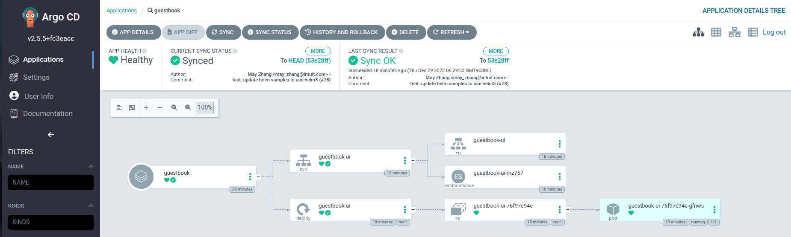

# ArgoCD 可觀測性實戰 - Metrics


本教程主要用來展示 ArgoCD 如何實作可觀測性三大支柱之一的 **Metrics**　並且與平台系統元件進行整合。

## 步驟 01 - 環境安裝

### Kubernetes


本教程使用 K3D 來構建實驗 K8S 集群, 詳細說明請參考: 

- [使用 K3D 設置 Kubernetes 集群](../../../kubernetes/01-getting-started/learning-env/k3d/k3s-kubernetes-cluster-setup-with-k3d.md)

執行下列命令來創建實驗 Kubernetes 集群:

```bash title="執行下列命令  >_"
k3d cluster create --api-port 6443 \
--port 8080:80@loadbalancer --port 8443:443@loadbalancer
```

確認 Kubernetes 及 Kubectl 是否成功安裝：

```bash title="執行下列命令  >_"
kubectl cluster-info
```
(輸出結果)

```
Kubernetes control plane is running at https://0.0.0.0:6443
CoreDNS is running at https://0.0.0.0:6443/api/v1/namespaces/kube-system/services/kube-dns:dns/proxy
Metrics-server is running at https://0.0.0.0:6443/api/v1/namespaces/kube-system/services/https:metrics-server:/proxy
```

### kube-prometheus-stack

本教程使用 `kube-prometheus-stack` 來構建可觀測性的相關元件, 詳細說明請參考:

- [Prometheus 簡介](../../../prometheus/prometheus/overview.md)
- [Prometheus Operator 簡介](../../../prometheus/operator/install.md)

添加 Prometheus-Community helm 存儲庫並更新本地緩存：

```bash title="執行下列命令  >_"
$ helm repo add prometheus-community https://prometheus-community.github.io/helm-charts
$ helm repo update 
```

創建要配置的 vlaues 檔案:

```yaml title="kube-stack-prometheus-values.yaml"
grafana:
  ingress:
    ## If true, Grafana Ingress will be created
    enabled: true
    hosts: 
      - grafana.example.it
  # change timezone setting base on browser
  defaultDashboardsTimezone: browser
  grafana.ini:
    users:
      viewers_can_edit: true
    auth:
      disable_login_form: false
      disable_signout_menu: false
    auth.anonymous:
      enabled: true
      org_role: Viewer
  sidecar:
    datasources:
      logLevel: "DEBUG"
      enabled: true
      searchNamespace: "ALL"
    dashboards:
      logLevel: "DEBUG"
      # enable the cluster wide search for dashbaords and adds/updates/deletes them in grafana
      enabled: true
      searchNamespace: "ALL"
      label: grafana_dashboard
      labelValue: "1"

prometheus:
  ingress:
    ## If true, Grafana Ingress will be created
    enabled: true
    hosts: 
      - prometheus.example.it
  prometheusSpec:
    # enable the cluster wide search for ServiceMonitor CRD
    serviceMonitorSelectorNilUsesHelmValues: false
    # enable the cluster wide search for PodMonitor CRD
    podMonitorSelectorNilUsesHelmValues: false
    # enable the cluster wide search for PrometheusRule CRD
    ruleSelectorNilUsesHelmValues: false
    probeSelectorNilUsesHelmValues: false

alertmanager:
  ingress:
    ## If true, Grafana Ingress will be created
    enabled: true
    hosts: 
      - alertmanager.example.it
```

!!! tip
    本教程的配置裡啟動了 `Ingress` 的設定並為不同元件設定了 `hostname`:

      - Prometheus: `prometheus.example.it`
      - AlertManager: `alertmanager.example.it`
      - Grafana: `grafana.example.it`

使用 Helm 在命名空間監控中部署 `kube-stack-prometheus` chart：

```bash title="執行下列命令  >_"
helm upgrade --install --wait --create-namespace --namespace monitoring  \
kube-stack-prometheus prometheus-community/kube-prometheus-stack \
--values kube-stack-prometheus-values.yaml
```

該 Helm chart 安裝了 Prometheus 組件和 Operator、Grafana 以及以下 exporters：

- [prometheus-node-exporter](https://github.com/prometheus/node_exporter) 暴露底層硬件和操作系統的相關指標
- [kube-state-metrics](https://github.com/kubernetes/kube-state-metrics) 監聽 Kubernetes API 服務器並生成有關對象狀態的指標

有關 `kube-stack-prometheus` 的詳細說明:

- [Prometheus Operator](../../../prometheus/operator/install.md)

檢查通過 Helm chart 所創建的 `Ingress`:

```bash title="執行下列命令  >_"
$ kubectl get ing -n monitoring

NAME                                      CLASS    HOSTS                     ADDRESS      PORTS   AGE
kube-stack-prometheus-kube-prometheus     <none>   prometheus.example.it     172.22.0.2   80      119s
kube-stack-prometheus-kube-alertmanager   <none>   alertmanager.example.it   172.22.0.2   80      119s
kube-stack-prometheus-grafana             <none>   grafana.example.it        172.22.0.2   80      119s
```

!!! tip
    查看 `Ingress` 物件所顯示的 **ADDRESS** 欄位可作為 ingress 是否正確配置的基本檢驗項目。

在 `Linux` 中修改 `/etc/hosts` 來增加三條 entry 來模擬 DNS 的名稱解析:

```bash title="/etc/hosts"
# 1.選擇使用本機的 127.0.0.1 作為南北向的進入點
#   這樣的Request會通過外部的LoadBalancer (port:8080)來存取
127.0.0.1   prometheus.example.it
127.0.0.1   alertmanager.example.it
127.0.0.1   grafana.example.it

## 或是

# 2.選擇 docker network 的虛擬網絡的 IP 作為南北向的進入點
#   要注意配置在K8S集群裡的LoadBalancer所取得的外部 IP
172.22.0.2   prometheus.example.it
172.22.0.2   alertmanager.example.it
172.22.0.2   grafana.example.it
```

本教程使用選擇 docker network 的虛擬網絡的 IP 作為南北向的進入點, 這個設定也會比較趨向真實環境的作法。

!!! tip
    每個人的本機的 docker network 的虛擬網絡的 IP 都會不同，請特別注意本機的 Ingress Controller 所配置出來的 IP。

#### 連接到 Prometheus

**方法 1:**

Prometheus Web UI 可通過 `Ingress` 所設定的 `http://prometheus.example.it` 來訪問。

**方法 2:**

Prometheus Web UI 可通過以下命令通過端口轉發訪問：

```bash title="執行下列命令  >_"
kubectl port-forward --namespace monitoring svc/kube-stack-prometheus-kube-prometheus 9090:9090 --address="0.0.0.0"
```

在 `http://localhost:9090` 上打開瀏覽器選項卡會顯示 Prometheus Web UI。我們可以檢索從不同指標 Exporters 所收集回來的指標：


#### 連接到 AlertManager

**方法 1:**

AlertManager Web UI 可通過 `Ingress` 所設定的 `http://alertmanager.example.it` 來訪問。

**方法 2:**

AlertManager Web UI 可通過以下命令通過端口轉發訪問：

```bash title="執行下列命令  >_"
kubectl port-forward svc/kube-stack-prometheus-kube-alertmanager 9093:9093 --address="0.0.0.0"
```


#### 連接到 Grafana

**方法 1:**

Grafana Web UI 可通過 `Ingress` 所設定的 `http://grafana.example.it` 來訪問。

**方法 2:**

Grafana Web UI 可通過以下命令通過端口轉發訪問：

```bash title="執行下列命令  >_"
kubectl port-forward --namespace monitoring svc/kube-stack-prometheus-grafana 3000:80 --address="0.0.0.0"
```

打開瀏覽器並轉到 http://localhost:3000 並填寫前一個命令所取得的用戶名/密碼。預設的帳號是:

- `username`: admin
- `password`: prom-operator


### ArgoCD

添加 ArgoCD 的 helm 存儲庫並更新本地緩存：

```bash title="執行下列命令  >_"
helm repo add argo https://argoproj.github.io/argo-helm

helm repo update
```

創建要配置的 vlaues 檔案:

```yaml title="argocd-values.yaml"
## Argo CD server
server:
  extraArgs:
  # -- Run server without TLS
  - --insecure
  ingress:
    # -- Enable an ingress resource for the Argo CD server
    enabled: true
    # -- List of ingress hosts
    ## Argo Ingress.
    ## Hostnames must be provided if Ingress is enabled.
    ## Secrets must be manually created in the namespace
    hosts: 
      - argocd.example.it
  metrics:
    # -- Deploy metrics service
    enabled: true
    service:
      # -- Metrics service port
      servicePort: 8083
      # -- Metrics service port name
      portName: http-metrics
    serviceMonitor:
      # -- Enable a prometheus ServiceMonitor
      enabled: true

## Repo Server
repoServer:
  ## Repo server metrics service configuration
  metrics:
    # -- Deploy metrics service
    enabled: true
    service:
      # -- Metrics service port
      servicePort: 8084
      # -- Metrics service port name
      portName: http-metrics
    serviceMonitor:
      # -- Enable a prometheus ServiceMonitor
      enabled: true

## Application controller
controller:
  ## Application controller metrics configuration
  metrics:
    # -- Deploy metrics service
    enabled: true
    applicationLabels:
      # -- Enables additional labels in argocd_app_labels metric
      enabled: true
    service:
      # -- Metrics service port
      servicePort: 8082
      # -- Metrics service port name
      portName: http-metrics
    serviceMonitor:
      # -- Enable a prometheus ServiceMonitor
      enabled: true
    rules:
      # -- Deploy a PrometheusRule for the application controller
      enabled: true
      # -- PrometheusRule.Spec for the application controller
      spec:
       - alert: ArgoAppMissing
         expr: |
           absent(argocd_app_info) == 1
         for: 15m
         labels:
           severity: critical
         annotations:
           summary: "[Argo CD] No reported applications"
           description: >
             Argo CD has not reported any applications data for the past 15 minutes which
             means that it must be down or not functioning properly.  This needs to be
             resolved for this cloud to continue to maintain state.
       - alert: ArgoAppNotSynced
         expr: |
           argocd_app_info{sync_status!="Synced"} == 1
         for: 12h
         labels:
           severity: warning
         annotations:
           summary: "[{{`{{$labels.name}}`}}] Application not synchronized"
           description: >
             The application [{{`{{$labels.name}}`}} has not been synchronized for over
             12 hours which means that the state of this cloud has drifted away from the
             state inside Git.
      selector:
        prometheus: kube-prometheus
      namespace: monitoring

## ApplicationSet controller
applicationSet:
  ## Metrics service configuration
  metrics:
    # -- Deploy metrics service
    enabled: true
    service:
      # -- Metrics service port
      servicePort: 8085
      # -- Metrics service port name
      portName: http-metrics
    serviceMonitor:
      # -- Enable a prometheus ServiceMonitor
      enabled: true
```

!!! info
    上述的 Helm 配置檔案包含了與 Prometheus operation 整合的許多配置，主要包含了:

    - 創建相關的 Service 來曝露在 ArgoCD 關鍵元件 metric 端點的 port
    - 創建 ServiceMonitor(CRD) 來讓 Prometheus 感知如何刮取指標
    - 創建 PrometheusRule(CRD) 來設定 AlertRule 來對 ArgoCD 告警

使用 Helm 在 `argocd` 的命名空間中部署 `argo/argo-cd` chart：

```bash title="執行下列命令  >_"
helm upgrade --install --create-namespace --namespace argocd  \
     argocd argo/argo-cd \
     --values argocd-values.yaml
```

檢查通過 Helm chart 所創建的 `Ingress`:

```bash title="執行下列命令  >_"
$ kubectl get ing -n argocd

NAME            CLASS    HOSTS               ADDRESS      PORTS   AGE
argocd-server   <none>   argocd.example.it   172.22.0.2   80      19s
```

在 `Linux` 中修改 `/etc/hosts` 來增加一條 entry 來模擬 DNS 的名稱解析:

```bash title="執行下列命令  >_"
# 1.選擇使用本機的 127.0.0.1 作為南北向的進入點
#   這樣的Request會通過外部的LoadBalancer (port:8080)來存取
127.0.0.1   argocd.example.it

## 或是

# 2.選擇 docker network 的虛擬網絡的 IP 作為南北向的進入點
#   要注意配置在K8S集群裡的LoadBalancer所取得的外部 IP
172.22.0.2   argocd.example.it
```

#### 連接到 ArgoCD

**方法 1:**

ArgoCD Web UI 可通過 `Ingress` 所設定的 `http://argocd.example.it` 來訪問。

**方法 2:**

ArgoCD Web UI 可通過以下命令通過端口轉發訪問：

```bash title="執行下列命令  >_"
kubectl port-forward service/argocd-server -n argocd 8080:80
```

打開瀏覽器並使用 `http://localhost:8080` 來訪問: 


使用下列的命令來取得 argocd 初始化的密碼:

```bash title="執行下列命令  >_"
kubectl -n argocd get secret argocd-initial-admin-secret -o jsonpath="{.data.password}" | base64 -d
```

結果:

```
4geyMPlYJQvp-hj6
```

!!! tip
    這個密碼是 ArgoCD 在安裝時動態生成, 每次都會不同。

打開瀏覽器並轉到 http://localhost:8080 並填寫用戶名 `admin` 與前一個命令所取得的密碼。


成功登入後可看到:


## 步驟 02 - 應用程序 Metric 實戰


應用程序可觀測性首先可先從 Metrics 的第一個支柱來先行強化，整合的手法可簡化成四個步驟:

1. 儀器化你的應用程序
2. 設定應用程序指標的收集
3. 設定應用程序告警規則
4. 創建應用程序指標儀表板

### 1. 儀器化你的應用程序

儀器化是監控過程的關鍵。只有首先捕獲使你能夠做出這些決定的數據，你才能對系統的性能和健康狀況做出有意義的決定。通過使用檢測，你收集的信息應該足以評估性能、診斷問題和做出決策，而無需登錄到遠端的服務器以手動執行排錯和調試。

幸運的是 ArgoCD 己經針對相關元件設計了相關的監控指標並有詳細的文檔來說明。了解這些指標代表的意義是監控 ArgoCD 的起手式。

- [ArgoCD 的 Metrics 指標說明與列表](./index.md)

### 2. 設定應用程序指標的收集

在本教程中 Prometheus 是用來收集應用程式指標數據的元件，而 Prometheus 是使用拉 (pull) 的手法來取得各個應用的指標。在 `kube-prometheus-stack` 的安裝包裡頭也安裝了 `prometheus-operator` 的元件與相關的 CRD 來讓各應用程式的開發團隊可使用這些 CRD　來自服務式地配置讓 Prometheus 可認知到如何 scrape 到應用程序的指標 endpoint。

詳細的說明請參考: 

- [自定義監控報警](../../../prometheus/operator/custom.md)

通過 Helm 的設定, 在環境裡己經有相關的 ServiceMonitor 物件。

驗證 `Service`:

```bash hl_lines="9-12"
$ kubectl get svc -n argocd

NAME                                       TYPE        CLUSTER-IP      EXTERNAL-IP   PORT(S)             AGE
argocd-redis                               ClusterIP   10.43.173.60    <none>        6379/TCP            138m
argocd-applicationset-controller           ClusterIP   10.43.110.159   <none>        7000/TCP            138m
argocd-repo-server                         ClusterIP   10.43.140.104   <none>        8081/TCP            138m
argocd-server                              ClusterIP   10.43.209.235   <none>        80/TCP,443/TCP      138m
argocd-dex-server                          ClusterIP   10.43.219.251   <none>        5556/TCP,5557/TCP   138m
argocd-server-metrics                      ClusterIP   10.43.80.20     <none>        8083/TCP            46m
argocd-application-controller-metrics      ClusterIP   10.43.215.81    <none>        8082/TCP            22m
argocd-applicationset-controller-metrics   ClusterIP   10.43.11.97     <none>        8085/TCP            22m
argocd-repo-server-metrics                 ClusterIP   10.43.144.153   <none>        8084/TCP            22m
```

!!! tip
    上述 highlight 出來的四個 `Service` 是用來標明 ArgoCD 關鍵組件的指標刮取的 port number。

驗證 `ServieMonitor`:

```bash
$ kubectl get servicemonitor -n argocd

NAME                               AGE
argocd-server                      49m
argocd-application-controller      24m
argocd-applicationset-controller   24m
argocd-repo-server                 24m
```

在 Prometheus UI　中點選 `Status >> Target`:


### 3. 設定應用程序告警規則

Prometheus 除了可以收集應用程式指標,同時它也是用來執行告警規則的元件。`prometheus-operator` 的 CRD 中　`PrometheusRule` 就是讓各應用程式的開發團隊可以使用這個 CRD　來自服務式地配置讓 Prometheus 執行的告警規則。

詳細的說明請參考: 

- [自定義監控報警](../../../prometheus/operator/custom.md)

通過 Helm 的設定, 在環境裡己經有相關的 `PrometheusRule` (CRD) 物件。

下述兩個 `PrometheusRule` 是在 Helm 中預設的告警規則:

```yaml title="PrometheusRule"
apiVersion: monitoring.coreos.com/v1
kind: PrometheusRule
metadata:
  name: argocd-application-controller
  namespace: monitoring
spec:
  groups:
  - name: argocd
    partial_response_strategy: ""
    rules:
    - alert: ArgoAppMissing
      annotations:
        description: |
          Argo CD has not reported any applications data for the past 15 minutes which means that it must be down or not functioning properly.  This needs to be resolved for this cloud to continue to maintain state.
        summary: '[Argo CD] No reported applications'
      expr: |
        absent(argocd_app_info) == 1
      for: 15m
      labels:
        severity: critical
    - alert: ArgoAppNotSynced
      annotations:
        description: |
          The application [{{`{{$labels.name}}`}} has not been synchronized for over 12 hours which means that the state of this cloud has drifted away from the state inside Git.
        summary: '[{{`{{$labels.name}}`}}] Application not synchronized'
      expr: |
        argocd_app_info{sync_status!="Synced"} == 1
      for: 12h
      labels:
        severity: warning
```

|告警規則名稱|目的|描述|
|----------|---|----|
|ArgoAppMissing|[Argo CD] No reported applications|Argo CD 在過去 15 分鐘內沒有報告任何 `application` 數據，這意味著它一定是停機或無法正常運行。這需要解決這個相關設定在 ArgoCD 裡的 `Application` 才能繼續保持 `sync` 狀態。|
|ArgoAppNotSynced|Application not synchronized|設定在 ArgoCD 裡的 `Application` 超過 12 小時未同步，這意味著 `Application` 的狀態已經與 Git 內部的狀態漸行漸遠。|


在 Prometheus UI　中點選 `Status >> Rules`:


### 4. 創建應用程序指標儀表板

Grafana 確實是一個了不起的、強大的工具，它可以通過漂亮、靈活的儀表板創建、探索和共享您的數據——無論數據存儲在哪裡。

但是，隨著公司的發展，在維護大量儀表板方面帶來了新的挑戰。讓我們來看看其中的一些……

1. `Inconsistent dashboards in different environments`: 很多時候，我們根據當時的特定需求更新儀表板，然後忘記在所有其他環境中更新它。這會導致跨環境的不一致，因此它使監控變得更加困難，有時甚至效率低下。

2. `Ownership`: 儀表板沒有明確的所有者。創建和更改儀表板，與佈署儀表板的權責不明。

3. `Diaster recovery`: 當涉及到災難恢復、創建新環境或將現有環境遷移到新集群時，如何將所有內容恢復到所需狀態並準備必要的調整。

4. `ChangeLog`: 隨著開發部門的發展，儀表板的變化也越來越頻繁。有時，可以針對特定案例或測試在不同環境中更改多個儀表板。 Grafana 有自己的變更管理，但是，它是每個儀表板的。我們缺乏一個集中的地方，在那裡我們可以看到某人所做的所有更改，並且能夠在需要時立即回滾所有內容。

#### Dashboards, ConfigMaps 與 GitOps

幸運的是，Grafana 5.0 版引入了一個使用配置文件的新的主動供應系統。這意味著我們現在能夠從配置文件（Kubernetes 中的 ConfigMap）配置儀表板。 Grafana 將自動加載它們，而無需進一步部署部署（就像我們過去在 Kubernetes 中使用配置映射時一樣）。

我們現在需要找到一種方法將 configmap 從一個地方分發到所有環境。GitOps 方法可以幫助我們實現這一點，因為我們將儀表板配置存儲在 git 中，合併到主分支的任何更改都將自動應用於我們的系統。

市面上有很多 GitOps 工具，比如 Flux、Jenkins 等等——我們選擇了 ArgoCD。ArgoCD 是用於 Kubernetes 的聲明式 GitOps 持續交付工具。

ArgoCD 持續監視指定的 git 存儲庫，將其與集群中當前部署的清單進行比較，並在它們上有效地運行 `kubectl apply -f <all>`。

對於廣泛的用例，這導致了一個非常簡單和可見的持續交付過程——在我們的例子中，在 configmaps 中持續部署 Grafana 儀表板。


想了解如何將自己客制的Dashbaord轉換成 Configmap 來 GitOps 進到 Kubernetes 中的 Grafana，請參考: [使用 ConfigMap 添加 Grafana 儀表板](../../../prometheus/operator/dashboard-using-configmap.md)。

接下來我們會使用 [ArgoCD- Dashbaord](https://argo-cd.readthedocs.io/en/stable/operator-manual/metrics/#dashboards) 的 Dashbaord 來作示範。

- https://github.com/argoproj/argo-cd/blob/master/examples/dashboard.json


**下載 Dashboard:**

```bash
wget https://raw.githubusercontent.com/argoproj/argo-cd/master/examples/dashboard.json
```

**創建包含 Dashboard 的 ConfigMap:**

```bash
kubectl create configmap cm-argocd-dashboard \
  --from-file=dashboard.json \
  --dry-run=client -o yaml > cm-argocd-dashboard.yaml
```

**設定 Dashboard Aware Flag:**

使用任一文件編輯器來編修 `cm-argocd-dashboard.yaml` 來增加一個關鍵的標籤 `grafana_dashboard: "1"`:

```yaml title="cm-argocd-dashboard.yaml" hl_lines="9-10"
apiVersion: v1
data:
  dashboard.json: |-
    ...
    ...
kind: ConfigMap
metadata:
  name: cm-argocd-dashboard.yaml
  labels:
    grafana_dashboard: "1"
```

!!! info
    點選 >> [cm-argocd-dashboard.yaml](./assets/cm-argocd-dashboard.yaml) 來下載己修改好的 ConfigMap。

**應用 ConfigMap 到 Kubernetes:**

執行下列指令來手動將 `cm-argocd-dashboard.yaml` 建置進 Kubernetes 中:

```bash
kubectl apply -f cm-argocd-dashboard.yaml
```

**在 Grafana 中驗證儀表板:**

在 Grafana UI 中的左側瀏覽欄中點選 "Dashboards >> Browse", 並在 filter 欄中輸入 "argo":


點選 `ArgoCD` 儀表板:


!!! info
    這時候看這個儀表板時會看不到什麼資訊，主要是因為我們還沒有在 ArgoCD 中佈署任何要 sync 的 `Application`。


## 步驟 03 - ArgoCD 監控驗證

### 從 Git 存儲庫佈署應用程序


GitOps 的起手式就是把應用程序的佈署 Manifests 使用 git repo 來進行管控。接下來我們使用一個包含留言簿應用程序的示例存儲庫，用來演示 Argo CD 的工作原理。

- 示例 git 存儲庫: `https://github.com/argoproj/argocd-example-apps.git` 


=== "通過 CLI 創建 Application"

    首先，我們需要將當前命名空間設置為運行以下命令的 argocd：

    ```bash title="執行下列命令  >_"
    kubectl config set-context --current --namespace=argocd
    ```

    使用以下命令創建示例留言簿應用程序：

    ```bash title="執行下列命令  >_"
    argocd app create guestbook --repo https://github.com/argoproj/argocd-example-apps.git \
      --path guestbook --dest-server https://kubernetes.default.svc --dest-namespace default
    ```

=== "通過 UI 創建 Application"

    打開瀏覽器訪問 Argo CD 外部 UI，並通過在瀏覽器中訪問 IP/主機名並使用在第 4 步中設置的憑據登錄。

    登錄後點擊 **+New App** 按鈕，如下圖：

    

    為Application Name 設成 `guestbook`，Project 設成 `default`，並將同步策略保留為 `Manual`：

    

    通過將存儲庫 url 設置為 github 存儲庫 url，將 `https://github.com/argoproj/argocd-example-apps.git` 存儲庫連接到 Argo CD，將修訂保留為 `HEAD`，並設置路徑為 `guestbook`：

    

    對於 Destination，將集群 URL 設置為 `https://kubernetes.default.svc`（或集群名稱為 `in-cluster`），將命名空間設置為 `default`：

    

    填寫完以上信息後，點擊 UI 上方的 `Create` 創建 guestbook 應用：

    

### 同步（部署）應用程序

=== "通過 CLI 同步"

    創建 guestbook 應用程序後，您現在可以查看其狀態：

    ```bash title="執行下列命令  >_"
    $ argocd app get guestbook
    Name:               argocd/guestbook
    Project:            default
    Server:             https://kubernetes.default.svc
    Namespace:          default
    URL:                https://localhost:8080/applications/guestbook
    Repo:               https://github.com/argoproj/argocd-example-apps.git
    Target:             HEAD
    Path:               guestbook
    SyncWindow:         Sync Allowed
    Sync Policy:        <none>
    Sync Status:        OutOfSync from HEAD (53e28ff)
    Health Status:      Missing

    GROUP  KIND        NAMESPACE  NAME          STATUS     HEALTH   HOOK  MESSAGE
          Service     default    guestbook-ui  OutOfSync  Missing        
    apps   Deployment  default    guestbook-ui  OutOfSync  Missing 
    ```

    由於應用尚未部署，且尚未創建 Kubernetes 資源，因此應用狀態最初處於 `OutOfSync` 狀態。要同步（部署）應用程序，請運行：

    ```bash title="執行下列命令  >_"
    argocd app sync guestbook
    ```

    結果:

    ```bash title="執行下列命令  >_"
    TIMESTAMP                  GROUP        KIND   NAMESPACE                  NAME    STATUS    HEALTH        HOOK  MESSAGE
    2022-12-29T06:11:43+08:00            Service     default          guestbook-ui  OutOfSync  Missing              
    2022-12-29T06:11:43+08:00   apps  Deployment     default          guestbook-ui  OutOfSync  Missing              
    2022-12-29T06:11:43+08:00            Service     default          guestbook-ui    Synced  Healthy              
    2022-12-29T06:11:43+08:00            Service     default          guestbook-ui    Synced   Healthy              service/guestbook-ui created
    2022-12-29T06:11:43+08:00   apps  Deployment     default          guestbook-ui  OutOfSync  Missing              deployment.apps/guestbook-ui created
    2022-12-29T06:11:43+08:00   apps  Deployment     default          guestbook-ui    Synced  Progressing              deployment.apps/guestbook-ui created

    Name:               argocd/guestbook
    Project:            default
    Server:             https://kubernetes.default.svc
    Namespace:          default
    URL:                https://localhost:8080/applications/guestbook
    Repo:               https://github.com/argoproj/argocd-example-apps.git
    Target:             HEAD
    Path:               guestbook
    SyncWindow:         Sync Allowed
    Sync Policy:        <none>
    Sync Status:        Synced to HEAD (53e28ff)
    Health Status:      Progressing

    Operation:          Sync
    Sync Revision:      53e28ff20cc530b9ada2173fbbd64d48338583ba
    Phase:              Succeeded
    Start:              2022-12-29 06:11:43 +0800 CST
    Finished:           2022-12-29 06:11:43 +0800 CST
    Duration:           0s
    Message:            successfully synced (all tasks run)

    GROUP  KIND        NAMESPACE  NAME          STATUS  HEALTH       HOOK  MESSAGE
          Service     default    guestbook-ui  Synced  Healthy            service/guestbook-ui created
    apps   Deployment  default    guestbook-ui  Synced  Progressing        deployment.apps/guestbook-ui created
    ```

=== "通過 UI 同步"

    在 guestbook 的 Application 視窗下點擊 `SYNC` 按鈕:

    

    在左側滑出的設定中點擊 `SYNCHRONIZE` 按鈕:

    


上述的命令/動件會驅動 ArgoCD 從 git 存儲庫中檢索 manifests 並使用 `kubectl` 來應用這些 manifests 到目的地的 Kuberntes 集群。

你可經由 ArgoCD 的 Web UI 來觀察 guestbook 應用程序是否順利佈署或運行狀態:


點擊 guestbook 應用程序視窗，ArgoCD 會展現您現在可以查看其資源組件、日誌、事件和評估的運行狀況。



### 查看 Dashboard

做完相關的設定與開始 ArgoCD 的同步動作之後可再回來 Grafana 的儀表板來查看相關的結果:


### 何謂 Reconciliation Activity?

在 Argo CD 的儀表板中查看 Grafana 中的指標時會看到一個名為 “Reconciliation Activity” 面板並使用以下指標：

```
argocd_app_reconcile_count
```

!!! quote
    Reconciliation 意味著：“狀態刷新/重新檢查”。

    參考: [What means "Reconciliation" from Argo CD](https://devops.stackexchange.com/questions/14619/what-means-reconciliation-from-argo-cd)
    


**API Server 指標:**

|指標	   |型別 |描述        |
|-------|-----|-----------|
|argocd_app_k8s_request_total	|counter	|應用程序協調 (application reconciliation) 期間執行的 kubernetes 請求數。|
|argocd_app_reconcile	|histogram	|應用協調 (application reconciliation) 性能。|
|argocd_redis_request_total	|counter	|應用協調 (application reconciliation) 期間執行的 redis 請求數。|


讓我們進一步地了解 **Reconciliation Activity** 到底整個循環結構是什麼? 請特別觀注 `argocd-application-controller` 的陳述。

#### argocd-repo-server

`argocd-repo-server` 使用 `git fetch` 命令將 Git 遠程存儲庫內容緩存在本地磁盤上，它只從遠程存儲庫下載最近的更改。這樣既省時又高效，不需要每次都下載整個 repo 內容。

Argo CD 允許用戶限制並行清單生成的數量並擴大 `argocd-repo-server` 實例的數量以在需要時提高性能。


#### argocd-application-controller

ArgoCD 的 `argocd-application-controller` 會加載實時 K8s 集群狀態，並將其與 `argocd-repo-server` 提供的預期清單進行比較，並對偏離的資源進行修補。

為了正確檢測偏差，ArgoCD 需要了解集群中的每個資源，並比較和更新數千個資源。為實現這一點，`argocd-application-controller` 維護託管 K8s 集群的輕量級緩存，並使用 watch API 持續更新所有託管 K8s 集群狀態。如下圖所示：

<figure markdown>
  
  <figcaption>Reconciliation Activity</figcaption>
</figure>

#### argocd-server

在 `argocd-application-controller` 協調集群狀態、應用程序資源、同步和健康狀態後，它將協調後的信息保存到 Redis 集群中，argocd-server 可以使用它通過基於 Web 的用戶界面向最終用戶呈現數據。

## 結論

GitOps 模型強調簡化複雜的 Kubernetes 管理任務的能力。核心概念是通過更改中央 Git 存儲庫部署到生產環境，並完全自動對 Kubernetes 集群進行更改。

要啟用真正的 GitOps 流程，需要兩種類型的可觀察性：

- 內部可觀察性: GitOps 控制器需要知道 Kubernetes 集群中發生了什麼，例如，以便將其與所需配置進行比較並進行調整。
- 外部可觀察性: 在集群內外運行的其他系統需要了解 GitOps 系統自動化的工作流。為此，GitOps 系統應該發布雲原生監控系統可以使用的指標。

了解如何通透 ArgoCD 的元件指標並整合 Prometheus 相關組件能夠做為 GitOps 運維的起手式!
