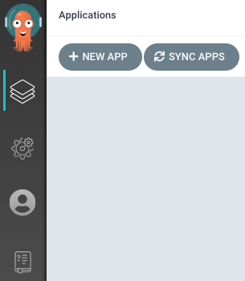

# ArgoCD 入門


原文: [Getting Started](https://argo-cd.readthedocs.io/en/stable/getting_started/)

ArgoCD 是用於 Kubernetes 的聲明式 GitOps 持續交付工具。ArgoCD 在指定的目標環境中自動部署所需的應用程序狀態。

應用程序部署可以跟踪對分支、標籤的更新，或者在 Git 提交時固定到特定版本的清單。

本教程主要完成一個 End-to-End 的學習環境來實驗與理解 GitOps 的機制與如何使用 ArgoCD 來實踐 GitOps。

## 步驟 01 - 環境安裝

### 創建 K8S 集群

執行下列命令來創建實驗 Kubernetes 集群:

```bash title="執行下列命令  >_"
k3d cluster create --api-port 6443 \
--port 8080:80@loadbalancer --port 8443:443@loadbalancer
```

### 安裝 ArgoCD

添加 ArgoCD 的 helm 存儲庫並更新本地緩存：

```bash title="執行下列命令  >_"
helm repo add argo https://argoproj.github.io/argo-helm

helm repo update
```

創建要配置的 vlaues 檔案:

```yaml title="argocd-values.yaml"
server:
  extraArgs:
  # -- Run server without TLS
  - --insecure
  ingress:
    # -- Enable an ingress resource for the Argo CD server
    enabled: true
    # -- List of ingress hosts
    ## Argo Ingress.
    ## Hostnames must be provided if Ingress is enabled.
    ## Secrets must be manually created in the namespace
    hosts: 
      - argocd.example.it
```

使用 Helm 在 `argocd` 的命名空間中部署 `argo/argo-cd` chart：

```bash title="執行下列命令  >_"
helm upgrade --install --create-namespace --namespace argocd  \
     argocd argo/argo-cd \
     --values argocd-values.yaml
```

結果:

```
Release "argocd" does not exist. Installing it now.
NAME: argocd
LAST DEPLOYED: Sun Jan  1 09:28:53 2023
NAMESPACE: argocd
STATUS: deployed
REVISION: 1
TEST SUITE: None
NOTES:
In order to access the server UI you have the following options:

1. kubectl port-forward service/argocd-server -n argocd 8080:443

    and then open the browser on http://localhost:8080 and accept the certificate

2. enable ingress in the values file `server.ingress.enabled` and either
      - Add the annotation for ssl passthrough: https://argo-cd.readthedocs.io/en/stable/operator-manual/ingress/#option-1-ssl-passthrough
      - Set the `configs.params."server.insecure"` in the values file and terminate SSL at your ingress: https://argo-cd.readthedocs.io/en/stable/operator-manual/ingress/#option-2-multiple-ingress-objects-and-hosts


After reaching the UI the first time you can login with username: admin and the random password generated during the installation. You can find the password by running:

kubectl -n argocd get secret argocd-initial-admin-secret -o jsonpath="{.data.password}" | base64 -d

(You should delete the initial secret afterwards as suggested by the Getting Started Guide: https://argo-cd.readthedocs.io/en/stable/getting_started/#4-login-using-the-cli)
```

檢查通過 Helm chart 所創建的 `Service` 與 `Ingress`:

```bash title="執行下列命令  >_"
$ kubectl get service/argocd-server -n argocd

NAME            TYPE        CLUSTER-IP     EXTERNAL-IP   PORT(S)          AGE
argocd-server   ClusterIP   10.43.85.176   <none>        80/TCP,443/TCP   23m
```

!!! info
    `argocd-server` 是 ArgoCD 三大組件之一 "[API Server](https://erhwenkuo.github.io/argocd/concepts/what-is-argocd/#api-server)"。
    API Server 是一個 gRPC/REST 服務器，它公開 Web UI、CLI 和 CI/CD 系統使用的 API。


檢查通過 Helm chart 所創建的 `Ingress`:

```bash title="執行下列命令  >_"
$ kubectl get ing -n argocd

NAME            CLASS    HOSTS               ADDRESS      PORTS   AGE
argocd-server   <none>   argocd.example.it   172.21.0.2   80      21m
```

!!! tip
    查看 `Ingress` 物件所顯示的 **ADDRESS** 欄位可作為 ingress 是否正確配置的基本檢驗項目。

檢查 `Ingress` 的詳細設定:

```bash  title="執行下列命令  >_" hl_lines="24 37"
$ kubectl get ing/argocd-server -n argocd -o yaml

apiVersion: networking.k8s.io/v1
kind: Ingress
metadata:
  annotations:
    meta.helm.sh/release-name: argocd
    meta.helm.sh/release-namespace: argocd
  creationTimestamp: "2023-01-01T01:28:54Z"
  generation: 1
  labels:
    app.kubernetes.io/component: server
    app.kubernetes.io/instance: argocd
    app.kubernetes.io/managed-by: Helm
    app.kubernetes.io/name: argocd-server
    app.kubernetes.io/part-of: argocd
    helm.sh/chart: argo-cd-5.16.13
  name: argocd-server
  namespace: argocd
  resourceVersion: "754"
  uid: 080a6af3-97aa-413d-9b26-4b6f4c5585a0
spec:
  rules:
  - host: argocd.example.it
    http:
      paths:
      - backend:
          service:
            name: argocd-server
            port:
              number: 80
        path: /
        pathType: Prefix
status:
  loadBalancer:
    ingress:
    - ip: 172.21.0.2
```

在 `Linux` 中修改 `/etc/hosts` 來增加一個 entry 來模擬 DNS 的名稱解析:

```bash title="執行下列命令  >_"
# 1.選擇使用本機的 127.0.0.1 作為南北向的進入點
127.0.0.1   argocd.example.it

## 或是

# 2.選擇 docker network 的虛擬網絡的 IP 作為南北向的進入點
172.21.0.2
```

本教程使用選擇 docker network 的虛擬網絡的 IP 作為南北向的進入點, 這個設定也會比較趨向真實環境的作法。

!!! tip
    每個人的本機的 docker network 的虛擬網絡的 IP 都會不同，請特別注意本機的 Ingress Controller 所配置出來的 IP。

**接到 ArgoCD Web UI:**

ArgoCD Web UI 可通過以下命令通過端口轉發訪問：

```bash title="執行下列命令  >_"
kubectl port-forward service/argocd-server -n argocd 8080:80
```

打開瀏覽器並使用 `http://localhost:8080` 來訪問: 


或是使用己經配置好的 `Ingress` 的 DNS 名 "http://argocd.example.it" 來訪問:


使用下列的命令來取得 argocd 初始化的密碼:

```bash title="執行下列命令  >_"
kubectl -n argocd get secret argocd-initial-admin-secret -o jsonpath="{.data.password}" | base64 -d
```

結果:

```
KiBRkRajTC2x6iJO
```

!!! tip
    這個密碼是 ArgoCD 在安裝時動態生成, 每次都會不同。

打開瀏覽器並轉到 http://localhost:8080 並填寫用戶名 `admin` 與前一個命令所取得的密碼。


成功登入後可看到:


### 下載 Argo CD CLI

下載 ArgoCD command line tools

```bash title="執行下列命令  >_"
wget https://github.com/argoproj/argo-cd/releases/download/v2.5.5/argocd-linux-amd64

sudo install -m 555 argocd-linux-amd64 /usr/local/bin/argocd

rm argocd-linux-amd64
```

您現在應該能夠運行 `argocd` 命令。

### 訪問 Argo CD API 服務器

默認情況下，Argo CD API 服務器不會暴露在外部 IP 中。要訪問 API 服務器，請選擇以下技術之一來公開 Argo CD API 服務器：

#### Service Type Load Balancer

將 `argocd-server` 服務類型更改為 `LoadBalancer`：

```bash title="執行下列命令  >_"
kubectl patch svc argocd-server -n argocd -p '{"spec": {"type": "LoadBalancer"}}'
```

#### Ingress

按照 [ingress 文檔](https://argo-cd.readthedocs.io/en/stable/operator-manual/ingress/) 了解如何使用 `ingress` 來配置 Argo CD。

#### Port Forwarding

Kubectl 端口轉發也可用於連接到 API 服務器而不暴露服務。

```bash title="執行下列命令  >_"
kubectl port-forward svc/argocd-server -n argocd 8080:443
```

然後可以使用 `https://localhost:8080` 來訪問 ArgoCD 的 API 服務器。

### 使用 CLI 登錄

管理員帳戶的初始密碼是自動生成的，並以明文形式存儲在 Argo CD 安裝命名空間中名為 `argocd-initial-admin-secret` 的密碼字段中。您可以使用 `kubectl` 簡單地檢索此密碼：

```bash title="執行下列命令  >_"
kubectl -n argocd get secret argocd-initial-admin-secret -o jsonpath="{.data.password}" | base64 -d; echo
```

使用上面的用戶名 admin 和密碼，登錄到 Argo CD 的 IP 或主機名：

```bash title="執行下列命令  >_"
$ argocd login localhost:8080

WARNING: server certificate had error: x509: certificate signed by unknown authority. Proceed insecurely (y/n)? y
Username: admin
Password: 
'admin:login' logged in successfully
Context 'localhost:8080' updated
```

使用以下命令更改密碼：

```bash title="執行下列命令  >_"
argocd account update-password
```

## 步驟 02 - GitOps 範例佈署

### 從 Git 存儲庫佈署應用程序


GitOps 的起手式就是把應用程序的佈署 Manifests 使用 git repo 來進行管控。接下來我們使用一個包含留言簿應用程序的示例存儲庫，用來演示 Argo CD 的工作原理。

- 示例 git 存儲庫: `https://github.com/argoproj/argocd-example-apps.git` 


=== "通過 CLI 創建 Application"

    首先，我們需要將當前命名空間設置為運行以下命令的 argocd：

    ```bash title="執行下列命令  >_"
    kubectl config set-context --current --namespace=argocd
    ```

    使用以下命令創建示例留言簿應用程序：

    ```bash title="執行下列命令  >_"
    argocd app create guestbook --repo https://github.com/argoproj/argocd-example-apps.git \
      --path guestbook --dest-server https://kubernetes.default.svc --dest-namespace default
    ```

=== "通過 UI 創建 Application"

    打開瀏覽器訪問 Argo CD 外部 UI，並通過在瀏覽器中訪問 IP/主機名並使用在第 4 步中設置的憑據登錄。

    登錄後點擊 **+New App** 按鈕，如下圖：

    

    為Application Name 設成 `guestbook`，Project 設成 `default`，並將同步策略保留為 `Manual`：

    

    通過將存儲庫 url 設置為 github 存儲庫 url，將 `https://github.com/argoproj/argocd-example-apps.git` 存儲庫連接到 Argo CD，將修訂保留為 `HEAD`，並設置路徑為 `guestbook`：

    

    對於 Destination，將集群 URL 設置為 `https://kubernetes.default.svc`（或集群名稱為 `in-cluster`），將命名空間設置為 `default`：

    

    填寫完以上信息後，點擊 UI 上方的 `Create` 創建 guestbook 應用：

    

### 同步（部署）應用程序

=== "通過 CLI 同步"

    創建 guestbook 應用程序後，您現在可以查看其狀態：

    ```bash title="執行下列命令  >_"
    $ argocd app get guestbook
    Name:               argocd/guestbook
    Project:            default
    Server:             https://kubernetes.default.svc
    Namespace:          default
    URL:                https://localhost:8080/applications/guestbook
    Repo:               https://github.com/argoproj/argocd-example-apps.git
    Target:             HEAD
    Path:               guestbook
    SyncWindow:         Sync Allowed
    Sync Policy:        <none>
    Sync Status:        OutOfSync from HEAD (53e28ff)
    Health Status:      Missing

    GROUP  KIND        NAMESPACE  NAME          STATUS     HEALTH   HOOK  MESSAGE
          Service     default    guestbook-ui  OutOfSync  Missing        
    apps   Deployment  default    guestbook-ui  OutOfSync  Missing 
    ```

    由於應用尚未部署，且尚未創建 Kubernetes 資源，因此應用狀態最初處於 `OutOfSync` 狀態。要同步（部署）應用程序，請運行：

    ```bash title="執行下列命令  >_"
    argocd app sync guestbook
    ```

    結果:

    ```bash title="執行下列命令  >_"
    TIMESTAMP                  GROUP        KIND   NAMESPACE                  NAME    STATUS    HEALTH        HOOK  MESSAGE
    2022-12-29T06:11:43+08:00            Service     default          guestbook-ui  OutOfSync  Missing              
    2022-12-29T06:11:43+08:00   apps  Deployment     default          guestbook-ui  OutOfSync  Missing              
    2022-12-29T06:11:43+08:00            Service     default          guestbook-ui    Synced  Healthy              
    2022-12-29T06:11:43+08:00            Service     default          guestbook-ui    Synced   Healthy              service/guestbook-ui created
    2022-12-29T06:11:43+08:00   apps  Deployment     default          guestbook-ui  OutOfSync  Missing              deployment.apps/guestbook-ui created
    2022-12-29T06:11:43+08:00   apps  Deployment     default          guestbook-ui    Synced  Progressing              deployment.apps/guestbook-ui created

    Name:               argocd/guestbook
    Project:            default
    Server:             https://kubernetes.default.svc
    Namespace:          default
    URL:                https://localhost:8080/applications/guestbook
    Repo:               https://github.com/argoproj/argocd-example-apps.git
    Target:             HEAD
    Path:               guestbook
    SyncWindow:         Sync Allowed
    Sync Policy:        <none>
    Sync Status:        Synced to HEAD (53e28ff)
    Health Status:      Progressing

    Operation:          Sync
    Sync Revision:      53e28ff20cc530b9ada2173fbbd64d48338583ba
    Phase:              Succeeded
    Start:              2022-12-29 06:11:43 +0800 CST
    Finished:           2022-12-29 06:11:43 +0800 CST
    Duration:           0s
    Message:            successfully synced (all tasks run)

    GROUP  KIND        NAMESPACE  NAME          STATUS  HEALTH       HOOK  MESSAGE
          Service     default    guestbook-ui  Synced  Healthy            service/guestbook-ui created
    apps   Deployment  default    guestbook-ui  Synced  Progressing        deployment.apps/guestbook-ui created
    ```

=== "通過 UI 同步"

    在 guestbook 的 Application 視窗下點擊 `SYNC` 按鈕:

    

    在左側滑出的設定中點擊 `SYNCHRONIZE` 按鈕:

    


上述的命令/動件會驅動 ArgoCD 從 git 存儲庫中檢索 manifests 並使用 `kubectl` 來應用這些 manifests 到目的地的 Kuberntes 集群。

你可經由 ArgoCD 的 Web UI 來觀察 guestbook 應用程序是否順利佈署或運行狀態:


點擊 guestbook 應用程序視窗，ArgoCD 會展現您現在可以查看其資源組件、日誌、事件和評估的運行狀況。


## 結論

Weaveworks 提出 GitOps 的概念。其中有幾個比較重要的原則：

- 整個系統必須是聲名式的
- 希望的狀態必須用 Git 做版控
- 在 Git 中獲准(appoved)的改變可以自動應用到系統上
- 軟體代理(Agent)必須確保系統正確性，如果不正確的話需要有警報通知使用者。
- 核心觀念其實就是讓你的系統具有「可觀測性」，你可以看到系統目前的狀態。並將所有對 K8S 做的操作，都透過 Git 來操作，這樣的話所有的操作過程都會是一個一個的 Commit。

通過本教程能夠基本的去理解 GitOps 的一些原則與作法，同時本教程也是後續使用 ArgoCD 來實現 GitOps 相關教程的基底。

