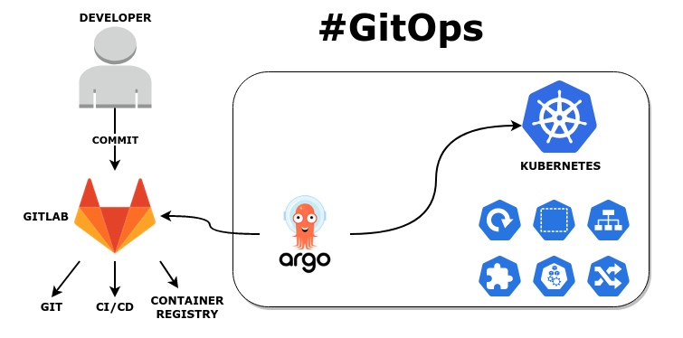

# 設定

原文: https://redhat-scholars.github.io/argocd-tutorial/argocd-tutorial/01-setup.html



## 相關需要的 CLI 工具

運行本教程中的練習需要以下 CLI 工具。在開始學習任何教程章節之前，請先安裝和配置它們。

| Tool        | Linux                          |
| ----------- | ------------------------------------ |
| `Git`             | [Download](https://git-scm.com/download/linux)  |
| `Docker`          | [Download](https://git-scm.com/download/linux)  |
| `K3D v5.4.4`      | [Download](https://k3d.io/v5.4.3/#installation)  |
| `kubectl v1.20.2` | [Download](https://storage.googleapis.com/kubernetes-release/release/v1.20.2/bin/linux/amd64/kubectl)  |
| `argocd v2.0.0`   | [Download](https://github.com/argoproj/argo-cd/releases/download/v2.0.0/argocd-linux-amd64)  |
| `kustomize v4.1.2`| [Download](https://github.com/kubernetes-sigs/kustomize/releases/download/kustomize%2Fv4.1.2/kustomize_v4.1.2_linux_amd64.tar.gz)  |

以下 CLI 工具對於運行本教程中的練習是可選的。儘管在教程中使用了它們，但您可以毫無問題地使用其他的。

## 取得教程資源

在開始設置環境之前，讓我們 clone 教程源碼並將 `TUTORIAL_HOME` 環境變量設置為指向教程的根目錄：

```bash
$ git clone https://github.com/redhat-scholars/argocd-tutorial.git gitops

$ export TUTORIAL_HOME="$(pwd)/gitops"

$ cd $TUTORIAL_HOME
```

## 設置 Kubernetes 集群

在此教程中，我們將部署 argocd 並使其可通過 `ingress` 來訪問。因此，我們必須以某種方式創建 Kubernetes 集群，使內部端口 80（traefik ingress controller 正在監聽的地方）暴露在主機系統上。

```bash
$ k3d cluster create [Cluster Name] -p "8081:80@loadbalancer"
```

!!! info
    `-p "8081:80@loadbalancer"` 意味著：
    
    - “將主機的 8081 端口映射至 `loadbalancer` 容器上的 `80` 端口

接著讓我們在 Kubernetes 上安裝 ArgoCD。

## ArgoCD 安裝

安裝 ArgoCD 並檢查 `argocd` 命名空間中的每個 pod 是否正常運行：

```bash
$ kubectl create namespace argocd
$ kubectl apply -n argocd -f https://raw.githubusercontent.com/argoproj/argo-cd/stable/manifests/install.yaml
```

結果:

```bash
customresourcedefinition.apiextensions.k8s.io/applications.argoproj.io created
customresourcedefinition.apiextensions.k8s.io/applicationsets.argoproj.io created
customresourcedefinition.apiextensions.k8s.io/appprojects.argoproj.io created
serviceaccount/argocd-application-controller created
serviceaccount/argocd-applicationset-controller created
serviceaccount/argocd-dex-server created
serviceaccount/argocd-notifications-controller created
serviceaccount/argocd-redis created
serviceaccount/argocd-repo-server created
serviceaccount/argocd-server created
role.rbac.authorization.k8s.io/argocd-application-controller created
role.rbac.authorization.k8s.io/argocd-applicationset-controller created
role.rbac.authorization.k8s.io/argocd-dex-server created
role.rbac.authorization.k8s.io/argocd-notifications-controller created
role.rbac.authorization.k8s.io/argocd-server created
clusterrole.rbac.authorization.k8s.io/argocd-application-controller created
clusterrole.rbac.authorization.k8s.io/argocd-server created
rolebinding.rbac.authorization.k8s.io/argocd-application-controller created
rolebinding.rbac.authorization.k8s.io/argocd-applicationset-controller created
rolebinding.rbac.authorization.k8s.io/argocd-dex-server created
rolebinding.rbac.authorization.k8s.io/argocd-notifications-controller created
rolebinding.rbac.authorization.k8s.io/argocd-redis created
rolebinding.rbac.authorization.k8s.io/argocd-server created
clusterrolebinding.rbac.authorization.k8s.io/argocd-application-controller created
clusterrolebinding.rbac.authorization.k8s.io/argocd-server created
configmap/argocd-cm created
configmap/argocd-cmd-params-cm created
configmap/argocd-gpg-keys-cm created
configmap/argocd-notifications-cm created
configmap/argocd-rbac-cm created
configmap/argocd-ssh-known-hosts-cm created
configmap/argocd-tls-certs-cm created
secret/argocd-notifications-secret created
secret/argocd-secret created
service/argocd-applicationset-controller created
service/argocd-dex-server created
service/argocd-metrics created
service/argocd-notifications-controller-metrics created
service/argocd-redis created
service/argocd-repo-server created
service/argocd-server created
service/argocd-server-metrics created
deployment.apps/argocd-applicationset-controller created
deployment.apps/argocd-dex-server created
deployment.apps/argocd-notifications-controller created
deployment.apps/argocd-redis created
deployment.apps/argocd-repo-server created
deployment.apps/argocd-server created
statefulset.apps/argocd-application-controller created
networkpolicy.networking.k8s.io/argocd-application-controller-network-policy created
networkpolicy.networking.k8s.io/argocd-dex-server-network-policy created
networkpolicy.networking.k8s.io/argocd-redis-network-policy created
networkpolicy.networking.k8s.io/argocd-repo-server-network-policy created
networkpolicy.networking.k8s.io/argocd-server-network-policy created
```

!!! info
    安裝 ArgoCD 組件需要幾分鐘時間，您可以使用以下命令查看狀態：
    ```bash
    watch kubectl get pods -n argocd
    ```
    你可以使用 ++ctrl+c++ 來終止 `watch`

成功部署 ArgoCD 將顯示以下 pod：

```bash
NAME                                  READY   STATUS    RESTARTS   AGE
argocd-application-controller-0       1/1     Running   0          2m18s
argocd-dex-server-5dd657bd9-2r24r     1/1     Running   0          2m19s
argocd-redis-759b6bc7f4-bnljg         1/1     Running   0          2m19s
argocd-repo-server-6c495f858f-p5267   1/1     Running   0          2m18s
argocd-server-859b4b5578-cv2qx        1/1     Running   0          2m18s
```


