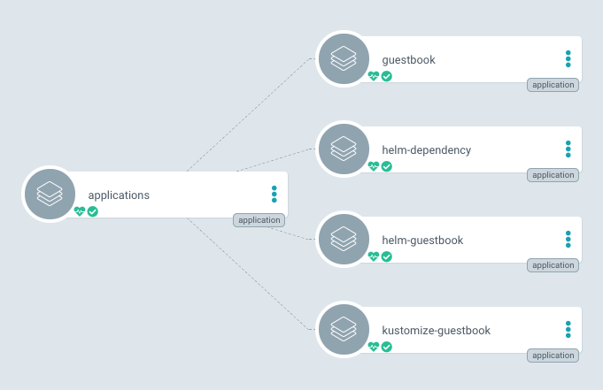
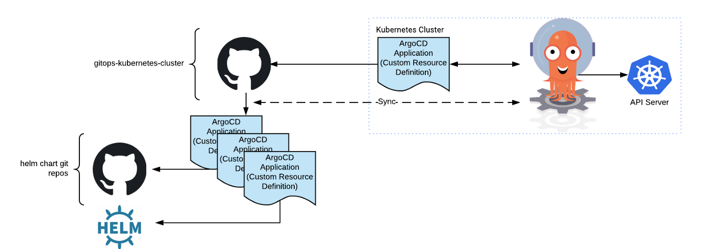
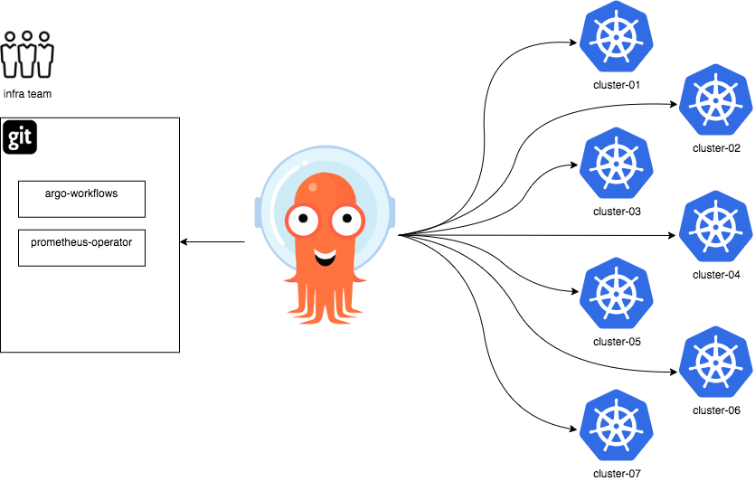
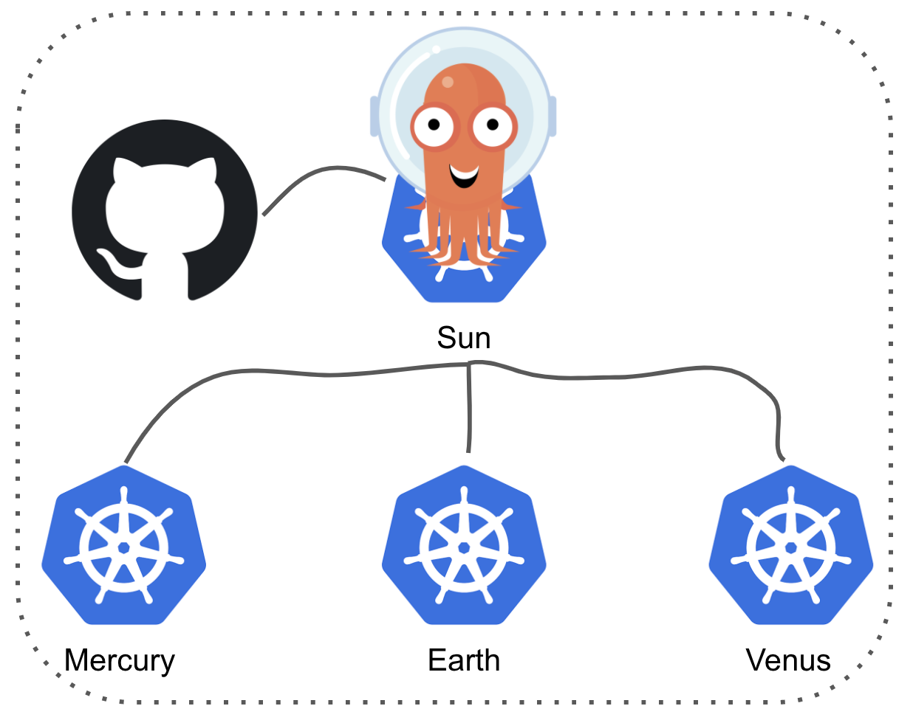
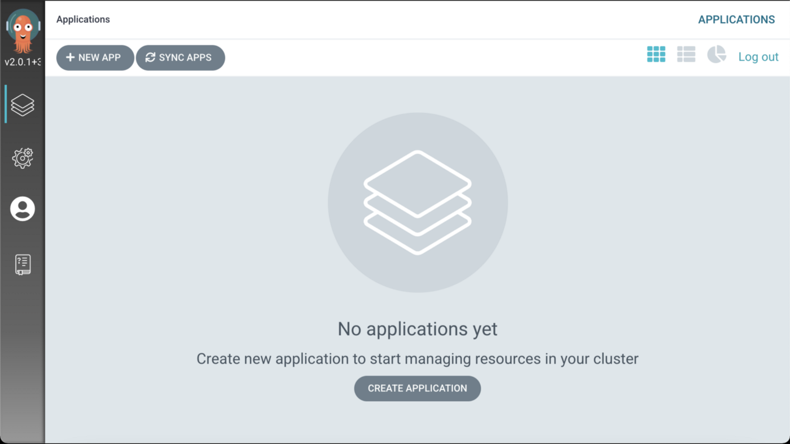
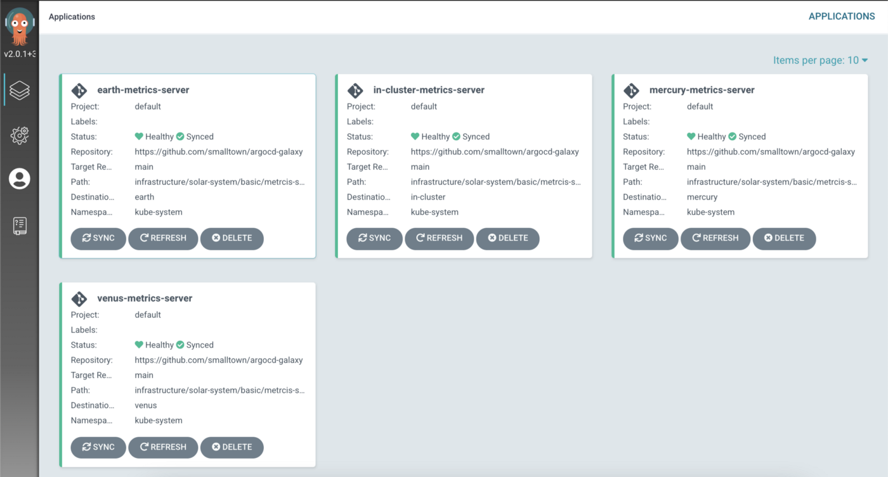
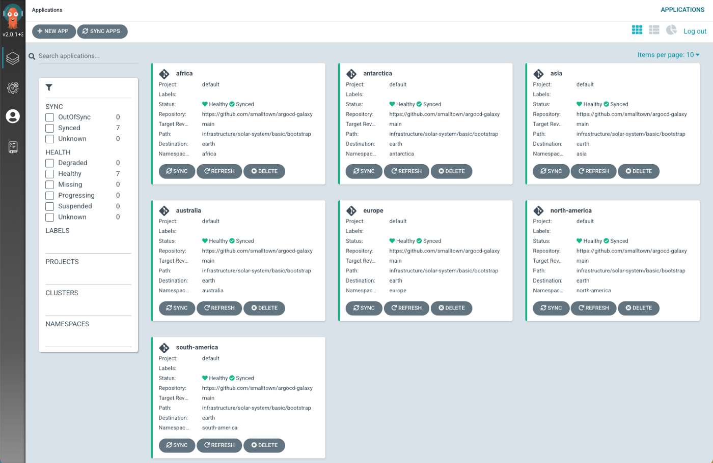
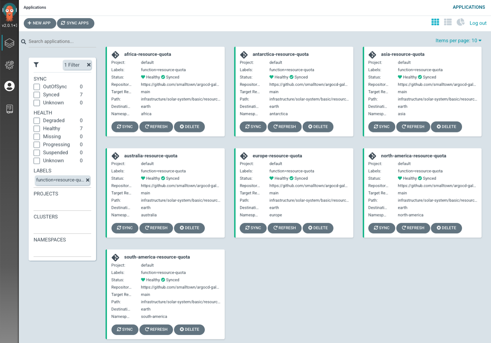
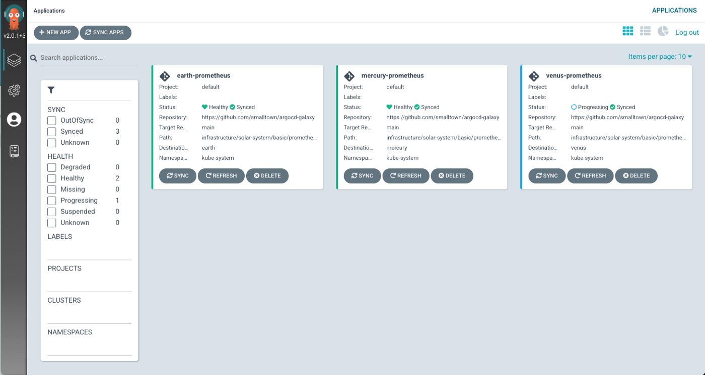
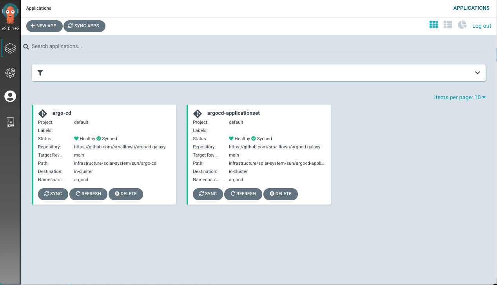

# Argo CD ApplicationSet Controller

原文: https://medium.com/starbugs/argo-cd-applicationset-controller-%E4%B8%96%E7%95%8C%E7%82%BA%E6%88%91%E8%80%8C%E8%BD%89%E5%8B%95-a837f9392298


Argo CD 在 Multi-Cluster 的管理模式，必須先在 Primary Cluster 安裝 Argo CD，然後再透過這個 Primary Cluster 去管理其他的 Cluster，屬於 Primary 與 Secondary 的架構，因此必須要讓 Primary Cluster 有權限去存取 Secondary Cluster, 彼此之間的網路當然就要打通。



Argo CD 中有一個用來 Bootstrap Cluster 的 [App of Apps Pattern](https://argoproj.github.io/argo-cd/operator-manual/cluster-bootstrapping/) 無法在 Primary & Secondary 的架構下輕易地使用，因為其中會用到 Argo CD 內才有的 Application CRD，可是 Secondary Cluster 並沒有安裝 Argo CD，這樣一來被管理的 Secondary Cluster 也想要一次安裝好所有套件要如何達成呢？！Argo CD V2.0 發布的時候，推出了可以跟 Argo CD 一起搭配使用的 ApplicationSet Controller 來彌補之前功能的不足，而此篇文章主要就是來說明 Argo CD ApplicationSet Controller。

## ApplicationSet 控制器



```yaml
apiVersion: argoproj.io/v1alpha1
kind: Application
metadata:
  name: prometheus
  finalizers:
  - resources-finalizer.argocd.argoproj.io
spec:
  destination:
    server: https://kubernetes.default.svc
    namespace: default
  project: default
  source:
    path: infrastructure/solar-system/sun/prometheus
    repoURL: https://github.com/smalltown/argo-galaxy.git
    targetRevision: HEAD
  syncPolicy:
    automated:
    prune: true
    selfHeal: true
```

在 Argo CD 中最基本的元素就是 Application CRD，它定義要如何安裝一個應用在 K8s Cluster 中，以上面的 YAML 檔案當作例子，他是一個叫做 Prometheus 的 Application CRD。

- **Destination** 定義要安裝 Prometheus 到哪一座 K8s Cluster 中的的哪一個 Namespace
- **Source** 則是指安裝 Prometheus 的 Kubernetes Manifest 存放於何處
- **SyncPolicy** 則是 Agro CD 用來監控 Prometheus 在 K8s Cluster 中的真實狀態和 Source 中定義的是否相同，不同的話就可以幫忙進行同步時的規則



[Argo CD ApplicationSet Controller](https://argocd-applicationset.readthedocs.io/en/stable/) 可以說是 Application CRD 的威力加強版，它讓使用者可以在單個 YAML 檔案內像是寫程式使用 For Loop 一樣，隨使用者的需求一次性地建立大量的 Application CRD，而這個 For Loop 的功能叫做 Generator，目前推出的版本中共有四種 Generator: Cluster Generator, Git Directory Generator, Git File Generator, List Generator，底下會使用實際範例來演示這四種 Generator 如何解放 Kubernetes 維運人員的雙手與時間。

## 環境準備



為了增加一點趣味性，所以沒有使用 Alpha, Beta 和 Production 的字眼，這邊以大家居住的太陽系來當命名規則，太陽 (Sun) 就是安裝有 Argo CD 的 Primary K8s Cluster, 而其他的行星就是被 Argo CD 所管理的 Secondary K8s Cluster，地球上的七大洲就類比為 K8s Namespace，大家一起來當創世神！

根據底下的步驟將會在本地端創建 4 座 K8s Cluster (Sun, Mercury, Venus 和 Earth)，並且將 Argo CD 和 Argo CD ApplicationSet Controller 安裝在 K8s Cluster Sun, 然後把另外三座 K8s Cluster Mercury, Venus 和 Earth 註冊到 Argo CD 中被納管。

### 相關需要的 CLI 工具

運行本教程中的練習需要以下 CLI 工具。在開始學習任何教程章節之前，請先安裝和配置它們。

| Tool        | Linux                          |
| ----------- | ------------------------------------ |
| `Git`             | [Download](https://git-scm.com/download/linux)  |
| `Docker`          | [Download](https://git-scm.com/download/linux)  |
| `K3D v5.4.4`      | [Download](https://k3d.io/v5.4.3/#installation)  |
| `kubectl v1.20.2` | [Download](https://storage.googleapis.com/kubernetes-release/release/v1.20.2/bin/linux/amd64/kubectl)  |
| `argocd v2.0.0`   | [Download](https://github.com/argoproj/argo-cd/releases/download/v2.0.0/argocd-linux-amd64)  |
| `kustomize v4.1.2`| [Download](https://github.com/kubernetes-sigs/kustomize/releases/download/kustomize%2Fv4.1.2/kustomize_v4.1.2_linux_amd64.tar.gz)  |

以下 CLI 工具對於運行本教程中的練習是可選的。儘管在教程中使用了它們，但您可以毫無問題地使用其他的。

### 取得教程資源

在開始設置環境之前，讓我們 clone 教程源碼並將 `TUTORIAL_HOME` 環境變量設置為指向教程的根目錄：

```bash
# 有興趣一起手把手玩玩看的人請先把 Repository Git Clone 到本地端
$ git clone https://github.com/smalltown/argocd-galaxy.git argocd-galaxy

$ export TUTORIAL_HOME="$(pwd)/argocd-galaxy"

$ cd $TUTORIAL_HOME
```

### 設置 Kubernetes 集群

接著來建立整個太陽系 K8s Cluster！

在此教程中，我們將部署 argocd 並使其可通過 `ingress` 來訪問。因此，我們必須以某種方式創建 Kubernetes 集群，使內部端口 80（traefik ingress controller 正在監聽的地方）暴露在主機系統上。

先建立 K8s Cluster Sun 並且安裝 Argo CD 於其中

```bash
$ k3d cluster create sun --api-port 61000 -p "6180:80@loadbalancer"
```

!!! info
    `-p "8081:80@loadbalancer"` 意味著：
    
    - “將主機的 6180 端口映射至 `loadbalancer` 容器上的 `80` 端口

接著讓我們在 Kubernetes 上安裝 ArgoCD。

安裝 ArgoCD 並檢查 `argocd` 命名空間中的每個 pod 是否正常運行：

```bash
# 安裝 Argo CD
$ kubectl create namespace argocd
$ kubectl apply -n argocd -f https://raw.githubusercontent.com/argoproj/argo-cd/stable/manifests/install.yaml
```


```bash
# 確認安裝成功
$ kubectl get crd

NAME                              CREATED AT
applications.argoproj.io          2022-07-28T13:45:38Z
applicationsets.argoproj.io       2022-07-28T13:45:38Z
appprojects.argoproj.io           2022-07-28T13:45:38Z


$ kubectl get pod -n argocd

NAME                                                READY   STATUS    RESTARTS   AGE
argocd-redis-55d64cd8bf-p6mxm                       1/1     Running   0          107s
argocd-applicationset-controller-7f89dd8cc6-tl9h7   1/1     Running   0          107s
argocd-notifications-controller-54557bc8fb-868m4    1/1     Running   0          107s
argocd-application-controller-0                     1/1     Running   0          107s
argocd-dex-server-56d495844c-kk7c5                  1/1     Running   0          107s
argocd-server-67c697dcb7-vd9pt                      1/1     Running   0          107s
argocd-repo-server-6bfcfb9698-28rrl                 1/1     Running   0          107s
```

安裝完 Argo CD 之後有兩個方式可以存取，一個是透過 kubectl 使用 Port Forward 的方式，再使用 Browser 來存取 Argo CD 的 UI，另外一個則是透過 Argo CD CLI 直接跟 Argo CD 溝通，底下先示範 kubectl 的方式。


```bash
# 先取得 Argo CD admin 帳號的初始密碼
$ kubectl get -n argocd secret argocd-initial-admin-secret -o jsonpath='{.data}' | jq .password -r | base64 -d

# 透過 kubectl 進行 port forward
$ kubectl port-forward svc/argocd-server -n argocd 8443:443 --address='0.0.0.0'
```

接著打開瀏覽器拜訪 https://localhost:8443/ 輸入帳號 admin 與透過上面命令得到的初始密碼就可以登入成功，看到以下畫面



### 再建立要被 Argo CD 管理的 K8s Cluster

```bash
# 建立 K8s Cluster Mercury
$ k3d cluster create mercury --api-port 61001 -p "6280:80@loadbalancer"

# 建立 K8s Cluster Venus
$ k3d cluster create venus --api-port 61002 -p "6380:80@loadbalancer"

# 建立 K8s Cluster Earth
$ k3d cluster create earth --api-port 61003 -p "6480:80@loadbalancer"
```

### 將新建立的 K8s Cluster 跟前面安裝的 Argo CD 做註冊

```yaml
kind: Cluster
apiVersion: kind.x-k8s.io/v1alpha4
networking:
  apiServerAddress: "192.168.1.123"
  apiServerPort: 8443
```

```bash
$ argoPass=$(kubectl -n argocd get secret argocd-initial-admin-secret -o jsonpath="{.data.password}" | base64 -d)

# base port-forward setting
$ argoURL=0.0.0.0:8443

$ argocd login --insecure --grpc-web $argoURL  --username admin --password $argoPass

'admin:login' logged in successfully
Context '0.0.0.0:8443' updated

# 註冊 K8s Cluster Mercury
$ kubectl config use-context k3d-mercury
Switched to context "k3d-mercury".

$ argocd cluster add k3d-mercury --name mercury
```

## 四種類形的演示

### Cluster Generator

**應用情境**：HPA (Horizontal Pod Autoscaler) 是 K8s Cluster 被普遍使用的一個功能，為了要支援這個功能，需要在所有的 K8s Cluster 安裝 Metrics Server，可是一個一個安裝實在是有夠累人的，假如使用了 Argo CD ApplicationSet Controller 會變成如何呢？

**範例**:

```yaml title="metrics-server.yaml" hl_lines="7 8"
apiVersion: argoproj.io/v1alpha1
kind: ApplicationSet
metadata:
  name: metrics-server
  namespace: argocd
spec:
  generators:
    - clusters: {} # 使用 Argo CD 內所有的 K8s Cluster
  template:
    metadata:
      name: '{{name}}-metrics-server' # name 會置換為 Cluster 名稱
    spec:
      project: default
      syncPolicy:
        automated:
          prune: true
          selfHeal: true
      source:
        repoURL: https://github.com/smalltown/argocd-galaxy
        targetRevision: main
        path: infrastructure/solar-system/basic/metrcis-server
      destination:
        server: '{{server}}' # server 會置換為 Cluster API Endpoint
        namespace: kube-system
```

就像上面提過的，ApplicationSet 其實算是 Application 的威力加強版，可以發現主要有兩個不一樣的地方，1) 多了一個 `generators` 的 section 2) 在下面 template 中的定義可以使用 `name` 和 `server` 進行字串的置換，而這邊可以想像成如下的程式碼：

```bash
for cluster in argocd_clusters:
    create_argocd_application(cluster["name"], cluster["server"])
```

所以 ApplicationSet Controller 會幫忙所有被 Argo CD 管理的 K8s Cluster 新增 Metrics Server Argo CD Application，維運人員就不再需要單獨為每一座 Cluster 新增；除了像上面的 generator 使用 {} 來代表所有被 Argo CD 所管理的 K8s Cluster 之外；也可以使用 Label Selector，讓 Application 只建立在特定的 K8s Cluster 上。

**執行結果**:

將 Metrics Server 的 ApplicationSet CRD 建立之後，打開瀏覽器查看 Argo CD UI 就可以馬上看到 Metrics Server 一瞬間被自動安裝在 4 座 Cluster 上，不再需要煩惱有沒有哪一座 Cluster 還沒有安裝到。

```bash
# 建立 metrics server Argo CD ApplicationSet CRD
$ kubectl apply -f applications/solar-system/basic/metrics-server.yaml
```



### Git Directory Generator

**應用情境**: 每次要建立新的 MicroService 時，一定需要先建立 NameSpace，然後在該 NameSpace 新增一些 ConfigMap 以及 Secret 給新的 MicroService 使用，這次接到的工作是要在 K8s Cluster Earth 新增 7 個 NameSpace，每次都要做一樣的事情真的是很乏味。

**範例**:

```yaml title="bootstrap.yaml" hl_lines="7-12"
apiVersion: argoproj.io/v1alpha1
kind: ApplicationSet
metadata:
  name: earch-bootstrap
  namespace: argocd
spec:
  generators:
  - git:
      repoURL: https://github.com/smalltown/argocd-galaxy
      revision: main
      directories:
      - path: infrastructure/solar-system/earth/continents/*
  template:
    metadata:
      name: '{{path.basename}}' # 此字串會置換成 Sub-Folder 名稱
    spec:
      project: default
      syncPolicy:
        automated:
          prune: true
          selfHeal: true
      source:
        repoURL: https://github.com/smalltown/argocd-galaxy
        targetRevision: main
        path: infrastructure/solar-system/basic/bootstrap
     destination:
       server: https://#{IP_ADDRESS}:61003 # 這邊要自己換成本地 IP
       namespace: '{{path.basename}}' # 此字串會置換成 Sub-Folder 名稱
```

這邊使用的 Generator 為 `Git Directory`，定義要去哪一個 Git Repository 查看其資料夾結構，例如在這裡會去查看在 Earth 的 Continents Folder 底下存在的 Sub-Folder，根據這些 Sub-Folder 的資料夾名稱來建立 Argo CD Application，像這邊有七個 Sub-Folder 所以就會建立出七個 Argo CD Application。

**執行結果**:

建立完 Argo CD ApplicationSet Bootstrap 之後，可以看到 Argo CD UI Console 自動多了 7 個 Application 出來，而這 7 個 Application 會根據當初 Source 中定義的 K8s Manifest 將對應的 K8s Resource自動建立完成 (這邊只有簡單建立 NameSpace, 真實情況可以根據需求增加更多的 K8s Resource)；所以假如今天又多一個 MicroService 時，只需要新增一個資料夾，並且提交到 Git Repository 中，Argo CD ApplicationSet Controller 就會自動多新增一個 Application。

```bash
# 建立 earth bootstrap Argo CD ApplicationSet CRD
$ kubectl apply -f applications/solar-system/earth/basic/bootstrap.yaml

# 使用 kubectl 驗證 K8s Cluster Earth
$ kubectl get namespaces
NAME                 STATUS   AGE
africa               Active   7m17s
antarctica           Active   7m17s
asia                 Active   7m17s
australia            Active   7m17s
default              Active   11m
europe               Active   7m17s
kube-node-lease      Active   11m
kube-public          Active   11m
kube-system          Active   11m
local-path-storage   Active   11m
north-america        Active   7m17s
south-america        Active   7m17s
```



### Git File Generator

**應用情境**: 今天想要將 K8s Cluster Earth 被 MicroService 使用到的 NameSpace 都加上 Resource Quota，但是每個 NameSpace 底下的設定不太一樣，例如有的是要運行 CPU-Bound 應用服務，有的則是 Memory-Bound 應用服務，該如何是好呢？

**範例**:

```yaml title="resourcequota.yaml" hl_lines="7-12"
apiVersion: argoproj.io/v1alpha1
kind: ApplicationSet
metadata:
  name: resource-quota
  namespace: argocd
spec:
  generators:
  - git:
      repoURL: https://github.com/smalltown/argocd-galaxy
      revision: main
      files:
      - path: "infrastructure/solar-system/earth/continents/**/**/config.json"
  template:
    metadata:
      name: '{{destination.namespace}}-resource-quota'
      labels:
        function: resource-quota
    spec:
      project: '{{project}}'
      syncPolicy:
        automated:
        prune: true
        selfHeal: true
    source:
      repoURL: '{{source.repoURL}}'
      targetRevision: '{{source.targetRevision}}'
      path: '{{source.path}}'
    destination:
      server: https://#{IP_ADDRESS}:61003 # 這邊要自己換成本地 IP
      namespace: '{{destination.namespace}}'
```

上面使用的 Git Directory Generator，是利用 Sub-Folder 的名稱來建立對應的 Argo CD Application，除此之外 Application CRD 裡面的設定都是差不多的；但這邊使用的 Git File Generator 讓每個 Application Template 裡面的 Source, SyncPolicy, Project 或是 Destination 都可以使用變數置換。

```json title="config.json"
{
  "project": "default",
  "source": {
    "repoURL": "https://github.com/smalltown/argocd-galaxy",
    "targetRevision": "main",
    "path": "infrastructure/solar-system/basic/resource-quota/cpu-bound"
  },
  "destination": {
    "namespace": "africa"
  }
}
```

可以看到 ApplicationSet Controller 所讀取的 infrastructure/solar-system/earth/continents/**/**/config.json 這個 JSON 檔案，它使用裡面定義的 Key/Value 來進行 Argo CD Application Template 的字串置換，用以達成在同一個 YAML 檔案裡產生出各種不同的 Application。

**執行結果**:

一樣先把 Argo CD ApplicationSet CRD 創建起來，接著就可以在 Argo CD UI Console 看到 K8s Cluster Earth 裡面的每個 NameSpace 都已經自動產生好 Resource Quota 的 K8s Resource，而且是根據 config.json 裡面定義的 Key/Value 來客製化每個 Argo CD Application。

```bash
# 建立 Resource Quota Argo CD ApplicationSet CRD
$ kubectl apply -f applications/solar-system/earth/basic/resourcequota.yaml
```



### List Generator

**應用情境**: 使用 Prometheus 來監控 K8s Cluster 是再正常不過的事情了，假如今天想要在 K8s Cluster Mercury, Venus 和 Earth 裡面同時安裝的話，該如何使用 Argo CD ApplicationSet Controller 來達成呢？

**範例**:

```yaml title="prometheus.yaml" hl_lines="7-15"
apiVersion: argoproj.io/v1alpha1
kind: ApplicationSet
metadata:
  name: prometheus
  namespace: argocd
spec:
  generators:
  - list:
      elements:
      - cluster: mercury
        url: https://#{IP_ADDRESS}:61001 # 這邊要自己換成本地 IP
      - cluster: venus
        url: https://#{IP_ADDRESS}:61002 # 這邊要自己換成本地 IP
      - cluster: earth
        url: https://#{IP_ADDRESS}:61003 # 這邊要自己換成本地 IP
  template:
    metadata:
      name: '{{cluster}}-prometheus'
    spec:
      project: default
      syncPolicy:
        automated:
        prune: true
        selfHeal: true
      source:
        repoURL: https://github.com/smalltown/argocd-galaxy
        targetRevision: main
        path: infrastructure/solar-system/basic/prometheus
      destination:
        server: '{{url}}'
        namespace: kube-system
```

最後一個 List Generator 老實說跟 Cluster Generator 功能差不多，在最前面 Element 中定義所要安裝 Cluster 的名稱跟 URL，下面的 Application Template 中 Destination 的 Server 就可以被自動置換。

**執行結果**:

一樣先把 Argo CD ApplicationSet CRD 創建起來，接著就可以在 Argo CD UI Console 看到三座 K8s Cluster Mercury, Venus 和 Earth 都已經安裝好 Prometheus，不過我自己會比較喜歡在 Cluster 設定好 Label，然後透過 Cluster Generator 來達到一樣的效果。

```bash
# 建立 Prometheus Argo CD ApplicationSet CRD
$ kubectl apply -f applications/solar-system/basic/prometheus.yaml
```




## 聲明式設置

上面已經把各種 ApplicationSet 的 Generator 功能演示了一次，但假如大家還有印象的話，應該還記得在一開始設定的時候，有些步驟是使用 CLI 在 Terminal 完成的，這有點違反 DevOps Everything as Code 的精神，所以在這個 Section 會來補強這個部份。

### 雞和蛋的難題


參考: [The Chicken/Egg Conundrum: How Modern Stories are Best Told](https://medium.com/the-cryptofolk-movement/the-chicken-egg-conundrum-how-modern-stories-are-best-told-d972e4b0aaab)

我們一開始在安裝 Argo CD 和 Argo CD ApplicationSet Controller 時，是直接使用 Helm CLI，所以我們在這邊把 Argo CD 的 Argo CD ApplicationSet 給補上 (好饒口)，這樣一來就連負責 Configuration Management 角色的 Argo CD 本身也將自己納入管理。

```bash
# 建立 Argo CD 的 Argo CD ApplicationSet CRD
$ kubectl apply -f applications/solar-system/sun/argo.yaml
```


我們一開始在安裝 Argo CD 和 Argo CD ApplicationSet Controller 時，是直接使用 Helm CLI，所以我們在這邊把 Argo CD 的 Argo CD ApplicationSet 給補上，這樣一來就連負責 Configuration Management 角色的 Argo CD 本身也將自己納入管理。

```bash
# 建立 Argo CD 的 Argo CD ApplicationSet CRD
$ kubectl apply -f applications/solar-system/sun/argo.yaml
```



### 註冊要控制的 K8S 集群

在註冊 Argo CD Cluster 時是使用 Argo CD CLI 達成，但其實他也只是在 K8s Cluster Sun 的 NameSpace 裡面新增一個 K8s Secret 而已，大概長得像底下這樣子，Argo CD 主要透過 Label argocd.argoproj.io/secret-type: cluster 來得知這是一個 Cluster 的連線資訊，像我自己是透過 Terraform 在建立好 K8s Cluster 的時候順便把這個 K8s Secret 產生在有安裝 Argo CD 的 Primary K8s Cluster 中，這樣一來就可以確定這一個動作是 Declarative。

```yaml hl_lines="6"
apiVersion: v1
kind: Secret
metadata:
  name: mycluster-secret
  labels:
    argocd.argoproj.io/secret-type: cluster
type: Opaque
stringData:
  name: mycluster.com
  server: https://mycluster.com
  config: |
  ...
```

還有其他更多 Argo CD 設定都可以使用 YAML 檔案來撰寫跟定義，有興趣的人可以參考官方這份 [Declarative Setup 文件](https://argoproj.github.io/argo-cd/operator-manual/declarative-setup/)。


### 存儲庫文件夾結構

Folder Structure 沒有分好壞，只要適合自己的開發團隊即可，這邊把範例使用到的資料夾結構稍微解釋一下，我將 Argo CD CRD (Application & ApplicationSet) 與 K8s Manifest 分別置於不同的資料夾內，然後再透過行星系統來做分群 ，所以太陽系一群，克卜勒90 也自成一群，裡面就是他們的行星；對應到現實場景就是 Production 環境一群，Non-Production 環境一群，每一群裡面都會有一座 Primary K8s Cluster (安裝有 Argo CD 那座)，再往下一層就是各自所管理的 Alpha-*, Beta-*, Prod-* 等 K8s Cluster，並且會希望不要將 Helm Chart 擺到這個 Repository 裡來，而是去參照在外部的 Helm Repository，用以避免團隊一起開發時的混亂局面。

```
argocd-galaxy
├── applications
│   ├── kepler-90
│   ├── ...
│   └── solar-system
│       ├── basic
│       ├── earth
│       ├── ...
│       └── sun
└── infrastructure
    ├── kepler-90
    ├── ...
    └── solar-system
        ├── basic
        ├── earth
        ├── mercury
        ├── sun
        │   ...
        └── venus
    └── solar-system
        ├── basic
        ├── earth
        ├── mercury
        ├── sun
        └── venus
```

## 結論

目前 Argo CD ApplicationSet Controller 還在很早期的階段，例如 Git File Generator 只能讀取 JSON 格式檔案，Destination 的 Server 值無法像 Application CRD 內一樣直接使用 Cluster 名稱，也還沒有 If/Else 的功能 ；不過光是目前的 Generator a.k.a. For Loop 就可以幫助維運人員省下很多寶貴的時間。

## 參考

- https://www.openshift.com/blog/getting-started-with-applicationsets
- https://argoproj.github.io/argo-cd/operator-manual/declarative-setup/
- https://argoproj.github.io/argo-cd/user-guide/application-set/
- https://github.com/argoproj/argo-cd/issues/1481