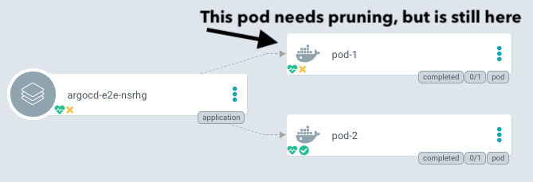
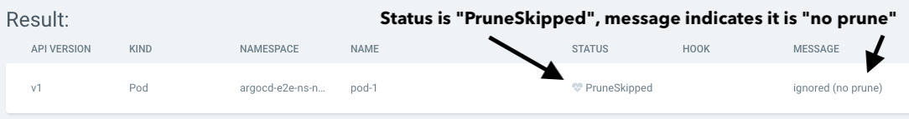

# 同步選項

原文:[Sync Options](https://argo-cd.readthedocs.io/en/stable/user-guide/sync-options/)

Argo CD 允許用戶自定義它如何在目標集群中同步所需狀態。一些同步選項可以定義為特定資源中的 `annotations`。大多數同步選項都在 `Application` 資源 `spec.syncPolicy.syncOptions` 屬性中配置。使用 `argocd.argoproj.io/sync-options` 註釋來配置的多個同步選項。

您可以在下面找到有關每個可用同步選項 (Sync Option) 的詳細信息：

## 截剪 Prune

您可能希望防止己經創建好的 K8S 物件被刪除掉 (be pruned)：

```yaml
metadata:
  annotations:
    argocd.argoproj.io/sync-options: Prune=false
```

在 UI 中，這些應刪除而未刪除的 pod 將被顯示為 `out-of-sync`:



同步狀態 (sync-status) 面板顯示修剪被跳過(pruning was skipped)，以及原因：



如果 Argo CD 期望資源被修剪，應用程序將不同步。您可能希望將其與比較選項一起使用。