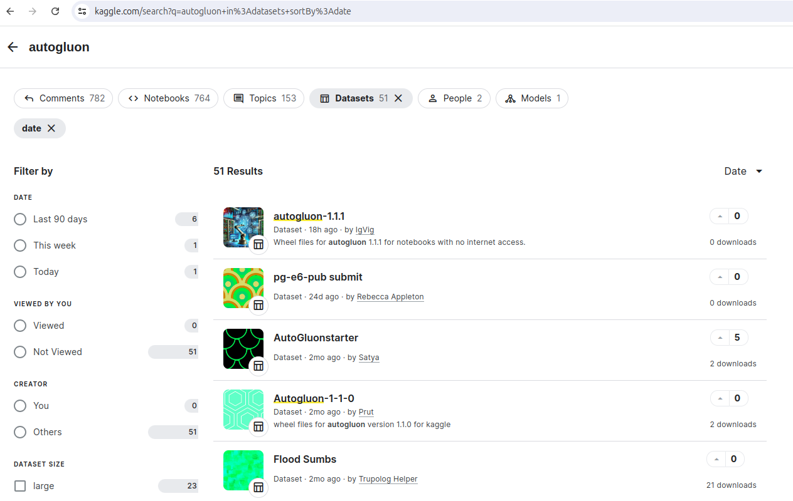

# Installing AutoGluon

!!! note
    AutoGluon 需要 Python 版本 3.8、3.9、3.10 或 3.11，並且可在 Linux、MacOS 和 Windows 上使用。

    AutoGluon 庫預先安裝在 [Amazon SageMaker Distribution](https://github.com/aws/sagemaker-distribution) 的所有版本中。有關更多信息，請參閱本頁 [Amazon SageMaker Studio](https://auto.gluon.ai/stable/install.html#dropdown-sagemaker) 中的 AutoGluon 下拉列表。

    我們建議大多數用戶透過 `pip` 安裝。 AutoGluon 的 `pip` 安裝是我們積極進行基準測試和測試的版本。 Conda 安裝可能在已安裝的依賴項中存在細微差異，這可能會影響效能和穩定性，如果您遇到 Conda 問題，我們建議您嘗試 `pip`。

=== "Linux"

    === "Pip"

        === "CPU"

            ```bash
            pip install -U pip
            pip install -U setuptools wheel

            # CPU version of pytorch has smaller footprint - see installation instructions in
            # pytorch documentation - https://pytorch.org/get-started/locally/
            pip install torch==2.3.1 torchvision==0.18.1 --index-url https://download.pytorch.org/whl/cpu

            pip install autogluon
            ```

        === "GPU"

            ```bash
            pip install -U pip
            pip install -U setuptools wheel
            pip install autogluon
            ```
    === "Conda"

        === "CPU"

            ```bash
            conda create -n ag python=3.10
            conda activate ag
            conda install -c conda-forge mamba
            mamba install -c conda-forge autogluon
            mamba install -c conda-forge "ray-tune >=2.6.3,<2.7" "ray-default >=2.6.3,<2.7"  # install ray for faster training
            ```

        === "GPU"

            ```bash
            conda create -n ag python=3.10
            conda activate ag
            conda install -c conda-forge mamba
            mamba install -c conda-forge autogluon "pytorch=*=cuda*"
            mamba install -c conda-forge "ray-tune >=2.6.3,<2.7" "ray-default >=2.6.3,<2.7"  # install ray for faster training
            ```

## 安裝特定的 AutoGluon 模組和相依項

AutoGluon 被模組化為專門用於 `tabular`, `multimodal` 或 `time series` 資料的子模組 [sub-modules](https://packaging.python.org/guides/packaging-namespace-packages/)。您可以透過以下方式僅安裝特定子模組來減少所需的依賴項數量： `pip install <submodule>`，其中 `<submodule>` 可以是以下選項之一：

- **autogluon.tabular** - 適用於表格式資料的功能（TabularPredictor）。
- **autogluon.multimodal** - 圖像、文字和多模態問題的功能。專注於深度學習模型。
- **autogluon.timeseries** - 僅適用於時間序列資料的功能（TimeSeriesPredictor）。

## Kaggle

AutoGluon 被 Kaggle 社群積極使用。您可以在[此處](https://www.kaggle.com/search?q=autogluon+in%3Anotebooks+sortBy%3Adate)找到數百個使用 AutoGluon 的 Kaggle 筆記本。

