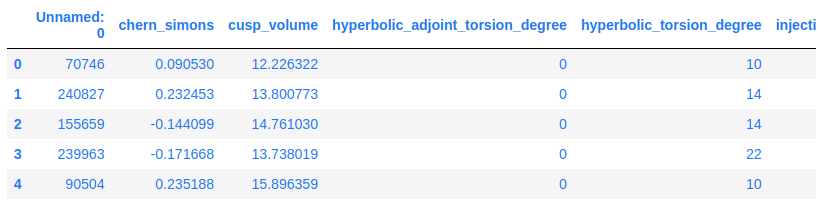
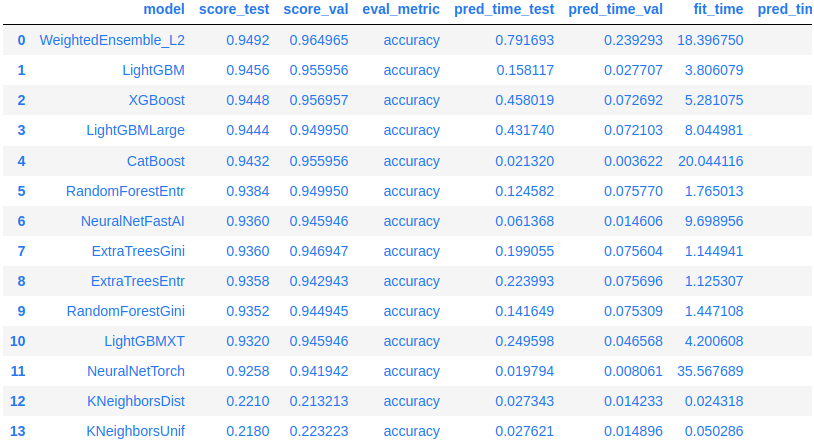

# AutoGluon Tabular - Quick Start

在本教程中，我們將了解如何使用 AutoGluon 的 `TabularPredictor` 根據 tabluar 表格資料集中的其他欄位來預測目標列的值。

首先確保安裝了 AutoGluon

```bash
!python -m pip install --upgrade pip
!python -m pip install autogluon
```

然後載入 AutoGluon 的 `TabularDataset` 和 `TabularPredictor`。我們將使用前者載入數據，使用後者訓練模型並進行預測。

```python
from autogluon.tabular import TabularDataset, TabularPredictor
```

## Example Data

在本教程中，我們將使用 [Nature 第 7887 期封面故事中的資料集：AI 引導的數學定理直覺](https://www.nature.com/articles/s41586-021-04086-x.pdf)。目標是根據結(knot)的屬性來預測結(knot)的特徵(signature)。我們從[原始資料](https://github.com/deepmind/mathematics_conjectures/blob/main/knot_theory.ipynb)中抽取了 10K 個訓練樣本和 5K 個測試樣本。採樣的資料集因資料樣本變少了使本教程運行得很快，但如果需要，AutoGluon 可以處理完整的資料集。

我們直接從 URL 載入此資料集。 AutoGluon 的 `TabularDataset` 是 pandas `DataFrame` 的子類，因此任何 `DataFrame` 方法也可以在 `TabularDataset` 上使用。

```python
data_url = 'https://raw.githubusercontent.com/mli/ag-docs/main/knot_theory/'
train_data = TabularDataset(f'{data_url}train.csv')

train_data.head()
```



我們的目標儲存在 "signature" 欄位中，該欄位有 18 個唯一整數。即使 pandas 無法正確識別這種資料類型為分類數據，AutoGluon 也會解決這個問題。

```python
label = 'signature'

train_data[label].describe()
```

結果:

```bash
count    10000.000000
mean        -0.022000
std          3.025166
min        -12.000000
25%         -2.000000
50%          0.000000
75%          2.000000
max         12.000000
Name: signature, dtype: float64
```

## Training

現在，我們透過指定標籤列名稱來建構 `TabularPredictor`，然後使用 `TabularPredictor.fit()` 在資料集上進行訓練。我們不需要指定任何其他參數。 AutoGluon 將認識到這是一個多類別分類任務，執行自動特徵工程，訓練多個模型，然後整合模型以建立最終的預測器。

```python
predictor = TabularPredictor(label=label).fit(train_data)
```

結果:

```bash
No path specified. Models will be saved in: "AutogluonModels/ag-20240716_225101"
Verbosity: 2 (Standard Logging)
=================== System Info ===================
AutoGluon Version:  1.1.1b20240716
Python Version:     3.10.13
Operating System:   Linux
Platform Machine:   x86_64
Platform Version:   #1 SMP Fri May 17 18:07:48 UTC 2024
CPU Count:          8
Memory Avail:       28.86 GB / 30.95 GB (93.3%)
Disk Space Avail:   209.36 GB / 255.99 GB (81.8%)
===================================================
No presets specified! To achieve strong results with AutoGluon, it is recommended to use the available presets.
	Recommended Presets (For more details refer to https://auto.gluon.ai/stable/tutorials/tabular/tabular-essentials.html#presets):
	presets='best_quality'   : Maximize accuracy. Default time_limit=3600.
	presets='high_quality'   : Strong accuracy with fast inference speed. Default time_limit=3600.
	presets='good_quality'   : Good accuracy with very fast inference speed. Default time_limit=3600.
	presets='medium_quality' : Fast training time, ideal for initial prototyping.
Beginning AutoGluon training ...
AutoGluon will save models to "AutogluonModels/ag-20240716_225101"
Train Data Rows:    10000
Train Data Columns: 18
Label Column:       signature
AutoGluon infers your prediction problem is: 'multiclass' (because dtype of label-column == int, but few unique label-values observed).
	First 10 (of 13) unique label values:  [-2, 0, 2, -8, 4, -4, -6, 8, 6, 10]
	If 'multiclass' is not the correct problem_type, please manually specify the problem_type parameter during Predictor init (You may specify problem_type as one of: ['binary', 'multiclass', 'regression', 'quantile'])
Problem Type:       multiclass
Preprocessing data ...
Warning: Some classes in the training set have fewer than 10 examples. AutoGluon will only keep 9 out of 13 classes for training and will not try to predict the rare classes. To keep more classes, increase the number of datapoints from these rare classes in the training data or reduce label_count_threshold.
Fraction of data from classes with at least 10 examples that will be kept for training models: 0.9984
Train Data Class Count: 9
Using Feature Generators to preprocess the data ...
Fitting AutoMLPipelineFeatureGenerator...
	Available Memory:                    29550.87 MB
	Train Data (Original)  Memory Usage: 1.37 MB (0.0% of available memory)
	Inferring data type of each feature based on column values. Set feature_metadata_in to manually specify special dtypes of the features.
	Stage 1 Generators:
		Fitting AsTypeFeatureGenerator...
			Note: Converting 5 features to boolean dtype as they only contain 2 unique values.
	Stage 2 Generators:
		Fitting FillNaFeatureGenerator...
	Stage 3 Generators:
		Fitting IdentityFeatureGenerator...
	Stage 4 Generators:
		Fitting DropUniqueFeatureGenerator...
	Stage 5 Generators:
		Fitting DropDuplicatesFeatureGenerator...
	Useless Original Features (Count: 1): ['Symmetry_D8']
		These features carry no predictive signal and should be manually investigated.
		This is typically a feature which has the same value for all rows.
		These features do not need to be present at inference time.
	Types of features in original data (raw dtype, special dtypes):
		('float', []) : 14 | ['chern_simons', 'cusp_volume', 'injectivity_radius', 'longitudinal_translation', 'meridinal_translation_imag', ...]
		('int', [])   :  3 | ['Unnamed: 0', 'hyperbolic_adjoint_torsion_degree', 'hyperbolic_torsion_degree']
	Types of features in processed data (raw dtype, special dtypes):
		('float', [])     : 9 | ['chern_simons', 'cusp_volume', 'injectivity_radius', 'longitudinal_translation', 'meridinal_translation_imag', ...]
		('int', [])       : 3 | ['Unnamed: 0', 'hyperbolic_adjoint_torsion_degree', 'hyperbolic_torsion_degree']
		('int', ['bool']) : 5 | ['Symmetry_0', 'Symmetry_D3', 'Symmetry_D4', 'Symmetry_D6', 'Symmetry_Z/2 + Z/2']
	0.1s = Fit runtime
	17 features in original data used to generate 17 features in processed data.
	Train Data (Processed) Memory Usage: 0.96 MB (0.0% of available memory)
Data preprocessing and feature engineering runtime = 0.08s ...
AutoGluon will gauge predictive performance using evaluation metric: 'accuracy'
	To change this, specify the eval_metric parameter of Predictor()
Automatically generating train/validation split with holdout_frac=0.1, Train Rows: 8985, Val Rows: 999
User-specified model hyperparameters to be fit:
{
	'NN_TORCH': {},
	'GBM': [{'extra_trees': True, 'ag_args': {'name_suffix': 'XT'}}, {}, 'GBMLarge'],
	'CAT': {},
	'XGB': {},
	'FASTAI': {},
	'RF': [{'criterion': 'gini', 'ag_args': {'name_suffix': 'Gini', 'problem_types': ['binary', 'multiclass']}}, {'criterion': 'entropy', 'ag_args': {'name_suffix': 'Entr', 'problem_types': ['binary', 'multiclass']}}, {'criterion': 'squared_error', 'ag_args': {'name_suffix': 'MSE', 'problem_types': ['regression', 'quantile']}}],
	'XT': [{'criterion': 'gini', 'ag_args': {'name_suffix': 'Gini', 'problem_types': ['binary', 'multiclass']}}, {'criterion': 'entropy', 'ag_args': {'name_suffix': 'Entr', 'problem_types': ['binary', 'multiclass']}}, {'criterion': 'squared_error', 'ag_args': {'name_suffix': 'MSE', 'problem_types': ['regression', 'quantile']}}],
	'KNN': [{'weights': 'uniform', 'ag_args': {'name_suffix': 'Unif'}}, {'weights': 'distance', 'ag_args': {'name_suffix': 'Dist'}}],
}
Fitting 13 L1 models ...
Fitting model: KNeighborsUnif ...
	0.2232	 = Validation score   (accuracy)
	0.05s	 = Training   runtime
	0.01s	 = Validation runtime
Fitting model: KNeighborsDist ...
	0.2132	 = Validation score   (accuracy)
	0.02s	 = Training   runtime
	0.01s	 = Validation runtime
Fitting model: NeuralNetFastAI ...
	0.9459	 = Validation score   (accuracy)
	9.7s	 = Training   runtime
	0.01s	 = Validation runtime
Fitting model: LightGBMXT ...
	0.9459	 = Validation score   (accuracy)
	4.2s	 = Training   runtime
	0.05s	 = Validation runtime
Fitting model: LightGBM ...
	0.956	 = Validation score   (accuracy)
	3.81s	 = Training   runtime
	0.03s	 = Validation runtime
Fitting model: RandomForestGini ...
	0.9449	 = Validation score   (accuracy)
	1.45s	 = Training   runtime
	0.08s	 = Validation runtime
Fitting model: RandomForestEntr ...
	0.9499	 = Validation score   (accuracy)
	1.77s	 = Training   runtime
	0.08s	 = Validation runtime
Fitting model: CatBoost ...
	0.956	 = Validation score   (accuracy)
	20.04s	 = Training   runtime
	0.0s	 = Validation runtime
Fitting model: ExtraTreesGini ...
	0.9469	 = Validation score   (accuracy)
	1.14s	 = Training   runtime
	0.08s	 = Validation runtime
Fitting model: ExtraTreesEntr ...
	0.9429	 = Validation score   (accuracy)
	1.13s	 = Training   runtime
	0.08s	 = Validation runtime
Fitting model: XGBoost ...
	0.957	 = Validation score   (accuracy)
	5.28s	 = Training   runtime
	0.07s	 = Validation runtime
Fitting model: NeuralNetTorch ...
	0.9419	 = Validation score   (accuracy)
	35.57s	 = Training   runtime
	0.01s	 = Validation runtime
Fitting model: LightGBMLarge ...
	0.9499	 = Validation score   (accuracy)
	8.04s	 = Training   runtime
	0.07s	 = Validation runtime
Fitting model: WeightedEnsemble_L2 ...
	Ensemble Weights: {'NeuralNetFastAI': 0.333, 'RandomForestEntr': 0.333, 'RandomForestGini': 0.167, 'XGBoost': 0.167}
	0.965	 = Validation score   (accuracy)
	0.2s	 = Training   runtime
	0.0s	 = Validation runtime
AutoGluon training complete, total runtime = 94.34s ... Best model: WeightedEnsemble_L2 | Estimated inference throughput: 4174.8 rows/s (999 batch size)
TabularPredictor saved. To load, use: predictor = TabularPredictor.load("AutogluonModels/ag-20240716_225101")
```

模型擬合(model fitting/model training)應該需要幾分鐘或更短的時間，這取決於您的 CPU。您可以透過指定 `time_limit` 參數來加快訓練速度。例如，`fit(..., time_limit=60)` 將在 60 秒後停止訓練。較高的時間限制通常會帶來更好的預測性能，而過低的時間限制將阻止 AutoGluon 訓練和整合一組合理的模型。

## Prediction

一旦我們有了適合訓練資料集的預測器，我們就可以載入一組單獨的資料用於預測和評估。

```python
test_data = TabularDataset(f'{data_url}test.csv')

y_pred = predictor.predict(test_data.drop(columns=[label]))

y_pred.head()
```

結果:

```bash
0   -4
1    0
2    0
3    4
4    2
Name: signature, dtype: int64
```

## Evaluation

我們可以使用 `evaluate()` 函數來評估測試資料集上的預測器，該函數測量我們的預測器對未用於擬合模型的資料的執行情況。

```python
predictor.evaluate(test_data, silent=True)
```

結果:

```bash
{'accuracy': 0.9492,
 'balanced_accuracy': 0.7476648119039666,
 'mcc': 0.9377360375954512}
```

AutoGluon 的 `TabularPredictor` 也提供了 `Leaderboard()` 函數，它允許我們評估每個單獨訓練模型在測試資料上的表現。

```python
predictor.leaderboard(test_data)
```

結果:



## Conclusion

在這個快速入門教學中，我們了解了 AutoGluon 使用 `TabularDataset` 和 `TabularPredictor` 的基本擬合和預測功能。 AutoGluon 不需要特徵工程或模型超參數調整，從而簡化了模型訓練流程。查看深入教程，了解有關 AutoGluon 的其他功能的更多信息，例如自訂訓練和預測步驟或使用自訂功能生成器、模型或指標擴展 AutoGluon。