# Forecasting Time Series - In Depth

本教學深入概述了 AutoGluon 中的時間序列預測功能。具體來說，我們將涵蓋：

- 什麼是機率時間序列預測？
- 使用附加資訊預測時間序列
- TimeSeriesPredictor 期望什麼資料格式？
- 如何評估預測的準確性？
- AutoGluon 中有哪些預測模型可用？
- TimeSeriesPredictor 提供哪些功能？
    - 帶有預設和 time_limit 的基本配置
    - 手動選擇要訓練的模型
    - 超參數調整

## 什麼是機率時間序列預測？

時間序列是按固定時間間隔進行的一系列測量。時間序列預測的主要目標是根據過去的觀察值來預測時間序列的未來值。此任務的典型範例是需求預測。例如，我們可以將某種產品的每日購買次數表示為時間序列。本例中的目標可能是根據歷史購買資料預測未來 14 天（即預測範圍）的需求。在 AutoGluon 中，`TimeSeriesPredictor` 的 `prediction_length` 參數決定預測範圍的長度。

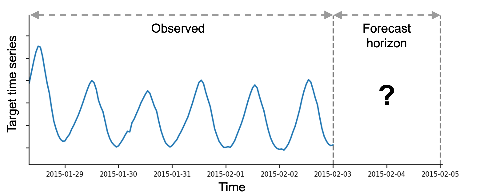

預測的目標可能是預測給定時間序列的未來值，以及建立未來值可能所在的預測區間。在 AutoGluon 中，`TimeSeriesPredictor` 產生兩種類型的預測：

- **mean forecast** 表示預測範圍內每個時間步長的時間序列的預期值。
- **quantile forecast** 表示預測分佈的分位數。例如，如果 `0.1` 分位數（也稱為 P10 或第 10 個百分位數）等於 x，則表示預測時間序列值有 10% 的時間低於 x。作為另一個範例，`0.5` 分位數 (P50) 對應於中位數預測。分位數可用於推斷可能結果的範圍。例如，根據分位數的定義，預測時間序列有 80% 的機率位於 P10 和 P90 值之間。

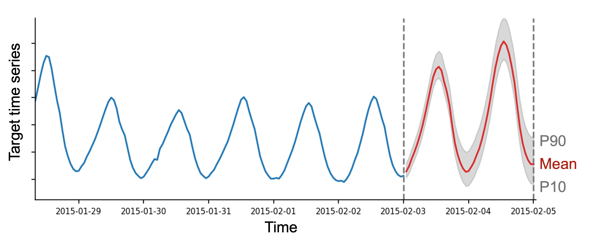

預設情況下，`TimeSeriesPredictor` 輸出分位數 [0.1, 0.2, 0.3, 0.4, 0.5, 0.6, 0.7, 0.8, 0.9]。可以使用 `quantile_levels` 參數提供自訂分位數

```python
predictor = TimeSeriesPredictor(quantile_levels=[0.05, 0.5, 0.95])
```

## 使用附加資訊預測時間序列

在現實世界的預測問題中，我們通常可以存取原始時間序列值以外的其他資訊。 AutoGluon 支援兩種類型的附加資訊：`static features` 和 `time-varying covariates`。

### Static features

靜態特徵是時間序列的與時間無關的屬性（元資料）。這些可能包括以下資訊：

- **location**, where the time series was recorded (country, state, city)
- **fixed properties of a product** (brand name, color, size, weight)
- **store ID** or **product ID**

例如，提供此資訊可以幫助預測模型為位於同一城市的商店產生類似的需求預測。

在 AutoGluon 中，靜態特徵儲存為 `TimeSeriesDataFrame` 物件的屬性。作為範例，讓我們看一下 M4 Daily 資料集。

```python
import pandas as pd

from autogluon.timeseries import TimeSeriesDataFrame, TimeSeriesPredictor
```

我們從 M4 Daily 資料集中下載 100 個時間序列的子集。

```python
df = pd.read_csv("https://autogluon.s3.amazonaws.com/datasets/timeseries/m4_daily_subset/train.csv")

df.head()
```

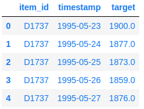

我們也載入相應的靜態特徵。在 M4 Daily 資料集中，有一個單一的分類靜態特徵，表示每個時間序列的 domain。

```python
static_features_df = pd.read_csv("https://autogluon.s3.amazonaws.com/datasets/timeseries/m4_daily_subset/metadata.csv")

static_features_df.head()
```

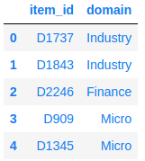

AutoGluon 期望將靜態功能作為 pandas.DataFrame 物件。 item_id 欄位指示 static_features 的每一行對應於 df 中的哪個 item（=individual time series）。

我們現在可以建立一個包含時間序列值和靜態特徵的 TimeSeriesDataFrame。

```python
train_data = TimeSeriesDataFrame.from_data_frame(
    df,
    id_column="item_id",
    timestamp_column="timestamp",
    static_features_df=static_features_df,
)

train_data.head()
```

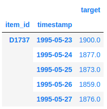

我們可以使用 .static_features 屬性來驗證 train_data 現在也包含靜態特徵

```python
train_data.static_features.head()
```

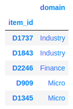

或者，我們可以透過指派 `.static_features` 屬性將靜態特徵附加到現有的 `TimeSeriesDataFrame`

```python
train_data.static_features = static_features_df
```

如果 `static_features` 不包含 train_data 中存在的某些 `item_id`，則會引發異常。

現在，當我們擬合預測器時，所有支援靜態特徵的模型將自動使用 train_data 中包含的靜態特徵。

```python
predictor = TimeSeriesPredictor(prediction_length=14).fit(train_data)
```

特別注意上述的訊息:

```bash
Provided data contains following columns:
	target: 'target'
	static_features:
		categorical:        ['domain']
		continuous (float): []
```

此訊息確認列 "domain" 被解釋為分類特徵。一般來說，AutoGluon-TimeSeries 支援兩種類型的靜態特徵：

- **categorical**: dtype 是 object 的列, string 與 category 被解釋為離散類別
- **continuous**: dtype 是 int 與 float 的列被解釋為 continuous (real-valued) 數字
- 具有其他資料類型的資料列將被忽略

要覆寫此邏輯，我們需要手動更改列的資料類型。例如，假設靜態特徵資料框包含整數值欄位 "store_id"。

```python
train_data.static_features["store_id"] = list(range(len(train_data.item_ids)))
```

預設情況下，該列將被解釋為連續數字。我們可以透過將 dtype 更改為 category 來強制 AutoGluon 將其解釋為分類特徵。

```python
train_data.static_features["store_id"] = train_data.static_features["store_id"].astype("category")
```

> Note: 如果訓練資料包含靜態特徵，則預測器將期望傳遞給 `Predictor.predict()`, `predictor.leaderboard()` 和 `Predictor.evaluate()` 的資料也包含具有相同欄位名稱和資料類型的靜態特徵。

### Time-varying covariates

協變數(covariates)是可能影響目標時間序列的時變特徵(time-varying features)。它們有時也被稱為動態特徵(dynamic features)、外生回歸因素(exogenous regressors)或相關時間序列。 AutoGluon 支援兩種類型的協變數：

- **known covariates** 整個預測範圍內已知的，例如:
    - holidays
    - day of the week, month, year
    - promotions
- **past covariates** 僅在預測範圍開始時才知道，例如:
    - sales of other products
    - temperature, precipitation
    - transformed target time series
 
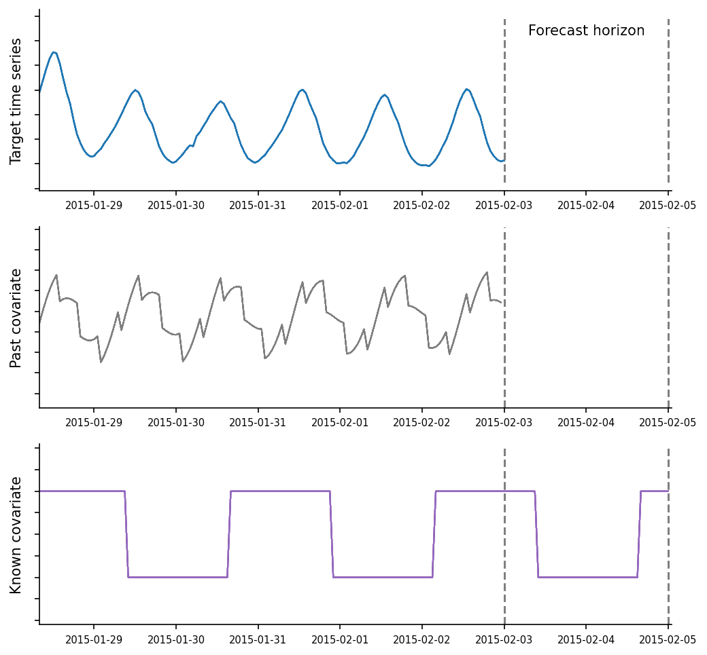

在 AutoGluon 中，`known_covariates` 和 `past_covariates` 都會作為附加欄位儲存在 `TimeSeriesDataFrame` 中。

我們將再次使用 M4 Daily 資料集作為範例並產生兩種類型的協變數：

- 一個 **past_covariate** 等於目標時間序列的對數：
- 一個 **known_covariate**，如果給定的一天是週末，則等於 1，否則等於 0。

```python
import numpy as np
train_data["log_target"] = np.log(train_data["target"])

WEEKEND_INDICES = [5, 6]
timestamps = train_data.index.get_level_values("timestamp")
train_data["weekend"] = timestamps.weekday.isin(WEEKEND_INDICES).astype(float)

train_data.head()
```

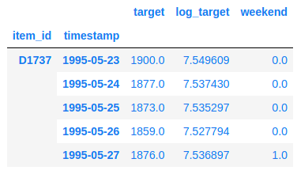

在建立 `TimeSeriesPredictor` 時，我們指定 "target" 欄位是我們的預測目標，"weekend" 列包含在預測時已知的協變數。

```python
predictor = TimeSeriesPredictor(
    prediction_length=14,
    target="target",
    known_covariates_names=["weekend"],
).fit(train_data, time_limit=600)
```

預測器將自動將其餘欄位（target 和 known covariates 除外）解釋為 past covariates。此資訊在擬合期間記錄：

```bash
Provided data contains following columns:
	target: 'target'
	known_covariates:
		categorical:        []
		continuous (float): ['weekend']
	past_covariates:
		categorical:        []
		continuous (float): ['log_target']
	static_features:
		categorical:        ['domain']
		continuous (float): []
```

最後，為了進行預測，我們產生預測範圍的已知協變量

```python
from autogluon.timeseries.utils.forecast import get_forecast_horizon_index_ts_dataframe

future_index = get_forecast_horizon_index_ts_dataframe(train_data, prediction_length=14)
future_timestamps = future_index.get_level_values("timestamp")
known_covariates = pd.DataFrame(index=future_index)
known_covariates["weekend"] = future_timestamps.weekday.isin(WEEKEND_INDICES).astype(float)

known_covariates.head()
```

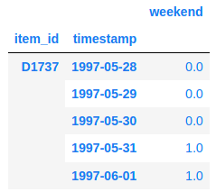

請注意，`known_covariates` 必須滿足以下條件：

- 這些欄位必須包括在 `Predictor.known_covariates_names` 中列出的所有欄位
- `item_id` 索引必須包含 `train_data` 中存在的所有 `item_id` 
- `timestamp` 索引必須包含從 `train_data` 中每個時間序列末端到未來許多時間步長的 `prediction_length` 值

如果 `known_covariates` 包含的資訊多於必要的資訊（例如，包含額外的欄位、item_ids或時間戳記），AutoGluon將自動選擇必要的行和列。

最後，我們將 `known_covariates` 傳遞給 `predict` 函數來產生預測:

```python
predictor.predict(train_data, known_covariates=known_covariates)
```

支援靜態特徵和協變數的模型清單可在 [Forecasting Model Zoo](https://auto.gluon.ai/stable/tutorials/timeseries/forecasting-model-zoo.html) 中找到。

### Holidays

`known_covariates` 的另一個流行範例是假期特徵。在本節中，我們將介紹如何將假日特徵新增至時間序列資料集中並在 AutoGluon 中使用它們。

首先，我們需要定義一個字典，以 `datetime.date` 格式的日期作為鍵，以假日名稱作為值。我們可以使用 [`holidays`](https://pypi.org/project/holidays/) Python 套件輕鬆產生這樣的字典。

```python
!pip install -q holidays
```

這裡我們使用德國假期僅用於演示目的。確保定義與您所在國家/地區相符的假日日曆！

```python
import holidays

timestamps = train_data.index.get_level_values("timestamp")
country_holidays = holidays.country_holidays(
    country="DE",  # make sure to select the correct country/region!
    # Add + 1 year to make sure that holidays are initialized for the forecast horizon
    years=range(timestamps.min().year, timestamps.max().year + 1),
)
# Convert dict to pd.Series for pretty visualization
pd.Series(country_holidays).sort_index().head()
```

結果: 

```bash
1990-10-03             German Unity Day
1990-11-21    Repentance and Prayer Day
1990-12-25                Christmas Day
1990-12-26      Second Day of Christmas
1991-01-01               New Year's Day
dtype: object
```

或者，我們可以手動定義帶有自訂假期的字典。

```python
import datetime

# must cover the full train time range + forecast horizon
custom_holidays = {
    datetime.date(1995, 1, 29): "Superbowl",
    datetime.date(1995, 11, 29): "Black Friday",
    datetime.date(1996, 1, 28): "Superbowl",
    datetime.date(1996, 11, 29): "Black Friday",
    # ... 
}
```

接下來，我們定義一個方法，將假日特徵作為列新增到 `TimeSeriesDataFrame` 中。

```python
def add_holiday_features(
    ts_df: TimeSeriesDataFrame, 
    country_holidays: dict,
    include_individual_holidays: bool = True,
    include_holiday_indicator: bool = True,
) -> TimeSeriesDataFrame:
    """Add holiday indicator columns to a TimeSeriesDataFrame."""
    ts_df = ts_df.copy()
    timestamps = ts_df.index.get_level_values("timestamp")
    country_holidays_df = pd.get_dummies(pd.Series(country_holidays)).astype(float)
    holidays_df = country_holidays_df.reindex(timestamps.date).fillna(0)
    if include_individual_holidays:
        ts_df[holidays_df.columns] = holidays_df.values
    if include_holiday_indicator:
        ts_df["Holiday"] = holidays_df.max(axis=1).values
    return ts_df
```

我們可以為所有假期創建單一指標功能。

```python
add_holiday_features(train_data, country_holidays, include_individual_holidays=False).head()
```

或用一個單獨的功能來代表每個假期。

```python
train_data_with_holidays = add_holiday_features(train_data, country_holidays)

train_data_with_holidays.head()
```

請記住在建立 `TimeSeriesPredictor` 時將假日特徵的名稱加為 `known_covariates_names`。

```python
holiday_columns = train_data_with_holidays.columns.difference(train_data.columns)

predictor = TimeSeriesPredictor(..., known_covariates_names=holiday_columns).fit(train_data_with_holidays, ...)
```

在預測時，我們需要提供未來的假期值作為 `known_covariates`。

```python
future_index = get_forecast_horizon_index_ts_dataframe(train_data, prediction_length=14)
future_timestamps = future_index.get_level_values("timestamp")
known_covariates = add_holiday_features(pd.DataFrame(index=future_index), country_holidays)
known_covariates.head()
```

```python
predictions = predictor.predict(train_data_with_holidays, known_covariates=known_covariates)
```

## TimeSeriesPredictor 期望什麼資料格式？

AutoGluon 期望訓練資料中至少有一些時間序列足夠長以產生內部驗證集。

這意味著，使用預設設定進行訓練時，`train_data` 中至少某些時間序列的長度必須 `>= max(prediction_length + 1, 5) + Prediction_length`。

```python
predictor = TimeSeriesPredictor(prediction_length=prediction_length).fit(train_data)
```

如果您使用進階配置選項，例如以下，

```python
predictor = TimeSeriesPredictor(prediction_length=prediction_length).fit(train_data, num_val_windows=num_val_windows, val_step_size=val_step_size)
```

那麼 `train_data` 中至少某些時間序列的長度必須 `>= max(prediction_length + 1, 5) + Prediction_length + (num_val_windows - 1) * val_step_size`。

請注意，資料集中的所有時間序列可以具有不同的長度。

### 處理不規則資料和缺失值

在某些應用程式中，例如金融，資料通常會帶有不規則的測量值（例如，週末或假日沒有可用的股票價格）或缺失值。

以下是具有不規則時間索引的資料集的範例：

```python
df_irregular = TimeSeriesDataFrame(
    pd.DataFrame(
        {
            "item_id": [0, 0, 0, 1, 1],
            "timestamp": ["2022-01-01", "2022-01-02", "2022-01-04", "2022-01-01", "2022-01-04"],
            "target": [1, 2, 3, 4, 5],
        }
    )
)

df_irregular
```

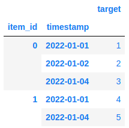

在這種情況下，您可以在使用 `freq` 參數建立預測器時指定所需的頻率。

```python
predictor = TimeSeriesPredictor(..., freq="D").fit(df_irregular)
```

這裡我們選擇 `freq="D"` 來指示填充的索引必須具有每日頻率（請參閱 [pandas 文件中的其他可能的選擇](https://pandas.pydata.org/docs/user_guide/timeseries.html#timeseries-offset-aliases)）。

AutoGluon會自動將不規則資料轉換為每日頻率並處理缺失值。

或者，我們可以使用 `TimeSeriesDataFrame.convert_Frequency()` 方法手動填入時間索引中的空白。

```python
df_regular = df_irregular.convert_frequency(freq="D")

df_regular
```

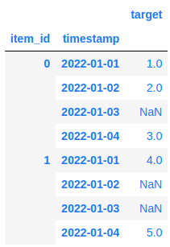

我們可以驗證索引現在是有規律的並且具有每日頻率

```python
print(f"Data has frequency '{df_regular.freq}'")
```

結果:

```bash
Data has frequency 'D'
```

現在資料包含以 `NaN` 表示的缺失值。 AutoGluon 中的大多數時間序列模型本身就可以處理缺失值，因此我們只需將資料傳遞到 `TimeSeriesPredictor` 即可。

或者，我們可以使用 `TimeSeriesDataFrame.fill_missing_values()` 以適當的策略手動填入 `NaN`。預設情況下，缺失值會採用 forward + backward filling。

```python
df_filled = df_regular.fill_missing_values()

df_filled
```

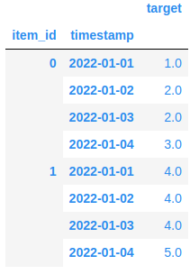

在某些應用（例如需求預測）中，缺失值可能對應於零需求。在這種情況下，恆定填充(constant fill)更合適。

```python
df_filled = df_regular.fill_missing_values(method="constant", value=0.0)

df_filled
```

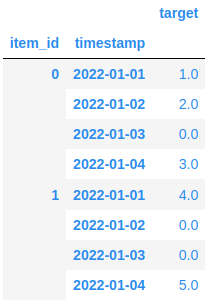

## 如何評估預測的準確性？

為了衡量 `TimeSeriesPredictor` 預測不可見時間序列的準確程度，我們需要保留一些不用於訓練的測試資料。使用 `TimeSeriesDataFrame` 的 `train_test_split` 方法可以輕鬆完成此操作：

```python
prediction_length = 48

data = TimeSeriesDataFrame.from_path("https://autogluon.s3.amazonaws.com/datasets/timeseries/m4_hourly_subset/train.csv")

train_data, test_data = data.train_test_split(prediction_length)
```

我們從原始資料中獲得了兩個 `TimeSeriesDataFrame`：

- `test_data` 包含與原始資料完全相同的資料（即，它包含歷史資料和預測範圍）
- 在 `train_data` 中，最後一個 `prediction_length` 時間步從每個時間序列的末尾刪除（即，它僅包含歷史資料）

```python
import matplotlib.pyplot as plt
import numpy as np

item_id = "H1"
fig, (ax1, ax2) = plt.subplots(nrows=2, figsize=[10, 4], sharex=True)
train_ts = train_data.loc[item_id]
test_ts = test_data.loc[item_id]
ax1.set_title("Train data (past time series values)")
ax1.plot(train_ts)
ax2.set_title("Test data (past + future time series values)")
ax2.plot(test_ts)
for ax in (ax1, ax2):
    ax.fill_between(np.array([train_ts.index[-1], test_ts.index[-1]]), test_ts.min(), test_ts.max(), color="C1", alpha=0.3, label="Forecast horizon")
plt.legend()
plt.show()
```

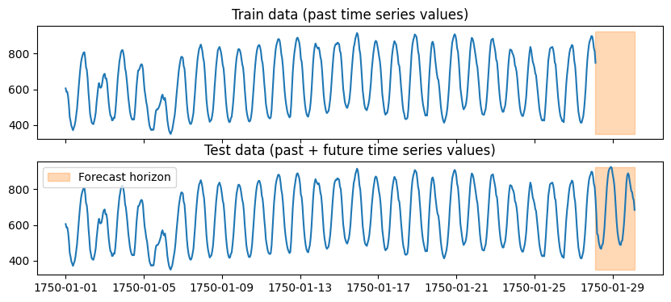

我們現在可以使用 `train_data` 來訓練預測器，並使用 `test_data` 來估計其在未見過的資料上的效能。

```python
predictor = TimeSeriesPredictor(prediction_length=prediction_length, eval_metric="MASE").fit(train_data, time_limit=120)

predictor.evaluate(test_data)
```

AutoGluon 透過測量預測模型的預測與實際觀察到的時間序列的吻合程度來評估預測模型的表現。對於 `test_data` 中的每個時間序列，預測器執行下列操作：

- 保留時間序列的最後一個 `prediction_length` 值。
- 為時間序列的保留部分（即預測範圍）產生預測。
- 使用 `eval_metric` 量化預測與時間序列實際觀察（保留）值的匹配程度。

最後，將資料集中所有時間序列的分數進行平均。

這裡的關鍵細節是，`evaluate` 始終計算每個時間序列的最後一個 `prediction_length` 時間步長的分數。每個時間序列的開頭（最後一個 `prediction_length` 時間步長除外）僅用於在預測之前初始化模型。

有關評估指標的更多詳細信息，請參閱 [Forecasting Evaluation Metrics](https://auto.gluon.ai/stable/tutorials/timeseries/forecasting-metrics.html)。

### 使用多個時間窗進行回測

我們可以使用回測(backtest)來更準確地估計表現（即評估同一時間序列產生的多個預測範圍內的表現）。這可以使用 `ExpandingWindowSplitter` 來完成。

```python
from autogluon.timeseries.splitter import ExpandingWindowSplitter

splitter = ExpandingWindowSplitter(prediction_length=prediction_length, num_val_windows=3)

for window_idx, (train_split, val_split) in enumerate(splitter.split(test_data)):
    score = predictor.evaluate(val_split)
    print(f"Window {window_idx}: score = {score}")
```

評估方法將使用每個驗證分割的最後一個預測長度時間步長作為保留集（以橙色標記）來測量預測準確性。

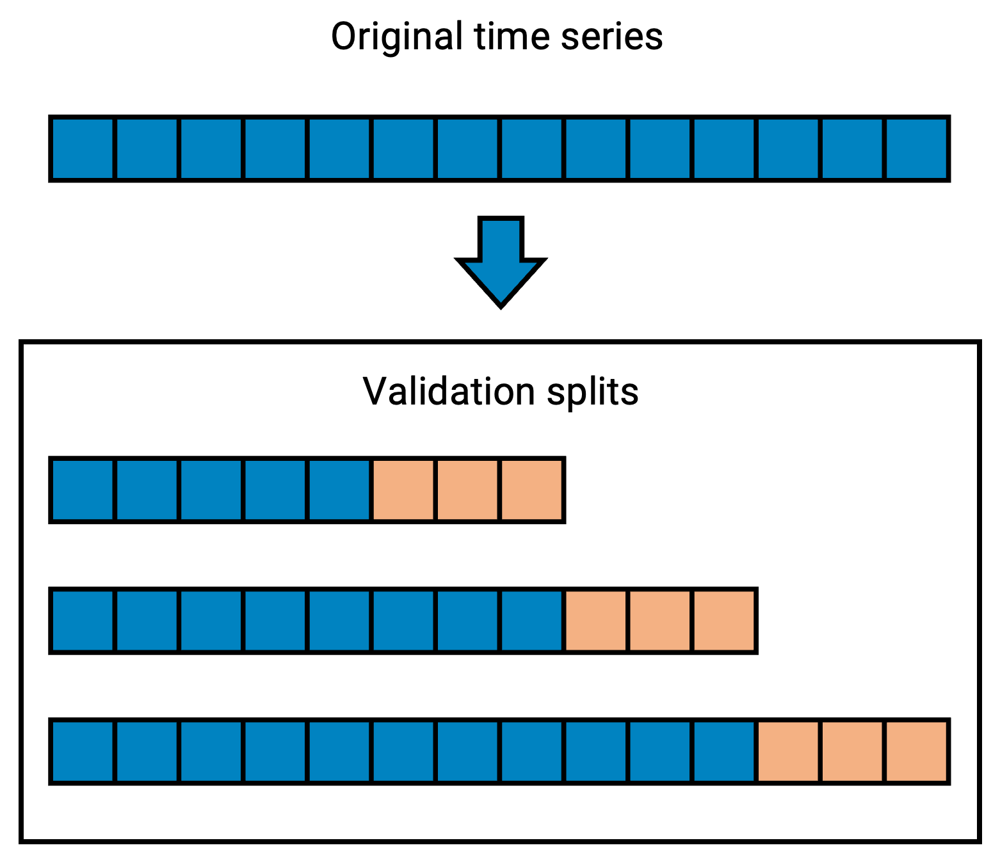

多視窗回測通常可以更準確地估計未見過的資料的預測品質。然而，這種策略減少了可用於擬合模型的訓練資料量，因此如果訓練時間序列很短，我們建議使用單一視窗回測。

### AutoGluon 如何執行驗證？

當我們使用 `Predictor.fit(train_data=train_data)` 來擬合預測器時，AutoGluon 在底層進一步將原始資料集 `train_data` 拆分為訓練部分和驗證部分。

如上所述，使用評估方法評估不同模型在驗證集上的表現。獲得最佳驗證分數的模型最終將用於預測。

預設情況下，內部驗證集包含一個窗口，其中包含每個時間序列的最後一個 `prediction_length` 時間步長。我們可以使用 `num_val_windows` 參數增加驗證視窗的數量。

```python
predictor = TimeSeriesPredictor(...)
predictor.fit(train_data, num_val_windows=3)
```

這將降低過度擬合的可能性，但會增加訓練時間約 `num_val_windows` 倍。請注意，只有當 `train_data` 中的時間序列的長度至少為 `(num_val_windows + 1) * prediction_length` 時，才能使用多個驗證視窗。

或者，使用者可以向 `fit` 方法提供自己的驗證集。在這種情況下，重要的是要記住，驗證分數是根據每個時間序列的最後一個 `prediction_length` 時間步計算的。

```python
predictor.fit(train_data=train_data, tuning_data=my_validation_dataset)
```

## AutoGluon 中有哪些預測模型可用？

AutoGluon 中的預測模型可分為三大類： `local` 模型、`globa` 模型和 `emsemble` 模型。

**Local models** 是簡單的統計模型，專門設計用於捕捉趨勢或季節性等模式。儘管它們很簡單，但這些模型通常會產生合理的預測並作為強有力的基線。可用本地模型的一些範例：

- `ETS`
- `AutoARIMA`
- `Theta`
- `SeasonalNaive`

如果資料集由多個時間序列組成，我們將為每個時間序列擬合一個單獨的局部模型 - 因此稱為 **局部(local)**。這意味著，如果我們想要對不屬於訓練集的新時間序列進行預測，所有局部(local)模型都將從頭開始適合新時間序列。

**Global models** 是機器學習演算法，它從由多個時間序列組成的整個訓練集中學習單一模型。 AutoGluon 中的大多數全域模型均由 [GluonTS](https://ts.gluon.ai/stable/) 庫提供。這些是在 PyTorch 中實現的神經網路演算法，例如：

- `DeepAR`
- `PatchTST`
- `DLinear`
- `TemporalFusionTransformer`

此類別還包括預先訓練的零樣本預測模型，例如 [Chronos](https://auto.gluon.ai/stable/tutorials/timeseries/forecasting-chronos.html)。

AutoGluon 也提供兩種 tabular global 模型 `RecursiveTabular` 和 `DirectTabular`。在底層，這些模型將預測任務轉換為迴歸問題，並使用 `TabularPredictor` 來擬合 `LightGBM` 等迴歸演算法。

最後，**ensemble models** 透過結合所有其他模型的預測來運作。預設情況下，`TimeSeriesPredictor` 始終將 `WeightedEnsemble` 擬合到其他模型之上。可以透過在呼叫 `fit` 方法時設定`enable_ensemble=False` 來停用此功能。

有關每個模型的可調超參數列表、其預設值和其他詳細信息，請參閱 [Forecasting Model Zoo](https://auto.gluon.ai/stable/tutorials/timeseries/forecasting-model-zoo.html)。

## TimeSeriesPredictor 提供哪些功能？

AutoGluon 提供了多種方法來配置 `TimeSeriesPredictor` 的行為，適合初學者和專家使用者。

### 帶有 presets 和 time_limit 的基本配置

我們可以使用 `fit` 方法的預設參數將 `TimeSeriesPredictor` 與不同的預設配置(preset)相符。

```python
predictor = TimeSeriesPredictor(...)
predictor.fit(train_data, presets="medium_quality")
```

更高品質的預設通常會帶來更好的預測，但訓練時間會更長。以下 `presets` 可用：

|Preset|Description|Use Cases|Fit Time(Ideal)|
|------|-----------|---------|---------------|
|`fast_training`|擬合簡單的統計和基線模型+快速的基於樹的模型|訓練速度快，但可能不太準確|0.5x|
|`medium_quality`|與 `fast_training` 中的模型相同 + 深度學習模型 TemporalFusionTransformer|良好的預測和合理的訓練時間|1x|
|`high_quality`|更強大的深度學習、機器學習和統計預測模型|比medium_quality準確得多，但訓練時間更長|3x|
|`best_quality`|與 high_quality 中的模型相同，更多交叉驗證窗口|通常比 high_quality 更準確，特別是對於時間序列很少（<50）的資料集|6x|

您可以在 AutoGluon 原始程式碼中找到有關 [presets](https://github.com/autogluon/autogluon/blob/stable/timeseries/src/autogluon/timeseries/configs/presets_configs.py)以及[每個 preset 中包含的模型](https://github.com/autogluon/autogluon/blob/stable/timeseries/src/autogluon/timeseries/models/presets.py#L109)的更多資訊。

控制訓練時間的另一種方法是使用 `time_limit` 參數。

```python
predictor.fit(
    train_data,
    time_limit=60 * 60,  # total training time in seconds
)
```

如果未提供 `time_limit`，預測器將進行訓練，直到所有模型都擬合為止。

### 手動配置模型

進階使用者可以覆寫預設並使用 `hyperparameters` 參數手動指定預測器應訓練哪些模型。

```python
predictor = TimeSeriesPredictor(...)

predictor.fit(
    ...
    hyperparameters={
        "DeepAR": {},
        "Theta": [
            {"decomposition_type": "additive"},
            {"seasonal_period": 1},
        ],
    }
)
```

上面的例子將訓練三個模型：

- 具有預設超參數的 `DeepAR`
- 具有加性季節性分解的 `Theta`（所有其他參數設定為預設值）
- 停用季節性的 `Theta`（所有其他參數設定為預設值）

您也可以使用 `excepted_model_type` 參數從預設中排除某些模型。

```python
predictor.fit(
...
presets="high_quality",
excluded_model_types=["AutoETS", "AutoARIMA"],
)
```

有關可用模型和相應超參數的完整列表，請參閱 [Forecasting Model Zoo](https://auto.gluon.ai/stable/tutorials/timeseries/forecasting-model-zoo.html)。

### 超參數調整

進階使用者可以定義模型超參數的搜尋空間，並讓 AutoGluon 自動決定模型的最佳配置。

```python
from autogluon.common import space

predictor = TimeSeriesPredictor()

predictor.fit(
train_data,
hyperparameters={
    "DeepAR": {
        "hidden_size": space.Int(20, 100),
        "dropout_rate": space.Categorical(0.1, 0.3),
    },
},
hyperparameter_tune_kwargs="auto",
enable_ensemble=False,
)
```

程式碼將使用 10 種不同的超參數配置來訓練多個版本的 DeepAR 模型。 AutGluon 將自動選擇獲得最高驗證分數的最佳模型配置，並將其用於預測。

目前，HPO 是基於 GluonTS 深度學習模型的 Ray Tune 以及所有其他時間序列模型的隨機搜尋。

我們可以透過將字典作為 `hyperparameter_tune_kwargs` 傳遞來更改每個模型的隨機搜尋試驗數量:

```python
predictor.fit(
...
hyperparameter_tune_kwargs={
    "num_trials": 20,
    "scheduler": "local",
    "searcher": "random",
},
...
)
```

`hyperparameter_tune_kwargs` 字典必須包含以下鍵：

- `num_trials`: int，為每個調整模型訓練的配置數量。
- `searcher`: str, 現在唯一支援的選項是 "random" (random search)。
- `scheduler`: str, 現在唯一支援的選項是 "local" (all models trained on the same machine)。