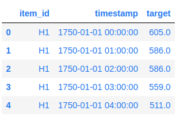
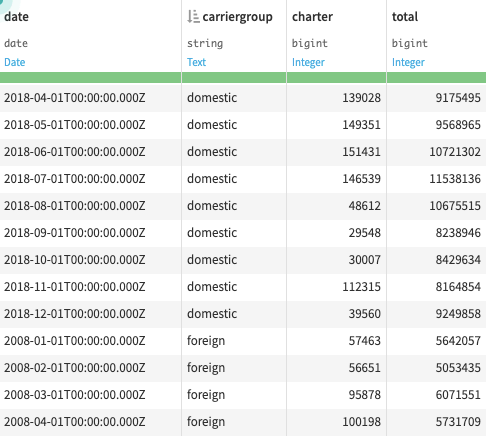
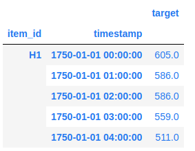
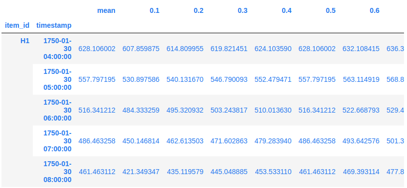
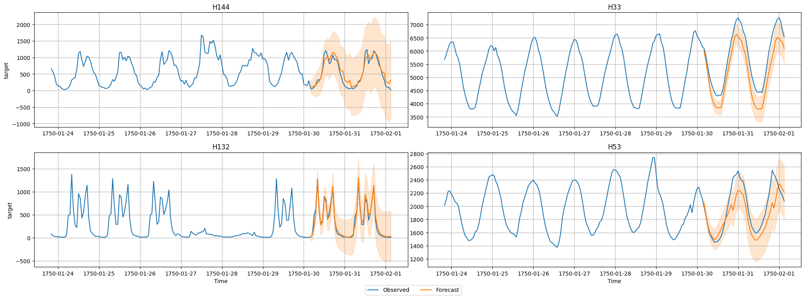
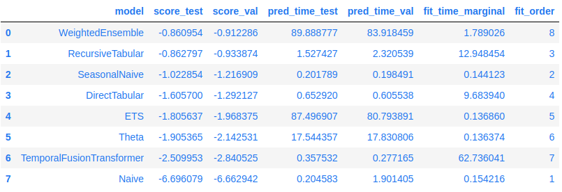

# AutoGluon Time Series - Forecasting Quick Start

在本教程中，我們將了解如何使用 AutoGluon 的 `TimeSeriesPredictor` 根據時間序列資料集來預測未來時間的值。

首先確保安裝了 AutoGluon

```bash
!python -m pip install --upgrade pip
!python -m pip install autogluon
```

然後載入 AutoGluon 的 `TimeSeriesDataFrame` 和 `TimeSeriesPredictor`。我們將使用前者載入數據，使用後者訓練模型並進行預測。

```python
import pandas as pd
from autogluon.timeseries import TimeSeriesDataFrame, TimeSeriesPredictor
```

要使用 `autogluon.timeseries`，我們只需要以下兩個類別：

- `TimeSeriesDataFrame` 儲存由多個時間序列組成的資料集。
- `TimeSeriesPredictor` 負責擬合、調整和選擇最佳預測模型，以及產生新的預測。

透過簡單的 `fit()` 調用，AutoGluon 可以訓練和調整:

- 簡單的預測模型（例如 ARIMA、ETS、Theta）
- 強大的深度學習模型（例如 DeepAR、Temporal Fusion Transformer）
- 基於樹的模型（例如 LightGBM）
- 結合了其他模型預測的集合

對單變量(univariate)時間序列資料進行多步驟(multi-step)機率預測。

## Example Data

本教學課程示範如何快速開始使用 AutoGluon 為 [M4 預測競賽資料集](https://www.sciencedirect.com/science/article/pii/S0169207019301128)產生每小時預測。

```info
    2018年，Spyros Makridakis 等人進行 M4 競賽，其中包含 10 萬個涉及更多領域的時間序列預測任務。
    - [M4 Forecasting Competition Dataset](https://www.kaggle.com/datasets/yogesh94/m4-forecasting-competition-dataset)

我們將 M4 每小時資料集的子集載入為 pandas.DataFrame:

```python
df = pd.read_csv("https://autogluon.s3.amazonaws.com/datasets/timeseries/m4_hourly_subset/train.csv")

df.head()
```



AutoGluon 需要 [long-format](https://doc.dataiku.com/dss/latest/time-series/data-formatting.html#long-format) 的時間序列資料格式。Dataframe 的每一行包含單一時間序列的單一觀察（時間步長），表示為:

- 時間序列的 unique ID (例如 "item_id"），數據型別為 `int` 或 `str`
- 觀察的時間戳記（例如 "timestamp"）作為 `pandas.Timestamp` 或相容格式
- 時間序列的數值（例如 "target"）

!!! info
    **Long format**:
    ---
    [Long format](https://doc.dataiku.com/dss/latest/time-series/data-formatting.html#long-format) 是表示多個時間序列的緊湊方式。在 long format 中，來自不同時間序列或來自相同時間序列的不同維度的值可以儲存在同一列中。長格式的資料還有一個 identifier 列，為每行中的值提供上下文。

    更常見的是，來自不同時間序列的相同變數的值儲存在同一列中。下圖顯示了 long format 的資料片段。請注意，"carriergroup" 列充當資料中每個時間序列的識別符列。

    

原始資料集應始終遵循此格式，並至少包含三列：唯一ID、時間戳記和目標值，但這些列的名稱可以是任意的。然而，重要的是，我們在建構 AutoGluon 使用的 `TimeSeriesDataFrame` 時提供列的名稱。如果資料與預期格式不匹配，AutoGluon 將引發異常。

```python
train_data = TimeSeriesDataFrame.from_data_frame(
    df,
    id_column="item_id",
    timestamp_column="timestamp"
)

train_data.head()
```



我們將儲存在 TimeSeriesDataFrame 中的每個單獨的時間序列稱為一個 `item`。例如，`item` 可能對應於需求預測中的不同產品，或對應於金融資料集中的不同股票。此設定也稱為時間序列面板(a panel of time series)。請注意，這與多元預測(multivariate forecasting)的意義是不同的 - AutoGluon 單獨為每個時間序列產生預測，而不對不同 `item`（時間序列）之間的交互作用進行建模。

`TimeSeriesDataFrame` 繼承自 `pandas.DataFrame`，因此 `pandas.DataFrame` 的所有屬性和方法都可以在 `TimeSeriesDataFrame` 中使用。它還提供其他實用函數，例如不同資料格式的載入器（有關詳細信息，請參閱 [TimeSeriesDataFrame](https://auto.gluon.ai/stable/api/autogluon.timeseries.TimeSeriesDataFrame.html)）。

## Training

為了預測時間序列的未來值，我們需要建立一個 `TimeSeriesPredictor` 物件。

`autogluon.timeseries` 中的模型預測未來的時間序列的多個步驟(multiple steps)。我們根據我們的任務選擇這些步驟的數量 **prediction length**（也稱為 **forecast horizon**）。例如，我們的資料集包含以每小時頻率測量的時間序列，因此我們設定 `prediction_length = 48` 來訓練預測未來長達48小時的模型。

我們指示 AutoGluon 將訓練好的模型保存在資料夾 `./autogluon-m4-hourly` 中。我們還指定 AutoGluon 應根據{==平均絕對比例誤差 (MASE)==} 對模型進行排名，並且我們想要預測的資料儲存在 `TimeSeriesDataFrame` 的 "target" 欄位中。

```python
predictor = TimeSeriesPredictor(
    prediction_length=48,
    path="autogluon-m4-hourly",
    target="target",
    eval_metric="MASE",
)

predictor.fit(
    train_data,
    presets="medium_quality",
    time_limit=600,
)
```

結果:

```bash
Beginning AutoGluon training... Time limit = 600s
AutoGluon will save models to 'autogluon-m4-hourly'
=================== System Info ===================
AutoGluon Version:  1.1.1b20240716
Python Version:     3.10.13
Operating System:   Linux
Platform Machine:   x86_64
Platform Version:   #1 SMP Fri May 17 18:07:48 UTC 2024
CPU Count:          8
GPU Count:          1
Memory Avail:       28.80 GB / 30.95 GB (93.1%)
Disk Space Avail:   215.25 GB / 255.99 GB (84.1%)
===================================================
Setting presets to: medium_quality

Fitting with arguments:
{'enable_ensemble': True,
 'eval_metric': MASE,
 'hyperparameters': 'light',
 'known_covariates_names': [],
 'num_val_windows': 1,
 'prediction_length': 48,
 'quantile_levels': [0.1, 0.2, 0.3, 0.4, 0.5, 0.6, 0.7, 0.8, 0.9],
 'random_seed': 123,
 'refit_every_n_windows': 1,
 'refit_full': False,
 'skip_model_selection': False,
 'target': 'target',
 'time_limit': 600,
 'verbosity': 2}

Inferred time series frequency: 'h'
Provided train_data has 148060 rows, 200 time series. Median time series length is 700 (min=700, max=960). 

Provided data contains following columns:
	target: 'target'

AutoGluon will gauge predictive performance using evaluation metric: 'MASE'
	This metric's sign has been flipped to adhere to being higher_is_better. The metric score can be multiplied by -1 to get the metric value.
===================================================

Starting training. Start time is 2024-07-16 22:36:56
Models that will be trained: ['Naive', 'SeasonalNaive', 'RecursiveTabular', 'DirectTabular', 'ETS', 'Theta', 'TemporalFusionTransformer']
Training timeseries model Naive. Training for up to 74.8s of the 598.3s of remaining time.
	-6.6629       = Validation score (-MASE)
	0.15    s     = Training runtime
	1.90    s     = Validation (prediction) runtime
Training timeseries model SeasonalNaive. Training for up to 85.2s of the 596.3s of remaining time.
	-1.2169       = Validation score (-MASE)
	0.14    s     = Training runtime
	0.20    s     = Validation (prediction) runtime
Training timeseries model RecursiveTabular. Training for up to 99.3s of the 595.9s of remaining time.
	-0.9339       = Validation score (-MASE)
	12.95   s     = Training runtime
	2.32    s     = Validation (prediction) runtime
Training timeseries model DirectTabular. Training for up to 116.1s of the 580.6s of remaining time.
	-1.2921       = Validation score (-MASE)
	9.68    s     = Training runtime
	0.61    s     = Validation (prediction) runtime
Training timeseries model ETS. Training for up to 142.6s of the 570.3s of remaining time.
	-1.9684       = Validation score (-MASE)
	0.14    s     = Training runtime
	80.79   s     = Validation (prediction) runtime
Training timeseries model Theta. Training for up to 163.1s of the 489.4s of remaining time.
	-2.1425       = Validation score (-MASE)
	0.14    s     = Training runtime
	17.83   s     = Validation (prediction) runtime
Training timeseries model TemporalFusionTransformer. Training for up to 235.7s of the 471.4s of remaining time.
	-2.8405       = Validation score (-MASE)
	62.74   s     = Training runtime
	0.28    s     = Validation (prediction) runtime
Fitting simple weighted ensemble.
	Ensemble weights: {'DirectTabular': 0.07, 'ETS': 0.05, 'RecursiveTabular': 0.85, 'SeasonalNaive': 0.02}
	-0.9123       = Validation score (-MASE)
	1.79    s     = Training runtime
	83.92   s     = Validation (prediction) runtime
Training complete. Models trained: ['Naive', 'SeasonalNaive', 'RecursiveTabular', 'DirectTabular', 'ETS', 'Theta', 'TemporalFusionTransformer', 'WeightedEnsemble']
Total runtime: 192.05 s
Best model: WeightedEnsemble
Best model score: -0.9123
```

這裡我們使用 "medium_quality" 的模型訓練設定(preset)並將訓練時間限制為 10 分鐘（600 秒）。預設(preset)定義 AutoGluon 將嘗試擬合哪些模型。對於 "medium_quality" 預設，這些是簡單基準（Naive、SeasonalNaive）、統計模型（ETS、Theta）、基於 LightGBM 的樹模型（RecursiveTabular、DirectTabular）、深度學習模型 TemporalFusionTransformer 以及組合這些模型的加權整合。 `TimeSeriesPredictor` 的其他可用預設包括 "fast_training", "high_quality" 和 "best_quality"。更高品質的預設通常會產生更準確的預測，但訓練時間更長。

在 `fit()`內部，AutoGluon 將在給定的時間限制內訓練盡可能多的模型。然後根據訓練後的模型在內部驗證集上的表現對其進行排名。預設情況下，該驗證集是透過保留 train_data 中每個時間序列的最後一個`prediction_length` 時間步來建構的。

## Prediction

我們現在可以使用擬合的 `TimeSeriesPredictor` 來預測未來的時間序列值。預設情況下，AutoGluon 將使用在內部驗證集上得分最高的模型進行預測。預測始終包括從 train_data 中每個時間序列的末端開始的下一個 `prediction_length` 時間步長的預測。

```python
predictions = predictor.predict(train_data)

predictions.head()
```



AutoGluon 產生機率預測：除了預測未來時間序列的平均值（期望值）之外，模型還提供預測分佈的分位數。分位數預測讓我們了解可能結果的範圍。例如，如果 `"0.1"` 分位數等於 `500.0`，則表示模型預測目標值低於 `500.0` 的可能性為 `10%`。

現在，我們將視覺化資料集中某個時間序列的預測和實際觀測值。我們繪製平均預測以及 10% 和 90% 分位數來顯示潛在結果的範圍。

```python
import matplotlib.pyplot as plt

# TimeSeriesDataFrame can also be loaded directly from a file
test_data = TimeSeriesDataFrame.from_path("https://autogluon.s3.amazonaws.com/datasets/timeseries/m4_hourly_subset/test.csv")

# Plot 4 randomly chosen time series and the respective forecasts
predictor.plot(test_data, predictions, quantile_levels=[0.1, 0.9], max_history_length=200, max_num_item_ids=4);
```



## Evaluation

我們可以透過 `leaderboard()` 方法來查看 AutoGluon 訓練的每個模型的表現。我們將測試資料集提供給排行榜功能，以查看我們的擬合模型在未見過的測試資料上的表現如何。排行榜還包括根據內部驗證資料集計算的驗證分數。

請注意，測試資料包括預測範圍（每個時間序列的最後一個 `prediction_length` 值）以及歷史資料（除最後一個 `prediction_last` 值之外的所有資料）。

在 AutoGluon 排行榜中，較高的分數始終對應於更好的預測表現。因此，我們的 MASE 分數乘以 -1，這樣較高的「負 MASE」對應於更準確的預測。

```python
# The test score is computed using the last
# prediction_length=48 timesteps of each time series in test_data
predictor.leaderboard(test_data)
```



## Summary

我們使用 `autogluon.timeseries` 對 M4 每小時資料集進行機率多步驟預測。查看預測時間序列 - 深入了解 [AutoGluon 的時間序列預測高階功能](https://auto.gluon.ai/stable/tutorials/timeseries/forecasting-indepth.html)。

