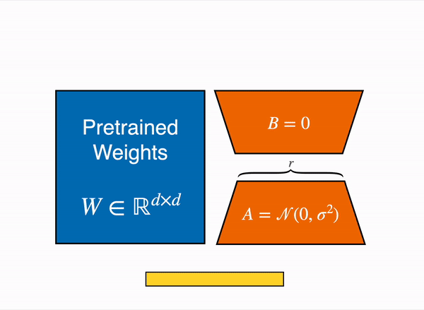

# bitsandbytes 、4-bit quantization 和 QLoRA


原文: [Making LLMs even more accessible with bitsandbytes, 4-bit quantization and QLoRA](https://huggingface.co/blog/4bit-transformers-bitsandbytes)

眾所周知，LLM 參數規模龐大，在消費類硬件中運行或訓練它們對於用戶和可訪問性來說是一個巨大的挑戰。我們的 [LLM.int8 博客文章](https://huggingface.co/blog/hf-bitsandbytes-integration) 展示瞭如何使用 [bitsandbytes](https://github.com/TimDettmers/bitsandbytes) 套件將 [LLM.int8 論文](https://arxiv.org/abs/2208.07339)中的技術集成到 transformer 中。

當我們努力讓模型更容易被任何人使用時，我們決定再次與 `bitsandbytes` 合作，允許用戶以 `4-bit` 精度運行模型。這包括任何模態（文本、視覺、多模態等）的絕大多數 HF 模型。用戶還可以利用 Hugging Face 生態系統中的工具在 4bit 模型之上訓練 adapters。這是 Dettmers 等人今天在 [QLoRA 論文](https://arxiv.org/abs/2305.14314)中介紹的一種新方法。


<!-- more -->

論文摘要如下：

!!! quote
    我們提出了 `QLoRA`，這是一種高效的微調方法，可減少內存使用量，足以在單個 48GB GPU 上微調 65B 參數模型，同時保留完整的 16 位微調任務性能。 
    
    QLoRA 通過凍結的 4bit quantization 預訓練語言模型將梯度反向傳播到低階適配器 (LoRA) 中。我們最好的模型系列（我們將其命名為 Guanaco ）在 Vicuna 基準測試中優於所有之前公開發布的模型，達到了 ChatGPT 性能水平的99.3%，同時只需要在單個 GPU 上進行 24 小時的微調。 
    
    QLoRA 引入了多項創新技術，在不犧牲性能的情況下節省內存：

    - 4bit NormalFloat (NF4)，一種新的數據類型，理論上對於常態分佈權重來說是最好的類型
    - double quantization，通過量化來減少平均內存佔用量化常數
    - 用於管理內存峰值的 paged optimizers。
    
    我們使用 QLoRA 來微調 1,000 多個模型，提供跨 8 個指令數據集、多種模型類型（LLaMA、T5）以及無法通過常規微調運行的模型規模（例如 33B 和 65B 參數型號）。我們的結果表明，即使使用比以前的 SoTA 更小的模型，QLoRA 對小型高質量數據集的微調也能帶來最先進的結果。我們根據人類和 GPT-4 評估對聊天機器人的性能進行了詳細分析，表明 GPT-4 評估是相對使用人類評估手法的廉價且合理的替代方案。
    
    此外，我們發現當前的聊天機器人基準測試對於準確評估聊天機器人的性能水平並不值得信賴。一項精選分析顯示了與 ChatGPT 相比，Guanaco 的失敗之處。我們發布了所有模型和代碼，包括用於 4bit 訓練的 CUDA 內核。

## 資源

本文附帶了一些用於 4bit 模型和 QLoRA 入門的資源：

- 原始論文
- [基本用法 Google Colab 筆記本](https://colab.research.google.com/drive/1ge2F1QSK8Q7h0hn3YKuBCOAS0bK8E0wf?usp=sharing) - 該筆記本展示瞭如何在推理中使用 4bit 模型及其所有變體，以及如何在免費的 Google Colab 實例上運行 GPT-neo-X（20B 參數模型）🤯
- [微調 Google Colab 筆記本](https://colab.research.google.com/drive/1VoYNfYDKcKRQRor98Zbf2-9VQTtGJ24k?usp=sharing) - 該筆記本展示瞭如何使用 Hugging Face 生態系統在下游任務中微調 4bit 模型。我們證明可以在 Google Colab 實例上微調 GPT-neo-X 20B！
- [用於復制論文結果的原始存儲庫](https://github.com/artidoro/qlora)
- [Guanaco 33b playground](https://huggingface.co/spaces/uwnlp/guanaco-playground-tgi) - 或查看下面的 playground 部分

## 介紹

如果您不熟悉模型精度和最常見的數據類型（`float16`、`float32`、`bfloat16`、`int8`），我們建議您仔細閱讀我們[第一篇 blog](https://huggingface.co/blog/hf-bitsandbytes-integration)中的介紹，該文通過可視化簡單地介紹了這些數據類型概念的細節。


如需了解更多信息，我們建議您通過此[維基百科文檔](https://en.wikibooks.org/wiki/A-level_Computing/AQA/Paper_2/Fundamentals_of_data_representation/Floating_point_numbers#:~:text=In%20decimal%2C%20very%20large%20numbers,be%20used%20for%20binary%20numbers.)閱讀浮點表示的基礎知識。

最近的 QLoRA 論文探討了不同的數據類型：`4-bit Float` 和 `4-bit NormalFloat`。我們將在這裡討論 `4-bit Float` 數據類型，因為它更容易理解。

`FP8` 和 `FP4` 分別代表 Floating Point 8-bit 和 4-bit 精度。它們是浮點值 minifloats 系列的一部分（除其他精度外，minifloats 系列還包括 `bfloat16` 和 `float16`）。

我們首先看一下如何用 `FP8` 格式表示浮點值，然後了解 `FP4` 格式是什麼樣子的。

### FP8 格式

正如我們之前的博文中所討論的，浮點包含 n-bits，每個 bit 都屬於一個特定類別，負責表示數字的組成部分（sign 符號、mantissa 尾數和 exponent 指數）。這些代表如下。


`FP8` (floating point 8) 格式在 [FP8 for Deep Learning](https://arxiv.org/pdf/2209.05433.pdf) 論文中首次介紹，有兩種不同的 `FP8` 編碼：`E4M3` (4位指數和3位尾數) 和 `E5M2` (5位指數和2位尾數) 。

儘管通過將 bits 從 32 減少到 8，精度大大降低，但這兩個版本都可以在各種情況下使用。目前可以使用 [Transformer Engine](https://github.com/NVIDIA/TransformerEngine) 套件，該套件也通過 `accelerate` 套件與 HF 生態系統集成。

`E4M3` 格式可以表示的潛在浮點數範圍為 `-448` 到 `448`，而在 `E5M2` 格式中，隨著指數位數的增加，範圍增加到 `-57344` 到 `57344` - 但有損失精度，因為可能的表示數量保持不變。經驗證明，`E4M3` 最適合 forward pass，第二個版本最適合 backward computation。

### FP4 精度簡述

符號位 (sign bit) 表示符號 (+/-)，指數位(exponent bits) 表示整數的 2 次方（例如 `2^{010} = 2^{2} = 4`），以及分數(fraction)或尾數(mantissa)是每一位為“1 ”時“有效”的負二冪之和。如果某個位為“0”，則該分數對於 `2^-i` 的冪保持不變，其中 `i` 是該位在位序列中的位置。例如，對於尾數位 1010，我們有 `(0 + 2^-1 + 0 + 2^-3) = (0.5 + 0.125) = 0.625`。為了得到一個值，我們將分數加 1 並將所有結果相乘，例如，使用 2 個指數位和 1 個尾數位，表示形式 1101 將是：

```
-1 * 2^(2) * (1 + 2^-1) = -1 * 4 * 1.5 = -6
```

對於 FP4 來說，沒有固定的格式，因此可以嘗試不同尾數/指數組合的組合。一般來說，在大多數情況下，3 個指數位(3 exponent bits)的效果會更好一些。但有時 2 個指數位(2 exponent bits)和一個尾數位(mantissa bit)會產生更好的性能。

## QLoRA 論文

簡而言之，與標準 16-bit 模型微調相比，QLoRA 減少了 LLM 微調的內存使用量，而無需犧牲性能。該方法可在單個 24GB GPU 上實現 33B 模型微調，在單個 46GB GPU 上實現 65B 模型微調。

更具體地說，QLoRA 使用 4-bit quantization 來壓縮預訓練的語言模型。然後凍結 LM 參數，並將相對少量的可訓練參數以 Low-Rank Adapters 的形式添加到模型中。在微調過程中，QLoRA 通過凍結的 4-bit quantized 預訓練語言模型將梯度反向傳播到 Low-Rank Adapters 中。 LoRA 層是訓練期間唯一更新的參數。請閱讀[原始 LoRA 論文](https://arxiv.org/abs/2106.09685)，了解有關 LoRA 的更多信息。

QLoRA 有一種用於基本模型權重的存儲數據類型（通常為 `4-bit NormalFloat`）和一種用於執行計算的計算數據類型（`16-bit BrainFloat`）。 QLoRA 將權重從存儲數據類型反量化為計算數據類型，以執行前向和後向傳遞，但僅計算使用 `16-bit bfloat` 的 LoRA 參數的權重梯度。權重僅在需要時才解壓縮，因此在訓練和推理期間內存使用率保持較低水平。

在廣泛的實驗中，QLoRA 調整被證明可以與 16-bit 微調方法相匹配。此外，Guanaco 模型在 [OpenAssistant 數據集 (OASST1)](https://huggingface.co/datasets/OpenAssistant/oasst1) 上對 LLaMA 模型使用 QLoRA 微調，是最先進的聊天機器人系統，在 Vicuna 基準測試中接近 ChatGPT。這是 QLoRA 調優威力的進一步展示。

如需更詳細的閱讀，我們建議您閱讀 [QLoRA 論文](https://arxiv.org/abs/2305.14314)。

## 如何在 transformers 中使用它？

在本節中，我們將介紹該方法的與 transformers 的整合、如何使用它以及哪些模型可以有效量化。

### 安裝套件

作為快速入門，安裝 accelerate 和 transformers 套件來使用 4bit 量化加載模型，同時並要確保您已安裝最新版本的 bitsandbytes 套件 (<= 0.39.0)。

```bash
pip install -q -U bitsandbytes
pip install -q -U transformers
pip install -q -U peft
pip install -q -U accelerate
```

### 快速入門

以 4bit 加載模型的基本方法是在通過提供設備映射調用 `from_pretrained` 方法(傳遞 `auto` 以獲取將自動推斷的設備映射)時傳遞參數 `load_in_4bit=True`。

```python
from transformers import AutoModelForCausalLM

model = AutoModelForCausalLM.from_pretrained("facebook/opt-350m", load_in_4bit=True, device_map="auto")
...

```

這就是您所需要的！

作為一般規則，我們建議用戶在使用 `device_map` 加載模型後不要手動設置設備。因此，在該行之後應避免對模型或任何模型的子模塊進行任何設備分配調用 - 除非您知道自己在做什麼。

!!! tip
    請記住，{==加載量化模型會自動將其他模型的子模塊轉換為 `float16` dtype==}。您可以通過將 `torch_dtype=dtype` 傳遞給 `from_pretrained` 方法來更改此行為（例如，如果您希望 layer norms 使用 `float32`）。


### 進階用法
 
您可以使用 4bit quantization 的不同變體，例如 `NF4`（normalized float 4 (default)）或純 `FP4` quantization。基於理論考慮和本文的實證結果，我們建議使用 `NF4` quantization 以獲得更好的性能。

其他選項包括 `bnb_4bit_use_double_quant`，它在第一次量化之後再進行了第二次量化，以便為每個參數額外節省 0.4 bits。最後是計算類型。雖然 4-bit bitsandbytes 以 4-bits，但計算仍然以 16 或 32-bit 進行，這裡可以選擇任何組合（`float16`、`bfloat16`、`float32` 等）。

如果使用 16-bit 計算數據類型 (default `torch.float32`)，矩陣乘法和訓練將會更快。人們應該利用 transformers 中最新的 `BitsAndBytesConfig` 來修改這些參數。下面是使用 `NF4` quantization 加載 4bit 模型的示例，並使用計算數據類型 `bfloat16` 進行 double quantization 以加快訓練速度：

```python
from transformers import BitsAndBytesConfig

nf4_config = BitsAndBytesConfig(
   load_in_4bit=True,
   bnb_4bit_quant_type="nf4",
   bnb_4bit_use_double_quant=True,
   bnb_4bit_compute_dtype=torch.bfloat16
)

model_nf4 = AutoModelForCausalLM.from_pretrained(model_id, quantization_config=nf4_config)
```

#### 修改 Compute dtype

如上所述，您還可以通過更改 `BitsAndBytesConfig` 中的 `bnb_4bit_compute_dtype` 參數來更改量化模型的計算 dtype。

```python
import torch
from transformers import BitsAndBytesConfig

quantization_config = BitsAndBytesConfig(
   load_in_4bit=True,
   bnb_4bit_compute_dtype=torch.bfloat16
)
```

#### 嵌套 quantization

要啟用嵌套量化，您可以使用 `BitsAndBytesConfig` 中的 `bnb_4bit_use_double_quant` 參數。這將在第一次量化之後啟用第二次量化，以便每個參數額外節省 0.4 bits。我們在 Google colab 筆記本中做模型訓練時使用此功能。

```python
from transformers import BitsAndBytesConfig

double_quant_config = BitsAndBytesConfig(
   load_in_4bit=True,
   bnb_4bit_use_double_quant=True,
)

model_double_quant = AutoModelForCausalLM.from_pretrained(
    model_id, 
    quantization_config=double_quant_config
)
```

當然，正如本節開頭提到的，所有這些組件都是可組合的。您可以將所有這些參數組合在一起，找到最適合您的用例。經驗法則是：如果內存有問題，請使用 double quant，使用 `NF4` 以獲得更高的精度，並使用 16-bit dtype 以獲得更快的微調。例如，在推理演示中，我們使用嵌套量化、`bfloat16` 計算數據類型和 `NF4` quantization 來將 gpt-neo-x-20b (40GB) 以 4-bit 完全載入進單個 16GB GPU 中。

### 常見問題

在本節中，我們還將解決任何人可能對這種集成提出的一些常見問題。

**FP4 quantization 有特殊硬體要求嗎?**

請注意，此方法僅與 GPU 兼容，因此無法在 CPU 上以 4bit 量化模型。在 GPU 中，此方法不應該有其它特殊硬體要求，因此只要安裝了 `CUDA>=11.2`，任何 Nvidia GPU 都可以用於運行 4bit 量化。另請記住，計算不是以 4bit 完成的，權重和激活被壓縮為該格式，然而計算仍保留在所需的 dtype。

**支持哪些 LLM 模型?**

與[A Gentle Introduction to 8-bit Matrix Multiplication for transformers at scale using Hugging Face Transformers, Accelerate and bitsandbytes](https://huggingface.co/blog/hf-bitsandbytes-integration)中介紹的 `LLM.int8` 整合類似，該整合深度依賴於 [accelerate](https://pypi.org/project/accelerate/) 套件。因此，任何支持 accelerate 加載的模型（即調用 `from_pretrained` 時的 `device_map` 參數）都應該可用 4bit 進行量化。另請注意，這與模態完全無關，只要可以使用 `device_map` 參數加載模型，就可以量化它們。

對於 text 模型，在撰寫本文時，這將包括最常用的架構，例如用於文本模型的 `Llama`、`OPT`、`GPT-Neo`、`GPT-NeoX`、用於多模式模型的 `Blip2` 等。

另外，支持 `acclerate` 的模型有：

```python
[
    'bigbird_pegasus', 'blip_2', 'bloom', 'bridgetower', 'codegen', 'deit', 'esm', 
    'gpt2', 'gpt_bigcode', 'gpt_neo', 'gpt_neox', 'gpt_neox_japanese', 'gptj', 'gptsan_japanese', 
    'lilt', 'llama', 'longformer', 'longt5', 'luke', 'm2m_100', 'mbart', 'mega', 'mt5', 'nllb_moe', 
    'open_llama', 'opt', 'owlvit', 'plbart', 'roberta', 'roberta_prelayernorm', 'rwkv', 'switch_transformers', 
    't5', 'vilt', 'vit', 'vit_hybrid', 'whisper', 'xglm', 'xlm_roberta'
]
```

!!! info
    請注意，如果您最喜歡的模型不存在上述列表，您可以產生一個 Pull request 或在 transformers 的 repo 中提出問題，以添加對該架構的 `acclerate` 加載支持。


**我們可以訓練 4bit/8bit 量化過的模型嗎？**

不可能對這些模型進行純 4bit 模型訓練。但是，您可以利用參數高效微調方法 (PEFT) 來訓練這些模型，並在其之上訓練例如 adapters。這就是論文中所做的，並得到 Hugging Face 的 PEFT 庫的正式支持。我們還提供了一個[模型訓練筆記本](https://colab.research.google.com/drive/1VoYNfYDKcKRQRor98Zbf2-9VQTtGJ24k?usp=sharing)，並建議用戶如果有興趣複製論文中的結果，請檢查 [QLoRA 存儲庫](https://github.com/artidoro/qlora)。



!!! tip
    輸出 activation 原始(frozen)預訓練權重（左）通過由權重矩陣 A 和 B（右）組成的 low rank adapter 進行增強。

**還有什麼其他要注意的地方嗎?**

這種整合可以為社群和人工智能研究帶來一些積極的影響，因為它可以影響多個用例和可能的應用程序。在 RLHF(Reinforcement Learning with Human Feedback)中，可以加載 4bit 的單個基礎模型(base model)，並在其上訓練多個 adaptors，一個用於獎勵建模，另一個用於價值策略訓練。

我們還針對這種量化方法對在消費類硬件上訓練大型模型的影響制定了一些基準。我們在 NVIDIA T4 (16GB) 上對 2 種不同的架構 Llama 7B（fp16 中 15GB）和 Llama 13B（fp16 中 27GB）進行了多次微調實驗，結果如下:

| 模型名稱 | 半精準度模型 size (GB) | 硬件類型/總 VRAM | 量化方法 | 批量大小 | 梯度累積步驟 | 優化器 | 序列長度 | 結果 |
|---------|----------------------|----------------|---------|---------|-----------|--------|--------|-----|
|<10B scale models|| | | | | | |  |
|decapoda-research/llama-7b-hf|14GB|1xNVIDIA-T4 / 16GB|LLM.int8 (8-bit) + GC	    |1	|4	|AdamW	|512	|No OOM|
|decapoda-research/llama-7b-hf|14GB|1xNVIDIA-T4 / 16GB|LLM.int8 (8-bit) + GC	    |1	|4	|AdamW	|1024	|OOM|
|decapoda-research/llama-7b-hf|14GB|1xNVIDIA-T4 / 16GB|4bit + NF4 + bf16 CD + no GC	|1	|4	|AdamW	|512	|No OOM|
|decapoda-research/llama-7b-hf|14GB|1xNVIDIA-T4 / 16GB|4bit + FP4 + bf16 CD + no GC	|1	|4	|AdamW	|512	|No OOM|
|decapoda-research/llama-7b-hf|14GB|1xNVIDIA-T4 / 16GB|4bit + NF4 + bf16 CD + no GC	|1	|4	|AdamW	|1024	|OOM|
|decapoda-research/llama-7b-hf|14GB|1xNVIDIA-T4 / 16GB|4bit + FP4 + bf16 CD + no GC	|1	|4	|AdamW	|1024	|OOM|
|decapoda-research/llama-7b-hf|14GB|1xNVIDIA-T4 / 16GB|4bit + NF4 + bf16 CD + GC	|1	|4	|AdamW	|1024	|No OOM|

| 模型名稱 | 半精準度模型 size (GB) | 硬件類型/總 VRAM | 量化方法 | 批量大小 | 梯度累積步驟 | 優化器 | 序列長度 | 結果 |
|---------|----------------------|----------------|---------|---------|-----------|--------|--------|-----|
|10B+ scale models|| | | | | | |  |
|decapoda-research/llama-13b-hf|27GB|2xNVIDIA-T4 / 32GB	|LLM.int8 (8-bit) + GC	|1	|4	|AdamW	|512	|No OOM|
|decapoda-research/llama-13b-hf|27GB|1xNVIDIA-T4 / 16GB	|LLM.int8 (8-bit) + GC	|1	|4	|AdamW	|512	|OOM|
|decapoda-research/llama-13b-hf|27GB|1xNVIDIA-T4 / 16GB	|4bit + FP4 + bf16 CD + no GC	|1	|4	|AdamW	|512	|OOM|
|decapoda-research/llama-13b-hf|27GB|1xNVIDIA-T4 / 16GB	|4bit + FP4 + fp16 CD + no GC	|1	|4	|AdamW	|512	|OOM|
|decapoda-research/llama-13b-hf|27GB|1xNVIDIA-T4 / 16GB	|4bit + NF4 + fp16 CD + GC	|1	|4	|AdamW	|512	|No OOM|
|decapoda-research/llama-13b-hf|27GB|1xNVIDIA-T4 / 16GB	|4bit + NF4 + fp16 CD + GC	|1	|4	|AdamW	|1024	|OOM|
|decapoda-research/llama-13b-hf|27GB|1xNVIDIA-T4 / 16GB	|4bit + NF4 + fp16 CD + GC + NQ	|1	|4	|AdamW	|1024	|No OOM|


- CD = compute dtype
- GC = gradient checkpointing
- NQ = nested quantization)


我們使用了 [TRL](https://pypi.org/project/trl/) 套件中最新的 [SFTTrainer](https://huggingface.co/docs/trl/sft_trainer)，基準測試腳本可以在[這裡](https://gist.github.com/younesbelkada/f48af54c74ba6a39a7ae4fd777e72fe8)找到。