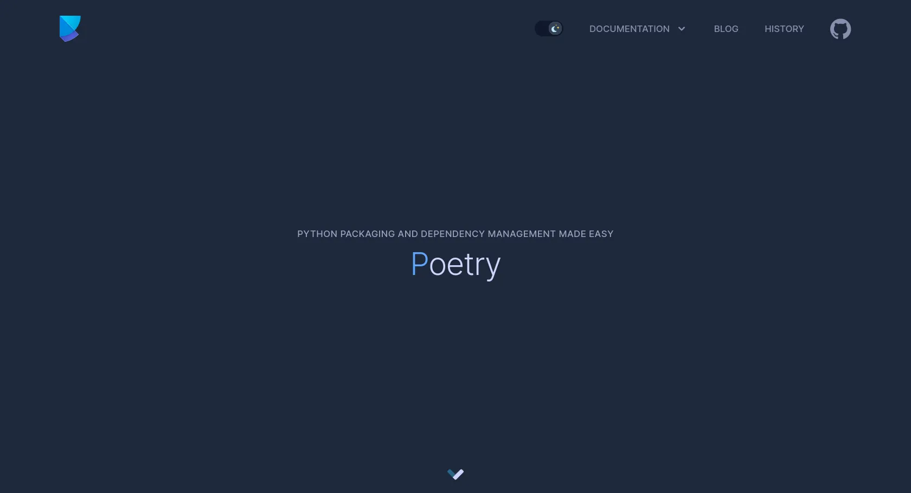
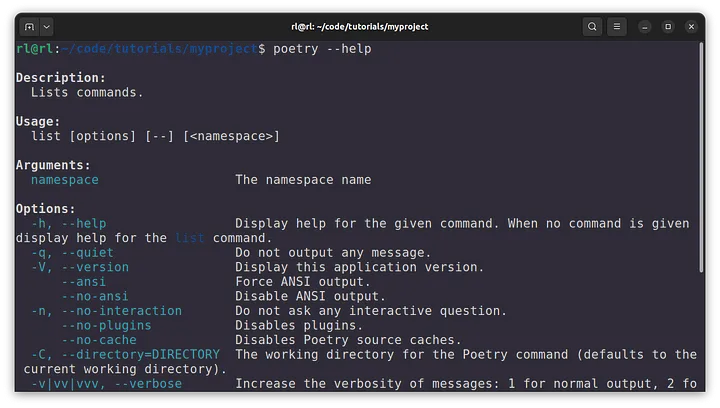
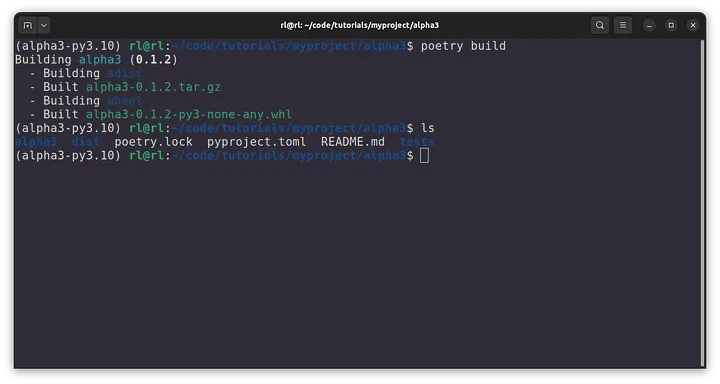
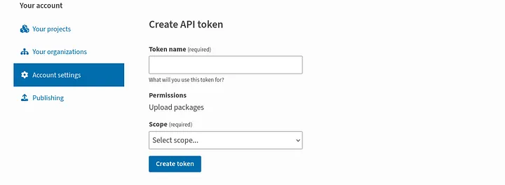
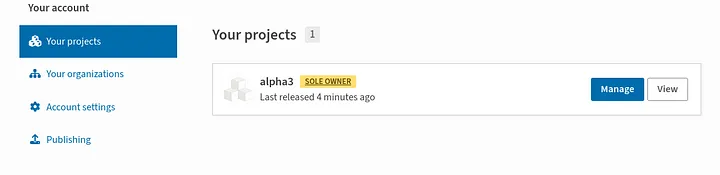

# 使用 Poetry 管理依賴關係以及建置和發布 Python 套件



原文: [How to Manage Dependencies and Build & Publish Python Packages using Poetry](https://medium.com/@imsahilrl/how-to-manage-dependencies-and-build-publish-python-packages-using-poetry-35917faa2f10)

本教程涵蓋:

1. Poetry Installation
2. Setup project with poetry
3. A brief introduction to pyproject.toml
4. Creating a virtual environment with poetry
5. Dependency management using poetry
6. Create a Python package
7. Build a package with Poetry
8. Publish package with Poetry on PyPI

在建立 Python 套件時，開發人員通常會依賴外部程式庫或不屬於 Python 標準庫的依賴項。手動管理這些第三方函式庫的安裝、卸載或更新是一項繁瑣的任務。這些第三方函式庫具有額外的外部相依性的情況並不罕見，這使得手動管理相依性變得更加複雜。

幸運的是，Python 有依賴管理工具，可以讓第三方函式庫的管理變得更容易。 **Poetry** 是其中一個值得注意的工具，它不僅有助於依賴管理，還負責創建虛擬環境以及建置和發布 Python 套件。

在本教程中，我們將使用 Poetry 建立、建構和發布一個命令列工具，該工具接收國家/地區名稱作為輸入並輸出其對應的 Alpha3 程式碼。

<!-- more -->

## 1. Poetry 安裝

要安裝 Poetry，您可以使用官方 Poetry 安裝程式腳本。

```bash
# Linux, macOS, Windows (WSL)
curl -sSL https://install.python-poetry.org | python3 -


# Windows (Powershell)
(Invoke-WebRequest -Uri https://install.python-poetry.org -UseBasicParsing).Content | py -
# In the above command
# Replace 'py' with 'python', in case you have installed python from Microsoft Store.
```

驗證安裝:

```bash
poetry --help
```




## 2. 用 Poetry 設定專案

首先，我們將首先使用 Poetry 建立一個新專案。

```bash
poetry new alpha3
```

這將為我們建立以下專案結構。

```bash
.
└── alpha3  # project's root directory
    ├── alpha3  # python package
    │   └── __init__.py
    ├── pyproject.toml  # poetry configuration file
    ├── README.md
    └── tests
        └── __init__.py
```

預設情況下，Poetry 使用相同的名稱建立專案的根目錄和 Python 套件目錄。

## 3. pyproject.toml 簡介

雖然我們新創建的專案的結構看起來就像一個常規的 Python 專案，但有一個例外- 我們有一個名為 `pyproject.toml` 的配置文件，其中包含有關項目依賴項以及其他配置和元數據的各種詳細資訊。

```yaml title="pyproject.toml"
# pyproject.toml

[tool.poetry]
name = "alpha3"
version = "0.1.0"
description = ""
authors = ["Sahil Rohilla <imsahilrl@gmail.com>"]
readme = "README.md"

[tool.poetry.dependencies]
python = "^3.10"


[build-system]
requires = ["poetry-core"]
build-backend = "poetry.core.masonry.api"
```

上面，我們有 `[tool.poetry]` 部分，其中包含有關該項目的一般元資料。本節包含多個其他部分，讓我們簡要討論其中的一些部分。

**[tool.poetry.dependencies]**

- poetry 使我們能夠將依賴關係分組。
- `tool.poetry.dependency` 是預設新增依賴項的主要群組。專案的所有執行 runtime 依賴項都必須存在於該群組中。

以下命令會將依賴項新增至主群組。

```bash
poetry add dependency-name
```

**[tool.poetry.group.dev.dependencies]**

- 此部分儲存僅出於開發或測試目的所需的所有依賴項。
- 使用 `--group` 標誌，我們可以透過傳遞群組名稱來新增對開發群組或任何其他群組的依賴項。

```bash
poetry add dependency-name --group=dev
```

**[tool.poetry.scripts]**

在本節中，套件入口進行點被定義為安裝為可執行文件，確保它們在系統或虛擬環境 PATH 上的可用性。當您建立 CLI 工具時，這非常有用。

```bash
[tool.poetry.scripts]
cli_tool_name = 'my_package.__main__:main'
```

**[[tool.poetry.source]]**

預設情況下，Poetry 配置為尋找依賴項並在 PyPI 儲存庫上發布套件。

在本節中，我們可以定義其他私有儲存庫。

```yaml
[[tool.poetry.source]]
name = "testpypi"
url = "https://test.pypi.org/legacy/"
priority = "primary"
```

若要透過 Poetry CLI 工具新增私有儲存庫：

```bash
poetry source add testpypi https://test.pypi.org/legacy/  # Add repository
poetry config pypi-token.testpypi your_token  # Add repository token to Poetry.
```

**[build-system]**

Poetry 有其建構後端，在 poetry 核心中實現，用於建構發行包： `wheel` 和 `tar.gz`（源發行版）。

Poetry 核心符合 PEP 517 標準，這意味著它允許 `pip` 和 `build` 等工具輕鬆使用 poetry 核心作為構建後端來構建套件。

在建置套件方面，`pip` 和 `build` 被稱為建構前端工具。這些工具在後台使用建置後端來建置套件。

除了己被廣泛使用的 legacy 建置後端（例如 `distutils` 和 `setuptools`）之外，現在還有許多其他可用的建置後端，建置前端工具可以從中選擇。建置前端工具使用 `[build-system]` 部分中定義的任何建置後端來建置套件。本節並非特定於 poetry，也不屬於 `[tool.poetry]` 部分。

```yaml
[build-system]
requires = ["poetry-core"]
build-backend = "poetry.core.masonry.api"
```

## 4. 用 Poetry 構建虛擬環境

虛擬環境為您提供了一個私人空間來安裝和管理專案的工具和依賴項，而不會影響您的整個電腦。這種隔離有助於防止衝突並保持事物整潔。

只需一個指令即可啟動 poetry 虛擬環境。如果專案的虛擬環境尚不存在，當您第一次執行以下命令時，poetry 會自動為您建立一個。

```bash
poetry shell
```

## 5. 用 Poetry 進行依賴管理

現在您已經啟動了虛擬環境，讓我們加入一些將在 Python 專案中使用的第三方函式庫。

本教學需要以下第三方函式庫：

- `requests==2.31.0` Python HTTP for Humans.
- `structlog==23.3.0` Structured Logging for Python

`requests` 函式庫用於在 Python 中發出 HTTP 請求。 `structlog` 用於將輸出記錄到命令列。

要安裝依賴項，我們可以使用 poetry 添加套件名稱命令。

```bash
poetry add requests==2.31.0
poetry add structlog==23.3.0


# If you prefer to install the latest version, use
poetry add requests@latest structlog@latest
```

`[tool.poetry.dependency]` 將反映新新增的套件。

```yaml
[tool.poetry.dependencies]
python = "^3.10"
requests = "2.31.0"
structlog = "23.3.0"
```

當您執行 `poetry add` 指令來新增依賴項時，poetry 會執行以下操作：

- 它為 `pyproject.toml` 中指定版本的套件建立一個新條目或更新現有條目。
- 它將套件安裝到專案的虛擬環境中。如果該軟體包已經存在，它將根據指定的版本對其進行更新或降級。
- 它創建或更新 `poetry.lock` 檔案。

`poetry.lock` 檔案由 poetry 自動生成，它包含有關直接依賴和傳遞依賴的詳細信息，這些依賴已經解決並固定到特定版本。這可以確保團隊中的每個人都使用相同版本的依賴項，從而使偵錯變得更加容易。

此外，當其他開發人員在設定專案時使用 poetry 安裝指令安裝依賴項。這將導致安裝速度更快，因為 poetry 不必再次解析依賴關係，而是使用已經以解析方式包含依賴關係的 `poetry.lock` 檔案。

## 6. 創建 python 套件

在本節中，我們將建立一個簡單的 Python 套件來建立一個命令列工具，將國家/地區名稱轉換為其對應的 alpha3 程式碼。例如，"United States" 的 alpha3 代碼將是"USA"。為此，我們將使用公開的 [opendatasoft](https://data.opendatasoft.com/) API。

我們將首先在 `alpha3` 套件中建立以下新檔案。

- `__main__.py`
- `get_alpha3.py`

```bash
.
└── alpha3
    ├── alpha3
    │   ├── get_alpha3.py
    │   ├── __init__.py
    │   └── __main__.py
    ├── poetry.lock
    ├── pyproject.toml
    ├── README.md
    └── tests
        └── __init__.py
```

現在，讓我們將以下程式碼新增到 `get_alpha3.py` 檔案中。

```python title="get_alpha3.py"
# get_alpha3.py

import structlog
import requests


log = structlog.get_logger()


def get_alpha3_code(country_name):
    """
    To get alpha3code from OpenDataSoft API.
    :param country_name:
    :return: Alpha3code or country name in case alpha3code couldn't be retrieved.
    """
    url = (f"https://public.opendatasoft.com/"
           f"api/explore/v2.1/catalog/datasets/countries-codes/records?"
           f"select=iso3_code&where=label_en='{country_name}'&limit=1")
    try:
        response = requests.get(url)
        response.raise_for_status()
        country = response.json()['results'][0]['iso3_code']
        return country
    except IndexError:
        log.warning(f'Could not find Alpha3code for country {country_name}.')
    except Exception as e:
        log.error(f"Unable to get alpha3 code for {country_name} due to the following error: {e}")

    return None
```

在上面的程式碼中：

- 我們建立了一個名為 `get_alpha3_code` 的函數，它將 country name 作為參數。
- 使用 `requests` 函式庫，我們對 opendatasoft API 進行 API 呼叫。國家/地區名稱會作為查詢參數附加到 URL 中。
- 從 JSON 回應中，我們嘗試存取 `iso3_code` 的鍵值。如果鍵存在，我們傳回它的值，也就是我們的 alpha3 程式碼。
- 如果鍵值不存在，我們將收到索引錯誤，我們將使用 structlog 套件簡單地記錄它。
- 如果出現任何其他類型的錯誤，我們將在第二個 except 語句中捕獲該錯誤並記錄下來。

現在讓我們使用以下內容填入 `__main__.py` 檔案。

```python title="__main__.py"
# __main__.py

import argparse

from .get_alpha3 import get_alpha3_code


def main():
    parser = argparse.ArgumentParser(description='The tools helps to find Alpha3 code for a input country name')

    # Add positional argument to the parser.
    parser.add_argument("country", type=str, help="Name of country")

    # Parse the command-line arguments provided by the user.
    args = parser.parse_args()

    # Make API call 
    alpha3code = get_alpha3_code(args.country)
    
    if alpha3code:
        print(alpha3code)


if __name__ == '__main__':  # pragma: no cover
    main()
```

在上面的程式碼中：

- 我們導入了 `argparse`，Python 內建的套件，用於開發命令列工具。
- 從 `get_alpha3` 模組中，我們導入了 `get_alpha3_code` 函數。
- 在 main 函數中，我們從 argparse 模組建立了 `ArgumentParser` 類別的實例。我們也為關鍵字參數 `description` 提供了該工具的簡短描述。
- 然後我們向解析器新增了一個位置參數。此位置參數是使用者將提供給工具的國家/地區名稱。
- 解析使用者回應後，我們使用使用者提供的國家/地區名稱對 `get_alpha3_code` 進行函數呼叫。
- 最後，如果函數呼叫的回傳值不是 None，我們只需列印它。

幹得好！我們已經成功創建了 Python 套件。

要測試它，請從根目錄將包作為模組執行。

```bash
# Execute the package as python module.
python -m alpha3 'United States'  # output: USA
```

### 在 pyproject.toml 中定義入口點

在建置套件之前，我們需要在 `pyproject.toml` 中定義一個入口點，以便將 python 套件安裝為使用者安裝後在 PATH 上可用的可執行檔。

```yaml title="pyproject.toml"
[tool.poetry.scripts]
alpha3 = "alpha3.__main__:main"
```

### 新增 License 宣告

由於我們要將此套件發佈到 PyPI，因此建議為其新增許可證。雖然添加在 PyPI 上發布的許可證並不是嚴格要求的，但將其包含在您的專案中通常是一個很好的做法。這有助於使用者了解在哪些條款下可以使用、修改或分發程式碼。

您可以在以下網站瀏覽並選擇許可證。

- [The Software Package Data Exchange (SPDX)](https://spdx.org/licenses/)
- [Open Source Initiative (OSI)](https://opensource.org/licenses/)

對於本教程，我們可以使用 MIT 授權。在專案的根資料夾中建立一個 `LICENSE` 文件，並將以下許可證複製並貼上到其中。

```bash
MIT License

Copyright (c) [year] [fullname]

Permission is hereby granted, free of charge, to any person obtaining a copy
of this software and associated documentation files (the "Software"), to deal
in the Software without restriction, including without limitation the rights
to use, copy, modify, merge, publish, distribute, sublicense, and/or sell
copies of the Software, and to permit persons to whom the Software is
furnished to do so, subject to the following conditions:

The above copyright notice and this permission notice shall be included in all
copies or substantial portions of the Software.

THE SOFTWARE IS PROVIDED "AS IS", WITHOUT WARRANTY OF ANY KIND, EXPRESS OR
IMPLIED, INCLUDING BUT NOT LIMITED TO THE WARRANTIES OF MERCHANTABILITY,
FITNESS FOR A PARTICULAR PURPOSE AND NONINFRINGEMENT. IN NO EVENT SHALL THE
AUTHORS OR COPYRIGHT HOLDERS BE LIABLE FOR ANY CLAIM, DAMAGES OR OTHER
LIABILITY, WHETHER IN AN ACTION OF CONTRACT, TORT OR OTHERWISE, ARISING FROM,
OUT OF OR IN CONNECTION WITH THE SOFTWARE OR THE USE OR OTHER DEALINGS IN THE
SOFTWARE.
```

現在讓我們將此授權的符號新增至 `[tool.poetry]` 部分。

```yaml title="pyproject.toml"
[tool.poetry]
name = "alpha3"
version = "0.1.0"
description = ""
authors = ["Sahil Rohilla <imsahilrl@gmail.com>"]
readme = "README.md"
license = "MIT"  # added license notation
```

您可以在[此處](https://spdx.org/licenses/)找到最常見許可證的建議範例。

!!! tip
    在進入下一階段之前，需要注意的是，PyPI 要求每個已發布的套件都有一個唯一的名稱。

    如果您逐步遵循本教程，PyPI 很可能會因命名衝突而拒絕您的套件。這是因為我已經以 alpha3 的名稱發布了它。

    為了克服這個問題，我們將修改 `pyproject.toml`，使已發布的套件與實際套件具有不同的名稱。

    ```yaml title="pyproject.toml"
    [tool.poetry]
    name = "unique-name"  # Add a unique name here. This will be the name of your published package.
    version = "0.1.0"
    description = ""
    authors = ["Sahil Rohilla <imsahilrl@gmail.com>"]
    readme = "README.md"
    license = "MIT"

    packages = [{ include = "alpha3" }]  # Add the alpha3 package folder here.
    ```

    上面，我們新增了一個新欄位 `packages`，它指定最終發行版中應包含哪些目錄。

    由於我們想要為已發佈的套件使用不同的名稱，因此我們必須在 packages 欄位中明確包含 `alpha3` 目錄。

## 7. 用 Poetry 建構套件

為了建構包，Poetry 使用其在 [poetry-core](https://github.com/python-poetry/poetry-core) 中實現的構建後端。

從專案的根目錄中，執行以下命令來建置套件。

```bash
poetry build
```



現在，Poetry 會在根目錄中建立一個 dist 資料夾，其中包含以下分發包：來源分發包 (tar.gz)、wheel 分發包 (.whl)

我們也可以直接使用 pip 安裝這個新建立的 wheel 分發包。但是，與其他開發人員共用此輪檔案來安裝會很不方便，因此讓我們繼續將這個套件發佈到 Python Package Index (PyPI) 儲存庫上。

```bash
pip install your-distribution-package.whl
```

## 8. 在 PyPI 發布套件

由於在 Poetry 中，PyPI 被配置為發布和下載套件的預設儲存庫，因此我們只需為其提供身份驗證令牌。

**在 PyPI 上建立令牌**

- 要在 **pypi.org** 上建立 API 令牌，首先，您需要在該平台上[建立帳戶](https://pypi.org/account/register/)。
- 建立帳戶後，導覽至 Account settings.。您必須向下捲動到 API tokens 部分，然後按一下 Add API token 按鈕。



**為 Poetry 設定 token**

```bash
poetry config pypi-token.pypi your-token
```

向 Poetry 提供 token 後，從專案的根目錄執行以下命令以發布套件。

```bash
poetry publish
```

結果:

```bash
# output
(alpha3-py3.10) user@user:~/Desktop/alpha3$ poetry publish
Publishing alpha3 (0.1.1) to PyPI
 - Uploading alpha3-0.1.1-py3-none-any.whl 100%
 - Uploading alpha3-0.1.1.tar.gz 100%
```

我們現在已成功將 Python 套件發佈到 pypi.org。

若要進行驗證，請導航至 [Your projects](https://pypi.org/manage/projects/) 部分。



現在您可以使用以下命令從任何 pip 設定的系統安裝該套件:

```bash
pip install alpha3
```

## 結論

在本教程中，我們成功學習如何建立 Python 套件、如何建置它以及如何使用 Poetry 將其發佈到 PyPI 上。此外，我們也簡要討論了 Poetry 設定檔中的各個部分。

