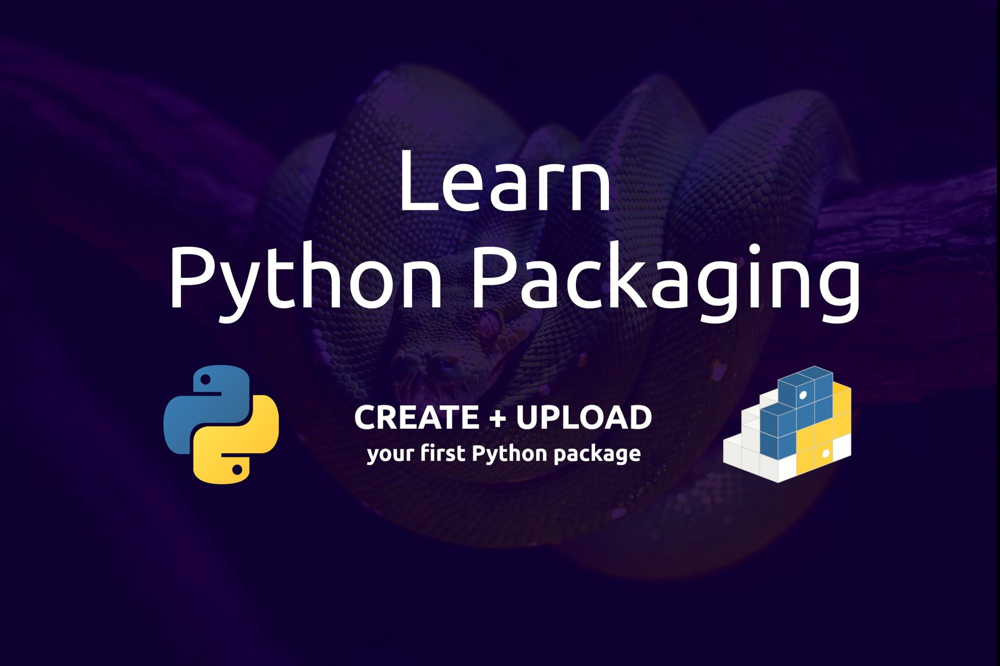

# 如何建立第一個 Python 套件並將其上傳到 PyPI



原文: [How to Create and Upload Your First Python Package to PyPI](https://www.freecodecamp.org/news/how-to-create-and-upload-your-first-python-package-to-pypi/)

## Python package 檔案結構

在開始之前，我們應該知道在 Python 中套件的含義。

Python 套件是一個目錄，其中包含一堆模組以及名為 `__init__.py` 的依賴檔案。該檔案可以完全為空，您可以使用它來將磁碟上的目錄標記為 Python 套件。

下面顯示了套件目錄的範例：

```bash
package/
├── __init__.py
├── module_a.py
├── module_b.py
└── module_c.py
```

`__init__.py` 是一個依賴文件，可協助 Python 在套件目錄中尋找可用模組。如果我們刪除這個文件，Python 將無法導入我們的模組。

<!-- more -->

## Python Packages 與 modules 的差別

現在您應該了解 Python 套件會建立一個包含多個模組的結構化目錄，但是模組呢？讓我們確保我們理解 Package 和 Module 之間的區別：

- 一個 **Module** 總是對應到一個 Python 檔案, 例如 `turtle.py`。它包含類別、函數和常數等邏輯。
- 一個 **Package** 本上是一個可以包含許多 Module 或 sub-package 的組合。


## Python package 結構

Package 不僅包含模組。它們還包含 top-level 腳本、文件和測試。以下範例顯示如何建構基本 Python 套件：

```bash
package_name/
	docs/
	scripts/
	src/
		package_a
			__init__.py
			module_a.py
		package_b
			__init__.py
			module_b.py
	tests/
    	__init__.py
		test_module_a.py
		test_module_b.py
	LICENSE.txt
	CHANGES.txt
	MANIFEST.in
	README.txt
	pyproject.toml
	setup.py
	setup.cfg
```

讓我們了解一下上面檔案樹中每個文件的用途：

- `package_name`: 代表 main package。
- `docs/`: 包括有關如何使用該套件的文件文件。
- `scripts/`: 你的 top-level scripts。
- `src/`: 你的程式碼放在這裡。它包含　packages、modules、sub-packages 等。
- `tests/`: 您可以在其中放置單元測試。
- `LICENSE.txt`: 包含許可證的文字（例如，MIT）。
- `CHANGES.txt`: 報告每個版本的變更。
- `MANIFEST.in`: 您可以在其中放置有關要包含哪些額外文件（非代碼文件）的說明。
- `README.txt`: 包含 package 描述（markdown 格式）。
- `pyproject.toml`: 註冊你的建置工具。
- `setup.py`: 包含建置工具的建置腳本。
- `setup.cfg`: 建置工具的設定檔。

!!! info
    請注意，如何將測試文件包含在 main package 中有兩個選項。我們可以像上面那樣將其保留在 top level，或將其放入 package 內，如下所示：

    ```bash
    package_name/
        __init__.py
        module_a.py
        module_b.py
        test/
            __init__.py
            test_module_a.py
            test_module_b.py
    ```

    在我看來，我認為將測試保持在 top-level 會很有幫助，特別是當我們的測試需要讀取和寫入其他外部文件時。

## 使用 setup.cfg 還是 setup.py？

`setup.py` 和 `setup.cfg` 是 `PyPI`、`setuptools`、`pip` 和標準 python 函式庫中的預設打包工具。

在這裡，它們代表 `setuptools` 的配置和建置腳本。它們都告訴安裝工具如何建置和安裝軟體包。

提到的文件包含版本、套件和要包含的文件等資訊以及任何要求。

下面顯示了使用一些 `setup()` 參數的 `setup.py` 範例。您可以在這裡找到更多參數：

```python title="setup.py"
import setuptools

with open("README.md", "r", encoding = "utf-8") as fh:
    long_description = fh.read()

setuptools.setup(
    name = "package-name",
    version = "0.0.1",
    author = "author",
    author_email = "author@example.com",
    description = "short package description",
    long_description = long_description,
    long_description_content_type = "text/markdown",
    url = "package URL",
    project_urls = {
        "Bug Tracker": "package issues URL",
    },
    classifiers = [
        "Programming Language :: Python :: 3",
        "License :: OSI Approved :: MIT License",
        "Operating System :: OS Independent",
    ],
    package_dir = {"": "src"},
    packages = setuptools.find_packages(where="src"),
    python_requires = ">=3.6"
)
```

與 `setup.py` 相比，`setup.cfg` 的編寫格式不同，並且基本上包含兩個基本鍵：command 和 options。

`command` 代表 `distutils` 指令之一，而 `options` 定義該指令可以支援的選項。

```bash title="setup.cfg"
[command]
option = value
```

下面顯示了使用一些 metadata 和 options 的 `setup.cfg` 範例。您可以在[這裡](options)找到各種 metadata 和 options：

```bash title="setup.cfg"
[metadata]
name = package-name
version = 0.0.1
author = name of the author
author_email = author@example.com
description = short package description
long_description = file: README.md
long_description_content_type = text/markdown
url = package url
project_urls =
    Bug Tracker = package issues url
classifiers =
    Programming Language :: Python :: 3
    License :: OSI Approved :: MIT License
    Operating System :: OS Independent

[options]
package_dir =
    = src
packages = find:
python_requires = >=3.6

[options.packages.find]
where = src
```

`setup.py` 和 `setup.cfg` 皆是特定為了 **setuptools** 而定義的。此外，`setup.cfg` 可以安全地移動到 `pyproject.toml`。

這裡的想法是，也許有一天我們會想要切換到其他套件構建系統，例如 [flit](https://daobook.github.io/flit/) 或 [poetry](https://python-poetry.org/)。在這種情況下，我們需要做的就是將 `pyproject.toml` 中的套件構建系統條目（例如 `setuptools`）更改為 `flit` 或 `poetry` 之類的內容，而不是從頭開始。

在[這裡](https://packaging.python.org/en/latest/key_projects/#build)您可以找到有關構建和分發 Python 套件的其他工具的資訊。

無論我們選擇哪種配置文件，我們都會持續維護該特定配置文件，無論是 `pyproject.toml`、`setup.cfg` 或 `setup.py`。

根據 [Python Packaging User Guide](https://packaging.python.org/en/latest/)，`setup.cfg` 是首選，因為它是靜態的、乾淨的、更易於閱讀並且可以避免編碼錯誤。

## 如何建構第一個 Python 套件

現在，是時候開始建立一個簡單的 Python 套件了。我們將使用 `setuptools` 作為建置系統，並使用 `setup.cfg` 和 `pyproject.toml` 來配置我們的專案。

### 設定 Package 相關檔案

```bash
basicpkg/
	src/
		divide
			__init__.py
			divide_by_three.py
		multiply
			__init__.py
			multiply_by_three.py
	tests/
		__init__.py
		test_divide_by_three.py
		test_multiply_by_three.py
	LICENSE.txt
	README.txt
	pyproject.toml
	setup.cfg
```

我們的主 package 由兩個 package 組成：第一個 package 用於將數字除以三，另一個 package 用於將數字乘以三。

此外，我們忽略了一些文件，例如 `CONTEXT.txt`、`MANIFEST.in` 和 `docs/` 目錄，以保持目前的簡單性。但是我們需要 `test/` 目錄來包含我們的單元測試來測試套件的行為。

### 添加模組邏輯

像往常一樣，我們將 `__init__.py` 保留為空。然後，我們需要在模組中添加一些邏輯來執行我們的操作。

對於 `divide` ，我們將以下內容新增到 `divide_by_third.py` 中以將任何數字除以三：

```python title="divide_by_third.py"
def divide_by_three(num):
	return num / 3
```

相同的邏輯適用於 `multiply` 套件內的 `multiply_by_third.py`。但是，這次是將任何數字乘以三：

```python title="multiply_by_third.py"
def multiply_by_three(num):
	return num * 3
```

請隨意添加更多套件和模組來執行其他類型的操作。例如，您可以新增套件來執行加法和減法任務。


### 測試模組

練習在我們創建的任何程式中添加自動化測試是很好的。我們將使用 `unittest` 來測試我們的模組和套件的行為。

在 `test/` 目錄中，將以下程式碼新增至 `test_divide_by_third.py`：

```python title="test_divide_by_third.py"
import unittest
from divide.by_three import divide_by_three 

class TestDivideByThree(unittest.TestCase):

	def test_divide_by_three(self):
		self.assertEqual(divide_by_three(12), 4)

unittest.main()
```

我們從 **unittest** 導入 `TestCase` 來執行我們的自動化測試。然後，我們從位於 `divide` 套件內的 `by_three` 模組匯入除法方法 `divide_by_third()`。

如果我們刪除這裡的 `__init__.py`，Python 將無法再找到我們的模組。

`.assertEqual()` 用來檢查上面兩個值 `divide_by_third(12)` 和 `divide_by_third(4)` 是否相等。 `unittest.main()` 被實例化以運行我們所有的測試。

相同的邏輯適用於 `test_multiply_by_three.py`：

```python title="test_multiply_by_three.py"
import unittest
from multiply.by_three import multiply_by_three

class TestMultiplyByThree(unittest.TestCase):

	def test_multiply_by_three(self):
		self.assertEqual(multiply_by_three(3), 9)

unittest.main()
```

若要執行測試，請在 terminal/command 中鍵入以下內容：

```
python3 tests/test_divide_by_three.py
```
