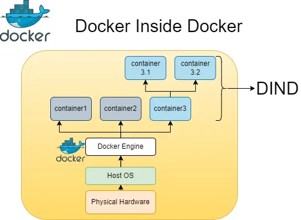

# Docker Inside Docker



Docker 無疑以其輕量級、可移植的容器改變了軟體開發和部署的世界。但是如果我告訴你 Docker 本身可以在另一個 Docker 容器中運作呢？恩，那就對了！這個概念通常被稱為 “Docker Inside Docker” 或 “DinD”，為開發人員和系統管理員開闢了一個全新的可能性領域。在這篇文章中，我們將探索嵌套容器化的世界，討論它的眾多好處、各種用例以及在 Docker 中啟動 Docker 的逐步過程。那麼，讓我們深入了解一下吧！

## 了解 Docker Inside Docker

簡單來說，Docker Inside Docker 涉及在 Docker 容器內執行 Docker。容器內產生了一個新的 Docker 引擎，而不是與主機的 Docker 守護程式交互，為管理容器和映像提供了一個隔離的環境。

## Docker Inside Docker 的好處

**1. Isolated Development and Testing:**

在 Docker 中執行 Docker 允許開發人員創建專門為其應用程式量身定制的隔離環境。這可確保依賴項、配置和執行時間環境在不同的開發階段保持一致，從而更輕鬆地重現和偵錯問題。

**2. Enhanced Security and Isolation:**

在 Docker 中執行 Docker 允許開發人員創建專門為其應用程式量身定制的隔離環境。這可確保依賴項、配置和執行時間環境在不同的開發階段保持一致，從而更輕鬆地重現和偵錯問題。

**3. Simplified CI/CD Pipelines:**

Docker Inside Docker 廣泛應用於持續整合和持續部署 (CI/CD) 工作流程。它支援創建用於建置、測試和部署應用程式的獨立的一次性環境，從而實現更快、更可靠的自動化管道。

**4. Multi-tenancy and Resource Management:**

在多個團隊或使用者需要共用基礎架構上的隔離環境的情況下，嵌套容器化非常有用。透過在 Docker 內部啟動 Docker，可以為每個團隊或使用者提供單獨的 Docker 引擎，確保資源隔離並防止不同應用程式之間的干擾。

<!-- more -->

## 啟動 Docker Inside Docker

若要在 Docker 中啟動 Docker，請執行以下簡單步驟：

**Step 1: Install Docker**

確保您的主機上安裝了 Docker。如果您尚未安裝 Docker，請按照適用於您的作業系統的官方 Docker 安裝說明進行操作。

**Step 2: Pull the Docker Image**

透過在終端機或命令提示字元中執行以下命令來拉取 DinD (Docker-in-Docker) 映像：

```bash
docker pull docker:dind
```

**Step 3: Launch the Docker Container**

使用以下命令啟動 Docker 容器 (特權模式 `--privileged`)：

```bash
docker run --privileged --name my-dind-container -d docker:dind
```

{!==`--privileged` 標誌授予容器在 Docker 內執行 Docker 所需的提升權限。==}

**Step 4: Access the Docker Engine**

若要與容器內的 Docker 引擎交互，請執行以下命令：

```bash
docker exec -it my-dind-container docker info
```

結果:

```bash
Client:
 Version:    26.1.4
 Context:    default
 Debug Mode: false
 Plugins:
  buildx: Docker Buildx (Docker Inc.)
    Version:  v0.15.1
    Path:     /usr/local/libexec/docker/cli-plugins/docker-buildx
  compose: Docker Compose (Docker Inc.)
    Version:  v2.27.2
    Path:     /usr/local/libexec/docker/cli-plugins/docker-compose

Server:
 Containers: 0
  Running: 0
  Paused: 0
  Stopped: 0
 Images: 0
 Server Version: 26.1.4
 Storage Driver: overlay2
  Backing Filesystem: extfs
  Supports d_type: true
  Using metacopy: false
  Native Overlay Diff: true
  userxattr: false
 Logging Driver: json-file
 Cgroup Driver: cgroupfs
 Cgroup Version: 2
 Plugins:
  Volume: local
  Network: bridge host ipvlan macvlan null overlay
  Log: awslogs fluentd gcplogs gelf journald json-file local splunk syslog
 Swarm: inactive
 Runtimes: io.containerd.runc.v2 runc
 Default Runtime: runc
 Init Binary: docker-init
 containerd version: ae71819c4f5e67bb4d5ae76a6b735f29cc25774e
 runc version: v1.1.12-0-g51d5e94
 init version: de40ad0
 Security Options:
  apparmor
  seccomp
   Profile: builtin
  cgroupns
 Kernel Version: 6.5.0-35-generic
 Operating System: Alpine Linux v3.20 (containerized)
 OSType: linux
 Architecture: x86_64
 CPUs: 8
 Total Memory: 31.06GiB
 Name: 9a5ee419507c
 ID: bdec0737-161f-4170-b108-ef4c80d88fbc
 Docker Root Dir: /var/lib/docker
 Debug Mode: false
 Experimental: false
 Insecure Registries:
  127.0.0.0/8
 Live Restore Enabled: false
 Product License: Community Engine
```

您現在位於執行 Docker 的 Docker 容器內！您可以像在主機上一樣執行任何 Docker 命令。

!!! info
    注意：請記住，在特權模式下運行容器可能會產生安全隱患。在生產環境中使用此設定時要小心。

### 使用 Docker Inside Docker

現在您已經啟動並運行了 Docker Inside Docker，讓我們透過一個實際範例來使用它：

**Step 1: Run the Container**

首先，執行以下命令來啟動容器：

```bash
docker run --privileged -d --name <demo> docker:dind
```

**Step 2: Login to the Container**

接下來，登入容器：

```bash
docker exec -it <demo> /bin/sh
```

**Step 3: Pull an Image**

在容器內，拉取一個鏡像，例如 Ubuntu：

```bash
docker pull ubuntu
```

**Step 4: Create a Dockerfile**

建立一個新資料夾並在其中建立一個 Dockerfile：

```bash
mkdir demo && cd demo
vi Dockerfile
```

現在將以下內容貼到 Dockerfile 中：

```
FROM ubuntu:latest

LABEL maintainer="YourName"

RUN apt-get update && \
    apt-get -qy full-upgrade && \
    apt-get install -qy curl && \
    curl -sSL https://get.docker.com/ | sh
```

**Step 5: Build the Docker Image**

使用以下命令建置 Docker 映像：

```bash
docker build -t demo:0.1 .
```

建置 Docker 映像完成後可使用下面命令來檢查:

```bash
docker image list
```

結果:

```bash
REPOSITORY   TAG       IMAGE ID       CREATED          SIZE
demo         0.1       32dcc6380462   20 seconds ago   748MB
ubuntu       latest    35a88802559d   13 days ago      78.1MB
```

現在您已經準備好了安裝了 Ubuntu 和 Docker 的 Docker 映像，所有這些映像都在執行 Docker 本身的容器內！

## 結論

Docker Inside Docker (DinD) 提供了一個強大的解決方案，用於在 Docker 容器內建立隔離、可複製且安全的環境。透過在 Docker 內部啟動 Docker，開發人員和系統管理員可以簡化其開發工作流程、增強安全性並簡化 CI/CD 管道。無論您需要隔離的開發環境、增強的安全措施還是高效的資源管理，使用 Docker Inside Docker 的嵌套容器化都可以提供您所需的靈活性和控制。


