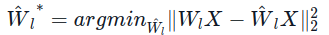
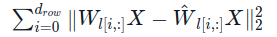

# 使用 AutoGPTQ 和 transformers 讓大語言模型更輕量化


原文: [Making LLMs lighter with AutoGPTQ and transformers](https://huggingface.co/blog/gptq-integration)

大語言模型在理解和生成人類水平的文字方面所展現出的非凡能力，正在許多領域帶來應用上的革新。然而，在消費級硬件上訓練和部署大語言模型的需求也變得越來越難以滿足。

🤗 Hugging Face 的核心使命是 {==讓優秀的機器學習普及化==} ，而這正包括了盡可能地讓所有人都能夠使用上大語言模型。本著與 [bitsandbytes](https://huggingface.co/blog/4bit-transformers-bitsandbytes) 合作一樣的精神，我們將 [AutoGPTQ 代碼庫](https://github.com/PanQiWei/AutoGPTQ)集成到了 Transformers 中，讓用戶使用 **GPTQ** 算法([Frantar et al. 2023](https://arxiv.org/pdf/2210.17323.pdf)) 在 8-bit、4-bit、3-bit，甚至是 2-bit 精度下量化和運行模型成為可能。當使用 4-bit 量化時，精度的下降相當微小，同時在小批量推理上保持著與 `fp16` baseline 相當的速度。需要注意的是，**GPTQ** 方法與 `bitsandbytes` 提出的訓練後量化方法有所不同：它需要在量化階段提供一個校準數據集(calibration dataset)。

本次整合支持 Nvidia GPU 和基於 RoCm-powered 的 AMD GPU。

## GPTQ 論文總結

通常，量化方法可以分為以下兩類：

- **訓練後量化 (Post Training Quantization, PTQ)**：適度地使用一些資源來量化預訓練好的模型，如一個校準數據集和幾小時的算力。
- **量化感知訓練 (Quantization Aware Training, QAT)**：在訓練或進一步微調之前執行量化。

GPTQ 屬於訓練後量化，這對於大模型而言格外有趣且有意義，因為對其進行全參數訓練以及甚至僅僅是微調都十分昂貴。

具體而言，GPTQ 採用 `int4/fp16 (W4A16)` 的混合量化方案，其中模型權重被量化為 `int4` 數值類型，而激活值則保留在 `float16`。在推理階段，模型權重被動態地反量化回 `float16` 並在該數值類型下進行實際的運算。

該方案有以下兩方面的優點：

- `int4` 量化能夠節省接近 **4** 倍的內存，這是因為反量化操作發生在 compute unit 的 fused kernel 附近，而不是在 GPU 的全局內存中。
- 由於用於權重的 bitwidth 較低，因此可以節省數據通信的時間，從而潛在地提升了推理速度。

GPTQ 論文解決了分層壓縮的問題：

給定一個擁有權重矩陣 $W_{l}$ 和輸入 $X_{l}$ 的網絡層 $l$，我們期望獲得一個量化版本的權重矩陣 $\hat{W_{l}}$ 以最小化均方誤差 (MSE)：



一旦每層都實現了上述目標，就可以通過組合各網絡層量化結果的方式來獲得一個完整的量化模型。

為解決這一分層壓縮問題，論文作者採用了最優腦量化 (Optimal Brain Quantization, OBQ) 框架 ([Frantar et al 2022](https://arxiv.org/abs/2208.11580)) 。OBQ 方法的出發點在於其觀察到：以上等式可以改寫成權重矩陣 $W_{l}$ 每一行的平方誤差之和



這意味著我們可以獨立地對每一行執行量化。即所謂的 `per-channel quantization`。對每一行 $W_{l[i,:]}$, OBQ 在每一時刻只量化一個權重，同時更新所有未被量化的權重，以補償量化單個權重所帶來的誤差。所選權重的更新採用一個閉環公式，並利用了海森矩陣 (Hessian Matrices)。

GPTQ 論文通過引入一系列優化措施來改進上述量化框架，在降低量化算法複雜度的同時保留了模型的精度。

相較於 OBQ，GPTQ 的量化步驟本身也更快：OBQ 需要花費2 個 GPU-hours 來完成 BERT 模型(336M) 的量化，而使用 GPTQ，量化一個 Bloom 模型(176B) 則只需不到4 個GPU-hours。

為了解算法的更多細節以及在困惑度 (perplexity, PPL) 指標和推理速度上的不同測評數據，可查閱[原始論文](https://arxiv.org/pdf/2210.17323.pdf) 。

## AutoGPTQ 代碼庫

AutoGPTQ 代碼庫讓用戶能夠使用 GPTQ 方法量化 🤗 Transformers 中支持的大量模型，而社群中的其他類似的專案如 [GPTQ-for-LLaMa](https://github.com/qwopqwop200/GPTQ-for-LLaMa) 、[Exllama](https://github.com/turboderp/exllama) 和 [llama.cpp](https://github.com/ggerganov/llama.cpp/) 則主要針對 Llama 模型架構實現量化策略。相較之下，AutoGPTQ 因其對豐富的 transformers 架構的平滑覆蓋而廣受歡迎。

正 AutoGPTQ 代碼庫覆蓋了大量的 Transformers 模型，我們提供了一個 🤗 Transformers 的 API 能夠集成，讓每個人都更容易地使用大語言模型量化技術。目前，我們已經集成了包括 CUDA kernels 等最常用的模型優化選項。對於更高級的選項如使用Triton kernels 和 fused-attention compatibility，請查看 [AutoGPTQ](https://github.com/PanQiWei/AutoGPTQ) 代碼庫。

## 🤗 Transformers 對 GPTQ 的支持

在 [安裝 AutoGPTQ 代碼庫](https://github.com/PanQiWei/AutoGPTQ#quick-installation) 和 optimum (`pip install optimum`) 之後，在 Transformers 中運行 GPTQ 模型將非常簡單：

```python
from transformers import AutoModelForCausalLM

model = AutoModelForCausalLM.from_pretrained("TheBloke/Llama-2-7b-Chat-GPTQ", torch_dtype=torch.float16, device_map="auto")
```

請查閱 Transformers 的 [說明文檔](https://huggingface.co/docs/transformers/main/en/main_classes/quantization) 以了解有關所有特性的更多信息。

Hugging Face 的 AutoGPTQ 集成有以下諸多優點：

- 量化模型可被序列化並在 Hugging Face Hub 上分享。
- GPTQ 方法大大降低運行大語言模型所需的內存，同時保持著與 FP16 相當的推理速度。
- AutoGPTQ 在更廣泛的 transformers 架構上支持 Exllama 算子。
- 該集成帶有基於 RoCm 的 AMD GPU 的本地化支持。
- 能夠 [使用 PEFT 微調量化後的模型](https://huggingface.co/blog/gptq-integration#--fine-tune-quantized-models-with-peft--) 。

你可以在 Hugging Face Hub 上查看你所喜愛的模型是否已經擁有 GPTQ 量化版本。 TheBloke，Hugging Face 的頂級貢獻者之一，已經使用 AutoGPTQ 量化了大量的模型並分享在 Hugging Face Hub 上。在我們的共同努力下，這些模型倉庫都將可以與我們的集成一起開箱即用。

以下是一個使用 `batch size = 1` 的測評結果示例。該測評結果通過在 Nvidia A100-SXM4-80GB GPU 上運行得到。我們使用長度為 `512` 個 tokens 的提示文本，並精確地生成 `512` 個新 tokens。表格的第一行展示的是未量化的 fp16 baseline，另外兩行則展示使用 AutoGPTQ 不同 kernel 的內存開銷和推理性能。


|gptq	|act_order	|bits	|group_size	|kernel	|Load time (s)	|Per-token latency (ms)	|Throughput (tokens/s)	|Peak memory (MB)|
|-------|-----------|-------|-----------|-------|---------------|-----------------------|-----------------------|----------------|
|False	|None	|None	|None	|None	|26.0	|36.958	|27.058	|29152.98|
|True	|False	|4	|128	|exllama	|36.2	|33.711	|29.663	|10484.34|
|True	|False	|4	|128	|autogptq-cuda-old	|36.2	|46.44	|21.53	|10344.62|

一個更全面的、可複現的測評結果可以在[這裡](https://github.com/huggingface/optimum/tree/main/tests/benchmark#gptq-benchmark)取得。

## 使用 Optimum 量化模型

為了將 AutoGPTQ 無縫集成到 Transformers 中，我們使用了 AutoGPTQ API 的一個極簡版本，其可在 [Optimum](https://github.com/huggingface/optimum) 中獲得 —— 這是 Hugging Face 針對訓練和推理優化而開發的一個工具包。通過這種方式，我們輕鬆地實現了與 Transformers 的集成，同時，如果人們想要量化他們自己的模型，他們也完全可以單獨使用 Optimum 的 API！如果想要量化你自己的大語言模型，請查閱 Optimum 的[說明文檔](https://huggingface.co/docs/optimum/llm_quantization/usage_guides/quantization)。

只需數行代碼，即可使用 GPTQ 方法量化 🤗 Transformers 的模型：

```python
from transformers import AutoModelForCausalLM, AutoTokenizer, GPTQConfig

model_id = "facebook/opt-125m"
tokenizer = AutoTokenizer.from_pretrained(model_id)
quantization_config = GPTQConfig(bits=4, dataset = "c4", tokenizer=tokenizer)

model = AutoModelForCausalLM.from_pretrained(model_id, device_map="auto", quantization_config=quantization_config)
```

量化一個模型可能花費較長的時間。對於一個 175B 參數量的模型，如果使用一個大型校準數據集（如 `c4`），至少需要 4 個 GPU-hours。正如上面提到的那樣，許多 GPTQ 模型已經可以在 Hugging Face Hub 上被取得，這讓你在大多數情況下無需自行量化模型。當然，你仍可以使用你所專注的特定領域的數據集來量化模型。

## Text-Generation-Inference 與 GPTQ 模型

在將 GPTQ 集成到 Transformers 中的同時，[Text-Generation-Inference 代碼庫](https://github.com/huggingface/text-generation-inference) (TGI) 已經添加了 GPTQ 的支持，旨在為生產中的大語言模型提供服務。現在，GPTQ 已經可以與動態批處理、paged attention、flash attention 等特性一起被應用於 [廣泛的 transformers 模型架構](https://huggingface.co/docs/text-generation-inference/main/en/supported_models)。

例如，經由 GTPQ 的集成在讓單個 A100-80GB GPU 可載入 70B 模型！而這在使用 `fp16` 的模型權重時是不可能的，因為它超出了最大可用的 GPU 內存。

你可以在 [TGI 的說明文檔](https://huggingface.co/docs/text-generation-inference/main/en/basic_tutorials/preparing_model#quantization) 中找到更多有關 GPTQ 的用法。

需要注意的時，TGI 中集成的 kernel 不能很好地擴展到較大的批處理大小。因此，這一方式雖然節省了內存，但在較大的批處理大小上發生速度的下降是符合預期的。

## PEFT 微調量化後的模型

在常規的方法下，你無法進一步微調量化後的模型。然而，通過使用 PEFT 代碼庫，你可以在量化後的模型之上訓練適應性網絡！為實現這一目標，我們凍結了量化過的基座模型的所有網絡層，並額外添加可訓練的適應性網絡。這裡是一些關於如何使用 PEFT 訓練 GPTQ 模型的例子：[Colab 筆記本](https://colab.research.google.com/drive/1VoYNfYDKcKRQRor98Zbf2-9VQTtGJ24k?usp=sharing) 和 [微調腳本](https://gist.github.com/SunMarc/dcdb499ac16d355a8f265aa497645996) 。

## 改進空間

雖然我們的 AutoGPTQ 集成在極小的預測質量損失代價下，帶來了引人矚目的優勢。但在量化技術應用和 kernel 實現方面仍有提升的空間。

首先，儘管AutoGPTQ 已經集成了 exllama 中所實現的最佳性能的 `W4A16` kernel（權重為 `int4` 數值類型，激活值為 `fp16` 數值類型），其仍有很大的改進空間。來自 [Kim 等人](https://arxiv.org/pdf/2211.10017.pdf) 的實現和 [MIT Han Lab](https://github.com/mit-han-lab/llm-awq) 的方法似乎十分可靠。此外，根據我們的內部測評，似乎暫未有開源的高性能的 Triton 版本的 `W4A16` kernel 實現，這也是一個值得探索的方向。

在 kernel 層面，為更大的批處理大小設計高性能的 `W4A16` kernel 仍然是一大挑戰。

## 已支持的模型

在初始實現中，暫時只支持純編碼器或純解碼器架構的大語言模型。這聽起來似乎有較大的局限性，但其實已經涵蓋了當前絕大多數最先進的大語言模型，如 Llama、OPT、GPT-Neo、GPT-NeoX 等。

大型的vision、audio和 multi-modal 模型在現階段暫不被支持。

## 結論和結語

本文中，我們介紹了 Transformers 對 AutoGPTQ 代碼庫 的集成，使得社群中的任何人都可以更方便地利用 GPTQ 方法量化大語言模型，助力令人激動的大語言模型工具和應用的構建。

這一集成支持 Nvidia GPU 和基於 RoCm 的 AMD GPU，這是向支持更廣泛 GPU 架構的量化模型的普及化邁出的一大步。

與 AutoGPTQ 團隊的合作非常富有成效，我們非常感謝他們的支持和他們在該代碼庫上的工作。

我們希望本次集成將使每個人都更容易地在他們的應用程序中使用大語言模型，我們迫不及待地想要看到大家即將使用它所創造出的一切！

再次提醒不要錯過文章開頭分享的有用資源，以便更好地理解本次集成的特性以及如何快速開始使用 GPTQ 量化。

- [Original Paper](https://arxiv.org/pdf/2210.17323.pdf)
- [Basic usage Google Colab notebook](https://colab.research.google.com/drive/1_TIrmuKOFhuRRiTWN94iLKUFu6ZX4ceb?usp=sharing) —— 該筆記本上的用例展示瞭如何使用 GPTQ 方法量化你的 transformers 模型、如何進行量化模型的推理，以及如何使用量化後的模型進行微調。
- Transformers 中集成 GPTQ 的 [說明文檔](https://huggingface.co/docs/transformers/main/en/main_classes/quantization)
- Optimum 中集成 GPTQ 的 [說明文檔](https://huggingface.co/docs/optimum/llm_quantization/usage_guides/quantization)
- [TheBloke 模型倉庫](https://huggingface.co/TheBloke?sort_models=likes#models) 中的 GPTQ 模型。