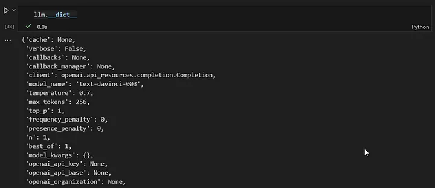

# 建立 LLM 應用程式所需了解的一切

來源: [All You Need to Know to Build Your First LLM App](https://towardsdatascience.com/all-you-need-to-know-to-build-your-first-llm-app-eb982c78ffac)


本文提供了對文件載入器、詞嵌入、向量儲存和提示模板的 step-by-step 教學內容。

<!-- more -->

本教程內容的大綱:

**簡介**

- 為什麼我們需要 LLM
- Fine-Tuning 與 Context Injection
- 什麼是 LangChain?


**Step-by-Step 教學**

1. 使用 LangChain 載入文檔
2. 將文件拆分為文字區塊
3. 從文字區塊到嵌入
4. 定義您想要使用的 LLM
5. 定義我們的提示模板
6. 創建向量存儲


## 為什麼我們需要 LLM

語言的進化至今已為人類帶來了令人難以置信的進步。它使我們能夠以我們今天所知的形式有效地共享知識和協作。因此，我們的大部分集體知識繼續透過無組織的書面文本保存和傳播。

過去二十年中為實現資訊和流程數位化而採取的舉措往往側重於在關係資料庫中累積越來越多的數據。這種方法使傳統的分析機器學習演算法能夠處理和理解我們的數據。

然而，儘管我們付出了巨大的努力以結構化的方式儲存越來越多的數據，但我們仍然無法捕獲和處理我們的全部知識。

> 公司中約 80% 的數據是非結構化的，例如工作描述、簡歷、電子郵件、文字文件、簡報檔、錄音、視訊和社交媒體等等
>
> 

GPT3.5 的開發和進步建立了一個重要的里程碑，因為它使我們能夠有效地解釋和分析不同的資料集，無論其結構或缺乏結構。如今，我們擁有可以理解和生成各種形式內容的模型，包括文字、圖像和音訊檔案。

> 那我們要如何利用他們的功能來滿足我們的需求和數據呢？

## Fine-Tuning 與 Context Injection

一般來說，我們有兩種不同的方法來使大型語言模型能夠回答 LLM 無法知道的問題：模型微調(fine-tuning)和上下文注入(context injection)。

### Fine-Tuning

**微調** 是指使用額外的資料訓練現有的語言模型，以針對特定任務進行最佳化。不是從頭開始訓練語言模型，而是使用 `BERT` 或 `LLama` 等預訓練模型，然後透過添加用例特定的訓練資料來適應特定任務的需求。

史丹佛大學的一個團隊使用了 LLM Llama，並透過使用 50,000 個使用者/模型互動的範例對其進行了微調。結果是一個與用戶互動並回答查詢的聊天機器人。這一微調步驟改變了模型與最終使用者互動的方式。

PLLM（Pre-trained Language Models）的微調是針對特定任務調整模型的一種方法，但它並不能真正允許您將自己的領域知識注入到模型中。這是因為模型已經接受了大量通用語言資料的訓練，而您的特定領域資料通常不足以涵蓋模型已經學到的內容。

因此，當您微調模型時，它偶爾可能會提供正確的答案，但通常會失敗，因為它嚴重依賴預訓練期間學到的信息，而這些信息可能不準確或與您的特定任務不相關。換句話說，微調可以幫助模型適應其溝通方式，但不一定適應其通訊內容。 （保時捷公司，2023 年）

這就是上下文注入(context injection)發揮作用的地方。

### Context Injection

當使用上下文注入(context injection)時，我們不會修改 LLM，我們專注於提示本身並將相關上下文注入到提示中。

所以我們需要思考如何為提示提供正確的資訊。在下圖中，您可以示意性地看到整個過程是如何運作的。我們需要一個能夠辨識最相關數據的流程。為此，我們需要使電腦能夠相互比較文字片段。


這可以透過嵌入(embedding)來完成。透過嵌入，我們將文字轉換為向量，從而允許我們在多維嵌入空間中表示文字。空間上彼此距離較近的點通常用於相同的上下文。為了防止這種相似性搜尋永遠持續下去，我們將向量儲存在向量資料庫中並為它們建立索引。

> 微軟向我們展示如何將其與 Bing Chat 配合使用。 Bing 將 LLM 理解語言和上下文的能力與傳統網路搜尋的效率結合起來。

本文的目的是演示創建一個簡單的解決方案的過程，該解決方案使我們能夠分析我們自己的文本和文檔，然後將從中獲得的見解合併到我們的解決方案返回給用戶的答案中。我將描述實施端到端解決方案所需的所有步驟和元件。

那我們要如何利用 LLM 的能力來滿足我們的需求呢？讓我們一步一步地看一下。

## Step by Step 教學

接下來，我們希望利用 LLM 來回應有關我們個人資料的詢問。為了實現這一目標，我首先將我們的個人資料內容傳輸到向量資料庫中。這一步至關重要，因為它使我們能夠有效地搜尋文本中的相關部分。我們將使用我們的數據中的資訊和 LLM 的能力來解釋文本以回答使用者的問題。

我們還可以根據我們提供的數據引導聊天機器人專門回答問題。這樣，我們可以確保聊天機器人始終專注於手邊的數據並提供準確且相關的回應。

為了實現我們的用例，我們將依賴 LangChain。

### 什麼是 LangChain?

> LangChain 是一個用於開發由語言模型驅動的應用程式的框架。（Langchain，2023）

因此，LangChain 是一個 Python 框架，旨在支援創建各種 LLM 應用程序，例如聊天機器人、摘要工具以及基本上任何您想要創建以利用 LLM 功能的工具。該庫結合了我們需要的各種組件。我們可以將這些組件連接到所謂的鏈中。

Langchain 最重要的模組有:

1. **Models**: 與各種模型類型的接口
2. **Prompts**: 提示管理、提示優化、提示序列化
3. **Indexes**: 文件載入器、文字拆分器、向量儲存 — 實現更快、更有效率的資料訪問
4. **Chains**: Chains 超越了單一 LLM 調用，它們允許我們設定調用序列

在下圖中，您可以看到這些組件的作用。我們使用索引模組中的文件載入器和文字分割器來載入和處理我們自己的非結構化資料。提示模組允許我們將找到的內容注入到我們的提示模板中，最後，我們使用模型的模組將提示發送到我們的模型。


5. **Agents**: 代理人是使用 LLM 來選擇要採取的行動的實體。採取行動後，他們觀察該行動的結果並重複該過程，直到任務完成。


我們在第一步中使用 Langchain 來載入文​​件、分析它們並使其可有效搜尋。在我們對文字進行索引後，識別與回答使用者問題相關的文字片段應該會變得更加有效。

我們簡單的申請所需要的當然是 LLM。我們將透過 OpenAI API 使用 GPT3.5。然後我們需要一個向量存儲，允許我們向 LLM 提供我們自己的資料。如果我們想要對不同的查詢執行不同的操作，我們需要一個代理來決定每個查詢應該發生什麼。

讓我們從頭開始。我們首先需要導入我們自己的文件。

以下介紹 LangChain 的 Loader Module 包含哪些模組來從不同來源載入不同類型的文件。

### 1.使用 Langchain 載入文檔

LangChain 能夠從各種來源載入大量文件。您可以在 LangChain 文件中找到可能的文件載入器清單。其中包括 HTML 頁面、S3 儲存桶、PDF、Notion、Google Drive 等的載入器。

對於我們的簡單範例，我們使用的資料可能未包含在 GPT3.5 的訓練資料中。我使用有關 GPT4 的維基百科文章，因為我認為 GPT3.5 對 GPT4 的了解有限。

對於這個最小的例子，我沒有使用任何 LangChain 載入器，我只是使用 BeautifulSoup 直接從維基百科 [許可證：CC BY-SA 3.0] 抓取文字。

```python
import requests
from bs4 import BeautifulSoup

url = "https://en.wikipedia.org/wiki/GPT-4"
response = requests.get(url)

soup = BeautifulSoup(response.content, 'html.parser')

# find all the text on the page
text = soup.get_text()

# find the content div
content_div = soup.find('div', {'class': 'mw-parser-output'})

# remove unwanted elements from div
unwanted_tags = ['sup', 'span', 'table', 'ul', 'ol']
for tag in unwanted_tags:
    for match in content_div.findAll(tag):
        match.extract()

print(content_div.get_text())
```


### 2. 將我們的文件分割成文字片段

接下來，我們必須將文字分成更小的部分，稱為文字區塊。每個文字區塊代表嵌入空間中的一個資料點，允許電腦確定這些區塊之間的相似性。

以下文字片段利用了 langchain 的文字分割器模組。在這種特殊情況下，我們指定區塊大小為 100，區塊重疊為 20。使用較大的文字區塊很常見，但您可以進行一些實驗來找到適合您的用例的最佳大小。您只需要記住，每個 LLM 都有標記限制（GPT 3.5 為 4000 個標記）。由於我們要將文字區塊插入提示中，因此需要確保整個提示不超過 4000 個標記。

```python
from langchain.text_splitter import RecursiveCharacterTextSplitter


article_text = content_div.get_text()


text_splitter = RecursiveCharacterTextSplitter(
    # Set a really small chunk size, just to show.
    chunk_size = 100,
    chunk_overlap  = 20,
    length_function = len,
)


texts = text_splitter.create_documents([article_text])
print(texts[0])
print(texts[1])
```


這將我們的整個文本分割如下:


### 3.從文字區塊到 Embeddings

現在我們需要使文字組件易於理解並與我們的演算法進行比較。我們必須找到一種方法將人類語言轉換為以位元和位元組表示的數位形式。

該圖像提供了一個對大多數人來說似乎顯而易見的簡單示例。然而，我們需要找到一種方法讓電腦理解「查爾斯」這個名字與男性而不是女性相關，如果查爾斯是男性，那麼他就是國王而不是王后。


在過去的幾年裡，出現了可以做到這一點的新方法和模型。我們想要的是一種能夠將單字的意思翻譯成 n 維空間的方法，這樣我們就能夠相互比較文本塊，甚至計算它們相似性的度量。

嵌入模型試圖透過分析單字通常使用的上下文來準確地學習這一點。由於茶、咖啡和早餐經常在相同的上下文中使用，因此它們在 n 維空間中比茶和豌豆等彼此更接近。茶和豌豆聽起來很相似，但很少一起使用。


嵌入模型為我們提供了嵌入空間中每個單字的向量。最後，透過使用向量表示它們，我們能夠執行數學計算，例如計算單字之間的相似度作為數據點之間的距離。


要將文字轉換為嵌入，有多種方法，例如 Word2Vec、GloVe、fastText 或 ELMo。

**嵌入模型**

為了捕捉嵌入中單字之間的相似性，Word2Vec 使用簡單的神經網路。我們用大量文字資料訓練這個模型，並希望創建一個能夠將 n 維嵌入空間中的點分配給每個單字的模型，從而以向量的形式描述其含義。

對於訓練，我們將輸入層中的神經元分配給資料集中的每個唯一單字。在下圖中，您可以看到一個簡單的範例。在這種情況下，隱藏層僅包含兩個神經元。第二，因為我們想要將單字映射到二維嵌入空間。（現有模型實際上要大得多，因此表示更高維度空間中的單字 - 例如 OpenAI 的 Ada 嵌入模型，使用 1536 個維度）訓練過程結束後，各個權重描述了嵌入空間中的位置。

在這個例子中，我們的數據集由一個句子組成：“Google 是一家科技公司。”句子中的每個單字都充當神經網路 (NN) 的輸入。因此，我們的網路有五個輸入神經元，每個單字一個。

在訓練過程中，我們專注於預測每個輸入單字的下一個單字。當我們從句子開頭開始時，與單字「Google」對應的輸入神經元接收值 1，而其餘神經元接收值 0。我們的目標是訓練網路來預測單字「is」這個特定的場景。


實際上，學習嵌入模型的方法有很多種，每種方法都有自己獨特的方式來預測訓練過程中的輸出。兩種常用的方法是CBOW（連續詞袋）和Skip-gram。

在 CBOW 中，我們將周圍的單字作為輸入，旨在預測中間的單字。相反，在 Skip-gram 中，我們將中間的單字作為輸入，並嘗試預測出現在其左側和右側的單字。不過，我不會深入研究這些方法的複雜性。可以說，這些方法為我們提供了嵌入，它們是透過分析大量文字資料的上下文來捕獲單字之間關係的表示。


如果您想了解有關嵌入的更多信息，互聯網上有大量信息。但是，如果您更喜歡直覺的逐步指南，您可能會發現觀看 Josh Starmer 的 StatQuest on Word Embedding 和 Word2Vec 會有所幫助。

我剛剛嘗試使用二維嵌入空間中的簡單範例來解釋的內容也適用於更大的模型。例如，標準的 Word2Vec 向量有 300 維，而 OpenAI 的 Ada 模型有 1536 維。這些預先訓練的向量使我們能夠精確地捕獲單字及其含義之間的關係，以便我們可以用它們進行計算。例如，使用這些向量，我們可以發現法國+柏林-德國=巴黎，並且更快+溫暖-快速=更​​溫暖。


在下文中，我們不僅要使用 OpenAI API 來使用 OpenAI 的 LLM，還要利用其嵌入模型。

**OpenAI 嵌入模型**

與 OpenAI 的各種 LLM 類似，您也可以在各種嵌入模型之間進行選擇，例如 Ada、Davinci、Curie 和 Babbage。其中，Ada-002是目前速度最快、性價比最高的型號，而達文西一般提供最高的精度和性能。但是，您需要親自嘗試並找到適合您的用例的最佳模型。如果您有興趣詳細了解 OpenAI Embeddings，可以參考 [OpenAI 文件](https://platform.openai.com/docs/guides/embeddings/what-are-embeddings)。

我們嵌入模型的目標是將文字塊轉換為向量。對於第二代 Ada，這些向量具有 1536 個輸出維度，這意味著它們表示 1536 維空間內的特定位置或方向。

OpenAI 在其文件中對這些嵌入向量的描述如下：

> “Embeddings that are numerically similar are also semantically similar. For example, the embedding vector of “canine companions say” will be more similar to the embedding vector of “woof” than that of “meow.” (OpenAI, 2022)

我們使用 OpenAI 的 API 將文字片段轉換為嵌入，如下所示：

```python
import openai


print(texts[0])


embedding = openai.Embedding.create(
    input=texts[0].page_content, model="text-embedding-ada-002"
)["data"][0]["embedding"]


len(embedding)
```


我們將文字（例如包含「2023 文字生成語言模型」的第一個文字區塊）轉換為 1536 維的向量。透過對每個文字區塊執行此操作，我們可以在 1536 維空間中觀察哪些文字區塊彼此更接近且更相似。

試一試吧。我們的目標是透過產生問題的嵌入，然後將其與空間中的其他資料點進行比較，將使用者的問題與文字區塊進行比較。


當我們將文字區塊和使用者的問題表示為向量時，我們就獲得了探索各種數學可能性的能力。為了確定兩個資料點之間的相似性，我們需要計算它們在多維空間中的接近度，這是使用距離度量來實現的。有多種方法可用於計算點之間的距離。

常用的距離測量是餘弦相似度。因此，讓我們嘗試計算問題和文字區塊之間的餘弦相似度：

```python
import numpy as np
from numpy.linalg import norm
from langchain.text_splitter import RecursiveCharacterTextSplitter
import requests
from bs4 import BeautifulSoup
import pandas as pd
import openai

####################################################################
# load documents
####################################################################
# URL of the Wikipedia page to scrape
url = 'https://en.wikipedia.org/wiki/Prime_Minister_of_the_United_Kingdom'

# Send a GET request to the URL
response = requests.get(url)

# Parse the HTML content using BeautifulSoup
soup = BeautifulSoup(response.content, 'html.parser')

# Find all the text on the page
text = soup.get_text()

####################################################################
# split text
####################################################################
text_splitter = RecursiveCharacterTextSplitter(
    # Set a really small chunk size, just to show.
    chunk_size = 100,
    chunk_overlap  = 20,
    length_function = len,
)

texts = text_splitter.create_documents([text])

####################################################################
# calculate embeddings
####################################################################
# create new list with all text chunks
text_chunks=[]

for text in texts:
    text_chunks.append(text.page_content)

df = pd.DataFrame({'text_chunks': text_chunks})

####################################################################
# get embeddings from text-embedding-ada model
####################################################################
def get_embedding(text, model="text-embedding-ada-002"):
   text = text.replace("\n", " ")
   return openai.Embedding.create(input = [text], model=model)['data'][0]['embedding']

df['ada_embedding'] = df.text_chunks.apply(lambda x: get_embedding(x, model='text-embedding-ada-002'))

####################################################################
# calculate the embeddings for the user's question
####################################################################
users_question = "What is GPT-4?"

question_embedding = get_embedding(text=users_question, model="text-embedding-ada-002")

# create a list to store the calculated cosine similarity
cos_sim = []

for index, row in df.iterrows():
   A = row.ada_embedding
   B = question_embedding

   # calculate the cosine similarity
   cosine = np.dot(A,B)/(norm(A)*norm(B))

   cos_sim.append(cosine)

df["cos_sim"] = cos_sim
df.sort_values(by=["cos_sim"], ascending=False)
```


現在，我們可以選擇要提供給 LLM 的文字區塊數量，以回答問題。

下一步是確定我們想要使用哪個 LLM。

### 4. 定義您要使用的模型

Langchain 提供了多種模型和集成，包括 OpenAI 的 GPT 和 Huggingface 等。如果我們決定使用 OpenAI 的 GPT 作為我們的大型語言模型，第一步就是定義我們的 API 金鑰。目前，OpenAI 提供了一些免費使用容量，但一旦我們每月超過一定數量的代幣，我們就需要切換到付費帳戶。

如果我們使用 GPT 來回答類似於如何使用 Google 的簡短問題，成本仍然相對較低。然而，如果我們使用 GPT 來回答需要提供廣泛上下文的問題，例如個人數據，則查詢可以快速累積數千個標計。這大大增加了成本。但不用擔心，您可以設定成本限制。

**什麼是 token?**

簡單來說，令牌基本上就是一個單字或一組單字。然而，在英語中，單字可以有不同的形式，例如動詞時態、複數或複合詞。為了解決這個問題，我們可以使用子字標記化，它將一個單字分解成更小的部分，例如它的字根、前綴、後綴和其他語言元素。例如，單字“tiresome”可以分為“tire”和“some”，而“tired”可以分為“tire”和“d”。如此一來，我們就可以認識到「tiresome」和「tired」同根同源，有相似的派生關係。

OpenAI 在其網站上提供了一個令牌產生器，以了解令牌是什麼。根據 OpenAI 的說法，對於常見的英語文本，一個令牌通常對應於約 4 個字元的文本。這相當於大約 3/4 個單字（因此 100 個標記 ~= 75 個單字）。您可以在 OpenAI 的網站上找到一個 Tokenizer 應用程序，它可以讓您了解什麼是真正的 token。

您可以在 OpenAI 的使用者帳戶中找到 API 金鑰。最簡單的方法是在 Google 中搜尋「OpenAI API 金鑰」。這將直接帶您進入設定頁面，以建立新密鑰。

若要在 Python 中使用，您必須將金鑰儲存為名稱為「OPENAI_API_KEY」的新環境變數：

```python
import os
os.environ["OPENAI_API_KEY"] = "testapikey213412"
```

當您選擇要使用的LLM時，您可以預設一些參數。 OpenAI Playground 讓您可以在決定要使用哪些設定之前嘗試不同的參數。

在 Playground WebUI 的右側，您會發現 OpenAI 提供的幾個參數，使我們能夠影響 LLM 的輸出。值得探索的兩個參數是模型選擇和溫度。

您可以從各種不同的型號中進行選擇。 Text-davinci-003 模型是目前最大、最強的。另一方面，像 Text-ada-001 這樣的型號更小、更快、更具成本效益。

下面，您可以看到 OpenAI 定價清單的摘要。與最強大的車型 Davinci 相比，Ada 更便宜。因此，如果 Ada 的性能滿足我們的需求，我們不僅可以節省資金，還可以實現更短的回應時間。

您可以從使用 Davinci 開始，然後評估我們是否也可以使用 Ada 獲得足夠好的結果。

那麼讓我們在 Jupyter Notebook 中試試看。我們正在使用 langchain 連接到 GPT。

```python
from langchain.llms import OpenAI

llm = OpenAI(temperature=0.7)
```

如果您想查看包含所有屬性的列表，請使用 __dict__：

```python
llm.__dict__
```



如果我們不指定特定模型，langchain 連接器預設使用「text-davinci-003」。

現在，我們可以直接在 Python 中呼叫該模型。只需呼叫 llm 函數並提供提示作為輸入。


您現在可以向 GPT 詢問任何有關人類常識的問題。


GPT 只能提供有關其訓練資料中未包含的主題的有限資訊。這包括未公開的具體細節或上次更新訓練資料後發生的事件。

那麼，我們如何確保模型能夠回答有關時事的問題呢？

如前所述，有一種方法可以做到這一點。我們需要在提示中為模型提供必要的資訊。

為了回答有關英國現任首相的問題，我向提示提供了維基百科文章“英國首相”中的信息。總結一下這個過程，我們是：

1. 正在載入文章
2. 將文字拆分為文字區塊
3. 計算文字區塊的嵌入
4. 計算所有文字區塊與使用者問題之間的相似度

```python
import requests
from bs4 import BeautifulSoup
from langchain.text_splitter import RecursiveCharacterTextSplitter
import numpy as np
from numpy.linalg import norm
import pandas as pd
import openai

####################################################################
# load documents
####################################################################
# URL of the Wikipedia page to scrape
url = 'https://en.wikipedia.org/wiki/Prime_Minister_of_the_United_Kingdom'

# Send a GET request to the URL
response = requests.get(url)

# Parse the HTML content using BeautifulSoup
soup = BeautifulSoup(response.content, 'html.parser')

# Find all the text on the page
text = soup.get_text()

####################################################################
# split text
####################################################################
text_splitter = RecursiveCharacterTextSplitter(
    # Set a really small chunk size, just to show.
    chunk_size = 100,
    chunk_overlap  = 20,
    length_function = len,
)

texts = text_splitter.create_documents([text])

####################################################################
# calculate embeddings
####################################################################
# create new list with all text chunks
text_chunks=[]

for text in texts:
    text_chunks.append(text.page_content)

df = pd.DataFrame({'text_chunks': text_chunks})

# get embeddings from text-embedding-ada model
def get_embedding(text, model="text-embedding-ada-002"):
   text = text.replace("\n", " ")
   return openai.Embedding.create(input = [text], model=model)['data'][0]['embedding']

df['ada_embedding'] = df.text_chunks.apply(lambda x: get_embedding(x, model='text-embedding-ada-002'))

####################################################################
# calculate similarities to the user's question
####################################################################
# calcuate the embeddings for the user's question
users_question = "Who is the current Prime Minister of the UK?"
question_embedding = get_embedding(text=users_question, model="text-embedding-ada-002")
```

現在我們嘗試找到與用戶問題最相似的文字區塊：

```python
from langchain import PromptTemplate
from langchain.llms import OpenAI

# calcuate the embeddings for the user's question
users_question = "Who is the current Prime Minister of the UK?"
question_embedding = get_embedding(text=users_question, model="text-embedding-ada-002")

# create a list to store the calculated cosine similarity
cos_sim = []

for index, row in df.iterrows():
   A = row.ada_embedding
   B = question_embedding

   # calculate the cosine similiarity
   cosine = np.dot(A,B)/(norm(A)*norm(B))

   cos_sim.append(cosine)

df["cos_sim"] = cos_sim
df.sort_values(by=["cos_sim"], ascending=False)
```


文字區塊看起來相當混亂，但讓我們嘗試一下，看看 GPT 是否足夠聰明來處理它。

現在我們已經確定了可能包含相關資訊的文字片段，我們可以測試我們的模型是否能夠回答問題。為了實現這一目標，我們必須以一種能夠清楚地向模型傳達我們期望的任務的方式來建立我們的提示。

### 5. 定義我們的提示模板

現在我們有了包含我們正在尋找的資訊的文字片段，我們需要建立一個提示。在提示中，我們也指定模型回答問題所需的模式。當我們定義模式時，我們指定了我們希望 LLM 產生答案的所需行為風格。

LLM 可用於各種任務，以下是各種可能性的一些範例：

- **Summarization**: “Summarize the following text into 3 paragraphs for executives: [TEXT]
- **Knowledge extraction**: “Based on this article: [TEXT], what should people consider before purchasing a home?”
- **Writing content (e.g. mails, messages, code)**: Write an email to Jane asking for an update on the document for our project. Use an informal, friendly tone.”
- **Grammar and style improvements**: “Correct this to standard English and change the tone to a friendlier one: [TEXT]
- **Classification**: “Classify each message as a type of support ticket: [TEXT]”

對於我們的範例，我們希望實作一個從維基百科提取資料並像聊天機器人一樣與用戶互動的解決方案。我們希望它像積極主動、樂於助人的服務台專家一樣回答問題。

為了引導 LLM 朝正確的方向發展，我在提示中加入以下說明：

> “You are a chatbot that loves to help people! Answer the following question using only the context provided. If you’re unsure and the answer isn’t explicitly in the context, say “Sorry, I don’t know how to help you.”

透過這樣做，我設定了一個限制，只允許 GPT 使用儲存在我們資料庫中的資訊。這項限制使我們能夠提供聊天機器人產生回應所依賴的來源，這對於可追溯性和建立信任至關重要。此外，它還幫助我們解決產生不可靠資訊的問題，並使我們能夠提供可在企業環境中用於決策目的的答案。

作為上下文，我只是使用與問題相似度最高的前 50 個文字區塊。文字區塊的大小可能會更好，因為我們通常可以用一兩個文字段落來回答大多數問題。但我將讓您自行確定最適合您的用例的尺寸。

```python
from langchain import PromptTemplate
from langchain.llms import OpenAI
import openai
import requests
from bs4 import BeautifulSoup
from langchain.text_splitter import RecursiveCharacterTextSplitter
import numpy as np
from numpy.linalg import norm
import pandas as pd
import openai

####################################################################
# load documents
####################################################################
# URL of the Wikipedia page to scrape
url = 'https://en.wikipedia.org/wiki/Prime_Minister_of_the_United_Kingdom'

# Send a GET request to the URL
response = requests.get(url)

# Parse the HTML content using BeautifulSoup
soup = BeautifulSoup(response.content, 'html.parser')

# Find all the text on the page
text = soup.get_text()

####################################################################
# split text
####################################################################
text_splitter = RecursiveCharacterTextSplitter(
    # Set a really small chunk size, just to show.
    chunk_size = 100,
    chunk_overlap  = 20,
    length_function = len,
)

texts = text_splitter.create_documents([text])

####################################################################
# calculate embeddings
####################################################################
# create new list with all text chunks
text_chunks=[]

for text in texts:
    text_chunks.append(text.page_content)

df = pd.DataFrame({'text_chunks': text_chunks})

# get embeddings from text-embedding-ada model
def get_embedding(text, model="text-embedding-ada-002"):
   text = text.replace("\n", " ")
   return openai.Embedding.create(input = [text], model=model)['data'][0]['embedding']

df['ada_embedding'] = df.text_chunks.apply(lambda x: get_embedding(x, model='text-embedding-ada-002'))

####################################################################
# calculate similarities to the user's question
####################################################################
# calcuate the embeddings for the user's question
users_question = "Who is the current Prime Minister of the UK?"
question_embedding = get_embedding(text=users_question, model="text-embedding-ada-002")

# create a list to store the calculated cosine similarity
cos_sim = []

for index, row in df.iterrows():
   A = row.ada_embedding
   B = question_embedding

   # calculate the cosine similiarity
   cosine = np.dot(A,B)/(norm(A)*norm(B))

   cos_sim.append(cosine)

df["cos_sim"] = cos_sim
df.sort_values(by=["cos_sim"], ascending=False)

####################################################################
# build a suitable prompt and send it
####################################################################
# define the LLM you want to use
llm = OpenAI(temperature=1)

# define the context for the prompt by joining the most relevant text chunks
context = ""

for index, row in df[0:50].iterrows():
    context = context + " " + row.text_chunks

# define the prompt template
template = """
You are a chat bot who loves to help people! Given the following context sections, answer the
question using only the given context. If you are unsure and the answer is not
explicitly writting in the documentation, say "Sorry, I don't know how to help with that."

Context sections:
{context}

Question:
{users_question}

Answer:
"""

prompt = PromptTemplate(template=template, input_variables=["context", "users_question"])

# fill the prompt template
prompt_text = prompt.format(context = context, users_question = users_question)
llm(prompt_text)
```

透過使用該特定模板，我將上下文和使用者的問題合併到我們的提示中。結果回應如下：


令人驚訝的是，即使是這個簡單的實現似乎也產生了一些令人滿意的結果。讓我們繼續向系統詢問一些有關英國首相的問題。我將保持一切不變，僅替換用戶的問題：

```python
users_question = "Who was the first Prime Minister of the UK?"
```


它似乎在某種程度上發揮了作用。然而，我們現在的目標是將這個緩慢的過程轉變為穩健且有效率的過程。為了實現這一目標，我們引入了一個索引步驟，將嵌入和索引儲存在向量儲存中。這將提高整體性能並減少響應時間。

### 6. 建立向量儲存

向量儲存是一種資料儲存類型，針對儲存和檢索可表示為向量的大量資料進行了最佳化。這些類型的資料庫允許基於各種標準（例如相似性度量或其他數學運算）有效地查詢和檢索資料子集。

將我們的文字資料轉換為向量是第一步，但這還不足以滿足我們的需求。如果我們將向量儲存在資料框中，並在每次收到查詢時逐步搜尋單字之間的相似性，那麼整個過程將非常慢。

為了有效地搜尋嵌入，我們需要對它們建立索引。索引是向量資料庫的第二個重要組成部分。索引提供了一種將查詢對應到向量儲存中最相關的文件或項目的方法，而無需計算每個查詢和每個文件之間的相似性。

近年來，已經發布了許多向量儲存。尤其是在 LLM 領域，向量儲存的關注度呈現爆炸性成長：


現在讓我們選擇一個並在我們的用例中嘗試。與我們在前面幾節中所做的類似，我們再次計算嵌入並將它們儲存在向量儲存中。為此，我們使用 LangChain 和 chroma 中的合適模組作為向量儲存。

**1. 收集我們想要用來回答使用者問題的資料**


```python
import requests
from bs4 import BeautifulSoup
from langchain.embeddings.openai import OpenAIEmbeddings
from langchain.text_splitter import CharacterTextSplitter
from langchain.vectorstores import Chroma
from langchain.document_loaders import TextLoader

# URL of the Wikipedia page to scrape
url = 'https://en.wikipedia.org/wiki/Prime_Minister_of_the_United_Kingdom'

# Send a GET request to the URL
response = requests.get(url)

# Parse the HTML content using BeautifulSoup
soup = BeautifulSoup(response.content, 'html.parser')

# Find all the text on the page
text = soup.get_text()
text = text.replace('\n', '')

# Open a new file called 'output.txt' in write mode and store the file object in a variable
with open('output.txt', 'w', encoding='utf-8') as file:
    # Write the string to the file
    file.write(text)
```

**2. 載入資料並定義如何將資料拆分為文字區塊**


```python
from langchain.text_splitter import RecursiveCharacterTextSplitter

# load the document
with open('./output.txt', encoding='utf-8') as f:
    text = f.read()

# define the text splitter
text_splitter = RecursiveCharacterTextSplitter(    
    chunk_size = 500,
    chunk_overlap  = 100,
    length_function = len,
)

texts = text_splitter.create_documents([text])
```

**3. 定義要用於計算文字區塊嵌入的嵌入模型並將其儲存在向量儲存中**


```python
from langchain.embeddings.openai import OpenAIEmbeddings
from langchain.vectorstores import Chroma

# define the embeddings model
embeddings = OpenAIEmbeddings()

# use the text chunks and the embeddings model to fill our vector store
db = Chroma.from_documents(texts, embeddings)
```

**4. 計算使用者問題的嵌入**

在我們的向量儲存中找到相似的文字區塊，並使用它們來建立我們的提示


```python
from langchain.llms import OpenAI
from langchain import PromptTemplate

users_question = "Who is the current Prime Minister of the UK?"

# use our vector store to find similar text chunks
results = db.similarity_search(
    query=user_question,
    n_results=5
)

# define the prompt template
template = """
You are a chat bot who loves to help people! Given the following context sections, answer the
question using only the given context. If you are unsure and the answer is not
explicitly writting in the documentation, say "Sorry, I don't know how to help with that."

Context sections:
{context}

Question:
{users_question}

Answer:
"""

prompt = PromptTemplate(template=template, input_variables=["context", "users_question"])

# fill the prompt template
prompt_text = prompt.format(context = results, users_question = users_question)

# ask the defined LLM
llm(prompt_text)
```


## 總結

為了使我們的 LLM 夠分析和回答有關我們數據的問題，我們通常不會對模型進行微調。相反，在微調過程中，目標是提高模型有效回應特定任務的能力，而不是教導它新資訊。

就 Alpaca 7B 而言，LLM (LLaMA) 經過微調，可以像聊天機器人一樣進行行為和互動。重點是完善模型的回應，而不是教導它全新的資訊。

因此，為了能夠回答有關我們自己的數據的問題，我們使用上下文注入方法。使用上下文注入來建立 LLM 應用程式是一個相對簡單的過程。主要挑戰在於組織和格式化要儲存在向量資料庫中的資料。此步驟對於有效檢索上下文相似資訊並確保結果可靠至關重要。

本文的目標是示範使用嵌入模型、向量儲存和 LLM 處理使用者查詢的極簡方法。它展示了這些技術如何協同工作，提供相關且準確的答案，甚至針對不斷變化的事實。

