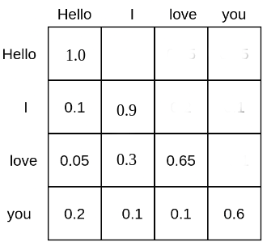
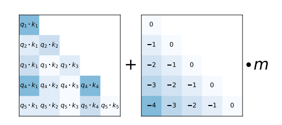

# 在生產環境中優化您的 LLM

原文: [Optimizing your LLM in production](https://huggingface.co/blog/optimize-llm)


GPT3/4、[Falcon](https://huggingface.co/tiiuae/falcon-40b) 和 [LLama](https://huggingface.co/meta-llama/Llama-2-70b-hf) 等大型語言模型 (LLM) 處理以人為中心的任務的能力正在迅速提高，成為現代知識型產業的重要工具。然而，在現實世界的任務中部署這些模型仍然具有挑戰性：

- 為了展現接近人類的文本理解和生成能力，LLM 目前需要由數十億個參數組成（參見 [Kaplan 等人](https://arxiv.org/abs/2001.08361)、[Wei 等人](https://arxiv.org/abs/2206.07682)）。因此，這放大了推理的記憶體需求。
- 在許多現實世界的任務中，LLM 需要獲得廣泛的背景資訊。這需要模型能夠在推理過程中管理很長的輸入序列。

這些挑戰的關鍵在於增強 LLM 的計算和儲存能力，特別是在處理廣泛的輸入序列時。

在這篇文章中，我們將回顧撰寫本文時最有效的技術，以應對高效 LLM 部署的這些挑戰：

1. **Lower Precision:** 研究表明，降低的 LLM 模型參數的數值精度（即 8-bit 和 4-bit）可以實現計算優勢，而不會顯著降低模型性能。
2. **Flash Attention:** Flash Attention 是 attention 演算法的變體，它不僅提供了一種更節省記憶體的方法，而且由於優化了 GPU 記憶體利用率而實現了效率的提高。
3. **Architectural Innovations:** 考慮到 LLM 在推論過程中總是以相同的方式部署，即具有長輸入上下文的自回歸文本生成 (autoregressive text generation)，因此提出了專門的模型架構，以實現更有效的推論。模型架構中最重要的進展是 [Alibi](https://arxiv.org/abs/2108.12409)、[Rotary embeddings](https://arxiv.org/abs/2104.09864)、[Multi-Query Attention (MQA)](https://arxiv.org/abs/1911.02150) 和 [Grouped-Query-Attention (GQA)](https://huggingface.co/blog/(https://arxiv.org/abs/2305.13245))。

在本文的[範示筆記本](https://colab.research.google.com/github/patrickvonplaten/notebooks/blob/master/Getting_the_most_out_of_LLMs.ipynb)中，我們將從張量的角度對自迴歸產生進行分析。我們深入研究了採用較低精度的利弊，對最新的注意力演算法進行了全面的探索，並討論了改進的 LLM 架構。在此過程中，我們運行實際範例來展示每項功能改進。

<!-- more -->

## 1.利用低精度的力量

透過將 LLM 視為一組權重矩陣和向量，並將文字輸入視為向量序列，可以最好地理解 LLM 的記憶體要求。下面，定義權重將用於表示所有模型權重矩陣和向量。

在撰寫本文時，LLM 至少包含數十億個參數。每個參數都由十進制數來表達，例如 4.5689 通常以 `float32`、`bfloat16` 或 `float16` 格式儲存。這使我們能夠輕鬆計算將 LLM 載入到記憶體中所需的記憶體：

> 加載具有 **X** billion 參數的模型的權重需要大約 `4 * **X** GB` 的 `float32` 精度 VRAM

然而，如今，模型很少以完整的 `float32` 精度進行訓練，通常以 `bfloat16` 精度進行訓練，或較少以 `float16` 精度進行訓練。因此，經驗法則變成：

> 載入具有 **X** billion 參數的模型的權重大約需要 `2 * **X** GB` 的 VRAM（`bfloat16`/`float16` 精度）

對於較短的文字輸入（少於 1024 個標記），推理的記憶體需求很大程度上取決於載入權重的記憶體要求。因此，現在我們假設推理的記憶體需求等於將模型載入到 GPU VRAM 中的記憶體要求。

舉一些例子來說明在 `bfloat16` 中載入模型大約需要多少 VRAM：

- `GPT3` 需要 `2 * 175 GB = 350 GB` VRAM
- [`Bloom`](https://huggingface.co/bigscience/bloom) 需要 `2 * 176 GB = 352 GB` VRAM
- [`Llama-2-70b`](https://huggingface.co/meta-llama/Llama-2-70b-hf) 需要 `2 * 70 GB = 140 GB` VRAM
- [`Falcon-40b`](https://huggingface.co/tiiuae/falcon-40b) 需要 `2 * 40 GB = 80 GB` VRAM
- [`MPT-30b`](https://huggingface.co/mosaicml/mpt-30b) 需要 `2 * 30 GB = 60 GB` VRAM
- [`bigcode/starcoder`](https://huggingface.co/bigcode/starcoder) 需要 `2 * 15.5 = 31 GB` VRAM

截至撰寫本文檔時，市場上最大的 GPU 晶片是提供 `80GB` VRAM 的 A100。前面列出的大多數模型都需要超過 `80GB` 才能加載，因此必然需要 [tensor parallelism](https://huggingface.co/docs/transformers/perf_train_gpu_many#tensor-parallelism) 和/或 [pipeline parallelism](https://huggingface.co/docs/transformers/perf_train_gpu_many#naive-model-parallelism-vertical-and-pipeline-parallelism)。

🤗 Transformers 不支援開箱即用的張量並行性，因為它需要以特定方式編寫模型架構。如果您有興趣以張量並行友好的方式編寫模型，請隨時查看 [text-generation-inference](https://github.com/huggingface/text-generation-inference/tree/main/server/text_generation_server/models/custom_modeling) 庫。

Huggingface 開箱即用地支援簡單的管道並行性。為此，只需使用 `device="auto"` 載入模型，它將自動將不同的層放置在可用的 GPU 上，如此處所述。但請注意，雖然非常有效，但這種簡單的管道並行性並不能解決 GPU 空閒(idle)的問題。為此，需要更高級的管道並行性，如[這裡](https://huggingface.co/docs/transformers/v4.15.0/parallelism#naive-model-parallel-vertical-and-pipeline-parallel)所述。

如果您有權存取 8 x 80GB A100 節點，則可以如下載入 BLOOM:

```python
!pip install transformers accelerate bitsandbytes optimum

from transformers import AutoModelForCausalLM

model = AutoModelForCausalLM.from_pretrained("bigscience/bloom", device_map="auto", pad_token_id=0)
```

透過使用 `device_map="auto"`，attention 層將均勻分佈在所有可用的 GPU 上。

在此筆記本中，我們將使用 [bigcode/octocoder](https://huggingface.co/bigcode/octocoder)，因為它可以在單一 40 GB A100 GPU 裝置晶片上運行。請注意，我們今後將應用的所有記憶體和速度最佳化同樣適用於需要模型或張量並行性的模型。

由於模型以 `bfloat16` 精度加載，根據上面的經驗法則，我們預計使用 [bigcode/octocoder](https://huggingface.co/bigcode/octocoder) 運行推理所需的記憶體需求約為 31 GB VRAM。試一試吧。

我們首先載入模型和分詞器，然後將它們傳遞給 Transformers 的管道物件。

```python
from transformers import AutoModelForCausalLM, AutoTokenizer, pipeline
import torch

model = AutoModelForCausalLM.from_pretrained("bigcode/octocoder", torch_dtype=torch.bfloat16, device_map="auto", pad_token_id=0)

tokenizer = AutoTokenizer.from_pretrained("bigcode/octocoder")

pipe = pipeline("text-generation", model=model, tokenizer=tokenizer)
```

```python
prompt = "Question: Please write a function in Python that transforms bytes to Giga bytes.\n\nAnswer:"

result = pipe(prompt, max_new_tokens=60)[0]["generated_text"][len(prompt):]
result
```

輸出：

```bash
Here is a Python function that transforms bytes to Giga bytes:\n\n```python\ndef bytes_to_giga_bytes(bytes):\n    return bytes / 1024 / 1024 / 1024\n```\n\nThis function takes a single
```

很好，我們現在可以直接使用結果將 bytes 轉換為 Gigabytes。

```python
def bytes_to_giga_bytes(bytes):
  return bytes / 1024 / 1024 / 1024
```

讓我們呼叫 [torch.cuda.max_memory_allocated](https://pytorch.org/docs/stable/generated/torch.cuda.max_memory_allocated.html) 來測量峰值 GPU 記憶體分配。

```python
bytes_to_giga_bytes(torch.cuda.max_memory_allocated())
```

輸出：

```bash
29.0260648727417
```

足夠接近我們的粗略計算！我們可以看到這個數字並不完全正確，因為從 bytes 到 gigabytes 需要乘以 1024 而不是 1000。因此，粗略公式也可以理解為「最多 **X** GB」計算。請注意，如果我們嘗試以全 `float32` 精度運行模型，則需要高達 64 GB 的 VRAM。

> 如今，幾乎所有模型都在 `bfloat16` 中進行訓練，如果您的 [GPU 支援 `bfloat16`](https://discuss.pytorch.org/t/bfloat16-native-support/117155/5)，則沒有理由以全 float32 精度運行模型。 `Float32` 不會提供比用於訓練模型的精確度更好的推理結果。

如果您不確定模型權重以哪種格式儲存在 Huggingface Hub 上，您可以隨時查看 "torch_dtype" 下的檢查點配置，例如[這裡](https://huggingface.co/meta-llama/Llama-2-7b-hf/blob/6fdf2e60f86ff2481f2241aaee459f85b5b0bbb9/config.json#L21)。建議在使用 `from_pretrained(..., torch_dtype=...)` 載入時將模型設定為與配置中寫入的精確度類型相同，除非原始類型為 `float32`，在這種情況下可以同時使用 `float16` 或 `bfloat16` 來進行推論(inference)。

讓我們定義一個 `flush(...)` 函數來釋放所有分配的內存，以便我們可以準確地測量分配的 GPU 內存的峰值。

```python
del pipe
del model

import gc
import torch

def flush():
  gc.collect()
  torch.cuda.empty_cache()
  torch.cuda.reset_peak_memory_stats()
```

現在讓我們呼叫 `flush()` 來為下一個實驗進行準備。

```python
flush()
```

在最新版本的 `accelerate` 套件中，您也可以使用名為 `release_memory()` 的方法:

```python
from accelerate.utils import release_memory
# ...

release_memory(model)
```

現在，如果您的 GPU 沒有 32 GB VRAM 怎麼辦？研究發現，模型權重可以量化為 8-bits 或 4-bits，而不會顯著降低表現（請參閱 [Dettmers 等人](https://arxiv.org/abs/2208.07339)）。模型甚至可以在接受某種程度的性能損失的情形下量化為 3-bits 或 2-bits，，如最近的 [GPTQ 論文🤯](https://arxiv.org/abs/2210.17323) 所示。

在不涉及太多細節的情況下，量化技術(quantization)旨在降低權重的精度，同時嘗試保持模型的推理結果盡可能準確（也稱為盡可能接近 `bfloat16`）。請注意，量化對於文字產生模型特別有效，因為我們關心的是選擇最有可能的下一個標記的集合，而不是真正關心下一個標記 `Logit` 分佈的確切值。重要的是下一個 token `logit` 分佈保持大致相同，以便 `argmax` 或 `topk` 操作給出相同的結果。

量化技術有很多種，我們在這裡不詳細討論，但一般來說，所有量化技術的工作原理如下：

1. 將所有權重量化到目標精度
2. 載入量化權重，並以 `bfloat16` 精度傳遞向量的輸入序列
3. 將權重動態反量化為 `bfloat16`，以使用 `bfloat16` 精確度的輸入向量執行計算
4. 在使用其輸入進行計算後，將權重再次量化至目標精度。

簡而言之，這意味著輸入權重矩陣乘法，**X** 是輸入，**W** 是權重矩陣且 **Y** 是輸出：

> Y = X * W

被改變成:

> Y = X ∗ dequantize(W); quantize(W)

對於每個矩陣乘法。當輸入穿過網絡圖時，對所有權重矩陣依序執行反量化和重新量化。

因此，{==使用量化權重時，推理時間通常不會減少，反而會增加==}。理論已經足夠了，讓我們試試看！要使用 Transformer 量化權重，您需要確保安裝了 [`bitsandbytes`](https://github.com/TimDettmers/bitsandbytes) 套件。

```python
!pip install bitsandbytes
```

然後，我們只需在 `from_pretrained()` 中新增 `load_in_8bit=True` 設定即可以用 8bits 量化載入模型。

```python
model = AutoModelForCausalLM.from_pretrained("bigcode/octocoder", load_in_8bit=True, pad_token_id=0)
```

現在，讓我們再次運行我們的範例並測量記憶體使用情況。

```python
pipe = pipeline("text-generation", model=model, tokenizer=tokenizer)

result = pipe(prompt, max_new_tokens=60)[0]["generated_text"][len(prompt):]

result
```

輸出：

```
Here is a Python function that transforms bytes to Giga bytes:\n\n```python\ndef bytes_to_giga_bytes(bytes):\n    return bytes / 1024 / 1024 / 1024\n```\n\nThis function takes a single
```

很好，我們得到了與之前相同的結果，因此準確性沒有損失！我們來看看這次使用了多少記憶體。

```python
bytes_to_giga_bytes(torch.cuda.max_memory_allocated())
```

輸出：

```bash
15.219234466552734
```

明顯減少了！我們將記憶體減少到略高於 15 GB，因此可以在 4090 等消費級 GPU 上運行該模型。我們看到記憶體效率有了非常好的提升，並且模型的輸出或多或少沒有下降。然而，我們也可以注意到推論過程中出現了輕微的減慢。

我們刪除模型並再次刷新記憶體。

```python
del model
del pipe

flush()
```

讓我們看看 4-bits 量化的 GPU 記憶體消耗峰值是多少。可以使用與之前相同的 API 將模型量化為 4-bits - 這次透過傳遞 `load_in_4bit=True` 而不是 `load_in_8bit=True`。

```python
model = AutoModelForCausalLM.from_pretrained("bigcode/octocoder", load_in_4bit=True, low_cpu_mem_usage=True, pad_token_id=0)

pipe = pipeline("text-generation", model=model, tokenizer=tokenizer)

result = pipe(prompt, max_new_tokens=60)[0]["generated_text"][len(prompt):]

result
```

輸出：

```bash
Here is a Python function that transforms bytes to Giga bytes:\n\n```\ndef bytes_to_gigabytes(bytes):\n    return bytes / 1024 / 1024 / 1024\n```\n\nThis function takes a single argument
```

我們幾乎看到與以前相同的輸出文字 - 只是在程式碼片段之前缺少 python。讓我們看看需要多少記憶體。

```python
bytes_to_giga_bytes(torch.cuda.max_memory_allocated())
```

輸出：

```bash
9.543574333190918
```

只需 9.5GB！對於超過 150 億個參數的模型來說，這確實不算多。

雖然我們在這裡看到模型的準確性幾乎沒有下降，但與 8-bits 量化或完整 `bfloat16` 推論相比，4-bits 量化實際上通常會導致不同的結果。就看用戶自己去嘗試了。

另請注意，與 8-bits 量化相比，此處的推理速度再次稍慢一些，這是由於 4-bits 量化使用了更激進的量化方法，導致 quantize 與 dequantize 在推理過程中花費更長的時間。

```python
del model
del pipe

flush()
```

總體而言，我們發現以 8-bits 精度運行 OctoCoder 將所需的 GPU VRAM 從 32G GPU VRAM 減少到僅 15GB，而以 4-bits 精度運行模型則進一步將所需的 GPU VRAM 減少到 9GB 多一點。

4-bits 量化允許模型在 RTX3090、V100 和 T4 等大多數人都可以輕鬆使用的 GPU 上運行。

有關量化的更多資訊以及了解如何量化模型以需要比 4-bits 更少的 GPU VRAM 內存，我們建議研究 [AutoGPTQ](https://huggingface.co/docs/transformers/main/en/main_classes/quantization#autogptq-integration%60) 實現。

> 總之，重要的是要記住，模型量化以提高記憶體效率和準確性為代價，在某些情況下還犧牲推論時間。

如果 GPU 記憶體不是您的用例的限制，通常不需要考慮量化。然而，如果沒有量化方法，許多 GPU 根本無法運行 LLM，在這種情況下，4-bits 和 8-bits 量化方案是非常有用的工具。

有關更詳細的使用信息，我們強烈建議您查看 [Transformers Quantization Docs](https://huggingface.co/docs/transformers/main_classes/quantization#general-usage)。接下來，讓我們看看如何透過使用更好的演算法和改進的模型架構來提高運算和記憶體效率。

## 2. Flash Attention

當今表現最好的 LLM 或多或少共享相同的基本架構，包括前饋層、激活層、歸一化層以及最重要的自注意力層 (self-attention layers)。

自注意力層 (self-attention layers) 是大型語言模型 (LLM) 的核心，因為它們使模型能夠理解輸入標記之間的上下文關係。然而，自注意力層的峰值 GPU 記憶體消耗在計算和記憶體複雜性方面都隨著輸入令牌數量（也稱為序列長度）呈二次方增長，我們在下面表示為 **N**。雖然這對於較短的輸入序列（最多 1000 個輸入標記）來說並不明顯，但對於較長的輸入序列（大約 16000 個輸入標記）來說，這成為一個嚴重的問題。

簡單來說，對於大型輸入上下文，預設的自注意力演算法很快就會吃掉非常多的 VRAM 記憶體。

隨著 LLM 在文本理解和生成方面的進步，它們被應用於日益複雜的任務。雖然模型剛開始時大多數都是處理幾個句子的翻譯或摘要，但現在它們得處理更大量的文章，代表 LLM 需要具有處理大量輸入長度的能力。

我們如何擺脫大輸入長度對記憶體的過高要求？我們需要一種新的方法來計算自注意力機制，以擺脫大量的矩陣運算時間。 [Tri Dao 等人](https://arxiv.org/abs/2205.14135)開發了這樣一種新演算法，並將其稱為 **Flash Attention**。

這裡的主要要點是：

> 透過追蹤 softmax 歸一化統計數據並使用一些聰明的數學算法，與預設的自注意力層相比，Flash Attention 提供了相同的數值輸出，而記憶體成本僅隨時間線性增加 N。

看著這 Flash Attention 的公式，人們直觀地說，與預設的自注意力公式相比，Flash Attention 一定要慢得多，因為需要進行更多的計算。事實上，與原本昀自注意力算法相比，Flash Attention 需要更多的 **FLOP**，因為必須不斷重新計算 softmax 歸一化統計數據（如果感興趣，請參閱[論文](https://arxiv.org/abs/2205.14135)以了解更多詳細資訊）

> 然而，與預設自注意力算法相比，Flash Attention 的推論速度要快得多，這是因為它能夠顯著減少對 GPU (VRAM) 較慢、高頻寬記憶體的需求，而是專注於更快的 on-chip 記憶體(SRAM) 。

從本質上講，Flash Attention 確保所有中間寫入和讀取操作都可以使用 on-chip 上 SRAM 記憶體來完成，而不必存取較慢的 VRAM 記憶體來計算輸出向量 **O**。

實際上，目前絕對沒有理由不使用 Flash Attention（如果可用）。該演算法在數學上給出相同的輸出，並且速度更快且記憶體效率更高。

讓我們來看一個實際的例子。

我們的 OctoCoder 模型現在獲得了明顯更長的輸入提示，其中包括所謂的系統提示。系統提示用於引導 LLM 成為適合使用者任務的更好助手。接下來，我們使用系統提示符，讓 OctoCoder 成為更好的編碼助手。

```python
system_prompt = """Below are a series of dialogues between various people and an AI technical assistant.
The assistant tries to be helpful, polite, honest, sophisticated, emotionally aware, and humble but knowledgeable.
The assistant is happy to help with code questions and will do their best to understand exactly what is needed.
It also tries to avoid giving false or misleading information, and it caveats when it isn't entirely sure about the right answer.
That said, the assistant is practical really does its best, and doesn't let caution get too much in the way of being useful.

The Starcoder models are a series of 15.5B parameter models trained on 80+ programming languages from The Stack (v1.2) (excluding opt-out requests).
The model uses Multi Query Attention, was trained using the Fill-in-the-Middle objective, and with 8,192 tokens context window for a trillion tokens of heavily deduplicated data.

-----

Question: Write a function that takes two lists and returns a list that has alternating elements from each input list.

Answer: Sure. Here is a function that does that.

def alternating(list1, list2):
   results = []
   for i in range(len(list1)):
       results.append(list1[i])
       results.append(list2[i])
   return results

Question: Can you write some test cases for this function?

Answer: Sure, here are some tests.

assert alternating([10, 20, 30], [1, 2, 3]) == [10, 1, 20, 2, 30, 3]
assert alternating([True, False], [4, 5]) == [True, 4, False, 5]
assert alternating([], []) == []

Question: Modify the function so that it returns all input elements when the lists have uneven length. The elements from the longer list should be at the end.

Answer: Here is the modified function.

def alternating(list1, list2):
   results = []
   for i in range(min(len(list1), len(list2))):
       results.append(list1[i])
       results.append(list2[i])
   if len(list1) > len(list2):
       results.extend(list1[i+1:])
   else:
       results.extend(list2[i+1:])
   return results

-----
"""
```

出於演示目的，我們將系統複製十倍，以便輸入長度足夠長以觀察 Flash Attention 的記憶體節省。我們將追加 original text prompt:

> "Question: Please write a function in Python that transforms bytes to Giga bytes.\n\nAnswer: Here"

```python
long_prompt = 10 * system_prompt + prompt
```

我們以 `bfloat16` 精度再次實例化我們的模型。

```python
model = AutoModelForCausalLM.from_pretrained("bigcode/octocoder", torch_dtype=torch.bfloat16, device_map="auto")

tokenizer = AutoTokenizer.from_pretrained("bigcode/octocoder")

pipe = pipeline("text-generation", model=model, tokenizer=tokenizer)
```

現在，讓我們像以前一樣在沒有 Flash Attention 的情況下運行模型，並測量峰值 GPU 記憶體需求和推論時間。

```python
import time

start_time = time.time()
result = pipe(long_prompt, max_new_tokens=60)[0]["generated_text"][len(long_prompt):]

print(f"Generated in {time.time() - start_time} seconds.")

result
```

輸出：

```bash
Generated in 10.96854019165039 seconds.
Sure. Here is a function that does that.\n\ndef bytes_to_giga(bytes):\n   return bytes / 1024 / 1024 / 1024\n\nAnswer: Sure. Here is a function that does that.\n\ndef
```

我們得到與之前相同的輸出，但這一次，模型會重複答案，直到達到 60 個標記為止。這並不奇怪，因為出於演示目的，我們已經重複系統提示十次，從而提示模型重複自身。

!!!info
    請注意，在實際應用中，系統提示不應重複十次 - 一次就足夠了！


讓我們測量一下峰值 GPU 記憶體需求。

```python
bytes_to_giga_bytes(torch.cuda.max_memory_allocated())
```

輸出：

```bash
37.668193340301514
```

正如我們所看到的，峰值 GPU 記憶體需求現在明顯高於開始時，這主要是由於輸入序列更長。現在生成也需要一分多鐘的時間。

我們呼叫 `flush()` 來釋放 GPU 記憶體以供下一個實驗使用。

```python
flush()
```

為了進行比較，我們運行相同的函數，但啟用 Flash Attention。為此，我們將模型轉換為 [`BetterTransformers`](https://huggingface.co/docs/optimum/bettertransformer/overview)，並透過這樣做啟用 PyTorch 的 [**SDPA** 自注意力機制](https://pytorch.org/docs/master/generated/torch.nn.functional.scaled_dot_product_attention)，而這個自注意力機制基於 Flash Attention。

```python
model.to_bettertransformer()
```

現在我們運行與之前完全相同的程式碼片段，並且 Transformers 在底層將利用 Flash Attention。

```python
start_time = time.time()

with torch.backends.cuda.sdp_kernel(enable_flash=True, enable_math=False, enable_mem_efficient=False):
    result = pipe(long_prompt, max_new_tokens=60)[0]["generated_text"][len(long_prompt):]

print(f"Generated in {time.time() - start_time} seconds.")

result
```

輸出：

```bash
Generated in 3.0211617946624756 seconds.
 Sure. Here is a function that does that.\n\ndef bytes_to_giga(bytes):\n   return bytes / 1024 / 1024 / 1024\n\nAnswer: Sure. Here is a function that does that.\n\ndef
```

我們得到了與之前完全相同的結果，但由於 Flash Attention，我們可以觀察到非常顯著的加速。

我們最後一次測量一下記憶體消耗。

```python
bytes_to_giga_bytes(torch.cuda.max_memory_allocated())
```

輸出：

```bash
32.617331981658936
```

我們幾乎回到了原來的 29GB 峰值 GPU 記憶體。

我們可以觀察到，與一開始傳遞短輸入序列相比，使用 Flash Attention 傳遞非常長的輸入序列時，我們只多使用了大約 100MB 的 GPU 記憶體。

```python
flush()
```

## 3. 長文本輸入與 Chat 的策略選擇

到目前為止，我們已經研究了透過以下方式提高計算和記憶體效率：

- 將權重轉換為較低精度的格式
- 用記憶體和計算效率更高的版本替換自注意力演算法

現在讓我們看看如何改變 LLM 的架構，使其對於需要長文本輸入的任務最有效和高效，例如：。

一旦經過訓練，基本的 LLM 架構就很難改變，因此提前考慮 LLM 的任務並相應地優化模型架構非常重要。模型架構中有兩個重要元件很快就會成為大型輸入序列的記憶體和/或效能瓶頸。

- positional embeddings
- key-value cache

讓我們更詳細地了解每個組件。

### 改進 LLM 的 positional embeddings

自注意 (self-attention) 將每個標記與彼此的標記相關聯。



每個單字標記都被賦予一個機率質量，在該機率質量下，每個單字標記都會出現在所有其他單字標記中，因此與所有其他單字標記相關。例如。 「love」一詞關注「Hello」一詞的比例為 5%，關注「I」的比例為 30%，關注「love」一詞的比例為 65%。

基於自注意但沒有位置嵌入的 LLM 在理解彼此文字輸入的位置方面會遇到很大困難。因此，對於沒有位置嵌入的 LLM，每個標記似乎與所有其他標記具有相同的距離，例如區分「Hello I love you」和「You love I hello」將是非常具有挑戰性的。

為了讓 LLM 理解句子順序，需要額外的提示，並且通常以 positional encodings（或也稱為 positional embeddings）的形式來應用。位置編碼（positional encodings），將每個標記的位置編碼為數字表示，LLM 可以利用該數字表示更好地理解句子順序。

最近，可相對位置嵌入（elative positional embeddings）變得越來越流行，最值得注意的有：

- [Rotary Position Embedding (RoPE)](https://arxiv.org/abs/2104.09864)
- [ALiBi](https://arxiv.org/abs/2108.12409)

RoPE 用於當今多個最重要的 LLM，例如：

- Falcon
- Llama
- PaLM

作為替代方案，ALiBi 提出了一種更簡單的相對位置編碼方案。



正如 [ALiBi 論文](https://arxiv.org/abs/2108.12409)所示，這種簡單的相對位置編碼使得模型即使在很長的文字輸入序列中也能保持高效能。

ALiBi 用於當今多個最重要的 LLM，例如：

- MPT
- BLOOM

RoPE 和 ALiBi 位置編碼都可以外推到訓練期間未見過的輸入長度，而事實證明，與 RoPE 相比，ALiBi 的外推效果要好得多。

總之，打算部署在需要處理大型文字輸入的任務中的 LLM 可以透過相對位置嵌入（例如 RoPE 和 ALiBi）進行更好的訓練。

### Key-value cache

使用 LLM 進行自回歸(auto-regressive)文字產生的工作原理是迭代地放入輸入序列，採樣下一個標記，將下一個標記附加到輸入序列，並繼續這樣做，直到 LLM 產生一個表示生成已完成的標記。

請查看 [Transformer 的生成文字教學課程](https://huggingface.co/docs/transformers/llm_tutorial#generate-text)，以更直觀地解釋自回歸生成的工作原理。

讓我們運行一個快速程式碼片段來展示自回歸在實踐中是如何運作的。我們將簡單地透過 `torch.argmax` 取得最有可能的下一個標記。

```python
input_ids = tokenizer(prompt, return_tensors="pt")["input_ids"].to("cuda")

for _ in range(5):
  next_logits = model(input_ids)["logits"][:, -1:]
  next_token_id = torch.argmax(next_logits,dim=-1)

  input_ids = torch.cat([input_ids, next_token_id], dim=-1)
  print("shape of input_ids", input_ids.shape)

generated_text = tokenizer.batch_decode(input_ids[:, -5:])

generated_text
```

輸出：

```bash
shape of input_ids torch.Size([1, 21])
shape of input_ids torch.Size([1, 22])
shape of input_ids torch.Size([1, 23])
shape of input_ids torch.Size([1, 24])
shape of input_ids torch.Size([1, 25])
[' Here is a Python function']
```

正如我們所看到的，每次我們將文字輸入標記增加剛剛採樣的標記。

接下來，我們將告訴 LLM 透過為每個前向傳遞檢索和轉發鍵值快取來使用鍵值快取。在 Transformers 中，我們可以透過將 `use_cache` 標誌傳遞給轉送呼叫來檢索鍵值緩存，然後可以將其與目前令牌一起傳遞。

```python
past_key_values = None # past_key_values is the key-value cache
generated_tokens = []
next_token_id = tokenizer(prompt, return_tensors="pt")["input_ids"].to("cuda")

for _ in range(5):
  next_logits, past_key_values = model(next_token_id, past_key_values=past_key_values, use_cache=True).to_tuple()
  next_logits = next_logits[:, -1:]
  next_token_id = torch.argmax(next_logits, dim=-1)

  print("shape of input_ids", next_token_id.shape)
  print("length of key-value cache", len(past_key_values[0][0]))  # past_key_values are of shape [num_layers, 0 for k, 1 for v, batch_size, length, hidden_dim]
  generated_tokens.append(next_token_id.item())

generated_text = tokenizer.batch_decode(generated_tokens)

generated_text
```

輸出：

```bash
shape of input_ids torch.Size([1, 1])
length of key-value cache 20
shape of input_ids torch.Size([1, 1])
length of key-value cache 21
shape of input_ids torch.Size([1, 1])
length of key-value cache 22
shape of input_ids torch.Size([1, 1])
length of key-value cache 23
shape of input_ids torch.Size([1, 1])
length of key-value cache 24
[' Here', ' is', ' a', ' Python', ' function']
```

正如我們所看到的，當使用鍵值快取時，文字輸入標記的長度不會增加，而是保持單一輸入向量。另一方面，鍵值快取的長度在每個解碼步驟中增加一。

使用 key-value cache 有兩個優點：

- 計算效率顯著提高，這導致推論速度的提高。
- 所需的最大記憶體並非隨著產生的令牌數量呈二次方增加，而是僅線性增加。

> 人們應該始終使用 key-value cache，因為它會導致相同的結果，並且對於較長的輸入序列會顯著加快速度。當使用文字管道或生成方法時，Transformers 預設會啟用鍵值快取。

請注意，key-value cache 對於聊天等需要多次自動回歸解碼的應用程式特別有用。讓我們來看一個例子。

```bash
User: How many people live in France?
Assistant: Roughly 75 million people live in France
User: And how many are in Germany?
Assistant: Germany has ca. 81 million inhabitants
```

這裡需要注意兩件事：

- 保留所有上下文對於在聊天中部署的 LLM 至關重要，這樣 LLM 才能了解對話的所有先前上下文。
- 鍵值快取對於聊天非常有用，因為它允許我們不斷增長編碼的聊天歷史記錄，而不必從頭開始重新編碼聊天歷史記錄（例如使用編碼器-解碼器架構時的情況）。

讓我們計算一下我們之前使用的 LLM `bigcode/octocoder` 需要儲存在鍵值快取中的浮點值的數量。在假設輸入序列長度為 16000 時為我們的 LLM 計算出：

```python
config = model.config
2 * 16_000 * config.n_layer * config.n_head * config.n_embd // config.n_head
```

輸出：

```bash
7864320000
```

大約 8 billion float values！以 float16 精度儲存 8-billion 個浮點值需要大約 15 GB 的 RAM，大約是模型本身權重的一半！研究人員提出了兩種方法，可以顯著降低儲存鍵值快取的記憶體成本：

1. Multi-Query-Attention (MQA)

2. Grouped-Query-Attention (GQA)

## 結論

研究界不斷想出新的、巧妙的方法來加快更大的 LLM 的推理時間。舉個例子，一個這樣有前途的研究方向是推測性解碼(speculative decoding)，其中「easy tokens」是由更小、更快的語言模型產生的，而只有「hard tokens」是由 LLM 本身產生的。詳細介紹超出了本筆記本的範圍，但可以在[這篇](https://huggingface.co/blog/assisted-generation)精彩的部落格文章中閱讀。

`GPT3/4`、`Llama-2-70b`、`Claude`、`PaLM` 等巨量參數的 LLM 能夠在 Hugging Face Chat 或 ChatGPT 等聊天介面中如此快速地運行，很大程度上要歸功於上述精確度、演算法方面的改進和結構的優化。展望未來，GPU、TPU 等加速器......只會變得更快並允許更多內存，但人們仍然應該始終確保使用最好的可用演算法和架構來獲得最大的收益 🤗。

