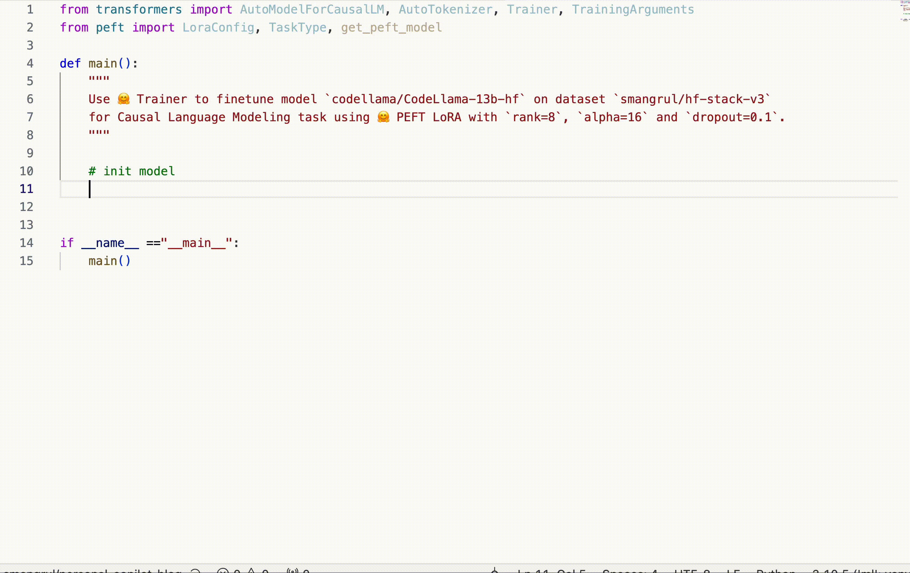
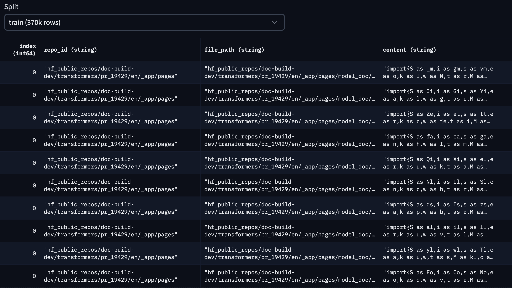
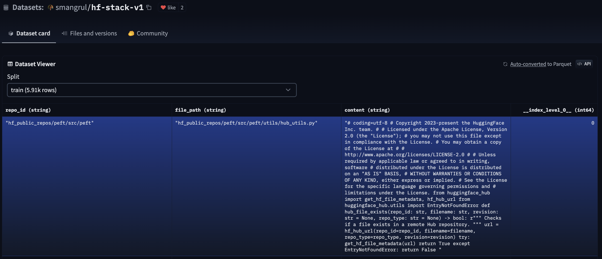
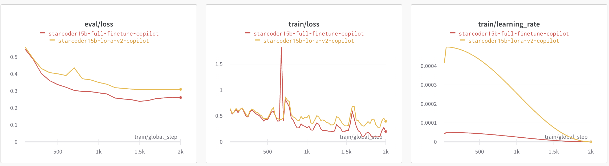
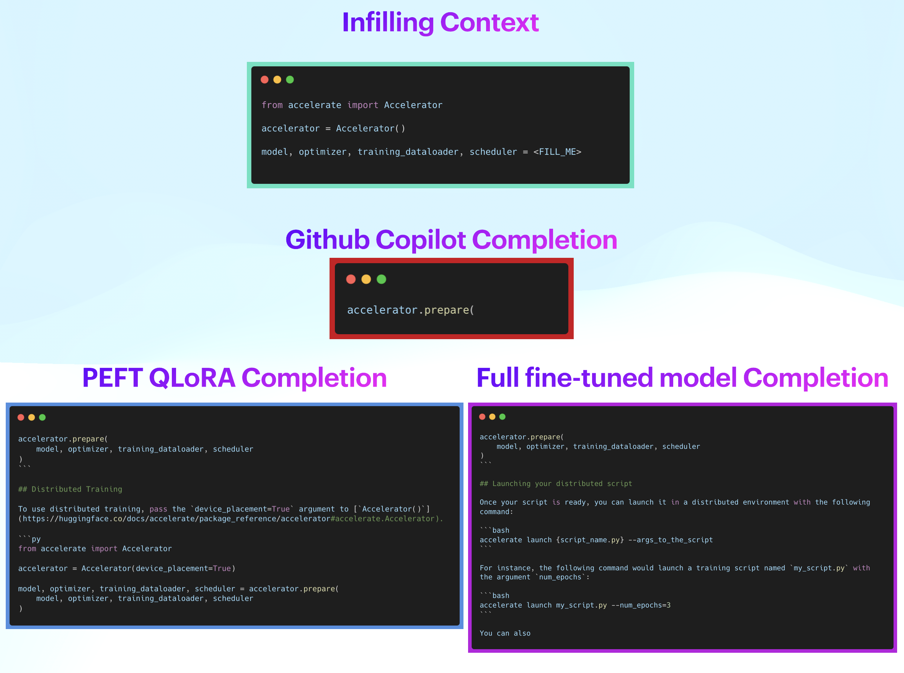
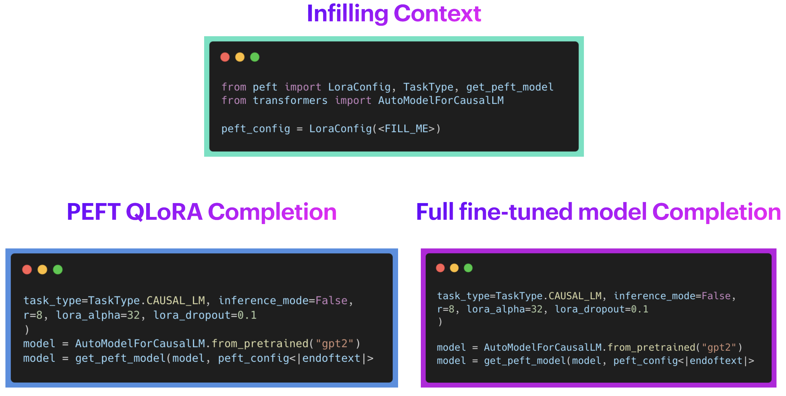
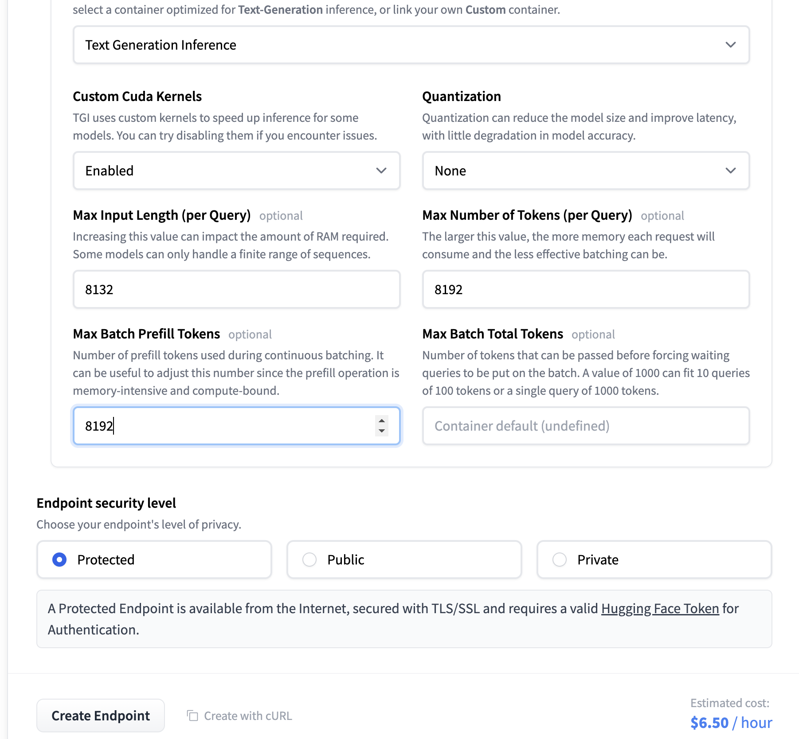
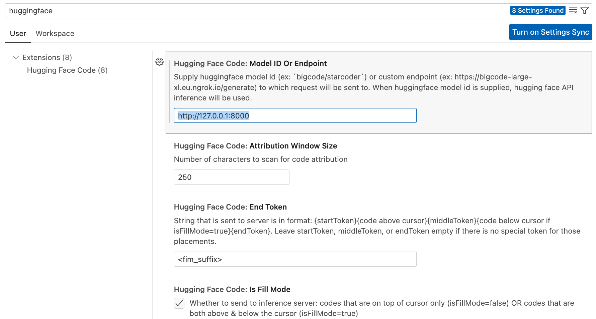
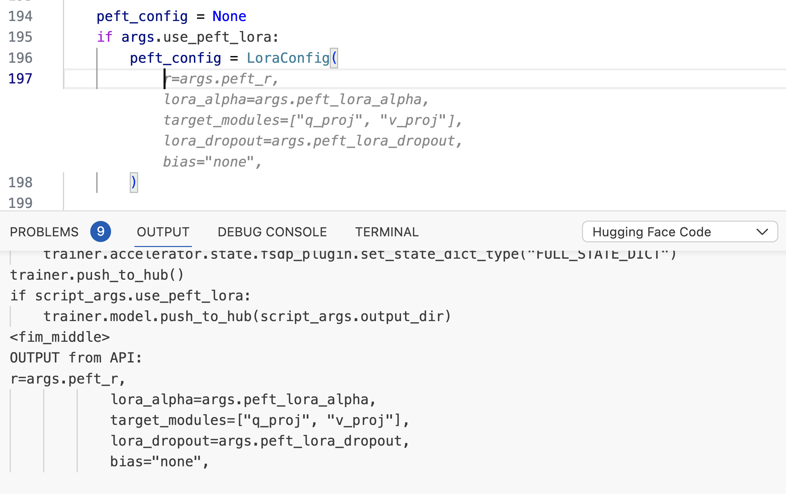

# Personal Copilot: 訓練自己的程式設計助手

在不斷發展的程式設計和軟體開發領域，對效率和生產力的追求帶來了顯著的創新。其中一項創新就是 [Codex](https://openai.com/blog/openai-codex)、[StarCoder](https://arxiv.org/abs/2305.06161) 和 [Code Llama](https://arxiv.org/abs/2308.12950) 等程式碼產生模型的出現。這些模型在產生類似人類的程式碼片段方面表現出了卓越的能力，從而顯示出作為編碼助手的巨大潛力。

然而，雖然這些預先訓練的模型可以在一系列任務中表現出色，但還有一個令人興奮的可能性：能夠根據您的特定需求定製程式碼產生模型。想想可以在企業規模上利用的個人化編碼助手。

在這篇文章中，我們展示瞭如何建立 HugCoder 🤗，這是一個根據 [Huggingface GitHub](https://github.com/huggingface) 組織的公共儲存庫中的程式碼內容進行微調的程式碼 LLM。我們將討論我們的資料收集工作流程、訓練實驗和一些有趣的結果。這將使您能夠根據您的專有程式碼庫創建您自己的個人副駕駛。我們將為您留下該項目的一些進一步擴展以供實驗。

讓我們開始吧🚀



## 資料收集工作流程

我們想要的資料集在概念上很簡單，我們的結構如下：


|Repository Name	|Filepath in the Repository	|File Contents|
|---	|---	|---|
|---	|---	|---|

使用 [Python GitHub API](https://github.com/PyGithub/PyGithub) 從 GitHub 抓取程式碼內容非常簡單。然而，根據儲存庫的數量以及儲存庫中程式碼檔案的數量，人們可能很容易遇到 API 速率限制問題。

為了防止此類問題，我們決定在本地克隆所有公共儲存庫並從中提取內容，而不是透過 API。我們使用 Python 中的多處理模組並行下載所有儲存庫，如該[下載腳本](https://github.com/sayakpaul/hf-codegen/blob/main/data/parallel_clone_repos.py)所示。

儲存庫通常可以包含非程式碼文件，例如圖像、簡報和其他數據資產。我們對收集它們不感興趣。我們創建了一個[擴展列表](https://github.com/sayakpaul/hf-codegen/blob/f659eba76f07e622873211e5b975168b634e6c22/data/prepare_dataset.py#L17C1-L49C68)來過濾掉它們。為了解析 Jupyter Notebooks 以外的程式碼文件，我們只需使用 "utf-8" 編碼。對於 Jupyter Notebooks，我們只考慮代碼單元(code cells) 裡的內容。

我們也排除了所有與程式碼不直接相關的檔案路徑。其中包括：.`git`、`__pycache__` 和 `xcodeproj`。

為了保持該內容的序列化相對記憶體友好，我們使用了進行了分塊和使用 [feather 格式](https://arrow.apache.org/docs/python/feather.html#:~:text=Feather%20is%20a%20portable%20file,Python%20(pandas)%20and%20R.)來序列化。請參閱此[腳本](https://github.com/sayakpaul/hf-codegen/blob/main/data/prepare_dataset.py)以了解完整的實作。

最終的[hf-codegen-v2 資料集](https://huggingface.co/datasets/sayakpaul/hf-codegen-v2)可在 Hub 上找到，如下所示：



在本文中，我們考慮了基於 stargazer 的前 10 個 Hugging Face 公共儲存庫。它們是：

- 'transformers'
- 'pytorch-image-models'
- 'datasets'
- 'diffusers'
- 'peft'
- 'tokenizers'
- 'accelerate'
- 'text-generation-inference'
- 'chat-ui'
- 'deep-rl-class'

這是我們用來產生此資料集的[程式碼](https://github.com/pacman100/DHS-LLM-Workshop/tree/main/personal_copilot/dataset_generation)，這是 Hub 中的[資料集](https://huggingface.co/datasets/smangrul/hf-stack-v1)。



為了降低專案複雜度，我們沒有考慮資料集的去重。如果您有興趣在生產應用程式中應用重複資料刪除技術，這篇部落格文章是關於 code LLMs 案例的優秀參考資源。

## 微調 Personal Co-Pilot

在本節中，我們將展示如何微調以下模型：[`bigcode/starcoder`](https://hf.co/bigcode/starcoder)（15.5B 參數）、[`bigcode/starcoderbase-1b`](https://hf.co/bigcode/starcoderbase-1b)（1B 參數）、[`Deci/DeciCoder-1b`](https://hf.co/Deci/DeciCoder-1b)（1B 參數）。我們將使用一台 A100 40GB Colab 筆記本，並使用 🤗 PEFT（參數高效微調）進行所有實驗。此外，我們將展示如何使用 🤗 Accelerate 的 FSDP 整合在具有 8 個 A100 80GB GPU 的機器上完全微調 bigcode/starcoder（15.5B 參數）。訓練目標是 [fill in the middle（FIM）](https://arxiv.org/abs/2207.14255)，其中訓練序列的部分內容被移動到末尾，並且對重新排序的序列進行自回歸預測。

為什麼選擇PEFT? 進行完全微調的成本很高。讓我們用一些數字來正確看待事情：

完全微調所需的最小 GPU 記憶體：

- 權重：2 bytes（混合精準度訓練）
- 權重梯度：2 bytes
- 使用 Adam 時的最佳化器狀態：4 bytes 於原始 FP32 權重 + 8 bytes 用於第一和第二矩估計
- 添加所有上述內容的每個參數的成本：每個參數 16 bytes
- 15.5B 模型 -> 248GB GPU 內存，甚至無需考慮存儲中間激活的巨大內存要求 -> 至少需要 4X A100 80GB GPU

由於硬體要求很高，我們將使用 [QLoRA](https://arxiv.org/abs/2305.14314) 進行參數高效的微調。以下是使用 [QLoRA](https://arxiv.org/abs/2305.14314) 微調 StarCoder 的最低 GPU 記憶體需求：

> 可訓練參數：110,428,160 || 所有參數：15,627,884,544 || 可訓練％：0.7066097761926236

- 基本模型權重：0.5 byte * 15.51B 凍結參數 = 7.755 GB
- 適配器權重：2 bytes * 0.11B 可訓練參數 = 0.22GB
- 權重梯度：2 bytes * 0.11B 可訓練參數 = 0.12GB
- 使用 Adam 時的最佳化器狀態：4 byes * 0.11B 可訓練參數 * 3 = 1.32GB
- 加總上述對於記憶體的所有內容 -> 9.51 GB ~ 10GB -> 需要 1 個 A100 40GB GPU。使用 A100 40GB GPU 的原因是，訓練時長序列長度為 2048 且批量大小為 4 的中間激活會導致更高的記憶體需求。如下所示，所需的 GPU 記憶體為 26GB，A100 40GB GPU 可以容納。此外，A100 GPU 與 Flash Attention 2 具有更好的兼容性。

在上面的計算中，我們沒有考慮中間激活檢查點所需的內存，該內存相當大。我們利用 Flash Attention V2 和梯度檢查點來解決這個問題。

- 對於 QLoRA 以及 Flash attention V2 和梯度檢查點，模型在單一 A100 40GB GPU 上佔用的總記憶體為 26 GB，批次大小為 4。
- 對於使用 FSDP 以及 Flash Attention V2 和梯度檢查點進行完全微調，每個 GPU 佔用的記憶體範圍在 70 GB 到 77.6 GB 之間，per_gpu_batch_size 為 1。

請參閱 [model-memory-usage](https://huggingface.co/spaces/hf-accelerate/model-memory-usage) 情況，輕鬆計算在 🤗 Hugging Face Hub 上託管的模型上訓練和執行大模型推理所需的 vRAM 量。

## 完整微調

我們將了解如何使用 PyTorch 全分片資料並行 (FSDP) 技術在 8 個 A100 80GB GPU 上對 bigcode/starcoder（15B 參數）進行全面微調。有關 FSDP 的更多信息，請參閱[使用 PyTorch FSDP 微調 Llama 2 70B](https://huggingface.co/blog/ram-efficient-pytorch-fsdp) 和[使用 PyTorch 全分片資料並行加速大型模型訓練](https://huggingface.co/blog/pytorch-fsdp)。

**資源**

- Codebase: [連結](https://github.com/pacman100/DHS-LLM-Workshop/tree/main/personal_copilot/training)。它使用 Transformers 最近新增的 Flash Attention V2 支援。
- FSDP Config: [fsdp_config.yaml](https://github.com/pacman100/DHS-LLM-Workshop/blob/main/personal_copilot/training/configs/fsdp_config.yaml)
- Model: [bigcode/stacoder](https://huggingface.co/bigcode/starcoder)
- Dataset: [smangrul/hf-stack-v1](https://huggingface.co/datasets/smangrul/hf-stack-v1)
- Fine-tuned Model: [smangrul/peft-lora-starcoder15B-v2-personal-copilot-A100-40GB-colab](https://huggingface.co/smangrul/peft-lora-starcoder15B-v2-personal-copilot-A100-40GB-colab)

透過 [run_fsdp.sh](https://github.com/pacman100/DHS-LLM-Workshop/blob/main/personal_copilot/training/run_fsdp.sh) 來啟動訓練的指令。

```bash
accelerate launch --config_file "configs/fsdp_config.yaml"  train.py \
    --model_path "bigcode/starcoder" \
    --dataset_name "smangrul/hf-stack-v1" \
    --subset "data" \
    --data_column "content" \
    --split "train" \
    --seq_length 2048 \
    --max_steps 2000 \
    --batch_size 1 \
    --gradient_accumulation_steps 2 \
    --learning_rate 5e-5 \
    --lr_scheduler_type "cosine" \
    --weight_decay 0.01 \
    --num_warmup_steps 30 \
    --eval_freq 100 \
    --save_freq 500 \
    --log_freq 25 \
    --num_workers 4 \
    --bf16 \
    --no_fp16 \
    --output_dir "starcoder-personal-copilot-A100-40GB-colab" \
    --fim_rate 0.5 \
    --fim_spm_rate 0.5 \
    --use_flash_attn
```

總訓練時間為9小時。根據 lambdalabs 計算 8 個 A100 80GB GPU 的成本為 12.00 美元/小時，總成本為 108 美元。

## PEFT

接下來我們將了解如何使用 QLoRA 使用 🤗 PEFT 在單一 A100 40GB GPU 上微調 巷`bigcode/starcoder`（15B 參數）。有關 QLoRA 和 PEFT 方法的更多信息，請參閱 [Making LLMs even more accessible with bitsandbytes, 4-bit quantization and QLoRA](https://huggingface.co/blog/4bit-transformers-bitsandbytes) 和 [🤗 PEFT: Parameter-Efficient Fine-Tuning of Billion-Scale Models on Low-Resource Hardware](https://huggingface.co/blog/peft)。

**資源**

- Codebase: [link](https://github.com/pacman100/DHS-LLM-Workshop/tree/main/personal_copilot/training)。它使用 Transformers 最近新增的 Flash Attention V2 支援。
- Colab notebook: [link](https://colab.research.google.com/drive/1Tz9KKgacppA4S6H4eo_sw43qEaC9lFLs?usp=sharing)。確保選擇具有高 RAM 設定的 A100 GPU。
- Model: [bigcode/stacoder](https://huggingface.co/bigcode/starcoder)
- Dataset: [smangrul/hf-stack-v1](https://huggingface.co/datasets/smangrul/hf-stack-v1)
- QLoRA Fine-tuned Model: [smangrul/peft-lora-starcoder15B-v2-personal-copilot-A100-40GB-colab](https://huggingface.co/smangrul/peft-lora-starcoder15B-v2-personal-copilot-A100-40GB-colab)

啟動訓練的命令在 [run_peft.sh](https://github.com/pacman100/DHS-LLM-Workshop/blob/main/personal_copilot/training/run_peft.sh) 中。總訓練時間為12.5小時。根據 lambdalabs，以 1.10 美元/小時的成本計算，總成本為 13.75 美元。那就相當不錯了🚀！就成本而言，它比完全微調的成本低7.8倍。

## 比較

下圖顯示了 QLoRA 與完全微調的評估損失、訓練損失和學習率調度程序。我們觀察到，與 QLoRA 相比，完全微調會導致損失略低且收斂速度更快。 pef 微調的學習率比 full 微調的學習率高 10 倍。



為了確保我們的 QLoRA 模型不會導致災難性遺忘，我們在其上運行了 Python Human Eval。以下是我們得到的結果。 `Pass@1` 衡量完成的通過率，僅考慮每個問題產生的單一候選代碼。我們可以觀察到，基本 `bigcode/starcoder`（15B 參數）和微調 PEFT 模型 `smangrul/peft-lora-starcoder15B-v2-personal-copilot-A100-40GB-colab` 在 humaneval-python 上的表現相當。


|Model	|Pass@1|
|bigcode/starcoder	|33.57|
|smangrul/peft-lora-starcoder15B-v2-personal-copilot-A100-40GB-colab	|33.37|

現在讓我們來看一些定性樣本。在我們的手動分析中，我們注意到 QLoRA 導致了輕微的過度擬合，因此我們透過 PEFT 的 `add_weighted_adapter` utility 程式創建權重為 0.8 的新加權適配器來降低其權重。

我們將看兩個程式碼填充範例，其中模型的任務是填入 `<FILL_ME>` 佔位符表示的部分。我們將考慮填滿來自 GitHub Copilot、QLoRA 微調模型和完整微調模型的補全。



**Qualitative Example 1**

在上面的範例中，GitHub Copilot 的補全是正確的，但沒有太大幫助。另一方面，QLoRA 的補全和完全微調的模型正確地用必要的參數填充了整個函數呼叫。然而，他們之後也增加了更多的噪音。這可以透過後處理步驟來控制，以將完成限制為右括號或新行。請注意，QLoRA 和完全微調模型都會產生類似品質的結果。



**Qualitative Example 2**

在上面的第二個範例中，GitHub Copilot 沒有給出任何補全資訊。這可能是因為 🤗 PEFT 是一個新函式庫，尚未成為 Copilot 訓練資料的一部分，而這正是我們試圖解決的問題類型。另一方面，QLoRA 的補全和完全微調的模型正確地用必要的參數填充了整個函數呼叫。

再次請注意，QLoRA 和完全微調的模型都提供了類似的品質。 [Full_Fintuned_StarCoder_Inference.ipynb](https://github.com/pacman100/DHS-LLM-Workshop/blob/main/personal_copilot/inference/Full_Finetuned_StarCoder_Inference.ipynb) 和 [PEFT_StarCoder_Inference.ipynb](https://github.com/pacman100/DHS-LLM-Workshop/blob/main/personal_copilot/inference/PEFT_StarCoder_Inference.ipynb) 分別提供了完整微調模型和 peft 模型的各種範例的推理程式碼。

因此，我們可以觀察到兩個變體的模型都符合預期。驚人！ 🚀

## 如何在 VS Code 中使用它？

您可以使用 [🤗 llm-vscode](https://marketplace.visualstudio.com/items?itemName=HuggingFace.huggingface-vscode) 來在 VS Code 中輕鬆配置自訂程式碼完成 LLM　的擴充，並透過 [🤗 推理端點](https://ui.endpoints.huggingface.co/)託管模型。我們將完成下面所需的步驟。您可以在推理端點文件中了解有關部署端點的更多詳細資訊。

### 設定推理端點

以下是螢幕截圖，其中包含我們建立自訂推理端點所遵循的步驟。我們使用 QLoRA 模型，匯出為全尺寸合併模型，可以輕鬆載入到 Transformer 中。



### 設定 VS 代碼擴展

只需按照[安裝步驟](https://github.com/huggingface/llm-vscode#installation)操作即可。在設定中，取代下方欄位中的端點，使其指向您部署的 HF 推理端點。



用法如下：



## 微調您自己的 Code Chat Assistant

到目前為止，我們訓練的模型被專門訓練為程式碼完成任務的個人副駕駛。他們沒有接受過進行對話或回答問題的訓練。 `Octocoder` 和 `StarChat` 是此類模型的很好的例子。本節簡要介紹如何實現這一目標。

**資源**

- Codebase: [link](https://github.com/pacman100/DHS-LLM-Workshop/tree/main/code_assistant/training)。它使用 Transformers 最近新增的 Flash Attention V2 支援。
- Colab notebook: [link](https://colab.research.google.com/drive/1XFyePK-3IoyX81RM94JO73CcIZtAU4i4?usp=sharing)。確保選擇具有高 RAM 設定的 A100 GPU。
- Model: [bigcode/stacoderplus](https://huggingface.co/bigcode/starcoderplus)
- Dataset: [smangrul/code-chat-assistant-v1](https://huggingface.co/datasets/smangrul/code-chat-assistant-v1)。 LIMA+GUANACO 的混合，並以可立即訓練的格式進行適當的數據格式化。
- Trained Model: [smangrul/peft-lora-starcoderplus-chat-asst-A100-40GB-colab](https://huggingface.co/smangrul/peft-lora-starcoderplus-chat-asst-A100-40GB-colab)

## LoRA 之舞

如果您曾嘗試使用 Stable Diffusion 模型和 LoRA 來製作自己的 Dreambooth 模型，那麼您可能熟悉將不同的 LoRA 與不同權重相結合的概念，即使用具有與訓練時不同的基礎模型的 LoRA 模型。在文字/程式碼領域，這仍然是未開發的領域。我們在這方面進行了實驗，並觀察到了非常有希望的發現。你準備好了嗎？我們走吧！ 🚀