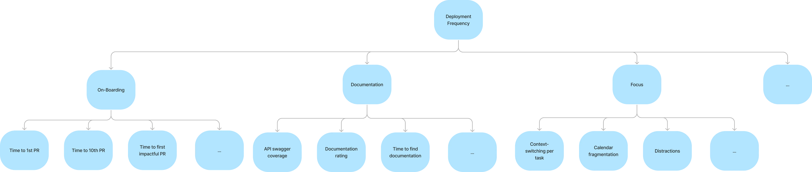
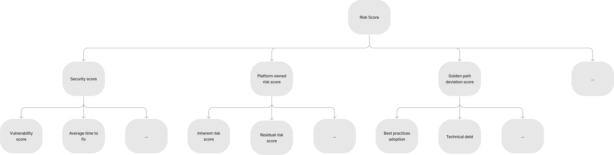

# 平台工程 KPIs

原文: [Platform Engineering KPIs](https://medium.com/wise-engineering/platform-engineering-kpis-6a3215f0ee14)

平台即產品(Platform as a product)正在成為工程組織中構建內部平台的越來越流行的方法。雖然軟件驅動的公司正在爭奪市場份額，但另一種更微妙的競爭正在興起：誰能讓他們的工程師最快地推出新功能？誰擁有最有效的內部平台？

在這篇文章中，我們將分享為 Wise（以前稱為 TransferWise）的平台工程團隊構建 KPI 樹的方法。從產品開發過程開始，我們將解釋如何塑造我們的平台願景，從而產生一組可操作的 KPI，我們用它們來識別最大的問題並持續衡量我們平台的性能。

## 產品開發流程

KPI 樹的目的是幫助我們實現基於假設驅動的實驗和驗證學習的產品開發流程。儘管有大量關於實施產品開發流程的文獻，但更困難的部分是確定適用於平台工程領域的指標。

如上圖所示，產品開發過程從平台願景和模型開始。這些是不變的部分，應該很少改變。模型是指標或槓桿及其相互關係的表示。 KPI 樹是我們為本練習選擇的模型表示類型。讓我們從定義我們的平台願景開始，該願景最終會告知我們認為平台可以影響並負責的相關指標或 KPI。

## 平台願景

平台願景構成了我們的最高目標，沒有它們，我們就不知道我們在衡量自己的標準是什麼。尤其是在 Wise 的自主團隊文化中，願景對於建立一致性和責任感至關重要。在我們的產品管理團隊中，我們廣泛討論了我們的公司願景是否可以充當我們的平台願景。

!!! quote
    Money without borders — instant, convenient, transparent and eventually free!

儘管 Wise 願景（或使命）是我們最終的動力，但我們得出的結論是，它作為平台願景並不能很好地服務於我們。我們的平台貢獻使 Wise 更接近實現其願景，但例如而我們的平台工程工作的便利性並不明顯。因此，我們決定定義一個更相關的願景。

!!! quote
    Provide foundations for Wise’s stability, enable teams to ship with confidence, faster and more efficiently than everyone else

儘管這一願景並非 Wise 特有的，但它滿足了我們最重要的要求：它雄心勃勃、激勵人心，並揭示了我們成功的槓桿。每個團隊和班組都應該能夠認同這一願景，並且平台工程師應該清楚他們的日常工作如何為其做出貢獻。基於這些槓桿，我們能夠得出[北極星 KPI](https://amplitude.com/blog/product-north-star-metric)，將其作為 KPI 樹的根。

## 平台 KPI 樹

如下所示，我們添加了一項名為“風險”的額外北極星 KPI，該指標無法直接從願景中得出。風險構成了一種無形的約束，這意味著必須在保持 Wise [風險偏好](https://en.wikipedia.org/wiki/Risk_appetite)範圍內的同時實現生產力、穩定性和效率。

基於 KPI 樹根，我們現在可以開始推導模型。如果我們的目標是讓 Wise 更加穩定，我們需要了解提高 Wise 可靠性的槓桿是什麼。為了創建這些模型，我們嚴重依賴現有框架以及圍繞開發人員生產力和 SRE 的研究。接下來，我們列出了最重要的一些。

- [Accelerate Book and Four Key Metrics](https://cloud.google.com/blog/products/devops-sre/using-the-four-keys-to-measure-your-devops-performance)
- [SPACE Framework for Developer Productivity](https://queue.acm.org/detail.cfm?id=3454124)
- [Engineering Effectiveness Handbook](https://www.okayhq.com/handbook/)
- [Google SRE Books](https://sre.google/books/)

雖然上面的閱讀材料是一個很好的入門材料，但平台工程領域還沒有非常全面的示例。我們花了相當多的時間集思廣益並自己開發模型。通過分享我們的方法，希望我們可以幫助其他平台團隊加快這一過程。

### 注意事項

- KPI 樹只是模型，本質上並不完美。有更正式的方法來創建 KPI 樹，其中分支是父函數的輸入。對於我們來說，如果一個指標對其父級有重大影響，就足以被視為分支。
- 好的指標應該是可操作的、具有可重複的結果並且準確地反映現實。我們的一些平台工程關鍵績效指標由我們的產品工程團隊和平台共同承擔責任。因此，平台有時無法故意重現結果。
- 我們僅共享 KPI 樹的一個子集，並且我們共享的樹是不完整的。然而，它們確實提供了足夠的信息來傳達我們的方法並幫助您開始這項練習。

請注意，KPI 樹並不能取代徹底的用戶研究。指標將幫助您確定值得調查的領域，從而實現有針對性且更高效的用戶研究。但是，您仍然需要投入時間採訪客戶，以補充您通過指標獲得的見解。

接下來，我們將介紹我們平台工程北極星 KPI 的 KPI 樹：生產力、穩定性、效率和風險。

### Productivity

開發人員的生產力是一個有爭議的話題，重要的是不要濫用指標來衡量個人績效。生產力 KPI 樹具有三個分支，這些分支被分成單獨的部分以便於可視化：交付時間、部署頻率和開發人員幸福感。

**Lead Time**

交付時間是指代碼更改和向最終客戶發布此更改之間的時間。該 KPI 樹主要衡量 CI/CD 流程中的摩擦。

**Deployment Frequency**

簡單來說，部署頻率 KPI 樹包含在進行代碼更改之前捕獲摩擦的指標。例如，在開發人員更改服務之前，他們需要閱讀文檔以了解其工作原理。

**Developer Happiness**

將開發人員的滿意度或幸福感視為生產力的一部分可能會有不道德的味道。幸運的是，事實證明，開發人員生產力和開發人員滿意度是正相關且相互依賴的。一些人認為，平台工程作為一個領域對開發人員的幸福感沒有足夠的影響，因為我們對薪酬或個人成長機會等因素沒有影響力。我們認為，儘管我們並不完全將開發者的幸福感視為一個問題領域，但我們的大部分工作都對此做出了貢獻。由於與生產力密切相關，密切關注相關指標至關重要。

### Stability

快速且頻繁地交付變更只是工作的一半。穩定性 KPI 樹衡量我們使產品工程師能夠自信地進行更改且不會破壞最終客戶體驗的能力。它反映了 Wise 服務的整體可用性，並充當變革的平衡力量。我們的穩定性槓桿包括提供可靠的雲原生平台，以及向產品團隊提供護欄和最佳實踐諮詢。

### Efficiency

生產力的目標是在相同的投入下獲得更多的產出，而效率的目標是在保持相同產出的情況下減少投入。在我們的方法中，效率 KPI 樹涵蓋了與成本相關的指標。這是雲資源、基礎設施和許可證的成本，以及我們平台工程團隊的成本。

### Risk

作為金融服務提供商，風險管理是我們的首要任務之一。作為一個平台工程組織，我們負責 Wise 的基礎，並有特殊責任實施變更控制和適當的安全措施。我們還認為我們的產品團隊偏離最佳實踐和黃金之路也是風險的一部分。

### KPI 樹級別

正如注意事項中提到的，出於本文的目的，我們僅描述了每個級別的 KPI 子集，並將深度限制為三到四個級別。為了說明 KPI 樹的深度，您可以在下面看到提前期示例的垂直切片。

## 平台 KPI 儀表板

從平台領域確定的許多 KPI 都由產品和平台團隊共同承擔責任。在實現他們的可視化時，我們需要牢記這一點。下面的線框圖描述了主要由平台使用的全局工程視圖，但也為各種組織實體提供了過濾器。工程比較視圖專為各個工程團隊量身定制，幫助他們進行基準測試並最終優化其績效和健康狀況。

所有 KPI 樹的總範圍包括 200 多個不同的指標，但目前並未對所有指標進行測量。按潛在影響確定優先級有助於我們決定將時間投入到哪里以獲得更多見解。上面所示的線框圖以兩種方式為我們服務：首先，通過設定期望並為與平台外的利益相關者進行討論提供基礎。其次，通過在實施團隊內部建立一致性並可視化 KPI 儀表板路線圖的里程碑。

## 結論

從上到下衡量已確定的 KPI 樹將幫助您了解需要關注的領域並量化平台工作的影響。雖然我們對 KPI 樹的前兩個級別有很好的了解，但分支的指標覆蓋率仍然不完整。這意味著我們看到 KPI 發生變化，但缺乏基礎數據來推斷原因。為了加快平台 KPI 的覆蓋範圍，我們需要讓平台和產品團隊更輕鬆地獲取數據並使其具有可操作性。

對於許多工程組織來說，開發人員生產力工程仍然是一種非常新的方法。大型科技公司在收集和分析開發人員行為和開發工具數據方面樹立了標準。這表明我們仍處於旅程的開始階段。
