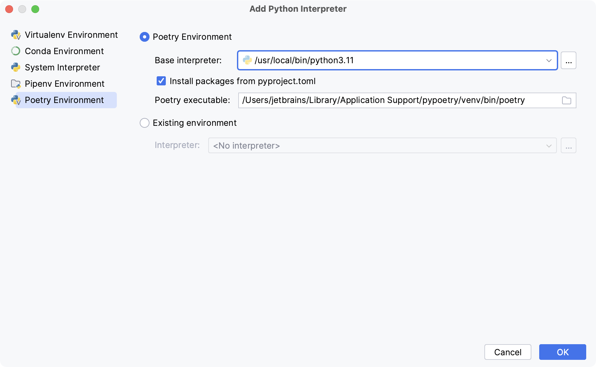

# 在 Pycharm 配置 Poetry 環境

原文: [Configure a Poetry environment](https://www.jetbrains.com/help/pycharm/poetry.html)

[Poetry](https://python-poetry.org/) 是一個有助於根據專案依賴關係建立 Python 虛擬環境的工具。您可以聲明您的專案所依賴的程式庫，Poetry 將為您安裝和更新它們。

專案依賴項記錄在 `pyproject.toml` 檔案中，該檔案指定所需的套件、腳本、外掛程式和 URL。有關其結構和格式的更多信息，請參閱 [pyproject 參考](https://python-poetry.org/docs/pyproject/)。

要在 PyCharm 中使用 Poetry，您需要將其安裝在您的電腦上並建立特定的 Python 環境。

<!-- more -->

## 安裝 Poetry

1. 開啟終端機（在 macOS 和 Linux 上）或 PowerShell（在 Windows 上）並執行下列命令：

=== "macOS"

    ```bash
    curl -sSL https://install.python-poetry.org | python3 -
    ```

=== "Windows"

    ```bash
    (Invoke-WebRequest -Uri https://install.python-poetry.org -UseBasicParsing).Content | py -
    ```

=== "Linux"

    ```bash
    curl -sSL https://install.python-poetry.org | python3 -
    ```

2. 在 macOS 和 Windows 上，安裝腳本會建議將包含 Poetry 可執行檔的資料夾新增至 PATH 變數。透過執行以下命令來執行此操作：

=== "macOS & Linux"

    ```bash
    export PATH="/Users/jetbrains/.local/bin:$PATH"
    ```

=== "Windows"

    ```bash
    $Env:Path += ";C:\Users\jetbrains\AppData\Roaming\Python\Scripts"; setx PATH "$Env:Path"
    ```

不要忘記用您的用戶名替換 `jetbrains`！


3. 若要驗證安裝，請執行以下命令：

```bash
poetry --version
```

您應該會看到類似 Poetry（版本 1.2.0）的內容。

有關更多信息，請參閱 [Poetry 安裝說明](https://python-poetry.org/docs/#installation)。


## 創建 Poetry environment

1. 執行下列操作之一：
    - 點選 [Python Interpreter selector](https://www.jetbrains.com/help/pycharm/configuring-python-interpreter.html#widget) 并且選擇 **Add New Interpreter**。
    - Press `Ctrl`+`Alt`+`S` to open **Settings** and go to **Project: <project name> | Python Interpreter**. Click the **Add Interpreter** 連結。
    - 點選 [Python Interpreter selector](https://www.jetbrains.com/help/pycharm/configuring-python-interpreter.html#widget) 并且選擇 **Interpreter Settings**. 點選 **Add Interpreter** 連結。

2. 選擇 **Add Local Interpreter**。
3. 在左側窗格中 **Add Python Interpreter**, 選擇 **Poetry Environment**。



4. 以下操作取決於您是要建立新的 Poetry 環境還是使用現有環境。

=== "New Poetry environment"

    - 選擇 Poetry Environment。
    - 從清單中選擇基本解釋器，或按一下選擇基本解釋器並在檔案系統中找到所需的 Python 執行檔。
    - 如果您的專案包含 pyproject.toml，您可以透過啟用或停用從 pyproject.toml 安裝軟體包複選框來選擇是否要安裝其中列出的軟體包。預設情況下，該複選框處於啟用狀態。
    - 如果 PyCharm 未偵測到 Poetry 可執行文件，請在對話方塊中指定下列路徑，並將 jetbrains 替換為您的使用者名稱：

    === "macOS"

    ```bash
    /Users/jetbrains/Library/Application Support/pypoetry/venv/bin/poetry
    ```

    === "Windows"

    ```bash
    C:\Users\jetbrains\AppData\Roaming\pypoetry\venv\Scripts\poetry.exe
    ```

    === "Linux"

    ```bash
    /home/jetbrains/.local/bin/poetry
    ```


=== "Existing Poetry environment"

    - 確保專案目錄包含 `pyproject.toml` 檔案。
    - 選擇 **Existing environment**。 然後展開 Interpreter 列垃并選擇想要使用的 interpreter。
    - 如果所需的 Interpreter 不在清單中，請按一下 ，然後在先前設定的 Poetry 環境中瀏覽以尋找 Python 執行檔。

    所選的 Poetry 環境將在目前專案中重複使用。

5. 按一下 OK 完成任務。

