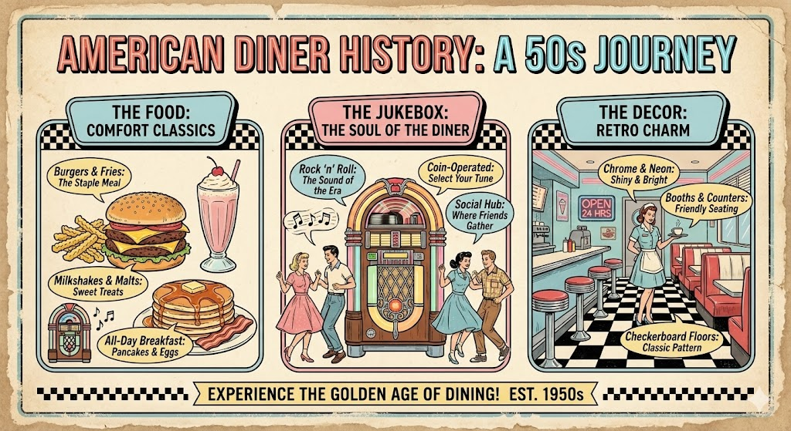
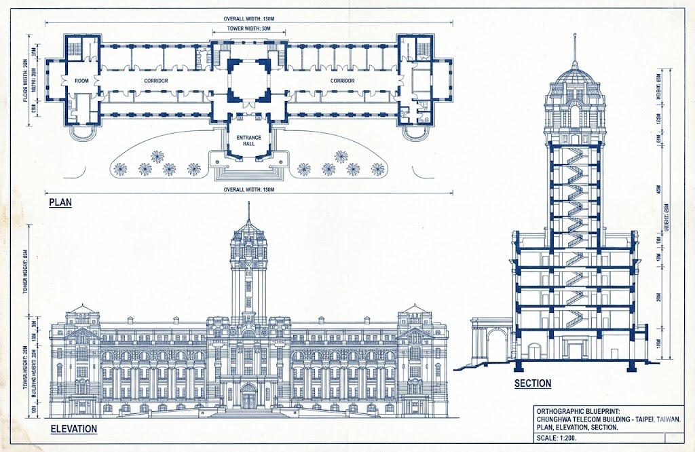

# Nano Banana Pro 完全指南

Nano-Banana Pro 相較於前幾代產品實現了重大飛躍，從「娛樂性」圖像生成躍升至「功能性」專業資產製作。它在文字渲染、字元一致性、視覺合成、世界知識（搜尋）和高解析度 (4K) 輸出方面表現卓越。

本文內容包括：

0. 提示的黃金法則
1. 文字渲染、資訊圖表與視覺合成
2. 角色一致性與病毒式傳播的縮圖
3. 利用Google搜尋進行基礎分析
4. 進階編輯、修復和著色
5. 維度轉換（2D ↔ 3D）
6. 高解析度和紋理
7. 思考和推理
8. 一次性故事板與概念藝術
9. 結構控制與佈局指導
10. 下一步是什麼？

## 提示的黃金法則

Nano-Banana Pro 是一款「思考型(Thinking)」模型。它不只是匹配關鍵字，還能理解意圖、物理原理和構圖。為了獲得最佳效果，請停止使用「標籤大雜燴」（例如：狗、公園、4K、逼真），並像創意總監一樣進行創作。

### 持續編輯，不要都重新開始

該模型非常擅長理解 **對話式修改**。如果圖片已有 80% 的正確度，就不要從頭開始產生新圖。只需提出您需要的具體修改即可。

> 例如："這很棒，但請將燈光改為日落色，並將文字改為霓虹藍色。"

### 使用自然語言和完整句子

與模型交流時，要像指導藝術家創作一樣。使用正確的語法和描述性的形容詞。

> ❌ Bad: "酷炫的汽車, 霓虹燈, 城市, 夜晚, 8K"

> ✅ Good: "電影般的廣角鏡頭展現了一輛未來感十足的跑車在雨夜的東京街道上疾馳。霓虹燈的光芒倒映在濕漉漉的路面和汽車的金屬底盤上。"

### 要具體、描述清楚

模糊的提示只會得到千篇一律的結果。要明確主題、場景、光線和氛圍。

> 主題: 不要說 "一位女士"，而要說"一位穿著復古香奈兒風格套裝的優雅老婦人"。

> 材質: 描述質感。"霧面", "拉絲鋼", "柔軟天鵝絨", "皺紙"。

### 提供背景資訊（「為什麼」或「為了誰」）

因為模型會 **思考**，所以給它背景資訊有助於它做出合乎邏輯的藝術決定。

> 例如: "為一本巴西高端美食食譜創作一張三明治的圖片。"（該模型將推斷出專業的擺盤、淺景深和完美的照明）。

## 文字渲染、資訊圖表與視覺合成

Nano-Banana Pro 具備最先進的功能，能夠渲染出清晰易讀、風格化的文本，並將複雜的資訊合成為視覺格式。

最佳實踐:

- 壓縮: 請模型將密集文字或 PDF 檔案「壓縮」成視覺化輔助資料。
- 風格: 請指定您想要「精美編輯風格」、「技術圖表風格」或「手繪白板風格」。
- 引用: 請明確指定需要用引號括起來的文字。

**壓縮** 範例:

> **獲利報告資訊圖**:
> 
> [輸入Google最新財報的PDF檔](https://s206.q4cdn.com/479360582/files/doc_news/2025/Oct/29/attachments/2025q3-alphabet-earnings-release.pdf)
> 
> :octicons-arrow-right-24: "生成一份簡潔現代的 Infographic，概括這份財報的關鍵財務亮點。包含盈利增長和淨利潤圖表，並在風格化的引言框中突出顯示CEO的關鍵語錄。"

**風格** 範例-01:

> **復古資訊圖表**:
> 
> :octicons-arrow-right-24: "製作一張復古的、20世紀50年代風格的 infographic，介紹美國餐廳的歷史。內容應包含「食物」、「點唱機」和「裝飾」等不同部分。確保所有文字清晰易讀，並符合當時的風格。"
>
> 

**風格** 範例-02:

> **技術圖解**:
> 
> :octicons-arrow-right-24: "繪製一份正投影藍圖，以平面圖、立面圖和剖面圖的形式描述建築物。使用專業建築字體清晰標註「北立面」與「主入口」。格式為16:9。"
> 
> <figure markdown="span">
>   { width="600" }
>   <figcaption>上傳圖片給 Nano Banana 模型</figcaption>
> </figure>
>
> <figure markdown="span">
>   { width="600" }
>   <figcaption>Nano Banana 模型生成的圖片</figcaption>
> </figure>

**風格** 範例-03:

> **白板摘要**:
> 
