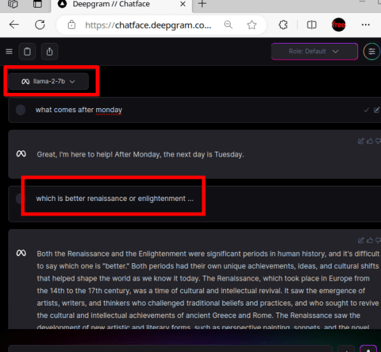

# 免費試用 LLAMA 2 的 8 種方式

原文: [8 WAYS TO TRY LLAMA 2 FROM META FOR FREE](https://www.ilovefreesoftware.com/24/featured/ways-to-try-llama-2-from-meta-for-free.html)

Llama2 以其非凡的基準震撼了 LLM 世界，並通過 OpenAI 和 Anthropic 等 AI 平台對現有的頂尖閉源 LLM 提出了直接挑戰。 Llama 模型很好，但 Llama 2 更加強大和準確，甚至可以影響 ChatGPT 用戶。

自從 Meta 宣布發布 Llama 2 之後，人們已經構建了聊天機器人，您可以嘗試一下。大多數聊天機器人都是付費的，但如果您渴望免費嘗試 Llama 2，那麼不用擔心，本文列出了 8 種測試和嘗試 Llama 2 的方法。

要了解 Llama 2 與其他 LLM 相比的功能，只需查看下圖即可。對於一個開源且可供公眾免費使用的模型來說，這些都是非同尋常的。

讓我們首先嘗試了解 Llama 及其工作原理。

<!-- more -->

## 什麼是 LLM?

LLM 是一種基於計算機的人工智能模型，旨在處理和理解自然語言。它基本上是根據從書籍、文章和網絡資源中提取的大量文本信息進行訓練的，以熟悉語言的示例和設計。通過檢查這個龐大的文本語料庫，LLM 可以培養對句子結構、行話、背景甚至情感的深刻理解，使他們能夠產生全面且相關的文本輸出。

LLM 最常見的例子是 OpenAI 的 GPT-3，它因其強大的語言能力而受到廣泛關注。 GPT-3 由 `175 billion` 個參數組成，並在由各種來源構建的海量數據集上進行了訓練。它旨在執行語言解釋、問答、大綱和文本處理。

在背後，LLM 依賴於被稱為 `Transformer` 的神經網絡設計。 `Transformer` 由不同層的注意力機制組成，使模型能夠有效地處理語言中的 long-range condition。這種設計使 LLM 能夠成功捕獲面向上下文的文本數據並掌握複雜的語義關係。

## 什麼是 Llama 模型?

Llama 模型是 Meta AI 開發的大型語言模型（LLM）。它是預先訓練和微調的生成文本模型的集合，參數範圍從 `7 billion` 到 `70 billion` 個。 Llama 模型旨在用於各種任務，包括：

- Chatbots
- Question answering
- Text summarization
- Translation
- Code generation
- Creative writing

Llama 模型經過大量文本和代碼數據集的訓練，包括書籍、文章和社交媒體帖子。這使得模型能夠學習單詞和短語之間的統計關係，並生成有意義且精確的文本。

## Llama 與 Llama 2

Llama 2 是 Meta 發布的最新開源大語言模型（LLM）。它可免費用於研究和商業用途。該模型具有三種尺寸變體，參數範圍為 `7`、`13` 和 `70 billion`。它已經接受了 2 trillion 個令牌的訓練，這是其前身模型 Llama 1 的上下文長度的兩倍。

Llama 2 的微調模型已經過超過一百萬個人工註釋的訓練。在社群創建的許多不同基準測試中，Llama 2 的性能遠遠優於其他現有的開源模型。基准考慮模型的推理、編碼、熟練程度和知識來生成比較圖表。

## 試用 Llama 2 模型的方法

### 1. Perplexity Labs

Perplexity Labs 是免費試用所有 Llama 2 模型的最好、最快的網站之一。它為您提供了一個類似 ChatGPT 的簡單界面，您可以在其中提出問題，它將生成答案。您可以從列表中選擇特定的 Llama 模型，然後繼續生成 AI 文本內容。

- llama-2-7b-chat
- llama-2-13b-chat
- llama-2-70b-chat

進入網站後，您只需從右下角選擇型號即可。選擇模型後，只需輸入文本提示，然後讓它為您生成答案。

您可以繼續在聊天機器人中提問，它會不斷生成答案。您可以提出簡單或複雜的問題，模型將為您處理它們。

免費的 Perplexity Labs 是您可以用來測試 Llama 2 模型輸出的最佳網站。然而，由於它是免費的，因此網站有時加載速度很慢。但你可以繼續嘗試。

[Try Perplexity Labs Here](https://labs.perplexity.ai/)

### 2. HuggingChat

HuggingChat 是 Hugging Face 的 ChatGPT 的免費替代品。它旨在運行開源模型，現在它支持為您運行最大的 Llama 模型。我們在這裡詳細介紹了它，您可以在那篇文章中閱讀它的一般方面。

現在，您可以在這裡嘗試 Llama-2-70b-chat-hf AI 模型，這是最大且精度更高的模型。您可以將其加載到聊天中，然後開始詢問任何問題。儘管 HuggingChat 不支持額外上下文的系統角色，但您可以啟用互聯網選項以獲得更好的答案。

因此，繼續使用聊天，不要忘記將 Llama 2 設置為聊天的基礎模型。它會像 ChatGPT 一樣保存您的聊天記錄，您可以回來繼續聊天。除此之外，除了 Llama 之外，它還支持其他一些模型，您也可以嘗試一下。

[Try HuggingChat](https://huggingface.co/chat/)

### 3. Hugging Face

Hugging Face 擁有大量適用於各種事物的人工智能模型。除了上面的官方 Hugging Chat 之外，不同的用戶也在他們的空間中提供帶有聊天機器人的 Llama 模型。 `ysharma/Explore_llamav2_with_TGI` 是提供最新 Llama 2 模型的空間之一。

您可以打開這個空間，然後立即開始與模型交互。最好的部分是您不必創建帳戶即可開始。該模型需要幾秒鐘的時間來加載，加載後，您可以輸入文本提示，然後它會為您生成答案。

在這個空間中，您可以嘗試以下 Llama 2 模型：

- llama-2-7b-chat
- llama-2-13b-chat
- llama-2-70b-chat

這個 Hugging Face 空間還對這些模型進行了微調，您可以提出非常通用和復雜的問題。然而，一個小缺點是，如果你嘗試生成一個很長的答案，那麼它可能會卡在中間。因此，免費嘗試提出需要簡短回答的問題。

[Try this Hugging Face space](https://huggingface.co/spaces/ysharma/Explore_llamav2_with_TGI)

### 4. llama2.ai

這是列表中的另一個免費網站，您可以在其中嘗試 Llama 2 模型。這是一個專門的網站，免費提供 Llama 2 模型。它提供的聊天界面很簡單，但支持一些高級參數來增強生成文本的最終輸出。

llama2.ai 對所有註冊免費帳戶的用戶支持以下 Llama 2 模型。

- LLaMA2-7B
- LLaMA2-13B
- LLaMA2-70B

從列表中選擇任何模型後，您將能夠在開始聊天之前指定以下參數。

- **Temperature**
    - `Temperature` 是一個控制生成文本多樣性的參數。常見的範圍是 `0.1` 到 `1.0` 之間。當 `temperature` 較高時，模型生成的文本將更具隨機性，多樣性更大。這意味著生成的文本可能更加出奇不意，但也可能更加難以理解。當 temperature 較低時，生成的文本會更加穩定和可預測。
- **Top P**
    - `Top P` 可以用來控制生成文本的多樣性，類似於 `temperature` 參數。介於 0 和 1 之間的正數。它基於文本的頻率分佈，只選擇最有可能的詞語，以確保生成的文本更有邏輯性和可讀性。當使用較高的 `Top P` 值時，模型會選擇更多的詞語，生成的文本可能更多樣，而低的 `Top P` 值則會使生成的文本更受限。
- **Max Sequence Length**
    - 最大序列長度是一個正整數，通常在 10 到 1000 之間。它用於設定生成文本的最大長度限制，以確保生成的文本不會過長。這個參數的值取決於特定的應用需求和文本生成上下文。
- **System Role**
    - 系統角色通常是文字選項，代表模型在對話或互動中所扮演的角色或身份。

所以，趕緊註冊一個免費賬戶，然後配置上面的參數。完成所有設置後，您可以開始向其提出問題或文字提示。根據設置的參數，它會生成相關的響應並顯示給您。您可以在 Llama2 模型之間切換並做任何您想做的事情。

[Try llama2.ai](https://llama2.ai/)

### 5. ChatNBX

ChatNBX 是一個不錯的免費 ChatGPT 替代品，您只需點擊幾下即可在瀏覽器中嘗試。您無需註冊即可使用它，目前它支持以下 Llama 2 模型。

- Llama-2-13B-Chat-fp16
- Llama-2-70B-chat

嘗試這些模型很簡單，您只需使用下面的鏈接訪問主網站即可。使用訪客模式即可訪問並使用以上兩種模式。

它為您提供了一個類似聊天的界面，您可以在其中給它一個文本提示，它會返回人工智能生成的答案或文本。除了普通的AI聊天之外，在這裡你還可以啟用互聯網訪問，甚至上傳 PDF 文件來與其聊天。但這些功能還處於實驗階段

[Try ChatNBX](https://chat.nbox.ai/)

### 6. Deepgram’s Chatface

Deepgram Chatface 是一個用於嘗試各種 LLM 的 UI。在最近的更新中，它開始支持 Llama 2 模型，您可以通過註冊免費帳戶免費試用。它提供了具有多個高級選項和設置的人工智能聊天機器人，甚至支持系統角色。

如果您希望它在特定上下文中生成文本內容或答案，那麼您可以這樣做。目前，它支持以下 Llama 2 模型進行 AI 文本生成。

- llama-2-7b-chat

除了這個 Llama 模型之外，它還支持其他模型，例如 GPT-3.5、Deepgram、Fastchat 等。但由於我們在這裡只關注 Llama 模型。確保您選擇了 llama-2-7b 模型，然後您就可以與聊天機器人交互。

如果您想要不同語法的答案，那麼我建議您指定系統角色。從右上角的設置進行操作。

[Try Deepgram Chatface](https://chatface.deepgram.com/)

### 7. Replicate

就像 Hugging Face 一樣，Replicate 平台也是一些最好的開源模型的所在地。它開始支持的模型之一是 Llama 2。然而，在這個領域只有 13B 模型可用，但這沒關係，因為你只是想測試和嘗試它的潛力。

Replicate 提供的 AI 聊天機器人的 Web UI 很簡單，但為您提供了高級參數來獲得精確的結果。在這裡，與文本提示一起，您可以指定係統角色以在不同的上下文中獲取答案。

除了系統角色之外，您還可以指定 temperature、maximum tokens、repetition penalty等。您無需註冊即可使用它，並通過鏈接與其他人分享結果。

[Try Llama 2 on Replicate](https://replicate.com/a16z-infra/llama13b-v2-chat)

### 8. Text Generation webui Colab

這基本上是一個 Colab 筆記本，你可以使用你的 Google 帳戶免費運行。但由於 Google Colab 資源有限，目前只能運行這些 Llama 2 模型。

- lama-2-7b-chat
- llama-2-13b-chat

如果您通常使用 LLM 來生成創意內容和論文，那麼這兩種模型就足夠了。最好的部分是，當您運行此筆記本時，Colab 將為您提供一個唯一的 URL，您可以在其中嘗試這些模型來生成內容並做任何您喜歡的事情。

要訪問此筆記本，請轉到其 [GitHub 存儲庫](https://github.com/camenduru/text-generation-webui-colab)。向下滾動到 Llama 模型筆記本鏈接 (llama-2-7b-chat (16bit))，然後在 Colab 中打開它。

點擊 play 按鈕，然後讓它解析所有必需的依賴項和套件。給它幾秒鐘的時間來加載內容並等待它生成 Web UI 的 URL。

打開它為您提供的 Web 鏈接，您將被重定向到 Web 界面以嘗試 Llama 2。

在此 Web UI 中，轉到模型部分。從列表中選擇 `Llama-2-7b-chat-hf` 模型。點擊加載並保存設置。等待模型加載，您可以在右側看到進度。

模型加載後，返回聊天界面。開始提問或給出文字提示。按 `Enter` 或點擊 `Generate` 按鈕。它現在將生成內容。您現在可以繼續使用此網絡應用程序並生成您想要的任何內容。

有時會卡在中間。如果答案不完整，您只需單擊 `Continue` 按鈕即可繼續生成文本。完成後，您可以停止筆記本。您每次都可以返回並以相同的方式運行它。

## 結論

如果您想免費在線試用 Llama 2，那麼我在這裡提到的網站和 Colab 筆記本列表將為您提供幫助。所有這些都可以免費使用，並支持幾乎所有 Llama 2 模型。因此，請嘗試一下。就我個人而言，我會推薦您使用 Hugging Face 和 Perplexity Labs。