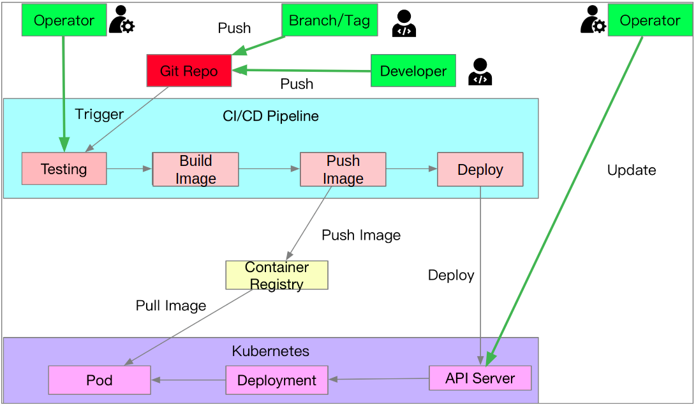

# 淺談 GitOps 的概念

原文: https://www.hwchiu.com/gitops.html

本篇文章主要跟大家介紹這幾年伴隨者 Kubernetes 出現的一個名詞 `GitOps`, 內容主要會包含:

1. GitOps 概念介紹 
2. ArgoCD開源專案介紹

## GitOps 介紹

GitOps 這個詞就我了解，最早是由 Weave Net 所提出的概念，要瞭解 GitOps 的優劣，最好的方式還是透過比較的方式來理解 GitOps 與原先習慣的 CI/CD 部署方式的差異。

!!! info
    註: 這邊探討的所有架構都以 Kubernetes 為主

## 常見的 CD 流程

下圖是一個常見的 CD 流水線流程:

這個範例中，我們有一些基本元件:

1. **Git Repo** - 這個 Git Repository 中至少會放置關於 Kubernetes 資源的描述檔案(Manifests), 可以是原生的 Yaml， Helm Charts 或是 Kustomize 的檔案。

2. **CI/CD Pipeline** - 譬如 Jenkins/Gilab CI/GitHub Action/CirecleCI 等常見系統，這個 Pipeline 裡面會有一些工作，譬如測試，建置 Contianer Image, 更新 Container Image，以及跟 Kubernetes 溝通

3. **Operator/Devloper** - 實際上操作的人員，譬如專案開發人員或是架構維運人員。

對於開發人員來說，可能會透過 1) PullRequest/MergeRequest 的產生， 2) PR/MR 被合併或是有特定的 Tag 被產生 等諸多條件觸發 CI/CD Pipeline 來進行後續行為。

對於架構維運人員來說可已透過 1)直接要求 CI/CD Pipeline 運行來進行後續行為 2) 直接對目標 Kubernetes Cluster 進行操控。

從上述的範例中可以看到，如果沒有嚴厲的去限制 **直接對 Kubernetes 進行更新** 這個行為，就有兩個不同的觸發點可以對 Kubernetes 進行更新，這種情況可能會造成的問題是:

==沒有辦法控管 Kubernetes 正在運行的資源狀態 (Living Status) 與 Kubernetes 被期望的資源狀態 (Desired Yaml) 一致==

特別是當有人員會直接透過 kubectl edit, kubectl patch, 使用某種UI等方式直接修改運行狀態卻又沒有要更新描述資源 (Yaml) 時更容易發生。

除此之外，這個部署結構還有一個容易引人詬病的問題就是 `KUBECONFIG` 的散佈，為了讓外部環境(CI/CD Pipeline, 特定人員 laptop) 能夠對 Kubernetes 進行操作，必須要將連接 Kubernetes Cluster 所需要的 `KUBECONFIG` (Token/Credentail/API Address:Port) 等資訊給分享出去，這無疑造成了一些安全性的隱憂。

### 痛點

簡單整理以下上述部署流程可能的缺失:

1. Kubernetes Cluster 的連線資訊必須要暴露在外，一旦被外界拿到則整個 Cluster 都有被破壞的可能
2. 難以確保 Kubernetes 內運行的狀態與描述的資源檔案 (Yaml/Helm Chart) 一致，因為有太多地方可以進行操作

接下來我們就看一下對於 GitOps 來說，要如何解決上面兩個潛在問題，並且是透過何種方式來處理。

## GitOps

GitOps 的概念如下圖呈現:

與前述的部署方式最大的差距就是:

1. CI/CD Pipeline 內不進行任何部署動作
2. 資源的描述狀態 (Yaml/Helm Chart) 放在 Git 裡面，Git 作為 Single Source of Truth的角色
3. Kubernetes 內部有一個 Controller 會定期去偵測 Git 的變化，並且把 Git 內的變動都更新到 Kubernetes 裡面

這意味者任何人如果想要對 **Kubernetes Cluster** 進行修改，只有一個辦法就是 **更新 Git Repo**，一旦 **Git Repo** 內描述的 **Yaml/Helm Chart** 有任何修改，Kubernetes Cluster 內的 Controller 會負責將這些變動的差異性更新到 Kubernetes Cluster 內。

因此 Git repo 就是唯一的來源，同時透過 Git 版本控制的特性，如果想要針對資源進行版本更動, rollback 等操作，直接針對 Git 管理（譬如 git revert)。

此外，GitOps 的過程中，任何人都不應該直接對 Kubernetes Cluster 直接操作，因此也不需要將 KUBECONFIG 這個檔案給分享出去，因此安全性的隱憂也就迎刃而解。

所以這邊針對 GitOps 下個一個總結：

1. KUBECONFIG 不分享出去，因此不希望任何人/環境有辦法直接從外部去操作 Kubernetes
2. 將所有描述 Kubernetes 資源狀態的檔案（Yaml/Helm Chart)用 Git 保存
3. Kubernetes 內會安裝相對應的 controller 來監控 Git Repo 的更新並且將一切的更新都更新到 kubernetes cluster 內
4. (可能的優勢)，透過 GitOps 這種架構，Kubernetes Cluster 本身不需要將 API Server 的存取方式給暴露出去，可以透過 Firewall 的方式把常見的 6443 連接埠給關閉，對於安全性來說也是減少了一些潛在的問題。

## ArgoCD 開源專案介紹

接下來我們將探討一個實現 GitOps 的開源專案 ArgoCD，這邊不會有太仔細的 Demo 與操作，主要是針對架構來進行介紹。

ArgoCD 的架構引用其官網:

這個架構圖分成幾個部分來看。

1. ArgoCD 於 Kubernetes Cluster 內安裝的服務，這些服務包含了
     - `Argo API Server`: 提供介面給外界操控 ArgoCD 服務，本身提供了 CLI, GUI 以及 gRPC/REST 等介面，最簡單的 Demo 可以使用 GUI 來操作。
     - `Repository Service`: 本身作為一個遠方 Git Repo 的本地快取，主要是儲存該 Git Repo 內的資源預期檔案 (Yaml/Helm Chart)
     - `Application Controller`: 負責跟 Kubernetes 溝通，會比較 Kubernetes Cluster 內的運行狀態 (living status) 以及 Git Repository 內所描述的資源預期狀態 (Yaml/Helm Chart), 並且更新 Kubernetes Cluster 一旦發現 Git Repository 內有更動

2. 上方的 Git Repo, 該 Git Repo 本身有兩種方式與 ArgoCD 互動
     - Webhook 主動告知 ArgoCD
     - ArgoCD 本身定期去觀察 Git Repo 的狀態，並且一旦有更新就會讓 Controller 來更新相關的應用程式

3. 左方的開發人員/維護人員，這些人員可以透過 UI/CLI/gRPC/REST 等方式來操作 ArgoCD 的服務。
     - 開發人員可以透過對 Git Repo 的修改與合併來觸發 ArgoCD
     - 部署人員可以透過 UI/CLI 等方式來觀察與設定當前應用程式的狀態

4. 左下方的是 Hook 點， ArgoCD 本身針對 Git Repo 更新前後有提供相關的 Hook，可以在這邊將相關的訊息與其他系統銜接，譬如 Slack, Webhook 等，讓你的系統能夠有辦法接收到當前部署的狀況

5. 右下方則是目標的 Kubernetes Cluster
     - 對於 ArgoCD 來說，本身要先透過一套 Kubernetes 來架設服務，接者該 ArgoCD 可以針對不同的 Kuberentes Cluster 進行設定與存取。
     - 舉例來說，如果你環境內有多套 Kubernetes Cluster, 可以只用一套 ArgoCD 來管理這些 Kubernetes Cluster，將關注的 Git Repo 給部署到不同 Kubernetes Cluster 內的不同 namespace 下。

### 使用範例

官網的[使用範例](https://argoproj.github.io/argo-cd/getting_started/), 有興趣的可以參考連結來設定玩看看，基本上全部都是基於 GUI 來進行操作

以下圖片都來自官網範例:

上圖範例就是建立一個 `Application`, 其追蹤的 Git Repo 是 `https://github.com/argoproj/argocd-example-apps`，並且追蹤的是目標 Repo 的 HEAD(latest) branch 下的 `guestbook` 資料夾內的資源描述檔案。

此外當有任何更新的時候，會將相關的應用程式部署到 https://kubernetes.default.svc 該 API server 所對應的 Kubernetes Cluster 內，並且放到 `default` namespace。

ArgoCD 本身也會透過 GUI 的方式來視覺化呈現部署的資源，包含其狀態，名稱以及彼此的關係。

## 總結

1. GitOps 關注的是如何自動化部署(CD)，跟 CI, Pipeline 關係不大
2. GitOps 要求的是以 Git Repo 為來源，如果要對應用程式進版或是退版，都直接對 Git 修正即可，後續讓相關的 Controller 來幫忙同步資源狀態
3. 針對不能夠被外界存取的 Kubernetes Cluster來說， GitOps 的概念可以解決自動部署的困境，同時也能夠減少外洩 KUBECONFIG 這個檔案的潛在性

