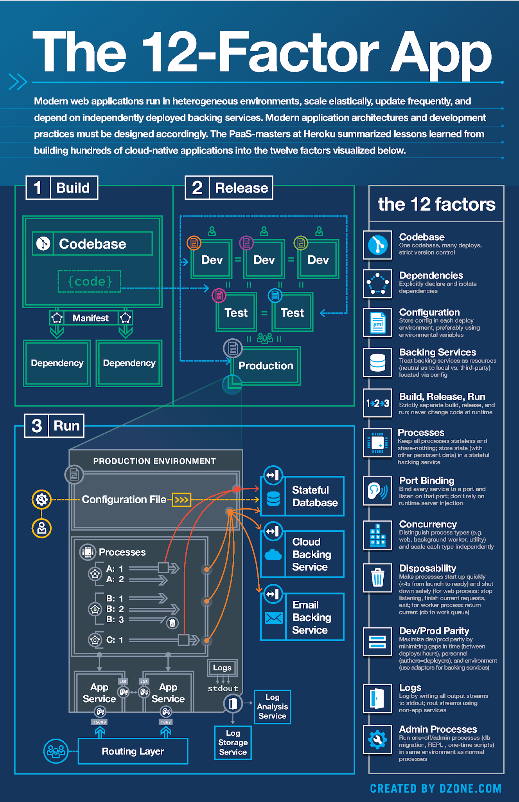

# 12 要素應用實戰

原文: [[Architecture] The 12 factor App 筆記](https://marcus116.blogspot.com/2020/09/architecture-12-factor-app.html)
原文: [12 要素应用实战](https://zhuanlan.zhihu.com/p/286100357)

## 前言

最近在與同事一起規劃新系統的架構，在整理相關文件時想起參加前公司 Techday 由新加坡同事提起的 The Twelve-Factor App 方法論，提出此方法論的作者參與了超過一百個專案開發與部署，並透過 Heroku 平台見證了數十萬個應用程式的開發運作以及擴展的過程，整理了在 SaaS (Software as a Service) 開發時需要理想的實踐標準，方法論主要內容如下:

- 使用聲明格式進行設置自動化，以最大限度地減少新開發人員加入項目的時間和成本
- 與底層操作系統有一個乾淨的合同，在執行環境之間提供最大的可移植性
- 適合部署在現代云平台上，無需服務器和系統管理
- 最大限度地減少開發和生產之間的差異，實現持續部署以獲得最大的敏捷性
- 並且可以在不對工具、架構或開發實踐進行重大更改的情況下進行擴展

其中提到此方法論是不限定語言與後端服務開發的應用程式，因此這篇文章就來介紹關於 12 facctor 的一些重點項目，若有理解錯誤或是異常的地方歡迎隨時提出討論。

## 介紹

首先確保你已經仔細閱讀了 12 Factor App 的原文:

- [12 Factor App 中文](https://link.zhihu.com/?target=https%3A//12factor.net/zh_cn/)
- [12 Factor App in English](https://link.zhihu.com/?target=https%3A//12factor.net/)

【文不如圖，圖不如表】再多的文字都比不上一張清晰的圖讓人容易了解，因此在一開始先 PO 出在網路上找到有關 12 factors 的小抄表，讓有興趣的朋友對於整個方法論有更清楚的 overview。

接著，再來逐一介紹每個方法論的內容。

### 1. Codebase

**一份基准代码（Codebase），多份部署（Deploy）**

- 使用版本控制系統來控管代碼，像是 Git、Subversion 等常見的版本控管工具
- 一份用來追蹤代碼所有異動版本的數據庫被稱為 代碼庫 (code repository， code repo， repo)
- 基準代碼指的就是這一份代碼庫，如果是 Git 分布式版本控制系統，基準代碼就是最上游的代碼庫。
- 基準代碼與應用(Aplication) 是保持一對一的關係。
- 在不同的環境會對應到同一份代碼庫，每個部署可能會使用到不同的版本

??? tip
    **What**

    基準代碼講的是， 需要有個核心的代碼庫來存儲所有版本。

    **How**

    簡單來講， 就是你需要用 Github， 或私有採用 Gitlab 這樣的集中化方案來管理你的代碼。

    **Why**

    集中化意味著方便管理， 試想一下你剛上線的業務突然發生了問題， 你得 BOSS 認為對著你吼就能給你加個 Buff 讓你智力+10 從而能迅速修復 Bug。 不堪重壓的你直接連接到了線上服務器手動修正了問題。 就在這一切平息之後， 度過週末的你完成了新的功能， 忘記了線上有個飛天補丁在運行， 直接上線了新的版本覆蓋掉了這一修正， 就在你發布完畢的一剎那， 你聽到了你的 BOSS 發出瞭如同被人踢到了蛋的吼聲後朝你走來...

    別緊張， 歸根結底， 這即是你的問題， 又不是你的問題， 你可能違反了公司的上線流程， 但也暴露了公司本身管理上的漏洞。 Anyway， 羅嗦了這麼一大段就是為了告訴你有基準代碼的好處。

    另外， 採用基準代碼勢必會需要一個平台， 這些集成化管理平台催生了自動化 CI/CD 系統， 想像一下， 你提交代碼後， CI/CD系統自動幫你生成了文檔， 自動生成了測試用例， 自動進行了測試， 自動進行了性能測試， 自動生成了報告， 等待最終確認後， 還能完成自動上線。 這個過程你可以全程摸魚。 是不是很爽? 而這現在已經是現實了。

    這一切正是由於採用了基準代碼而獲得的優勢。

### 2. Dependencies

**清楚的定義依賴關係（Dependency）**

- 應用程序不會隱式依賴系統級的類別庫，透過依賴清單清楚定義所有依賴項目
- 透過依賴隔離工具來確保不會調用不存在的項目，此做法在 Production 與測試環境皆是如此
- 為新的開發者簡化環境配置的流程，只需要透過建構指令 (build command) 即可安裝其依賴項目，即可開始工作
    - 舉例來說，在 Ruby/Bundler 就是透過 bundle install

??? tip
    **What**

    顯式聲明依賴關係指的是通過一份 "依賴清單"， 來聲明需要的依賴。

    **How**

    這個倒是很簡單， 現有的編程語言大部分都提供了包管理系統。 方便大家顯示聲明依賴。 如果依賴系統庫， 這點在 Dockerfile 中也得到了較好的解決， 一般 Dockerfile 都會在初始化階段去安裝該項目依賴的庫， 這就是"顯式聲明依賴關係"的具體實現方式。 但需要注意的是， 如果有模糊不清的外部依賴， 或內部依賴， 或者底層依賴， 也需要去做基礎設施建設， 這是容易疏漏的地方。

    **Why**

    顯式聲明依賴關係的目的是方便進行再構建。 相信各位都有在 Linux 下手動安裝某軟件， 然後運行的時候提示缺少動態庫 (xxx.so) 或運行 apt 或 yum 安裝軟件然後安裝失敗或者遇到了包衝突的經歷。 本質上顯式聲明依賴關係正是為了避免類似問題。

    而如果公司在基礎設施方面建設得好， 比如這個框架作為公共基礎項目， 在公司的平台中任何人都可以看到並且可以訪問歷史版本並且還可以提交 pull request， 這個問題就迎刃而解了。 新來的同學可以提交 issue 告訴基礎設施部門， 還有項目依賴這個特性， 甚至如果不復雜的話， 他可以自己修改後提交 pull request， 然後基礎平台部門就可以將這個特性重新合併到主幹。 這樣無論是對於開發者還是管理者， 都是大有裨益的。 甚至可以推動公司內部的工程師文化氛圍和協作氛圍， 帶來更好的工作方式。

### 3. Config

**將 Config 定義在環境變數中**

- 代碼(Code)與配置(Config)嚴格分離
- Config 在不同環境分別各自定義，代碼是一致的
- 推薦將應用程式的配置定義在環境變數中 (Env vars， env)
- 環境變數可以很方便的在不同環境修改，不用異動到代碼 (Code)與語言也無關
    - 舉例來說，與第三方介接時所需要的 Token，在與 DB 建立連線時需要的連線字串 Connection string

??? tip
    **What**

    在環境中存儲配置指的是， 刪掉你的配置文件或硬編碼在程序中的配置常量。 改用環境變量中存儲配置來取代他們。

    **How**

    一般語言都提供了讀取環境變量的方法， 如果沒有， 也可以嘗試在初始化階段通過讀取 stdin 或 argv 的方式來讀取。 最差的情況， 也可以讓 Dockerfile 根據環境變量生成一個配置文件， 然後程序去讀取該臨時生成的配置文件。

    **Why**

    ==主要目的是解耦==

    一切為了解耦， 只有配置與實例鬆散耦合才適合更大規模的應用， 才能自動化， 程序化部署。 試想一下線上有20萬個容器， 數據庫連接是硬編碼在程序中的。 現在數據庫擴容， 要切換主從節點的連接配置信息。 20萬個， 手動修改後上線， 好嘛， 一周時間都不用乾別的了。 而如果配置存在於環境變量中， 這一切將會變得很簡單， 更新下k8s環境變量， 然後批量 reload 容器就完事了。

    注意這裡的在環境變量中存儲配置並不代表著必須要存儲在環境變量中， 其更廣義的意義其實是將配置與代碼分離， 不要把配置存儲到代碼管理系統中。

    ==其次配置注入的時機和配置基準化也很重要==

    更廣義上， 我建議將配置也基準化， 即， 配置也需要一個管理系統。 有的公司喜歡弄一個配置中心程序。 我的想法是， 配置注入需要在運行之前結束。 一旦要推遲到運行時再獲取的話， 如果獲取不到配置， 服務就直接掛掉了。

    有同學會說， 那 k8s 不是在運行時獲取配置的麼? 這裡的獲取配置指的是從基準配置系統獲取， 而 k8s 更像一個緩存， 不要用 k8s 來當這些配置的永久存儲， 理想的情況， 會存在一個基準化的配置分發裝置， 比如我們魔改了Gitlab， 然後每次配置更新， 通過CI/CD系統， 將配置更新到 k8s 集群中， 然後應用讀取 k8s 注入容器的環境變量。 這樣既解決了配置的基準化問題， 也避免了配置中心可用性不高帶來的運行時獲取配置失敗導致應用掛掉的問題。 而 k8s 的可用性是直接跟應用強相關的， k8s 不可用， 自然應用也運行不了， 不會出現 k8s 掛了， 應用獲取不到配置， 卻奇蹟的能啟動的情況。

### 4. Backing Service

**將後端服務(Backing Service)視為附加資源**

- 應用程式(Application)不會區別本地或是第三方服務
- 對它來說兩者都是附加的資源，透過某個 url 或配置的服務定位 (locator/credentials) 來取得數據
- 也可以在不用異動代碼的情況下，將本地 MySql 資料庫換成第三方服務(ex:Amaxon RDS)
- 每個不同的後端服務都是一份資源(resource)，這些資源與其附屬的部署保持鬆耦合(loose coupling)的關係

??? tip
    **What**

    把後端服務當作附加資源， 更準確地說， 是通過統一資源定位符去調用資源。 本質上講其實還是強調與其他業務或資源進行解耦。

    **How**

    簡單來講， 即不要與資源強耦合， 他的標誌是， 切換資源不需要進行修改代碼， 僅進行切換配置就可以了。

    **Why**

    得益於現在 web 組件的標準化， 現在資源與業務隔離基本都做得很好， 很少有切換個 MySQL 數據庫還要修改代碼去兼容的情況了。 所以這裡更多情況指的是外部第三方服務或需要特殊邏輯 (比如需要注入一些存儲過程) 的情況。

    具體來講， 比如以來的第三方發送電子郵件的服務， 每個第三方服務調用方法可能都不盡相同， 這就需要一個邊緣業務網關去封裝這些調用方式， 然後提供給所有業務一個統一的調用接口。 讓調用在這個業務網關進行收束。 隔離複雜度， 讓業務內部調用趨於統一。

    業務大起來後， 這些邊緣型服務的存在是不可避免的。 而這些邊緣服務一旦適配完畢， 後續的變更會很少， 所以不用過多擔心。 而他們本身只要是無狀態的， 也非常方便擴容。 是一鍾不錯的中間方案。

    那麼什麼時候應該開始建設這些服務呢? 我建議的判斷標準/指徵是， 只要使用第三方服務或需要特殊邏輯， 就要將這些與業務無關與第三方調用過程有關的邏輯封裝為邊緣業務網關。 不要讓這些邏輯耦合進入業務。

    至於一些其他的特殊的情況， 比如原來用的是MySQL， 現在要切換為MongoDB。 這種情況已經超脫了範疇， 請直接當作新業務進行設計。 不要想著兼容了。

### 5. Build，Release，Run

**嚴格分離建構與運行**

- 嚴格區分構建，發布，運行這三個步驟
- 直接修改運行中的代碼是非常不可取的行為
- 每次發布都要對應到唯一個發布ID，例如可以使用發布時的時間戳記 2020-09-10 22:33:44
- 發布的版本一但發布就不能修改，任何代碼的變動都應該產新的版本
    - 備註 : 小弟公司是使用 Git commit 的 hash 值，方便盤查

??? tip
    **What**

    這裡指的是嚴格區分， 構建， 發布， 運行這幾個階段。

    **How**

    想要實現這一條， 需要基準代碼管理系統， CI/CD 系統， 以及嚴格的線上服務管理流程。

    **Why**

    剛才也舉例了直接修改線上代碼會導致問題。 這裡還要強調的是， 流程的標準化易於業務的規模化和自動化。 這意味著可以節省工程師的大量工時。 尤其是這種重複性的事務， 每次節生1分鐘， 累積下來節省的時間就非常可觀。

    在一開始， 大家可能熟悉了手動部署上線的模式。 但手動操作非常容易出錯。 於是公司發展到一定程度後， 可能就會出現自動上線腳本等類似的東西。 業務再發展之後， 便會使用 CI/CD 系統。 一個良好運行的 CI/CD 系統是需要投入很大成本的， 因此我並不反對最開始使用簡便的方式去發佈業務。 但意識形態的建設可以先行。 作為技術管理者和優秀的工程師， 應該意識到嚴格區分構建， 發布， 運行等階段的意義和必要性。 並在工作中嚴格執行。

    有些公司這方面執行得非常呆板， 比如我見過上線要5個領導簽字的， 還有員工沒有權限上線然後加班到半夜要緊急發布， 於是利用 Linux 提權漏洞獲取 root 強行上線的。 這既是公司結構膨脹到一定程度和管理水平低下造成的問題。 也有可能是成本和投入之間平衡的考量。 但無論如何， 適合現階段業務規模的流程模式， 才是好的模式。

### 6. Processes

**使用一個或多個無狀態的 Process 運行**

- Application 的 Process 應該是無狀態且不能共享的(share-nothing)，
- 任何像是需要持久化的數據都要存在後端服務中，像是數據庫
- 一些互聯網系統過度依賴於 session (sticky sessions)，這在 12-Factor 是極力反對的，
- Session 數據應該保持在像是 Memcached 或是 Redis 有帶過期時間的緩存中

??? tip
    **What**

    12 Factor 應用是以一個或多個無狀態進程運行應用， 這極大地方便了業務的伸縮。 簡單的啟動新的進程或關閉現有進程就可以了。

    **How**

    想要實現這一點， 需要嚴格剝離業務中的持久存儲到存儲資源 (例如數據庫) 中。 相信現有 web 業務都能很好地組織這一點了。

    **Why**

    符合這一點的業務天然具備了伸縮性， 比如 UNIX 下的組件， 每個都是無狀態的， 通過管道等組件即可組建出強大的應用來解決問題。 而 "12 Factor" 業務則強調了其伸縮性， 從而方便構建適應現代互聯網發展速度的宏大業務。

    這裡有同學會問， 那業務中的本地緩存是否算是狀態呢? 比如為了提高業務性能， 會把部分數據直接緩存到進程內存中， 從而減少了請求 Redis 等緩存的開銷， 以進一步提升性能。 這部分的狀態是可以接受的， 但一定要注意這部分的數據狀態必須是允許隨時丟棄或存在不同步的。 又或者數據的預熱問題一定要處理好。 這樣就可以扔進進程中。

    另外還存在一種負載均衡方式， 按節點 hash 進行負載均衡， 即把特定的流量根據其 hash 特徵分發給特定實例。 這是違反了無狀態特性的， 因為這種負載均衡模式粒度還是太粗了， 不能假定每單位連接所需求的資源都是固定的， 這種負載均衡模式會造成局部過熱， 因此不應該實施。 或僅可作為某些情況下的調試行為存在。

### 7. Port binding

**通過端口綁定( Port binding )來提供服務**

- 通過端口綁定(Port binding)來提供服務，並監聽發送至該 Port 的請求
- 不僅限於 HTTP 服務

??? tip
    **What**

    端口綁定指的是業務通過暴露固定端口的方式來對外提供服務。

    **How**

    配置好业务端口就可以了， 现在几乎所有业务和组件都支持通过暴露端口的方式来提供服务。

    **Why**

    相信現在大部分業務也都是通過端口來提供服務的了， 所以這一點幾乎不用特殊強調。 其實這更多的是為了兼容現有系統， 現有系統跨節點通信最方便的方式仍然是通過 IP 協議進行通信。 而 unix socket 等本地協議不支持跨節點通信， CGI 相關的協議雖然可以跨機但支持度不夠。 因此通過端口通信方式是最佳兼容方案。

### 8. Concurrency

**使用 Process Model 進行 Scale Out**

- Processes are a first class citizen
- 開發人員可以運用 Unix process model for running servuce daemons，將不同的工作分配給不同的類型 (Process Type)
    - 舉例來說，HTTP 請求可以交給 Web 進城來處理；常駐的後台則交由 worker 來負責
- Process 應該 stateless 和無分享的，方便進行擴充

??? tip
    **What**

    其實這一點跟第6點是一樣的， 通過無狀態進程來組件業務， 自然就獲得了方便擴展的特性。

    **How**

    同第6點。

    **Why**

    這裡強調用進程， 即將業務伸縮歸於平台管理， 而不是業務自己管理。 多線程模型更適合業務是個單體應用， 在這種情況業務只要關心自己的性能就可以了。 但是在微服務的情況下， 業務間是要協作的， 因此業務需要將本身的伸縮交給調度系統去管理。 而無狀態進程模型更方便調度 (啟動新的進程就可以了)。

### 9. Disposability

**通過快速啟動和優雅關機，實現穩健性最大化**

- Processes 是可以瞬間開啟或是停止，易處理的 (disposable)
- 追求最小啟動時間，理想狀態當輸入啟動指令到等待請求應該只需要很短的時間
- 更快的啟動時間提供敏捷的發布與擴展，容易將 Process 容易的搬移到新的物理機器上
- 收到終止信號(SIGTERM)就會優雅的終止，也就是停止監聽服務的 Port 拒絕所有的請求然後退出

??? tip
    **What**

    易處理追求更小的啟動和停止時間。 以及業務通信盡可能趨於原子性。

    **How**

    盡量避免需要預熱的業務邏輯並優化啟動和退出時間。

    **Why**

    更少的啟動和停止時間意味著調度時間花費會更少， 可以提升調度性能。 這對於任何調度系統都是一樣的。 比如地鐵調度系統， 如果每輛車的進站和出站時間越短， 那麼單條線路上能容納的最大車輛數就會提升。 同樣， 如果進程啟動和退出的越迅速， k8s 調度也會越迅速， 調度能力(同時調度的容器數量)也會更高， 達到調度目標的耗時也會更短 (比如係統遇到了流量洪峰， 需要緊急擴容1000容器， 在10秒內啟動1000容器和在10分鐘內啟動1000容器， 這種差距能直接決定現有業務會不會被流量打垮)。

    更特殊地， 這一點還要求業務的通信盡可能趨於原子性， 這樣可以讓啟停進程對業務造成的衝擊降到最低。 如果業務通信始終處於事務當中， 那麼一旦遇到啟停， 就會造成事務回滾， 這對於性能和穩定性是衝擊性的。 這種情況可能就需要針對業務做出修改， 比如採用補償性事務來解決這些問題。

### 10. Dev/Prod parity

**盡可能保持開發/測試/正式環境相同**

- 想做到持續部署應該縮小本地與線上的差異
- 縮小時間差異：開發人員可以幾小時，甚至幾分鐘就部署代碼。
- 縮小人員差異：開發人員不只要編寫代碼，更應該密切參與部署過程以及代碼在線上的表現。
- 縮小工具差異：盡量保證開發環境以及線上環境的一致性。
- 開發人員應該反對在不同環境使用不同的後端服務，降低使用上的差異以及突然出現的不相容問題

??? tip
    **What**

    即線下的環境需要有一個線上仿真環境， 這需要組件， 工具， 數據等全套工作流程的克隆。

    **How**

    強調本地使用的組件與線上一致， 避免與線上的差異。 數據的同步可以考慮從定期備份數據中進行恢復以獲得同步。

    **Why**

    得益於容器化， 代碼的線下與線上同步是比較容易的， 只要在 CI/CD 系統中增加一個向本地環境發布的渠道就可以了。
    更廣義的來說， 一些定時任務也歸為此列 (比如定期給用戶發送郵件的業務)， 定時任務同樣需要納入正常的流程來管理。 這樣才能保證這些業務具有與線上業務一致的可靠性與可管理性。
    數據是最困難的， 維持一份與線上同步的數據來提供給開發或測試環境自然可以最大程度的複現真實生產場景。 但維持數據同步本身是非常複雜的。 較好的方式有從定期備份的數據副本中恢復到本地環境。 但如果定期備份的跨度太大， 本地與線上的數據差距還是很大的。 另一種方式是線上數據庫本身的存儲是網絡的， 比如數據庫的存儲是 iSCSI， SAN， 又或者是 CEPH， 在這樣的系統中， 可以通過 ByPass 或其他系統提供的複制方式進行大規模複製。 但這種方式的成本非常高。 又或者可以利用數據庫軟件本身的副本機制來進行同步， 但這需要投入一定的開發。 甚至還可以復制線上流量到線下進行實時副本寫入， 這樣的本地成本很可能無法接受。

    我的建議是， 在小規模的情況， 利用定期備份數據進行同步是最經濟的選擇。 而大型企業由於資源比較充足， 就可以按照自己的需求進行定制化了。

    當做到了最大化的同部之後， 整個開發流程中測試和發布的時間將會極大地縮短。 從原有的每週內發布甚至可以提升為每天內發布。 享受敏捷帶來的提升。 傳統軟件行業可能開發和部署人員都不是相同部門的， 甚至會存在現場實施人員。 一次交付可能是按月計算的。 而云部署的微服務， 一次小型交付甚至可以在一天內完成數次。 這就是不同架構帶來的質的變化。

### 11. Logs

**把日志當作事件流**

- 應用程式不應該煩惱 logs 存放位置，統一使用 stdout 直接輸出
- 這些事件流可以輸出至文件，或是在終端實現觀察的
- 輸出流可以發送到 Loki/ELK 諸如此類的日誌索引及分析系統

??? tip
    **What**

    即完全不考慮日誌組件， 而是最簡單的將日誌信息寫到 stdout 上。

    **How**

    將日誌信息寫到 stdout 上很簡單， 大多數編程語言用 printf 等內置方法就能實現。 然後通過統一的日誌收集系統， 日誌進入大數據處理系統， 索引系統， 時序數據庫進行存儲並最後歸檔。

    **Why**

    適合伸縮的平台是為了海量流量的大型業務而準備的， 而大型業務的日誌自然也是海量的。 試想一下線上有幾萬實例的業務， 現在想要尋找特定的日誌， 這無異於大海撈針。 而統一收集並處理業務， 就可以利用現有的大數據組件， 索引系統進行日誌檢索和處理。 而更先進系統與日誌的融合， 讓日誌自動化分析， 閾值處理與自動化調度都變為了可能。 量變產生了質變。 傳統的日誌處理模式已經完全不適合雲服務了。 只有這樣組織的日誌系統才能繼續提供服務。

### 12. Admin processes

**後台管理任務當作一次性運行**

- 開發人員有可能會執行一次性的管理或是維護的一次性任務
- 執行資料轉換
- 執行控制台(REPL Shell)
- 一次性管理程序應該使用相同的環境，並使用相同的程式碼跟配置

??? tip
    **What**

    即一次性任務也應噹噹作業務去運行， 走正常的編寫， 提交， 構建， 發布流程。 而不是隨便寫一些腳本扔到線上直接跑。

    **How**

    按照正常流程來就好， 然後再配置中將該業務標記為一次性的。 比如 k8s 配置中將 restartPolicy 設置為 Never。 這裡要注意需要讓業務設置執行完畢 Flag。 比如將執行完畢報告寫入日誌系統， 方便追踪。

    **Why**

    我見過一個最有趣的例子是， 有一個同學需要清洗一批線上數據， 於是他編寫了一個腳本， 然後將腳本扔到了線上在 terminal 中直接運行。 過了一會， 他下班了。 於是直接關閉了顯示器， 讓機器繼續保持 session 繼而腳本繼續執行。 結果第二天上班。 發現昨晚物業停電電腦關機了。 數據非但沒清洗完畢， 反而變成了只清洗了一半的更髒了的狀態。 也許你會說他應該用 screen 命令。 但我想說的是， 如果這個一次性任務時長很長呢? 比如需要一周才能完成。 這期間的進程管理該怎麼辦? 這就是這條守則存在的意義。

    更廣義的來說， 一些定時任務也歸為此列 (比如定期給用戶發送郵件的業務)， 定時任務同樣需要納入正常的流程來管理。 這樣才能保證這些業務具有與線上業務一致的可靠性與可管理性。

    
## 感想

以上針對 The 12 Factor 做了基本簡單的介紹，但在實務上某些部份可能實現的難度較高，舉例來說像是 Dev/Prod 環境要一致的要求，現實上可能會遇的問題是開發環境的 Server 已經包含 feature A，但在未驗證完全的情況下可能會也不會更新到正式環境；每一個原則都是開發與運維同仁在開發時需要注意的部分，日後有機會設計新架構或是既有系統調整時可以做為參考的準則之一，以上如果有不清楚的地方歡迎一起討論，謝謝 !

## 參考

- [12 factor](https://12factor.net/)