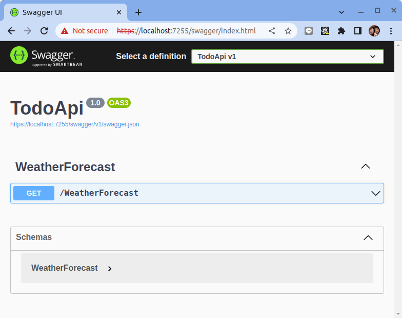
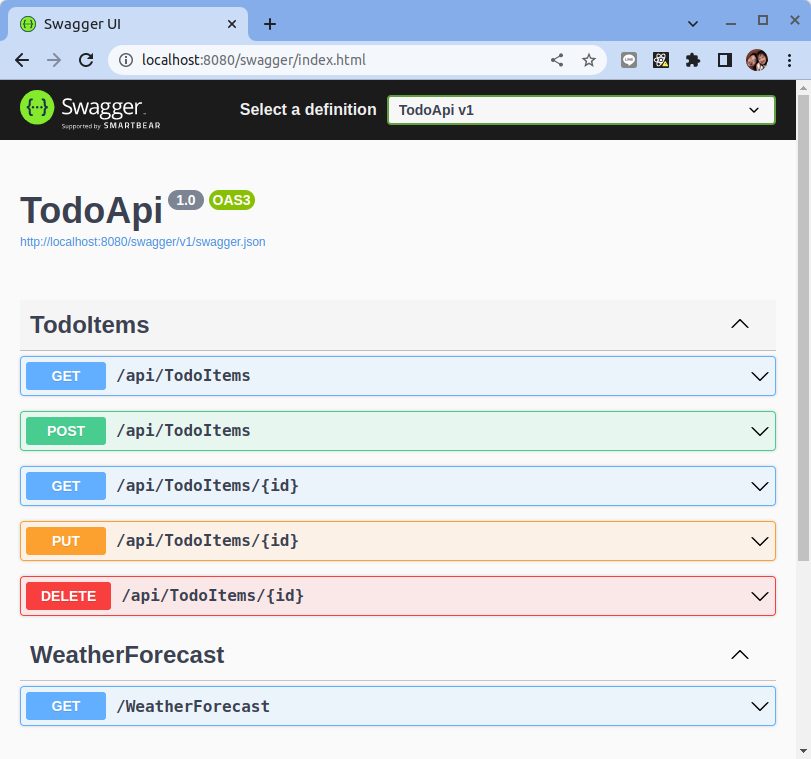
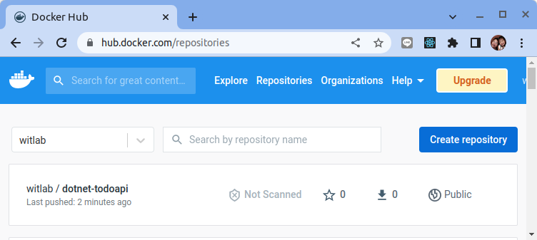

# 使用 ASP.NET Core 創建 Web API

原文: [Tutorial: Create a web API with ASP.NET Core](https://learn.microsoft.com/zh-tw/aspnet/core/tutorials/first-web-api?view=aspnetcore-6.0&tabs=visual-studio-code)

本教程教授使用 ASP.NET Core 構建 Web API 的基礎知識。

在本教程中，您將學習如何：

- 創建一個 Web API 項目。
- 添加模型類和數據庫上下文。
- 使用 CRUD 方法構建控制器。
- 配置路由、URL 路徑和返回值。
- 使用 http-repl 調用 Web API。
- 最後，您有一個 Web API，可以管理存儲在數據庫中的“待辦事項”項目。

## 概述

本教程會創建以下 API：

|API	|Description	|Request body	|Response body|
|-----|-------------|-------------|-------------|
|GET /api/todoitems	|Get all to-do items	|None	|Array of to-do items|
|GET /api/todoitems/{id}	|Get an item by ID	|None	|To-do item|
|POST /api/todoitems	|Add a new item	|To-do item	|To-do item|
|PUT /api/todoitems/{id}	|Update an existing item  	|To-do item	|None|
|DELETE /api/todoitems/{id}    	|Delete an item    	|None	|None|

下圖顯示了應用程序的設計。


## 先決條件

- [Visual Studio Code](https://code.visualstudio.com/download)
- [C# for Visual Studio Code (latest version)](https://marketplace.visualstudio.com/items?itemName=ms-dotnettools.csharp)
- [.NET 6.0 SDK](https://dotnet.microsoft.com/download/dotnet/6.0)

## 創建一個 web 專案

運行以下命令：

```bash title=".NET CLI"
dotnet new webapi -o TodoApi
cd TodoApi
dotnet add package Microsoft.EntityFrameworkCore.InMemory
code -r ../TodoApi
```

這些命令：

- 創建一個新的 Web API 專案並在 Visual Studio Code 中打開它
- 添加所需的 NuGet 包

這時候專案目錄應該長的像:

```bash
TodoApi/
├── appsettings.Development.json
├── appsettings.json
├── bin
│   └── Debug
│       └── net6.0
│           └── ref
├── Controllers
│   └── WeatherForecastController.cs
├── obj
│   ├── Debug
│   │   └── net6.0
│   │       ├── project.razor.json
│   │       ├── ref
│   │       ├── staticwebassets
│   │       ├── TodoApi.AssemblyInfo.cs
│   │       ├── TodoApi.AssemblyInfoInputs.cache
│   │       ├── TodoApi.assets.cache
│   │       ├── TodoApi.csproj.AssemblyReference.cache
│   │       ├── TodoApi.GeneratedMSBuildEditorConfig.editorconfig
│   │       └── TodoApi.GlobalUsings.g.cs
│   ├── project.assets.json
│   ├── project.nuget.cache
│   ├── TodoApi.csproj.nuget.dgspec.json
│   ├── TodoApi.csproj.nuget.g.props
│   └── TodoApi.csproj.nuget.g.targets
├── Program.cs
├── Properties
│   └── launchSettings.json
├── TodoApi.csproj
└── WeatherForecast.cs
```

### 測試專案基本結構

專案模板會創建一個支持 Swagger 的 `WeatherForecast` API。

執行下列命令來運行應用程序：

```bash
dotnet run
```

結果:

```bash
Building...
info: Microsoft.Hosting.Lifetime[14]
      Now listening on: https://localhost:7255
info: Microsoft.Hosting.Lifetime[14]
      Now listening on: http://localhost:5298
info: Microsoft.Hosting.Lifetime[0]
      Application started. Press Ctrl+C to shut down.
info: Microsoft.Hosting.Lifetime[0]
      Hosting environment: Development
info: Microsoft.Hosting.Lifetime[0]
      Content root path: /home/dxlab/opt/ws_dotnet/TodoApi/
```


在瀏覽器中，導航到 `https://localhost:<port>/swagger`，其中 <port> 是輸出中顯示的隨機選擇的端口號。



使用 `curl` 來測試一下 API:

```bash
curl -k https://localhost:<port>/weatherforecast | jq
```

結果:

```json
[
  {
    "date": "2022-09-21T14:19:44.3566076+08:00",
    "temperatureC": -4,
    "temperatureF": 25,
    "summary": "Hot"
  },
  {
    "date": "2022-09-22T14:19:44.3566213+08:00",
    "temperatureC": -16,
    "temperatureF": 4,
    "summary": "Warm"
  },
  {
    "date": "2022-09-23T14:19:44.356622+08:00",
    "temperatureC": 30,
    "temperatureF": 85,
    "summary": "Scorching"
  },
  {
    "date": "2022-09-24T14:19:44.3566224+08:00",
    "temperatureC": 24,
    "temperatureF": 75,
    "summary": "Freezing"
  },
  {
    "date": "2022-09-25T14:19:44.3566229+08:00",
    "temperatureC": 3,
    "temperatureF": 37,
    "summary": "Cool"
  }
]
```

### 添加 model 類別

`Model` 是一組表示應用程序管理的數據的類別。此應用程序的模型是單個 `TodoItem` 類別 。

添加一個名為 `Models` 的文件夾。

使用以下代碼將 `TodoItem.cs` 文件添加到 `Models` 文件夾：

```csharp title="Models/TodoItem.cs"
namespace TodoApi.Models
{
    public class TodoItem
    {
        public long Id { get; set; }
        public string? Name { get; set; }
        public bool IsComplete { get; set; }
    }
}
```

`Id` 屬性用作關係數據庫中的唯一鍵。

`Model` 類別可以放在項目中的任何位置，但按照慣例使用 `Models` 文件夾。

### 添加數據庫上下文

數據庫上下文是協調數據模型的 Entity Framework 功能的主要類別。此類是通過派生自 Microsoft.EntityFrameworkCore.DbContext 類別而創建的。

```csharp title="Models/TodoContext.cs"
using Microsoft.EntityFrameworkCore;
using System.Diagnostics.CodeAnalysis;

namespace TodoApi.Models
{
    public class TodoContext : DbContext
    {
        public TodoContext(DbContextOptions<TodoContext> options)
            : base(options)
        {
        }

        public DbSet<TodoItem> TodoItems { get; set; } = null!;
    }
}
```

###  註冊 database context

在 ASP.NET Core 中，database context等服務必須註冊到依賴注入 (DI) 容器中。容器為控制器提供服務。

使用以下代碼更新 `Program.cs`：

```csharp title="Program.cs" hl_lines="1 2 9 10"
using Microsoft.EntityFrameworkCore;
using TodoApi.Models;

var builder = WebApplication.CreateBuilder(args);

// Add services to the container.

builder.Services.AddControllers();
builder.Services.AddDbContext<TodoContext>(opt =>
    opt.UseInMemoryDatabase("TodoList"));

// Learn more about configuring Swagger/OpenAPI at https://aka.ms/aspnetcore/swashbuckle
builder.Services.AddEndpointsApiExplorer();
builder.Services.AddSwaggerGen();

var app = builder.Build();

// Configure the HTTP request pipeline.
if (app.Environment.IsDevelopment())
{
    app.UseDeveloperExceptionPage();
}

app.UseSwagger();
app.UseSwaggerUI();

// remark below line so dotnet api will allow using http & https
//app.UseHttpsRedirection();

app.UseAuthorization();

app.MapControllers();

app.Run();
```

- 將數據庫上下文添加到 DI 容器。
- 指定數據庫上下文將使用內存數據庫。

### 創建 controller 類別

確保您迄今為止所做的所有更改都已保存。

從項目文件夾，即 TodoApi 文件夾中運行以下命令：

```bash
dotnet add package Microsoft.VisualStudio.Web.CodeGeneration.Design
dotnet add package Microsoft.EntityFrameworkCore.Design
dotnet add package Microsoft.EntityFrameworkCore.SqlServer
dotnet tool install -g dotnet-aspnet-codegenerator
dotnet-aspnet-codegenerator controller -name TodoItemsController -async -api -m TodoItem -dc TodoContext -outDir Controllers
```

前面的命令：

- 添加腳手架所需的 NuGet 包。
- 安裝腳手架引擎 `dotnet-aspnet-codegenerator`。
- 生成 `TodoItemsController` 類別。

生成的代碼：

- 用 [ApiController] 屬性標記類。此屬性指示控制器響應 Web API 請求。有關該屬性啟用的特定行為的信息，請參閱使用 ASP.NET Core 創建 Web API。
- 使用 DI 將數據庫上下文 (TodoContext) 注入控制器。數據庫上下文用於控制器中的每個 CRUD 方法。

ASP.NET Core 模板用於：

- 帶有視圖的控制器在路由模板中包含 [action]。
- API 控制器在路由模板中不包含 [action]。

當 [action] 標記不在路由模板中時，操作名稱將從路由中排除。也就是說，操作的關聯方法名稱不會在匹配的路由中使用。

### 更新 PostTodoItem 創建方法

更新 PostTodoItem 中的 return 語句來使用 `nameof` 運算符：

```csharp title="Controllers/TodoItemsController.cs"
[HttpPost]
public async Task<ActionResult<TodoItem>> PostTodoItem(TodoItem todoItem)
{
    _context.TodoItems.Add(todoItem);
    await _context.SaveChangesAsync();

    //return CreatedAtAction("GetTodoItem", new { id = todoItem.Id }, todoItem);
    return CreatedAtAction(nameof(GetTodoItem), new { id = todoItem.Id }, todoItem);
}
```

上述代碼是一個 HTTP POST 方法，如 [HttpPost] 屬性所示。該方法從 HTTP 請求的正文中獲取待辦事項的值。

有關詳細信息，請參閱使用 Http[Verb] 屬性的屬性路由。

CreatedAtAction 方法：

- 如果成功，則返回 HTTP 201 狀態代碼。 HTTP 201 是在服務器上創建新資源的 HTTP POST 方法的標準響應。
- 將 Location 標頭添加到響應中。 Location 標頭指定新創建的待辦事項的 URI。有關詳細信息，請參閱 10.2.2 201 已創建。
- 引用 GetTodoItem 操作以創建 Location 標頭的 URI。 C# `nameof` 關鍵字用於避免在 `CreatedAtAction` 調用中對操作名稱進行硬編碼。

### 修改啟動配置

程式啟動時設定API要聆聽的 tcp 埠號 (port: 8080):

```json title="appsettings.json" hl_lines="9-15"
{
  "Logging": {
    "LogLevel": {
      "Default": "Information",
      "Microsoft.AspNetCore": "Warning"
    }
  },
  "AllowedHosts": "*",
  "Kestrel": {
    "Endpoints": {
      "Http": {
        "Url": "http://*:8080"
      }
    }
  }
}
```

### 測試專案執行

執行下列命令來運行應用程序：

```bash
dotnet run -e Production
```

結果:

```bash
Building...
warn: Microsoft.AspNetCore.Server.Kestrel[0]
      Overriding address(es) 'https://localhost:7255, http://localhost:5298'. Binding to endpoints defined via IConfiguration and/or UseKestrel() instead.
info: Microsoft.Hosting.Lifetime[14]
      Now listening on: http://[::]:8080
info: Microsoft.Hosting.Lifetime[0]
      Application started. Press Ctrl+C to shut down.
info: Microsoft.Hosting.Lifetime[0]
      Hosting environment: Development
info: Microsoft.Hosting.Lifetime[0]
      Content root path: /home/dxlab/opt/ws_dotnet/TodoApi/
```

使用瀏覽器來連接到 Swagger UI來進行簡易測試 `http://localhost:8080/swagger`



## 容器化 ASP.NET Application

在將 .NET 應用程序打包成 Docker 映像之前，首先進行應用的發佈。最好讓容器運行應用程序已發布版本。要發佈 ASP.NET 應用程序，請運行以下命令：

```bash
dotnet publish -c Release
```

結果:

```bash hl_lines="6"
Microsoft (R) Build Engine version 17.0.0+c9eb9dd64 for .NET
Copyright (C) Microsoft Corporation. All rights reserved.

  Determining projects to restore...
  All projects are up-to-date for restore.
  TodoApi -> /home/dxlab/opt/ws_dotnet/TodoApi/bin/Release/net6.0/TodoApi.dll
  TodoApi -> /home/dxlab/opt/ws_dotnet/TodoApi/bin/Release/net6.0/publish/
```

此命令將您的應用程序編譯到 `Release` 文件夾。從工作文件夾到發布文件夾的路徑應該是 `.\App\bin\Release\net6.0\publish\`

### 創建 Dockerfile

`docker build` 命令使用 **Dockerfile** 文件來創建容器映像。該文件是一個名為 Dockerfile 的文本文件，沒有擴展名。

在包含 .csproj 的目錄中創建一個名為 Dockerfile 的文件，然後在文本編輯器中打開它。本教程將使用 ASP.NET Core runtime映像檔。

```docker title="Dockerfile"
FROM mcr.microsoft.com/dotnet/sdk:6.0 AS build-env
WORKDIR /app

# Copy everything
COPY . ./
# Restore as distinct layers
RUN dotnet restore
# Build and publish a release
RUN dotnet publish -c Release -o out

# Build runtime image
FROM mcr.microsoft.com/dotnet/aspnet:6.0
WORKDIR /app
COPY --from=build-env /app/out .

# Expose web api port number
EXPOSE 8080

ENTRYPOINT ["dotnet", "TodoApi.dll"]
```

`FROM` 關鍵字需要指定一個 Docker 容器鏡像名稱。 Microsoft Container Registry (MCR, mcr.microsoft.com) 是 Docker Hub 的一個聯合組織，它託管可公開訪問的容器。 `dotnet` 字段是容器存儲庫，而 `sdk` 字段是容器映像名稱。該容器鏡像標有 6.0，用於版本控制。因此，mcr.microsoft.com/dotnet/aspnet:6.0 是 .NET 6.0 的runtime。

從您的終端，運行以下命令：

```
docker build -t dotnet-todoapi:base -f Dockerfile .
```

Docker 將處理 Dockerfile 中的每一行指令。 在 `docker build` 命令中設置鏡像的構建上下文。 `-f` 旗標指向 Dockerfile 的路徑。此命令構建映像並創建一個名為 donet-todoapi 的本地存儲庫，該存儲庫指向該映像。此命令完成後，運行 `docker images` 以查看已安裝的容器鏡像列表：

```bash
$ docker images

REPOSITORY                                         TAG                       IMAGE ID       CREATED          SIZE
dotnet-todoapi                                     base                      7e16da295b77   34 seconds ago   276MB
```

### 啟動 Docker 容器

端口映射用於訪問在 Docker 容器內運行的服務。我們打開一個主機端口，讓我們可以訪問 Docker 容器內相應的開放端口。然後所有對主機端口的請求都可以重定向到 Docker 容器中。

```bash
docker run -it --rm -p 8080:8080 dotnet-todoapi:base
```

### 推送容器鏡像到 Dockerhub

要把容器鏡像推到 Dockerhub 的前題是要先到 Docker Hub 上註冊帳號，本教程假設大家己經都有了帳號。

首先使用 `docker login` 指令登入到 Docker Hub:

```bash
$ docker login

Login with your Docker ID to push and pull images from Docker Hub. If you don't have a Docker ID, head over to https://hub.docker.com to create one.
Username: witlab
Password: 
WARNING! Your password will be stored unencrypted in /home/dxlab/.docker/config.json.
Configure a credential helper to remove this warning. See
https://docs.docker.com/engine/reference/commandline/login/#credentials-store

Login Succeeded
```

要把 Docker Image Push 到 Docker Hub 上，需要把 Docker Image 加上 Dockerhub 的 `Username`，如下指令:

```bash
$ docker build -t witlab/dotnet-todoapi:base -f Dockerfile .
```

接著使用下列命令來推送容器鏡像:

```bash
$ docker push witlab/dotnet-todoapi:base

The push refers to repository [docker.io/witlab/dotnet-todoapi]
6007b133d0ec: Pushed 
16ab2fb3fd71: Pushed 
efccb7d95dee: Pushed 
64d665f70cc1: Pushed 
e487c4dad54c: Pushed 
5ec686cbc3c7: Pushed 
b45078e74ec9: Pushed 
base: digest: sha256:54322ab39ce67b3d7a728f66935c3c4797b00c9c21bc9e71e457f94465c5aaf5 size: 1789
```

成功之後到 Docker Hub 去檢查看看容器鏡像是否己經成功上傳:



使用 `docker rm` 指令把 local 的 Image 刪除掉:

```bash
$ docker rmi -f witlab/dotnet-todoapi:base
```

測試從 Docker Hub pull Docker Image 下來，指令如下:

```bash
$ docker pull witlab/dotnet-todoapi:base
```

啟動 Docker Container，指令如下:

```bash
docker run -it --rm -p 8080:8080 witlab/dotnet-todoapi:base
```

啟動完成之後就可以使用 Browser 查看結果，輸入 URL 位址為 http://localhost:8080/swagger 可以看到如下畫面:


