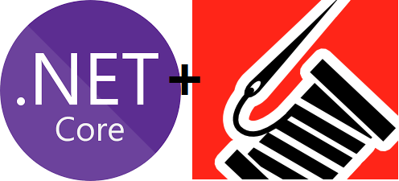
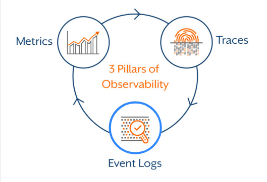
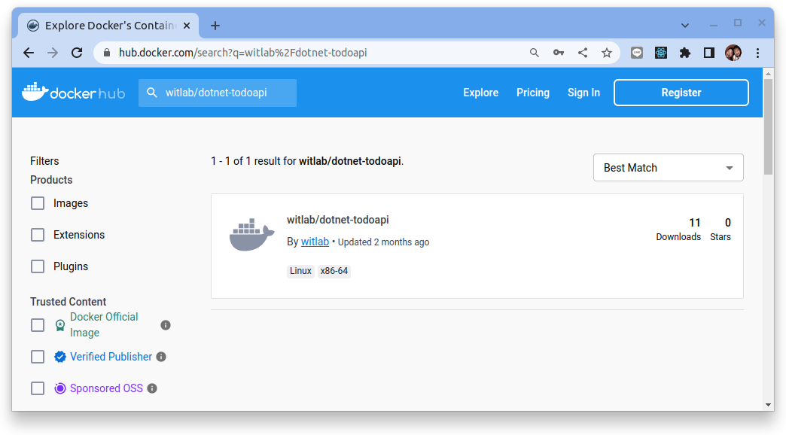
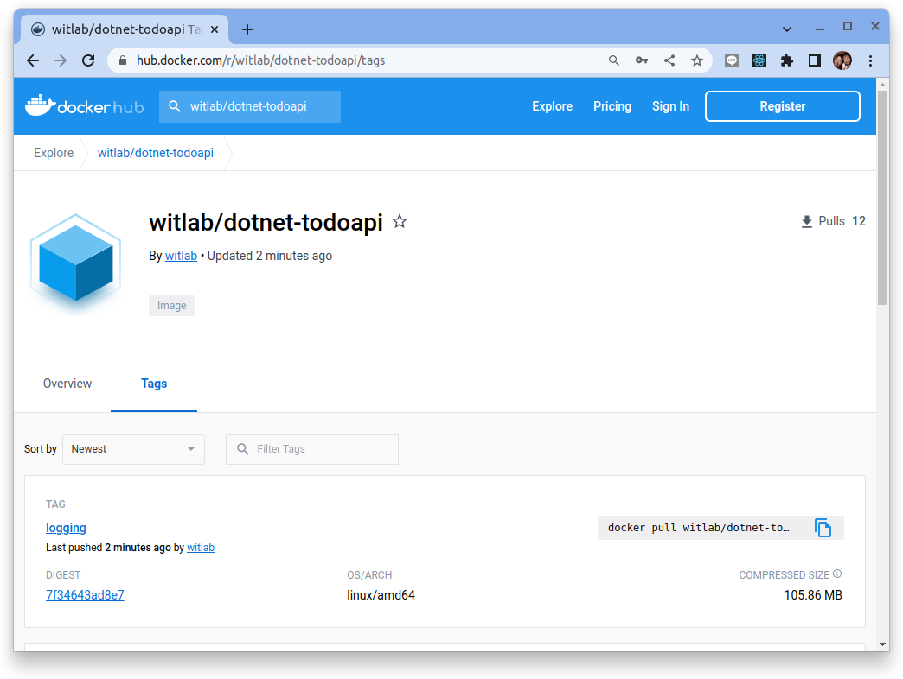
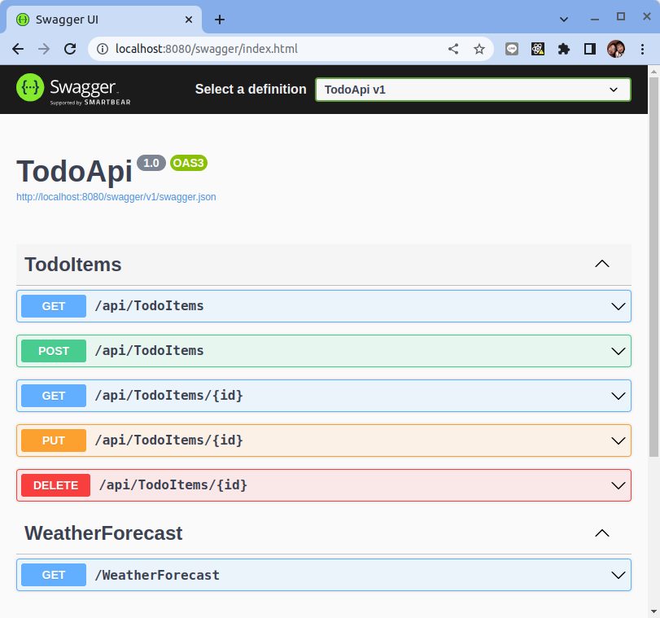

# 結構化日誌 ASP.NET Core 應用程序

參考: [.NET 6.0 如何使用 Serilog 對應用程式事件進行結構化紀錄](https://blog.miniasp.com/post/2021/11/29/How-to-use-Serilog-with-NET-6)
參考: [.NET 6 應用程式如何設定 Serilog](https://dotblogs.com.tw/yc421206/2022/09/04/serilog_config_in_asp_net_core)



## 可觀測性 - Logging

日誌、指標和鏈路追踪通常被稱為可觀察性的三大支柱。雖然可以訪問日誌、指標和跟踪並不一定會使系統更易於觀察，但這些都是強大的工具，如果理解得當，可以釋放構建更好系統的能力。

本教程主要著眼於如何儀器化 ASP.NET Core 應用程序，然後將應用程式運行的 **結構化日誌** 打印到 stdout 出來。



## 什麼是結構化日誌記錄？

**結構化日誌記錄** 是為應用程序日誌提供標準化的、預先確定的消息格式的過程，使它們能夠作為 **數據集** 而不是 **文本** 來處理。結構化日誌記錄的目標是獲取現在作為文本字符串提供的應用程序日誌，並將其轉化為易於搜索和分析的數據集合。

結構化日誌記錄組織記錄的數據，使其易於搜索、過濾和處理以進行更複雜的分析。JSON 是結構化日誌記錄的首選格式，但也可以接受其他格式例如在 CNCF 專案中常見的 [logfmt](https://brandur.org/logfmt)。最佳實踐是使用可以與日誌管理解決方案交互並支持自定義字段的日誌記錄框架來提供結構化日誌記錄。

詳細解釋見:[Structured Logging](../../../observability/logs/structured-logging.md)

## Serilog 函式庫說明

與 .NET 的許多其他庫一樣，Serilog 提供將日誌記錄拋轉到不同需要它的地方比如 console, file 或是其它日誌聚合系統。它易於設置，具有乾淨的 API，並且可在 .NET 平台之間移植。

與其他日誌庫不同，Serilog 在構建時考慮了強大的{==結構化事件數據==}。

官網:[https://serilog.net/](https://serilog.net/)


## 引入函式庫

**安裝 Serilog:**

進入專案根目錄，並且安裝下列 Serilog 套件：

```bash
dotnet add package Serilog.AspNetCore 
dotnet add package Serilog.Settings.Configuration
dotnet add package Serilog.Expressions
```

## 啟動日誌配置

修改專案根目錄 `appsettings.json` 配置檔:

```json title="appsettings.json"
{
  "AllowedHosts": "*",
  "Kestrel": {
    "Endpoints": {
      "Http": {
        "Url": "http://*:8080"
      }
    }
  },
  "Serilog": {
    "Using": [ "Serilog.Expressions"],
    "MinimumLevel": "Information",
    "WriteTo": [
      { 
        "Name": "Console",
        "Args": {
          "formatter": {
            "type": "Serilog.Templates.ExpressionTemplate, Serilog.Expressions",
            "template": "{ {Timestamp: @t, Level: @l, Message: @m, Exception: @x, ..@p} }\n"
          }
        } 
      }
    ],
    "Enrich": [],
    "Destructure": [],
    "Properties": {
        "Application": "dotnet-todoapi"
    }
  }
}
```

我們來說明幾個比較關鍵的配置:

- `Serilog.MinimumLevel`: 設定日誌等級, 在生產環境建議設成 `Warning` 等級。

    |Level|Usage|
    |-----|-----|
    |Verbose|Verbose is the noisiest level, rarely (if ever) enabled for a production app.<br/>詳細是最嘈雜的級別，很少在生產應用程序啟用。|
    |Debug|Debug is used for internal system events that are not necessarily observable from the outside, but useful when determining how something happened.<br/>調試用於內部系統事件，這些事件不一定能從外部觀察到，但在確定某事如何發生時很有用。|
    |Information|Information events describe things happening in the system that correspond to its responsibilities and functions. Generally these are the observable actions the system can perform.<br/>信息事件描述了系統中發生的與其職責和功能相對應的事情。通常，這些是系統可以執行的可觀察到的操作。|
    |Warning|When service is degraded, endangered, or may be behaving outside of its expected parameters, Warning level events are used.<br/>當服務降級、受到威脅或行為可能超出其預期參數時，將使用警告級別事件。|
    |Error|When functionality is unavailable or expectations broken, an Error event is used.<br/>當功能不可用或預期被打破時，將使用錯誤事件。|
    |Fatal|The most critical level, Fatal events demand immediate attention.<br/>最關鍵的級別，致命事件需要立即引起注意。|


- `Serilog.Using`: 定義日誌輸出的管道，把日誌轉換成 JSON 的格式好幾種，在本教程裡使用了最有彈性的 `Serilog.Expressions` 來定格序列化的內容。
- `Serilog.WriteTo.Args.formatter.type`: 日誌打印出來時的格式，通過 `"Serilog.Templates.ExpressionTemplate, Serilog.Expressions"` 來將日誌結構化成 JSON 數據。
- `Serilog.WriteTo.Args.formatter.template`: 這裡定義一個序列化成 JSON 的格式 `"{ {Timestamp: @t, Level: @l, Message: @m, Exception: @x, ..@p} }\n"`。

參考:

- [Serilog Configuration Basics](https://github.com/serilog/serilog/wiki/Configuration-Basics)
- [Customizing Serilog text output](https://nblumhardt.com/2021/06/customize-serilog-text-output/)
- [Customized JSON formatting with Serilog](https://nblumhardt.com/2021/06/customize-serilog-json-output/)


## 修改源碼來輸出日誌

通過上述的設定, 接著我們需要編修 `Programe.cs` 應用啟動程式來整合 `Serilog` 日誌套件:

```dotnet title="Programe.cs" linenums="1" hl_lines="3 6-9 12-14 25"
using Microsoft.EntityFrameworkCore;
using TodoApi.Models;
using Serilog;

// build logging config object
var config = new ConfigurationBuilder()
    .SetBasePath(Directory.GetCurrentDirectory())
    .AddJsonFile("appsettings.json")
    .Build();

// allow logging setup via configuration file
Log.Logger = new LoggerConfiguration()
    .ReadFrom.Configuration(config)
    .CreateLogger();

try {
    Log.Information("Starting web host");

    var builder = WebApplication.CreateBuilder(args);

    // Add services to the container.
    builder.Services.AddControllers();

    // Setup host to enable Seriallog
    builder.Host.UseSerilog();

    builder.Services.AddDbContext<TodoContext>(opt =>
        opt.UseInMemoryDatabase("TodoList"));

    // Learn more about configuring Swagger/OpenAPI at https://aka.ms/aspnetcore/swashbuckle
    builder.Services.AddEndpointsApiExplorer();
    builder.Services.AddSwaggerGen();

    var app = builder.Build();

    // Configure the HTTP request pipeline.
    if (app.Environment.IsDevelopment())
    {
        app.UseDeveloperExceptionPage();
    }

    app.UseSwagger();
    app.UseSwaggerUI();

    // remark below line so dotnet api will allow using http instead of https
    //app.UseHttpsRedirection();

    app.UseAuthorization();

    app.MapControllers();

    app.Run();

} catch (Exception ex) {
    Log.Fatal(ex, "Host terminated unexpectedly");
} finally {
    Log.CloseAndFlush();
}
```

### 結構化日誌語句

來自 `Serilog.Expressions` 的 `ExpressionTemplate` 提供了一種簡潔的方法來生成幾乎任何 JSON 格式，並且可以通過用戶定義的函數來擴展。接下來讓我們來看一下要如何使用 Serilog 自定義 JSON 格式。

範例:

```dotnet hl_lines="4"
Log.Logger = new LoggerConfiguration()
    .Enrich.WithProperty("Application", "Example")
    .WriteTo.Console(new ExpressionTemplate(
        "{ {@t, @mt, @l: if @l = 'Information' then undefined() else @l, @x, ..@p} }\n"))
    .CreateLogger();

Log.Information("Hello, {Name}!", "world");
```

該模板的核心是構造一個文本物件，其屬性帶有來自日誌事件的值。構造的物件被序列化生成一個 JSON，類似於：

```json
{"@t":"2021-06-14T08:44:01.7430455+10:00","@mt":"Hello {Name}!","Name":"world","Application":"Example"}
```

您可以在[語言參考](https://github.com/serilog/serilog-expressions#language-reference)中了解更多關於表達式模板的語法和結構的信息。

以下屬性在表達式中可用：

- `@t` - 事件的時間戳
- `@m` - 呈現的消息
- `@mt` - 原始消息模板
- `@l` - 事件的級別
- `@x` - 與事件關聯的異常，如果有的話，作為 Exception
- `@p` - 包含所有事件屬性的字典


## 容器化 ASP.NET Application


### 創建 Dockerfile

從您的終端，運行以下命令：

```
docker build -t witlab/dotnet-todoapi:logging -f Dockerfile .
```

Docker 將處理 Dockerfile 中的每一行指令。 在 `docker build` 命令中設置鏡像的構建上下文。 `-f` 旗標指向 Dockerfile 的路徑。此命令構建映像並創建一個名為 donet-todoapi 的本地存儲庫，該存儲庫指向該映像。此命令完成後，運行 `docker images` 以查看已安裝的容器鏡像列表：

```bash
$  docker images

REPOSITORY                        TAG            IMAGE ID       CREATED          SIZE
witlab/dotnet-todoapi             logging        e47679583afe   14 seconds ago   276MB
```

### 推送容器鏡像到 Dockerhub

要把容器鏡像推到 Dockerhub 的前題是要先到 Docker Hub 上註冊帳號，本教程假設大家己經都有了帳號。

首先使用 `docker login` 指令登入到 Docker Hub:

```bash
$ docker login

Login with your Docker ID to push and pull images from Docker Hub. If you don't have a Docker ID, head over to https://hub.docker.com to create one.
Username: witlab
Password: 
WARNING! Your password will be stored unencrypted in /home/dxlab/.docker/config.json.
Configure a credential helper to remove this warning. See
https://docs.docker.com/engine/reference/commandline/login/#credentials-store

Login Succeeded
```

使用下列命令來推送容器鏡像:

```bash
$ docker push witlab/dotnet-todoapi:logging

The push refers to repository [docker.io/witlab/dotnet-todoapi]
a57ac0df5cd2: Pushed 
cf38b142b456: Pushed 
fc47b3bbb3a5: Pushed 
4b7415c5302b: Pushed 
8407279d92ac: Pushed 
48b03e1004df: Pushed 
ec4a38999118: Pushed 
logging: digest: sha256:7f34643ad8e79e3f09b6a0e102c23c833681147e05adaffba80b742c2ab810c1 size: 1789
```

成功之後到 Docker Hub 去檢查看看容器鏡像是否己經成功上傳:



點選　"witlab/dotnet-toddapi" 之後再選擇 "Tags" 頁籤:



應該看到有一個鏡像的標籤是 `logging`。

使用 `docker rm` 指令把 local 的 Image 刪除掉:

```bash
$ docker rmi -f witlab/dotnet-todoapi:logging
```

測試從 Docker Hub pull Docker Image 下來，指令如下:

```bash
$ docker pull witlab/dotnet-todoapi:logging
```

啟動 Docker Container，指令如下:

```bash
docker run -it --rm -p 8080:8080 witlab/dotnet-todoapi:logging
```

啟動完成之後就可以使用 Browser 查看結果，輸入 URL 位址為 http://localhost:8080/swagger 可以看到如下畫面:



同時間從 stdout 也可看到被格式化的日誌:

```bash
$ docker run -it --rm -p 8080:8080 witlab/dotnet-todoapi:logging

{"Timestamp":"2022-11-29T14:32:49.2606897+00:00","Level":"Information","Message":"Starting web host","Application":"dotnet-todoapi"}
{"Timestamp":"2022-11-29T14:32:49.4351668+00:00","Level":"Warning","Message":"Overriding address(es) 'http://+:80'. Binding to endpoints defined via IConfiguration and/or UseKestrel() instead.","addresses":"http://+:80","SourceContext":"Microsoft.AspNetCore.Server.Kestrel","Application":"dotnet-todoapi"}
{"Timestamp":"2022-11-29T14:32:49.4509467+00:00","Level":"Information","Message":"Now listening on: http://[::]:8080","address":"http://[::]:8080","EventId":{"Id":14,"Name":"ListeningOnAddress"},"SourceContext":"Microsoft.Hosting.Lifetime","Application":"dotnet-todoapi"}
{"Timestamp":"2022-11-29T14:32:49.4511854+00:00","Level":"Information","Message":"Application started. Press Ctrl+C to shut down.","SourceContext":"Microsoft.Hosting.Lifetime","Application":"dotnet-todoapi"}
{"Timestamp":"2022-11-29T14:32:49.4512700+00:00","Level":"Information","Message":"Hosting environment: Production","envName":"Production","SourceContext":"Microsoft.Hosting.Lifetime","Application":"dotnet-todoapi"}
{"Timestamp":"2022-11-29T14:32:49.4513467+00:00","Level":"Information","Message":"Content root path: /app/","contentRoot":"/app/","SourceContext":"Microsoft.Hosting.Lifetime","Application":"dotnet-todoapi"}
```

## 結論

儘可能地對應用程序使用 Structure Logging (JSON) 來輸出日誌，並將它們收集到日誌聚合器（如 Grafana loki, Elasticsearch）中。

結構化的日誌語句使得使用 Grafana 或　Kibana 等日誌分析工具更容易找到相關日誌。