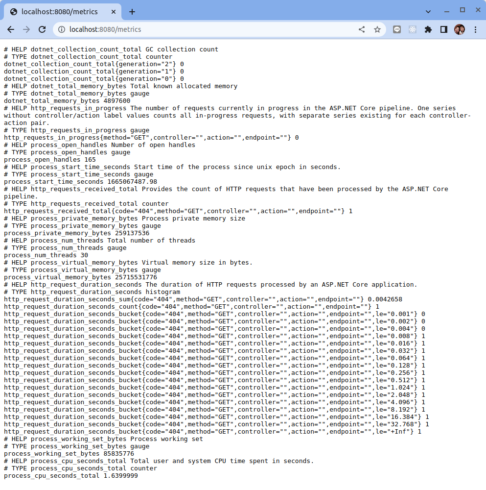
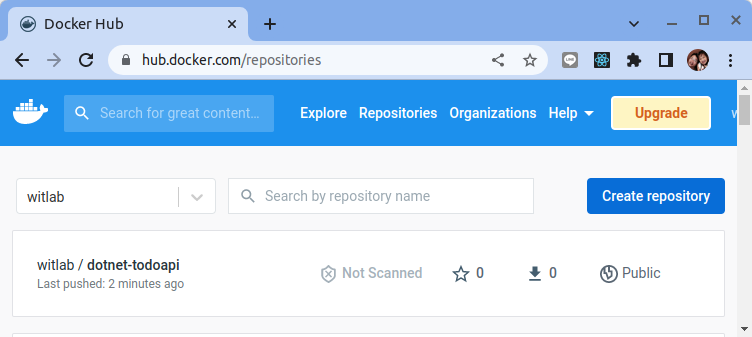
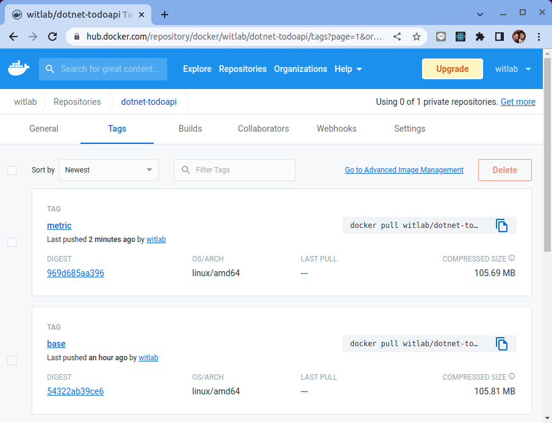

# 儀器化 ASP.NET Core 應用程序

原文: https://blog.csdn.net/sD7O95O/article/details/124009720

## 引入函式庫

[prometheus-net](https://github.com/prometheus-net/prometheus-net#aspnet-core-http-request-metrics) 是一個 .NET 庫，用於檢測應用程序並將指標暴露出來給 Prometheus 捉取。

該函式庫允許使用自定義指標來檢測代碼，並為 ASP.NET Core 提供一些內置的指標集合集成。

```bash
dotnet add package prometheus-net.AspNetCore
```

修改

```csharp title="Program.cs" hl_lines="3 35 36"
using Microsoft.EntityFrameworkCore;
using TodoApi.Models;
using Prometheus;

var builder = WebApplication.CreateBuilder(args);

// Add services to the container.

builder.Services.AddControllers();
builder.Services.AddDbContext<TodoContext>(opt =>
    opt.UseInMemoryDatabase("TodoList"));

// Learn more about configuring Swagger/OpenAPI at https://aka.ms/aspnetcore/swashbuckle
builder.Services.AddEndpointsApiExplorer();
builder.Services.AddSwaggerGen();

var app = builder.Build();

// Configure the HTTP request pipeline.
if (app.Environment.IsDevelopment())
{
    app.UseDeveloperExceptionPage();
}

app.UseSwagger();
app.UseSwaggerUI();

// remark below line so dotnet api will allow using http instead of https
//app.UseHttpsRedirection();

app.UseAuthorization();

app.MapControllers();

app.MapMetrics();
app.UseHttpMetrics();

app.Run();
```

執行下列命令來運行應用程序：

```bash
dotnet run
```

啟動成功後在瀏覽器中，導航到 https://localhost:8080/swagger 。


## 公開指標

上述的設定會將 Dotnet WebAPI 的相關指標暴露到 `https://localhost:8080/metrics` 。



指標的元數據列表如下:

|指標名稱	|型別	|說明|
|---------|-------|---|
|dotnet_collection_count_total|counter|GC collection count<br>GC 收集計數|
|dotnet_total_memory_bytes|gauge|Total known allocated memory<br>總已知分配內存|
|{==http_request_duration_seconds==}|histogram|The duration of HTTP requests processed by an ASP.NET Core application.<br>ASP.NET Core 應用程序處理的 HTTP 請求的持續時間。|
|http_requests_in_progress|gauge|The number of requests currently in progress in the ASP.NET Core pipeline. One series without controller/action label values counts all in-progress requests, with separate series existing for each controller-action pair.<br>ASP.NET Core 管道中當前正在進行的請求數。一個沒有控制器/動作標籤值的系列會計算所有正在進行的請求，每個控制器-動作對都有單獨的系列。|
|http_requests_received_total|counter|Provides the count of HTTP requests that have been processed by the ASP.NET Core pipeline.<br>提供已由 ASP.NET Core 管道處理的 HTTP 請求的計數。|
|process_cpu_seconds_total|counter|Total user and system CPU time spent in seconds.<br>以秒為單位花費的用戶和系統 CPU 總時間。|
|process_num_threads|gauge|Total number of threads<br>線程總數|
|process_open_handles|gauge|Number of open handles<br>打開句柄數|
|process_private_memory_bytes|gauge|Process private memory size<br>進程私有內存大小|
|process_start_time_seconds|gauge|Start time of the process since unix epoch in seconds.<br>自 unix 紀元以來進程的開始時間，以秒為單位。|
|process_virtual_memory_bytes|gauge|Virtual memory size in bytes.<br>以字節為單位的虛擬內存大小。|
|process_working_set_bytes|gauge|Process working set<br>進程工作集|

### 指標監控

參考:

- [The RED Method](https://grafana.com/files/grafanacon_eu_2018/Tom_Wilkie_GrafanaCon_EU_2018.pdf)
- [PromQL 教程](../../../../prometheus/promql/intro.md)
- [搞懂 Prometheus 的直方圖](../../../../prometheus/promql/metric-histogram.md)
- [簡單理解 Summary 和 Histogram 指標](./../../../prometheus/promql/metric-histogram-summary.md)

#### 資源監控 - USE Method

對於每個資源，監控：

- Utilization (% time that the resource was busy)
- Saturation (amount of work resource has to do, often queue length)
- Errors (count of error events)

舉例來說 **餐廳服務員** 對 **餐廳老闆** 來說是一種 **資源**:

- Utilization (% time that the resource was busy): 在一個工作小時裡服務員在忙碌工作的比例
- Saturation (amount of work resource has to do, often queue length): 等待服務員去點餐的餐數
- Errors (count of error events): 服務員執行工件出錯的次數

使用 Pod 在 Kubernetes 裡的指標來計算:

```bash
# CPU Utilisation:

1 - avg(rate(node_cpu{job="default/node-exporter",mode="idle"}[1m]))

# CPU Saturation:

sum(node_load1{job="default/node-exporter"}) / sum(node:node_num_cpu:sum)

# Memory Utilisation: 

1 - sum(node_memory_MemFree{job="…"} +
        node_memory_Cached{job="…"}  +
        node_memory_Buffers{job="…"}
    ) / sum(node_memory_MemTotal{job="…"})

# Memory Saturation:

1e3 * sum(rate(node_vmstat_pgpgin{job="…"}[1m]) + rate(node_vmstat_pgpgout{job="…"}[1m])))
```


#### 服務監控 - RED Method

對於每個服務，監控：

- Rate (the number of requests per second)
- Errors (the number of those requests that are failing)
- Duration (the amount of time those requests take)

舉例來說 **點餐** 對 **來餐廳用餐的客人** 來說是一種 **服務**:

- Rate (the number of requests per second): 在單位時間裡客人會呼叫點餐的次數
- Errors (the number of those requests that are failing): 客人點餐但結果出錯的比率
- Duration (the amount of time those requests take): 客人點餐到餐點到桌的時間長度

使用 `http_server_requests_seconds` 這個 `histogram` 的指標來計算:

```bash
# Rate:

sum(rate(http_request_duration_seconds_count{job="…"}[1m]))

# Errors:

sum(rate(http_request_duration_seconds_count{job="…",status_code!~"2.."}[1m]))


# Duration:

histogram_quantile(0.99,sum(rate(http_request_duration_seconds_bucket{job="…"}[1m])) by (le))
```

## 容器化 ASP.NET Application


### 創建 Dockerfile

從您的終端，運行以下命令：

```
docker build -t witlab/dotnet-todoapi:metric -f Dockerfile .
```

Docker 將處理 Dockerfile 中的每一行指令。 在 `docker build` 命令中設置鏡像的構建上下文。 `-f` 旗標指向 Dockerfile 的路徑。此命令構建映像並創建一個名為 donet-todoapi 的本地存儲庫，該存儲庫指向該映像。此命令完成後，運行 `docker images` 以查看已安裝的容器鏡像列表：

```bash
$ docker images

REPOSITORY                        TAG       IMAGE ID       CREATED         SIZE
witlab/dotnet-todoapi             metric    43e06ecd29a9   5 seconds ago   275MB
```

### 推送容器鏡像到 Dockerhub

要把容器鏡像推到 Dockerhub 的前題是要先到 Docker Hub 上註冊帳號，本教程假設大家己經都有了帳號。

首先使用 `docker login` 指令登入到 Docker Hub:

```bash
$ docker login

Login with your Docker ID to push and pull images from Docker Hub. If you don't have a Docker ID, head over to https://hub.docker.com to create one.
Username: witlab
Password: 
WARNING! Your password will be stored unencrypted in /home/dxlab/.docker/config.json.
Configure a credential helper to remove this warning. See
https://docs.docker.com/engine/reference/commandline/login/#credentials-store

Login Succeeded
```

使用下列命令來推送容器鏡像:

```bash
$ docker push witlab/dotnet-todoapi:metric

The push refers to repository [docker.io/witlab/dotnet-todoapi]
6007b133d0ec: Pushed 
16ab2fb3fd71: Pushed 
efccb7d95dee: Pushed 
64d665f70cc1: Pushed 
e487c4dad54c: Pushed 
5ec686cbc3c7: Pushed 
b45078e74ec9: Pushed 
base: digest: sha256:54322ab39ce67b3d7a728f66935c3c4797b00c9c21bc9e71e457f94465c5aaf5 size: 1789
```

成功之後到 Docker Hub 去檢查看看容器鏡像是否己經成功上傳:



點選　"witlab/dotnet-toddapi" 之後再選擇 "Tags" 頁籤:



應該看到有一個鏡像的標籤是 `metrics`。

使用 `docker rm` 指令把 local 的 Image 刪除掉:

```bash
$ docker rmi -f witlab/dotnet-todoapi:metric
```

測試從 Docker Hub pull Docker Image 下來，指令如下:

```bash
$ docker pull witlab/dotnet-todoapi:metric
```

啟動 Docker Container，指令如下:

```bash
docker run -it --rm -p 8080:8080 witlab/dotnet-todoapi:metric
```

啟動完成之後就可以使用 Browser 查看結果，輸入 URL 位址為 http://localhost:8080/swagger 可以看到如下畫面:


