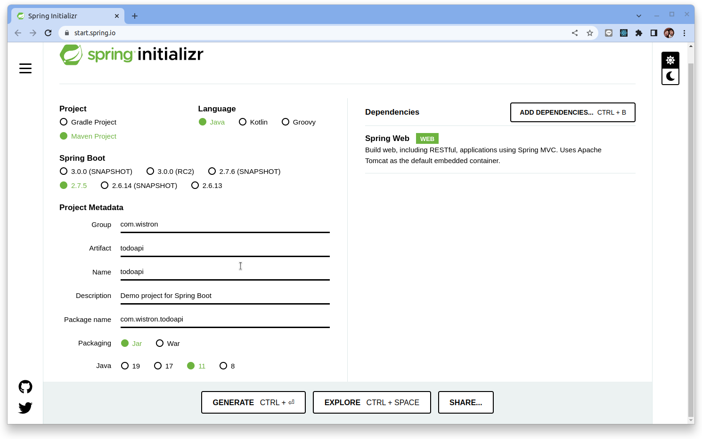
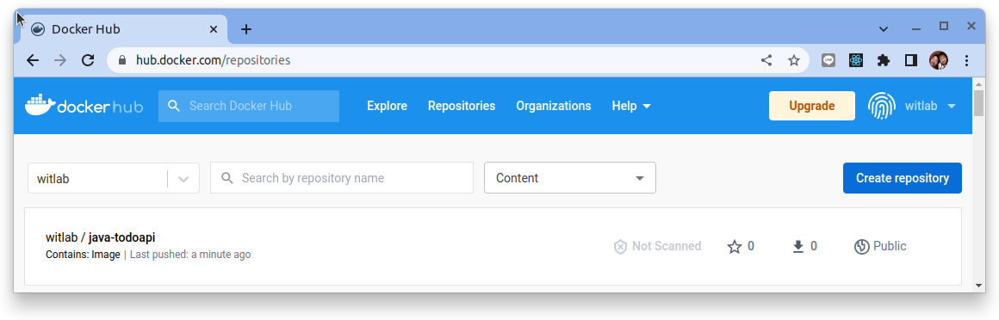

# 使用 Springboot 創建 Web API

原文: [Building a RESTful Web Service](https://spring.io/guides/gs/rest-service/)


## 概述

本教程教授使用 Sprintboot (Java) 構建 Web API 的基礎知識。

您將學習如何：

- 創建一個 Web API 項目。
- 添加模型類和數據庫整合 Repository 類別。
- 使用 CRUD 方法構建控制器。
- 配置路由、URL 路徑和返回值。
- 調用 Web API。

本教程會創建以下 API：

|API	|Description	|Request body	|Response body|
|-----|-------------|-------------|-------------|
|GET /api/todoitems	|Get all to-do items	|None	|Array of to-do items|
|GET /api/todoitems/{id}	|Get an item by ID	|None	|To-do item|
|POST /api/todoitems	|Add a new item	|To-do item	|To-do item|
|PUT /api/todoitems/{id}	|Update an existing item  	|To-do item	|None|
|DELETE /api/todoitems/{id}    	|Delete an item    	|None	|None|

下圖顯示了應用程序的設計。


最後，您有一個 Web API，可以管理存儲在數據庫中的 “ToDo” 專案。

整個專案的目錄結構如下:

```bash
todoapi
├── Dockerfile
├── HELP.md
├── mvnw
├── mvnw.cmd
├── pom.xml
└── src
    ├── main
    │   ├── java
    │   │   └── com
    │   │       └── wistron
    │   │           └── todoapi
    │   │               ├── controller
    │   │               │   └── GreetingController.java
    │   │               ├── model
    │   │               │   └── Greeting.java
    │   │               └── TodoapiApplication.java
    │   └── resources
    │       ├── application.properties
    │       ├── static
    │       └── templates
    └── test
        └── java
            └── com
                └── wistron
                    └── todoapi
                        └── TodoapiApplicationTests.java
```

## 需要什麼

- 約15分鐘
- 最喜歡的文本編輯器或 IDE
- [JDK 1.8](http://www.oracle.com/technetwork/java/javase/downloads/index.html) 或更高版本
- [Gradle 4+](http://www.gradle.org/downloads) 或 [Maven 3.2+](https://maven.apache.org/download.cgi)

您還可以將代碼直接導入 IDE：

- [Spring Tool Suite (STS)](https://spring.io/guides/gs/sts)
- [IntelliJ IDEA](https://spring.io/guides/gs/intellij-idea/)
- [VSCode](https://spring.io/guides/gs/guides-with-vscode/)

本教程使用 IntelliJ IDEA 來進行示範。

## 創建一個 web 專案

### 從 Spring Initializr 開始

1. 導航到 `https://start.spring.io`。該服務提取應用程序所需的所有依賴項，並為您完成大部分設置。
2. 選擇 Gradle 或 Maven 以及您要使用的語言。本指南假定您選擇了 Java。
3. 點擊　`Dependencies`　並選擇 `Spring Web`。
4. 點擊 `Generate`。
    
5. 下載生成的 ZIP 文件，該文件是根據您的選擇配置的 Web 應用程序的存檔。

###　引入 SpringDoc 套件

文檔是構建 REST API 的重要組成部分。引入 SpringDoc　套件來簡化 API 文檔生成和維護的工具。

要讓 `springdoc-openapi` 自動為我們的 API 生成 OpenAPI 3 規範文檔，我們只需將 `springdoc-openapi-ui` 依賴項添加到我們的 `pom.xml` 中：

```xml title="pom.xml" hl_lines="25-30"
<?xml version="1.0" encoding="UTF-8"?>
<project xmlns="http://maven.apache.org/POM/4.0.0" xmlns:xsi="http://www.w3.org/2001/XMLSchema-instance"
	xsi:schemaLocation="http://maven.apache.org/POM/4.0.0 https://maven.apache.org/xsd/maven-4.0.0.xsd">
	<modelVersion>4.0.0</modelVersion>
	<parent>
		<groupId>org.springframework.boot</groupId>
		<artifactId>spring-boot-starter-parent</artifactId>
		<version>2.7.5</version>
		<relativePath/> <!-- lookup parent from repository -->
	</parent>
	<groupId>com.wistron</groupId>
	<artifactId>todoapi</artifactId>
	<version>0.0.1-SNAPSHOT</version>
	<name>todoapi</name>
	<description>Demo project for Spring Boot</description>
	<properties>
		<java.version>11</java.version>
	</properties>
	<dependencies>
		<dependency>
			<groupId>org.springframework.boot</groupId>
			<artifactId>spring-boot-starter-web</artifactId>
		</dependency>

        <!-- openapi swagger  -->
		<dependency>
			<groupId>org.springdoc</groupId>
			<artifactId>springdoc-openapi-ui</artifactId>
			<version>1.6.12</version>
		</dependency>

		<dependency>
			<groupId>org.springframework.boot</groupId>
			<artifactId>spring-boot-starter-test</artifactId>
			<scope>test</scope>
		</dependency>
	</dependencies>

	<build>
		<plugins>
			<plugin>
				<groupId>org.springframework.boot</groupId>
				<artifactId>spring-boot-maven-plugin</artifactId>
			</plugin>
		</plugins>
	</build>

</project>
```

### 添加 model 類別

現在您已經設置了項目和構建系統，您可以創建您的 Web 服務。

該服務將處理 `/WeatherForecast` 的 GET 請求。 GET 請求應返回 200 OK 響應，其中包含表示了未來五天的天氣預告的 JSON。它應該類似於以下輸出：

```json
[
  {
    "date": "2022-11-13T08:13:52.897+00:00",
    "temperatureC": -15,
    "summary": "Sweltering",
    "temperatureF": 6
  },
  {
    "date": "2022-11-14T08:13:52.897+00:00",
    "temperatureC": -16,
    "summary": "Balmy",
    "temperatureF": 4
  },
  {
    "date": "2022-11-15T08:13:52.897+00:00",
    "temperatureC": 42,
    "summary": "Scorching",
    "temperatureF": 107
  },
  {
    "date": "2022-11-16T08:13:52.897+00:00",
    "temperatureC": 42,
    "summary": "Hot",
    "temperatureF": 107
  },
  {
    "date": "2022-11-17T08:13:52.897+00:00",
    "temperatureC": 20,
    "summary": "Freezing",
    "temperatureF": 67
  }
]
```

撰寫一個 POJO 其中包含 溫度(`temperatureC`) 和 天氣(`summary`) 數據的欄位、構造函數和訪問器，如以下清單（來自 `src/main/java/com/wistron/todoapi/model/ＷeatherForecast.java`）所示：

```java title="ＷeatherForecast.java"
package com.wistron.todoapi.model;

import java.util.Date;

public class WeatherForecast {
    private Date date;
    private int temperatureC;
    private String summary;

    public WeatherForecast() {
    }

    public WeatherForecast(Date date, int temperatureC, String summary) {
        this.date = date;
        this.temperatureC = temperatureC;
        this.summary = summary;
    }

    public Date getDate() {
        return date;
    }

    public void setDate(Date date) {
        this.date = date;
    }

    public int getTemperatureC() {
        return temperatureC;
    }

    public void setTemperatureC(int temperatureC) {
        this.temperatureC = temperatureC;
    }

    public int getTemperatureF() {
        return 32 + (int)(this.temperatureC / 0.5556);
    }

    public String getSummary() {
        return summary;
    }

    public void setSummary(String summary) {
        this.summary = summary;
    }
}
```

### 創建 controller 類別

在 Spring 構建 RESTful Web 服務的方法中，HTTP 請求由控制器處理。這些組件由 `@RestController` 註解標識，下面清單中顯示的 `WeatherForecastController`（來自 `src/main/java/com/wistron/todoapi/controller/WeatherForecastController.java`）通過返回 `WeatherForecast` 的新實例來處理 `/WeatherForecast` 的 GET 請求：

```java title="WeatherForecastController.java"
package com.wistron.todoapi.controller;

import com.wistron.todoapi.model.WeatherForecast;
import io.swagger.v3.oas.annotations.tags.Tag;
import org.springframework.http.HttpStatus;
import org.springframework.http.MediaType;
import org.springframework.http.ResponseEntity;
import org.springframework.web.bind.annotation.RequestMapping;
import org.springframework.web.bind.annotation.RequestMethod;
import org.springframework.web.bind.annotation.RestController;

import java.util.ArrayList;
import java.util.Date;
import java.util.List;
import java.util.Random;

@Tag(name="WeatherForecast")
@RestController
public class WeatherForecastController {
    private static String[] summaries = {"Freezing", "Bracing", "Chilly", "Cool", "Mild", "Warm", "Balmy", "Hot", "Sweltering", "Scorching"};

    public WeatherForecastController() {
    }

    /**
     * HTTP GET ALL
     */
    @RequestMapping(value = "/WeatherForecast", method = RequestMethod.GET, produces = {MediaType.APPLICATION_JSON_VALUE})
    public ResponseEntity<?> getWeatherForecast() {
        Date today = new Date();
        Random random = new Random();
        try {
            List<WeatherForecast> weatherForecasts = new ArrayList<>();
            for (int i = 1; i <=5; i++) {
                Date forecastDate = new Date(today.getTime() + i * (1000 * 60 * 60 * 24));
                int temperaturC = random.nextInt(75)-20;
                String summary = summaries[random.nextInt(10)];
                WeatherForecast weatherForecast = new WeatherForecast(forecastDate, temperaturC, summary);
                weatherForecasts.add(weatherForecast);
            }
            return new ResponseEntity<>(weatherForecasts, HttpStatus.OK);
        } catch (Exception e) {
            return new ResponseEntity<>("Nothing found", HttpStatus.NOT_FOUND);
        }
    }
}
```

### 設定 ＯpenAPI 文件設定

修改 `TodoapiApplicaton.java` 的 annotation 來設定 OpenApi　的基本訊息:

```java title="TodoapiApplicaton.java" hl_lines="1 2 8"
package com.wistron.todoapi;

import io.swagger.v3.oas.annotations.OpenAPIDefinition;
import io.swagger.v3.oas.annotations.info.Info;
import org.springframework.boot.SpringApplication;
import org.springframework.boot.autoconfigure.SpringBootApplication;

@OpenAPIDefinition(info = @Info(title="TodoApi", version="1.0"))
@SpringBootApplication
public class TodoapiApplication {

	public static void main(String[] args) {
		SpringApplication.run(TodoapiApplication.class, args);
	}

}
```

### 構建一個可執行的 JAR

您可以使用 Gradle 或 Maven 從命令行運行應用程序。您還可以構建一個包含所有必要依賴項、類和資源的單個可執行 JAR 文件並運行它。構建可執行 jar 可以在整個開發生命週期、跨不同環境等中輕鬆地作為應用程序交付、版本化和部署服務。

如果您使用 Gradle，則可以使用 `./gradlew bootRun` 運行應用程序。或者，您可以使用 `./gradlew build` 構建 JAR 文件，然後運行 JAR 文件，如下所示：

```bash
java -jar build/libs/todoapi-0.0.1-SNAPSHOT.jar
```

如果您使用 Maven，則可以使用 `./mvnw spring-boot:run` 運行應用程序。或者，您可以使用 `./mvnw clean package` 構建 JAR 文件，然後運行 JAR 文件，如下所示：

```bash
java -jar target/todoapi-0.0.1-SNAPSHOT.jar
```

執行下列命令來訪問 `http://localhost:8080/WeatherForecast`：

```bash
curl 'http://localhost:8080/WeatherForecast'
```

結果如以下清單所示：

```json
[
  {
    "date": "2022-11-13T08:13:52.897+00:00",
    "temperatureC": -15,
    "summary": "Sweltering",
    "temperatureF": 6
  },
  {
    "date": "2022-11-14T08:13:52.897+00:00",
    "temperatureC": -16,
    "summary": "Balmy",
    "temperatureF": 4
  },
  {
    "date": "2022-11-15T08:13:52.897+00:00",
    "temperatureC": 42,
    "summary": "Scorching",
    "temperatureF": 107
  },
  {
    "date": "2022-11-16T08:13:52.897+00:00",
    "temperatureC": 42,
    "summary": "Hot",
    "temperatureF": 107
  },
  {
    "date": "2022-11-17T08:13:52.897+00:00",
    "temperatureC": 20,
    "summary": "Freezing",
    "temperatureF": 67
  }
]
```

## Todo API 構建

接下來我們要開始實踐 Todo 的相關 API 撰寫。由於這個 API 會需要將資料保存在數據庫裡，接下來需要另外增加 Spritn JPA　相關的庫來達成目的。

|API	|Description	|Request body	|Response body|
|-----|-------------|-------------|-------------|
|GET /api/todoitems	|Get all to-do items	|None	|Array of to-do items|
|GET /api/todoitems/{id}	|Get an item by ID	|None	|To-do item|
|POST /api/todoitems	|Add a new item	|To-do item	|To-do item|
|PUT /api/todoitems/{id}	|Update an existing item  	|To-do item	|None|
|DELETE /api/todoitems/{id}    	|Delete an item    	|None	|None|

### 增加相關 JPA 套件

放入 `spring-boot-starter-data-jpa`，它將獲取 Spring data、Hibernate、HikariCP 和所有數據庫相關的依賴項。


```xml title="pom.xml" hl_lines="25-29 31-35"
<?xml version="1.0" encoding="UTF-8"?>
<project xmlns="http://maven.apache.org/POM/4.0.0" xmlns:xsi="http://www.w3.org/2001/XMLSchema-instance"
	xsi:schemaLocation="http://maven.apache.org/POM/4.0.0 https://maven.apache.org/xsd/maven-4.0.0.xsd">
	<modelVersion>4.0.0</modelVersion>
	<parent>
		<groupId>org.springframework.boot</groupId>
		<artifactId>spring-boot-starter-parent</artifactId>
		<version>2.7.5</version>
		<relativePath/> <!-- lookup parent from repository -->
	</parent>
	<groupId>com.wistron</groupId>
	<artifactId>todoapi</artifactId>
	<version>0.0.1-SNAPSHOT</version>
	<name>todoapi</name>
	<description>Demo project for Spring Boot</description>
	<properties>
		<java.version>11</java.version>
	</properties>
	<dependencies>
		<dependency>
			<groupId>org.springframework.boot</groupId>
			<artifactId>spring-boot-starter-web</artifactId>
		</dependency>

		<!-- jpa, crud repository -->
		<dependency>
			<groupId>org.springframework.boot</groupId>
			<artifactId>spring-boot-starter-data-jpa</artifactId>
		</dependency>

		<!-- in-memory database  -->
		<dependency>
			<groupId>com.h2database</groupId>
			<artifactId>h2</artifactId>
		</dependency>

		<!-- openapi swagger  -->
		<dependency>
			<groupId>org.springdoc</groupId>
			<artifactId>springdoc-openapi-ui</artifactId>
			<version>1.6.12</version>
		</dependency>

		<dependency>
			<groupId>org.springframework.boot</groupId>
			<artifactId>spring-boot-starter-test</artifactId>
			<scope>test</scope>
		</dependency>
	</dependencies>

	<build>
		<plugins>
			<plugin>
				<groupId>org.springframework.boot</groupId>
				<artifactId>spring-boot-maven-plugin</artifactId>
			</plugin>
		</plugins>
	</build>

</project>

```

### 添加 model 類別

Model 是一組表示應用程序管理的數據的類別。此應用程序的模型是單個 TodoItem 類別 。

添加一個名為 Models 的文件夾。

使用以下代碼將 `TodoItem.java` 文件添加到 `model` 文件夾：

```java title="TodoItem.java"
package com.wistron.todoapi.model;

import javax.persistence.Entity;
import javax.persistence.GeneratedValue;
import javax.persistence.GenerationType;
import javax.persistence.Id;
import java.util.Objects;

@Entity
public class TodoItem {
    @Id
    @GeneratedValue(strategy = GenerationType.AUTO)
    private String id;
    private String name;
    private boolean isComplete;

    public TodoItem(String id, String name) {
        this.id = id;
        this.name = name;
        this.isComplete = false;
    }

    public String getId() {
        return id;
    }

    public void setId(String id) {
        this.id = id;
    }

    public String getName() {
        return name;
    }

    public void setName(String name) {
        this.name = name;
    }

    public boolean isComplete() {
        return isComplete;
    }

    public void setComplete(boolean complete) {
        isComplete = complete;
    }

    @Override
    public String toString() {
        return "TodoItem{" +
                "id='" + id + '\'' +
                ", name='" + name + '\'' +
                ", isComplete=" + isComplete +
                '}';
    }

    @Override
    public boolean equals(Object o) {
        if (this == o) return true;
        if (o == null || getClass() != o.getClass()) return false;
        TodoItem todoItem = (TodoItem) o;
        return isComplete == todoItem.isComplete && id.equals(todoItem.id) && Objects.equals(name, todoItem.name);
    }

    @Override
    public int hashCode() {
        return Objects.hash(id, name, isComplete);
    }
}
```

### 添加 repostiory 介面

`CrudRepository` 是一個 Spring Data 接口，用於對特定類型的存儲庫進行通用 CRUD 操作。它提供了幾種開箱即用的方法來與數據庫交互。

```java title="TodoItemRepository.java"
package com.wistron.todoapi.repository;

import com.wistron.todoapi.model.TodoItem;
import org.springframework.data.repository.CrudRepository;
import org.springframework.stereotype.Repository;

import java.util.List;

@Repository
public interface TodoItemRepository extends CrudRepository<TodoItem, Long> {
    List<TodoItem> findByName(String name);
}
```

### 創建 controller 類別

構建 `TodoItemController`（來自 `src/main/java/com/wistron/todoapi/controller/TodoItemController.java`）來處理 `/api/TodoItems` 的 GET/POST/PUT/DELETE 請求：

```java title="TodoItemController.java"
package com.wistron.todoapi.controller;

import com.wistron.todoapi.model.TodoItem;
import com.wistron.todoapi.repository.TodoItemRepository;
import io.swagger.v3.oas.annotations.tags.Tag;
import org.springframework.beans.factory.annotation.Autowired;
import org.springframework.http.HttpStatus;
import org.springframework.http.MediaType;
import org.springframework.http.ResponseEntity;
import org.springframework.web.bind.annotation.*;

import java.util.ArrayList;
import java.util.List;
import java.util.Optional;

@Tag(name="TodoItems")
@RestController
public class TodoItemController {
    @Autowired
    private TodoItemRepository todoItemRepository;

    public TodoItemController() {
    }

    /**
     * HTTP GET
     */
    @RequestMapping(value = "/api/TodoItems/{id}", method = RequestMethod.GET, produces = {MediaType.APPLICATION_JSON_VALUE})
    public ResponseEntity<?> getTodoItem(@PathVariable("id") Long id) {
        try {
            Optional<TodoItem> todoItemFromRepo = todoItemRepository.findById(id);
            if (todoItemFromRepo.isPresent()) {
                return new ResponseEntity<TodoItem>(todoItemFromRepo.get(), HttpStatus.OK);
            }
            return new ResponseEntity<>(id + " not found", HttpStatus.NOT_FOUND);
        } catch (Exception e) {
            return new ResponseEntity<String>(id + " not found", HttpStatus.NOT_FOUND);
        }
    }

    /**
     * HTTP GET ALL
     */
    @RequestMapping(value = "/api/TodoItems", method = RequestMethod.GET, produces = {MediaType.APPLICATION_JSON_VALUE})
    public ResponseEntity<?> getAllTodoItems() {
        try {
            List<TodoItem> todoItems = new ArrayList<>();
            Iterable<TodoItem> iterable = todoItemRepository.findAll();
            if (iterable != null) {
                iterable.forEach(todoItems::add);
            }
            return new ResponseEntity<>(todoItems, HttpStatus.OK);
        } catch (Exception e) {
            return new ResponseEntity<>("Nothing found", HttpStatus.NOT_FOUND);
        }
    }

    /**
     * HTTP POST NEW ONE
     */
    @RequestMapping(value = "/api/TodoItems", method = RequestMethod.POST, consumes = MediaType.APPLICATION_JSON_VALUE)
    public ResponseEntity<String> addNewTodoItem(@RequestBody TodoItem todoItem) {
        try {
            todoItemRepository.save(todoItem);
            return new ResponseEntity<>("Entity created", HttpStatus.CREATED);
        } catch (Exception e) {
            return new ResponseEntity<>("Entity creation failed", HttpStatus.CONFLICT);
        }
    }

    /**
     * HTTP PUT DELETE
     */
    @RequestMapping(value = "/api/TodoItems", method = RequestMethod.PUT, consumes = MediaType.APPLICATION_JSON_VALUE)
    public ResponseEntity<String> updateTodoItem(@RequestBody TodoItem todoItem) {
        try {
            Optional<TodoItem> todoItemFromRepo = todoItemRepository.findById(todoItem.getId());
            if (todoItemFromRepo.isPresent()) {
                TodoItem existItem = todoItemFromRepo.get();
                existItem.setName(todoItem.getName());
                existItem.setComplete(todoItem.isComplete());
                todoItemRepository.save(existItem);
                return new ResponseEntity<>("Entity updated", HttpStatus.OK);
            }
            return new ResponseEntity<>("Not found the entity", HttpStatus.NOT_FOUND);
        } catch (Exception e) {
            return new ResponseEntity<>("Entity updating failed", HttpStatus.NOT_FOUND);
        }
    }

    /**
     * HTTP DELETE
     */
    @RequestMapping(value = "/api/TodoItems/{id}", method = RequestMethod.DELETE)
    public ResponseEntity<String> deleteTodoItem(@PathVariable("id") Long id) {
        try {
            Optional<TodoItem> todoItem = todoItemRepository.findById(id);
            if (todoItem.isPresent()) {
                todoItemRepository.deleteById(id);
                return new ResponseEntity<>("Entity deleted", HttpStatus.OK);
            }
            return new ResponseEntity<>("Not found the entity", HttpStatus.NOT_FOUND);
        } catch (Exception e) {
            return new ResponseEntity<>("Entity deletion failed", HttpStatus.NOT_FOUND);
        }
    }
}
```

### 修改啟動配置

編修 `application.properties` 來設定 OpenAPI 的 UI 路徑:

```properties title="application.properties"
# 設定 OpenAPI Swagger UI 路徑別名
springdoc.swagger-ui.path=/swagger
```

### 測試專案執行

執行下列命令來運行應用程序：

如果您使用 Gradle，則可以使用 `./gradlew bootRun` 運行應用程序。

如果您使用 Maven，則可以使用 `./mvnw spring-boot:run` 運行應用程序。

```bash
$ ./mvnw spring-boot:run
...
...

  .   ____          _            __ _ _
 /\\ / ___'_ __ _ _(_)_ __  __ _ \ \ \ \
( ( )\___ | '_ | '_| | '_ \/ _` | \ \ \ \
 \\/  ___)| |_)| | | | | || (_| |  ) ) ) )
  '  |____| .__|_| |_|_| |_\__, | / / / /
 =========|_|==============|___/=/_/_/_/
 :: Spring Boot ::                (v2.7.5)

...
2022-11-12 17:02:43.696  INFO 2087656 --- [           main] o.s.b.w.embedded.tomcat.TomcatWebServer  : Tomcat initialized with port(s): 8080 (http)
...
2022-11-12 17:02:45.272  INFO 2087656 --- [           main] o.s.b.w.embedded.tomcat.TomcatWebServer  : Tomcat started on port(s): 8080 (http) with context path ''
2022-11-12 17:02:45.282  INFO 2087656 --- [           main] com.wistron.todoapi.TodoapiApplication   : Started TodoapiApplication in 2.905 seconds (JVM running for 3.347)
```

使用瀏覽器來連接到 Swagger UI 來進行簡易測試 `http://localhost:8080/swagger`:


## 容器化 Sprintboot 應用

### 創建 Dockerfile

`docker build` 命令使用 **Dockerfile** 文件來創建容器映像。該文件是一個名為 Dockerfile 的文本文件，沒有擴展名。

在 Sprintboot 專案根目錄中創建一個名為 Dockerfile 的文件，然後在文本編輯器中打開它。

```docker title="Dockerfile"
FROM maven:3-jdk-11 AS build-env
WORKDIR /opt

# Copy everything
COPY . /opt

# Just echo so we can see, if everything is there :)
RUN ls -l

# Run Maven build
RUN mvn clean install

# Build runtime image
FROM adoptopenjdk/openjdk11:alpine-jre
WORKDIR /opt
COPY --from=build-env /opt/target/todoapi-0.0.1-SNAPSHOT.jar /opt/app.jar

# Expose web api port number
EXPOSE 8080

# java -jar /opt/app/app.jar
ENTRYPOINT ["java","-jar","app.jar"]
```

從您的終端，運行以下命令：

```bash
docker build -t java-todoapi:base -f Dockerfile .
```

Docker 將處理 Dockerfile 中的每一行指令。 在 `docker build` 命令中設置鏡像的構建上下文。 `-f` 旗標指向 Dockerfile 的路徑。

此命令構建映像並創建一個名為 `java-todoapi` 的本地存儲庫，該存儲庫指向該映像。

此命令完成後，運行 `docker images` 以查看已安裝的容器鏡像列表：

```bash
$ docker images

REPOSITORY               TAG            IMAGE ID       CREATED              SIZE
java-todoapi             base           f38a9d491178   About a minute ago   194MB
```

### 啟動 Docker 容器

端口映射用於訪問在 Docker 容器內運行的服務。我們打開一個主機端口，讓我們可以訪問 Docker 容器內相應的開放端口。然後所有對主機端口的請求都可以重定向到 Docker 容器中。

```bash
docker run -it --rm -p 8080:8080 java-todoapi:base
```

### 推送容器鏡像到 Dockerhub

要把容器鏡像推到 Dockerhub 的前題是要先到 Docker Hub 上註冊帳號，本教程假設大家己經都有了帳號。

首先使用 docker login 指令登入到 Docker Hub:

```bash
$ docker login

Login with your Docker ID to push and pull images from Docker Hub. If you don't have a Docker ID, head over to https://hub.docker.com to create one.
Username: witlab
Password: 
WARNING! Your password will be stored unencrypted in /home/dxlab/.docker/config.json.
Configure a credential helper to remove this warning. See
https://docs.docker.com/engine/reference/commandline/login/#credentials-store

Login Succeeded
```

要把 Docker Image Push 到 Docker Hub 上，需要把 Docker Image 加上 Dockerhub 的 Username，如下指令:

```bash
$ docker build -t witlab/java-todoapi:base -f Dockerfile .
```

接著使用下列命令來推送容器鏡像:

```bash
$ docker push witlab/java-todoapi:base

The push refers to repository [docker.io/witlab/java-todoapi]
6b3fb0d68ec9: Pushed 
0aa20a85da26: Mounted from adoptopenjdk/openjdk11 
b61e498b0317: Mounted from adoptopenjdk/openjdk11 
63493a9ab2d4: Mounted from adoptopenjdk/openjdk11 
base: digest: sha256:f55db6dd480280f771545db0485c514c215bbb013b4b32918d9a2f8dd4aa4d15 size: 1163
```

成功之後到 Docker Hub 去檢查看看容器鏡像是否己經成功上傳:



使用 docker rm 指令把 local 的 Image 刪除掉:

```bash
$ docker rmi -f witlab/java-todoapi:base
```

測試從 Docker Hub pull Docker Image 下來，指令如下:

```bash
$ docker pull witlab/java-todoapi:base
```

啟動 Docker Container，指令如下:

```bash
docker run -it --rm -p 8080:8080 witlab/java-todoapi:base
```

啟動完成之後就可以使用 Browser 查看結果，輸入 URL 位址為 `http://localhost:8080/swagger` 可以看到如下畫面:


## 總結

恭喜！您剛剛使用 Spring 開發了一個 RESTful Web 服務。


