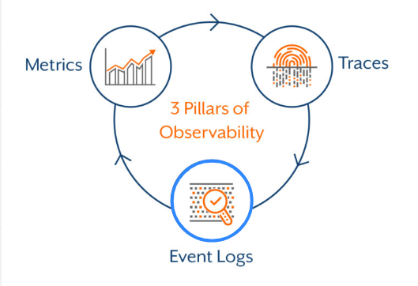
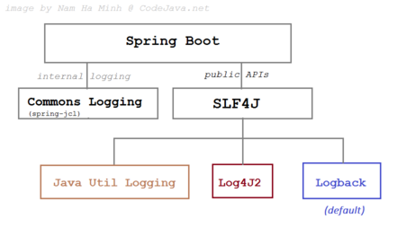
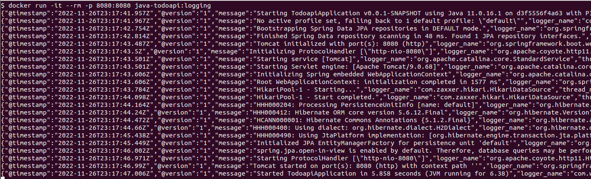
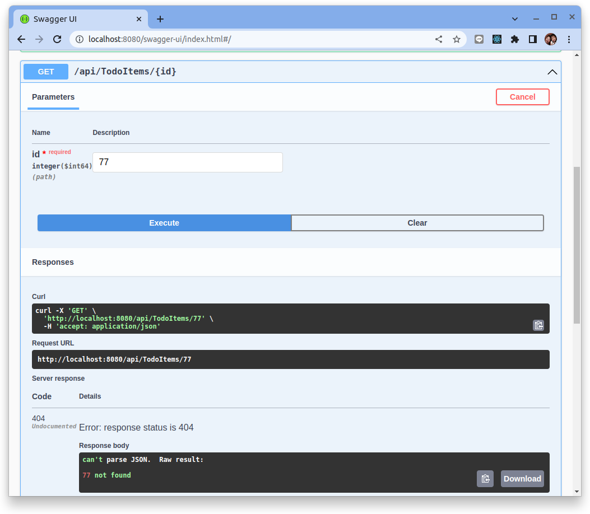
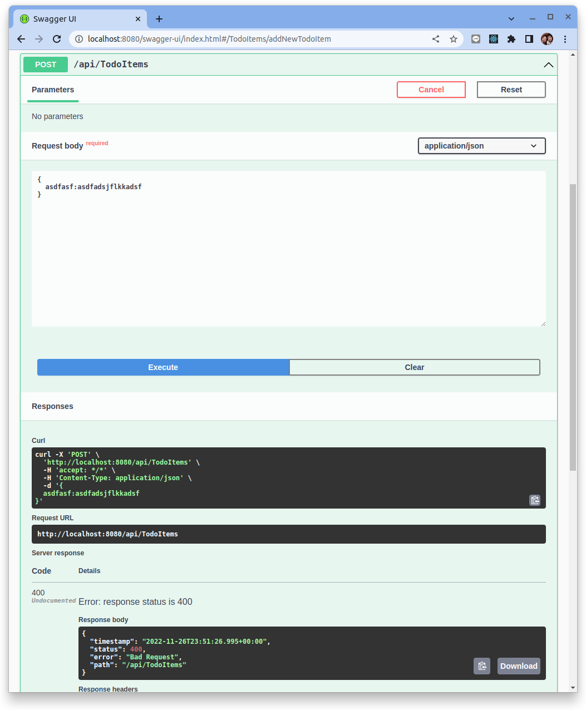
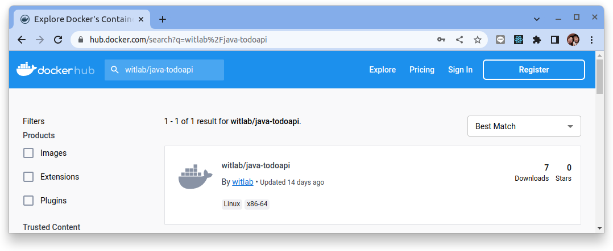
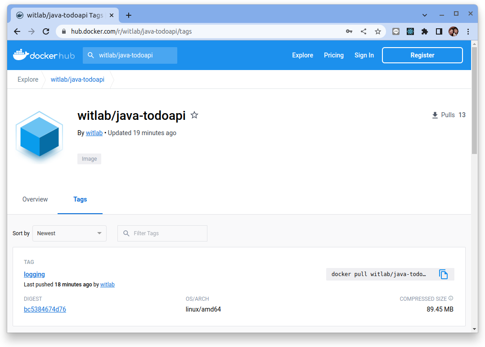
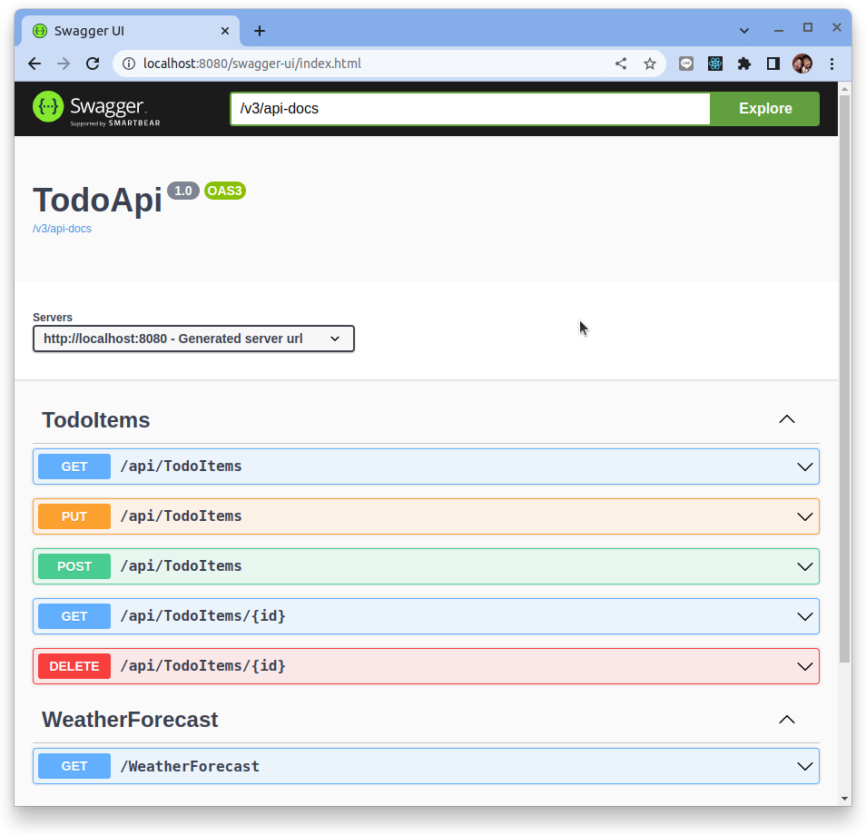

# 結構化日誌 Sprintboot 應用程序

參考: [Structured Logging with Structured Arguments](https://www.innoq.com/en/blog/structured-logging/)


## 可觀測性 - Logging

日誌、指標和鏈路追踪通常被稱為可觀察性的三大支柱。雖然可以訪問日誌、指標和跟踪並不一定會使系統更易於觀察，但這些都是強大的工具，如果理解得當，可以釋放構建更好系統的能力。

本教程主要著眼於如何儀器化 Sprintboot 應用程序，然後將應用程式運行的 **結構化日誌** 打印到 stdout 出來。



本教程主要使用了下列的專案作為基底然後開始相關的編修來結構化應用程式日誌(Logging)。請先下載下列的專案源碼再 Step-by-Step 跟隨本教程的相關步驟。

 範例源碼: [java/todoapi-base/todoapi/](https://github.com/erhwenkuo/techlearn_coding/tree/main/java/todoapi-base/todoapi)

## 什麼是結構化日誌記錄？

**結構化日誌記錄** 是為應用程序日誌提供標準化的、預先確定的消息格式的過程，使它們能夠作為 **數據集** 而不是 **文本** 來處理。結構化日誌記錄的目標是獲取現在作為文本字符串提供的應用程序日誌，並將其轉化為易於搜索和分析的數據集合。

結構化日誌記錄組織記錄的數據，使其易於搜索、過濾和處理以進行更複雜的分析。JSON 是結構化日誌記錄的首選格式，但也可以接受其他格式例如在 CNCF 專案中常見的 [logfmt](https://brandur.org/logfmt)。最佳實踐是使用可以與日誌管理解決方案交互並支持自定義字段的日誌記錄框架來提供結構化日誌記錄。

詳細解釋見:[Structured Logging](../../../observability/logs/structured-logging.md)

## Logstash Logback Encoder 函式庫說明

提供 logback 編碼器、佈局和附加器以記錄 JSON 和 Jackson 支持的其他日誌格式。

最初的設計是為了支持 logstash 的 JSON 格式的輸出而編寫的，但已經發展成為一個可配置的、通用的、結構化的日誌記錄機制，用於 JSON 和其他 Jackson 數據格式。輸出的結構及其包含的數據是完全可配置的。



## 引入函式庫

要讓 Logstash Logback Encoder 整合進 Sprintboot，我們只需將下列一個依賴項添加到我們的 `pom.xml` 中：

```xml title="pom.xml"
<?xml version="1.0" encoding="UTF-8"?>
<project xmlns="http://maven.apache.org/POM/4.0.0" xmlns:xsi="http://www.w3.org/2001/XMLSchema-instance"
    xsi:schemaLocation="http://maven.apache.org/POM/4.0.0 https://maven.apache.org/xsd/maven-4.0.0.xsd">
    <dependencies>
        ...
        ...
        <!-- logstash-logback-encoder  -->
		<dependency>
			<groupId>net.logstash.logback</groupId>
			<artifactId>logstash-logback-encoder</artifactId>
			<version>7.2</version>
		</dependency>
    ...
    ...
</project>
```

## 啟動日誌配置

在專案的 `src/main/resources` 的目錄下新增加一個 logback 的配置檔 `logback-spring.xml`:

```xml title="logback-spring.xml"
<configuration>
    <appender name="jsonConsoleAppender" class="ch.qos.logback.core.ConsoleAppender">
        <encoder class="net.logstash.logback.encoder.LogstashEncoder"/>
    </appender>
    <root level="INFO">
        <appender-ref ref="jsonConsoleAppender"/>
    </root>
</configuration>
```

- `net.logstash.logback.encoder.LogstashEncoder`: 配置讓 logback 將日誌編碼成 logstash (JSON) 的格式。
- `jsonConsoleAppender`: 配置讓logback 將日誌打印到 stdout。

## 修改啟動配置

在 application.properties 中配置如下：

```properties title="application.properties"
# setup alias of Swagger UI path
springdoc.swagger-ui.path=/swagger

# turn off the banner
spring.main.banner-mode=off
```

下面列出關鍵的設定:

- `spring.main.banner-mode=off`: Ｓpringboot 預設會在啟動的時侯打印一個 banner, 而這個 banner 會被後台的 Log Aggregator 也收集進後台的日誌系統，因此設定不打印 banner。

```bash
  .   ____          _            __ _ _
 /\\ / ___'_ __ _ _(_)_ __  __ _ \ \ \ \
( ( )\___ | '_ | '_| | '_ \/ _` | \ \ \ \
 \\/  ___)| |_)| | | | | || (_| |  ) ) ) )
  '  |____| .__|_| |_|_| |_\__, | / / / /
 =========|_|==============|___/=/_/_/_/
 :: Spring Boot ::                (v2.7.5)
```

## 修改源碼來輸出日誌

通過上述的設定, 當啟動應用程式時能夠在 stdout 上看到如下的日誌格式:

```bash
{"@timestamp":"2019-04-16T22:53:03.689+02:00","@version":"1","message":"Order 123 saved","logger_name":"MyApplication","thread_name":"main","level":"INFO","level_value":20000}
```

為了便於閱讀，本文中的所有 JSON 示例都將以 pretty-format 的打印形式呈現：

```json
{
  "@timestamp": "2019-04-16T22:53:03.689+02:00",
  "@version": "1",
  "message": "Order 123 saved",
  "logger_name": "MyApplication",
  "thread_name": "main",
  "level": "INFO",
  "level_value": 20000
}
```

### 結構化日誌語句

接著讓我們討論如何編寫更好的日誌條目。

傳統的日誌語句通常如下所示：

```java
log.info("Order {} saved", 123);
```

這將產生:

```bash
{
  "@timestamp": "2019-04-17T18:02:44.979+02:00",
  "@version": "1",
  "message": "Order 123 saved",
  "logger_name": "MyApplication",
  "thread_name": "main",
  "level": "INFO",
  "level_value": 20000
}
```

此日誌語句的一個問題是您無法搜索所有“Order saved”條目，因為 `orderId` 是消息中間的一部分。

因此，讓我們可將其優化為：

```java
log.info("Order saved orderId={}", 123);
```

這將產生:

```json
{
    "@timestamp": "2019-04-17T18:07:42.123+02:00",
    "@version": "1",
    "message": "Order saved orderId=123",
    "logger_name": "MyApplication",
    "thread_name": "main",
    "level": "INFO",
    "level_value": 20000
}
```

現在我們可以使用後台的日誌搜索語法來搜索 `orderId=123` 以獲取此訂單 ID 的所有日誌語句。但是，這需要對消息字段進行全文搜索。


#### MDC

另外也可使用主要日誌記錄框架提供的映射診斷上下文（MDC）物件來優化日誌輸出：

```java
String orderId = "123";
MDC.put("orderId", orderId);
log.info("Order saved");
MDC.remove("orderId");
```

或使用 try-with-resources：

```java
String orderId = "123";
try (var ignored = MDC.putCloseable("orderId", orderId)) {
  log.info("Order saved");
}
```

這將產生:

```json hl_lines="9"
{
  "@timestamp": "2019-04-17T18:12:16.861+02:00",
  "@version": "1",
  "message": "Order saved",
  "logger_name": "MyApplication",
  "thread_name": "main",
  "level": "INFO",
  "level_value": 20000,
  "orderId": "123"
}
```

#### Structured Arguments

`logstash-logback-encoder` 庫具有事件特定自定義字段的概念，並帶有標記以將附加字段添加到生成的 JSON 輸出中。

使用普通的 `{}` 佔位符，只需將數據包裝在 `StructuredArguments.value()` 或 `StructuredArguments.keyValue()` 工廠方法中：

```java
import static net.logstash.logback.argument.StructuredArguments.keyValue;

String orderId = "123";
log.info("Order saved {}", keyValue("orderId", orderId));
```

這將產生:

```json hl_lines="4 9"
{
  "@timestamp": "2019-04-17T18:27:01.099+02:00",
  "@version": "1",
  "message": "Order saved orderId=123",
  "logger_name": "MyApplication",
  "thread_name": "main",
  "level": "INFO",
  "level_value": 20000,
  "orderId": "123"
}
```

`orderId` 作為單獨的字段添加到消息（通過 `{}` 佔位符）和 JSON 輸出。

此外，支持多個字段，在消息中使用它們是可選的，並且可以使用更短的 `kv` 別名：

```java
import static net.logstash.logback.argument.StructuredArguments.kv;

String orderId = "123";
String status = "NEW";
log.info("Order saved", kv("orderId", orderId), kv("status", status));
```

這將產生:

```json hl_lines="9 10"
{
    "@timestamp": "2019-04-17T18:29:14.079+02:00",
    "@version": "1",
    "message": "Order saved",
    "logger_name": "MyApplication",
    "thread_name": "main",
    "level": "INFO",
    "level_value": 20000,
    "orderId": "123",
    "status": "NEW"
}
```

`value()` 或 `v()` 方法不會將鍵名寫入消息，而字段條目保持不變。

```java
import static net.logstash.logback.argument.StructuredArguments.v;

String oldStatus = "NEW";
String newStatus = "READY";
log.info("Status changed {}->{}.", v("oldStatus", oldStatus), v("newStatus", newStatus));
```

這將產生:

```json hl_lines="9 10"
{
  "@timestamp": "2019-04-17T18:27:01.099+02:00",
  "@version": "1",
  "message": "Status changed NEW->READY.",
  "logger_name": "MyApplication",
  "thread_name": "main",
  "level": "INFO",
  "level_value": 20000,
  "oldStatus": "NEW",
  "newStatus": "READY",
}
```

並且有一個很好的功能來記錄複雜的對象：

```java
Order order = new Order("123", "NEW", null);
log.info("Order saved", kv("order", order));

static class Order {
  String orderId;
  String status;
  String canceled;

  Order(String orderId, String status, String canceled) {
      this.orderId = orderId;
      this.status = status;
      this.canceled = canceled;
  }

  String getOrderId() {
      return orderId;
  }

  String getStatus() {
      return status;
  }

  String getCanceled() {
      return canceled;
  }
}
```

這將生成對象的 JSON 表示：

```json hl_lines="9-13"
{
  "@timestamp": "2019-04-17T18:34:10.437+02:00",
  "@version": "1",
  "message": "Order saved",
  "logger_name": "MyApplication",
  "thread_name": "main",
  "level": "INFO",
  "level_value": 20000,
  "order": {
    "orderId": "123",
    "status": "NEW",
    "canceled": null
  }
}
```

## 容器化 Sprintboot 應用

### 創建 Dockerfile

`docker build` 命令使用 **Dockerfile** 文件來創建容器映像。該文件是一個名為 Dockerfile 的文本文件，沒有擴展名。

在 Sprintboot 專案根目錄中創建一個名為 Dockerfile 的文件，然後在文本編輯器中打開它。

```docker title="Dockerfile"
FROM maven:3-jdk-11 AS build-env
WORKDIR /opt

# Copy everything
COPY . /opt

# Just echo so we can see, if everything is there :)
RUN ls -l

# Run Maven build
RUN mvn clean install

# Build runtime image
FROM adoptopenjdk/openjdk11:alpine-jre
WORKDIR /opt
COPY --from=build-env /opt/target/todoapi-0.0.1-SNAPSHOT.jar /opt/app.jar

# Expose web api port number
EXPOSE 8080

# java -jar /opt/app/app.jar
ENTRYPOINT ["java","-jar","app.jar"]
```

從您的終端，運行以下命令：

```bash
docker build -t java-todoapi:logging -f Dockerfile .
```

Docker 將處理 Dockerfile 中的每一行指令。 在 `docker build` 命令中設置鏡像的構建上下文。 `-f` 旗標指向 Dockerfile 的路徑。

此命令構建映像並創建一個名為 `java-todoapi` 的本地存儲庫，該存儲庫指向該映像。

此命令完成後，運行 `docker images` 以查看已安裝的容器鏡像列表：

```bash
$ docker images

REPOSITORY               TAG            IMAGE ID       CREATED          SIZE
java-todoapi             logging        bc10992b9b2f   15 seconds ago   194MB
```

### 啟動 Docker 容器

端口映射用於訪問在 Docker 容器內運行的服務。我們打開一個主機端口，讓我們可以訪問 Docker 容器內相應的開放端口。然後所有對主機端口的請求都可以重定向到 Docker 容器中。

```bash
docker run -it --rm -p 8080:8080 java-todoapi:logging
```



可觀察到所有的拋到 stdout 的日誌都己經轉換成 JSON 格式。

#### 驗證

試著去使用取得一個不存在的 TodoItem:

```bash
curl -X 'GET' \
  'http://localhost:8080/api/TodoItems/77' \
  -H 'accept: application/json'
```



會在 stdout 上看到如下的日誌:

```json
{
  "@timestamp": "2022-11-26T23:47:16.12Z",
  "@version": "1",
  "message": "id=77 not found",
  "logger_name": "com.wistron.todoapi.controller.TodoItemController",
  "thread_name": "http-nio-8080-exec-8",
  "level": "WARN",
  "level_value": 30000,
  "id": 77
}
```

試著去使用一個錯誤結構的 Content 來創建一個新的 TodoItem:

```bash
curl -X 'POST' \
  'http://localhost:8080/api/TodoItems' \
  -H 'accept: */*' \
  -H 'Content-Type: application/json' \
  -d '{
  asdfasf:asdfadsjflkkadsf
}'
```



會在 stdout 上看到如下的日誌:

```json
{
  "@timestamp": "2022-11-26T23:51:26.989Z",
  "@version": "1",
  "message": "Resolved [org.springframework.http.converter.HttpMessageNotReadableException: JSON parse error: Unexpected character ('a' (code 97)): was expecting double-quote to start field name; nested exception is com.fasterxml.jackson.core.JsonParseException: Unexpected character ('a' (code 97)): was expecting double-quote to start field name<EOL> at [Source: (org.springframework.util.StreamUtils$NonClosingInputStream); line: 2, column: 4]]",
  "logger_name": "org.springframework.web.servlet.mvc.support.DefaultHandlerExceptionResolver",
  "thread_name": "http-nio-8080-exec-1",
  "level": "WARN",
  "level_value": 30000
}
```

### 推送容器鏡像到 Dockerhub

要把容器鏡像推到 Dockerhub 的前題是要先到 Docker Hub 上註冊帳號，本教程假設大家己經都有了帳號。

首先使用 docker login 指令登入到 Docker Hub:

```bash
$ docker login

Login with your Docker ID to push and pull images from Docker Hub. If you don't have a Docker ID, head over to https://hub.docker.com to create one.
Username: witlab
Password: 
WARNING! Your password will be stored unencrypted in /home/dxlab/.docker/config.json.
Configure a credential helper to remove this warning. See
https://docs.docker.com/engine/reference/commandline/login/#credentials-store

Login Succeeded
```

要把 Docker Image Push 到 Docker Hub 上，需要把 Docker Image 加上 Dockerhub 的 Username，如下指令:

```bash
$ docker build -t witlab/java-todoapi:logging -f Dockerfile .
```

接著使用下列命令來推送容器鏡像:

```bash
$ docker push witlab/java-todoapi:logging

The push refers to repository [docker.io/witlab/java-todoapi]
b7ccc928137a: Pushed 
0aa20a85da26: Layer already exists 
b61e498b0317: Layer already exists 
63493a9ab2d4: Layer already exists 
logging: digest: sha256:bc5384674d76d849376f9947e4c1a455c995bcb44f3eb3540f063a23a9a2330b size: 1163

```

成功之後到 Docker Hub 去檢查看看容器鏡像是否己經成功上傳:




點選　"witlab/java-toddapi" 之後再選擇 "Tags" 頁籤:



應該看到有一個鏡像的標籤是 metrics。


使用 `docker rm` 指令把 local 的 Image 刪除掉:

```bash
$ docker rmi -f witlab/java-todoapi:logging
```

測試從 Docker Hub pull Docker Image 下來，指令如下:

```bash
$ docker pull witlab/java-todoapi:logging
```

啟動 Docker Container，指令如下:

```bash
docker run -it --rm -p 8080:8080 witlab/java-todoapi:logging
```

啟動完成之後就可以使用 Browser 查看結果，輸入 URL 位址為 http://localhost:8080/swagger 可以看到如下畫面:



## 結論

儘可能地對應用程序使用 Structure Logging (JSON) 來輸出日誌，並將它們收集到日誌聚合器（如 Grafana loki, Elasticsearch）中。

結構化參數使得使用 Spring Boot 的默認日誌記錄框架 Logback 向索引添加額外數據變得容易。

結構化的日誌語句使得使用 Grafana 或　Kibana 等日誌分析工具更容易找到相關日誌。

修改後的源碼可在下列的鏈結中取得。

 範例源碼: [java/todoapi-logging/todoapi/](https://github.com/erhwenkuo/techlearn_coding/tree/main/java/todoapi-logging/todoapi)