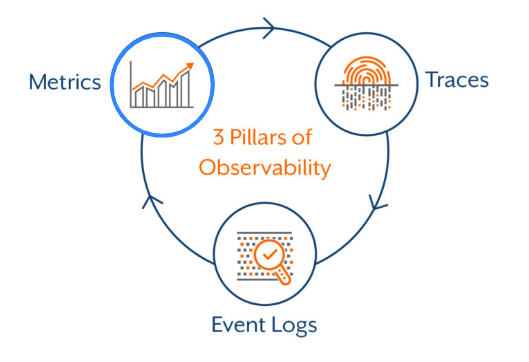
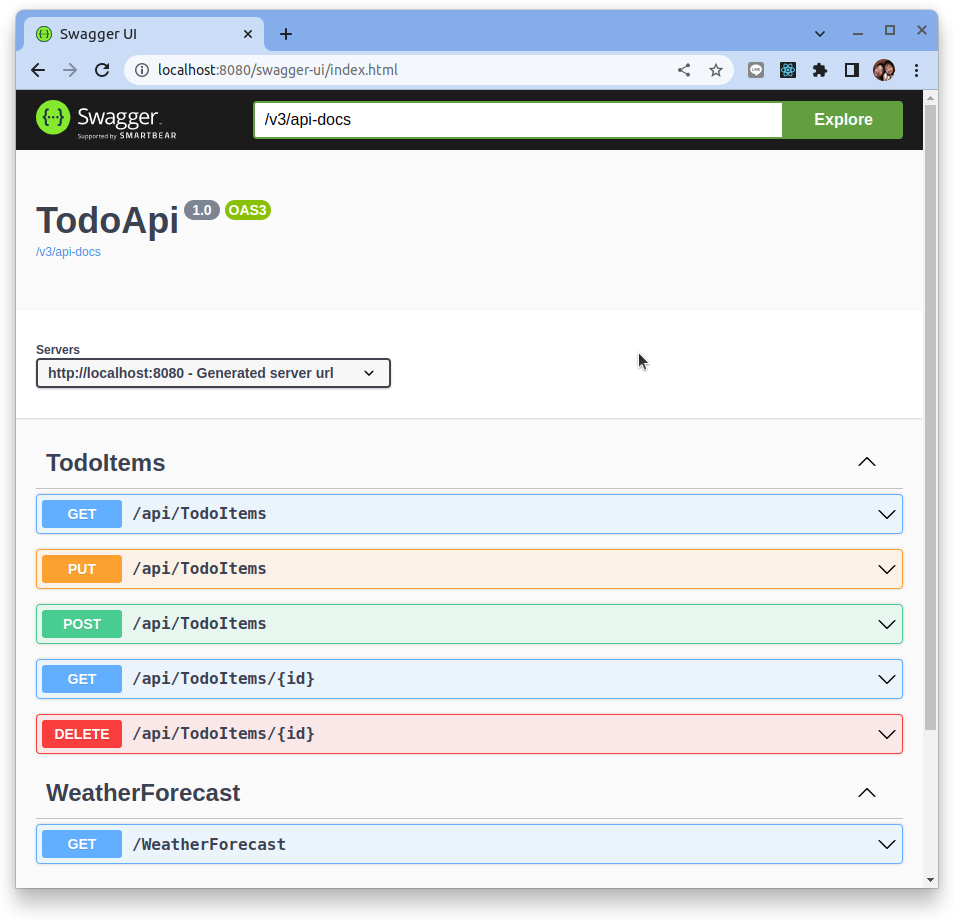
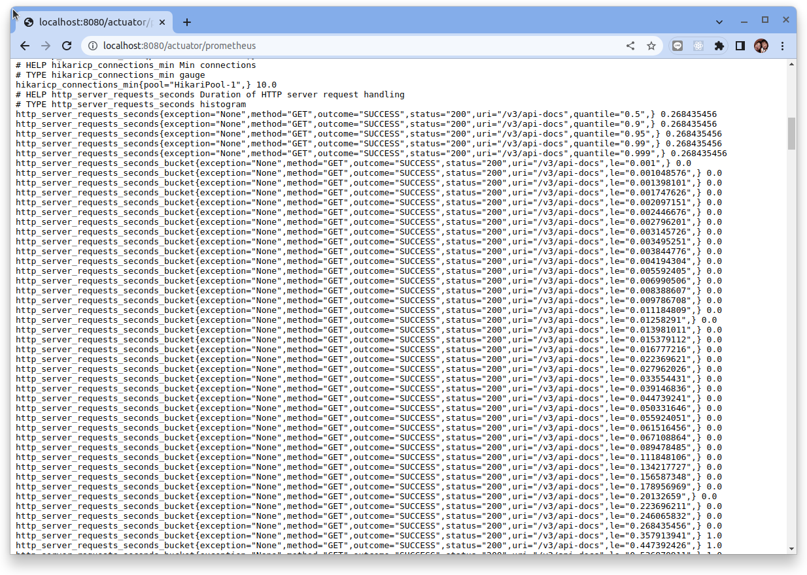
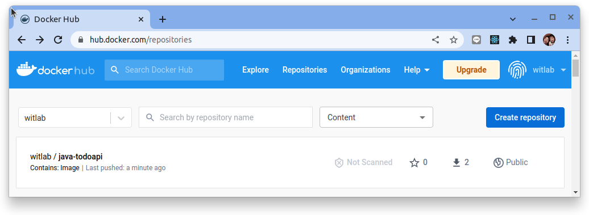
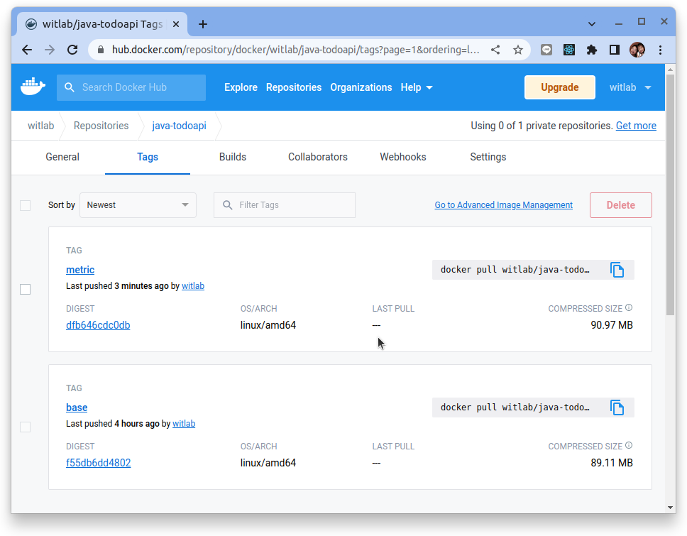

# 儀器化 Sprintboot 應用程序

原文:[Spring Boot 使用 Micrometer 集成 Prometheus 监控 Java 应用性能](https://blog.csdn.net/aixiaoyang168/article/details/100866159)

原文:[Monitoring and Profiling Your Spring Boot Application](https://dzone.com/articles/monitoring-and-profiling-spring-boot-application)


## 可觀測性 - Metrics

日誌、指標和鏈路追踪通常被稱為可觀察性的三大支柱。雖然可以訪問日誌、指標和跟踪並不一定會使系統更易於觀察，但這些都是強大的工具，如果理解得當，可以釋放構建更好系統的能力。

本教程主要著眼於如何儀器化 Sprintboot 應用程序，然後將應用程式內部的狀態使用 **指標** 曝露出來。




## Micrometer 函式庫說明

Micrometer 為 Java 平台上的性能數據收集提供了一個通用的 API，它提供了多種度量指標類型（Timers、Guauges、Counters等），同時支持接入不同的監控系統，例如 Influxdb、Graphite、Prometheus 等。我們可以通過 Micrometer 收集 Java 性能數據，配合 Prometheus 監控系統實時獲取數據，並最終在 Grafana 上展示出來，從而很容易實現應用的監控。

Micrometer 中有兩個最核心的概念，分別是計量器（Meter）和計量器註冊表（MeterRegistry）。計量器用來收集不同類型的性能指標信息，Micrometer 提供瞭如下幾種不同類型的計量器：

- 計數器 (Counter): 表示收集的數據是按照某個趨勢（增加／減少）一直變化的，也是最常用的一種計量器，例如接口請求總數、請求錯誤總數、隊列數量變化等。
- 計量儀 (Gauge): 表示蒐集的瞬時的數據，可以任意變化的，例如常用的 CPU Load、Mem 使用量、Network 使用量、實時在線人數統計等，
- 計時器 (Timer): 用來記錄事件的持續時間，這個用的比較少。
- 分佈概要 (Distribution summary): 用來記錄事件的分佈情況，表示一段時間範圍內對數據進行採樣，可以用於統計網絡請求平均延遲、請求延遲佔比等。

這裡我重點說一下 DistributionSummary。

### DistributionSummary

DistributionSummary 是用於跟踪事件的分佈情況，有多個指標組成：

- `count`: 事件的個數，聚合指標，如響應的個數
- `sum`: 綜合，聚合指標，如響應大小的綜合
- `histogram`: 分佈，聚合指標，包含 `le` 標籤用於區分 bucket
    - 例如 web.response.size.historgram {le=512} = 99, 表示響應大小不超過 512（Byte) 的響應個數是 99 個。
    - 一般有多個 bucket，如 le=128，le=256，le=512，le=1024, le=+Inf 等。每個 bucket 為一條時間序列

## 引入函式庫

要讓 Micrometer 整合進 Sprintboot，我們只需下列兩個依賴項添加到我們的 pom.xml 中：

```xml title="pom.xml"
<?xml version="1.0" encoding="UTF-8"?>
<project xmlns="http://maven.apache.org/POM/4.0.0" xmlns:xsi="http://www.w3.org/2001/XMLSchema-instance"
	xsi:schemaLocation="http://maven.apache.org/POM/4.0.0 https://maven.apache.org/xsd/maven-4.0.0.xsd">
    <dependencies>
        ...
        ...
        <!-- actuator for monitoring  -->
		<dependency>
			<groupId>org.springframework.boot</groupId>
			<artifactId>spring-boot-starter-actuator</artifactId>
		</dependency>

		<!-- micrometer for metrics  -->
		<dependency>
			<groupId>io.micrometer</groupId>
			<artifactId>micrometer-registry-prometheus</artifactId>
			<version>1.10.0</version>
		</dependency>
    </dependencies>
    ...
    ...
</project>
```

這裡引入了 io.micrometer 的 `micrometer-registry-prometheus` 依賴以及 `spring-boot-starter-actuator` 依賴，因為該包對 Prometheus 進行了封裝，可以很方便的集成到 Spring Boot 工程中。

## 修改啟動配置

其次在 application.properties 中配置如下：

``` title="application.properties"
# Enable prometheus exporter
management.metrics.export.prometheus.enabled=true

# Enable prometheus end point
management.endpoints.web.exposure.include=prometheus

# enable percentile-based histogram for http requests
management.metrics.distribution.percentiles-histogram.http.server.requests=true

# http SLA histogram buckets
management.metrics.distribution.sla.http.server.requests=100ms,150ms,250ms,500ms,1s

# enable quantile setup
management.metrics.distribution.percentiles.http.server.requests=0.5,0.9,0.95,0.99,0.999

# enable JVM metrics
management.metrics.enable.jvm=true
```

下面說明幾個比較關鍵的設定:

- `management.metrics.export.prometheus.enabled=true`: 添加此行後，Micrometer 將開始累積有關應用程序的數據，並且可以通過訪問 `actuator/prometheus` 端點來查看此數據。
- `management.endpoints.web.exposure.include=prometheus`: 即使啟動了上面的設定，我們也無法瀏覽 Prometheus 端點，因為默認情況下這是禁用的，因此我們需要配置來使用管理端點，將 `prometheus` 包含在列表中。
- `management.metrics.distribution.percentiles-histogram.http.server.requests=true`:  啟動 Distribution summary 的計算。

## 測試專案執行

執行下列命令來運行應用程序：

如果您使用 Gradle，則可以使用 `./gradlew bootRun` 運行應用程序。

如果您使用 Maven，則可以使用 `./mvnw spring-boot:run` 運行應用程序。

使用瀏覽器來連接到 Swagger UI 來進行簡易測試 `http://localhost:8080/swagger`:



## 公開指標

上述的設定會將 Springboot 的相關指標暴露到 `https://localhost:8080/actuator/prometheus`:



指標的元數據列表如下:

|指標名稱	|型別	|說明|
|---------|-------|---|
|application_ready_time_seconds|gauge|Time taken (ms) for the application to be ready to service requests<br>應用程序準備好為請求提供服務所需的時間（毫秒）|
|application_started_time_seconds|gauge|Time taken (ms) to start the application<br>啟動應用程序所用時間（毫秒）|
|disk_free_bytes|gauge|Usable space for path<br>路徑的可用空間|
|disk_total_bytes|gauge|Total space for path<br>路徑的總空間|
|executor_active_threads|gauge|The approximate number of threads that are actively executing tasks<br>正在主動執行任務的線程的大致數量|
|executor_completed_tasks_total|counter|The approximate total number of tasks that have completed execution<br>已完成執行的大致任務總數|
|executor_pool_core_threads|gauge|The core number of threads for the pool<br>池的核心線程數|
|executor_pool_max_threads|gauge|The maximum allowed number of threads in the pool<br>池中允許的最大線程數|
|executor_pool_size_threads|gauge|The current number of threads in the pool<br>池中的當前線程數|
|executor_queue_remaining_tasks|gauge|The number of additional elements that this queue can ideally accept without blocking<br>此隊列理想情況下可以在不阻塞的情況下接受的附加元素的數量|
|executor_queued_tasks|gauge|The approximate number of tasks that are queued for execution<br>排隊等待執行的任務的大致數量|
|hikaricp_connections|gauge|Total connections<br>總連接數|
|hikaricp_connections_acquire_seconds|summary|Connection acquire time<br>連接獲取時間|
|hikaricp_connections_acquire_seconds_max|gauge|Connection acquire time<br>連接獲取時間|
|hikaricp_connections_active|gauge|Active connections<br>活動連接|
|hikaricp_connections_creation_seconds|summary|Connection creation time<br>連接創建時間|
|hikaricp_connections_creation_seconds_max|gauge|Connection creation time<br>連接創建時間|
|hikaricp_connections_idle|gauge|Idle connections<br>空閒連接|
|hikaricp_connections_max|gauge|Max connections<br>最大連接數|
|hikaricp_connections_min|gauge|Min connections<br>最小連接數|
|hikaricp_connections_pending|gauge|Pending threads<br>待處理線程|
|hikaricp_connections_timeout_total|counter|Connection timeout total count<br>連接超時總計數|
|hikaricp_connections_usage_seconds|summary|Connection usage time<br>連接使用時間|
|hikaricp_connections_usage_seconds_max|gauge|Connection usage time<br>連接使用時間|
|{==http_server_requests_seconds==}|histogram|Duration of HTTP server request handling<br>HTTP 服務器請求處理的持續時間|
|http_server_requests_seconds_max|gauge|Duration of HTTP server request handling<br>HTTP 服務器請求處理的持續時間|
|jdbc_connections_max|gauge|Maximum number of active connections that can be allocated at the same time.<br>可以同時分配的最大活動連接數。|
|jdbc_connections_min|gauge|Minimum number of idle connections in the pool.<br>池中的最小空閒連接數。|
|jvm_buffer_count_buffers|gauge|An estimate of the number of buffers in the pool<br>池中緩衝區數量的估計|
|jvm_buffer_memory_used_bytes|gauge|An estimate of the memory that the Java virtual machine is using for this buffer pool<br>Java 虛擬機用於此緩衝池的內存估計值|
|jvm_buffer_total_capacity_bytes|gauge|An estimate of the total capacity of the buffers in this pool<br>此池中緩衝區總容量的估計值|
|jvm_classes_loaded_classes|gauge|The number of classes that are currently loaded in the Java virtual machine<br>當前在 Java 虛擬機中加載的類的數量|
|jvm_classes_unloaded_classes_total|counter|The total number of classes unloaded since the Java virtual machine has started execution<br>自 Java 虛擬機開始執行以來卸載的類總數|
|jvm_gc_live_data_size_bytes|gauge|Size of long-lived heap memory pool after reclamation<br>回收後長壽命堆內存池的大小|
|jvm_gc_max_data_size_bytes|gauge|Max size of long-lived heap memory pool<br>長壽命堆內存池的最大大小|
|jvm_gc_memory_allocated_bytes_total|counter|Incremented for an increase in the size of the (young) heap memory pool after one GC to before the next<br>在一次 GC 到下一次 GC 之前增加（年輕）堆內存池的大小|
|jvm_gc_memory_promoted_bytes_total|counter|Count of positive increases in the size of the old generation memory pool before GC to after GC<br>GC前到GC後老年代內存池大小的正增長計數|
|jvm_gc_overhead_percent|gauge|An approximation of the percent of CPU time used by GC activities over the last lookback period or since monitoring began, whichever is shorter, in the range [0..1]<br>GC 活動在上一個回溯期或自監控開始以來使用的 CPU 時間百分比的近似值，以較短者為準，範圍 [0..1]|
|jvm_gc_pause_seconds|summary|Time spent in GC pause<br>GC 暫停所花費的時間|
|jvm_gc_pause_seconds_max|gauge|Time spent in GC pause<br>GC 暫停所花費的時間|
|jvm_memory_committed_bytes|gauge|The amount of memory in bytes that is committed for the Java virtual machine to use<br>提交給 Java 虛擬機以使用的內存量（以字節為單位）|
|jvm_memory_max_bytes|gauge|The maximum amount of memory in bytes that can be used for memory management<br>可用於內存管理的最大內存量（以字節為單位）|
|jvm_memory_usage_after_gc_percent|gauge|The percentage of long-lived heap pool used after the last GC event, in the range [0..1]<br>上次 GC 事件後使用的長壽命堆池的百分比，範圍 [0..1]|
|jvm_memory_used_bytes|gauge|The amount of used memory<br>已用內存量|
|jvm_threads_daemon_threads|gauge|The current number of live daemon threads<br>當前實時守護線程數|
|jvm_threads_live_threads|gauge|The current number of live threads including both daemon and non-daemon threads<br>當前活動線程的數量，包括守護線程和非守護線程|
|jvm_threads_peak_threads|gauge|The peak live thread count since the Java virtual machine started or peak was reset<br>自 Java 虛擬機啟動或峰值被重置以來的峰值活動線程數|
|jvm_threads_states_threads|gauge|The current number of threads<br>當前線程數|
|logback_events_total|counter|Number of events that made it to the logs<br>進入日誌的事件數|
|process_cpu_usage|gauge|The "recent cpu usage" for the Java Virtual Machine process<br>Java 虛擬機進程的“最近 cpu 使用情況”|
|process_files_max_files|gauge|The maximum file descriptor count<br>最大文件描述符計數|
|process_files_open_files|gauge|The open file descriptor count<br>打開的文件描述符計數|
|process_start_time_seconds|gauge|Start time of the process since unix epoch.<br>自 unix 紀元以來進程的開始時間。|
|process_uptime_seconds|gauge|The uptime of the Java virtual machine<br>Java 虛擬機的正常運行時間|
|spring_data_repository_invocations_seconds|summary|Duration of repository invocations<br>存儲庫調用的持續時間|
|spring_data_repository_invocations_seconds_max|gauge|Duration of repository invocations<br>存儲庫調用的持續時間|
|system_cpu_count|gauge|The number of processors available to the Java virtual machine<br>Java 虛擬機可用的處理器數量|
|system_cpu_usage|gauge|The "recent cpu usage" of the system the application is running in<br>運行應用程序的系統的“最近 cpu 使用情況”|
|system_load_average_1m|gauge|The sum of the number of runnable entities queued to available processors and the number of runnable entities running on the available processors averaged over a period of time<br>在一段時間內平均排隊到可用處理器的可運行實體數和在可用處理器上運行的可運行實體數的總和|
|tomcat_sessions_active_current_sessions|gauge| |
|tomcat_sessions_active_max_sessions|gauge| |
|tomcat_sessions_alive_max_seconds|gauge| |
|tomcat_sessions_created_sessions_total|counter| |
|tomcat_sessions_expired_sessions_total|counter| |
|tomcat_sessions_rejected_sessions_total|counter| |

### 指標監控

參考:

- [The RED Method](https://grafana.com/files/grafanacon_eu_2018/Tom_Wilkie_GrafanaCon_EU_2018.pdf)
- [PromQL 教程](../../../../prometheus/promql/intro.md)
- [搞懂 Prometheus 的直方圖](../../../../prometheus/promql/metric-histogram.md)
- [簡單理解 Summary 和 Histogram 指標](./../../../prometheus/promql/metric-histogram-summary.md)

#### 資源監控 - USE Method

對於每個資源，監控：

- Utilization (% time that the resource was busy)
- Saturation (amount of work resource has to do, often queue length)
- Errors (count of error events)

舉例來說 **餐廳服務員** 對 **餐廳老闆** 來說是一種 **資源**:

- Utilization (% time that the resource was busy): 在一個工作小時裡服務員在忙碌工作的比例
- Saturation (amount of work resource has to do, often queue length): 等待服務員去點餐的餐數
- Errors (count of error events): 服務員執行工件出錯的次數

使用 Pod 在 Kubernetes 裡的指標來計算:

```bash
# CPU Utilisation:

1 - avg(rate(node_cpu{job="default/node-exporter",mode="idle"}[1m]))

# CPU Saturation:

sum(node_load1{job="default/node-exporter"}) / sum(node:node_num_cpu:sum)

# Memory Utilisation: 

1 - sum(node_memory_MemFree{job="…"} +
        node_memory_Cached{job="…"}  +
        node_memory_Buffers{job="…"}
    ) / sum(node_memory_MemTotal{job="…"})

# Memory Saturation:

1e3 * sum(rate(node_vmstat_pgpgin{job="…"}[1m]) + rate(node_vmstat_pgpgout{job="…"}[1m])))
```


#### 服務監控 - RED Method

對於每個服務，監控：

- Rate (the number of requests per second)
- Errors (the number of those requests that are failing)
- Duration (the amount of time those requests take)

舉例來說 **點餐** 對 **來餐廳用餐的客人** 來說是一種 **服務**:

- Rate (the number of requests per second): 在單位時間裡客人會呼叫點餐的次數
- Errors (the number of those requests that are failing): 客人點餐但結果出錯的比率
- Duration (the amount of time those requests take): 客人點餐到餐點到桌的時間長度

使用 `http_server_requests_seconds` 這個 `histogram` 的指標來計算:

```bash
# Rate:

sum(rate(http_server_requests_seconds_count{job="…"}[1m]))

# Errors:

sum(rate(http_server_requests_seconds_count{job="…",status_code!~"2.."}[1m]))


# Duration:

histogram_quantile(0.99,sum(rate(http_server_requests_seconds_bucket{job="…"}[1m])) by (le))
```

## 容器化 Sprintboot 應用

### 創建 Dockerfile

`docker build` 命令使用 **Dockerfile** 文件來創建容器映像。該文件是一個名為 Dockerfile 的文本文件，沒有擴展名。

在 Sprintboot 專案根目錄中創建一個名為 Dockerfile 的文件，然後在文本編輯器中打開它。

```docker title="Dockerfile"
FROM maven:3-jdk-11 AS build-env
WORKDIR /opt

# Copy everything
COPY . /opt

# Just echo so we can see, if everything is there :)
RUN ls -l

# Run Maven build
RUN mvn clean install

# Build runtime image
FROM adoptopenjdk/openjdk11:alpine-jre
WORKDIR /opt
COPY --from=build-env /opt/target/todoapi-0.0.1-SNAPSHOT.jar /opt/app.jar

# Expose web api port number
EXPOSE 8080

# java -jar /opt/app/app.jar
ENTRYPOINT ["java","-jar","app.jar"]
```

從您的終端，運行以下命令：

```bash
docker build -t java-todoapi:metric -f Dockerfile .
```

Docker 將處理 Dockerfile 中的每一行指令。 在 `docker build` 命令中設置鏡像的構建上下文。 `-f` 旗標指向 Dockerfile 的路徑。

此命令構建映像並創建一個名為 `java-todoapi` 的本地存儲庫，該存儲庫指向該映像。

此命令完成後，運行 `docker images` 以查看已安裝的容器鏡像列表：

```bash
$ docker images

REPOSITORY               TAG            IMAGE ID       CREATED         SIZE
java-todoapi             metric         5cdb0dcedfd2   6 minutes ago   196MB
```

### 啟動 Docker 容器

端口映射用於訪問在 Docker 容器內運行的服務。我們打開一個主機端口，讓我們可以訪問 Docker 容器內相應的開放端口。然後所有對主機端口的請求都可以重定向到 Docker 容器中。

```bash
docker run -it --rm -p 8080:8080 java-todoapi:metric
```

### 推送容器鏡像到 Dockerhub

要把容器鏡像推到 Dockerhub 的前題是要先到 Docker Hub 上註冊帳號，本教程假設大家己經都有了帳號。

首先使用 docker login 指令登入到 Docker Hub:

```bash
$ docker login

Login with your Docker ID to push and pull images from Docker Hub. If you don't have a Docker ID, head over to https://hub.docker.com to create one.
Username: witlab
Password: 
WARNING! Your password will be stored unencrypted in /home/dxlab/.docker/config.json.
Configure a credential helper to remove this warning. See
https://docs.docker.com/engine/reference/commandline/login/#credentials-store

Login Succeeded
```

要把 Docker Image Push 到 Docker Hub 上，需要把 Docker Image 加上 Dockerhub 的 Username，如下指令:

```bash
$ docker build -t witlab/java-todoapi:metric -f Dockerfile .
```

接著使用下列命令來推送容器鏡像:

```bash
$ docker push witlab/java-todoapi:metric

The push refers to repository [docker.io/witlab/java-todoapi]
6ef9281f1969: Pushed 
0aa20a85da26: Layer already exists 
b61e498b0317: Layer already exists 
63493a9ab2d4: Layer already exists 
metric: digest: sha256:dfb646cdc0dbc36c201c5838ebef773b1690b25f11cd8f36844b25dcb0187ce8 size: 1163
```

成功之後到 Docker Hub 去檢查看看容器鏡像是否己經成功上傳:




點選　"witlab/java-toddapi" 之後再選擇 "Tags" 頁籤:



應該看到有一個鏡像的標籤是 metrics。


使用 `docker rm` 指令把 local 的 Image 刪除掉:

```bash
$ docker rmi -f witlab/java-todoapi:metric
```

測試從 Docker Hub pull Docker Image 下來，指令如下:

```bash
$ docker pull witlab/java-todoapi:metric
```

啟動 Docker Container，指令如下:

```bash
docker run -it --rm -p 8080:8080 witlab/java-todoapi:metric
```

啟動完成之後就可以使用 Browser 查看結果，輸入 URL 位址為 http://localhost:8080/swagger 可以看到如下畫面:


